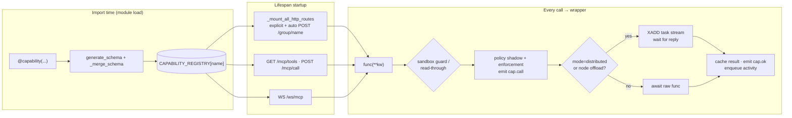

# 01 · Capability Framework


The `@capability` decorator is Vera's single registration primitive. Every
capability enters one in-process registry (`CAPABILITY_REGISTRY`), and Vera
derives its REST, MCP, WebSocket, DAG, UI and distributed-dispatch surfaces from
that one registration. Skills, ontologies, DAGs, pipelines and external MCP
servers are all defined as — or proxied through — capabilities, so there is one
registry, one event surface and one observability layer regardless of where the
underlying work runs.

The framework lives in `vera/capability_orchestration.py` (decorator, registry,
schema generation, HTTP mounting, MCP endpoints, WebSocket, Redis dispatch,
event emission, activity recording, scheduler and module loader), with the
Capability Contract v2 projection, shadow resolver and policy layers in
`vera/capability_contract_core.py`, `vera/capability_resolver_core.py`,
`vera/capability_policy_core.py` and `vera/capability_enforcement.py`. The
registry has two complementary layers: the original entry remains the
execution source of truth, while Contract v2 projects a machine-readable
description of canonical task, effects, lifecycle, output, policy, resources
and operational evidence. Resolvers and tool-using models can therefore
distinguish similar implementations without changing legacy dispatch. See
[Capability contracts](./43-capability-contracts.md) and
[Capability policy](./45-capability-policy.md).

**Maturity:** the decorator, registry, HTTP/MCP/WebSocket surfaces and
distributed dispatch are production paths used by every module. Contract v2,
shadow resolution and policy evaluation are shadow-first: they describe and
rank without granting authority, and policy enforcement is limited to one
explicitly enabled capability family (see
[§13](#13-the-capability-control-path)).

## Contents

- [Architecture at a glance](#architecture-at-a-glance)
- [Source map](#source-map)
- [1. The decorator](#1-the-decorator)
  - [Decorator parameters](#decorator-parameters)
  - [What happens at decoration time](#what-happens-at-decoration-time)
  - [What happens on every call](#what-happens-on-every-call)
  - [Naming convention](#naming-convention)
  - [The `trace_id` parameter](#the-trace_id-parameter)
- [2. The registry](#2-the-registry)
  - [Companion registries](#companion-registries)
  - [Duplicate names](#duplicate-names)
- [3. HTTP route mounting](#3-http-route-mounting)
  - [GET and POST handlers](#get-and-post-handlers)
  - [Other routes the orchestrator serves directly](#other-routes-the-orchestrator-serves-directly)
- [4. MCP interface](#4-mcp-interface)
  - [`GET /mcp/tools`](#get-mcptools)
  - [`POST /mcp/call`](#post-mcpcall)
  - [`WS /ws/mcp`](#ws-wsmcp)
  - [Invocation paths compared](#invocation-paths-compared)
- [5. MCP proxying](#5-mcp-proxying)
- [6. Distributed dispatch](#6-distributed-dispatch)
  - [Streams and consumer groups](#streams-and-consumer-groups)
  - [Placement: where a task may run](#placement-where-a-task-may-run)
  - [Staged offload of local capabilities](#staged-offload-of-local-capabilities)
  - [Timeouts](#timeouts)
  - [Cancellation](#cancellation)
- [7. Event emission](#7-event-emission)
  - [Event catalogue](#event-catalogue)
  - [Redis keys written by the wrapper](#redis-keys-written-by-the-wrapper)
  - [Named streams](#named-streams)
- [8. Activity recording](#8-activity-recording)
- [9. Schema generation and overrides](#9-schema-generation-and-overrides)
- [10. Built-in capabilities](#10-built-in-capabilities)
- [11. Module loading](#11-module-loading)
- [12. Common pitfalls](#12-common-pitfalls)
- [13. The capability control path](#13-the-capability-control-path)
  - [Policy shadow and enforcement](#policy-shadow-and-enforcement)
  - [Compatibility aliases](#compatibility-aliases)
  - [Removal eligibility](#removal-eligibility)
- [14. The agent registry](#14-the-agent-registry)
- [15. Worked examples](#15-worked-examples)
- [16. Troubleshooting](#16-troubleshooting)
- [See also](#see-also)

---

## Architecture at a glance



Any surface — REST, MCP, WebSocket, a DAG node, a scheduler job or another
capability calling `CAPABILITY_REGISTRY[name]["func"]` — goes through the same
wrapper, so events, retries, caching, policy projection and activity recording
are uniform.

## Source map

| File | Responsibility |
|---|---|
| `vera/capability_orchestration.py` | `@capability`, `CAPABILITY_REGISTRY`, `register_ui`, `UI_PANELS`, `generate_schema`/`_merge_schema`, `enum_schema`/`multi_enum_schema`, `emit_event`/`emit_stream`, `dispatch_task`/`worker_loop`/`reply_listener`/`result_listener`, `register_mcp_server`, `schedule`/`start_at_import`/`scheduler_loop`, `_mount_all_http_routes`, `lifespan` (backend connection + module loader), `/ws/mcp`, all built-in `obs.*`, `mcp.*`, `ollama.*`, `dag.*`, `sys.*` capabilities |
| `vera/workers/worker_placement_core.py` | Pure placement rules: which streams exist, which caps a node worker may run, offload stages, reply-stream naming |
| `vera/capability_contract_core.py` | Capability Contract v2 projection, lint, coverage, gate and observation schemas |
| `vera/capability_resolver_core.py` | Deterministic, non-executing shadow resolution over contract manifests |
| `vera/capability_policy_core.py` | Content-free policy shadow verdicts (`evaluate_policy_shadow`) |
| `vera/capability_enforcement.py` | Bounded enforcement rollout (`VERA_POLICY_MODE`, `VERA_POLICY_ENFORCE_FAMILIES`), `PolicyEnforcementDenied` |
| `vera/capability_policy_eval_core.py` | Evaluator for the frozen adversarial policy-boundary corpus |
| `vera/approval_receipts.py` | Signed, scope-bound approval receipts and the trusted policy context the wrapper reads |
| `vera/sandbox_guard.py` | Dev-sandbox estate guard and the read-through allow policy used by the wrapper |
| `vera/capabilities/cap_hub_capabilities.py` | The Capabilities tab (`cap-hub`) and the reusable `<vera-cap-list>`, `<vera-cap-search>`, `<vera-activity-track>`, `<vera-mcp-servers>`, `<vera-job-stream>` elements; `caps.source` |
| `vera/capabilities/cap_tracking.py` | Runtime configuration of which groups/caps are recorded into the activity chain (`cap_tracking.*`) |
| `vera/capabilities/capabilities.py` | The core LLM/model capability group (first module loaded) |
| `vera/registry/registry_core.py`, `registry_capabilities.py` | The agent registry — external skills, tools, loops, techniques and agent harnesses ([§14](#14-the-agent-registry)) |
| `vera/inventory/deprecation_inventory.py` | Payload-free usage evidence for compatibility aliases |

---

## 1. The decorator

```python
from Vera.vera.capability_orchestration import capability, enum_schema

@capability(
    "math.add",
    http_method="POST", http_path="/math/add",
    description="Add two numbers. Inputs: a (int!), b (int=5). Output: {sum}.",
)
async def math_add(a: int, b: int = 5, trace_id=None):
    return {"sum": a + b}
```

### Decorator parameters

The full signature (keyword-only after `name`):

| Parameter | Type / default | Effect |
|---|---|---|
| `name` | `str` (required) | Registry key. Dot-grouped; the text before the first dot is the **group**. |
| `mode` | `"local"` | `"local"` runs in-process (subject to node offload, [§6](#staged-offload-of-local-capabilities)); `"distributed"` always queues the call on a Redis task stream and waits for a worker's reply. MCP proxies are registered with `mode="proxy"`. |
| `retries` | `0` | Extra attempts after a failure. Total attempts = `retries + 1`, with `0.5 × attempt` s back-off. A policy denial is never retried. |
| `streams` | `None` | Names of streams the **result is published to** after each successful call (`emit_stream`, see [Named streams](#named-streams)). It is not a subscription list. |
| `description` | `None` → function docstring | Shown in `/mcp/tools`, the Capability Hub, OpenAPI summaries (first 120 chars) and LLM tool lists. |
| `tags` | `None` → `[group]` | Free tags; also used as OpenAPI tags for auto-mounted routes. |
| `memory` | `"on"` | `"on"` records the call into the activity graph when it has a session; `"off"` opts out. Legacy `"auto"` is accepted and treated as `"on"`. |
| `silent` | `False` | Suppresses `cap.call`/`cap.ok` events, the panel activity mirror, policy projection and activity recording. Use for polling and health caps. `cap.error` is **always** emitted. |
| `redact_args` | `None` | Argument names replaced by `[redacted]` before they reach events, Redis caches, worker activity records or the memory graph. |
| `redact_result` | `False` | Replaces the result with `[redacted]` in previews, the Redis result cache and activity records. The caller still receives the real result. |
| `schema` | `None` | JSON-Schema fragment deep-merged over the auto-generated schema ([§9](#9-schema-generation-and-overrides)). |
| `http_method` | `None` | `"GET"`, `"POST"`, `"PUT"` or `"DELETE"`. With `http_path`, mounts an explicit route. |
| `http_path` | `None` | e.g. `"/dag/run"`. Without it the cap is still auto-mounted at `POST /<group>/<rest>` ([§3](#3-http-route-mounting)). |
| `http_tags` | `None` → first path segment, else `[group]` | OpenAPI tags for the explicit route. |
| `mcp_expose` | `True` | `False` hides the cap from `GET /mcp/tools` (used by `mcp.tools` and `mcp.call` themselves). It remains callable. |
| `contract` | `None` | Capability Contract v2 declarations (canonical task, effects, approval, resources, …). Stored as `entry["contract"]`; feeds the policy shadow on every non-silent call. |
| `compatibility_alias_for` | `None` | Names the canonical capability this one is a compatibility surface for. Must differ from `name` and match `[A-Za-z0-9][A-Za-z0-9._:/-]{0,255}`, otherwise `ValueError` is raised at import. Sets `source="alias"`. |

Helpers exported beside the decorator:

| Helper | Purpose |
|---|---|
| `enum_schema(**choices)` | Builds a `schema=` override declaring single-select `enum`s: `enum_schema(engine=["", "kokoro", "coqui"])`. A dict value adds extra keys: `enum_schema(mode={"enum": [...], "description": "..."})`. |
| `multi_enum_schema(**choices)` | Array-of-enum (multi-select) args; annotate the parameter `List[str]`. |
| `enum_options(prop)` | Returns a property's declared options (single or multi). |
| `register_ui(...)` | Registers a harness panel ([Harness UI](./02-harness-ui.md#2-panel-registration)). |
| `schedule(fn, interval, name=None, skip_in_sandbox=False, singleton=False)` | Registers a periodic job. |
| `start_at_import(fn, name, queue=False)` | Runs a module's one-time startup now, subject to the same worker rules as `schedule`. |
| `emit_event(event)`, `emit_stream(name, trace_id, payload, capability)`, `subscribe_stream(name, cb)` | Event and stream publishing ([§7](#7-event-emission)). |
| `register_shutdown_hook(fn)` | Coroutine run during shutdown (idempotent). |

Enums flow everywhere: `/mcp/tools`, the Capability Hub auto-form (renders a
`<select>`), and LLM-facing signatures, which render parameters as
`name:type`, `name:type!` (required), `name:type=a|b|c` (enum, first 12 shown)
or `name:[str]=a|b|c` (multi-select).

### What happens at decoration time

1. `generate_schema(func)` derives a JSON Schema from the real signature
   ([§9](#9-schema-generation-and-overrides)).
2. If `schema=` is passed, `_merge_schema` deep-merges it over the auto schema.
3. The group (`name.split(".")[0]`), redaction set and alias are computed; an
   invalid alias raises `ValueError`, which removes the whole module at load.
4. The function is wrapped (see below) and the entry is written to
   `CAPABILITY_REGISTRY[name]`.
5. HTTP route metadata is recorded but **not mounted** — mounting happens once
   in lifespan after all modules have loaded, so modules can load in any order
   and `cap["http_method"]` can be changed after decoration.

### What happens on every call

The wrapper (`wrap(**kw)`) runs these steps, in order, for every invocation
path:

1. **Sandbox estate guard.** Inside a dev sandbox (`VERA_IS_DEV_SANDBOX=1`),
   capabilities on the estate guard's deny list (pool pruning, promotion,
   branch deletion and similar) return a refusal immediately — no events, no
   retries.
2. **Read-through.** In a serving sandbox whose read-through URL has been armed
   at lifespan, a capability allowed by `sandbox_guard.read_through_allowed`
   (read-only estate readings) is answered by production over HTTP instead of
   locally, unless the call passes `_local=True`.
3. **Trace id.** `trace_id` is popped from the kwargs or a new UUID is minted.
4. **Alias usage evidence.** For a compatibility alias called over HTTP or
   `/mcp/call`, payload-free usage evidence is recorded; failure never fails
   the call.
5. **Trigger chain.** The syslog module's trigger chain supplies
   `session_id`, `trigger_id` and `trigger_cap` when the caller did not.
6. **Policy shadow** (non-silent caps only). `evaluate_policy_shadow(name,
   contract, context)` and `enforcement_projection(...)` produce a verdict that
   is attached to the `cap.call` event as `policy`. If enforcement is enabled
   for this capability and the verdict is not `allow`, a `cap.denied` event is
   emitted and `PolicyEnforcementDenied` is raised (HTTP 403).
7. **`cap.call` event** and the panel activity mirror (non-silent caps).
8. **Dispatch decision.** A `mode="distributed"` cap — or a local cap the node
   offload selects — is queued with `dispatch_task` and awaited with
   `wait_for_result` ([§6](#6-distributed-dispatch)). Otherwise the raw
   function is awaited directly, with kwargs filtered to what its signature
   accepts (`_filter_kwargs_for_func`; a `**kwargs` function receives
   everything) so an unexpected key never raises `TypeError`.
9. **Streams.** For each name in `streams`, the result is published with
   `emit_stream`.
10. **Result cache.** A preview (first string among `text`, `response`,
    `content`, `summary`, `result`, `status`, `job_id`, `error`, `path`,
    `name`, truncated to 200 chars) and up to 4 KB of the result are cached in
    Redis — for **all** caps, silent ones included.
11. **`cap.ok` event** (non-silent), then **activity enqueue** when the call has
    a session, `memory != "off"` and the cap is not silent
    ([§8](#8-activity-recording)).
12. **On exception:** the error (never empty — message-less exceptions are
    named by type), its full traceback and an argument preview are cached and
    emitted as `cap.error`; the wrapper sleeps `0.5 × attempt` s and retries
    until `retries` is exhausted, then re-raises the last error.

### Naming convention

Names are dot-grouped: `group.subgroup.action`. The group (everything before
the first dot) is used for OpenAPI tags, activity skip lists, panel activity
mirroring, harness filtering, stats grouping and auto-mounted paths. Put the
reading word in the name of a read (`.status`, `.list`, `.get`, `.history`,
`.summary`) — dev sandboxes read through GET routes from production, and UI
mappings treat such names as reads.

Common groups:

| Group | Purpose |
|---|---|
| `mcp` | MCP protocol endpoints (`mcp.tools`, `mcp.call`, `mcp.servers`, `mcp.register_server`) |
| `obs` | Observability (`obs.health`, `obs.workers`, `obs.cluster`, `obs.events`, `obs.modules`, …) |
| `cap` | Contract, resolver and policy inspection (`cap.contract.*`, `cap.resolve.shadow`, `cap.policy.*`) |
| `dag` | DAG planning and execution (`dag.run`, `dag.plan`, `dag.plan_and_run`) |
| `run`, `workflow`, `interop`, `eval` | Run shadow projections, Workflow IR, interoperability conformance, evaluation corpora |
| `ui` | Harness UI integration (`ui.panels`, `ui.theme.*`, `ui.panel.*`) |
| `llm`, `ollama`, `media` | LLM routing, Ollama node/routing management, media (STT/TTS/image) nodes |
| `cluster` | Ollama cluster info and control |
| `memory`, `fabric` | Memory graph; data fabric ingest, query, sources |
| `web`, `research` | Web search/fetch/crawl; research pipelines and recall |
| `ide`, `agent` | IDE workspace/code/agents; chat agents, presets, voice |
| `sys` | Dev-mode process controls (`sys.dev.*`, `sys.env.*`) |
| `registry` | The agent registry ([§14](#14-the-agent-registry)) |

### The `trace_id` parameter

Every capability should accept `trace_id=None`. The wrapper pops it from the
caller's kwargs (or mints `new_id()`), threads it through every event it emits,
the Redis result cache and the activity record, and passes it to the function
only if its signature accepts it. A single logical operation can therefore be
reassembled from the event stream by `trace_id`.

---

## 2. The registry

`CAPABILITY_REGISTRY` is a single in-process `dict`. An entry written by the
decorator looks like this:

```python
{
    "math.add": {
        "func":          <wrapped async function>,   # what every caller invokes
        "raw":           <original async function>,  # what a worker executes
        "schema":        {"type": "object", "properties": {...}, "required": [...]},
        "description":   "Add two numbers...",
        "streams":       [],
        "mode":          "local",          # "local" | "distributed" | "proxy"
        "retries":       0,
        "tags":          ["math"],
        "source":        "local",          # "local" | "alias" | "mcp_proxy"
        "compatibility_alias_for": "",
        "mcp_expose":    True,
        "memory":        "on",
        "silent":        False,
        "redact_args":   [],
        "redact_result": False,
        "contract":      {},               # deep copy of contract=
        "http_method":   "POST",
        "http_path":     "/math/add",
        "http_tags":     ["math"],
    },
}
```

MCP proxy entries ([§5](#5-mcp-proxying)) additionally carry `server` and
`server_url`, use `mode="proxy"` and `source="mcp_proxy"`, and have no HTTP
route.

Anything that needs a capability looks it up by name: the harness through
`GET /mcp/tools`, the DAG engine for schemas, agent toolkits for descriptions
and signatures, contract projection for metadata. `raw` is the unwrapped
function, used by the distributed worker path (where the wrapper's events and
retries would duplicate the dispatcher's own) and by modules that call a
sibling capability without generating events.

### Companion registries

| Object | Contents | Read through |
|---|---|---|
| `UI_PANELS` | `register_ui` entries (id, label, icon, html, js, ui_caps, mode, tab_order, specialist bindings, sections, options) | `GET /ui/panels` |
| `MCP_SERVERS` | `{server_name: base_url}` of registered MCP proxies | `GET /mcp/servers` |
| `WORKER_REGISTRY` | This process's workers; mirrored to Redis `vera:workers:<id>` | `GET /workers` |
| `LOADED_MODULES` | `{name, path, caps_added, status}` per attempted module import | `GET /modules` |
| `SCHEDULED_TASKS` | `{fn, int, name, last, runs, skip_in_sandbox, singleton}` | `GET /scheduler` |
| `PENDING_RESULTS` | `task_id → Future` for dispatched calls awaiting a reply | `GET /pending` |
| `STREAM_SUBS` | In-process `emit_stream` subscribers | — |

### Duplicate names

The decorator does not guard against re-registration: a later
`@capability("x")` simply replaces the earlier entry, and the route mounted at
lifespan is the last one registered. Several `ui.*` theme and panel
capabilities are, for example, declared both in `vera/ui builder/ui_capabilities.py`
and in `vera/chat/chat_panels_capabilities.py`; the later module in the load
order (the chat panel module) wins. Keep names unique, and when moving a
capability between modules delete the old declaration.

---

## 3. HTTP route mounting

Routes are mounted once, in `lifespan`, by `_mount_all_http_routes(app)` after
every module has loaded:

1. **Pass 1 — explicit routes.** Every entry with both `http_method` and
   `http_path` is mounted with `app.add_api_route(path, handler,
   methods=[method], tags=http_tags, summary=description[:120])`. `/mcp/call`
   receives its own handler ([§4](#post-mcpcall)); other `GET` routes get the
   GET handler, everything else the POST handler.
2. **Pass 2 — automatic routes.** Every remaining capability, except MCP
   proxies, is mounted at `POST /<name with dots replaced by slashes>` — for
   example `registry.sync_skill` is also reachable at `POST /registry/sync_skill`
   if it had no explicit route. A path already claimed in pass 1 is skipped.

So **every local capability is reachable over HTTP**: explicitly where it
declares a route, otherwise at its automatic `POST` path, and always through
`POST /mcp/call`. The startup log reports `HTTP routes mounted: <n> explicit,
<n> auto-POST`.

### GET and POST handlers

| Aspect | GET handler | POST handler |
|---|---|---|
| Arguments | Query string; values coerced from the schema type (`integer`, `number`, `boolean` from `true`/`1`/`yes`, else string) | Raw JSON body (empty body = no arguments) |
| Unknown keys | Passed through (the wrapper filters to the signature) | Dropped unless the function takes `**kwargs` |
| `trace_id` | Always a new id (query `trace_id` ignored) | Body `trace_id`, else a new id |
| Context | `CURRENT_HTTP_CAP` is set to the capability name for the call, so a cap can tell a direct HTTP/UI call from an internal one | same |
| `Response` results | Returned unchanged (HTML panels, streaming responses, plain text) | same |
| JSON results | Sanitised off the event loop; bodies over 1 MiB are streamed in 256 KiB chunks | same |
| Errors | `HTTPException` passes through; `PolicyEnforcementDenied` → 403; anything else → 500 `"<Type>: <message>"` | same, plus client disconnect → 499 |

### Other routes the orchestrator serves directly

A few routes are not capabilities because they cannot be (or are pure static
serving): `GET /` (the harness HTML), `WS /ws/mcp`, `POST /dag/hitl/respond`,
`POST /dag/plan_stream`, `GET /ui/panels/file/{name}_panel.html` (whitelisted
panel files), `GET /ui/panel/window?id=` (any registered panel as a standalone
page), and the panel HTML routes under `/ui/panels/*`. An HTTP middleware
injects `window.__VERA_DOMAIN__` and `window.__VERA_BASE__` into every HTML
response ([Configuration](./10-configuration.md#2-network-hosts-and-tls)).
New code should not add `@APP.get`/`@APP.post` routes for anything that is an
operation — declare a capability with `http_method`/`http_path` instead.

---

## 4. MCP interface

### `GET /mcp/tools`

Returns the manifest of every capability with `mcp_expose=True`:

```json
[
  {
    "name": "math.add",
    "description": "Add two numbers...",
    "schema": {"type": "object", "properties": {"a": {"type": "integer"}, "b": {"type": "integer", "default": 5}}, "required": ["a"]},
    "mode": "local",
    "source": "local",
    "streams": [],
    "tags": ["math"]
  }
]
```

`mcp.tools` and `mcp.call` are themselves `mcp_expose=False`, so a client cannot
recurse through them.

### `POST /mcp/call`

```json
{
  "name": "math.add",
  "arguments": {"a": 1, "b": 2},
  "trace_id": "optional",
  "session_id": "optional",
  "caller_kind": "optional, e.g. claude or codex"
}
```

Response:

```json
{"type": "tool_result", "tool_name": "math.add", "trace_id": "...", "content": {"sum": 3}}
```

The dedicated handler (`_make_mcp_call_handler`) adds behaviour the generic
POST handler does not have:

- **Argument filtering.** Arguments outside the capability's schema are
  dropped and logged (`dropped argument(s) the capability does not accept`).
  A capability whose function ends in `**kwargs` and names a delegate via a
  `delegates_to` attribute has its accepted set widened by the delegate's
  schema.
- **Type coercion.** Schema-declared numbers accept strings, including unit
  suffixes (`"300s"`, `"10ms"`, `"5m"`, `"2kb"` → the number); booleans accept
  `true`/`1`/`yes`/`on`; arrays and objects accept JSON strings; strings accept
  any scalar.
- **Session plumbing.** A top-level `session_id` (or one inside `arguments`) is
  injected only when the capability declares `session_id`, and is set on the
  syslog trigger chain so nested capability calls inherit it.
- **Caller attribution.** `caller_kind` sets `CALLER_KIND` for the call (stored
  as `via` on events and on `vera:cap:recent`). `MCP_CALL_ACTIVE` is set by the
  server, not the request, and marks the call as MCP-transported.
- **Sandbox gate credential.** An `X-Vera-Sandbox-Gate` header is placed in a
  context variable for the narrow sandbox gate operations; it never travels in
  capability arguments.
- **Errors.** Missing `name` or invalid JSON → 400; unknown capability → 404
  (a sandbox first tries read-through for an allowed read); policy denial →
  403; other failures → 500.

`arguments` may also be a JSON string. `mcp.call` is itself a capability, so it
can be invoked from the WebSocket or a DAG with `name` and `arguments`.

### `WS /ws/mcp`

The persistent WebSocket. On connection the server sends:

```json
{
  "type": "connected",
  "client_id": "abcd1234",
  "capabilities": ["math.add", "..."],
  "servers": ["external"],
  "ollama_instances": {"gpu-250": {"label": "...", "has_gpu": true, "status": "online"}},
  "mode": "distributed"
}
```

`mode` is `"distributed"` when Redis is connected, otherwise `"local"`. Each
connection has a single writer task and a bounded outbound queue
(`WS_OUT_QUEUE_MAX`, default 2000), so a slow client cannot stall event
producers. Client actions:

| Action | Message | Reply |
|---|---|---|
| `call` | `{"action":"call","name":"...","arguments":{...},"trace_id":"..."}` | `tool_result` `{tool_name, trace_id, content}` or `error` `{tool_name, trace_id, message}`. A `session_id` inside `arguments` becomes the process's current session. |
| `subscribe_events` | `{"action":"subscribe_events"}` | `subscribed` `{stream:"__events__"}`, then every event as `{"type":"event","data":{...}}` |
| `subscribe` | `{"action":"subscribe","stream":"tokens"}` | `subscribed`, then `{"type":"stream","data":{stream, trace_id, capability, payload, ts}}` for that named stream |
| `unsubscribe` | `{"action":"unsubscribe","stream":"..."}` | `unsubscribed` |
| `dag_run` | `{"action":"dag_run","dag":[...],"state":{...},"supervised":false}` | `dag_result` `{trace_id, result}` |
| `plan_and_run` | `{"action":"plan_and_run","goal":"..."}` | `planning`, `plan_ready` `{plan}`, then `dag_result` |
| `register_server` | `{"action":"register_server","url":"...","name":"..."}` | `server_registered` `{name, capabilities}` |
| `ollama_instances` | `{"action":"ollama_instances"}` | `ollama_instances` `{instances}` |
| `ping` | `{"action":"ping"}` | `pong` `{ts}` |

The harness opens one WebSocket and sends `subscribe_events`; that feed powers
the live event sidebar, syslog and panel activity strips. Uvicorn's WebSocket
keep-alive is `VERA_WS_PING_INTERVAL` (20 s) / `VERA_WS_PING_TIMEOUT` (75 s).

### Invocation paths compared

| Path | Entry | Policy shadow / events | Session source | Notes |
|---|---|---|---|---|
| Explicit REST route | `http_method` + `http_path` | yes (via wrapper) | body/query `session_id` if declared, else trigger chain | `CURRENT_HTTP_CAP` set |
| Auto REST route | `POST /<group>/<rest>` | yes | same | every local cap without an explicit route |
| `POST /mcp/call` | name + arguments envelope | yes | top-level or argument `session_id` | coercion, `caller_kind`, alias evidence |
| `WS /ws/mcp` `call` | WebSocket message | yes | `arguments.session_id` | result streamed back on the socket |
| Python | `CAPABILITY_REGISTRY[n]["func"](**kw)` | yes | trigger chain / current session | how DAG nodes and most modules call each other |
| Python, raw | `CAPABILITY_REGISTRY[n]["raw"](**kw)` | **no** | — | bypasses events, retries, caching, policy; use sparingly |
| Distributed | wrapper → task stream → worker → `raw` | events on the caller; worker emits `worker.*` | travels in the payload | [§6](#6-distributed-dispatch) |

---

## 5. MCP proxying

Vera can proxy another MCP-style server's capabilities into its own registry:

```python
await register_mcp_server("http://other-server:8000", "external")
```

or `POST /mcp/servers/register {"url": "...", "name": "external"}`
(`mcp.register_server`), or the WebSocket `register_server` action. The call
fetches `GET <url>/mcp/tools` (10 s timeout) and registers each tool as
`<server_name>.<tool_name>` with `mode="proxy"`, `source="mcp_proxy"`,
`tags=["proxy", server_name]` and the remote schema/description. Calls are
forwarded to `POST <url>/mcp/call` (60 s timeout) with the remote tool's own
name. A `mcp_server.registered` event lists the registered tools. Proxied
capabilities are not wrapped (no `cap.*` events) and get no local REST route;
the harness flags them with a `proxy` badge. The MCP catalog module
(`vera/mcp/mcp_catalog_capabilities.py`) uses the same function for servers it
manages.

---

## 6. Distributed dispatch

When a call is dispatched — because the capability is `mode="distributed"`, or
a local capability is offloaded to a node worker — the wrapper:

1. Calls `dispatch_task(name, kwargs, trace_id, bg=...)`, which `XADD`s a record
   `{id, capability, payload (JSON), trace_id, ts, reply_to[, bg]}` onto the
   stream chosen by placement (approximate `maxlen` 5000). `reply_to` is this
   process's own reply stream. `bg` carries the background-LLM label because
   context variables do not cross Redis.
2. Awaits `wait_for_result(task_id, timeout)`, a future registered in
   `PENDING_RESULTS`. On timeout the call returns
   `{"error": "timeout", "task_id", "timeout_s"}` rather than raising.

Without Redis, `dispatch_task` runs the raw function as a local task instead.

### Streams and consumer groups

| Key | Kind | Purpose |
|---|---|---|
| `vera:tasks` | stream, group `workers` | Shared legacy task stream (group created at `$`) |
| `vera:tasks:host` | stream, group `workers` | Tasks only the Vera host may run; node workers never read it |
| `vera:tasks:cls:<class>` | stream, group `workers` | Per-class task streams for node workers (group created at `0`) |
| `vera:results:p:<process>` | stream | Per-process reply stream, read with plain `XREAD` by `reply_listener`; expires after `REPLY_TTL_S` (3600 s) |
| `vera:results` | stream, group `orchestrator` | Shared result stream for records without `reply_to`; each host reads it as consumer `host-<hostname>` and resolves only futures it owns, ACKing everything |
| `vera:workers:<worker_id>` | hash, 120 s TTL | Worker registration: role (`host`/`node-worker`), status, classes, streams, advertised capabilities, counters, host, pid, current task, commit |
| `vera:node_activity` | stream | One record per worker task (service `worker`), with the capability's redaction applied |
| `vera_task_results` | Postgres table | Task results archived by the host (not by dev sandboxes) |

Every worker executes the capability's `raw` function, emits `worker.start`,
`worker.done`, `worker.error` or `worker.cancelled`, and posts
`{id, result}` or `{id, error}` to the record's `reply_to` stream (or the shared
result stream). A worker that does not hold a capability hands the task to a
worker that advertises it.

### Placement: where a task may run

`vera/workers/worker_placement_core.py` decides, by allow-list, which
capabilities a node worker may execute. Node-safe namespaces are `llm`, `nlp`,
`text`, `math`, `http`, `memory` and `echo`, plus a few vetted single caps
(`gpu.health`, `stt.transcribe`, `tts.synthesize`, `tts.voices`,
`data.json_validate`, `data.json_flatten`, `system.timestamp`). A name whose
last segment is a mutator (`set`, `config`, `configure`, `enable`, `disable`,
`reset`, `reload`, `register`, `unregister`, `save`, `delete`) or that contains
`.config.` is host-only even inside a node-safe namespace. Everything else is
queued on `vera:tasks:host`. Two environment variables adjust this without a
release: `VERA_WORKER_NODE_OK` (namespaces or exact names to admit) and
`VERA_WORKER_HOST_ONLY` (namespaces or exact names to force onto the host; wins
over everything). A node worker's classes come from the roles registry
(`vera:node_workers:roles`, keyed by `VERA_WORKER_HOST_ID`), else
`VERA_WORKER_CLASSES`, else the CPU default (`general`, `nlp`). A process runs
as a node worker when `VERA_IS_WORKER` is truthy; it then runs no periodic
scheduler jobs and only the allow-listed startup hooks. See
[Workers, jobs and syslog](./22-workers-jobs-syslog.md).

### Staged offload of local capabilities

A `mode="local"` capability can still be offloaded. When
`vera:node_workers:dispatch` holds `{"stage": n, "exclude": [...]}` with
`n > 0`, the wrapper offloads a call only if its class is enabled at that
stage, its arguments are JSON-serialisable, the caller is not itself a worker
or a dev sandbox, and a node worker of that class is **idle right now** (one
task per worker); otherwise it runs locally exactly as before. Stages are
cumulative:

| Stage | Name | Offloaded classes |
|---|---|---|
| 0 | idle | none (idle-queue jobs only) |
| 1 | nlp | `nlp` |
| 2 | compute | `nlp`, `general` (not `llm`) |
| 3 | llm | `nlp`, `general` including `llm.*` |
| 4 | media | adds `media` (STT/TTS) |
| 5 | full | every node-safe class |

### Timeouts

The wait budget is the payload's `_timeout` (seconds) if given, else
`_cap_timeout(name)`:

| Capability / prefix | Timeout (s) |
|---|---|
| `llm.generate`, `llm.chat` | 300 |
| `llm.summarize`, `llm.analyze`, `llm.code_review` | 240 |
| `llm.translate`, `llm.classify` | 180 |
| other `llm.*` | 240 |
| `research.run`, `research.report`, `research.parallel`, `research.deep`, other `research.*` | 60 |
| `dag.run`, `dag.plan_and_run` | 600 |
| `dag.from_goal` | 180 |
| `browser.click`, `browser.form` | 120 |
| `browser.screenshot`, `browser.content`, `browser.reader`, other `browser.*` | 90 |
| `memory.search` | 30 |
| `memory.bulk_store` | 120 |
| `exec.*` | 300 |
| `ml.*` | 600 |
| `ide.*` | 120 |
| anything else | 60 |

### Cancellation

`cluster.job.stop` publishes a task id on the `vera:cancel` channel and adds it
to the `vera:cancelled` set. `cancel_listener` cancels a matching running task
in this process; a worker checks the set before starting a queued task and
returns `{"error": "cancelled", "cancelled": true}`.

---

## 7. Event emission

`emit_event(event)`:

1. Sets `ts` if absent and stamps provenance: a compact git `{ver, br, dirty}`,
   the triggering session (`sid`) and caller kind (`via`) when known, and for
   `ollama.*` events the submitting Vera process (`origin: {kind: prod|sandbox,
   node, host}`).
2. Schedules a snapshot into the shared Run read model (shadow only).
3. `XADD vera:events` (maxlen 5000); `code.author.timing` events are also kept
   on `vera:stream:code.author.timing` (maxlen 500).
4. `PUBLISH vera:events:live` for zero-latency subscribers (the agent-loop SSE
   bridge listens here).
5. Persists agent-loop events for resume (`vera:loop:history:*`, TTL
   `VERA_RESUME_TTL`, at most `VERA_RESUME_MAX_EVENTS` per run).
6. Enqueues `{"type":"event","data":event}` to every WebSocket subscribed with
   `subscribe_events`.

A Redis failure is logged at debug level and never fails the caller.

### Event catalogue

Events emitted by the framework itself:

| Type | Fields | When |
|---|---|---|
| `cap.call` | `name, attempt, trace_id, session_id, trigger_id, trigger_cap, group, args_preview, policy` | Start of every non-silent attempt |
| `cap.ok` | `name, trace_id, session_id, group, elapsed_ms, preview` | Success of a non-silent call |
| `cap.error` | `name, error, error_type, args_preview, traceback, attempt, trace_id, session_id, trigger_id, trigger_cap, group, elapsed_ms` | Every failed attempt, silent caps included |
| `cap.denied` | `name, trace_id, session_id, group, policy` | Enforcement blocked the call |
| `worker.start` | `worker, capability, task` | A worker begins a task |
| `worker.done` / `worker.error` / `worker.cancelled` | `worker, task[, error]` | Worker outcome |
| `mcp_server.registered` | `name, tools, url` | MCP proxy registration |
| `backend.connected` | `backend` (`redis`, `postgres`, `chroma`, `neo4j`) | Backend connected at startup |
| `heartbeat` | `caps, workers` | Every 30 s (scheduler job `heartbeat`) |
| `supervision.checkpoint` | `step, action, decision` | Supervised DAG run checkpoints |
| `sys.env.set` | `key, value (redacted), restart` | Dev-mode `.env` edit |
| `registry.upsert` / `registry.delete` | `id[, kind, …]` | Agent registry writes |
| `cap_tracking.updated` | `scope` | Activity-tracking configuration changes |

Token streams are additionally cross-published to `vera:events:live` as
`stream.token` events (pub/sub only).

### Redis keys written by the wrapper

| Key | TTL / bound | Content |
|---|---|---|
| `vera:cap:result:<name>` | 300 s | Last result: `{name, trace_id, session_id, elapsed_ms, ts, preview, result (≤4096 chars)}` |
| `vera:cap:error:<name>` | 600 s | Last error: `{name, error, ts, trace_id, elapsed_ms}` |
| `vera:cap:recent` | sorted set, newest 500 | `{name, tid, sid, ts, elapsed_ms, via, bg, preview}` per call |
| `vera:panel:dispatch:<sid>` | pub/sub | `__cap_activity__` mirror for the session's open panel (disable with `PANEL_CAP_MIRROR=0`; groups `panel`, `chat`, `obs`, `health` are skipped) |

### Named streams

`emit_stream(name, trace_id, payload, capability)` publishes
`{stream, trace_id, capability, payload, ts}` to the pub/sub channel
`stream:<name>`, the Redis stream `vera:stream:<name>` (maxlen 500), WebSocket
clients subscribed to `name`, and in-process callbacks registered with
`subscribe_stream(name, cb)`. `GET /streams/history?name=<name>&limit=50`
(`obs.stream_history`) reads the Redis stream back.

---

## 8. Activity recording

When a non-silent call with `memory != "off"` has a session id, the wrapper
calls `_act_enqueue(...)`, a non-blocking put onto `_ACT_QUEUE` (bounded at
2000). The payload holds sanitised, size-bounded parameters (4 KB), the result
(8 KB) and a 400-character preview, with `redact_args`/`redact_result` applied.
Groups in `_ACT_SKIP_GROUPS` are rejected before the queue: `obs`, `health`,
`ollama`, `ui`, `mcp`, `memory`, `syslog`, `cluster`, `db`, `stream`, `caps`,
`session`, `fabric`, `agent` and `sandbox`.

The background `_activity_worker` drains the queue every 2 seconds (once the
data fabric module is loaded) and writes, per call:

- one **Memory graph node** (category `cap.<group>`, or `dag.step` for DAG
  steps) carrying both input and output — `text` (short hint), `full_text`
  (cap, trace, group, trigger, params, result) and structured `metadata`;
- a **`FOLLOWS_ACTIVITY`** edge from the previous chain step in the session.

The Neo4j backend links each node to its session with
`(:Session)-[:CONTAINS]->(:Memory)`. No `TRIGGERED_BY` edge is written (the
trigger id is a trace id, not a node id); trigger context stays in `metadata`.
The former per-call fabric dataset write has been removed.

The worker starts when the `cap_tracking` module has loaded (it is in the
default module list) or, if it has not, when `VERA_ACTIVITY_RECORDING=1`.
Recording is fire-and-forget: if Neo4j or the memory store is down, recording
degrades silently and the capability call never fails because of it.

`vera/capabilities/cap_tracking.py` makes the chain configurable at runtime:

| Capability | Route | Purpose |
|---|---|---|
| `cap_tracking.get_config` | `GET /cap_tracking/config` | Current group/cap tracking configuration |
| `cap_tracking.set_group` | `POST /cap_tracking/group` | Enable or disable a group |
| `cap_tracking.set_cap` | `POST /cap_tracking/cap` | Per-capability override |
| `cap_tracking.set_limits` | `POST /cap_tracking/limits` | Size limits |
| `cap_tracking.reset` | `POST /cap_tracking/reset` | Restore defaults |
| `cap_tracking.set_session` | `POST /cap_tracking/session` | Set the active session |
| `cap_tracking.chain_stats` | `GET /cap_tracking/stats` | Live chain statistics per session |

`begin_stream_activity`, `end_stream_activity` and `record_stream_activity`
let streaming endpoints that do not go through the wrapper record into the
same chain.

---

## 9. Schema generation and overrides

`generate_schema(func)` walks the signature, skipping `trace_id`, `self`,
`request`, `kwargs` and `stream_cb`:

| Parameter form | Schema |
|---|---|
| `int`, `float`, `bool`, `str`, `list`, `dict`, `bytes` | `integer`, `number`, `boolean`, `string`, `array`, `object`, `string` |
| `Optional[T]` / `Union[T, None]` | schema of `T`; never required |
| `List[T]`, `Tuple[...]`, `Set[T]` | `array` (with `items` when `T` resolves) |
| `Dict[K, V]`, `Mapping` | `object` |
| `Union[A, B]` | `anyOf` |
| `Any` | `{}` (no constraint) |
| String annotations (`from __future__ import annotations`) | resolved by name the same way |
| Unannotated with a typed default | inferred from the default (`limit=10` → `integer`) |
| Anything else | `string` |

A non-`None` default becomes `"default"`. A parameter is **required** only when
it has no default and is not `Optional`.

The `schema=` override is deep-merged by `_merge_schema`: per property, the
override's keys win (descriptions, `enum`, `format`, `minimum`, `examples`…)
while the auto-detected `type`/`items` fill in what it omits; override-only
properties are accepted; `required` is the union of both; other top-level keys
come from the override; `"type": "object"` is always set.

```python
@capability(
    "research.run",
    http_method="POST", http_path="/research/run",
    description="Run a research pipeline.",
    schema={
        "properties": {
            "query": {"type": "string", "description": "Natural-language research question."},
            "depth": {"type": "integer", "minimum": 1, "maximum": 5, "default": 3},
            "mode":  {"type": "string", "enum": ["single", "parallel", "deep"]},
        },
    },
)
async def cap_research_run(query: str, depth: int = 3, mode: str = "single", trace_id=None):
    ...
```

Prefer stating inputs and outputs in `description` too
(`Inputs: id (str!), limit (int=50). Output: {ok, entries[]}.`) — models read
the description, and the Capability Hub shows it verbatim.

---

## 10. Built-in capabilities

`capability_orchestration.py` declares these itself (all `memory="off"` unless
noted):

| Group | Capability → route |
|---|---|
| MCP | `mcp.tools` → `GET /mcp/tools`; `mcp.call` → `POST /mcp/call`; `mcp.servers` → `GET /mcp/servers`; `mcp.register_server` → `POST /mcp/servers/register` |
| Contracts & policy | `cap.contract.manifest` → `GET /cap/contracts`; `cap.contract.lint` → `GET /cap/contracts/lint`; `cap.contract.coverage` → `GET /cap/contracts/coverage`; `cap.contract.gate` → `POST /cap/contracts/gate`; `cap.contract.observations` → `GET /cap/contracts/observations`; `cap.resolve.shadow` → `POST /cap/resolve/shadow`; `cap.policy.shadow` (auto route); `cap.policy.enforcement.status` → `GET /cap/policy/enforcement` |
| Evaluation | `eval.corpus.inspect` → `GET /eval/corpus`; `eval.resolver.shadow` → `GET /eval/resolver/shadow`; `eval.ontology.decision` → `GET /eval/ontology/decision`; `eval.policy.boundary` → `GET /eval/policy/boundary`; `eval.run.telemetry` → `GET /eval/run/telemetry` |
| Observability | `obs.provenance` → `GET /obs/provenance`; `obs.health` → `GET /health`; `obs.neo4j_diag` → `GET /health/neo4j`; `obs.workers` → `GET /workers`; `obs.pending` → `GET /pending`; `obs.scheduler` → `GET /scheduler`; `obs.events` → `GET /events`; `obs.stream_history` → `GET /streams/history`; `obs.redis` → `GET /redis/inspect`; `obs.diagnostics` → `GET /diagnostics`; `obs.modules` → `GET /modules`; `dash.health.summary` → `GET /dash/health/summary`; `topology.snapshot` → `GET /topology/snapshot`; `activity.ping` → `POST /activity/ping`; `health.check` → `GET /debug/health` |
| Ollama nodes & routing | `ollama.instances`, `ollama.add_instance`, `ollama.node.config`, `ollama.ping_instance`, `ollama.pull`, `ollama.model_ctx`, `ollama.request_log`, `ollama.route_stats`, `ollama.embed_config`, `ollama.embed_config_set`, `ollama.gate.status`, `ollama.interactive.get/set`, `ollama.routing.get/save`, `ollama.profile.activate/delete`, `ollama.model_tags.get/set`, `ollama.cap_routing.get/save/delete`, `ollama.role_profiles.get/save/delete`, `llm.route` → `POST /llm/route`, `llm.route.resolve` → `GET /llm/route/resolve`, `cluster.instance_update` → `POST /cluster/instance/update` (see [Ollama Cluster](./04-ollama-cluster.md)) |
| Media nodes | `media.nodes` → `GET /media/nodes`; `media.node.add`, `media.node.remove`, `media.node.config`, `media.ping` |
| DAG | `dag.run` → `POST /dag/run` (`memory="on"`); `dag.plan` → `POST /dag/plan`; `dag.plan_and_run` → `POST /dag/plan_and_run` |
| Runs & workflow IR | `run.shadow.list/graph/get/export`, `run.telemetry.preview/status/export`, `workflow.ir.import_dag/export_dag/validate/migrate/adapters/gaps`, `workflow.durability.fixture/gaps/dbos_mapping/temporal_paper`, `interop.a2a.conformance` — inspection-only (see [Interoperability foundations](./46-interoperability-foundations.md)) |
| UI | `ui.panels` → `GET /ui/panels`; `ui.panel.specialist` → `GET /ui/panel/specialist`; `caps.specialist` → `GET /caps/specialist` |
| Dev mode | `sys.dev.restart` → `POST /sys/dev/restart`; `sys.dev.stop` → `POST /sys/dev/stop`; `sys.env.get` → `GET /sys/env/get`; `sys.env.set` → `POST /sys/env/set` — all require `VERA_DEV_MODE=1` and (for writes) `confirm=true` |
| Debug | `echo` → `POST /debug/echo` |

Other capability groups come from the modules loaded at startup
([§11](#11-module-loading)); `obs.cluster` (`GET /cluster`), for instance, is
declared in `vera/workers/cluster.py`. The Capability Hub module adds
`cap_hub.panel` (`GET /cap_hub/panel`), `cap_hub.elements_js`
(`GET /cap_hub/elements.js`) and `caps.source` (`GET /caps/source`, the Python
source of a named capability).

---

## 11. Module loading

At lifespan startup the orchestrator loads companion modules from an
**explicit, ordered list** (`_module_files`, about 200 paths relative to
`vera/`) with `importlib`. Each module registers its content as a side effect
of import: `@capability` functions, `register_ui()` panels, `schedule()` jobs
and `start_at_import()` startups. Representative order:

1. `capabilities/capabilities.py`, `capabilities/cap_hub_capabilities.py`,
   `capabilities/cap_tracking.py`
2. Memory and fabric: `fabric/memory.py`, `fabric/memory_hooks.py`,
   `fabric/data_fabric_collectors.py`, `fabric/data_fabric.py`, …
3. Skills, DAG store and workshop, loop profiles and orchestrator, agents
4. Workers, cluster, syslog, UI elements, UI builder, IDE, research, web,
   telegram, dream, execution, Proxmox, VFS, monitor, provisioning, estate,
   security, remote, browser, vLLM, catalog, ML, markets, mesh, build, board,
   census, agent runtimes (OpenClaw, smolagents, LangGraph, PydanticAI, agent
   bridges), providers, chat panels, activity, worldview, NLP, models,
   accounts, calendar, email, render, media, characters, podcast, commerce,
   business, the agent registry, widgets, UI directives/scripts/libs,
   planning, system inventory, performance timing, MCP catalog, n8n, Home
   Assistant, platforms, syscomms, automations, evolve/Loop Lab, operator,
   integrations, Godseye, PWA
5. `vera_graph_panels.py` last

Rules:

- **Order matters** — modules others depend on (memory, fabric, cluster) load
  first.
- Each file is imported under its **bare filename** as the module name; a
  `sys.modules` guard means each name loads at most once (a second file with
  the same basename is skipped).
- `VERA_MODULES="path1.py,path2.py"` appends extra paths to the end of the list
  without editing the core.
- A missing file logs `Module not found (skipping)`. A module that raises is
  logged with its traceback and recorded as `status: "error: …"`; loading
  continues. A successful load logs `✓ <module> caps=<total> ui_panels=<total>`.
- `GET /modules` (`obs.modules`) and the Capability Hub's Modules page list
  every attempt with `caps_added` and status.

After loading, the activity worker starts ([§8](#8-activity-recording)) and
`_mount_all_http_routes` mounts every route ([§3](#3-http-route-mounting)).

Startup hooks must use `schedule(fn, interval=STARTUP_INTERVAL)` (999999) or
`start_at_import(fn, name)`: both are judged by name against the node-worker
allow-list, so a node worker does not start pollers, proxies or sweeps a second
copy of the host would duplicate.

---

## 12. Common pitfalls

- **`interval=0` in the scheduler** fires on every scheduler tick (once per
  second). Pass a very large interval such as `STARTUP_INTERVAL` (999999) for a
  one-time job, or do not call `schedule()`.
- **`memory="auto"`** is a legacy value, accepted and treated as `"on"`.
- **Don't call `record_cap_interaction`** (or `patch_capability_for_memory` /
  `patch_new_cap`) — they are deliberate no-op shims kept for older importers.
  Activity recording is handled inside the wrapper.
- **Don't reach for `@APP.get`/`@APP.post`** for operations — use
  `@capability(http_method=..., http_path=...)` so the operation is uniformly
  available through every interface, observable and policy-projected.
- **HTTP routes don't exist until lifespan startup**, so you can mutate
  `cap["http_method"]` after decoration, but adding a capability after startup
  does not mount a route for it (it is still callable via `/mcp/call`).
- **`streams=` publishes; it does not subscribe.** Use `subscribe_stream` to
  consume a stream in-process.
- **`silent=True` also disables activity recording and the policy shadow**,
  not only `cap.call`/`cap.ok`. Errors are still emitted.
- **Import-time exceptions remove the whole module**, not one capability — for
  example an invalid `compatibility_alias_for`, or a `schedule()` call with a
  wrong signature.
- **Duplicate names silently replace** the earlier registration
  ([§2](#duplicate-names)).
- **A dispatched call returns `{"error": "timeout", ...}` instead of raising** —
  check for it when calling a `mode="distributed"` capability programmatically.

---

## 13. The capability control path

Registration is the start of a capability's lifecycle, not permission to run
it. Modern Vera separates **describe, resolve, authorize, execute, and observe**.
Contract v2 describes canonical task and effects; shadow resolution ranks
eligible implementations without invoking them; policy retains local authority;
the selected local, worker, provider, workflow, or remote adapter executes; and
Run/activity evidence records what happened. Unknown legacy metadata stays
unknown rather than being guessed safe.

Agent authoring steps use that same boundary to distinguish explicit source-file
work from document work. A deterministic, model-free intent classifier maps the
step to the canonical task `source_file.author` or `document.author`, and the
shared resolver selects an eligible provider already admitted to the agent's
catalog. Compound requests may retain both provider families. Ambiguous text or
an unavailable resolution preserves the planner's existing scope. Resolution
does not grant authority or execute anything; normal session and capability
policy still govern the eventual call.

Generation availability and default discovery are deliberately separate.
`code.author` and `prose.author` are task-facing loop defaults because they bind
generation to a concrete source-file or document contract. `llm.generate` is a
backend-routing broker and the raw `llm.*` family is excluded from loop tool
discovery by default, while remaining callable by explicit workflows and
internal subsystems. Direct backend and configured-provider entry points such as
`ollama.generate_raw`, `vllm.generate`, `vllm.chat`, and `providers.chat` remain
explicitly callable too. Their availability does not automatically make them
equivalent default tools: one shared discovery policy must classify these direct
entry points before changing their default visibility. Provider identity is a
routing constraint; canonical task and effects are the tool-selection contract.
The direct vLLM generation/chat entry points and configured-provider chat entry
point still need those explicit task/effect contracts before a resolver can
safely treat them as interchangeable candidates.

An inspection capability can expose a plan, contract, runtime mapping, or health
assessment without performing the operation it describes. See
[capability contracts](43-capability-contracts.md),
[capability policy](45-capability-policy.md), and
[interoperability foundations](46-interoperability-foundations.md).

### Policy shadow and enforcement

Every non-silent call computes a content-free policy verdict
(`vera.capability-policy-shadow/v1`) from the capability's `contract` and the
call context (session, plus effects/tenant from a trusted approval receipt
when one is active), and attaches it — with an enforcement projection
(`vera.capability-enforcement/v1`) — to the `cap.call` event. Inspect a
verdict without invoking the capability with `cap.policy.shadow`.

Enforcement is off by default (`VERA_POLICY_MODE=shadow`). It requires **both**
`VERA_POLICY_MODE=enforce` and a supported family in
`VERA_POLICY_ENFORCE_FAMILIES`; today the only supported family is `run.shadow`
(`run.shadow.list`, `run.shadow.graph`, `run.shadow.get`, `run.shadow.export`).
A selected call whose verdict is not `allow` emits `cap.denied` and fails with
`PolicyEnforcementDenied` (HTTP 403). Removing either variable is the kill
switch; `GET /cap/policy/enforcement` reports the configuration, including any
unsupported family names.

### Compatibility aliases

Compatibility names should be declared with
`compatibility_alias_for="canonical.capability"` on the `@capability`
decorator. This makes the replacement machine-readable in discovery and the
system inventory. Calls through the HTTP and MCP transports contribute
payload-free usage evidence; internal Python calls are established through
code-reference scans instead of being guessed from request attribution.
Declaring an alias does not deprecate or remove it, and telemetry failure cannot
make the compatibility call fail.

### Removal eligibility

A compatibility path can become eligible for a separately executed removal
only through the fail-closed evidence gate. The submission is bound to one
candidate, its named replacement and owner, and an independent review that
already recommends removal candidacy. It requires digest-backed semantic,
caller, state and configuration inventories; success, error, timeout,
cancellation, restart and recovery fixtures; a shadow or safety assessment;
full conformance; quality and reliability evidence; verified state-export and
rollback receipts; migrated documentation; and explicit, candidate-scoped,
timestamped approval.

Zero use is an observed result, not a default. At least two distinct,
non-overlapping normal-operation cycles must each have complete telemetry and
zero non-probe calls. Missing telemetry, an un-migrated stored definition, an
overlapping or abnormal observation window, or a surviving consumer blocks the
gate. Candidate p95 may be at most 10% above baseline unless a separately
digested gain justifies the exception. The resulting receipt is payload-free
and non-executing: even a passing receipt does not delete code, data, aliases,
routes, configuration, or stored definitions.

Three older Memory hook functions are deliberate import shims:
`record_cap_interaction`, `patch_capability_for_memory`, and `patch_new_cap`.
Activity capture now belongs to the capability wrapper, so all three are no-ops
and must not wrap a capability again. That does not make their import names safe
to delete: external-import coverage has not yet been established, and startup
still calls `patch_capability_for_memory`. The internal startup call should be
migrated first; the shims remain until stored, configured, runtime, and external
consumer evidence satisfies the independent removal gate.

---

## 14. The agent registry

`vera/registry/` records what an **external** agent brings with it — the other
half of the estate that `CAPABILITY_REGISTRY`, `skills.py` and the loop profiles
do not describe. An entry has one of five kinds: `skill` (instructions an agent
follows), `tool` (something an agent invokes), `loop` (a repeating operating
pattern), `technique` (a way of working that is not itself executable) or `os`
(an agent harness that hosts agents). `source.origin` is one of `claude-code`,
`codex`, `vera`, `user` or `other`.

`registry_core.py` is pure (records in, records out); `registry_capabilities.py`
owns persistence — SQLite (`vera/registry/vera_registry.db`, the source of
truth) mirrored to Redis `vera:registry:<id>` — and seeds a few built-in entries
once (an edited built-in is never re-seeded over).

| Capability | Route | Purpose |
|---|---|---|
| `registry.list` | `GET /registry` | List entries; filters `kind`, `owner`, `tag`, `q`, `limit` |
| `registry.get` | `GET /registry/entry` | One entry with its interoperability projection |
| `registry.upsert` | `POST /registry/upsert` | Create or merge an entry; refuses one with no summary, kind or origin unless `force=true` |
| `registry.delete` | `POST /registry/delete` | Remove an entry |
| `registry.interop` | `GET /registry/interop` | Every entry projected onto contract/resolution/policy/evidence (`vera.agent-registry-entry/v1`) |
| `registry.sync_skill` | `POST /registry/sync_skill` | Project an entry into Vera's skills library (idempotent, keeps provenance tags) |
| `registry.import_skill` | `POST /registry/import_skill` | Read a Vera skill back into the registry without laundering its origin |

The **Registry** panel (`agent-registry`, `mode="element"`) is rendered inside
the Agents/Skills/Ontologies shell from `GET /ui/panels/registry-panel`.

---

## 15. Worked examples

Call any capability over HTTP:

```bash
# Generic envelope (works for every capability)
curl -s http://localhost:8999/mcp/call -H 'content-type: application/json' \
  -d '{"name":"obs.modules","arguments":{}}'

# Explicit GET route with coerced query parameters
curl -s 'http://localhost:8999/events?limit=20'

# Automatic POST route for a capability without an explicit path
curl -s -X POST http://localhost:8999/cap/policy/shadow \
  -H 'content-type: application/json' -d '{"name":"run.shadow.list"}'
```

Watch the event stream from a script:

```python
import asyncio, json, websockets

async def main():
    async with websockets.connect("ws://localhost:8999/ws/mcp") as ws:
        print(json.loads(await ws.recv())["mode"])          # connected greeting
        await ws.send(json.dumps({"action": "subscribe_events"}))
        while True:
            msg = json.loads(await ws.recv())
            if msg.get("type") == "event" and msg["data"]["type"].startswith("cap."):
                ev = msg["data"]
                print(ev["type"], ev["name"], ev.get("elapsed_ms"))

asyncio.run(main())
```

A distributed capability with a stream and redaction:

```python
@capability(
    "nlp.embed_batch",
    mode="distributed",            # queued on the class stream, run by a worker
    retries=1,
    streams=["nlp.embed"],         # result also published to vera:stream:nlp.embed
    redact_args=["api_key"],
    description="Embed a batch of texts. Inputs: texts ([str]!). Output: {vectors}.",
)
async def embed_batch(texts: list, api_key: str = "", trace_id=None):
    ...
```

Find the last result and error of a capability while debugging:

```bash
redis-cli GET vera:cap:result:obs.health
redis-cli GET vera:cap:error:research.run
redis-cli ZREVRANGE vera:cap:recent 0 9
```

---

## 16. Troubleshooting

| Symptom | Likely cause | What to check |
|---|---|---|
| Capability missing from `/mcp/tools` | Module failed to import, or `mcp_expose=False` | `GET /modules` for `status: error: …`; startup log `✗ <module> failed to load` |
| 404 on a declared route | Capability registered after lifespan (route never mounted) or name typo | Call it via `/mcp/call`; check `GET /openapi.json` |
| Argument silently ignored | Not in the schema (POST and `/mcp/call` drop unknown keys) | The `dropped argument(s)` warning in the log; add the parameter or a `schema=` property |
| `{"error":"timeout","task_id":...}` | Distributed call with no worker able to run it, or a slow worker | `GET /workers`, `GET /pending`, the capability's placement ([§6](#placement-where-a-task-may-run)) |
| 403 `policy denied capability …` | Enforcement enabled for the family and the verdict is not `allow` | `GET /cap/policy/enforcement`, `cap.policy.shadow` |
| No `cap.call` events for a capability | `silent=True` (the manifest does not show this flag) | The capability's decorator; `GET /caps/source?name=<cap>` returns its source |
| No activity nodes in the memory graph | No session id, `memory="off"`, silent cap, skipped group, or the activity worker is not running | `GET /cap_tracking/stats`; `VERA_ACTIVITY_RECORDING` if `cap_tracking` did not load |
| A refusal from a capability inside a dev sandbox | The sandbox estate guard denies estate-mutating capabilities there | Run the operation against production |

---

## See also

- [Harness UI](./02-harness-ui.md) — how the registry drives the UI
- [DAG Engine](./03-dag-engine.md) — composing capabilities into workflows
- [Ollama Cluster](./04-ollama-cluster.md) — distributed LLM dispatch and routing
- [Configuration](./10-configuration.md) — every environment variable referenced here
- [Workers, jobs and syslog](./22-workers-jobs-syslog.md) — workers, job persistence and node workers
- [Capability contracts](./43-capability-contracts.md) · [Capability policy](./45-capability-policy.md) · [Interoperability foundations](./46-interoperability-foundations.md)

## Screenshots (operator-captured)

<!-- VERA:AUTO:screenshots START -->
_No screenshots captured yet — run `docs.build` (or `operator.mission.run documentation`)._
<!-- VERA:AUTO:screenshots END -->

## Capabilities

<!-- VERA:AUTO:capabilities START -->
_No capabilities resolved for this domain._
<!-- VERA:AUTO:capabilities END -->
