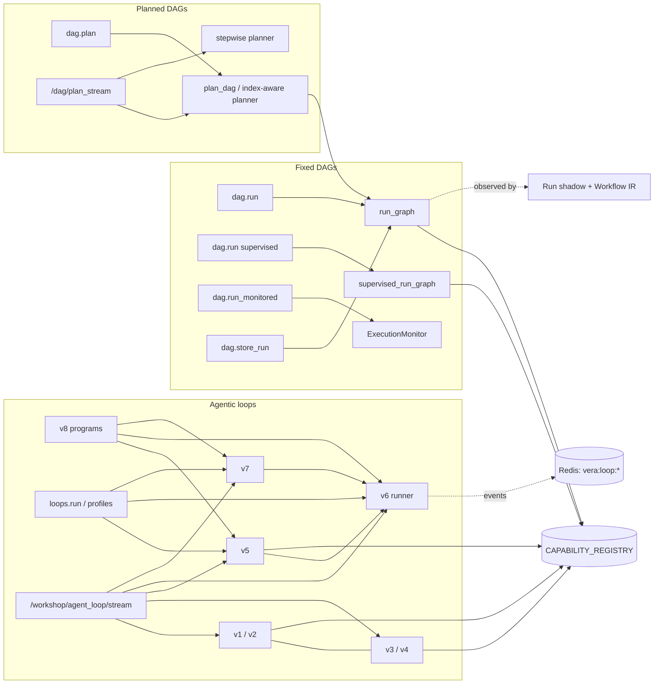
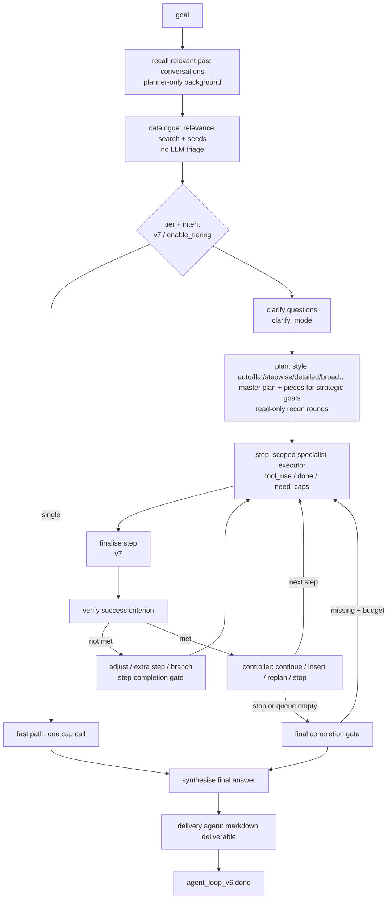

# 03 · DAG Engine and Agentic Loops


Vera composes capabilities into multi-step work in two ways. A **DAG** is a fixed
list of nodes, each calling one capability and writing its result into a shared
state dict; nodes run in sequence, in parallel groups, or behind a condition. An
**agentic loop** is open-ended: an LLM decides the next capability call (or the
next step of a plan) from what has happened so far, until a completion check
says the goal is met. The same engine family also plans DAGs from a
natural-language goal, inserts LLM checkpoints between steps (supervised mode),
repairs failing nodes (monitored mode), and runs long-horizon *programs* of loops
over days (v8).

The engine lives mostly in four places: the core DAG runner and planner in
[`vera/capability_orchestration.py`](../vera/capability_orchestration.py)
(`run_graph`, `supervised_run_graph`, `plan_dag`, `/dag/plan_stream`), the DAG
store, capability index and execution monitor in
[`vera/dag/dag_store.py`](../vera/dag/dag_store.py), the agentic loops v3–v7
and the DAG Workshop panel in
[`vera/dag/dag_workshop_capabilities.py`](../vera/dag/dag_workshop_capabilities.py)
(v1 and v2 live in [`vera/fabric/context.py`](../vera/fabric/context.py)), and
the loop profiles and v8 program orchestrator in
[`vera/dag/loop_profiles.py`](../vera/dag/loop_profiles.py) and
[`vera/dag/loop_orchestrator.py`](../vera/dag/loop_orchestrator.py). Around
forty small, pure `vera/dag/*_core.py` modules hold individually tested rules
the loop applies (plan hygiene, step summaries, evidence for the verifier, and
so on). Planning styles live in [`vera/planning/`](../vera/planning/).

**Maturity.** Plain DAG execution, the DAG store and the v5–v7 loop engines are
in daily use (chat, Dream, Loop Lab and the census harness all drive v6/v7).
v1–v4 are retained and selectable. The Workflow IR, Run shadow and durability
layers (§7) are deliberately non-authoritative inspection and compatibility
facades: they observe and describe execution but never replace the native
runner. LangGraph and Temporal adapters are offline compilers that do not
execute production work.

## Contents

- [1. Concepts and architecture](#1-concepts-and-architecture)
- [2. Source map](#2-source-map)
- [3. DAG syntax](#3-dag-syntax)
- [4. Running DAGs](#4-running-dags)
  - [4.1 `dag.run` — plain execution](#41-dagrun--plain-execution)
  - [4.2 Supervised execution](#42-supervised-execution)
  - [4.3 `dag.run_monitored` — auto-correcting](#43-dagrun_monitored--auto-correcting)
  - [4.4 Streamed execution in the Workshop](#44-streamed-execution-in-the-workshop)
- [5. Planning DAGs from a goal](#5-planning-dags-from-a-goal)
  - [5.1 `dag.plan` and `dag.plan_and_run`](#51-dagplan-and-dagplan_and_run)
  - [5.2 `/dag/plan_stream` — streamed planning and execution](#52-dagplan_stream--streamed-planning-and-execution)
  - [5.3 HITL (human in the loop) for DAG streams](#53-hitl-human-in-the-loop-for-dag-streams)
  - [5.4 Stepwise mode](#54-stepwise-mode)
- [6. Storage, reuse, and DAGs as capabilities](#6-storage-reuse-and-dags-as-capabilities)
- [7. Workflow IR, Run shadow, and durability](#7-workflow-ir-run-shadow-and-durability)
  - [7.1 Run protocol shadow](#71-run-protocol-shadow)
  - [7.2 Workflow IR inspection facade](#72-workflow-ir-inspection-facade)
  - [7.3 The exact execution boundary](#73-the-exact-execution-boundary)
  - [7.4 Portable core, contracts, and gaps](#74-portable-core-contracts-and-gaps)
  - [7.5 Runtime adapters (LangGraph, Temporal)](#75-runtime-adapters-langgraph-temporal)
  - [7.6 Durability fixture and runtime mappings](#76-durability-fixture-and-runtime-mappings)
  - [7.7 Capability reference](#77-capability-reference)
- [8. The agentic loop: modes and shared machinery](#8-the-agentic-loop-modes-and-shared-machinery)
  - [8.1 The eight loop modes](#81-the-eight-loop-modes)
  - [8.2 Engine ownership](#82-engine-ownership)
  - [8.3 The shared LLM chokepoint and model roles](#83-the-shared-llm-chokepoint-and-model-roles)
  - [8.4 Toolkit rules every loop applies](#84-toolkit-rules-every-loop-applies)
  - [8.5 Tool dispatch, long-running jobs, and argument recovery](#85-tool-dispatch-long-running-jobs-and-argument-recovery)
- [9. Classic loops v1–v4](#9-classic-loops-v1v4)
  - [9.1 Action protocol](#91-action-protocol)
  - [9.2 Triage and toolkit building](#92-triage-and-toolkit-building)
  - [9.3 Phase model (think → explore → act → validate)](#93-phase-model-think--explore--act--validate)
  - [9.4 HITL and Continue (budget extension)](#94-hitl-and-continue-budget-extension)
  - [9.5 v4: strict cadence](#95-v4-strict-cadence)
  - [9.6 Handover stage](#96-handover-stage)
- [10. Orchestrated loops v5–v7](#10-orchestrated-loops-v5v7)
  - [10.1 The run pipeline](#101-the-run-pipeline)
  - [10.2 Setup: recall, catalogue, tier, intent, fast path, clarification](#102-setup-recall-catalogue-tier-intent-fast-path-clarification)
  - [10.3 Planning and planning styles](#103-planning-and-planning-styles)
  - [10.4 Step execution: the scoped specialist](#104-step-execution-the-scoped-specialist)
  - [10.5 Verification, control, and recovery](#105-verification-control-and-recovery)
  - [10.6 Completion gate, delivery, and synthesis](#106-completion-gate-delivery-and-synthesis)
  - [10.7 What v7 adds](#107-what-v7-adds)
  - [10.8 Key parameters](#108-key-parameters)
  - [10.9 Authoring capabilities and the code store](#109-authoring-capabilities-and-the-code-store)
- [11. Loop profiles and `loops.run`](#11-loop-profiles-and-loopsrun)
- [12. v8: long-horizon loop programs](#12-v8-long-horizon-loop-programs)
- [13. Running, observing, and controlling loops](#13-running-observing-and-controlling-loops)
  - [13.1 HTTP endpoints](#131-http-endpoints)
  - [13.2 Events](#132-events)
  - [13.3 Persistence, resume, and liveness](#133-persistence-resume-and-liveness)
  - [13.4 Diagnostics](#134-diagnostics)
  - [13.5 Reusable UI elements](#135-reusable-ui-elements)
- [14. Background work and the awaiting-idle queue](#14-background-work-and-the-awaiting-idle-queue)
- [15. The DAG Workshop and harness UI](#15-the-dag-workshop-and-harness-ui)
- [16. Configuration reference](#16-configuration-reference)
- [17. Common patterns and worked examples](#17-common-patterns-and-worked-examples)
- [18. Failure modes and troubleshooting](#18-failure-modes-and-troubleshooting)
- [19. Related pages](#19-related-pages)

---

## 1. Concepts and architecture



| Family | Who decides the next call | Typical entry point | Output |
|---|---|---|---|
| Fixed DAG | Nobody — the node list is fixed | `dag.run`, `dag.store_run` | The final state dict |
| Supervised DAG | An LLM checkpoint after each node (continue / retry / insert / abort) | `dag.run` with `supervised=true` | Final state, possibly with `__aborted__` |
| Planned DAG | An LLM writes the whole DAG once, then it runs as a fixed DAG | `dag.plan`, `dag.plan_and_run`, `/dag/plan_stream` | Plan + final state |
| Stepwise DAG | An LLM picks one capability per step from the evolving state | `/dag/plan_stream` with `mode="stepwise"` | Stream of step events |
| Classic loop (v1–v4) | An LLM picks one tool per cycle from a curated toolkit | `/workshop/agent_loop/stream`, `dag.agent_loop*` | `{history, final, …}` |
| Orchestrated loop (v5–v7) | An orchestrator plans steps; a scoped specialist executes each; a controller adapts the plan | `loops.run`, `dag.agent_loop_v6/v7`, stream | `{goal, steps, blackboard, final, …}` |
| Program (v8) | A generator designs several loops; a controller adapts them after every run | `dag.agent_loop_v8`, `loops.program.create` | Program state (runs continue in background) |

State is the unit of data flow for DAGs: each capability's parameters are filled
from the state keys of the same name, and its result is written under the node's
output key. Loops use a different memory: a per-run tool history (v1–v4) or a
per-step *blackboard* and *ledger* (v5–v7), plus files saved to a per-run
artifact directory.

## 2. Source map

| Path | Responsibility |
|---|---|
| `vera/capability_orchestration.py` | `run_graph`, `supervised_run_graph`, `_llm_supervise`, `plan_dag` (fallback planner), `dag.run`, `dag.plan`, `dag.plan_and_run`, `/dag/plan_stream`, `/dag/hitl/respond`, `_stepwise_run`, Workflow IR / Run shadow / durability capabilities, loop-event persistence (`_persist_loop_event`) |
| `vera/dag/dag_store.py` | `CapabilityIndex` (capability relevance search + embeddings), `DagStore` (named DAGs), `ExecutionMonitor` (`dag.run_monitored`), DAG-as-capability registration, the index-aware planner that replaces `plan_dag` at import |
| `vera/dag/dag_workshop_capabilities.py` | DAG Workshop panel and helper caps; loops v3–v7; the shared loop LLM wrapper; triage, toolkit building, argument recovery, long-running job awaiting; code store (`code.*`, `prose.author`); the unified SSE stream and HITL/cancel/message/resume routes; `/workshop/dag/run_stream` |
| `vera/fabric/context.py` | `dag.agent_loop` (v1), `dag.agent_loop_v2`, the classic triage and the goal-satisfaction judge |
| `vera/dag/loop_profiles.py` | Specialist loop profiles, `loops.profiles`, `loops.profile`, `loops.run`, Loop Lab overlay merge |
| `vera/dag/loop_orchestrator.py` | v8 generator and program orchestrator (`loops.generate`, `loops.program.*`, `dag.agent_loop_v8`) |
| `vera/dag/engine_params.py` | Which arguments an engine really accepts (v7 delegates to v6's signature) |
| `vera/planning/planner_styles.py`, `planning_capabilities.py` | Planning styles (`LOOP_STYLES`, the detailed multi-lens brief, broad work-streams, step critic); `plan.styles`, `plan.detailed` |
| `vera/dag/planner_core.py`, `plan_hygiene_core.py`, `plan_shape_core.py`, `plan_cap_routing.py`, `rewrite_intent_core.py` | Planner guards: skill filtering, drift detection, sampling policy, removing work the goal did not ask for, refusing a one-step plan for a complex goal, routing edits of existing files to `code.edit` |
| `vera/dag/step_*_core.py`, `verify_evidence_core.py`, `steer_core.py`, `deliverable_core.py`, `gate_finish_core.py`, `follow_up_core.py`, `fix_loop_core.py`, `author_done_core.py`, `research_done_core.py`, `repeat_failure.py` | Step-level rules: summaries, dependency following, call ledger, what counts as evidence, how controller steer is framed, final answer composition, gate finishing, redundant follow-ups, fix loops, answered-step detection, repeat-failure stopping |
| `vera/dag/edit_*.py`, `editor_*.py`, `code_author_guards.py`, `missing_arg_hint.py`, `artifact_location.py`, `workdir_note.py`, `test_target.py` | `code.edit` / `code.author` support: edit block parsing, anchor hints, tag balance, output bounds, editor replies, repair guards, path hints |
| `vera/dag/intent_core_core.py`, `intent_zeroshot_core.py`, `entity_coverage_core.py`, `cap_relevance_core.py`, `query_embed_core.py` | Catalogue ordering by intent, zero-shot intent measurement, NER entity coverage, capability relevance scoring, bounded embedding waits |
| `vera/dag/loop_trace_core.py`, `loop_stage_audit.py`, `loop_run_history.py`, `loop_liveness.py`, `loop_output_bound_core.py`, `loop_prompt_rules.py`, `role_override_core.py`, `operator_model_arg_core.py`, `recovery_identity_core.py`, `result_failure_reason.py`, `error_excerpt.py`, `fenced_json.py`, `chain_deps.py` | Diagnostics, stage audit records, durable run history, liveness, output bounds, shared prompt rules, per-run role models, argument safety, failure explanation, JSON extraction |
| `vera/dag/stored_dag_workflow.py` | Read-only Workflow IR projection for stored DAGs (`dag.workflow.inspect`) |
| `vera/execution/workflow_ir.py`, `dag_workflow_execution.py`, `run_projection.py`, `run_shadow.py`, `agent_loop_run_projection.py`, `workflow_runtime_adapter.py`, `durability_fixture.py`, `dbos_mapping.py`, `temporal_mapping.py`, `langgraph_*.py`, `temporal_workflow_adapter.py` | Workflow IR, exact execution boundary, Run shadow, agent-loop adapter, durability fixture and runtime mappings |
| `vera/agent_loop_output_capabilities.py`, `vera/agent_loop_ouput.js`, `vera/loop_graph_element.js`, `vera/loop_throbber_element.js`, `vera/agent_loop_config_element.js` | Reusable loop UI elements |
| `vera/background_work.py`, `vera/idle_queue.py`, `vera/idle_queue_service.py`, `vera/idle_queue_eta.py` | The awaiting-idle queue that background work (including v8 program runs) goes through |
| `vera/dag/dag_workshop_panel.html` | The DAG Workshop panel |

## 3. DAG syntax

A DAG is a JSON list of nodes. Each node is a list:

```json
[
  ["cap.name", "output_key"],
  ["cap.name", "output_key", "CONDITION:state_key"],
  [["cap.a", "out_a"], ["cap.b", "out_b"]]
]
```

| Position | Meaning |
|---|---|
| 0 | Capability name (must exist in `CAPABILITY_REGISTRY`) |
| 1 | State key to write the result into (`null` is allowed when nothing needs the whole result) |
| 2 (optional) | `"CONDITION:state_key"` — skip this node if `state[state_key]` is falsy |
| 3 (optional) | `input_map` — `{"param_name": "state_key"}`, renames a state key onto a parameter |
| 4 (optional) | `output_map` — `{"state_key": "result_field"}`, copies result fields into state |

A node that is itself a **list of node lists** runs all its children in parallel;
each branch gets a copy of the state and the branch results are merged back.

> [!NOTE]
> Positions 3 and 4 are written by the index-aware planner (§5.1) and are
> interpreted by the Workshop's streamed runner (`/workshop/dag/run_stream`).
> The core `run_graph` reads only positions 0–2: it fills parameters from state
> keys of the same name. Workflow IR preserves `input_map`/`output_map` as
> namespaced extensions and reports them as non-blocking gaps (§7.4).

### Example: fetch + summarise

```json
{
  "dag": [
    ["http.get",      "site_resp"],
    ["llm.generate",  "summary", "CONDITION:site_resp"]
  ],
  "initial_state": {
    "url": "http://example.com",
    "prompt": "Summarise this HTTP response"
  }
}
```

The state dict is threaded through every node. A capability's parameters are
filled from the state key of the same name, so naming output keys after the next
capability's input parameter is the idiomatic pattern.

### Example: parallel fan-out

```json
[
  ["fabric.query",                    "results"],
  [
    ["llm.summarize",                 "summary"],
    ["nlp.entity_extract",            "entities"],
    ["nlp.sentiment",                 "sentiment"]
  ],
  ["llm.compose_report",              "report"]
]
```

The middle node is a list of three nodes; all three run concurrently and write
into `state` before the final node runs. (Capability names in examples are
illustrative — validate against your registry.)

## 4. Running DAGs

### 4.1 `dag.run` — plain execution

`POST /dag/run` — inputs `dag` (list), `state` (dict), `supervised` (bool),
`session_id`, `include_workflow_ir` (bool). Returns `{trace_id, result}` and,
with `include_workflow_ir=true`, graph-free Workflow IR provenance.

`run_graph` walks the nodes in order:

- **Parameters** are the state keys whose names match the capability's schema
  properties. Nothing else is passed.
- **Conditions**: `CONDITION:key` skips the node when `state[key]` is falsy. There
  is no negation (`CONDITION:!key` is not supported).
- **Unknown capability**: the output key receives `{"error": "unknown_cap:<name>"}`
  and execution continues.
- **Errors**: an exception becomes `{"error": …, "syslog_context": …}` under the
  output key (or `_err_<cap>` if there is none). A result dict that contains an
  `error` key is kept as the result and enriched with `_err_ctx_<key>` syslog
  context. Execution does not stop on a failed node.
- **Parallel groups** run with `asyncio.gather`; each branch receives a copy of
  the state and dict results are merged back in branch order.

Before running, the graph passes the Workflow IR exact-execution boundary (§7.3)
and the run is observed by the Run shadow (§7.1). Neither changes the result.

### 4.2 Supervised execution

`dag.run` with `supervised=true` (and `dag.plan_and_run`, whose `supervised`
defaults to **true**) uses `supervised_run_graph`. It differs from the plain
runner in two ways:

1. A node that raises is retried up to `max_node_retries` (2) times before its
   error is stored.
2. After every node except the last, an LLM checkpoint (`_llm_supervise`) sees the
   last five log entries, the state keys and the next three nodes, and returns
   JSON `{"action","reason","capability","output_key"}`:

| Action | Effect |
|---|---|
| `continue` | Proceed (also the fallback when the reply cannot be parsed) |
| `retry_node` | Re-insert the node just run so it runs again |
| `insert_node` | Insert `[capability, output_key]` next — only if `capability` is registered |
| `abort` | Stop; `state["__aborted__"]` holds the reason |

Each checkpoint emits a `supervision.checkpoint` event. For exact definitions,
inserted or retried nodes modify only the materialized execution graph — never
the submitted or stored definition.

### 4.3 `dag.run_monitored` — auto-correcting

`POST /dag/run/monitored` — inputs `dag` (JSON string), `state` (JSON string),
`supervised`, `auto_correct` (default true), `include_workflow_ir`. The
`ExecutionMonitor` runs the DAG, watches for `cap.error` events, then for every
node whose output is `{"error": …}` asks an LLM for corrected input parameters
(given the schema, the error and a state snapshot) and re-runs the node, up to
three corrections. It emits a `dag.execution_report` event and returns
`{result, runtime_ms, errors_found, corrections:[…], execution_report:{nodes, errors, corrected}}`.
`dag.store_run` (stored DAGs) uses the same monitor.

### 4.4 Streamed execution in the Workshop

`POST /workshop/dag/run_stream` — body `{dag, state, await_long_running,
long_running_timeout_secs, session_id}` — runs a DAG node by node and streams SSE
events: `start`, `node_start` (with `long_running` / `will_await`), `node_done`
(with `elapsed_ms`, `preview`), `node_skipped`, `node_error`,
`long_running_await_*`, `result`, then `[DONE]`. Unlike `run_graph` it honours
`input_map`/`output_map` and awaits long-running jobs (research, ML training and
similar caps that return a job id) until they finish. Parallel groups are
delegated to `run_graph` without per-branch streaming.

## 5. Planning DAGs from a goal

### 5.1 `dag.plan` and `dag.plan_and_run`

`POST /dag/plan` — inputs `goal`, `capabilities` (optional list). Returns
`{dag, initial_state, rationale, warnings?, error?}`; the fallback planner also
returns a `problem → subgoals → validation` framing.

When `dag_store` is loaded (the normal case) the orchestrator's `plan_dag` is
replaced at import by an **index-aware planner**:

1. **Capability selection.** If `capabilities` is given, those are used.
   Otherwise `CapabilityIndex.relevance_search` (keyword + embedding + category
   scoring) picks the top `MAX_CAPS_IN_PROMPT` (default 25) capabilities,
   excluding infrastructure groups (`obs`, `syslog`, `memory`, `caps`, `mcp`,
   `ui`, `health`, `echo`, `debug`, `ollama`, `agent`). `http.get`,
   `system.ping`, `llm.generate` and `llm.summarize` are always added when
   registered.
2. **Generation.** The `dag-planner` agent writes the plan; if it is unavailable,
   a direct LLM call with the planner system prompt does. The prompt teaches the
   5-tuple node format (§3) and asks for a fenced JSON block
   `{dag, initial_state, rationale}`, at most six nodes.
3. **Validation.** Every node's capability must be registered. If any is unknown,
   one retry is made with the invalid names listed; the better of the two plans is
   kept and remaining unknowns become `warnings`.
4. **Repair** (`_repair_plan`, deterministic plus one optional LLM call): strips
   malformed conditions, renames output keys that shadow a required parameter,
   and asks the LLM to fill required parameters that no state key or upstream
   output reaches.

The fallback `plan_dag` in `capability_orchestration.py` (used when the store is
not loaded) shows every capability's signature, asks for 3–7 nodes, retries once
on unknown capabilities, and defaults `problem` to the goal and `subgoals`,
`validation` to empty.

`POST /dag/plan_and_run` — inputs `goal`, `supervised` (default **true**). Plans,
then runs with `supervised_run_graph` (or `run_graph` when `supervised=false`).
Returns `{plan, result, supervised}`.

### 5.2 `/dag/plan_stream` — streamed planning and execution

`POST /dag/plan_stream` is a raw SSE route used by the harness DAG tab and the
Workshop's plan-from-goal box. Body:

| Field | Default | Meaning |
|---|---|---|
| `goal` | — | Natural-language goal |
| `mode` | `oneshot` | `oneshot` plans the whole DAG first; `stepwise` plans one call at a time (§5.4) |
| `execute` | `true` | Run after planning (`false` stops after `dag.plan_ready` with `dag.done`) |
| `hitl` | `true` | Pause for approval before each node |
| `auto_approve_secs` | `30` | Seconds before a pending approval is auto-approved |
| `state` | `{}` | Seed state, merged with the plan's `initial_state` |
| `include_workflow_ir` | `false` | Add graph-free Workflow IR provenance to `dag.plan_ready` or to each stepwise action event |
| `session_id` | `""` | Required for activity recording (the stream is recorded as `dag.plan.stream`) |

Events (SSE `data:` payloads with a `type`):

```
dag.planning        — the LLM is composing the plan
dag.plan_ready      — plan validated, about to execute (optionally with workflow_ir)
dag.step_planning   — stepwise: choosing the next call
dag.step_start      — node N starting
dag.hitl_request    — paused for approval (when hitl=true)
dag.hitl_rejected   — the user rejected; followed by dag.complete with aborted_at
dag.step_done       — node N complete (result_preview)
dag.step_error      — node N failed
dag.complete        — final state
dag.done            — planning-only run finished (execute=false)
dag.error           — fatal error
[DONE]              — end of stream
```

For one-shot mode the full plan is exact-round-tripped through Workflow IR before
the first execution event; non-canonical definitions use the explicit
native-compatibility path instead of losing behaviour. Executed streams also
create a non-authoritative Run projection (§7.1); no `run.event` bytes are added
to the SSE response. A scoped variant, `POST /dag/plan_stream_scoped`
([execution](12-execution.md)), accepts `allowed_caps` and model/instance
overrides with the same event shape.

### 5.3 HITL (human in the loop) for DAG streams

With `hitl=true` the stream pauses before every non-parallel node and emits:

```json
{
  "type": "dag.hitl_request",
  "step": 2,
  "cap": "research.run",
  "out_key": "report",
  "params": {"query": "..."},
  "trace_id": "<per-step approval id>",
  "auto_approve_secs": 30
}
```

The client answers with `POST /dag/hitl/respond`:

```json
{"trace_id": "<per-step approval id>", "action": "approve|reject|edit",
 "edited_params": {"query": "..."}}
```

`edit` merges `edited_params` into the state before the node runs; `reject`
emits `dag.hitl_rejected` and ends the run. If no answer arrives within
`auto_approve_secs` the node runs with its original parameters (no separate
event is emitted for the auto-approval). The harness DAG tab offers **Stream**
and **Stream+HITL** buttons for these modes.

### 5.4 Stepwise mode

`mode="stepwise"` switches from "plan everything, then execute" to "decide one
call, execute it, look at the result, decide again". Each step the LLM sees the
goal, the calls made so far with result previews, the current state keys and
every capability signature, and answers with one of:

```json
{"action":"call","cap":"capability_name","params":{"key":"value"},"out_key":"result_key","reason":"why"}
{"action":"done","summary":"what was accomplished"}
```

The run stops on `done` or after 12 steps. Because there is no complete graph up
front, each generated one-node action receives its own exact Workflow IR
identity; with `include_workflow_ir=true`, `dag.step_start`, `dag.hitl_request`,
`dag.step_done` and `dag.step_error` carry that identity. The Workshop shows the
definition identity and native control mode beside each action.

## 6. Storage, reuse, and DAGs as capabilities

Named DAGs live in Redis (`vera:dags:{id}`, name index `vera:dag_names:{name}`)
and, when available, Postgres. Records carry `id`, `name`, `description`, `tags`,
`category`, `dag`, `initial_state`, timestamps, usage statistics
(`use_count`, `last_used`, `avg_runtime_ms`), a node summary, an embedding and a
content hash.

| Capability | Route | Purpose |
|---|---|---|
| `dag.store_save` | `POST /dag/store/save` | Save a DAG (`name`, `dag`, `description`, `tags` csv, `category`, `initial_state`) |
| `dag.store_list` | `GET /dag/store/list` | List (`category`, `tag`, `include_archived`) |
| `dag.store_get` | `GET /dag/store/get` | Fetch by `id` or `name` |
| `dag.store_search` | `POST /dag/store/search` | Keyword + vector + tag search (`query`, `limit`, `category`, `tags`) |
| `dag.store_delete` | `POST /dag/store/delete` | Soft-delete (sets `archived`); also unregisters the DAG capability if one exists |
| `dag.store_run` | `POST /dag/store/run` | Load and run (`id`/`name`, `state_override`, `supervised`, `auto_correct`, `include_workflow_ir`) through the monitor |
| `dag.workflow.inspect` | `GET /dag/workflow/inspect` | Read-only Workflow IR view of a stored DAG (§7.2) |
| `dag.register` | `POST /dag/register` | Promote a stored DAG to a live capability `dag.{safe_name}`; type hints from tags `input:key:type` / `output:field:desc` |
| `dag.unregister` | `POST /dag/unregister` | Remove a DAG capability (the stored DAG remains) |
| `dag.list_registered` | `GET /dag/registered` | DAGs currently live as capabilities |
| `workshop.dag_to_cap_preview` | `POST /workshop/dag/cap_preview` | Preview the signature `dag.register` would create |
| `workshop.history_to_dag` | `POST /workshop/history_to_dag` | Turn an agent-loop history into a stored DAG, keeping only successful calls |
| `workshop.tag_cloud` | `GET /workshop/tag_cloud` | Tag and category counts for the library filter |

The capability index used by planners and loops is exposed as well:

| Capability | Route | Purpose |
|---|---|---|
| `caps.search` | `POST /caps/search` | Relevance search over registered capabilities |
| `caps.describe` | `GET /caps/describe` | One capability's enriched record |
| `caps.list_categories` | `GET /caps/categories` | Categories inferred from name prefixes |
| `caps.embed_status` / `caps.embed_run` / `caps.embed_clear_cache` | `/caps/embed/*` | Capability embedding state, (re)build, cache reset |

```python
await api("/dag/store/save", "POST", {
    "name": "site-health",
    "dag": dag_array,
    "initial_state": {"url": "https://example.com"},
    "description": "Fetch a site and summarise the response",
    "tags": "web,health,input:url:str"
})
await api("/dag/register", "POST", {"name": "site-health"})   # → dag.site_health
```

## 7. Workflow IR, Run shadow, and durability

This layer makes DAG and loop execution *describable* in a runtime-neutral way
without moving execution authority away from the native runner. Its modules are
in `vera/execution/`; see [Interoperability foundations](46-interoperability-foundations.md)
for the wider contract family.

### 7.1 Run protocol shadow

The run-protocol integration wraps the existing `dag.run` path with a
runtime-neutral Run projection. It does not replace the DAG engine: native
inputs, scheduling, HITL, cancellation, results, and failures remain
authoritative. Observation failure is isolated so it cannot change the native
result.

The projection records versioned Run events, child task lineage, causation,
attempts, progress, content-free artifact references, and a checksummed journal.
Activity UI cards link the projected workflow and trace identity back to the DAG
Workshop and clearly label the view `run_protocol_shadow` versus authority
`native_dag`. Control records describe request/acknowledgement intent only; they
never execute a native approve, reject, retry, resume, or cancel operation.

When `VERA_RUN_JOURNAL_PATH` enables the SQLite journal, new Runs also persist
immutable identity metadata and a sequence-bound, content-free projection
checkpoint. On process start, the shadow registry verifies each Run's checksum
chain and reconstructs the newest bounded catalog, including parent/child,
workflow, task, session and trace identity, progress, attempts, errors and
artifact references. One corrupt Run is omitted and reported without preventing
healthy Runs from loading. Recovery rebuilds observation only: it never invokes
the DAG, a capability, or a control request.

`run.shadow.list`, `run.shadow.get`, and `run.shadow.graph` expose the same
content-free recovery summary: whether startup recovery ran, recovered and
quarantined counts, the configured catalog bound, and hashed quarantine
references. Raw IDs from other quarantined Runs and error messages are not
returned. Journals created before identity/checkpoint metadata was introduced can
still be verified and exported, but older event rows may recover only the fields
encoded in those events. The implementation does not invent missing lineage.

Executed one-shot and stepwise plan streams also create a Run projection beside
their native SSE lifecycle. Each emitted step becomes a child Run; approval pauses
and resumptions, rejection, step failure, client cancellation, fatal stream
failure, progress, and completion are recorded in the same checksummed journal.
One-shot parent Runs use the complete Workflow IR hash, while adaptive child Runs
use the exact per-action identity. The projection stores lifecycle metadata only:
goals, parameters, state, result previews, approval tokens, and native error text
are not copied into it.

This is intentionally a compatibility facade. Workflow IR and runtime-adapter
work can emit the same contract without requiring Vera to replace LangGraph,
external runtimes, or its own established DAG execution paths.

### 7.2 Workflow IR inspection facade

Vera includes a versioned, runtime-neutral description layer for portable
workflow definitions. `workflow.ir.import_dag` converts supported native DAG
structure into Workflow IR; `workflow.ir.export_dag` performs the reverse
conversion; and `workflow.ir.validate` returns the normalized document and stable
SHA-256 content hash. All three report `executes: false`.

`dag.workflow.inspect` connects that definition layer to persisted DAGs. Unlike
the raw array converter, this read-only facade starts from a DAG ID or name and
preserves the record identity, a stable hash of the DAG plus initial state, the
stored content-hash status, and every currently registered `dag.*` capability
alias. The DAG Workshop shows this evidence beside the saved definition. It also
lists conversion gaps and identifies the execution boundary used by each mode
without editing the stored record.

### 7.3 The exact execution boundary

Supported unsupervised `dag.run` definitions pass through an exact Workflow IR
boundary. Vera imports the submitted graph, normalizes it, exports it, and
requires canonical round-trip equality before the Workflow IR definition becomes
authoritative. The materialized graph still runs through the established native
node executor, preserving capability invocation, conditions, parallel state
merge, errors, and Run observation. The Workflow IR content hash becomes the Run
`workflow_id`. Callable conditions, malformed nodes, or any non-exact definition
stay on an explicitly labelled `native_compatibility` path; no lossy execution is
permitted.

| Path | Boundary behaviour |
|---|---|
| `dag.run` (unsupervised) | Exact round-trip; hash becomes Run `workflow_id` |
| `dag.store_run`, DAG capabilities, `dag.run_monitored` | Same exact preparation when unsupervised; monitoring, error collection, correction, usage statistics and state overrides stay native. `include_workflow_ir=true` adds graph-free provenance |
| `dag.run` supervised | The exact definition is materialized before the first node; the native supervisor remains the control authority for checkpoints, retries, inserted recovery nodes and aborts |
| `/dag/plan_stream` one-shot | The complete validated plan is prepared before execution begins; `include_workflow_ir=true` adds provenance to `dag.plan_ready` |
| `/dag/plan_stream` stepwise | Each one-node action gets its own exact identity before HITL and invocation |
| Agent-loop capability calls | The embedded Workflow runtime adapter exact-round-trips each one-node action, then delegates it once to the native call-tool function (admission, argument handling, streaming callbacks, long-running awaiting, cancellation). The result or failure envelope is preserved and gains only a content-free runtime/Workflow identity. Set `VERA_AGENT_WORKFLOW_RUNTIME=0` before startup to bypass the adapter |

Default response and event shapes are unchanged on every path; provenance is
opt-in.

### 7.4 Portable core, contracts, and gaps

The portable core covers sequential capability tasks, flat parallel groups,
output state keys, and `CONDITION:<state-key>` guards. Native input/output maps
round-trip under namespaced extensions but are reported as non-blocking gaps
because the core runner stores rather than interprets them. Callable conditions,
unknown fields, unknown extensions, malformed nodes, and nested non-task parallel
branches are rejected or returned as blocking gaps. A caller must explicitly set
`allow_lossy=true` to receive a partial conversion; doing so still cannot execute
the result.

Beyond the core, Workflow IR can *describe* (but Vera does not enforce through
it):

- **Typed ports and references** — JSON-schema port descriptors and typed value
  references for state, secrets, artifacts, records, and literals. References are
  validated and hashed as opaque descriptions; the adapter never resolves a
  secret, fetches an artifact, or reads a record.
- **Task contracts** — retry/backoff ownership, timeout ownership, idempotency
  keys, and effects across filesystem, network, database, process, model, device,
  notification, and external services.
- **Structural nodes** — subworkflow references, conditional choices, bounded
  maps, and reducers. Nested step IDs remain globally unique, subworkflows use
  opaque artifact or record references, and all values must be canonical JSON.
  The native adapter reports each as `unsupported_structure`; it never flattens a
  branch, guesses collection semantics, resolves a child workflow, or executes a
  reducer.
- **Workflow-level and operational contracts** — schedules, resource envelopes,
  opaque provider requirements, task-level HITL approval, and compensation.
  Schedule ownership is explicit (`runtime` or `external`), resource numbers must
  be finite and positive, approval declarations cannot masquerade as optional,
  and compensation triggers are limited to failure, cancellation, and timeout.

Native DAG export reports every one of these as a blocking gap because the
compact array cannot preserve or enforce them; explicit `allow_lossy` is the only
way to obtain an array with them removed (the gap report remains attached).
`workflow.ir.migrate` normalizes IR 1.0 without changing its hash semantics and
refuses unknown source or target versions; it never invents a migration.
`workflow.ir.adapters` distinguishes schema availability from execution
availability, and `workflow.ir.gaps` analyses compatibility without loading a
runtime.

This strict boundary is what keeps later runtime adapters honest: unsupported
semantics are visible before any engine is selected. Retry, timeout, effects,
schedules, loops/maps/reducers, compensation, HITL, and subworkflows remain
interoperability work rather than being inferred from Vera's compact DAG arrays.

### 7.5 Runtime adapters (LangGraph, Temporal)

LangGraph has an available offline compiler for the proven task, flat-parallel,
and state-truthy-condition subset. It produces a content-addressed node/edge plan
but remains non-executable until an operational runner is bound. Temporal uses
the same shared offline plan contract for that subset and remains non-executable
until an operational worker binding exists; Temporal retry, timeout, scheduling,
compensation, and durability semantics are not inferred merely because the
engine is capable of them. The two modules are thin profiles over one shared
compiler and injected-runner validator: runtime-specific schemas and plan
identities stay distinct, while graph construction, size limits,
terminal-envelope validation, identity checks, and unsupported-semantics
behaviour have one implementation.

`LangGraphWorkflowRuntimeAdapter` is the fail-closed seam for a future binding.
An injected runner must echo the exact plan, workflow, and runtime identities and
return an unambiguous terminal envelope. The adapter never imports LangGraph,
builds an image, starts a bridge, resolves a reference, or grants effect
authority.

`LangGraphOperationalRunner` is the opt-in implementation of that seam. It
lazily loads LangGraph and constructs a `StateGraph` only after the
content-addressed plan has passed independent size, identity, authority,
allowlist, reachability, acyclicity, entrypoint, terminal-node, and output-key
checks. LangGraph schedules the already-compiled nodes; it does not discover or
call capabilities. Vera retains that authority through a mandatory injected task
executor and checks every allowed task before the first node runs. State updates
are append-only per node and folded in compiled plan order, so parallel
completion timing cannot change merge order. Guards read a detached state
snapshot, task results and final state remain canonical-JSON and one-MiB bounded,
cancellation reaches the active executor, and runtime absence or execution
failure becomes a stable terminal code. Empty workflows preserve their input
without loading LangGraph.

> [!IMPORTANT]
> The runner is not registered as Vera's default workflow route. A consumer must
> provide an explicit task allowlist and policy-enforcing executor, then opt into
> the runtime adapter. Native DAG and agent-bridge capability names are unchanged,
> and no production workflow is redirected because LangGraph is installed.

### 7.6 Durability fixture and runtime mappings

A static conformance fixture in
[`durability_fixture.py`](../vera/execution/durability_fixture.py) combines a
normalized Workflow IR definition with pinned definition/implementation revisions
and expected Run event sequences for clean completion, retry, timeout,
cancellation, compatible-version resume, incompatible-version refusal, and a
crash immediately before and after every step. The workflow declares a durable
wait, runtime-owned retry and timeout, and an external effect protected by an
idempotency key and a durable receipt.

`RuntimeDurabilityProfile` lets an adapter declare exactly which semantics and Run
events it can preserve. `analyze_durability_profile` compares that profile with
the fixture and returns explicit gaps. It rejects an `exactly_once` claim for
external effects: the portable contract is replay plus deduplication by key and
retained receipt, because a runtime cannot manufacture exactly-once behaviour in
an independent service. The fixture and analyzer both report `executes: false`;
they do not import or start DBOS, Temporal, Prefect, Dagster, or Vera's native
runner, and they do not sleep, retry, recover, cancel, or perform the declared
effect.

- `workflow.durability.dbos_mapping` binds the fixture identity and Workflow IR
  hash to a `dbos==2.30.0` review manifest mapping workflow IDs, application
  versions, steps, durable sleep, retry/timeout options, statuses, and Run-event
  evidence sources. It is data, not generated Python (`executes: false`,
  `imports_runtime: false`), and stays `ready_for_execution: false`. Blocking gaps
  cover the absolute-wake-to-duration conversion, DBOS's timeout/cancel status
  ambiguity, compatible-version patch planning, independent-effect key/receipt
  evidence, Run-event observation completeness, large-result ArtifactRef policy,
  and cancellation boundaries — which need a live DBOS and Postgres crash-recovery
  spike to resolve.
- `workflow.durability.temporal_paper` pins `temporalio==1.32.0`, binds the same
  fixture and the exact DBOS mapping identity, and maps the canonical steps to
  Workflows, Activities, durable timers, retry/timeout options, cancellation,
  history events, Signals/Updates, patching, and Worker Versioning candidates. It
  never imports the SDK, starts a Worker, connects to a Temporal service, or
  executes a workflow. Temporal is recorded as a candidate for cross-service
  workers, long-lived histories, versioned routing, messages, child workflows,
  schedules, visibility/retention, and in-flight migration, but every category
  stays `requires_live_evidence` until a named DBOS limitation is measured against
  the same fixture. The manifest therefore reports `recommendation: defer`,
  `decision_ready: false`, and `live_pilot_approved: false`.

### 7.7 Capability reference

| Capability | Purpose | Notes |
|---|---|---|
| `run.shadow.list` | Recent shadow Runs + recovery status | `limit` |
| `run.shadow.get` | One shadow Run and its children | `run_id` |
| `run.shadow.graph` | Bounded Run graph for UI overlays (`GET /run/shadow/graph`) | `run_id` / `session_id` / `run_trace_id` |
| `run.shadow.export` | Checksummed journal export for one Run | `run_id` |
| `run.telemetry.preview` / `.status` / `.export` | Content-redacted OpenTelemetry/OpenInference projection; export to a configured OTLP endpoint is disabled by default | Export failure never affects the Run |
| `workflow.ir.import_dag` / `export_dag` | Native DAG ↔ Workflow IR with gap report | `allow_lossy` |
| `workflow.ir.validate` / `migrate` | Normalize + hash / version migration | Never executes |
| `workflow.ir.adapters` / `gaps` | Adapter profiles / compatibility analysis | Default adapter `vera.native_dag` |
| `workflow.durability.fixture` / `gaps` | Durability fixture / profile comparison | `gaps` takes exactly one of `adapter` or `profile` |
| `workflow.durability.dbos_mapping` / `temporal_paper` | Offline runtime mapping manifests | Never import or run the runtime |
| `dag.workflow.inspect` | Stored DAG → Workflow IR evidence | `id` or `name` |

## 8. The agentic loop: modes and shared machinery

### 8.1 The eight loop modes

| Mode | Capability (route) | Defined in | Strategy | Notes |
|---|---|---|---|---|
| v1 | `dag.agent_loop` (`POST /dag/agent_loop`) | `fabric/context.py` | ReAct: one tool per cycle from a goal-filtered toolkit | `max_cycles` 8 |
| v2 | `dag.agent_loop_v2` (`POST /dag/agent_loop_v2`) | `fabric/context.py` | Triage + dynamic toolkit + post-call satisfaction check | Default version of the SSE stream; phased by default |
| v3 | `dag.agent_loop_v3` (`POST /dag/agent_loop_v3`) | `dag_workshop_capabilities.py` | Full message history with `tool_use` blocks, HITL, phase model, continue | `max_cycles` 10 (clamped 1–40) |
| v4 | `dag.agent_loop_v4` (`POST /dag/agent_loop_v4`) | `dag_workshop_capabilities.py` | Strict plan/explore/think/act/verify cadence with step selection and a todo plan | `max_cycles` 12 |
| v5 | `dag.agent_loop_v5` (`POST /dag/agent_loop_v5`) | `dag_workshop_capabilities.py` | Orchestrator plans steps in one call; each step runs as an ephemeral scoped specialist | Replans on failure |
| v6 | `dag.agent_loop_v6` (`POST /dag/agent_loop_v6`) | `dag_workshop_capabilities.py` | v5 + per-step success criteria, a controller after every step, a final completion gate, a delivery agent | The shared runner for v6 and v7 |
| v7 | `dag.agent_loop_v7` (`POST /dag/agent_loop_v7`) | `dag_workshop_capabilities.py` | Delegates to the v6 runner with tiering, fast path, step finalisation, failure recovery, step-completion gate, journal, pre-step info and dream persistence on | Signature `(goal, **kwargs)` with `delegates_to = "dag.agent_loop_v6"` |
| v8 | `dag.agent_loop_v8` (`POST /dag/agent_loop_v8`) | `loop_orchestrator.py` | Generates and runs a *program* of v5/v6/v7 loops over days | Returns program state; not a streaming run |

`workshop.list_loop_variants` (`GET /workshop/loop_variants`) describes v1–v7
with feature flags (`supports_satisfaction`, `supports_hitl`, `supports_plan`,
`supports_verify`, …) for the UI.

### 8.2 Engine ownership

Vera exposes eight named capability-stepping loop modes, `v1` through `v8`. Here
`v` is part of the mode identifier; it does not mean version, generation, or
lifecycle order. Modes `v1`–`v5` have independent step executors with different
planning and verification strategies. Mode `v6` adds an adaptive controller over
`v5` step machinery, `v7` delegates to `v6` with long-horizon policy, and `v8`
orchestrates programs made from `v5`–`v7`.

All eight modes are retained with their callable identities and distinct
behaviour. The Workshop's Agent Loop tab offers `v1`–`v7` (v2 is the stream's
default) and its editable Loop Builder targets `v1`–`v4`, while loop profiles,
Dream, Loop Lab and internal callers actively use `v5`–`v8`. That consumer
evidence describes active integration; it is not a deprecation or migration
signal. `loops.run`, the Workshop stream endpoint, and Dream are adapters or
routers around the selected mode, not additional generic step implementations.
The browser Operator ([34](34-operator.md)) is a domain-specific
observe/think/act loop with browser safety and progress semantics and should not
be collapsed into a generic capability loop merely because both iterate.

The convergence target is a shared step kernel for invocation, cancellation,
timeouts, retries, Run events, artifact references, and result normalization.
Planning, triage, adaptive control, verification, and long-horizon behaviour
remain strategy policies above that kernel. This permits gradual shadow and
compatibility work without collapsing the numbered modes or changing their
public identities and behaviour. The current source review
(`vera/inventory/agent_loop_authority_review.py`) is non-executing and its
consumer scan is explicitly partial: stored workflows, runtime calls, and
external consumers remain additional evidence sources, not grounds for removing a
numbered mode.

### 8.3 The shared LLM chokepoint and model roles

Every v3–v7 loop LLM call (planner, controller, verifier, completion gate,
finaliser, branch strategist, delivery, executor turns) goes through
`_safe_ollama_generate_dw`, which:

- **aborts before generating** if the call belongs to a loop session that has been
  cancelled (the session is carried in a context variable, so orphaned child
  coroutines stop too);
- **prefixes the current date and time** to the system prompt so models do not
  infer "today" from training data;
- defaults `think=False` and keeps `json_mode` on, so native-thinking models do
  not return empty JSON;
- applies loop determinism (`VERA_LOOP_DETERMINISTIC`, temperature
  `VERA_LOOP_TEMP` 0, seed `VERA_LOOP_SEED` 7) unless a role or caller overrides
  sampling, and a default output bound (`VERA_LOOP_NUM_PREDICT`, 4096 tokens);
- routes through the **`loop` routing profile** when a `role` is given, so each
  role gets its own model/node/sampling and appears in routing telemetry;
- retries once without streaming when the reply comes back empty.

The `loop` routing profile ("Agentic Loop") registers these roles (editable on the
Model Routing page — see [Ollama cluster](04-ollama-cluster.md)):

| Role | Job type | Default model / options |
|---|---|---|
| `executor` | `loop_executor` | Default model; temperature 0.3, top_p 0.9 |
| `planner` | `loop_planner` | `jaahas/qwen3.5-uncensored`; temperature 0.2, `num_ctx` 16384 |
| `controller` | `loop_planner` | Same as planner |
| `tier` | `loop_planner` | Same model; temperature 0.1, `num_ctx` 8192 |
| `coder` | `loop_coder` | `qwen2.5-coder:14b`; temperature 0.7, top_p 0.9 |
| `writer` | `loop_writer` | Default model; temperature 0.7, top_p 0.9 |

Per run, v6/v7 accept `executor_model`/`executor_node` and
`coder_model`/`coder_node` (`auto|gpu|<cpu node>`) and an `effort` preset
(`standard`, `bigger-coder` = `qwen3-coder:30b` as the coder, `max` = that coder
on a CPU node plus stepwise styles upgraded to `stepwise-reviewed`); the chosen
models are emitted as `agent_loop_v6.role_models` (`vera/dag/role_override_core.py`).
`workshop.gen_model_lock` (`POST /workshop/gen_model_lock`) controls whether
generative capabilities called inside a loop must use the run's model (locked,
the default) or may pick their own.

The planning-style calls (`plan.detailed` lenses, broad brief, step critic) use a
separate `planning_style` routing profile with `lens`, `stream` and `enrich`
roles.

### 8.4 Toolkit rules every loop applies

- **Loops never call loops, planners or DAG runners.** `dag.agent_loop*`,
  `loops.run`, `dag.plan`, `dag.plan_and_run`, `dag.run`, `dag.store_run`,
  `llm.plan`, operator controls such as `sys.dev.restart`, and similar recursion
  points are blacklisted from every loop toolkit (`_DEFAULT_CAP_BLACKLIST`).
- **`llm.*` is blocked** from loop toolkits unless `VERA_LOOP_ALLOW_LLM_CAPS=1`.
  Loops generate content only through the grounded authoring capabilities
  `code.author`, `code.edit` and `prose.author` (§10.9), which take files by
  reference. Those capabilities still call `llm.generate` internally.
- **Research job launchers** (`research.run` and its family) are blocked unless
  `VERA_LOOP_ALLOW_RESEARCH=1`; `web.research` (search + read in one call) is the
  preferred lookup and is seeded when a goal looks like it needs the web.
- **Essential and file caps.** v5–v7 always seed `exec.bash.run`,
  `exec.python.run`, `sandbox.session.fs.read`, `http.get`, `caps.search`,
  `fabric.query`, `code.author`, `code.edit` and `prose.author` when registered,
  and grant file-access caps to every acting step on top of its assignment
  (read-only phases get `sandbox.session.fs.read` only). `ide.fs.write` is never
  auto-granted, and `browser.navigate` is denied in favour of `web.*` and
  `operator.run`.

### 8.5 Tool dispatch, long-running jobs, and argument recovery

Tool calls go through one dispatcher that validates arguments against the rich
capability signature (`workshop.cap_signature_rich`: required markers, defaults,
enum options and one level of nested object shape), coerces obvious type
mistakes, and invokes the capability with the run's `session_id`.

- **Long-running jobs.** Capabilities such as research or ML training return a
  job id; when `await_long_running` is on (default) the loop polls the matching
  status capability until the job finishes or `long_running_timeout_secs` (1800)
  passes, streaming progress as `tool_progress`. Active awaits are listed by
  `workshop.jobs_observatory`.
- **Argument recovery.** When a call fails with a recoverable bad-arguments error,
  a recovery sub-cycle asks the LLM (fixed tool, schema shown) for either
  `{"input": {...}}` or `{"give_up": true, "reason": …}`, up to
  `max_recovery_attempts` (2; v5–v7 use `VERA_V5_RECOVERY_ATTEMPTS`). Recovery may
  reshape *what* a call asks for, never *who or where* it asks
  (`recovery_identity_core`).
- **Repetition.** Identical `(tool, args)` pairs are blocked; v5–v7 perturb the next
  executor turn's sampling (higher temperature and a fresh seed) after a repeat,
  and stop re-buying a failure the step has already been told about
  (`repeat_failure`).

## 9. Classic loops v1–v4

### 9.1 Action protocol

Each cycle the LLM returns exactly one JSON object:

| Mode | Call a tool | Finish |
|---|---|---|
| v1, v2 | `{"thought": "...", "tool": "<cap.name>", "args": {...}}` | `{"action": "done", "summary": "..."}` |
| v3, v4 | `{"thought": "...", "tool_use": {"name": "<cap.name>", "input": {...}}}` | `{"thought": "...", "final": "<answer>"}` |

v2 also accepts `{"action": "expand_tools", "keywords": "..."}` to widen the
toolkit. v4 adds `todo_done` updates against its todo plan. A tolerant
canonicaliser accepts the common variants models produce. The engine dispatches
the call, appends the result to the history (v3/v4 as `[tool_result <name>]`
messages, older results shortened), and loops until a finish is accepted, the
user stops the run, or the cycle budget is exhausted. Discovery calls
(`caps.search`, `context.search_caps`) are capped by `max_search_calls` (2) and
toolkit expansion by `max_expands` (1).

### 9.2 Triage and toolkit building

v2–v4 begin with **triage**: one LLM call classifies the goal into a category
(e.g. `web_check`, `network_scan`, `data_lookup`, `research`,
`report_generation`, `summarisation`, `code_task`, …), optional secondary
`categories`, 4–6 capability-vocabulary `keywords` and a reason. The workshop
triage is anchored by examples, runs deterministically and is cached per process.
`_workshop_build_toolkit` then builds the toolkit from the allowed caps, category
prefix hints, keyword and semantic relevance search (`triage_top_k`, 16) and any
`base_toolkit`. When the goal looks data-shaped, relevant fabric datasets are
matched by keyword, with an LLM fallback that picks up to six dataset ids.
`workshop.triage.preview` (`POST /workshop/triage/preview`) runs triage and
toolkit building without running a loop. v1 uses a fixed seed toolkit chosen by
goal-keyword relevance.

v2 runs a **satisfaction check** after every successful tool result: an LLM judge
returns `{"satisfied": bool, "summary": …}` and the loop stops as soon as it says
yes. v3 uses the same judge when `satisfaction_check` is on.

### 9.3 Phase model (think → explore → act → validate)

v2 and v3 run a **phased** loop (on by default, `phased=True`) that forces
information-gathering before action:

- **Think / Explore** — until `min_explore_cycles` (default 2) cheap read-only
  calls (get/list/search/query/describe — see `_cap_phase`) have succeeded, the
  agent is in the explore phase. Action ("act") tools are **blocked** with a nudge
  if requested early, and **long-running** tools (research, ml, exec…) trigger a
  **forced HITL approval** (`long_running_force_hitl=True`) regardless of the
  global HITL setting — the run pauses for a human go/no-go.
- **Act** — once exploration is satisfied, action tools run normally.
- **Validate** — when `require_validate=True` (the default), the agent must run
  one read-only check after acting before its `final`/`done` is accepted; the
  first attempt to finish without validating is bounced once.

Phase transitions emit `agent_loop_v{2,3,4}.phase` events, surfaced as badges in
the loop output renderer.

### 9.4 HITL and Continue (budget extension)

With `require_approval=true` (v3/v4) every tool call pauses with an
`agent_loop_v3.hitl_request` event until `POST /workshop/agent_loop/hitl/respond`
resolves it:

```json
{"session_id": "...", "step": 4, "decision": "approve|reject|edit|abort",
 "args": {"...": "edited args"}, "comment": "optional"}
```

The answer is published to Redis (`vera:loop:hitl:<session>:<step>`, 15-minute
TTL) as well as resolving the in-process future, so a loop running on another
instance behind the load balancer picks it up within about a second. Unanswered
requests time out after `hitl_timeout_secs` (300).

When the cycle budget is reached, instead of forcing a final answer the loop
emits `agent_loop_v{2,3,4}.budget_pause` and waits (`allow_continue=True`). The
output renderer shows a **Continue (+N)** / **Wrap up now** card that posts
decision `continue` or `wrap` (with optional `increment`) to the same endpoint on
a negative `step` id. `continue_increment` (default 8) cycles are added per
continue; `auto_continue_max` (default 0) auto-extends N times before asking.

### 9.5 v4: strict cadence

v4 is built on v3 and adds:

1. **Step selection** (`select_steps`, default on): an LLM picks which of the
   enabled stages (`enabled_steps`, default `plan,explore,think,act,verify`) this
   goal needs, returning `{"steps": [...], "reason": …}` — always a subset of the
   enabled set.
2. **A todo plan** (`plan` stage): a short, ordered, verifiable list
   `{"todos": [{"task": …}]}` that must not assume stages that are not enabled.
3. **Stricter completion** (`strict_complete`, `require_verify`): a `final` is
   accepted only when no todo item is open and every "act" call has a later
   read-only verification. The goal-satisfaction judge can fast-pass a run but an
   unconvinced judge never blocks on its own. Results are emitted as
   `agent_loop_v4.completion_check`.
4. **Terminal tooling preference** (`prefer_terminal_tools`): steers toward
   grep/sed/awk via `exec.bash.run`, with per-run `long_running_caps` overrides.

### 9.6 Handover stage

With `handover=true` a separate synthesis pass reads the whole tool history
(bounded by `handover_max_chars`, 20000) and writes the best possible final answer
to the original goal, emitted as `agent_loop.handover_start` / `handover_done`.
`workshop.handover` (`POST /workshop/handover`) runs the same pass standalone over
any goal + history.

## 10. Orchestrated loops v5–v7

v5 splits the work: the **orchestrator** sees only capability names and
descriptions plus the skill list and emits an ordered step plan in one call; each
**step** then runs as an ephemeral scoped sub-agent that sees full schemas for
just its caps, any skills loaded for it, and the outputs of the steps it depends
on. v6 adds a controller, verification and a completion gate on top of the same
step machinery; v7 turns on the long-horizon features of the same runner.

### 10.1 The run pipeline



Every LLM stage records a content-free *stage-context* audit record (SHA, sizes,
model, role) in the order `triage, tier, intent, master_plan, plan_split,
plan_piecewise, planner, executor, verifier, controller, adjust, gate`
(`loop_stage_audit.py`). The executor's full prompt is available on request as
`agent_loop_v5.step_context`.

### 10.2 Setup: recall, catalogue, tier, intent, fast path, clarification

- **Recall.** Up to five relevant memories from past conversations are fetched
  (fast tier, 8-second bound), filtered to drop echoes of the goal itself, and
  wrapped in a hard "BACKGROUND — may be about something else" block that is
  shown **only to the planner**. The run's `goal` stays pristine for the
  verifier, the completion gate and the UI.
- **Catalogue.** v6/v7 do not run an LLM triage. The catalogue
  (`catalog_size`, 40) comes from `_workshop_build_toolkit` with an empty triage,
  which widens semantic relevance search over the goal text, plus seeds (essential
  action caps, web research caps for web-shaped goals, `base_toolkit`, profile
  caps). With `intent_core="order"` the caps the goal's intent typically uses move
  to the front (`intent_core_core.py`).
- **Tier** (`enable_tiering`, on in v7). A deterministic heuristic
  (`single|simple|complex|strategic` from length, conjunctions and hint words) is
  combined with an LLM pass that returns `{"tier", "reason"}`; the LLM may only
  raise the tier. Without `auto_escalate`, a `strategic` suggestion is capped at
  `complex` and flagged. `plan_tier` forces a tier. Emitted as
  `agent_loop_v6.tier`.
- **Intent** (`build|research|action|mixed`). A conservative heuristic decides
  unless it says `mixed`, in which case an LLM call disambiguates. A zero-shot
  NLP-node classification runs alongside for measurement only
  (`agent_loop_v6.intent_zeroshot`).
- **Fast path** (`enable_fast_path`, on in v7). For a `single`-tier goal, one LLM
  call picks the one capability that satisfies it and fills its arguments
  (`{"cap": "<name or empty>", "args": {...}}`); the call runs and the answer is
  synthesised directly. An empty or unknown choice falls through to full planning.
- **Clarification.** `clarify_mode` (`off|ask|auto_raise|auto_accept`, derived
  from `clarify_level` 0–3 when empty) and `clarify_scope`
  (`whole|piece|step`). An LLM produces up to N high-value clarifying questions
  (or none when the goal is clear). `ask` waits up to `clarify_timeout_secs` for
  answers on `clarify_channel` (`ui` or `telegram`); `auto_accept` has an LLM
  answer them with reasonable assumptions folded into the goal.

### 10.3 Planning and planning styles

`plan_style` chooses **how** the plan is produced (`vera/planning/planner_styles.py`,
`LOOP_STYLES`); the style used is emitted as `agent_loop_v6.plan_style`:

| Style | Up-front planner | Master plan | Recon | Shape guards | Notes |
|---|---|---|---|---|---|
| `auto` (default) | yes | yes | yes | yes | Tier and intent decide |
| `flat` | yes | no | no | yes | One plan, no escalation |
| `stepwise` | no | no | no | no | No plan: the controller inserts one step at a time from evidence |
| `detailed` | yes | yes | yes | yes | A five-lens brief (decompose, artifacts, risks, criteria, caps) is written first and handed to the planner |
| `broad` | no | no | no | yes | One call splits the goal into work-streams (max 5); each is planned concurrently and merged with cross-stream `needs`; a CPU node writes a deeper brief per stream that is added as it lands |
| `broad-stepwise` | no | no | no | no | Broad's work-streams, each opened with one step and grown by the controller |
| `stepwise-reviewed` | no | no | no | no | Stepwise plus a non-blocking **step critic** (on a CPU node by default, `critic_route=gpu` to move it) that reviews every finished step; the final gate waits up to 180 s for the last critique |

**The orchestrator call** (`_v5_orchestrate_plan`) returns:

```json
{"complexity": "simple|complex|extreme",
 "recon": [{"cap": "cap.name", "args": {}, "why": "short"}],
 "steps": [{"id": 1, "title": "plain-language description", "goal": "what this step must achieve",
            "caps": ["cap.name"], "skills": ["skill_id"], "needs": [], "complex": false,
            "phases": [], "success": "one-line checkable criterion"}],
 "done_when": "one-line whole-goal criterion",
 "reason": "one sentence"}
```

(`success`/`done_when` are requested on v6/v7.) Planner tokens stream to the UI as
`agent_loop_v6.plan_token`. Around it:

- **Recon** (`enable_recon`, `recon_max_rounds` 3): read-only actions the planner
  asked for run first and their findings are fed back into a second planning call.
- **Master plan** (`enable_master_planner`, strategic/extreme goals): one call
  generates a domain-expert planner persona, a second writes a long-form
  capability-agnostic strategy, a third splits it into up to `max_plan_pieces`
  pieces (each with suggested caps, dependencies, deliverable, timescale, success
  metric), and each piece is expanded into steps. With
  `cap_override_mode="piece"` (v7 default) each piece's steps are scoped to its
  own suggested caps.
- **Sub-plans** (`enable_subplans`): a step marked `complex` is expanded into its
  own one-level sub-plan.
- **Guards** run on every plan: skill filtering against the goal, plan drift
  detection (a plan about something else triggers a replan —
  `agent_loop_v6.plan_drift`), plan hygiene (work the goal did not ask for is
  removed), shape (a complex goal may not be planned as one step), and edit
  routing (a step that changes a file an earlier step created becomes a
  `code.edit`).
- **`plan.detailed`** (`POST /plan/detailed`) exposes the detailed style as its
  own capability: five short lens calls merged host-side, rejecting any criterion
  that asserts a number the goal never gave. `plan.styles` lists the styles.

### 10.4 Step execution: the scoped specialist

Each step runs `_v5_run_step` with a per-step cycle budget
(`step_cycle_budget`, 6). Its system prompt names the step goal, the overall goal
(as context only), the success criterion, the full schemas of its caps, the
results of the steps it depends on (plus the pre-plan recon), the bytes of the
most relevant prior-step files, and a ladder of rules (prefer a capability that
already does the job, then a shell one-liner, then a script; generative caps
cannot look things up; capabilities are not Python imports).

Each turn the executor returns one JSON object. The common shapes:

| Field | Meaning |
|---|---|
| `tool_use: {name, input}` | Call one capability (name must be one of the step's caps) |
| `done: "<result>"` | The step is complete; the text is its outcome |
| `need_caps: ["cap.name"]` | Ask for capabilities outside the step's scope; granted from the run's catalogue (bounded) |
| `thought` | Reasoning (streamed as `agent_loop_v5.think_delta`) |
| `note` | A journal note appended immediately |
| `condense: {focus, keep}` | Steer how a long output is condensed |

Rules applied around the turn:

- **Scope widening**: a failing step may be widened automatically with relevant
  recovery caps (infrastructure caps excluded unless the step is already in that
  domain), emitted as `agent_loop_v5.scope_widened`.
- **Premature done**: a `done` that describes a plan rather than a result
  ("ready to…") is rejected once; repeated, the step ends as stalled.
- **Answered steps**: an authoring-only step is answered by its `code.author`
  call, and a research-only step with its sources in hand is answered, without
  extra re-checking turns.
- **Phases** (`enable_phases`, **off** by default): when on, a step may carry a
  `phases` subset of explore/think/act/verify, each run as its own scoped
  sub-agent (explore/verify read-only, think tool-free). It is off because the
  auto-scoping repeatedly stripped steps of the tools the planner gave them.
- **Output handling**: long tool output is saved to the run's artifact
  directory and summarised for the next turn; with `condense_output` (v7 default)
  an LLM condenses it to a dense brief. `raw_context=true` turns off every LLM
  rewrite of run material (finalisation, condensing, journal distillation).
- **Chaining** (`enable_chaining`, off by default): piping one call's output into
  the next via `$N` references.
- **Questions** (`enable_step_questions`, on in v7): a step may ask the user and
  wait `question_timeout_secs` (180).
- **Mid-run messages**: text posted to `/workshop/agent_loop/message` is folded in
  at the next step boundary as an authoritative user update.

### 10.5 Verification, control, and recovery

After each step (v6/v7):

1. **Finalise** (`enable_step_finalize`, v7): one call distils the step's cycles
   into a relevant-only summary that later steps and the verifier read; the raw
   summary is kept for the UI.
2. **Verify** (`enable_step_verify`, default on): one judge call returns
   `{"met": bool, "reason": "<one sentence quoting the evidence>"}` for the step's
   success criterion. Only tool results count as evidence, not the executor's own
   account. On judge failure the step's own `ok` is trusted.
3. **Recover a missed bar.** `failure_strategy` decides: `extra_step` (v7
   default) appends a continuation step that builds on the partial output;
   `branch` forks from the last good point, asks a strategist for up to
   `branch_fanout` distinct approaches (`max_branches` 6, optionally
   `branch_parallel`), merges the first that meets the bar and prunes the rest
   with a one-line reason; `default`/empty leaves it to the controller. With
   `require_step_completion` (v7 default) the same step is re-attempted in place
   with an adjusted tactic (an LLM writes a reframed goal, caps and phases) up to
   `step_max_attempts` (2), adding at most `step_retry_max_new_caps` (2) tools.
4. **Control** (`enable_adaptive`, default on): one controller call reads the
   ledger (each executed step's criterion, verdict and trimmed result, plus the
   pending steps with goals and caps) and returns:

```json
{"findings": "key facts the last step produced",
 "goal_alignment": "advances|neutral|off_track|blocker",
 "direction": "one-sentence steer for the next step",
 "assessment": "state of the run",
 "goal_met": false,
 "action": "continue|insert|replan|stop",
 "steps": [{"title": "...", "goal": "...", "caps": ["cap.name"], "success": "..."}]}
```

`insert` adds remediation or gap steps, `replan` replaces the remaining queue,
`stop` ends early because the goal is met. The `direction` is passed to the next
step as context (never as part of its task). On failure the controller answers
`continue`. Total steps are capped by `max_total_steps` (0 = auto: twice
`max_steps`, at most 40). A fix loop that two fix steps did not change ends the
run. Each assessment is emitted as `agent_loop_v6.assess`.

### 10.6 Completion gate, delivery, and synthesis

- **Final gate** (`enable_final_gate`, default on): with a large ledger budget
  (4000 characters per step, 20000 total, including outputs) and a listing of the
  files that actually exist, one call returns
  `{"complete": bool, "missing": [...], "follow_up": [...]}`. A file deliverable
  counts only if the file exists. When incomplete and budget remains, follow-up
  steps run (redundant ones are skipped) and the gate is asked again. What the
  final gate said is carried to the end, so a finished run cannot claim more
  than the gate allowed.
- **Synthesis**: the final answer is composed from the deliverable and the step
  results (not from the run's story).
- **Delivery** (`enable_delivery`, default on): a dedicated agent turns the
  run's evidence into a markdown deliverable — the answer first for questions, an
  account of actions, artifacts, and a usage guide when code was produced — and
  falls back to the plain synthesis on failure. Emitted as
  `agent_loop_v6.deliverable`.
- **Entity coverage**: a deterministic NER measure of whether the final output
  covers what the goal named (`agent_loop_v6.entity_coverage`, reporting only).

### 10.7 What v7 adds

`dag.agent_loop_v7` calls the v6 runner with these defaults (each overridable):

| Feature | v7 default |
|---|---|
| `enable_tiering` | `True` |
| `enable_fast_path` | `True` |
| `enable_step_finalize` | `True` |
| `failure_strategy` | `extra_step` (unless the caller passes it or `enable_branching`) |
| `require_step_completion` | `True` |
| `enable_prestep_info` | `True` — before a step, an LLM lists info `gaps` it needs that are not yet collected, and they are gathered first |
| `enable_journal` | `True` — each step is distilled into a structured record (key outputs, files grounded against the sandbox, entities, note) persisted to the data fabric and a `journal.json`, and folded into later steps; complex/strategic runs only unless `journal_all_tiers` |
| `enable_dream_persistence` | `True` — a strategic goal's documented plan becomes a Dream project and each session's progress is folded back in ([Dream](17-dream.md)) |
| `cap_override_mode` | `piece` |
| `enable_step_questions` | `True` |
| `enable_chaining` | `False` |

`progress_report_mode` (`off|long_term_only|not_quick|all`) sends progress
reports over `progress_channel` (default `telegram`). The SSE stream applies the
same v7 defaults when `version="v7"`.

### 10.8 Key parameters

Defaults of the v6 runner (v7 differences above). All are accepted by
`/workshop/agent_loop/stream` as body fields and by `loops.run` as overrides.

| Parameter | Default | Meaning |
|---|---|---|
| `goal` | — | Required |
| `allowed_caps` / `base_toolkit` | `""` | Toolkit floor (csv) |
| `max_steps` | 8 | Plan length budget |
| `step_cycle_budget` | 6 | Executor turns per step |
| `catalog_size` | 40 | Caps shown to the orchestrator |
| `max_total_steps` | 0 | Hard ceiling incl. inserted steps (0 = 2×`max_steps`, ≤ 40) |
| `plan_style` | `auto` | §10.3 |
| `enable_adaptive` / `enable_step_verify` / `enable_final_gate` / `enable_delivery` | `True` | Controller / verifier / gate / delivery |
| `enable_recon` / `recon_max_rounds` | `True` / 3 | Pre-plan read-only exploration |
| `enable_subplans` / `enable_master_planner` | `True` | Sub-plans / strategic master plan |
| `enable_phases` / `phase_policy` / `phase_set` | `False` / `auto` / `explore,think,act,verify` | Per-step phases |
| `enable_dynamic_skills` / `skill_allow` / `skill_deny` / `auto_suggest_skills` | `True` / — / — / `True` | Skills per step |
| `prefer_terminal_tools` | `True` | Steer to grep/sed/awk |
| `condense_output` / `raw_context` | `False` / `False` | Output condensing / disable all LLM rewrites |
| `intent_core` | `off` | `order` puts intent caps first |
| `critic_route` / `enrich_model` | `cpu` / `""` | Step critic route / broad brief model |
| `clarify_mode`, `clarify_level`, `clarify_timeout_secs`, `clarify_scope`, `clarify_channel` | `""`, 1, 180, `whole`, `ui` | Clarification |
| `enable_code_autosave` / `code_push_gitea` | `True` / `False` | Version generated code in the code store |
| `await_long_running` / `long_running_timeout_secs` | `True` / 1800 | Long-running jobs |
| `model`, `instance_id`, `prefer_gpu`, `session_id` | — | Routing and identity |

v5 has the same core knobs plus `enable_replan` (default on: replan the remaining
steps after a failure) and no controller, verifier or gate.

Results have the shape `{goal, steps, blackboard, history, cycles, final,
toolkit, stream_id, done, plan_style, …}`.

### 10.9 Authoring capabilities and the code store

Loops create and change files only through grounded authoring capabilities
defined in `dag_workshop_capabilities.py`:

| Capability | Route | Purpose |
|---|---|---|
| `code.author` | `POST /code/author` | Generate a source file from `path` + plain-English `task` (coder role); grounded on context files, syntax-checked with bounded repair attempts (`V5_AUTHOR_MAX_ATTEMPTS`, 3) and an optional smoke run; versioned |
| `code.edit` | `POST /code/edit` | Surgical anchored find/replace edits to an existing file, re-checked after applying (`V5_EDIT_MAX_ATTEMPTS`, 3) |
| `prose.author` | `POST /prose/author` | Write a document from a description of what it must cover (writer role), grounded on the real files in the working directory |
| `code.save` | `POST /code/save` | Save a new immutable version of a file in the data-fabric code store (identical content is a no-op); the latest is mirrored to the run's artifact directory |
| `code.read` / `code.versions` / `code.diff` / `code.restore` | `/code/*` | Read latest (or a version), list history, diff two versions, restore a version as a new latest |

## 11. Loop profiles and `loops.run`

A **profile** is a named body preset for the loop engine: an engine version, a
specialist agent (its system prompt, model and domain caps), a curated toolkit
floor (optionally plus the panel-driving caps `panel.query`, `panel.dispatch`,
`ui.panel.list`, `ui.panels`), skills, and engine defaults. Defined in
`LOOP_PROFILES`:

| Profile | Engine | Agent |
|---|---|---|
| `fabric-discovery` | v6 | `fabric-librarian` |
| `coding` | v6 | `coder` |
| `code-editing` | v6 | `code-editor` |
| `code-testing` | v6 | `code-tester` |
| `code-verification` | v6 | `code-verifier` |
| `verification` | v5 | `script-verifier` |
| `git-operations` | v5 | `git-operator` |
| `file-operations` | v5 | `file-operator` |
| `devops` | v6 | `infra-operator` |
| `operator-infra` | v6 | `infra-operator` |
| `networking` | v6 | `network-engineer` |
| `ide` | v6 | `capability-smith` |
| `planning` | v7 | `agentic-planner` |
| `business-shop` | v6 | `business-operator` |
| `markets-quant` | v6 | `quant-strategist` |
| `long-term-scheduling` | v7 | `long-term-planner` |
| `operator` | v7 | `operator` |
| `mesh-edge` | v6 | `network-engineer` |
| `foundry-provisioning` | v6 | `infra-operator` |
| `model-catalog` | v6 | `infra-operator` |
| `storage-fabric` | v6 | `infra-operator` |
| `identity-security` | v6 | `infra-operator` |
| `research-brief` | v7 | `researcher-scout` |

| Capability | Route | Purpose |
|---|---|---|
| `loops.profiles` | `GET /loops/profiles` | Every profile with resolved caps and whether its engine is registered |
| `loops.profile` | `POST /loops/profile` | Resolve one profile (`id`) to its stream-body preset |
| `loops.run` | `POST /loops/run` | Run a goal through a profile as one awaited call (no SSE) |

**Merge order** for `loops.run` (and for `profile`/`loop_profile` on the SSE
stream): profile defaults → the active Loop Lab overlay for that profile
(engine-knob overrides plus a prompt preamble prepended to
`system_prompt_template`; see [Loop Lab](33-evolve.md)) → the caller's explicit
arguments. Scalars from the caller win; `base_toolkit`, `allowed_caps` and
`attach_skills` CSVs are **unioned** so a caller can add caps without losing the
profile floor. The agent's `domain_caps` are unioned into `allowed_caps` and its
model used when none is given. Arguments are then filtered to what the engine
accepts (`engine_params.py`), in two sets:

- The assembled **profile body** is filtered by the engine's own schema. For
  v1–v6 that is every parameter. v7's signature is `(goal, **kwargs)`, so for a
  v7 profile (`planning`, `long-term-scheduling`, `operator`, `research-brief`)
  the profile's toolkit, agent and defaults do **not** reach the engine through
  `loops.run` — a v7 run via `loops.run` is a bare v7 run unless the caller
  passes those arguments explicitly. This is deliberate: census and suite numbers
  were produced that way and stay comparable.
- Arguments the **caller** passed explicitly are widened by the engine's
  delegate (v7 → v6's 69 parameters), so a caller's `model`, `allowed_caps` or
  `max_steps` is honoured. `session_id` and `trace_id` always pass. Anything still
  dropped is logged.

`loops.run` is blacklisted from loop toolkits so a loop cannot recurse into a
specialist loop.

```bash
curl -s -X POST localhost:8999/loops/run -H 'content-type: application/json' -d '{
  "profile": "coding",
  "goal": "write a script that prints the 10 largest files under /workspace",
  "max_steps": 4,
  "session_id": "demo-coding-1"
}'
```

## 12. v8: long-horizon loop programs

`loop_orchestrator.py` is a meta layer over v5–v7 and the profiles:

- **Generator** (`loops.generate`, preview only): an LLM designs a *program* —
  `{name, done_when, horizon_days, loops:[…]}` — of 2–N loops. Each loop pins a
  profile or a custom engine + caps, is directed by a listed agent, an invented
  ephemeral persona (name, role, full system prompt) or neither, has a cadence
  (`once` or `recurring` every `interval_hours`), `depends_on` siblings and a
  one-line `success` check. All loops share one persistent `/workspace`.
- **Orchestrator** (`loops.program.*`): a scheduled tick (`v8_program_tick`, every
  300 s) fires the next due, dependency-satisfied loop. Runs go through the
  awaiting-idle queue (§14) as kind `loop.program`, so they start only after
  sustained quiet and are pre-empted when Vera is used; one constituent loop runs
  at a time by default. Each run is a normal v5/v6/v7 run with session id
  `v8:<program>:<loop>`, watchable from the chat Loops pane.
- **Controller**: after every run, an LLM reviews the program against
  `done_when` and returns `{"program_status": "active|done|failed", "note",
  "adaptations": [add | retire | reschedule]}` (at most three adaptations per
  pass, bounded by `max_loops_per_program`). Steering notes from Dream or an
  operator (`loops.program.steer`) are shown to it with highest priority and
  consumed after one pass.

| Capability | Route | Purpose |
|---|---|---|
| `dag.agent_loop_v8` | `POST /dag/agent_loop_v8` | Generate + create + start a program from `goal` (`horizon_days`, `include_user_agents`, `sandbox_owner`, `owner_ref`, `ide_workspace`) |
| `loops.generate` | `POST /loops/generate` | Design a program without creating it |
| `loops.program.create` | `POST /loops/program/create` | Create (and by default start) a program |
| `loops.program.list` / `get` | `GET /loops/program/list`, `/get` | Programs / one program with run history and controller notes |
| `loops.program.pause` / `resume` | `POST /loops/program/pause`, `/resume` | Stop / restart firing loops |
| `loops.program.cancel` | `POST /loops/program/cancel` | Stop the in-flight runs now without deleting the program |
| `loops.program.delete` | `POST /loops/program/delete` | Delete (does not cancel a run in flight) |
| `loops.program.tick` | `POST /loops/program/tick` | Advance the orchestrator one tick by hand |
| `loops.program.steer` | `POST /loops/program/steer` | Inject a steering note |
| `loops.config.get` / `set` | `GET /loops/config`, `POST /loops/config/set` | Global v8 defaults |

Global defaults (`vera:v8:config`): `model`, `agent`, `engine` (empty = per
loop), `respect_dream_gate` (true), `max_concurrent` (1),
`max_loops_per_program` (8). Programs persist in the Redis hash
`vera:v8:programs` and survive restarts. Events: `agent_loop_v8.program_created`,
`loop_started`, `loop_done`, `program_adapted`, `program_steered`,
`loop_cancel_requested`, `program_done`, `config`.

## 13. Running, observing, and controlling loops

### 13.1 HTTP endpoints

| Route | Purpose |
|---|---|
| `POST /workshop/agent_loop/stream` | Run any of v1–v7 as an SSE stream. Body: `goal`, `version` (default `v2`), `profile`/`loop_profile`, `agent_name`, `session_id`, plus every engine knob. Emits enriched loop events, long-running progress, LLM token streams as `tool_progress`, HITL requests, and a final `result` event |
| `POST /workshop/agent_loop/hitl/respond` | Resolve a paused step or a budget pause (§9.4) |
| `POST /workshop/agent_loop/cancel` | Stop a run: sets `status=cancelled` on `vera:loop:run:<sid>` first (so any orphaned coroutine stops at its next turn or generation), then cancels the runner task if this process holds it |
| `POST /workshop/agent_loop/message` | Queue a message to a running loop (`vera:loop:inbox:<sid>`, 24 h) without interrupting it; folded in at the next step boundary |
| `GET /workshop/agent_loop/session_state` | Persisted run-state + event log for a session (`since` index) |
| `GET /workshop/agent_loop/sessions` | Recent sessions with run-state (`limit`, `status`) |
| `GET /workshop/agent_loop/reattach` | SSE: replay a session's persisted events, then tail live ones |
| `GET`/`POST /workshop/agent_loop/history_config` | Retention policy for durable loop history (values are clamped, never rejected) |
| `POST /workshop/agent_loop/trace` | `workshop.agent_loop.trace` digest (§13.4) |
| `POST /workshop/agent_loop/preset_save` / `preset_list` / `preset_delete` | Loop Builder presets shown in the Agent Loop variant menu |
| `POST /workshop/discover/options` | Skills, ontologies, agents and models for the loop UI |
| `GET /workshop/prompt_templates` | Default v1/v2/v3 system prompts and their template variables |
| `POST /workshop/cap_signature_rich`, `/workshop/cap_io_schema`, `GET /workshop/cap_tree` | Signature and schema helpers for the UI and prompts |
| `GET /workshop/jobs_observatory` | Long-running jobs being awaited by loops and DAG runs |

### 13.2 Events

Loop events are namespaced by mode (`agent_loop.*` for v1, `agent_loop_v2.*` …
`agent_loop_v6.*`, `agent_loop_v8.*`; v7 emits v6 and v5 events). The renderer
matches suffixes, so shared shapes render the same for every mode.

| Group | Events |
|---|---|
| Common cycle | `.triage_start`, `.triage_done`, `.toolkit`, `.cycle_planning`, `.think`, `.tool_call`, `.tool_done`, `.phase`, `.done`, `.hitl_request`, `.hitl_resolved`, `.budget_pause`, `.budget_continue`, `.args_coerced` |
| v4 | `.plan`, `.step_plan`, `.completion_check`, `.repetition_block`, `.artifact_dir`, `.think_delta` |
| v5 steps | `.plan`, `.planning`, `.recon`, `.master_plan`, `.subplan`, `.replan`, `.step_start`, `.step_context`, `.step_done`, `.scope_widened`, `.arg_correction`, `.think_delta`, `.think_stream_end`, `.tool_stream_delta`, `.tool_stream_end`, `.output_saved`, `.output_condensed`, `.code_saved`, `.chain`, `.url_cache_hit`, `.user_message` |
| v6 control | `.tier`, `.intent`, `.intent_zeroshot`, `.intent_core`, `.plan_style`, `.plan_token`, `.fast_path`, `.clarify_request`, `.clarify_resolved`, `.clarify_auto_accept`, `.clarify_auto_raise`, `.stage_start`, `.verify`, `.step_finalized`, `.step_unmet`, `.step_retry`, `.recovery_step`, `.branch_open`, `.branch_merge`, `.branch_prune`, `.assess`, `.ledger`, `.gate`, `.deliverable`, `.journal`, `.prestep_info`, `.step_question`, `.step_critique`, `.critic_gate_wait`, `.plan_drift`, `.plan_hygiene`, `.plan_underdecomposed`, `.broad_*`, `.strategic_*`, `.progress_report`, `.role_models`, `.entity_coverage`, `.setup_timing` |
| Handover / misc | `agent_loop.handover_start`, `.handover_done`, `.handover_error`, `agent_loop.user_message`, `agent_loop.interrupted`, `agent_loop.long_running_await_timeout` |
| Code store | `code.version.saved`, `code.author.repair`, `code.author.timing`, `code.edit.retry` |

### 13.3 Persistence, resume, and liveness

Every `agent_loop*` event carrying a `session_id` is appended to
`vera:loop:events:<sid>` (trimmed to `VERA_RESUME_MAX_EVENTS`, default 4000) and
updates the run hash `vera:loop:run:<sid>` (status, started_at, updated_at, goal);
both expire after `VERA_RESUME_TTL` (default 7 days). Per-token `_delta` events
are not persisted — the matching `_end` event carries the text. Session activity
is indexed in the sorted set `vera:loop:sessions`, and a compact durable record
per run is kept under `vera:loop:history:run:<sid>` with the index
`vera:loop:history:index` and retention in `vera:loop:history:cfg`
(`loop_run_history.py`).

A page reload or restart re-attaches through `/workshop/agent_loop/reattach`,
which replays the stored events and then tails live ones. A run whose
`updated_at` has not moved for `VERA_LOOP_STALE_SECS` (default the larger of
600 s and `OLLAMA_GEN_TIMEOUT` + 300 s) is treated as stale rather than running;
`loop_liveness.py` keeps a run that is busy in a long generation from looking
dead.

### 13.4 Diagnostics

- **`workshop.agent_loop.trace`** — a read-only digest of one run: what was
  planned (steps, caps, phases, success, `done_when`), what each step actually
  called, failures and repeats, gate rounds, and step accounting that adds up
  (`loop_trace_core.py`).
- **Stage audit** — content-free stage-context records for every LLM stage
  (§10.1).
- **Loop views in Loop Lab** — `loop.ci.matrix` (steps × calls, or goals × runs),
  `loop.ci.race` (gate rounds, red → green), `loop.ci.board` (plan as a board) and
  `loop.ci.perf` (wall time, planned vs executed steps, tool time, model calls by
  stage); see [Loop Lab](33-evolve.md).
- **Run projection** — `agent_loop_run_projection.py` records loop runs in the
  Run shadow (§7.1).

### 13.5 Reusable UI elements

| Element | Served at | Purpose |
|---|---|---|
| `<vera-agent-loop-output>` | `/ui/elements/agent_loop_output.js` | Renders a loop's event stream: triage banner, toolkit, cycle cards with thinking/args/progress, error-recovery boxes, long-running awaits, HITL and budget cards, handover and final result. API: `appendEvent`, `bindStream`, `reset`, `abort`, `getResult`, `setSessionId`, `setHitlEndpoint`, … Registered as the injectable panel `agent-loop-output` |
| `<vera-loop-graph>` | `/ui/elements/loop_graph.js` | Live activity graph: run → step → phase/sub-plan → cap call → result, with skills and saved files as satellites |
| `<vera-agent-loop-config>` | `/ui/elements/agent_loop_config.js` | The full `/workshop/agent_loop/stream` configuration surface as one control |
| `<vera-wiremesh-throbber>` | `/ui/elements/loop_throbber.js` | A persistent "the loop is working" indicator (`active` attribute) |

## 14. Background work and the awaiting-idle queue

Work nobody is waiting on — bulk and session embedding, Dream cycles, narration,
source gathering, and v8 program runs — goes through one queue instead of
deciding for itself when to run. The design follows four rules
(`vera/background_work.py`):

1. **Sustained, witnessed quiet.** A job starts only after
   `MIN_QUIET_SECONDS` (600) of continuous quiet; a gap between observations
   longer than `STALE_OBSERVATION_S` (420) does not count as quiet. A census's
   30–60 s gaps between goals never look idle.
2. **Pre-emption.** A running job is given `should_continue()` to poll and is
   asked to stop the moment the box gets busy; after `PREEMPT_GRACE_S` (20 s) its
   task is cancelled. Pre-empted jobs go back on the queue.
3. **One at a time, bulk last.** Priorities: interactive support (10), normal
   (50), bulk (90).
4. **Fail open.** An unreadable busy signal means "not busy", so background work
   cannot be starved forever by a transient error.

"Busy" means: a census is running, a Dream cycle is in progress, an agent loop is
genuinely live (stale runs excluded), the GPU gate is held or was held within
`GATE_COOLDOWN_S` (180 s), or a person is using Vera. The queue tick
(`vera.idle_queue.tick`, every 60 s) observes the busy reading, enqueues the
transcript backfill if needed, and drains at most one job. Jobs (`waiting`,
`running`, `done`, `failed`, `preempted`) live in the Redis hash
`vera:idle_queue:jobs`; measured per-kind rates (`vera:idle_queue:rates`) give
ETAs (`idle_queue_eta.py`). Producer kinds include `embed.sessions`,
`embed.sources`, `embed.fabric`, `loop.program`, `dream` and `narrator`.

| Capability | Route | Purpose |
|---|---|---|
| `background.status` | `GET /background/status` | Queue state: what is waiting and why, what is running, how long the box has been quiet, a timeline with ETAs |
| `background.enqueue` | `POST /background/enqueue` | Queue work by `kind` (`title`, `payload`, optional `id` to replace a job) |
| `background.cancel` | `POST /background/cancel` | Remove a queued job by `id` |

## 15. The DAG Workshop and harness UI

The **DAG Workshop** tab (`/workshop/panel`, `dag_workshop_panel.html`) has these
sections:

| Section | What it does |
|---|---|
| **Library** | Browse stored DAGs with semantic search and tag filtering; run, edit, promote to a capability, delete; Workflow IR evidence beside each definition |
| **Builder** | Visual and JSON DAG editor with a parameter-aware capability palette (`workshop.cap_tree`, `workshop.cap_io_schema`), validate/save/run (`/workshop/dag/run_stream`), plan-from-goal via `/dag/plan_stream` (one-shot or stepwise, optional HITL and review-first) |
| **Agent Loop** | Run v1–v7 through the SSE stream with the full configuration surface, live `<vera-agent-loop-output>`, HITL and Continue cards, triage preview, presets |
| **Loop Builder** | Visual loop composer (below) |
| **Specialist Loops** | The profile inventory (`/loops/profiles`) |
| **Loop Eval / Sim** | Embedded Loop Lab and simulation evaluation |
| **Registered Caps** | DAGs live as capabilities (`/dag/registered`, unregister) |
| **Streams**, **Jobs & Streams** | Live streams and the long-running jobs observatory |

**The Loop Builder** compiles a flow of named blocks (Triage, Seed toolkit,
**Think, Explore**, Planner, HITL, **Act**, Executor, **Validate**, Satisfy,
Expand toolkit, Loop, DAG, Prompt) into the kwargs for `dag.agent_loop_v3`. The
four phase blocks (Think/Explore/Act/Validate) drive the phase model: presence of
any of them sets `phased`, the Explore block sets `min_explore_cycles`, Validate
sets `require_validate`, Act sets `long_running_force_hitl`, and the Loop block
carries the continue settings. Each block has a small config form and the
compiled config is shown live in the inspector. A **Load variant** menu populates
the canvas with the real v1/v2/v3/v4 pipeline as editable blocks
(`LB_VARIANT_PIPELINES`). Saved flows become presets
(`workshop.agent_loop.preset_save`) in the Agent Loop variant menu, or are saved
as DAGs.

The **harness DAG tab** (`capability_orchestration.html`) offers Plan, Plan+Run,
Supervised, Stream, Stream+HITL and Stepwise runs plus **Fix errors**,
**Explain** and **Modify** assists, which send the current DAG and initial state
to an LLM with a directive and load the returned DAG into the editor. Plan
results show the `problem → subgoals → validation` framing, rationale and
warnings.

## 16. Configuration reference

| Variable | Default | Effect |
|---|---|---|
| `VERA_LOOP_DETERMINISTIC` | `1` | Deterministic loop sampling (temperature + seed) unless a role overrides it |
| `VERA_LOOP_TEMP` / `VERA_LOOP_SEED` | `0` / `7` | Loop determinism values |
| `VERA_LOOP_NUM_PREDICT` | `4096` | Output bound for loop generations that do not set their own (`0` disables) |
| `VERA_PLANNER_NONDET` / `VERA_PLANNER_TEMP` | `1` / `0.4` | Planner sampling policy (`planner_core.py`) |
| `VERA_PLANNER_TIMEOUT_S` | `600` | Orchestrator planning call timeout |
| `V5_UTILITY_TIMEOUT` | `240` | Timeout for small utility LLM calls in v5–v7 |
| `VERA_LOOP_MINIMAL_PLAN` | `1` | Use the minimal "one step per unit of work" plan schema as the primary plan (`0` restores the full-schema primary) |
| `VERA_LOOP_ALLOW_LLM_CAPS` | `0` | Allow `llm.*` in loop toolkits |
| `VERA_LOOP_ALLOW_RESEARCH` | `0` | Allow research job launchers in loop toolkits |
| `VERA_LOOP_CODE_ROLE` | `1` | Route generative calls that write code to the loop's `coder` role |
| `VERA_LOOP_GEN_AUTOSAVE` | `1` | Save a step's generated document/code straight into the working directory (outputs shorter than `V5_GEN_SAVE_MIN` are treated as answers) |
| `VERA_V5_RECOVERY_ATTEMPTS` | `2` | Argument-recovery attempts per failed call (v5–v7) |
| `V5_AUTHOR_MAX_ATTEMPTS` / `V5_EDIT_MAX_ATTEMPTS` | `3` / `3` | `code.author` / `code.edit` repair attempts |
| `VERA_CODE_AUTHOR_SMOKE_RUN` / `_SMOKE_ATTEMPTS` / `_SMOKE_TIMEOUT` | `1` / `2` / `25` | Smoke-run authored code |
| `V5_INLINE_FILE_MAX` / `V5_INLINE_FILE_TOTAL` | `2` / `4000` | Prior-step file bytes inlined into a step prompt |
| `V5_PREVIEW_FILEREAD` / `V5_PREVIEW_LONGFORM` / `V5_GEN_INSTEP_MAX` / `V5_GEN_SAVE_MIN` / `V5_ARTIFACT_CACHE_MAX` | `8000` / `12000` / `24000` / `300` / `400000` | Preview, in-step generation and artifact cache bounds |
| `VERA_RESEARCH_KEEP_MAX` | `24000` | Characters of a research report kept in a step's context (the full text stays on disk) |
| `OLLAMA_GEN_TIMEOUT` | `900` | Generation timeout; also feeds the stale-run threshold |
| `VERA_LOOP_STALE_SECS` | max(600, gen timeout + 300) | Run considered stale after this long without events |
| `VERA_RESUME_TTL` / `VERA_RESUME_MAX_EVENTS` | `604800` / `4000` | Loop event replay retention |
| `VERA_AGENT_WORKFLOW_RUNTIME` | `1` | Workflow runtime adapter around loop tool calls (`0` bypasses) |
| `VERA_RUN_JOURNAL_PATH` | `""` | SQLite journal for Run shadow persistence |
| `MAX_CAPS_IN_PROMPT` | `25` | Capabilities offered to the DAG planner |
| `DAG_QUERY_EMBED_WAIT_S` | `30` | Bounded wait for a query embedding in capability search |
| `EMBED_CAPS_ON_START` | `1` | Embed capability descriptions at startup |

## 17. Common patterns and worked examples

### Threading `session_id` through every step

Capabilities that record to the memory graph need a `session_id`. The DAG engine
does not auto-inject it, so put it in `initial_state`:

```json
{"initial_state": {"session_id": "abc123", "query": "find me X"}}
```

State lookup matches by name, so every capability whose signature has
`session_id: str = ""` picks it up automatically.

### Conditional branches

The engine supports `CONDITION:state_key` (truthy) but not `!state_key`. To
implement a "false" branch, run an intermediate capability that writes the
negated value to its own key, or wrap both branches in a single capability.

### Avoiding capability invention

Planners sometimes make up capability names. Both planners validate against
`CAPABILITY_REGISTRY`, retry once with the invalid names listed, and attach
`warnings` for any that remain. The `dag-fixer` agent preset (`agents.py`) is
designed to repair such DAGs from the error, the capability manifest and the
broken DAG; the harness's **Fix errors** assist does the same interactively.

### Run a DAG

```bash
curl -s -X POST localhost:8999/dag/run -H 'content-type: application/json' -d '{
  "dag": [["http.get","site_resp"],["llm.summarize","summary","CONDITION:site_resp"]],
  "state": {"url": "https://example.com", "text": ""},
  "include_workflow_ir": true
}'
```

### Stream a v7 loop and steer it

```bash
curl -N -X POST localhost:8999/workshop/agent_loop/stream \
  -H 'content-type: application/json' \
  -d '{"goal":"create timer.html with a 60 second countdown","version":"v7",
       "session_id":"demo-timer","plan_style":"stepwise"}'

# from another shell, while it runs:
curl -s -X POST localhost:8999/workshop/agent_loop/message \
  -H 'content-type: application/json' \
  -d '{"session_id":"demo-timer","text":"make the countdown 90 seconds instead"}'

curl -s -X POST localhost:8999/workshop/agent_loop/trace \
  -H 'content-type: application/json' -d '{"session_id":"demo-timer"}'
```

### Start a long-horizon program

```bash
curl -s -X POST localhost:8999/dag/agent_loop_v8 -H 'content-type: application/json' \
  -d '{"goal":"keep a weekly digest of new releases of our three main dependencies","horizon_days":30}'
```

## 18. Failure modes and troubleshooting

| Symptom | Likely cause and fix |
|---|---|
| A DAG node's output is `{"error": "unknown_cap:…"}` | The capability is not registered on this instance; check `caps.search` and the plan's `warnings` |
| A capability receives no arguments | Its parameter names do not match any state key; rename the upstream output key or use the 5-tuple `input_map` with `/workshop/dag/run_stream` |
| Stepwise / plan stream stalls at `dag.hitl_request` | HITL is on by default for `/dag/plan_stream`; answer via `/dag/hitl/respond` or wait `auto_approve_secs` |
| A loop never starts generating | `goal` missing, the engine capability is not registered, or the run was already cancelled (`vera:loop:run:<sid>` status) |
| Stop does not stop a loop | Stop always sets the cancel flag; the loop exits at its next turn or generation. An in-flight generation finishes first |
| `loops.run` ignores a knob | The engine does not accept it (logged at debug as dropped); v7 accepts v6's parameters |
| A v6/v7 step "succeeded" but the deliverable is missing | The verifier and gate judge files and tool results, not narrative; check `agent_loop_v6.verify` / `.gate` reasons and the run's artifact directory |
| Plan is about something else | Recall injection is fenced and plan drift triggers a replan; check `agent_loop_v6.plan_drift`. Set `raw_context` or a narrower `allowed_caps` to isolate |
| Phases strip a step's tools | `enable_phases` is off by default for this reason; leave it off unless benchmarking |
| Background work never runs | `background.status` says why (census, live loop, gate cooldown, a person active); quiet must be sustained for 600 s |
| Reattach shows nothing | Events older than `VERA_RESUME_TTL` or beyond `VERA_RESUME_MAX_EVENTS` are gone; runs in a dev sandbox persist to the sandbox's own Redis |

## 19. Related pages

- [Capability Framework](01-capability-framework.md) — what each DAG node and loop tool calls
- [Ollama cluster](04-ollama-cluster.md) — routing profiles and roles used by the loop
- [Research System](07-research.md) — research jobs and long-running awaiting
- [IDE Module](08-ide.md) — coding agents and remote workspaces
- [Execution](12-execution.md) — sandboxes, `exec.*`, and `/dag/plan_stream_scoped`
- [Dream](17-dream.md) — Dream drives v6/v7 and continues strategic goals
- [Agents and chat](19-agents-chat.md) — agents used by profiles; chat runs loops
- [Flow builder](20-flow-builder.md) — flow-builder ↔ Workflow IR conversion
- [Loop Lab (Evolve)](33-evolve.md) — tests, tunes and ships the loops
- [Operator](34-operator.md) — the browser observe/think/act loop
- [Activity and boards](39-activity-boards.md) — activity cards for loop runs
- [Interoperability foundations](46-interoperability-foundations.md) — Runs, Workflow IR and adapters

## Screenshots

<!-- VERA:AUTO:screenshots START -->
_No screenshots captured yet — run `docs.build` (or `operator.mission.run documentation`)._
<!-- VERA:AUTO:screenshots END -->

## Capabilities

<!-- VERA:AUTO:capabilities START -->
_No capabilities resolved for this domain._
<!-- VERA:AUTO:capabilities END -->
