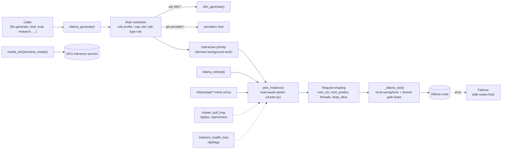

# 04 · LLM Cluster

Vera runs every local LLM call through one **cluster layer**: a registry of Ollama nodes, a rule-driven router that decides which node (and which model) serves each request, per-node concurrency control, a cross-process gate shared by every Vera process, and transparent failover. The same router also places media work (speech-to-text, text-to-speech, image generation) on GPU inference servers and can hand a request to a [vLLM](./21-vllm.md) server or an external API provider when a routing rule says so. The reference deployment is a small home network: one GPU node (plus a CPU-only Ollama beside it on the same machine) and two CPU nodes.

The core lives in [`vera/capability_orchestration.py`](../vera/capability_orchestration.py) (node registry, routing rules, `ollama_generate`, `ollama_embed`, media routing, the routing capabilities) and [`vera/workers/cluster.py`](../vera/workers/cluster.py), which **replaces** the base `pick_instance()` with the load-aware picker that actually runs in production, polls nodes for loaded models, and mounts the Ollama-compatible mimic proxy. Small pure modules hold individual decisions: [`vera/workers/route_preference.py`](../vera/workers/route_preference.py), [`vera/workers/node_choice.py`](../vera/workers/node_choice.py), [`vera/ollama_gate.py`](../vera/ollama_gate.py), [`vera/ollama_inflight.py`](../vera/ollama_inflight.py), [`vera/ollama_node_fault_core.py`](../vera/ollama_node_fault_core.py) and [`vera/ollama_kv_core.py`](../vera/ollama_kv_core.py).

**Status:** production. Every generation and embedding Vera makes goes through this layer. The cross-process gate is feature-flagged (`VERA_OLLAMA_GATE`) and fails open when coordination is unavailable. Warm model slots and workload scenarios are on by default. The portable inference adapter (§17) is an offline seam that no existing caller uses yet.

## Contents

- [1. Architecture at a glance](#1-architecture-at-a-glance)
- [2. Source map](#2-source-map)
- [3. Nodes](#3-nodes)
  - [Default cluster](#default-cluster)
  - [The GPU node's CPU sibling](#the-gpu-nodes-cpu-sibling)
  - [Adding, disabling and persisting nodes](#adding-disabling-and-persisting-nodes)
  - [Node settings on the hosts](#node-settings-on-the-hosts)
- [4. Health monitoring](#4-health-monitoring)
- [5. Model routing: how a node and a model are chosen](#5-model-routing-how-a-node-and-a-model-are-chosen)
  - [5.1 Entry points](#51-entry-points)
  - [5.2 The decision pipeline in ollama_generate](#52-the-decision-pipeline-in-ollama_generate)
  - [5.3 Routing layers and precedence](#53-routing-layers-and-precedence)
  - [5.4 Rule fields](#54-rule-fields)
  - [5.5 Built-in job-type rules](#55-built-in-job-type-rules)
  - [5.6 Declared per-capability rules and role profiles](#56-declared-per-capability-rules-and-role-profiles)
  - [5.7 The node picker](#57-the-node-picker)
  - [5.8 Interactive priority](#58-interactive-priority)
  - [5.9 Failover](#59-failover)
  - [5.10 Worked examples](#510-worked-examples)
- [6. Concurrency: slots, semaphores and the cross-process gate](#6-concurrency-slots-semaphores-and-the-cross-process-gate)
- [7. Request shaping: context window, output budget, threads, keep-alive](#7-request-shaping-context-window-output-budget-threads-keep-alive)
- [8. Warm model slots and workload scenarios](#8-warm-model-slots-and-workload-scenarios)
- [9. Embeddings](#9-embeddings)
- [10. Media nodes: STT, TTS and image generation](#10-media-nodes-stt-tts-and-image-generation)
- [11. Delegation to vLLM and API providers](#11-delegation-to-vllm-and-api-providers)
- [12. The Ollama mimic proxy](#12-the-ollama-mimic-proxy)
- [13. Inspecting cluster state](#13-inspecting-cluster-state)
- [14. Capability reference](#14-capability-reference)
- [15. Configuration](#15-configuration)
- [16. Events and storage](#16-events-and-storage)
- [17. Portable inference compatibility](#17-portable-inference-compatibility)
- [18. Model catalogue, benchmarks and hardware fit](#18-model-catalogue-benchmarks-and-hardware-fit)
  - [Hardware facts](#hardware-facts)
  - [Finding and installing models](#finding-and-installing-models)
  - [Repointing routes and the optimiser](#repointing-routes-and-the-optimiser)
  - [Benchmarks](#benchmarks)
  - [Specialist (non-LLM) models](#specialist-non-llm-models)
- [19. Troubleshooting](#19-troubleshooting)
- [See also](#see-also)
- [Screenshots](#screenshots)
- [Capabilities](#capabilities)

---

## 1. Architecture at a glance



Three background loops keep the router's view of the cluster fresh: the health loop (`/api/tags` every 20 s, which also pings media nodes), the cluster poller (`/api/ps` every `CLUSTER_POLL_INTERVAL` seconds for resident models and VRAM), and the warm-slot tick (every 60 s, §8).

---

## 2. Source map

| File | Responsibility |
|---|---|
| `vera/capability_orchestration.py` | `OLLAMA_INSTANCES`, job types and `DEFAULT_ROUTING_RULES`, rule resolution (`_resolve_rule`, `_resolve_cap_routing`, `resolve_role_rule`, `_merge_rule_over_base`), base `pick_instance`, `ollama_generate`, `ollama_embed`, interactive priority, route statistics, context-window sizing, media nodes (`resolve_media`, `media_base`, `media_slot`), `_ollama_slot` (semaphore + gate), failover, routing capabilities and Redis persistence |
| `vera/workers/cluster.py` | Load-aware `_pick_instance_load_aware` (monkey-patched over `pick_instance` at import), `/api/ps` poller and `vera:cluster:ollama` snapshot, host affinity for co-located workers, the Ollama mimic proxy (`/ollama/api/*`, `/ollama/v1/*`), `obs.cluster`, `cluster.mimic.*`, `cluster.job.stop`, ONNX runtime advertising |
| `vera/workers/route_preference.py` | Pure scoring terms: soft `prefer` bonus (0.5), warm-residency bonus (0.3), saturation penalty (1.0), warm-spill candidate filter |
| `vera/workers/node_choice.py` | Pure tie-break: load/preference score, then least-recently-used, then static priority, then id |
| `vera/workers/warm_models_core.py`, `warm_models_capabilities.py` | Warm model slots, workload scenarios, `ollama.warm.*` |
| `vera/ollama_gate.py` | Cross-process concurrency gate ("one big queue"): TTL-fenced slot leases in a shared coordination Redis |
| `vera/ollama_gate_broker_client.py` | HTTPS client a dev sandbox uses to obtain gate leases from the controller instead of touching its Redis |
| `vera/ollama_inflight.py` | Pure sweep that reclaims routing slots held by requests that never returned |
| `vera/ollama_node_fault_core.py` | Which request errors count against a node's health (a model-not-found 404 does not) |
| `vera/ollama_kv_core.py` | KV-cache bytes per token from `/api/show` metadata (hybrid-attention aware), used for the VRAM-safe context window |
| `vera/model_tag_core.py` | Exact model-tag matching (`x` ≡ `x:latest`, nothing looser) used by the picker |
| `vera/workers/routing_parity_core.py` | Seeds a dev sandbox's empty routing layers from prod so both route alike |
| `vera/routing_panel.html` | The Model Routing page (`/ui/panels/model-routing`) |
| `vera/ollama_routing_map_element.js` | `<vera-ollama-map>`: live node diagram that pulses the node a real request landed on |
| `vera/workers/nodes_capabilities.py` | `nodes.ollama.settings`, `nodes.ollama.settings.set`, `nodes.ollama.tune` (host-side Ollama tuning over SSH) |
| `vera/models/ollama_inference_adapter.py` | Offline portable-inference adapter over `ollama_generate` (§17) |

---

## 3. Nodes

### Default cluster

`OLLAMA_INSTANCES` in `capability_orchestration.py` starts with three nodes:

| id | Default URL | Label | GPU | Priority |
|---|---|---|---|---|
| `gpu-250` | `http://192.168.0.250:11435` | GPU Node | yes | 0 |
| `cpu-246` | `http://192.168.0.246:11435` | CPU Node A | no | 1 |
| `cpu-247` | `http://192.168.0.247:11435` | CPU Node B | no | 2 |

Each entry also carries runtime state: `enabled`, `status` (`unknown`/`online`/`offline`), `latency_ms`, `models`, `in_use`, `last_check`, `errors`, and optionally `num_ctx`, `num_thread`, `running`, `vram_used_gb`, `version`.

> [!NOTE]
> The `OLLAMA_GPU_URL`, `OLLAMA_CPU_A_URL` and `OLLAMA_CPU_B_URL` environment variables populate `cfg.OLLAMA_INSTANCES` and are passed through to spawned containers, but the orchestrator's routing registry above is defined with literal URLs and does not read them. To point the router at different hosts, register nodes with `ollama.add_instance` (an existing id is overwritten), which persists them in Redis.

### The GPU node's CPU sibling

`nodes.ollama.tune` can add a **CPU-only Ollama beside the GPU node's own** (`ollama-vera-cpu.service`, port `11436`, GPU hidden, same model store read-only). It registers as `<gpu-id>-cpu` (for the default cluster, `gpu-250-cpu`) and is the `EMBED_PRIMARY_NODE` the built-in rules prefer for embeddings, naming, the chat's one-line opener and background `idle_*` work. The routing code treats it as an ordinary CPU node; if it is not registered, those rules' soft preference simply has nothing to favour.

### Adding, disabling and persisting nodes

```python
from Vera.vera.capability_orchestration import add_ollama_instance
add_ollama_instance("gpu-300", "http://10.0.0.30:11435", has_gpu=True, label="GPU Node B")
```

```bash
curl -X POST http://localhost:8999/ollama/instances/add \
  -H 'Content-Type: application/json' \
  -d '{"id":"gpu-300","url":"http://10.0.0.30:11435","has_gpu":true,"label":"GPU Node B"}'

# take a node out of routing without deleting it (it keeps being pinged)
curl -X POST http://localhost:8999/ollama/node/config -d '{"id":"cpu-247","enabled":false}'
```

Node settings (`enabled`, `priority`, `label`, `url`, `has_gpu`, `num_ctx`, `num_thread`) are persisted to `vera:ollama:nodes` and re-applied at startup by `_load_ollama_persistence`. For the three built-in ids only `enabled`, `priority`, `label`, `num_ctx` and `num_thread` are restored; nodes that are not built in are re-created from their stored `url`.

### Node settings on the hosts

Estate › Models & NLP › **Node settings** (`nodes.ollama.settings`, read-only, one SSH read per node) shows what is tuned on each Ollama: Vera's registry values, the unit's `OLLAMA_*` / `LLAMA_ARG_*` / GPU environment, every systemd drop-in and its contents, and the runners loaded right now with the `-t` they were started with. `nodes.ollama.settings.set` changes `num_thread` (the registry value sent with every routed call, and the unit's `LLAMA_ARG_THREADS`, so a caller that sends none — a sandbox, an external client — still gets it instead of llama.cpp's default) and custom `OLLAMA_*` / `LLAMA_ARG_*` flags in a Vera-owned drop-in. Applying restarts the unit and rolls back if Ollama stops answering; dry run by default. `nodes.ollama.tune` brings every node to the concurrency layout (two parallel slots and room for three loaded models on CPU servers, a CPU sibling beside a GPU node) and writes the thread default on every CPU Ollama unit.

| Capability | Route | Purpose |
|---|---|---|
| `nodes.ollama.settings` | `GET /nodes/ollama/settings` | Live read of registry values, unit environment, drop-ins, managed flags and loaded runners per node |
| `nodes.ollama.settings.set` | `POST /nodes/ollama/settings/set` | `num_thread` and custom `OLLAMA_*`/`LLAMA_ARG_*` flags (drop-in `40-vera-custom.conf`); dry run by default, restart with rollback |
| `nodes.ollama.tune` | `POST /nodes/ollama/tune` | Concurrency layout: CPU servers get `OLLAMA_NUM_PARALLEL=2` and `OLLAMA_MAX_LOADED_MODELS=3` (drop-in `20-vera-concurrency.conf`, restarts the unit); a GPU node keeps one GPU slot and gains the CPU sibling on `:11436`. Dry run by default. |
| `nodes.ollama.tap` | `POST /nodes/ollama/tap` | Put the activity tap (`edge/ollama_tap.py`) on each Ollama's public port and move Ollama to `127.0.0.1:<port+10>`, so the Estate activity pane sees every request — Vera's, sandboxes' and external callers' — byte for byte. A failed cutover rolls back; a stale tap is refreshed without touching Ollama (skipped while calls are in flight unless `force`). Dry run by default; refused from a dev sandbox. |
| `obs.node_temps` | `GET /nodes/temps` | Per-node CPU/drive temperatures, BMC sensors (fans, voltages, power), SMART health, disk usage and per-logical-CPU load for every SSH-registered node, probed every 60 s (containers report their host's sensors) |

---

## 4. Health monitoring

Two loops maintain node state:

| Loop | Interval | Calls | Updates |
|---|---|---|---|
| `instance_health_loop` (orchestrator) | 20 s | `GET /api/tags` per node, then `GET /health` per media node | `status`, `latency_ms`, `models`, `last_check`, `errors` (reset to 0 on success, +1 on failure); emits `ollama.health` |
| `cluster_poll_loop` (`cluster.py`) | `CLUSTER_POLL_INTERVAL` (10 s) | `GET /api/ps` every tick; `GET /api/version` cached for `OLLAMA_VERSION_TTL`; `POST /api/show` once to fill an unset `num_ctx` | `running`, `vram_used_gb`, `model_count` (resident models), `ps_raw`, `version`; writes `vera:cluster:ollama` (60 s TTL) and emits `cluster.ollama_snapshot` |

A node becomes `offline` either when a ping fails or when three *node-fault* request errors accumulate (§5.9). An `offline` node is never routed to; it returns on its next successful ping. A node with `enabled: false` is pinged but excluded from all routing.

---

## 5. Model routing: how a node and a model are chosen

This section describes exactly what the code does when Vera needs an LLM.

### 5.1 Entry points

| Entry point | What it routes | Picker |
|---|---|---|
| `ollama_generate(prompt, …, model, instance_id, prefer_gpu, job_type, profile, role, options, …)` | Every generation (`llm.generate`, chat, agent loop, research, dream, planning, …) | Full pipeline (§5.2) |
| `ollama_embed(text, model, instance_id, prefer_gpu, provider)` | Every embedding | `pick_instance(job_type="embedding")` after the fastembed opt-in (§9) |
| `resolve_role(profile, role, model, prompt_chars)` | Pre-flight resolution for out-of-process callers; research `get_instance(tier)` | Role rule merged over its job-type rule, then `pick_instance` |
| `llm.route.resolve` (`GET /llm/route/resolve`) | Preview a decision without generating | Same as above, or `resolve_media` when `service` is given |
| `_pick_proxy_target` (mimic proxy) | Requests arriving on `/ollama/api/*`, `/ollama/v1/*` | `pick_instance` with the `mimic.proxy` rule (§12) |
| `resolve_media` / `media_base` / `media_slot` | STT, TTS, image generation | Media picker (§10) |
| `pick_vllm_instance` | Direct `vllm.*` calls and `vllm:` pins | vLLM picker ([21 · vLLM](./21-vllm.md#5-routing)) |
| NLP dispatch | `nlp.*` ONNX workloads | Separate node scorer ([30 · ONNX](./30-onnx.md#8-off-host-nlp-routing)) |

`pick_instance` is the name every caller uses, but at runtime it is `cluster._pick_instance_load_aware`: `cluster.py` assigns it over the orchestrator's base function when the module loads. The base version remains only as the fallback for a process that never loads `cluster.py`. The differences are listed in §5.7.

### 5.2 The decision pipeline in ollama_generate

In order:

1. **Caller identity.** `caller_override` (passed by intermediaries such as `llm.generate`) or a stack inspection gives `cap_name`, `caller_func`, `caller_file`.
2. **Run role override.** If the call carries `profile` + `role` and the current run set an override for that role (`RUN_ROLE_OVERRIDES`, chosen per run in the loop UI), its `model` replaces the caller's model and — unless the caller pinned an `instance_id` — its node becomes the pin. A node of `gpu` means "prefer GPU"; `auto` checks whether the model's on-disk size fits the GPU's usable VRAM.
3. **Rule lookup.** `role_rule = resolve_role_rule(profile, role)` when both are given; otherwise `cap_rule = _resolve_cap_routing(cap_name)` (longest matching pattern, user layer first).
4. **Job type.** `job_type` argument → the role/cap rule's `job_type` → `_infer_job_type(caller, model)`. Inference: a model name containing `embed` → `embedding`; otherwise the first substring of the caller's cap/function/file/module that matches `embed`, `autoname`/`auto_name`/`title` (naming), `dream`, `summariz`, `vision`, `code`, `chat`, `agent` (→ `chat`); else `default`.
5. **Effective rule.** The job-type rule from the active profile (or the built-in default) is the base. A role/cap rule is merged over it key by key (`prefer_gpu`, `deny_gpu`, `pin`, `allow`, `deny`, `model`, `ctx_mode`, `options`), then its **length escalation** applies if `len(prompt)+len(system) ≥ escalate_chars`.
6. **Model.** The caller's `model` wins; else the rule's `model`; else, for utility job types with no model, `ctx_policy_core.utility_model` picks a small model that some node carries; else the request later uses `OLLAMA_MODEL`.
7. **Backend delegation.** A rule `pin` of `vllm:<id>` / `vllm:*`, or `provider:<id>[/<model>]` (or a model ref `provider:<id>/<model>`), hands the request to vLLM or an external provider — unless the caller pinned an Ollama `instance_id`. Failure falls through to Ollama routing (§11).
8. **Interactive priority.** Background work is demoted off GPU nodes while a human is active (§5.8).
9. **Size estimates.** `ctx_need` (prompt + system at 2.3 chars/token, plus `max(num_predict, 1024)`) and `prompt_need` (prompt + system at the measured GPU chars/token, else 3.0, plus the 1024-token reserve).
10. **Pick.** `pick_instance(prefer_gpu, instance_id, model, job_type, rule_override, explain, ctx_need, prompt_need)`. The effective rule is passed as `rule_override` only when a role/cap rule matched or the call was demoted; otherwise the picker resolves the job-type rule itself. If nothing is routable the request falls back to `cpu-246`.
11. **Reserve.** `in_use += 1` on the chosen node **before the first `await`**, so concurrent callers see the raised load; the slot is registered in `OLLAMA_INFLIGHT` and the job type is appended to `ROUTE_DEMAND`.
12. **Shape.** Context window, output budget, `num_keep`, `num_thread`, `keep_alive` and warm-slot overrides (§7).
13. **Queue and generate.** `_ollama_slot(node)` waits for the local per-node semaphore and, when enabled, a gate lease (§6); then the HTTP call streams or returns.
14. **Record.** Route statistics (EMA of elapsed, tokens/s, chars/token, context shifts) per `(model, node, job_type)`; `ollama.request*` events; request-log entry.
15. **On error.** Failover (§5.9).

Every decision appends to an `explain` trail, which is logged on the `ollama_req` line, carried in `routing_info.reason`, and returned by `llm.route.resolve`.

### 5.3 Routing layers and precedence

All routing control lives on the **Model Routing** page (`/ui/panels/model-routing`, `routing_panel.html`), which is mounted as the *Model Routing* pane of the **Workers & Ollama** tab (and can be opened standalone). Its sections: cluster nodes, interactive priority, job-type routing, per-capability rules, role profiles, media routing, and routing activity. From least to most specific:

| Layer | Keyed by | Defined in | Stored in | Wins over |
|---|---|---|---|---|
| Built-in default rules | job type | `DEFAULT_ROUTING_RULES` | code | — |
| Job-type profile rules | job type | `ollama.routing.save` (named profiles, one active) | `vera:ollama:routing` | built-in rule for the same job type |
| Declared per-capability rules | cap name or `prefix.*` | `register_cap_routing()` in code | code | job-type rule (merged over it) |
| User per-capability rules | cap name or `prefix.*` | `ollama.cap_routing.save` | `vera:ollama:cap_routing` | declared rules: any user match wins outright |
| Declared role profiles | `profile/role` | `register_routing_profile()` in code | code | per-capability rules (a role call never consults cap rules) |
| User role overrides | `profile/role` | `ollama.role_profiles.save` | `vera:ollama:role_profiles` | the declared role |
| Run role override | `profile/role` for one run | loop run configuration | in-memory context | the role's model and node |
| Caller arguments | — | `model=`, `instance_id=`, `prefer_gpu=`, `options=` | — | `instance_id` beats every rule (including a rule `pin`); `model` beats a rule's model; `options` beat rule options key by key; `prefer_gpu=True` is never turned off by a rule, only by a `deny_gpu` filter |

**Job-type rule lookup** (`_resolve_rule`): an exact key in the active profile; else the exact built-in key; else glob keys (`idle_*`), active profile before built-ins, longest pattern first; else the built-in `default` rule. An empty rule (`{}`) in a profile means "inherit".

**Per-capability lookup** (`_resolve_cap_routing`): the longest matching pattern in the user layer; only if none matches, the longest in the declared layer. Pattern matching (`_match_glob`) is an exact id, `*`, or a trailing-`*` prefix.

> [!NOTE]
> A sandbox (Loop Lab) whose Redis has never held a user routing layer copies that layer from prod once at startup (`_seed_routing_parity`, emitting `ollama.routing.parity_seeded`), so a sandbox routes to the same models as prod and its own later edits are never overwritten.

### 5.4 Rule fields

| Field | Applies in | Effect |
|---|---|---|
| `pin` | all rules | Hard pin to a node id **if that node is online**; otherwise ignored and routing continues. `vllm:<id>`/`vllm:*`/`provider:<id>[/model]` delegate to another backend (§11). |
| `deny_gpu` | all | Remove GPU nodes from the candidates (ignored if that would leave none). |
| `prefer_gpu` | all | Run the GPU-preferring branch of the picker. A rule can switch it on; only `deny_gpu` or ctx escalation switch it off. |
| `allow` / `deny` | all | Glob lists (`gpu-*`, `cpu-247`, `*`) filtering candidates; a filter that would empty the set is ignored ("fails safe"). |
| `avoid_embed` | job-type rules, interactive demotion | Exclude the node embeddings currently route to (`_embed_node_id`: runtime pinned embed instance → embedding rule's pin → node whose URL matches `OLLAMA_EMBED_URL`), when another candidate remains. |
| `prefer` | job-type rules | Soft preference for one node id: −0.5 on its score — wins a tie, yields when it is the busier node. |
| `model` | all | Model for this job/cap/role when the caller names none. |
| `options` | all | Sampling and window defaults (`temperature`, `top_p`, `num_ctx`, …; `keep_alive` is lifted into the request). Merged key by key; caller options win. |
| `ctx_mode` | all | `fit` (default): output bounded to what fits in the window. `longform`: output may exceed the window via context shift, bounded by the node class ceiling. |
| `spill` | job-type rules | Opt in to warm CPU spill when every GPU slot is busy (§5.7). |
| `job_type` | cap and role rules | Job type whose base rule this rule merges over. |
| `escalate_chars` + `escalate` | cap and role rules | When the prompt is at least this many characters, merge `escalate` over the effective rule (booleans apply even when false, so an escalation can lift a `deny_gpu`). |
| `label`, `declared_by`, `pattern`, `role` | cap and role rules | Display and provenance. |

> [!NOTE]
> 🚧 **Not live.** Length escalation (`escalate_chars`) is a character-count proxy for "this prompt is hard enough for the GPU". A learned replacement, the `route.model_escalate` decision, is proposed in [48 · System 1 decision models](./48-system-one-decision-models.md#54-model-and-node-routing); today only the length threshold runs.

### 5.5 Built-in job-type rules

`OLLAMA_JOB_TYPES` lists the job types the UI offers; any string works as a job type and falls back to `default` (or a matching glob).

| Job type | Built-in rule | Why |
|---|---|---|
| `embedding` | `deny_gpu`, `prefer: gpu-250-cpu` | Light; never ties up a GPU. The CPU sibling is the primary embedder, CPU nodes take overflow. |
| `naming` | `deny_gpu`, `prefer: gpu-250-cpu`, `model: qwen2.5:0.5b` | Chat titles and tiny utility calls; a small model every node carries. |
| `summarize` | `prefer_gpu`, `allow: [gpu-*]` | Runs inline while the caller waits — the GPU is the fast lane. |
| `chat`, `dream`, `vision`, `code`, `default` | `prefer_gpu` | Interactive or general generation; untyped work is least-busy, GPU-first. |
| `research_planner`, `research_writer` | `prefer_gpu` | Strategic and long-form research generation. |
| `research_reader` | `deny_gpu`, `prefer: cpu-247` | Bulk page digestion on CPU. |
| `dream_director`, `chat_enrich` | `deny_gpu`, `prefer: cpu-247`, `pin: cpu-247`, `model: qwen3.6:35b-a3b`, `options: {num_ctx: 16384, keep_alive: "2h"}` | Long-horizon CPU work nothing waits on; the shared window lets every caller reuse one resident runner. |
| `plan_enrich` | as above without `model` | Broad planning style's per-stream briefs. |
| `stt`, `tts`, `imagegen` | `prefer_gpu` | Media services; consumed by `resolve_media`, not `pick_instance`. |
| `quick_opener` | `deny_gpu`, `prefer: gpu-250-cpu` | The chat's one-line acknowledgement must not queue behind the reply it announces. |
| `idle_*` | `prefer: gpu-250-cpu` | All background idle-queue and nightly jobs (`idle_<what>`); an idle GPU still takes overflow. |

> [!TIP]
> A rule `pin` is a hard pin only while the node is online. The long-horizon rules use it deliberately so those jobs *queue* on `cpu-247` instead of spilling onto the embedding node; when `cpu-247` is offline they route normally.

### 5.6 Declared per-capability rules and role profiles

Declared per-capability rules (code, overridable in the UI):

| Pattern | Job type | Filters |
|---|---|---|
| `research.plan*` | `research_planner` | `prefer_gpu` |
| `research.write*`, `research.report*` | `research_writer` | `prefer_gpu` |
| `research.*` | `research_reader` | `deny_gpu`; at ≥ 12 000 chars escalates to `deny_gpu: false, prefer_gpu: true` |
| `mimic.proxy` | `proxy` | none (governs the mimic proxy, §12) |

Declared role profiles (registered by subsystems at import):

| Profile | Owner | Roles |
|---|---|---|
| `research` | research | `thinker` (`research_planner`, GPU), `writer` (`research_writer`, GPU), `verifier` (`research_reader`, CPU, escalates to GPU at 12 000 chars) |
| `ide` | IDE | `thinker` (`code`, prefer GPU), `writer` and `verifier` (`code`, no GPU preference) |
| `loop` | agentic loop | `executor` (`loop_executor`, GPU, temperature 0.3), `planner`/`controller`/`tier` (`loop_planner`, GPU, planner model, `num_ctx` 16384), plus `coder` and `writer` |
| `planning_style` | planning | `lens` (`planning_lens`, GPU) and the broad style's roles |
| `quality` | catalog | `default` (empty; filled by a user override when a model is marked high-quality) |

Call a role inline with `ollama_generate(profile="research", role="verifier", …)`, or resolve it first:

```bash
curl 'http://localhost:8999/llm/route/resolve?profile=research&role=verifier&prompt_chars=15000'
# → {"instance_id":"gpu-250","job_type":"research_reader","rule":{…,"prefer_gpu":true,"deny_gpu":false},
#    "reason":["cap rule 'research/verifier' applied", …]}
```

The research system's `get_instance(tier)` resolves its role through Vera on every call (falling back to a static instance list only in standalone mode), so research traffic obeys cluster routing and shows up in the router's load accounting.

### 5.7 The node picker

`_pick_instance_load_aware` (`cluster.py`) decides, in this order:

1. **Candidates** = nodes with `status == "online"` and `enabled`. None → return `None` (the caller falls back to `cpu-246`).
2. **Caller pin.** `instance_id` in candidates → that node, no further checks.
3. **Rule.** `rule_override` if given, else `_resolve_rule(job_type)` when a job type is set. Then, in order: `pin` (if online) → that node; `deny_gpu` filter; `allow` filter; `deny` filter; `avoid_embed` exclusion (only with more than one candidate); `prefer_gpu |= rule.prefer_gpu`.
4. **Context escalation.** If a model is named and both a GPU and a CPU node hold it, and `prompt_need` (or `ctx_need` when no `prompt_need` is passed) exceeds `gpu_safe_ctx(model, gpu)` on every GPU node, choose the best **CPU node holding the model** and stop. The GPU's safe window is a learned per-model value (shrunk when a spill is detected) or `OLLAMA_MAX_AUTO_CTX` (65 536).
5. **GPU-preferring branch** (`prefer_gpu`):
   - **Warm spill** (opt-in): if every GPU node holding the model is saturated, and the rule sets `spill: true` or an active warm scenario lists this job type (`WARM_STATE.spill_job_types`), choose among CPU nodes where the model is *resident*, a slot is free, the prompt is under `spill_max_ctx` (8192), and the node has proven at least `spill_min_tps` (3.0) tokens/s for the model (an active scenario skips the throughput bar).
   - Else the best **GPU node holding the model**.
   - Else the best **node of any kind holding the model** (a cold pull on a GPU node can take minutes).
   - Else the best **GPU node**.
6. **Any node holding the model**, if a model is named.
7. **Least busy** of all candidates (logged as a cold-pull fallback when a model was named).

"Best" is `node_choice.choose` over this score — **lower wins**:

```
score = in_use
      + 0.5 × co-located busy Vera workers on that node
      + 0.2 × mimic-proxy queue depth for that node
      − 0.5 if the node is the rule's `prefer` node
      − 0.3 if the requested model is resident there (/api/ps)
      + 1.0 if in_use ≥ the node's slots (GPU 1, CPU = VERA_NODE_GATE_N, default 2; OLLAMA_CONCURRENCY overrides)
```

Ties break on **least-recently-picked** (a node never picked sorts first), then static `priority`, then node id. The pick time is recorded in the shared `_LAST_PICKED` map. Static priority deliberately comes *after* fairness; when it came first, one CPU node received ~90 % of a stream of one-at-a-time embeddings.

Model presence uses `model_tag_core.is_served`: an exact tag, with `x` and `x:latest` treated as the same model. A node holding `qwen2.5:0.5b` does not serve `qwen2.5:7b`.

**Differences from the base `pick_instance`** (used only if `cluster.py` is not loaded): the base picker routes optimistically to `unknown` nodes when none is confirmed online, relaxes `avoid_embed` when the embedding node is idle and every alternative is busy (`VERA_AVOID_EMBED_RELAX_AT`), uses `ctx_need` for escalation, and ranks by `(in_use, priority, −observed tok/s, last picked)` without preference, warmth, saturation or spill.

Stuck slots: before every pick, `_inflight_sweep` reclaims `in_use` slots older than `max(60, OLLAMA_GEN_TIMEOUT) + 120 s` (requests whose coroutine never resumed), so a lost request cannot steer routing forever.

### 5.8 Interactive priority

A generation whose job type is `chat`, `vision` or `code` and that is not inside a background context stamps "a human is active" (as do UIs via `activity.ping`). Work running inside a `BACKGROUND_LLM` context (dream cycles, programs, fabric NLP) is **demoted** when `enabled` and either `background_always_cpu` is set or a human was active within `window_s`, provided a CPU node is online and the caller did not pin an instance: the effective rule becomes `deny_gpu: true, prefer_gpu: false, avoid_embed: true, pin: ""`. The trail and `rule_source` record `+interactive-backoff` or `+bg-cpu`. With `defer_background`, autonomous drivers also skip *starting* new background runs in that window (`defer_background_now()`).

| Setting | Default | Meaning |
|---|---|---|
| `enabled` | `true` | Demote background LLM work off GPUs while a human is active |
| `window_s` | `180` | Seconds after the last interaction that count as active (minimum 10) |
| `defer_background` | `true` | Also hold off starting new background runs in the window |
| `background_always_cpu` | `false` | Keep all background LLM work off the GPU at all times |

Persisted in `vera:ollama:interactive_priority`; read and change with `ollama.interactive.get` / `ollama.interactive.set`.

### 5.9 Failover

When a generation fails (timeout, connection error, stall, HTTP error):

1. If the error is a **node fault** (`ollama_node_fault_core.is_node_fault`: anything except Ollama's "model not found"), the node's `errors` counter increments; at 3 it is marked `offline` until the next successful ping. A caller asking for a model nobody serves never takes a healthy node out of rotation.
2. An `ollama.request_error` event is emitted.
3. Other online nodes are tried **in order of `(in_use, priority)`** — idle nodes first — skipping:
   - any busy node when the job is a **background job** (job type starting with one of `VERA_BACKGROUND_JOB_TYPES`, default `dream_director,dream_,director_,idle_,journal_,reflect`), so background work never displaces foreground work;
   - nodes whose model list does not contain the model (here matched loosely by base name).
4. The request body is **refitted** for each fallback node (its own thread count, the context window clamped to what that node can hold) and goes through the same semaphore, gate and `in_use` accounting as a primary request.
5. The first success is returned with status `done_fallback`; if every node fails, the error propagates.

Failover does not consult the routing rules: a `deny_gpu` job can fail over onto a GPU node that is idle.

### 5.10 Worked examples

| Request | Trail (abridged) | Result |
|---|---|---|
| `llm.generate(prompt="…", job_type="chat")` with the GPU idle and holding the default model | job-type rule `chat` → rule prefers GPU → prefer_gpu + model | `gpu-250` |
| Same, but the GPU is generating and no scenario/spill is configured | GPU node holding the model still scores lowest among GPU nodes | `gpu-250` (queues on its slot) |
| Chat title (`naming`) | deny_gpu → [`cpu-246`, `cpu-247`, `gpu-250-cpu`]; prefer `gpu-250-cpu` (−0.5); `qwen2.5:0.5b` | `gpu-250-cpu`, or a CPU node if the sibling is busier |
| A 120 000-character executor prompt | ctx escalation: prompt exceeds the GPU window → CPU nodes holding the model | best CPU node holding the model (warm one first) |
| `research.read_page` with 20 000 chars | cap rule `research.*` → escalated (≥ 12 000) → deny_gpu lifted, prefer_gpu | `gpu-250` |
| A dream cycle step while the user is chatting | `+interactive-backoff`: deny_gpu, avoid_embed | a CPU node that is not the embedding node |
| `ollama_generate(..., instance_id="cpu-247")` | caller pinned | `cpu-247` (if online) |

---

## 6. Concurrency: slots, semaphores and the cross-process gate

Three independent mechanisms bound how much work a node receives:

| Mechanism | Scope | Default | What it does |
|---|---|---|---|
| `in_use` counter | per process | — | The router's load signal; incremented synchronously on pick, released in `finally`, swept if stuck (§5.7). |
| Per-node semaphore (`_ollama_sem`) | per process | GPU 1, CPU `VERA_NODE_GATE_N` (2); `OLLAMA_CONCURRENCY` overrides all | Serialises generations within this process. Embeddings do not take it. |
| Gate lease (`ollama_gate`) | all Vera processes sharing the coordination Redis | off unless `VERA_OLLAMA_GATE=1`; capacity GPU `VERA_GPU_GATE_N` (1), CPU `VERA_NODE_GATE_N` (2) | A slot key `vera:ollama:gate:<node>:slot:<i>` set with `NX PX`; released with an owner-checked Lua script. Stops prod and every dev sandbox from flooding the same GPU. |

`_ollama_slot(node, timeout, gate_wait)` acquires the semaphore, then the lease, under **one total queueing budget** (`timeout`, default `OLLAMA_QUEUE_TIMEOUT` = 0 = wait as long as needed). Gate behaviour:

- **Lease lifetime.** A short renewable lease (`VERA_GATE_LEASE_TTL_S`, 90 s) renewed every `VERA_GATE_RENEW_S` (30 s) by a heartbeat; an orphaned slot self-heals within one lease TTL.
- **Queue timeout is a failure.** If no slot frees within the gate wait (`VERA_GATE_WAIT_S`, 600 s, or the caller's `gate_wait`), the call raises and takes the normal error/failover path — it does **not** proceed ungated.
- **Coordination errors fail open.** If the coordination Redis errors, the call proceeds ungated and logs a warning.
- **Liveness.** The heartbeat frees a lease whose generation has gone silent after streaming started (`VERA_GATE_STALL_HOT_S`, 60 s), produced no token at all (`VERA_GATE_STALL_COLD_S`, 150 s), exceeded the absolute hold (`VERA_GATE_MAX_HOLD_S`, 1020 s), or belongs to a cancelled run.
- **Sandboxes.** A dev sandbox configured with `VERA_GATE_BROKER_URL` (+ `VERA_GATE_BROKER_SANDBOX`, `VERA_GATE_BROKER_TOKEN`) obtains opaque leases from the controller over HTTPS (`ollama.gate.lease.acquire|renew|release|status`, not MCP-exposed). A configured broker is a security boundary: a broker failure refuses inference rather than falling back to a private gate.
- **Coordination Redis.** DB `VERA_COORD_REDIS_DB` (0) on the main Redis, or `VERA_COORD_REDIS_URL`. Dead local leases are swept at startup.

Inspect it with `ollama.gate.status` (`GET /ollama/gate`), which reports per-node capacity and occupancy (or the broker's view). `/health` includes a `gpu_gate` summary.

---

## 7. Request shaping: context window, output budget, threads, keep-alive

After a node is chosen, `ollama_generate` fits the request to it (`VERA_AUTO_CTX_FIT=1`, default):

- **Window (`num_ctx`).** Prompt tokens (at the route's *measured* chars/token, never above the 2.3 default) plus the output room (`ctx_policy_core.output_room`: the node class ceiling and any pinned `num_predict`, at least `OLLAMA_CTX_RESERVE_OUT` = 1024), rounded to a stable step and capped by `effective_num_ctx` (the node-safe maximum, learned from VRAM, KV-per-token from `ollama_kv_core`, and observed spills). A pinned `num_ctx` is a floor; a `num_ctx_max` option is a ceiling. Floor 4096.
- **Warm slot.** If the model is planned on that node (§8), the planned window is used when the request fits, so the call lands on the already-loaded runner.
- **Output (`num_predict`).** With `ctx_mode: fit`, the room left in the window minus `OLLAMA_CTX_SAFETY_MARGIN` (256), bounded by the node ceiling (`VERA_OUTPUT_MAX_TOKENS` 16 384 overall; `VERA_OUTPUT_MAX_TOKENS_CPU` 3072 on CPU nodes; `VERA_OUTPUT_MAX_TOKENS_GPU`, 0 = use the overall value). With `longform`, the ceiling itself.
- **`num_keep`.** Derived from `num_ctx` so a context shift keeps the instructions.
- **`num_thread`.** CPU nodes get the node's `num_thread` or `VERA_CPU_NODE_THREADS`; GPU nodes get none.
- **`keep_alive`.** Caller value → a rule's `options.keep_alive` → `-1` (number) for a planned warm model → `OLLAMA_KEEP_ALIVE` (`10m`).
- **`think`.** JSON-mode calls default to `think: false` so reasoning models do not leave `response` empty.
- **Timeouts.** HTTP timeout `OLLAMA_GEN_TIMEOUT` (900 s) unless the caller passes `timeout`; a stream that produces nothing new for `OLLAMA_STALL_TIMEOUT` (240 s) is abandoned.

`ollama.model_ctx` reports a model's declared context window (`/api/show`); `cluster.instance_update` sets a node's display `num_ctx`.

---

## 8. Warm model slots and workload scenarios

Each node keeps a planned set of models loaded (`ollama.warm.status|set|apply`, `vera/workers/warm_models_*`). A GPU node has one slot, a CPU node two; embedding models ride beside the slots and never take one. The plan per node is, in order: an explicit list for the node (`@default`, `@naming`, `@embed`, `@long_horizon` aliases allowed), else the models the routing rules point at it (a `pin`, then a `prefer`, and their `model`), topped up from the class default. Models that do not fit the node's memory (85 % share, weights + 20 % KV overhead) are dropped and reported.

A 60-second tick loads what is missing with `keep_alive: -1` at the planned window (one load per node per pass, never on a node with a call in flight or one the router used moments ago, and never on the GPU while a census goal is in flight), and releases a model it pinned that the plan dropped. Calls Vera routes to a planned model carry `keep_alive: -1` and the planned window, so they stay on the runner the warmer spawned. Nothing re-arms a resident model on a timer: a load-only call to a resident model on CPU takes tens of seconds and holds up the node's embeddings.

**Workload scenarios** take the slots over while a job type runs hot — e.g. `coding`: when `code`/`loop_coder` demand reaches `min_requests` in `window_s` (or `min_inflight` live), coder models go into every slot (`fill: "all"`) per node class, and stay for `hold_s` after the demand falls away. A scenario can also turn warm spill on for its job types (§5.7). Scenarios stay off while a census goal is in flight. Configure them in Estate › **Models & NLP**, which also holds the NLP placement switches and the specialist model catalog. Config lives in `vera:ollama:warm`, scenario state in `vera:ollama:warm:state`; `ollama.warm.apply` is a dry run by default and refused from a dev sandbox.

---

## 9. Embeddings

`ollama_embed()` is the single entry for every embedding (fabric, memory, vector stores):

1. **Opt-in fastembed.** If the effective provider (`provider=` argument or `VERA_EMBED_PROVIDER`) is `fastembed`, embed locally on ONNX Runtime; on any failure fall through to Ollama ([30 · ONNX](./30-onnx.md#7-onnx-runtime-embeddings-opt-in)).
2. **De-duplication.** Concurrent identical requests share one in-flight call, and results are cached briefly (`OLLAMA_EMBED_CACHE_MAX` 512 entries, `OLLAMA_EMBED_CACHE_TTL` 120 s).
3. **Routing.** `pick_instance(prefer_gpu = arg or embed config, instance_id = arg or pinned embed instance, model = OLLAMA_EMBED_MODEL, job_type="embedding")` — so the built-in `embedding` rule (CPU only, prefer the CPU sibling) applies unless the embed config pins a node.
4. **Call.** `/api/embed`, falling back to `/api/embeddings` on older Ollama; text truncated to 4096 characters; timeout `OLLAMA_EMBED_TIMEOUT` (300 s, generous because an embed can queue behind a generation on the same node).

Runtime embed config (`ollama.embed_config`, `ollama.embed_config_set`, stored in `vera:ollama:embed`): `embed_model`, `prefer_gpu`, `pinned_instance`. `OLLAMA_EMBED_URL` is no longer the target of every embed; it identifies the "embedding node" that `avoid_embed` steers away from when no instance is pinned.

---

## 10. Media nodes: STT, TTS and image generation

The GPU inference servers (`edge/GPU_inference.py`, port 8765) are routable nodes in `MEDIA_INSTANCES`. At startup `media-gpu` is seeded from `GPU_INFER_URL` and a candidate `media-<ollama-id>` on every other Ollama host (same port); candidates stay offline until the server is installed there. The health loop calls each node's `/health` and records which services it serves (`whisper` → `stt`, `tts` → `tts`, `stable_diffusion` → `imagegen`).

`resolve_media(service)`:

1. Candidates: online, enabled media nodes; narrowed to those reporting the service (any online node if none does).
2. The service's job-type rule (`stt`, `tts`, `imagegen`): `pin` (if a candidate) wins; else `deny_gpu`, `allow`, `deny` filters (each ignored if it would empty the set).
3. `prefer_gpu` (default true, unless `deny_gpu`): keep GPU nodes if any.
4. Pick the lowest `(in_use, priority)`.

`media_base(service)` returns the URL or falls back to `GPU_INFER_URL`; `media_slot(service)` also holds an `in_use` slot for the call's duration. Stateful flows stay sticky: duplex voice sessions and image progress polls remember the node they started on. Manage nodes with `media.nodes`, `media.node.add|remove|config` and `media.ping` (persisted in `vera:media:nodes`).

---

## 11. Delegation to vLLM and API providers

- **vLLM.** A job-type rule, per-cap rule or role whose `pin` is `vllm:<id>` (or `vllm:*` for the best online vLLM server) makes `ollama_generate` call `vllm_generate` with `system\n\nprompt`, the rule's model, `max_tokens` = `num_predict` (default 1024), `temperature`/`top_p` from options, and `guided_json: {"type":"object"}` in JSON mode. If no vLLM node is online, or the call raises, routing continues on Ollama. A caller `instance_id` bypasses the delegation.
- **API providers.** A pin of `provider:<id>` or `provider:<id>/<model>` — or a model ref `provider:<id>/<model>` — sends the request through `providers.chat` (usage and cost recorded by the providers module; JSON mode appends a "respond with a single JSON object" instruction). On failure the provider model ref is dropped and Ollama routing continues.

vLLM's `guided_json` is one possible mechanism for structured output, not Vera's canonical structured-output API. The provider-neutral foundation in `vera/providers/structured_generation.py` gives provider-native schemas, Instructor and Outlines one bounded vocabulary for schema, validation, streaming, latency and retry ownership. Its current deterministic lane performs schema and value inspection only; no model or provider is invoked.

---

## 12. The Ollama mimic proxy

`cluster.py` always mounts an Ollama-compatible API on Vera's own port, scoped so it does not shadow Vera's `/ollama/*` control routes:

```
POST|GET http://<vera-host>:8999/ollama/api/{path}    (Ollama API)
POST|GET http://<vera-host>:8999/ollama/v1/{path}     (OpenAI-compatible API)
```

External clients (editor plug-ins, n8n, Open WebUI) point at Vera instead of a node and get cluster routing, concurrency control and observability:

- **Routing.** The `mimic.proxy` per-cap rule (declared baseline, user rule wins) supplies job type, filters and a default model when the client names none. `pick_instance(prefer_gpu=<mimic setting>, model, job_type, rule_override)` chooses the node; fallbacks are the first online GPU node, any online node, then the host's own node. GETs (`/api/tags`, `/api/ps`, …) go to the routed node.
- **Refit.** The body's options are refitted for the node (thread count, window cap) so a client's oversized `num_thread` does not oversubscribe a CPU node.
- **Concurrency.** Up to `PROXY_MAX_CONCURRENCY` (3) in flight per node; beyond that a per-node FIFO queue (`PROXY_QUEUE_MAX` 50, else HTTP 429) waits up to `PROXY_QUEUE_TIMEOUT` (120 s, else HTTP 504). Each node drains its own queue, so a slow node never blocks another.
- **Streaming.** Missing `stream` is treated as `true` (Ollama's default); streamed chunks are forwarded as they arrive and the slot is released when the stream ends.
- **Observability.** Each request is appended to the `vera:ollama_proxy_log` stream (1000 entries) and emits `ollama.proxy_request` plus `ollama.request` / `ollama.request_done` / `ollama.request_error`, so it appears in the Jobs view.
- **Control.** A monitor page at `/cluster/mimic/panel` (the **Mimic** pane of Workers & Ollama) backed by:

| Capability | Route | Purpose |
|---|---|---|
| `cluster.mimic.status` | `GET /cluster/mimic/status` | `mounted`, `paused`, `prefer_gpu`, `routing` (`gpu-preferred` or `load-aware`), `current_target` (where a request would go now), `online_nodes`, `local_instance`, `active`, `queue_depth`, `queue_per_node`, `queue_max`, `max_concurrency`, `queue_timeout` |
| `cluster.mimic.config` | `POST /cluster/mimic/config` | Runtime changes, not persisted: `paused` (return 503 without forwarding), `max_concurrency` (≥ 1), `prefer_gpu` (GPU-preferring vs pure load-aware routing); emits `ollama.proxy.config` |
| `cluster.mimic.requests` | `GET /cluster/mimic/requests` | Requests that came through the proxy (not Vera's own traffic), newest first, from `vera:ollama_proxy_log` |
| `cluster.mimic.requests.clear` | `POST /cluster/mimic/requests/clear` | Clear that stream |

Model routing for proxied traffic is edited like any other caller: add a user rule for the pattern `mimic.proxy` on the Model Routing page (for example a `model` to use when clients omit one, or a `pin`).

The mimic does not use the per-node semaphore or the gate; it is bounded by its own per-node concurrency limit.

`LOCAL_OLLAMA_INSTANCE` (or a hostname/IP match against node URLs) sets this host's node affinity: workers registered on this host are tagged with it (`ollama_instance`), so their running tasks add load to that node's score.

---

## 13. Inspecting cluster state

### `GET /health` (`obs.health`)

```json
{
  "redis": true, "postgres": true, "chroma": false, "neo4j": true,
  "workers": 3, "caps": 412, "mcp_servers": 2,
  "ollama": {
    "gpu-250": {"status": "online", "latency_ms": 18, "has_gpu": true},
    "cpu-246": {"status": "online", "latency_ms": 42, "has_gpu": false},
    "cpu-247": {"status": "offline", "latency_ms": null, "has_gpu": false}
  },
  "gpu_gate": {"…": "…"},
  "census": {"…": "…"},
  "mode": "distributed"
}
```

### `GET /cluster` (`obs.cluster`)

Workers cross-referenced with their Ollama node, the enriched node snapshot, ONNX runtime availability, queue backlog and proxy state:

```json
{
  "workers": {"…": "…"},
  "ollama": {
    "gpu-250": {
      "id": "gpu-250", "label": "GPU Node", "status": "online", "has_gpu": true,
      "enabled": true, "latency_ms": 18, "in_use": 1,
      "models": ["qwen2.5:0.5b", "nomic-embed-text:latest", "…"],
      "running": ["…"], "vram_used_gb": 9.1, "model_count": 1,
      "errors": 0, "version": "…", "proxy_queued": 0
    }
  },
  "onnx": {"shared_dir": "…/edge/models", "shared_artifacts": [], "count": 0, "runtimes": []},
  "queues": {"task_queue_len": 0, "result_queue_len": 0, "pending_tasks": 0},
  "proxy": {"active": 0, "local_instance": "gpu-250", "queue_depth": 0,
            "queue_per_node": {}, "max_concurrency": 3, "enabled": true},
  "local_ollama_id": "gpu-250",
  "ts": "…"
}
```

### Other views

| What | Capability |
|---|---|
| Per-node status, `num_thread` that requests carry | `ollama.instances` (`GET /ollama/cluster`) |
| Models per node with sizes | `ollama.list_models` (`GET /ollama/models`) |
| Why a request would go where | `llm.route.resolve` |
| Recent requests: caller, model, node, timing, status | `ollama.request_log` (in-process ring buffer) |
| Rolling `(model, node, job_type)` stats: count, EMA elapsed, tokens/s, chars/token, context shifts, duration estimate | `ollama.route_stats` |
| Gate occupancy | `ollama.gate.status` |
| Warm plan, residency, scenarios | `ollama.warm.status` |
| Mimic proxy requests | `cluster.mimic.requests`, `obs.proxy_log` |

The **Workers & Ollama** tab (`workers_ollama_panel.html`) shows per-node cards (status, latency, GPU/CPU, resident models with VRAM), the Model Routing pane, the Mimic pane, the vLLM pane and a live test runner. `<vera-ollama-map>` draws the nodes and pulses the one an `ollama.request` event just landed on.

---

## 14. Capability reference

**Nodes and health**

| Capability | Route | Purpose |
|---|---|---|
| `ollama.instances` | `GET /ollama/cluster` | Live status of every node |
| `ollama.add_instance` | `POST /ollama/instances/add` | Add or overwrite a node (`id`, `url`, `has_gpu`, `label`, `num_thread`); persisted |
| `ollama.node.config` | `POST /ollama/node/config` | `enabled`, `priority`, `label`, `num_thread`; persisted |
| `ollama.ping_instance` | `POST /ollama/ping` | Ping one node now |
| `ollama.list_models` | `GET /ollama/models` | Models per node |
| `ollama.pull` | `POST /ollama/pull` | Pull a model onto a node |
| `ollama.model_ctx` | `GET /ollama/model_ctx` | A model's real context window |
| `ollama.model_tags.get` / `.set` | `GET /ollama/model_tags`, `POST /ollama/model_tags/set` | User purpose tags per model |
| `cluster.instance_update` | `POST /cluster/instance/update` | Set a node's `num_ctx` / `label` (not persisted) |
| `obs.cluster` | `GET /cluster` | Full cluster view |
| `obs.health` | `GET /health` | Overall health incl. node status |
| `nodes.ollama.settings` / `.settings.set` / `nodes.ollama.tune` | `/nodes/ollama/…` | Host-side Ollama tuning over SSH |

**Routing**

| Capability | Route | Purpose |
|---|---|---|
| `ollama.routing.get` | `GET /ollama/routing` | Active profile, all profiles (raw + effective rules), built-in defaults, job types, nodes |
| `ollama.routing.save` | `POST /ollama/routing/save` | Create/update a profile's job-type rules; `activate` optional |
| `ollama.profile.activate` / `.delete` | `POST /ollama/profile/…` | Switch or delete a profile (`default` cannot be deleted) |
| `ollama.cap_routing.get` / `.save` / `.delete` | `/ollama/cap_routing…` | Per-capability rules (user layer editable) |
| `ollama.role_profiles.get` / `.save` / `.delete` | `/ollama/role_profiles…` | Role profiles and user role overrides |
| `ollama.interactive.get` / `.set` | `/ollama/interactive…` | Interactive priority |
| `activity.ping` | `POST /activity/ping` | Mark the human active |
| `llm.route.resolve` | `GET /llm/route/resolve` | Preview a routing decision |
| `ollama.route_stats` | `GET /ollama/route_stats` | Route statistics and estimates |
| `ollama.request_log` | `GET /ollama/request_log` | Recent requests |

**Concurrency, warm slots, embeddings, media, proxy**

| Capability | Route | Purpose |
|---|---|---|
| `ollama.gate.status` | `GET /ollama/gate` | Gate state and occupancy |
| `ollama.warm.status` / `.set` / `.apply` | `/ollama/warm/…` | Warm slots and scenarios |
| `ollama.embed_config` / `ollama.embed_config_set` | `GET`/`POST /ollama/embed_config` | Embedding model, GPU preference, pinned node |
| `media.nodes`, `media.node.add|remove|config`, `media.ping` | `/media/…` | Media node registry |
| `cluster.mimic.status` / `.config` / `.requests` / `.requests.clear` | `/cluster/mimic/…` | Mimic proxy monitor and control |
| `obs.proxy_log` | `GET /cluster/proxy_log` | Recent proxied requests |
| `cluster.job.stop` | `POST /cluster/job/stop` | Cancel a running or queued task by id, across hosts |

**Generation**

| Capability | Route | Purpose |
|---|---|---|
| `llm.generate` | `POST /llm/generate` | General generation through the cluster (`job_type`, `prefer_gpu`, `model`, `output_format`, `files`, `save_as`); streams on `tokens` |
| `ollama.generate_raw` | `POST /ollama/generate_raw` | Direct generation with sampling parameters |
| `llm.route` | `POST /llm/route` | Try registered `llm*` capabilities in turn, falling back to `ollama_generate` |
| `llm.summarize`, `llm.classify`, `llm.translate`, `llm.rewrite`, `llm.qa`, `llm.explain`, `llm.analyze`, `llm.brainstorm`, `llm.plan`, `llm.code_review` | `/llm/…` | Task-shaped wrappers |
| `llm.formats` | — | Shared output-format profiles |

---

## 15. Configuration

| Variable | Default | Purpose |
|---|---|---|
| `OLLAMA_MODEL` | `jaahas/qwen3.5-uncensored` | Default model when no caller, rule or utility model applies |
| `OLLAMA_EMBED_MODEL` | `nomic-embed-text` | Default embedding model |
| `OLLAMA_EMBED_URL` | `http://192.168.0.246:11435` | Identifies the embedding node for `avoid_embed` |
| `OLLAMA_KEEP_ALIVE` | `10m` | Default `keep_alive` on generations |
| `OLLAMA_GEN_TIMEOUT` | `900` | Generation HTTP timeout (s) |
| `OLLAMA_STALL_TIMEOUT` | `240` | Abandon a stream that produces nothing new (s) |
| `OLLAMA_EMBED_TIMEOUT` | `300` | Embedding timeout (s) |
| `OLLAMA_EMBED_CACHE_MAX` / `OLLAMA_EMBED_CACHE_TTL` | `512` / `120` | Embedding result cache |
| `OLLAMA_CONCURRENCY` | unset | Override the per-node in-process semaphore for every node |
| `OLLAMA_QUEUE_TIMEOUT` | `0` | Total queueing budget for a slot (0 = unbounded) |
| `OLLAMA_MAX_AUTO_CTX` | `65536` | GPU context ceiling for auto-detection and escalation |
| `OLLAMA_VRAM_USABLE_FRAC` | `0.78` | Usable share of VRAM for window sizing |
| `OLLAMA_DEFAULT_GPU_VRAM_GB` | `12.0` | Assumed VRAM when unknown |
| `OLLAMA_CHARS_PER_TOKEN` | `2.3` | Fallback chars/token for window sizing |
| `OLLAMA_CTX_RESERVE_OUT` / `OLLAMA_CTX_SAFETY_MARGIN` | `1024` / `256` | Output reserve and window margin |
| `VERA_AUTO_CTX_FIT` | `1` | Fit `num_ctx` to each prompt |
| `VERA_OUTPUT_MAX_TOKENS` / `_GPU` / `_CPU` | `16384` / `0` / `3072` | Output ceilings |
| `VERA_CPU_NODE_THREADS` | `6` | Default `num_thread` for CPU nodes without their own value |
| `VERA_AVOID_EMBED_RELAX_AT` | `1` | Base picker only: relax `avoid_embed` when alternatives are this busy |
| `VERA_BACKGROUND_JOB_TYPES` | `dream_director,dream_,director_,idle_,journal_,reflect` | Prefixes treated as background for failover |
| `VERA_OLLAMA_GATE` | off | Enable the cross-process gate |
| `VERA_GPU_GATE_N` / `VERA_NODE_GATE_N` | `1` / `2` | Gate capacity (and CPU semaphore size) |
| `VERA_GATE_LEASE_TTL_S` / `VERA_GATE_RENEW_S` / `VERA_GATE_WAIT_S` / `VERA_GATE_TTL_S` | `90` / `30` / `600` / `1800` | Lease timing |
| `VERA_GATE_STALL_HOT_S` / `VERA_GATE_STALL_COLD_S` / `VERA_GATE_MAX_HOLD_S` | `60` / `150` / `1020` | Lease liveness bounds |
| `VERA_COORD_REDIS_DB` / `VERA_COORD_REDIS_URL` | `0` / unset | Coordination Redis for the gate |
| `VERA_GATE_BROKER_URL` / `_SANDBOX` / `_TOKEN` | unset | Sandbox gate broker |
| `GPU_INFER_URL` | `http://192.168.0.250:8765` | Primary media node and media fallback |
| `LOCAL_OLLAMA_INSTANCE` | unset | This host's node id for worker affinity |
| `PROXY_MAX_CONCURRENCY` / `PROXY_QUEUE_MAX` / `PROXY_QUEUE_TIMEOUT` | `3` / `50` / `120` | Mimic proxy limits |
| `CLUSTER_POLL_INTERVAL` | `10` | `/api/ps` poll interval (s) |
| `OLLAMA_VERSION_TTL` | poll-cache default | How long a node's version is cached |
| `ONNX_RUNTIME_URLS` | unset | Edge ONNX servers advertised in `/cluster` |

See [10 · Configuration](./10-configuration.md) for the full list.

---

## 16. Events and storage

**Events**

| Event | Emitted when |
|---|---|
| `ollama.health` | Every health tick (status + latency per node) |
| `cluster.ollama_snapshot` | Every poll tick (status, in_use, VRAM, resident count) |
| `ollama.request`, `ollama.request_done`, `ollama.request_error` | Generation/embedding lifecycle (also emitted for vLLM, provider and proxied calls) |
| `ollama.proxy_request`, `ollama.proxy.config` | Mimic proxy traffic and config changes |
| `ollama.node.config`, `ollama.interactive.config`, `ollama.warm.config` | Configuration changes |
| `ollama.routing.parity_seeded` | A sandbox copied routing layers from prod |
| `cluster.instance_updated` | `cluster.instance_update` |
| `media.node.added`, `media.node.removed` | Media registry changes |
| `worker.cancelled` | `cluster.job.stop` |

**Redis keys**

| Key | Content |
|---|---|
| `vera:ollama:nodes` | Node registry settings |
| `vera:ollama:routing` | Job-type profiles and the active profile |
| `vera:ollama:cap_routing` | User per-capability rules |
| `vera:ollama:role_profiles` | User role overrides |
| `vera:ollama:route_stats` | Route statistics (saved every 10 updates) |
| `vera:ollama:interactive_priority` | Interactive priority config |
| `vera:ollama:embed` | Embed config |
| `vera:ollama:model_tags` | Model purpose tags |
| `vera:ollama:warm`, `vera:ollama:warm:state` | Warm-slot config and scenario state |
| `vera:ollama:gate:<node>:slot:<i>` | Gate leases (coordination DB) |
| `vera:media:nodes` | Media node registry |
| `vera:cluster:ollama` | Enriched node snapshot (60 s TTL) |
| `vera:ollama_proxy_log` | Mimic proxy request stream |

---

## 17. Portable inference compatibility

`vera/models/ollama_inference_adapter.py` can expose the existing generation seam as an `InferenceProvider` without changing current callers. Each adapter is bound to one ModelPackage, model selector, and Ollama instance, so portable requests cannot silently change their model or route, while the established Ollama layer remains the sole owner of its queue, resource gate, telemetry and retry behaviour.

The adapter maps prompt plus optional system text, bounded sampling parameters, streamed token callbacks, output-token usage, truncation and cancellation into the shared inference event contract. A truncated response is an explicit failed terminal outcome rather than a successful partial answer. The legacy runner is injected, so importing or testing the adapter performs no network or model call. Existing `ollama.*` capabilities are unchanged; migration requires separate parity evidence before any traffic is redirected. See [30 · ONNX](./30-onnx.md#10-portable-model-layer) for the wider portable model layer.

---

## 18. Model catalogue, benchmarks and hardware fit

The [`vera/catalog/`](../vera/catalog/) package is the model-selection side of the cluster: it knows each node's hardware, finds models that fit, installs them, repoints routes at them, and measures them. It is surfaced in Estate › **Models & NLP** and the catalogue/benchmark panes.

### Hardware facts

| Capability | Route | Purpose |
|---|---|---|
| `catalog.nodes` | `GET /catalog/nodes` | Ollama and vLLM nodes with detected or overridden hardware (VRAM, RAM, GPU, cores), free disk (root and model store), SSH mapping, installed models, and any "slow high-quality" class |
| `catalog.node.ssh_set` | `POST /catalog/node/ssh_set` | Map a routing node to a stored SSH host |
| `catalog.node.detect` / `catalog.nodes.detect_all` | `POST /catalog/node/detect`, `/catalog/nodes/detect_all` | Detect hardware over SSH (`nvidia-smi`, `free`, `nproc`) and cache it |
| `catalog.node.hw_set` | `POST /catalog/node/hw_set` | Manual override (`source=manual`) |

Hardware is stored in `vera:catalog:node_hw` (SSH mapping in `vera:catalog:node_ssh`) and feeds the fit verdicts below and the VRAM-safe context sizing (§7).

### Finding and installing models

| Capability | Route | Purpose |
|---|---|---|
| `catalog.search` | `GET /catalog/search` | Search Hugging Face (default tag `gguf` = Ollama-pullable) with a hardware-fit badge per result for a node, the cluster, or any (`fits`), assuming a quant (`Q4_K_M`) |
| `catalog.browse.index` / `catalog.browse` | `GET /catalog/browse…` | Browse by trending, popular, recent, family, publisher or parameter-size window without a search term |
| `catalog.model` | `GET /catalog/model` | One repo's file tree, GGUF quant variants with size, estimated VRAM/RAM, fit and throughput, context length and card summary |
| `catalog.installed` | `GET /catalog/installed` | Installed models per node with quant, parameters, size, residency, and free disk |
| `catalog.install.plan` | `POST /catalog/install/plan` | Dry run: concrete model ref and hardware verdict |
| `catalog.install` | `POST /catalog/install` | Install on a node (`backend` `ollama`\|`vllm`; `via` `direct` or `store` = pull once into the shared model store); delegates to `ollama.pull`, the model-store pull, or `vllm.server.start` |
| `catalog.pull.start` / `status` / `cancel` / `resume` / `clear` | `/catalog/pull/…` | Background downloads with progress, speed and ETA, mirrored across Vera instances through Redis (`vera:catalog:pulls`); a download interrupted by a restart resumes from its partial data (automatically at startup) |
| `catalog.model.delete` | `POST /catalog/model/delete` | Delete an installed model from a node |

### Repointing routes and the optimiser

| Capability | Route | Purpose |
|---|---|---|
| `catalog.route.set_model` | `POST /catalog/route/set_model` | The easy model swap: point a per-capability rule (`scope=cap`, `pattern`) or a role (`scope=role`, `profile` + `role`) at a model, optionally pinning a node or setting `prefer_gpu`/`deny_gpu`; wraps `ollama.cap_routing.save` / `ollama.role_profiles.save` |
| `catalog.node.mark_quality` | `POST /catalog/node/mark_quality` | Mark a node "slow high-quality" and pin a large model to it under the `quality` role profile (§5.6), so loops and agents can ask for the high-quality route; `model=""` unmarks |
| `catalog.optimize.suggest` | `POST /catalog/optimize/suggest` | Recommend the best recent model that fits each node (current → suggested), no side effects |
| `catalog.optimize.apply` | `POST /catalog/optimize/apply` | Install the selections and optionally repoint roles |
| `catalog.autoopt.get` / `catalog.autoopt.set` | `/catalog/autoopt…` | Opt-in auto-optimise per node and role on an interval (default 1440 min), with a run log (`vera:catalog:autoopt`) |

### Benchmarks

| Capability | Route | Purpose |
|---|---|---|
| `bench.suites` | `GET /bench/suites` | Deterministic role packs (`instruct`, `reasoning`, `code`, `json`, `factual`, `embed`, `vision`) |
| `bench.run` / `bench.run.start` / `bench.status` | `/bench/run…`, `/bench/status` | Benchmark one model on one node — throughput, load time and pack accuracy — synchronously or in the background (`bench.progress` events) |
| `bench.results` / `bench.result.get` / `bench.clear` | `/bench/result…` | Stored results (`vera:bench:*`) |
| `bench.compare` | `GET /bench/compare` | Role leaderboard: latest result per (model, node), ranked by accuracy then tokens/s |
| `bench.passive` | `GET /bench/passive` | Metrics harvested from real traffic (the route statistics of §13): observed tokens/s, latency, request count and job types |
| `bench.loop` | `POST /bench/loop` | Qualitative check: run a real agentic loop profile with the model pinned |
| `bench.node_perf` / `bench.node_perf.history` | `GET /bench/node_perf…` | Per-node live monitor: reachability, resident models and VRAM, hardware and free disk, live workload, with a sparkline history |
| `bench.node_gpu` | `POST /bench/node_gpu` | On-demand `nvidia-smi` sample over SSH |
| `bench.node_trace` | `POST /bench/node_trace` | Run a real generation and sample clocks, temperature, power and throttling (GPU) or the container's CPU use (CPU) while it runs |
| `bench.node_requests` | `POST /bench/node_requests` | Who is calling a node, from the node's own access log over SSH — including callers that bypass Vera |
| `bench.matrix.variants` / `start` / `status` / `cancel` / `results` / `get` | `/bench/matrix/…` | Context × quantisation sweep on one node: per (model, window) cell it times warm calls and reads how much stayed on the GPU; cells end `ok`, `throttled`, `cpu_bound`, `spill` or `error`; each model gets a recommended window (the largest within 10 % of its best clean speed, never a spilled one). Cells hold the node's generation slot, so a sweep queues behind live work. |
| `bench.matrix.apply` | `POST /bench/matrix/apply` | Adopt a sweep's recommended windows as the **learned safe window** per model on that node, which the context sizing of §7 prefers over its estimate |

### Specialist (non-LLM) models

`vera/catalog/specialist_*` manages the estate's non-LLM models — the NLP server's task models ([30 · ONNX](./30-onnx.md#8-off-host-nlp-routing)), the GPU media servers' Whisper / TTS / Stable Diffusion models (§10), GLiNER and spaCy:

| Capability | Route | Purpose |
|---|---|---|
| `specialist.status` | `GET /specialist/status` | Per node: the deployed NLP server version against the current source, each task's model, whether it is in the shared store and loaded; media services; host entity NER |
| `specialist.store` | `GET /specialist/store` | What the shared specialist-model store holds per family, its NLP export manifest and free space |
| `specialist.catalog` | `GET /specialist/catalog` | Curated alternatives per family and task, marked in use and built; optional Hugging Face search |
| `specialist.install` | `POST /specialist/install` | Build a model into the shared store as a job on the builder container (NLP models are exported to ONNX); does not switch any node to it |
| `specialist.jobs` | `GET /specialist/jobs` | Builder jobs and logs |
| `specialist.node_models` / `.prune` | `/specialist/node_models…` | Models in each node's own caches outside the store, and pruning of copies the read-only store already serves (dry run by default) |
| `specialist.store.mount` | `POST /specialist/store/mount` | Bind-mount the shared store read-only into every Ollama node's container (dry run by default) |

---

## 19. Troubleshooting

| Symptom | Likely cause | Check / fix |
|---|---|---|
| Every call lands on `cpu-246` | No node online (the hard fallback), or health loop stalled | `GET /ollama/cluster`; `ollama.ping_instance` |
| GPU taken out of rotation for ~20 s | Three node-fault errors (timeouts, 5xx) | `ollama.request_log?status=error`; a model-not-found 404 no longer counts |
| A request went to CPU unexpectedly | ctx escalation, `deny_gpu` rule, interactive backoff, or no GPU node holds the model | `llm.route.resolve` with the same `job_type`/`cap_name`/`model`/`prompt_chars`; read `reason` |
| A model is cold-pulled on a node | The model is on no online node; the picker fell back to least busy | `ollama.list_models`; pull it where it belongs, or pin a `model` in the rule |
| Calls queue behind each other on one node | The rule pins or soft-prefers that node, or every alternative is filtered out | `ollama.routing.get` effective rules; `ollama.gate.status` |
| "gpu gate timeout on <node>" | The gate queued past its wait budget | Another process holds the slot; `ollama.gate.status`; the call fails over |
| Long outputs truncated | `ctx_mode: fit` bounds output to the window; CPU ceiling 3072 | Set `num_predict`, raise `VERA_OUTPUT_MAX_TOKENS_CPU`, or use `ctx_mode: longform` for that role |
| A chat waits behind background work | Background job not demoted | `ollama.interactive.get`; set `background_always_cpu` |
| Embeddings concentrate on one node | A pinned embed instance | `ollama.embed_config`; clear `pinned_instance` |
| `in_use` stays high while nodes are idle | A request never returned | Swept automatically after the generation timeout + 120 s |

---

## See also

- [Capability Framework](./01-capability-framework.md) — `llm.*` and `gpu.*` capabilities that consume the cluster
- [vLLM Backend](./21-vllm.md) — the other backend the router can delegate to
- [ONNX Export & Runtime](./30-onnx.md) — fastembed embeddings, off-host NLP routing, the portable model layer
- [Docker](./13-docker.md) — `docker.worker.*` spawn containers that join this cluster
- [Workers, Jobs & Syslog](./22-workers-jobs-syslog.md) — worker registry, job persistence, the proxy log
- [Agent Runtimes & Providers](./36-agent-runtimes-providers.md) — the `providers.chat` backend behind `provider:` pins
- [Configuration](./10-configuration.md) — all env vars in one place
- [Research System](./07-research.md) — resolves its thinker/writer/verifier roles through the `research` role profile

## Screenshots

<!-- VERA:AUTO:screenshots START -->
_No screenshots captured yet — run `docs.build` (or `operator.mission.run documentation`)._
<!-- VERA:AUTO:screenshots END -->

## Capabilities

<!-- VERA:AUTO:capabilities START -->
_No capabilities resolved for this domain._
<!-- VERA:AUTO:capabilities END -->
