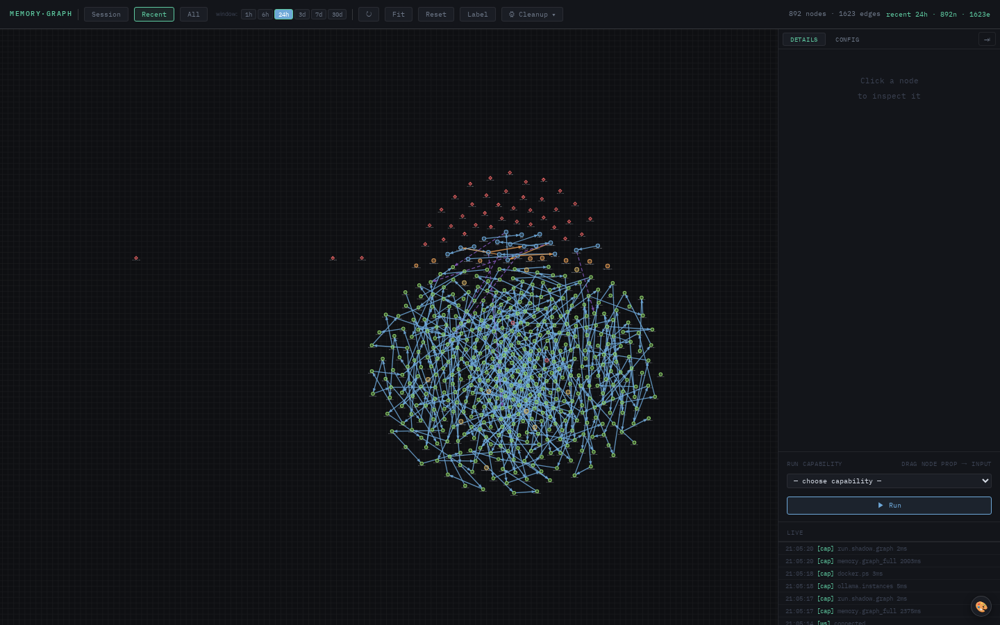

# 05 · Memory Graph

Context convergence starts with a provider-neutral assembly contract. Every
admissible item carries stable identity, source, revision, provider, relevance,
explicit token count, and a citation. Assembly selects whole items
deterministically within the caller's budget; it never silently truncates away
provenance or admits uncited text. Native memory, Worldview, and other sources
can adopt this contract incrementally. Provider queries run concurrently;
ordinary failures are reported by provider without discarding healthy context,
while cancellation remains a control signal rather than a recoverable failure.
The native memory adapter now maps authorized MemoryProvider search hits into
that boundary without becoming a second store: Fabric record/revision IDs and
citations remain authoritative, and token counting is supplied explicitly by
the caller that owns the target model budget.
Worldview can optionally rerank those authoritative items using bounded cosine
similarity from a named model checkpoint. It cannot contribute cached text
directly: unmatched neighbours are ignored, citations and source revisions are
unchanged, and the normalized score and ranking weight are retained as evidence.

Reciprocal enrichment now has a shared, payload-free evidence ledger. NLP,
Worldview and other systems can attach bounded scores or scalar annotations to
an exact context revision without copying its text. Derived evidence must retain
every upstream authority and citation, cannot predate or outlive its parents,
and cannot return to a producer already present in its ancestry. Producer-owned
tombstones record invalidation without deleting history. Projection separates
current, stale and tombstoned evidence while leaving the authoritative
`ContextItem` unchanged.

`ContextRegistry` makes those components discoverable without exposing their
payloads. Its stable manifest contains only canonical component IDs and roles;
duplicate registration, ambiguous selection, and unknown IDs fail before any
provider runs. Callers explicitly choose providers and the ordered ranker chain,
so adding an adapter cannot silently alter an existing request.

Discovery can feed that same registry without creating a second context plane.
`run_discovery_context_route` completes the bounded discovery route, binds its
exact result and current registry manifest into a payload-free selection, then
composes only the selected registered providers and rankers. Invalid budgets
and ranker IDs fail before scouting; registry drift, unregistered discovered
providers, and empty allowlisted selections fail closed. The combined report
retains discovery receipts and rejected options beside provider/ranker failures
and the final token-budgeted assembly.

Composition gathers and validates all provider candidates first, applies each
optional ranker to the still-complete candidate set, and performs the token-budget
selection exactly once at the end. This ordering matters: ranking evidence can
promote a relevant candidate that the original provider score would otherwise
exclude. Provider failures and ranker failures are reported separately using
bounded exception types, the last valid candidate set survives an ordinary ranker
failure, and cancellation propagates across every boundary.

Curated ontology knowledge can participate through the same ranker boundary,
but only as a caller-supplied, named and versioned snapshot. Each assertion has
a stable ID, source match, concept, relation, confidence and curator. The adapter
does not read Vera's mutable capability-ontology database, where manual and
generated relations coexist, and it cannot create context or change citations.
It records the selected assertion as bounded ranking evidence; generated
ontology expansion remains outside the trusted context path.

Vera's memory system is a Neo4j-backed knowledge graph augmented with vector search. Every meaningful interaction — a capability call, a chat turn, a research job, a file write, a workspace open — can land on the graph as a node, linked into a per-session activity chain. The graph is what gives the rest of the system long-term, cross-session continuity.

The system has three layers:

1. **`memory.py`** — `MemoryRecord` dataclass, backend abstraction (Neo4j + vector), the canonical `store()`/`query()` API.
2. **`memory_hooks.py`** — session graph helpers, `memory.*` capabilities, the session graph endpoints.
3. **`memory_second_order.py`** — inferred edges (co-occurrence, similarity) built on top of the first-order chain.

---

## 1. The MemoryRecord

```python
@dataclass
class MemoryRecord:
    id:            str
    session_id:    str
    record_type:   str      # "message" | "event" | "fact" | "summary" | "entity" | ...
    source_type:   str      # "user" | "ai" | "tool" | "system" | ...
    category:      str      # dotted: "cap.fabric" | "ide.workspace" | "research.job"
    tags:          List[str]
    text:          str      # short, indexable (≤500 chars)
    full_text:     str      # the complete content
    summary:       str
    human_text:    str
    ai_output:     str
    importance:    float    # 0–1, used for visual weighting + retention scoring
    archived:      bool
    language:      str
    capability:    str      # which cap created this record
    content_hash:  str
    parent_id:     str      # DERIVED_FROM edge to parent
    model:         str
    metadata:      dict     # arbitrary JSON
    created_at:    str      # ISO timestamp
    updated_at:    str
```

Records are fanned out to three backends by default:

- **Postgres**, as the native durable record archive and first exact-read source.
- **Neo4j**, as `(m:Memory {...})` nodes with all fields as properties.
- **Chroma**, with `text` (or `full_text` truncated) embedded for semantic search.

Session nodes are stored as `(s:Session {session_id, agent_name, created_at, ...})`. The Neo4j backend creates a `(:Session)-[:CONTAINS]->(:Memory)` edge automatically for every record with a `session_id`, so the harness can scope queries to a single session without joining anything explicitly.

### Record authority and projections

The current native runtime has one logical `MemoryRecord`, but it writes that
shape to three independently readable backends. Postgres is the native durable
content-authority claim and is registered first. Chroma is the rebuildable
vector projection, while Neo4j is the graph and relationship projection. The
`HybridMemoryStore` coordinates best-effort fan-out; it is not a database or a
transaction boundary. Its exact-record read returns the first backend result in
registration order, so a successful read does not by itself prove that all
three copies agree. Reconciliation and repair must therefore be explicit.

Backend operations are latency-bounded independently. After the separately
bounded embedding step, store, search, and update give each backend
`VERA_MEMORY_BACKEND_TIMEOUT_S` seconds (10 seconds by default). A timed-out
provider contributes a failed write/update receipt or no search hits while the
healthy providers continue; task cancellation still propagates instead of being
reported as an ordinary provider failure. This bounds degradation without
claiming cross-backend transactionality.

Development sandboxes normally point at the shared production memory services,
so their write guard suppresses native memory mutations. A suppressed operation
reports `false` for each backend—it never claims that a protected no-op was
persisted. The guard has an explicit process-level override for controlled
validation and seeding; routine sandbox traffic remains protected.

The longer-term canonical authority is an immutable Fabric `RecordRevision`.
A `MemoryProjection` is retrieval state bound to that exact record and revision
through a citation; it is never a competing source of original content. The
native adapter is deliberately read-only and converts a trusted legacy snapshot
into that projection contract. `MemoryRecord` remains the compatibility ingress
until runtime traffic is migrated.

Moving authority requires more than changing which backend is queried. A safe
cutover needs receipts for both sides of every dual write, complete
reconciliation, stable identity mappings, and success, failure, timeout,
cancellation, restart and recovery parity. Direct writers and stored/external
consumers must also be inventoried. Until that evidence exists, native records
remain operational and no stored memory or backend copy is eligible for
automatic deletion.

### Portable MemoryProvider migration

W2-04 begins an additive provider boundary in
`vera.fabric.memory_provider`; it does not redirect the capabilities described
below. A `MemoryProjection` points to an authoritative Fabric `record_id` and
`revision_id`, retains tenant/namespace/session/type lifecycle context, and
requires at least one citation to that exact revision. The stable `memory_id`
is derived from tenant, namespace and Fabric record identity, while updated
content remains a new Fabric revision. Tombstones carry no projected text.
The source revision's content hash and the projected text hash are distinct
fields, preserving an audit seam for provider-specific summarization or mapping.

The associated `MemoryAccessContext` always names the tenant and principal.
Providers receive a bounded policy context containing identity, lifecycle and
the projection's declared policy—but never memory text. The offline
`FrozenMemoryProvider` denies by default and uses an injected authorizer for
apply, search and exact reads, including per-result policy checks. A cross-tenant
lookup returns no record rather than leaking its existence.

`MemoryQuery` standardizes bounded query text, namespace/session/type/tags,
tombstone visibility, text redaction, page size and opaque pagination. Cursors
are checksummed and tied to both the exact query semantics and provider
generation, so a changing projection cannot silently shift an in-progress
page sequence. The frozen adapter's deterministic lexical score exists only to
exercise filtering, ordering and pagination; it makes no semantic-retrieval
quality claim.

The read-only `native_memory_adapter` now covers the first compatibility seam.
It consumes a plain native record snapshot plus a trusted binding to an exact
Fabric `RecordRevision`; it deliberately does not import the native Memory
runtime or touch its backends. Tenant, namespace, record/revision identity,
policy, content authority and tombstone state cannot be taken from arbitrary
legacy metadata. The adapter emits an exact Fabric citation, strips arbitrary
metadata/vectors/relations/model/source URL fields, fails on identity or archive
conflicts, and ensures tombstones expose none of the text retained by legacy
soft deletion.

`project_native_memory_with_receipt` adds deterministic conversion evidence
without retaining the native payload. Its receipt binds the canonical native
snapshot hash, adapter version, authority revision/source hash and derived
projection hash. It is intentionally not a provider-write acknowledgement:
successful apply, persistence, later reads and reconciliation need their own
auditable provider events.

`memory_audit.AuditedMemoryProvider` now supplies the provider-operation side
of that seam for offline conformance. Every apply/read/search attempt with an
explicit caller request ID produces a checksummed receipt for its normalized
outcome. The receipt contains identity, safe context hashes, counts and
generation—but no memory/query text, result payload or raw error message.
Underlying provider errors remain visible to the caller. The bounded frozen
sink demonstrates idempotency and capacity failure; it is not durable evidence.

The reference provider also exposes a bounded, policy-filtered projection
export. Export ordering is deterministic, includes tombstones, redacts text by
default and uses checksummed cursors bound to the provider generation, tenant,
principal and export options. It remains an observation of derived provider
state—not a new authority or a backup of Fabric content.

`memory_reconciliation.reconcile_memory_provider` compares that visible export
with an explicitly supplied set of authoritative Fabric projections. Its
payload-free report classifies matching, missing, unexpected and drifted memory
identities and hashes both complete sets. It never writes, repairs, deletes or
discloses memory text. A provider mutation during paging, malformed export,
cross-tenant expected record, duplicate identity or oversized set fails closed.

The current `MemoryRecord`, Postgres authority claim, Chroma/Neo4j fan-out and
`memory.*` API remain unchanged. Fabric revision creation, durable audit
storage/signing, repair/recovery and traffic migration still require later
proof. MemPalace and second-provider trials remain queued with other live tests.

---

## 2. The session chain

Every record stored with a `session_id` participates in two automatic edge patterns:

### `:Session -[:CONTAINS]-> :Memory`

Created by the Neo4j backend at store time, for every record with a session ID. This is the *parent-of* relationship — anything in the session is contained by it.

### `:Memory -[:NEXT_IN_SESSION]-> :Memory`

Created at store time: matches the most recent existing record in the same session whose `created_at < this.created_at`, and links it to the new record. This gives every session a linear chronological chain.

### `:Memory -[:DERIVED_FROM]-> :Memory`

Created when `parent_id` is set — explicit lineage. Used for things like "this summary was derived from those raw messages" or "this analysis was derived from that research job."

### `:Memory -[:FOLLOWS_ACTIVITY]-> :Memory`

The richer activity chain, separate from `NEXT_IN_SESSION`. Where `NEXT_IN_SESSION` is purely temporal, `FOLLOWS_ACTIVITY` tracks *causal* flow — one capability triggering the next, even across sessions, with edge properties carrying the category and timestamp.

The capability decorator's activity worker is what writes `FOLLOWS_ACTIVITY`. The `_SESSION_CURSOR` dict tracks the last node ID per session, and every new cap call links from the cursor to itself, updating the cursor.

---

## 3. Activity recording

When a capability with `memory="on"` runs and has a `session_id`, the wrapper enqueues an activity record onto `_ACT_QUEUE`. The `_activity_worker` background task drains the queue every two seconds and writes:

- One `MemoryRecord` per cap call (the **call node**), tagged `cap.<group>`, with both input parameters and output stored in `full_text` and `metadata`.
- A `FOLLOWS_ACTIVITY` edge from the previous chain step.
- (Optionally) a fabric record in dataset `caps.<group>` for semantic recall.

The worker uses a single rich node per call, **not** a call+output pair — the cap node carries both, and the Neo4j backend's auto-created session edge plus the FOLLOWS_ACTIVITY edge are enough to express the relationship.

Activity recording skips:

- Capabilities with `memory="off"`.
- Capabilities in groups: `fabric`, `memory`, `obs`, `health`, `ui` (these would recurse or pollute).
- Capability calls without a session ID (nowhere to attach them).

The `VERA_ACTIVITY_RECORDING` env var defaults to `"0"`. Set it to `"1"` to enable the worker. With it disabled, the activity queue silently fills and is discarded — no graph writes occur.

---

## 4. The `memory.*` capabilities

| Cap | Path | Purpose |
|---|---|---|
| `memory.store` | `POST /memory/store` | Store an arbitrary record |
| `memory.query` | `POST /memory/query` | Hybrid vector + text + filter search |
| `memory.search` | `POST /memory/search` | Semantic search (vector-only) |
| `memory.record_turn` | `POST /memory/record_turn` | Record a chat turn (human + AI) |
| `memory.agent_context` | `POST /memory/agent_context` | Build context for an agent (recent + relevant) |
| `memory.session_nodes` | `GET /memory/session/nodes` | All nodes in a session |
| `memory.session_edges` | `GET /memory/session/edges` | All edges in a session |
| `memory.session_graph` | `POST /memory/session/graph` | Combined nodes + edges (graph panel) |
| `memory.graph_stats` | `GET /memory/graph/stats` | Counts by label, category, edge type |
| `memory.graph_clear` | `POST /memory/graph/clear` | Destructive: wipe everything (requires `confirm=true`) |
| `memory.session_summary` | various | Summary helpers (categories, top nodes, etc.) |
| `memory.reindex_embeddings` | `POST /memory/reindex_embeddings` | Re-embed vectors already IN Chroma with the current provider (dry-run by default) |
| `memory.backfill_vectors` | `POST /memory/backfill_vectors` | Re-encode records in Postgres that are MISSING from the current Chroma collection — post-reset / model-switch / embedder-outage repair (dry-run by default) |

### Vector hygiene

The Chroma collection is **versioned per embed model**
(`vera_memory__<model>`), because different models emit different dimensions
(all-minilm = 384, nomic-embed-text = 768) and mixing them raises Chroma's
"expecting embedding with dimension of N, got M". Records are only ever
upserted with an **explicit vector** — when the embedder is offline the vector
write is skipped (the record is safe in Postgres) instead of falling back to
Chroma's built-in 384-dim default embedder. The embed circuit-breaker retries
every 5 minutes rather than latching until restart. After an outage or a
collection reset, run `memory.backfill_vectors` to re-encode the gap from
Postgres.

The Chroma HTTP client and server are also kept on the same major protocol
generation. A mixed 0.x client and 1.x server can pass heartbeat while failing
to decode collection configuration, which otherwise looks like a mysteriously
empty semantic layer. Chroma metadata accepts JSON scalar values only, so memory
timestamps hydrated as Python datetimes are normalized back to ISO-8601 before
metadata-only updates such as soft deletion.

### `memory.query`

Hybrid retrieval. Combines:

- **Vector similarity** — embed the query, find nearest neighbours in Chroma
- **Text match** — Neo4j full-text index on the `text` and `full_text` fields
- **Filters** — by `session_id`, `record_type`, `tags`, time range, importance threshold

Results are fused (score from each backend, weighted, deduplicated by ID).

### `memory.agent_context`

Builds a context blob for an LLM agent: pulls the N most recent records in the session, plus the M most semantically relevant records across history, formats them as a chronological narrative. Used by chat agents to give the LLM continuity.

---

## 5. Cross-module integration

Modules like `ide_capabilities.py`, `research_capabilities.py`, and `agents.py` use shared helpers to write to the graph in a uniform way:

- `_record(...)` (each module has its own) — stores a `MemoryRecord` with category like `ide.workspace`, `research.job_started`, `agent.chat_turn`.
- `_link(from_id, to_id, rel, ...)` — adds an explicit edge (e.g. `TRIGGERED_BY`, `PRODUCES`, `CITES`).
- The session's FOLLOWS_ACTIVITY cursor is shared across modules so all modules see the same chain.

`session_integration.py` provides cap wrappers (`integration.ide.*`, `integration.research.*`) that other systems call when they generate events outside the normal cap flow. For example, when researcher_api (running standalone) completes a job, it calls `integration.research.job_completed` to put the result on the graph.

---

## 6. Second-order edges

`memory_second_order.py` adds inferred edges that aren't from any explicit action:

- **Co-occurrence** — entities mentioned in the same record get `CO_OCCURS` edges with a count.
- **Similarity** — vector-nearest record pairs get `SIMILAR_TO` edges with the similarity score.
- **Topical clustering** — records sharing tags or categories above a threshold get cluster membership.

These edges are visible in the memory graph panel but don't participate in physics-driven layout (they'd distort the topology). Their purpose is recall: when querying "what's related to this?" the second-order edges expand the result set.

---

## 7. Querying the graph

A few canonical Cypher queries the system uses:

```cypher
// All records in a session, newest first
MATCH (s:Session {session_id:$sid})-[:CONTAINS]->(m:Memory)
RETURN m ORDER BY m.created_at DESC LIMIT 200

// Activity chain through a session
MATCH (a:Memory {session_id:$sid})-[r:FOLLOWS_ACTIVITY]->(b:Memory)
RETURN a, r, b ORDER BY r.ts

// Capability frequency per session
MATCH (s:Session {session_id:$sid})-[:CONTAINS]->(m:Memory)
WHERE m.capability <> ''
RETURN m.capability AS cap, count(*) AS n ORDER BY n DESC

// Find similar records across sessions
MATCH (m:Memory {id:$mid})-[s:SIMILAR_TO]->(n:Memory)
RETURN n ORDER BY s.score DESC LIMIT 10
```

The Neo4j driver requires modern `RETURN x AS alias` syntax for property access (use `record["alias"]` not `record["x.property"]`).

---

## 8. The memory graph panel

`memory_graph_panel.html` renders the session graph using the `vera-graph.js` component in `memory` mode. Features:

- **Source picker**: Fabric / Memory / Net
- **Memory mode selector**: Current session / Recent (24h) / All
- **Node-type chips**: toggle visibility per record type
- **Edge-type chips**: toggle per relationship type (NEXT_IN_SESSION, FOLLOWS_ACTIVITY, DERIVED_FROM, CONTAINS, ...)
- **Layout modes**: Default / Force+Axis / Timeline / Hierarchy / Radial
- **Pagination**: "Load older" pulls records older than the current oldest visible

Clicking a node opens a detail drawer with the record's full text, metadata, and action buttons (open in source panel, query similar, etc.).

The panel reads theme variables from the parent harness via the postMessage bridge so it stays in step with the active theme.

---

## 9. Maintenance

- **`memory.graph_clear`** — wipes all `:Memory` and `:Session` nodes. Destructive, requires `confirm=true`.
- **`memory.graph_stats`** — diagnostic. Returns memory count, session count, top categories, edge type distribution, and crucially a *duplicate* report (sessions sharing the same `session_id`, which should never happen — if it does, there's a bug somewhere).
- **Archived records** — set `archived=true` to hide a record from default queries without deleting it.

---

## See also

- [Data Fabric](./06-data-fabric.md) — the semantic store records also land in (caps datasets)
- [Galaxy Graph](./09-galaxy-graph.md) — the rendering component
- [Capability Framework](./01-capability-framework.md) — activity recording mechanics

## Screenshots

Documentation capture switches the panel to **Recent** after seeding representative
memory records. It waits for both the canvas and the populated node/edge status
line, so an empty session landing view cannot be mistaken for a useful graph.

<!-- VERA:AUTO:screenshots START -->
#### Recent memory activity



*A populated recent-activity graph with memory records, sessions, and their relationships.  ·  captured `seeded`*
<!-- VERA:AUTO:screenshots END -->

## Capabilities

<!-- VERA:AUTO:capabilities START -->
| Capability | HTTP | Description |
|---|---|---|
| `memory.agent_context` | — | Retrieve relevant past memories for injection into an agent's context. |
| `memory.all_edges` | — | Get all edges from Neo4j, including Session->Memory edges. |
| `memory.all_nodes` | — | Get all Memory nodes from Neo4j (no session filter). |
| `memory.auto_summarise` | — | Ask the LLM to generate a summary for a stored record and update it. |
| `memory.backends` | — | List active memory backends and their connection status. |
| `memory.backfill_vectors` | — | Re-encode memory records that exist in Postgres (the source of truth) but have NO vector in the CURRENT Chroma collection — use after a Chroma reset, an embed-model switch (collections are versione… |
| `memory.browse` | — | Look at REAL records from ONE dataset with NO search query needed — for 'what's actually in this dataset' rather than 'find me X'. Different from memory.seek: seek ranks by relevance to a query, br… |
| `memory.edge_diag` | — | Diagnostic: count edges in Postgres and Neo4j for a session. |
| `memory.find_similar_questions` | — | Vector-search past USER turns only. Building block for second-order recall. Inputs: query (str!), limit (int 5), session_id (str — restrict), min_score (float 0.0). Output: {questions: [{q, id, sco… |
| `memory.forget` | — | Soft-delete a memory record (sets archived=True). Records are never physically deleted. |
| `memory.get` | — | Retrieve a specific memory record by id. |
| `memory.graph_clear` | — | DESTRUCTIVE: delete ALL :Memory and :Session nodes. Requires confirm=True. |
| `memory.graph_full` | — | Return nodes + edges in one call. Use mode=session (+session_id), mode=recent, or mode=all. |
| `memory.graph_normalize` | — | Merge duplicate :Session nodes (same session_id), prune orphan Memory. |
| `memory.graph_stats` | — | Counts by label / category / per-session for the memory graph. |
| `memory.label_node` | — | Use LLM to generate a short readable label for a memory node based on its content. |
| `memory.label_session` | — | Label all unlabelled nodes in a session. Runs label_node for each node missing a summary. |
| `memory.map` | — | Browse the fabric's dataset namespaces ONE LEVEL at a time — there are thousands of datasets, never try to list them all. prefix='' shows the top-level namespaces with aggregate counts; prefix='cap… |
| `memory.neo4j_diag` | — | Diagnose Neo4j connectivity, node and edge counts. |
| `memory.promote` | — | Manually promote a Redis event or raw dict payload to persistent memory. |
| `memory.read` | — | Read ONE full record verbatim by id (ids come from memory.seek / fabric.query results). Checks the fabric first, then the session-memory store. Params: record_id (str!), offset (int 0 — character o… |
| `memory.recall` | — | Smart recall: semantic search + automatic graph-neighbour expansion for rich context. WHEN TO USE: the best general-purpose memory retrieval — use this before answering questions that might benefit… |
| `memory.recall_2nd_order` | — | Second-order recall: similar past USER questions → paired ASSISTANT answers → graph-neighbour knowledge attached to those answers. Inputs: query (str!), limit (int 5), graph_depth (int 1), neighbou… |
| `memory.record_turn` | — | Store a human→agent conversation turn as linked graph nodes. |
| `memory.reindex_embeddings` | — | Re-embed stored memory vectors (Chroma) with the CURRENT embedding provider — run after switching VERA_EMBED_PROVIDER so existing vectors match new ones. DRY-RUN by default. Input: confirm (bool — … |
| `memory.relate` | — | Create a typed relationship between two memory records in the graph. |
| `memory.search` | — | Search long-term memory using hybrid semantic + keyword matching. WHEN TO USE: recall past research results, stored facts, previous tool outputs for a topic. Input: query (str!), limit (int, defaul… |
| `memory.seek` | — | THE canonical way to search Vera's stored knowledge (data fabric + session memory). Hybrid keyword+semantic search across all storage backends with near-duplicate collapse and diversity selection, … |
| `memory.select` | — | Filter and sort a dataset's rows by FIELD VALUES — the typed read to complement memory.seek's semantic search. WHEN TO USE: you know the dataset and want specific rows (a symbol's price series in a… |
| `memory.session_delete` | — | DESTRUCTIVE: delete one session and all its memories. Requires session_id. |
| `memory.session_delete_bulk` | — | DESTRUCTIVE: delete multiple sessions matching a session_id prefix. Requires confirm=True. |
| `memory.session_edges` | — | Get all graph edges for a session from Neo4j. |
| `memory.session_graph` | — | Get all memory nodes for a session, ordered chronologically. |
| `memory.session_history` | — | Retrieve all memory records for a session, ordered by time. |
| `memory.session_init` | — | Create or resume a memory session node. Returns the session root node id. |
| `memory.session_nodes` | — | Get all Memory nodes for a session from Neo4j (not Postgres). |
| `memory.similar` | — | Find the top-N most semantically similar records to a given text or record id. |
| `memory.stats` | — | Statistics from all active memory backends (record counts, index sizes). |
| `memory.store` | — | Persist a text record to long-term memory (Postgres + Chroma vector index + Neo4j graph). WHEN TO USE: save important facts, research results, or context you want to recall in this or future sessio… |
| `memory.tooling` | — | Get or set the agent-facing retrieval tooling mode. mode='' reports the current mode. 'canonical' hides the overlapping fabric/memory read caps from agent discovery so agents converge on memory.see… |
| `memory.traverse` | — | Graph traversal from a memory node. Returns connected records up to depth hops. |
<!-- VERA:AUTO:capabilities END -->
