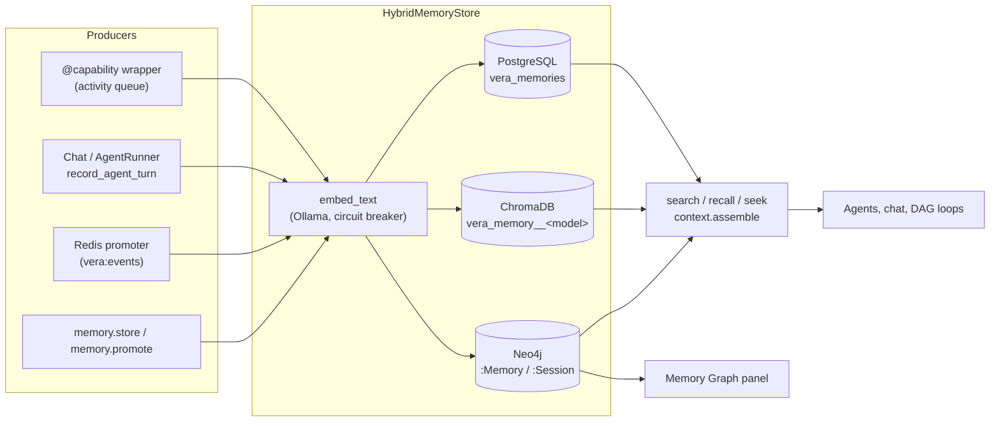

# 05 · Memory Graph

Vera's memory system is its long-term, cross-session recall layer. Every
meaningful interaction — a chat turn, a capability call, a DAG step, a stored
fact — can become a `MemoryRecord` that is written to a durable relational
archive (PostgreSQL), indexed for semantic search (ChromaDB) and projected onto
a knowledge graph (Neo4j), where it is linked into a per-session chain and to
the entities, records and other memories it relates to. Agents and panels read
it back through a family of retrieval capabilities that range from a single
canonical "seek" door for LLM agents to raw graph traversal for the Memory Graph
panel.

The runtime lives in `vera/fabric/` (`memory.py`, `memory_hooks.py`,
`memory_retrieval.py`, `memory_second_order.py`, `context.py`,
`session_notes.py`), with framework-wide activity recording in
`vera/capability_orchestration.py`. Alongside the runtime sits a set of
provider-neutral, offline-tested contracts — portable context assembly
(`vera/context_provider.py`, `vera/context_registry.py`,
`vera/context_enrichment.py`) and a portable `MemoryProvider` boundary
(`vera/fabric/memory_provider.py` and friends) — that describe how memory will
be served from immutable Fabric revisions.

**Maturity.** The `memory.*` capabilities, the Postgres/Chroma/Neo4j fan-out,
session chains, chat-turn recording and the retrieval surfaces are in
production use. Activity recording of every capability call is opt-in. The
portable context and `MemoryProvider` contracts are additive and exercised by
deterministic tests; they do not yet redirect any runtime traffic.

## Contents

- [1. Architecture at a glance](#1-architecture-at-a-glance)
- [2. Source map](#2-source-map)
- [3. The MemoryRecord](#3-the-memoryrecord)
- [4. Storage backends and the hybrid store](#4-storage-backends-and-the-hybrid-store)
  - [Backends](#backends)
  - [Write path](#write-path)
  - [Read path and ranking](#read-path-and-ranking)
  - [Two-tier (fast/slow) search](#two-tier-fastslow-search)
  - [Embeddings and vector hygiene](#embeddings-and-vector-hygiene)
  - [Dev-sandbox write guard](#dev-sandbox-write-guard)
  - [Record authority and projections](#record-authority-and-projections)
- [5. Graph model: nodes and edges](#5-graph-model-nodes-and-edges)
- [6. Activity recording](#6-activity-recording)
- [7. Chat turns and agent memory injection](#7-chat-turns-and-agent-memory-injection)
- [8. Redis event promotion](#8-redis-event-promotion)
- [9. Retrieval surfaces](#9-retrieval-surfaces)
  - [Choosing a retrieval door](#choosing-a-retrieval-door)
  - [Canonical agent retrieval (memory.seek and friends)](#canonical-agent-retrieval-memoryseek-and-friends)
  - [Session-memory search and recall](#session-memory-search-and-recall)
  - [Second-order recall](#second-order-recall)
  - [Context assembly (context.*)](#context-assembly-context)
  - [Session notes (notes.*)](#session-notes-notes)
  - [Stream registry (stream.*)](#stream-registry-stream)
- [10. Portable context contracts](#10-portable-context-contracts)
- [11. Portable MemoryProvider boundary](#11-portable-memoryprovider-boundary)
- [12. Capability reference](#12-capability-reference)
- [13. UI panels and routes](#13-ui-panels-and-routes)
- [14. Configuration](#14-configuration)
- [15. Events and storage](#15-events-and-storage)
- [16. Querying the graph](#16-querying-the-graph)
- [17. Worked examples](#17-worked-examples)
- [18. Maintenance and troubleshooting](#18-maintenance-and-troubleshooting)
- [19. Related pages](#19-related-pages)
- [Screenshots](#screenshots)
- [Capabilities](#capabilities)

---

## 1. Architecture at a glance



The system has four layers:

1. **Record store** (`memory.py`) — the `MemoryRecord` schema, the pluggable
   `MemoryBackend` interface, the three reference backends and the
   `HybridMemoryStore` that fans writes out and merges reads.
2. **Hooks** (`memory_hooks.py`) — session nodes, chat-turn recording, agent
   memory injection, graph read/cleanup capabilities and LLM node labelling.
3. **Retrieval** (`memory_retrieval.py`, `memory_second_order.py`,
   `context.py`, `curation_capabilities.py`) — the agent-facing read surfaces
   and prompt-context assembly.
4. **Portable contracts** (`context_*.py`, `fabric/memory_provider.py` and
   adapters) — provider-neutral, cited, budgeted context and revision-bound
   memory projections.

---

## 2. Source map

| File | Responsibility |
|---|---|
| `vera/fabric/memory.py` | `MemoryRecord`, `MemoryBackend`, `PostgresBackend`, `ChromaBackend`, `Neo4jBackend`, `HybridMemoryStore`, `embed_text`, Redis promoter, core `memory.*` caps, Galaxy panel route |
| `vera/fabric/memory_hooks.py` | Session nodes, `record_agent_turn`, `record_dag_execution`, `get_agent_memory_context` (+ two-tier `_v2`), graph read/delete/normalise caps, `memory.label_*` |
| `vera/capability_orchestration.py` | Framework-wide activity recording (`_act_enqueue`, `_activity_worker`, `_ACT_SESSION_CURSOR`), `/memgraph/panel` route and Memory Graph tab |
| `vera/fabric/memory_retrieval.py` | Canonical agent retrieval: `memory.seek`, `memory.read`, `memory.map`, `memory.browse`, `memory.tooling` |
| `vera/fabric/memory_second_order.py` | `memory.find_similar_questions`, `memory.recall_2nd_order`, `context.related_qa_block` |
| `vera/fabric/curation_capabilities.py` | `memory.select` (typed field filter) and `context.for_agent` (trust-ranked datasets above memories) |
| `vera/fabric/context.py` | `context.assemble`, `context.search_*`, `context.recall`, `context.recall_fabric`, stream registry (`stream.*`), `dag.agent_loop` |
| `vera/fabric/session_notes.py` | Per-scope agent notebooks (`notes.*`) |
| `vera/fabric/memory_graph_panel.html` | Memory Graph panel (served at `/memgraph/panel`) |
| `vera/fabric/memory_map.html` | Galaxy panel (served at `/galaxy/panel`; see [Galaxy Graph](./09-galaxy-graph.md)) |
| `vera/context_provider.py` | `ContextItem`, `ContextCitation`, `assemble_context`, `collect_context` |
| `vera/context_registry.py` | `ContextRegistry` — explicit provider/ranker registry and composition |
| `vera/context_enrichment.py` | Payload-free reciprocal enrichment evidence ledger |
| `vera/discovery_context_orchestration.py` | `run_discovery_context_route` — discovery result → registry selection → composition |
| `vera/worldview/context_ranker.py` | `WorldviewContextRanker` (bounded cosine rerank evidence) |
| `vera/ontologies/context_ranker.py` | `CuratedOntologyContextRanker` (versioned curated-assertion evidence) |
| `vera/fabric/memory_provider.py` | Portable `MemoryProjection`, `MemoryQuery`, `MemoryProvider`, `FrozenMemoryProvider` |
| `vera/fabric/native_memory_adapter.py` | Read-only native record → `MemoryProjection` conversion (with receipts) |
| `vera/fabric/memory_audit.py` | `AuditedMemoryProvider` — payload-free operation receipts |
| `vera/fabric/memory_reconciliation.py` | `reconcile_memory_provider` — payload-free drift report |
| `vera/fabric/memory_context_provider.py` | `MemoryContextProvider` — `MemoryProvider` → `ContextProvider` adapter |

---

## 3. The MemoryRecord

Every memory is one `MemoryRecord` dataclass (`vera/fabric/memory.py`). The
fields and defaults below are taken from the source:

```python
@dataclass
class MemoryRecord:
    # Identity
    id:              str        # uuid4
    session_id:      str = ""   # conversation / session that produced it
    trace_id:        str = ""   # capability call that produced it
    parent_id:       str = ""   # lineage → DERIVED_FROM edge in Neo4j
    # Timestamps
    created_at:      str        # ISO-8601 UTC, immutable
    updated_at:      str
    ttl_seconds:     int = 0
    # Classification
    record_type:     str = "message"  # message | fact | event | summary | entity |
                                      # relationship | skill_output | observation |
                                      # plan | code | error | feedback | preference |
                                      # cap_call | dag_step ...
    source_type:     str = "human"    # human | ai | tool | system | sensor | document
    category:        str = "general"  # free-form, e.g. "chat", "cap.web", "dag.step"
    tags:            List[str]
    keywords:        List[str]        # auto-extracted when empty
    importance:      float = 0.5      # 0–1; multiplies search scores
    archived:        bool = False     # soft delete — records are never physically removed
    language:        str = "en"
    # Content
    text:            str = ""   # short searchable form (auto-filled from full_text[:500])
    summary:         str = ""
    full_text:       str = ""
    metadata:        Dict
    # Provenance
    human_text:      bool = True    # authored by a human
    ai_output:       bool = False   # generated by a model
    model:           str = ""
    capability:      str = ""
    source_url:      str = ""
    # Vector / graph
    embedding:       List[float]    # never serialised to JSON
    embedding_model: str = ""
    graph_id:        str = ""
    relations:       List[Dict]     # [{"type", "target_id", "properties"}] → explicit Neo4j edges
    content_hash:    str = ""       # sha256(full_text or text)[:16]
```

> [!NOTE]
> `human_text` and `ai_output` are **booleans** (provenance flags), not text
> fields. The human/AI content of a chat turn is stored as two separate
> records (see [§7](#7-chat-turns-and-agent-memory-injection)).

On store, `HybridMemoryStore` fills derived fields when they are empty:
`content_hash`, `keywords` (extracted from `full_text or text`), `text`
(first 500 characters of `full_text`) and — when `MEMORY_AUTO_EMBED=1` — the
shared `embedding`.

---

## 4. Storage backends and the hybrid store

### Backends

| Backend | Class | Role | Storage |
|---|---|---|---|
| PostgreSQL | `PostgresBackend` | Durable, append-oriented archive; full-text search (`plainto_tsquery`); first exact-read source | Tables `vera_memories`, `vera_memory_edges` (indexes on `session_id`, `record_type`, `category`) |
| ChromaDB | `ChromaBackend` | Vector similarity search over `text` | Collection `vera_memory__<embed-model>` (base name from `CHROMA_COLLECTION`, default `vera_memory`, ≤63 chars) |
| Neo4j | `Neo4jBackend` | Graph projection and full-text fallback | `(:Memory {id, ...})`, `(:Session {session_id})`; full-text index `vera_mem_text` on `text`, `summary`, `full_text`; unique constraint on `Session.session_id` |

Each backend implements `connect`, `store`, `get`, `search`, `update`,
`relate` and `traverse`. Any class that inherits `MemoryBackend` can be
registered; the three above are the reference set. Connection settings come
from `cfg` (`POSTGRES_URL`, `CHROMA_HOST`/`CHROMA_PORT`, `NEO4J_URI`,
`NEO4J_USER`, `NEO4J_PASS`, `OLLAMA_EMBED_URL`, `OLLAMA_EMBED_MODEL`) — see
[Configuration](./10-configuration.md).

Backends that fail their first connect stay registered and are retried in the
background with bounded backoff (10 s doubling to a 5-minute cap), so a
slow-starting Neo4j does not leave memory degraded for the life of the
process. Each change emits `backend.status` with the active and missing
backends.

### Write path

`HybridMemoryStore.store(record)`:

1. Returns `{backend: false}` for every backend if the dev-sandbox write guard
   is active (see below).
2. Fills derived fields and computes the embedding once (shared by all
   backends).
3. Calls every backend's `store` concurrently, each wrapped in its own
   `VERA_MEMORY_BACKEND_TIMEOUT_S` deadline (default 10 s, minimum 0.1 s).
4. Emits `memory.stored` with the per-backend outcome map and a lightweight
   copy of the record (used by the Memory Graph panel for live injection).

The Neo4j backend additionally maintains graph structure on every store —
`DERIVED_FROM` (from `parent_id`), `NEXT_IN_SESSION`, explicit `relations`,
and the `(:Session)-[:CONTAINS]->(:Memory)` edge — see
[§5](#5-graph-model-nodes-and-edges).

### Read path and ranking

`HybridMemoryStore.search(query, limit, filters, backends)`:

- truncates the query to **600 characters** before embedding or searching
  (long chat/loop turns otherwise dominate embed time and can exceed Neo4j's
  1024-clause Lucene limit; Lucene special characters are escaped);
- embeds the query only if Chroma is among the active backends;
- asks each backend for `limit × 2` hits under the per-backend timeout;
- merges by record id keeping each record's best score, then ranks by
  `score × (0.5 + 0.5 × importance)` and returns the top `limit` as
  `[{record, score}]`.

A failed or timed-out backend simply contributes no hits; task cancellation
still propagates.

### Two-tier (fast/slow) search

`search_fast_and_slow()` exists for latency-sensitive callers (chat memory
injection, the agentic loop). It starts the query embedding immediately, but
returns as soon as the embedding-free **fast tier** (Postgres + Neo4j
full-text, capped at `fast_timeout`, default 2.5 s) completes. The **slow
tier** — a Chroma vector search folded into the fast hits — keeps running as a
background task whose result is delivered to the *next* turn (see
[§7](#7-chat-turns-and-agent-memory-injection)).

### Embeddings and vector hygiene

- **One collection per embed model.** Different models emit different
  dimensions (all-minilm = 384, nomic-embed-text = 768); mixing them raises
  Chroma's "expecting embedding with dimension of N, got M". The collection
  name is therefore suffixed with the model, and switching models simply
  starts a new collection.
- **Explicit vectors only.** Records are upserted with an explicit vector. If
  the embedder is unavailable the vector write is skipped (the record is still
  safe in Postgres and Neo4j) rather than falling back to Chroma's built-in
  384-dim default embedder.
- **Circuit breaker.** `embed_text` waits at most `VERA_EMBED_WAIT_S`
  (default 5 s) for a vector. A slow embed node triggers a
  `VERA_EMBED_SLOW_COOLDOWN_S` (default 30 s) cool-down during which embedding
  is skipped; a hard failure opens the breaker for 300 s before the cluster is
  probed again. It never latches until restart.
- **Shared embed cache.** Memory uses the same `normalize` flag as the Data
  Fabric so the shared Ollama embed cache de-duplicates identical chat text
  embedded by both systems.
- **Repair.** `memory.backfill_vectors` re-encodes records present in Postgres
  but missing from the *current* collection (after an outage, a reset or a
  model switch). `memory.reindex_embeddings` re-embeds vectors already in
  Chroma with the current provider. Both are **dry-run by default** and need
  `confirm=true` to write; they emit `memory.backfill` / `memory.reindex`
  progress events.
- **Client/server compatibility.** Keep the Chroma HTTP client and server on
  the same major protocol generation. A mixed 0.x client / 1.x server can pass
  heartbeat while failing to decode collection configuration, which looks like
  a mysteriously empty semantic layer. Chroma metadata accepts JSON scalars
  only, so timestamps hydrated as Python datetimes are normalised back to
  ISO-8601 before metadata-only updates such as soft deletion.

### Dev-sandbox write guard

Development sandboxes normally point at the shared production memory
services, so `HybridMemoryStore.store` (and the Data Fabric's shared-store
writes) are suppressed when the process runs as a dev sandbox
(`vera/sandbox_guard.py`). A suppressed write reports `false` for each
backend — it never claims that a protected no-op was persisted. Setting
`VERA_SANDBOX_WRITE_GUARD=0` deliberately re-enables writes for controlled
validation or seeding; in production the guard is a strict no-op.

### Record authority and projections

The current native runtime has one logical `MemoryRecord`, written to three
independently readable backends. Postgres is the native durable
content-authority claim and is registered first. Chroma is the rebuildable
vector projection, while Neo4j is the graph and relationship projection. The
`HybridMemoryStore` coordinates best-effort fan-out; it is not a database or a
transaction boundary. Its exact-record read returns the first backend result
in registration order, so a successful read does not by itself prove that all
three copies agree. Reconciliation and repair must therefore be explicit.

A timed-out provider contributes a failed write/update receipt or no search
hits while the healthy providers continue; this bounds degradation without
claiming cross-backend transactionality.

The longer-term canonical authority is an immutable Fabric `RecordRevision`
(see [Data Fabric §4](./06-data-fabric.md#4-canonical-revisions-and-provider-contracts)).
A `MemoryProjection` is retrieval state bound to that exact record and
revision through a citation; it is never a competing source of original
content. `MemoryRecord` remains the compatibility ingress until runtime
traffic is migrated.

Moving authority requires more than changing which backend is queried. A safe
cutover needs receipts for both sides of every dual write, complete
reconciliation, stable identity mappings, and success, failure, timeout,
cancellation, restart and recovery parity. Direct writers and stored/external
consumers must also be inventoried. Until that evidence exists, native records
remain operational and no stored memory or backend copy is eligible for
automatic deletion.

---

## 5. Graph model: nodes and edges

**Node labels**

| Label | Created by | Key properties |
|---|---|---|
| `:Memory` | `Neo4jBackend.store` (every record) | `id`, `session_id`, `record_type`, `source_type`, `category`, `tags`, `importance`, `text` (≤2000 chars), `summary`, `capability`, `created_at` |
| `:Session` | `Neo4jBackend.store` and `get_or_create_session` (`MERGE`) | `session_id` (unique), `created_at`, `agent_name` |
| `:Entity` | Data Fabric entity extraction | linked to `:Memory` via `MENTIONED_IN` (see below) |

**Relationship types**

| Relationship | Direction | Written by | Meaning |
|---|---|---|---|
| `CONTAINS` | `:Session → :Memory` | Neo4j backend, every record with a `session_id` | Session membership |
| `NEXT_IN_SESSION` | `:Memory → :Memory` | Neo4j backend at store time | Purely temporal chain: links the most recent earlier record in the same session to the new one |
| `DERIVED_FROM` | child → parent | Neo4j backend when `parent_id` is set | Explicit lineage (summary ← raw messages, etc.) |
| *custom* (`relations[].type`, upper-cased) | source → target | Neo4j backend from `record.relations`; `memory.relate` | Arbitrary typed links (default `RELATED_TO`) |
| `FOLLOWS_ACTIVITY` | cap node → next cap node | Activity worker | Causal chain of capability calls in a session (props `cap`, `ts`, `session_id`) |
| `TRIGGERED_BY_MSG` | last AI message → first cap call of the next activity | Activity worker | Bridges the message chain to the capability chain |
| `RESPONDS_TO` | human message → AI message | `record_agent_turn` | Turn pairing |
| `FOLLOWED_BY` | previous message → human message | `record_agent_turn` | Conversation chain |
| `USED_CAPS` | AI message → latest cap node | `record_agent_turn` | Which capability chain a reply drew on |
| `SESSION_CONTENT` | session root → message / DAG node | `record_agent_turn`, `record_dag_execution`, IDE `_record` | Explicit session content links |
| `CAUSES` | message / trigger → DAG execution | `record_dag_execution` | DAG causation |
| `MENTIONED_IN` | `:Entity → :Memory` | `fabric.entity_graph.link_memory` | Entities extracted from chat/activity text, linked back to the originating memory node |

Every edge written through `memory_hooks._link_nodes` is also emitted as a
`memory.edge` event so open panels can draw it live. `HybridMemoryStore.relate`
writes relationships to Neo4j only; if Neo4j is not registered the edge is
dropped and a `backend.error` event is emitted. (The Postgres backend has its
own `vera_memory_edges` table, compared against Neo4j by `memory.edge_diag`.)

---

## 6. Activity recording

When enabled, every non-infrastructure capability call that can be attributed
to a session becomes one rich graph node linked into the session's
`FOLLOWS_ACTIVITY` chain. The mechanics live in
`vera/capability_orchestration.py`:

1. **Enqueue (hot path, non-blocking).** After a capability returns, the
   wrapper calls `_act_enqueue`. The session id is taken from the call, then
   from the syslog trigger chain, then from the last known session; calls with
   no session are dropped. Parameters are sanitised (honouring the decorator's
   `redact_args` / `redact_result`) and truncated (params 4096 bytes, result
   8192 bytes, preview 400 characters) before going onto an in-process
   `asyncio.Queue` (max 2000 items).
2. **Drain.** `_activity_worker` drains up to 50 items every 2 seconds and, for
   each, stores **one** `MemoryRecord`:
   - `record_type` `cap_call` (or `dag_step` for DAG work),
     `source_type` `tool`, `category` `cap.<group>` (or `dag.step`);
   - tags `[group, cap_name, "capability"]`;
   - `text` = `[cap.name] k=v, … → preview`; `full_text` holds the trace,
     group, elapsed time, trigger and the full INPUT/OUTPUT JSON;
   - `importance` 0.4 (0.5 for DAG work).
3. **Link.** It writes `FOLLOWS_ACTIVITY` from the session cursor
   (`_ACT_SESSION_CURSOR[session_id]`) to the new node, plus
   `TRIGGERED_BY_MSG` from the session's last AI message when appropriate, then
   advances the cursor.

**What is skipped**

- Capabilities declared with `memory="off"` (the decorator default is `"on"`;
  the legacy value `"auto"` is treated as `"on"`).
- Capabilities in the groups `obs`, `health`, `ollama`, `ui`, `mcp`,
  `memory`, `syslog`, `cluster`, `db`, `stream`, `caps`, `session`, `fabric`,
  `agent` and `sandbox` (infrastructure, recursion or high-frequency noise).
- Calls without a resolvable session id, or before the Data Fabric module is
  loaded.

**Enabling it.** The worker starts only when `VERA_ACTIVITY_RECORDING=1`
(default `0`) or when the optional `cap_tracking` module is loaded. With the
worker off, `_act_enqueue` still fills the bounded queue, but nothing is
written to the graph.

> [!NOTE]
> Capability activity is written **only** to the memory graph. Earlier
> releases also mirrored every call into `caps.<group>` Data Fabric datasets;
> that duplicate write (and its second embedding) has been removed. Activity
> nodes remain keyword- and semantically searchable through `memory.search`,
> `memory.recall` and `memory.seek` (tags carry the group and capability name).

Modules with their own richer recording (for example the IDE's `_record`
helper in `vera/ide/ide_capabilities.py`) write additional `MemoryRecord`s
and links into the same session chain.

---

## 7. Chat turns and agent memory injection

**Recording turns.** `memory.record_turn` (and `record_agent_turn`, which
`AgentRunner` calls after each turn when memory is enabled) stores a human
message and an AI response as two `message` records in category `chat`
(importances 0.65 and 0.7; tags include `agent_turn`, the agent name and
`human`/`ai`), then links `RESPONDS_TO`, `FOLLOWED_BY`, `SESSION_CONTENT` and
`USED_CAPS` as described in [§5](#5-graph-model-nodes-and-edges). Model
"thinking" text, when supplied, is kept (truncated) in the AI record's metadata.

**Chat entities.** With `VERA_CHAT_ENTITY_EXTRACT=1` (default on), each chat
message of at least 30 characters is also ingested, fire-and-forget, into the
`chat.messages` Data Fabric dataset. The fabric's post-ingest pipeline extracts
entities and, via `fabric.entity_graph.link_memory`, links them back to the
message's `:Memory` node with `MENTIONED_IN`. This never blocks the turn.

**Injecting memories.** Agents configured with `memory_inject` receive
retrieved memories in their system prompt:

- `memory.agent_context` / `get_agent_memory_context` — single-tier hybrid
  search, filtered by the agent's tag, formatted as a
  "Relevant memories from past conversations" block.
- `get_agent_memory_context_v2` — used by the agentic loop and chat injection.
  It has the same signature and output shape but never blocks on the embedder:

  1. delivers any slow-tier hits a previous turn finished (Redis key
     `vera:chatmem:pending:<session>`, TTL `VERA_CHATMEM_PENDING_TTL_S`, 300 s);
  2. runs the fast tier (`VERA_CHATMEM_FAST_TIMEOUT_S`, 2.5 s);
  3. decays memories that were not refreshed this turn by
     `VERA_CHATMEM_DECAY_FACTOR` (0.65) per turn, dropping them below
     `VERA_CHATMEM_DECAY_MIN` (0.05) or after `VERA_CHATMEM_DECAY_MAX_TURNS`
     (6) turns; the active set lives at `vera:chatmem:active:<session>` (TTL
     `VERA_CHATMEM_ACTIVE_TTL_S`, 3600 s);
  4. starts slow-tier delivery in the background.

  It falls back to the single-tier path when Redis or the two-tier search is
  unavailable.

Recalled text is sanitised before injection.

---

## 8. Redis event promotion

On startup (host process only — node workers skip it, since the plain `XREAD`
has no consumer group and would double-store), `_memory_promoter` tails the
`vera:events` stream and promotes:

| Event | Action |
|---|---|
| `memory.store` | Converted to a `MemoryRecord` and stored |
| `memory.promote` | Optionally dereferences a Redis key given as `ref`, then stores |
| `cap.ok` for an `llm.*` capability with > 50 characters of text | Stored as an `ai` `message` in category `llm_output`, tagged `auto_promoted`, `llm` |

`memory.promote` (the capability) does the same for an explicit event payload
or raw text.

---

## 9. Retrieval surfaces

### Choosing a retrieval door

| You want… | Use |
|---|---|
| The best general search across the Data Fabric **and** session memory, rendered to fit a context budget | `memory.seek` |
| One full record by id | `memory.read` |
| To see which dataset namespaces exist | `memory.map` |
| Real rows from one dataset, no query | `memory.browse` |
| Rows filtered/sorted by field values | `memory.select` |
| Session-memory hybrid search with filters | `memory.search` |
| Session-memory search plus graph neighbours, pre-formatted | `memory.recall` |
| "What did we answer last time someone asked this?" | `memory.recall_2nd_order` / `context.related_qa_block` |
| A complete system-prompt fragment (skills, caps, DAGs, memory, notes) | `context.assemble` |
| Trust-ranked curated datasets above an agent's memories | `context.for_agent` |
| Graph exploration | `memory.traverse`, `memory.graph_full` |

### Canonical agent retrieval (memory.seek and friends)

`memory_retrieval.py` gives LLM agents **one** retrieval door so they stop
truncating raw JSON blobs, drowning in near-duplicates or listing thousands of
datasets.

| Capability | HTTP | Key inputs | Behaviour |
|---|---|---|---|
| `memory.seek` | `POST /memory/seek` | `query`!, `scope` (dataset/prefix), `since` (`7d`, `12h`, `30m`, or ISO date), `k` (8, max 25), `max_chars` (4000, 800–32000), `include_memory` (true) | Hybrid FAISS + Chroma + Postgres full-text fused with reciprocal-rank fusion (k = 60) over a 120-candidate pool; cosine floor `FABRIC_SEEK_MIN_SCORE` (0.28); near-duplicate collapse (token Jaccard ≥ 0.65); MMR-style diversity (penalty 0.35); recency boost; self-sizing text rendering. Waits at most `MEMORY_SEEK_EMBED_WAIT_S` (10 s) for the query vector, then ranks by keywords alone |
| `memory.read` | `POST /memory/read` | `record_id`!, `offset`, `max_chars` (6000), `include_data` | Full verbatim record — Data Fabric first, then session memory — paged by character offset |
| `memory.map` | `GET /memory/map` | `prefix`, `max_entries` (40, 5–200) | Browse dataset namespaces one level at a time with aggregate counts |
| `memory.browse` | `POST /memory/browse` | `scope`! (exact dataset id), `contains`, `k` (10, max 50), `offset`, `max_chars` | Newest rows of one dataset without a query (wraps `fabric.browse`) |
| `memory.select` | `POST /memory/select` | dataset, field filters and sort | Typed field-value filter complementing semantic seek (defined in `curation_capabilities.py`) |
| `memory.tooling` | `POST /memory/tooling` | `mode` (`""` reads, `canonical`, `full`) | Get/set the agent tooling mode |

**Tooling mode.** In `canonical` mode (default; persisted in the fabric
SQLite `fabric_kv` table, falling back to `VERA_MEMORY_TOOLING`) the
overlapping read capabilities — `fabric.query`, `fabric.datasets`,
`fabric.browse`, `context.recall`, `context.recall_fabric`, `memory.search`,
`memory.recall`, `memory.similar`, `memory.session_history`,
`memory.find_similar_questions`, `memory.traverse`, `memory.get` — are hidden
from **discovery** surfaces (capability relevance search and agent-loop
toolkits). The gate is soft: they remain registered and callable by panels,
pipelines, DAGs and explicit `allowed_caps` lists. `full` restores legacy
behaviour.

### Session-memory search and recall

| Capability | HTTP | Notes |
|---|---|---|
| `memory.search` | `POST /memory/search` | `query`!, `limit` (10), filters `session_id`, `record_type`, `category`, `tags` (csv), `backends` (csv subset, e.g. `chroma,neo4j`). Returns `{results:[{record, score}], count}` |
| `memory.recall` | `POST /memory/recall` | Hybrid search (`limit` 8) then `traverse` each hit (`graph_depth` 1, 5 neighbours). Returns `results` with `neighbours` and a pre-formatted `context` string |
| `memory.similar` | `POST /memory/similar` | Vector-only (Chroma) neighbours of `query` text or a `record_id` (the source record is excluded) |
| `memory.get` | `GET /memory/get` | One record by `id` |
| `memory.session_history` | `GET /memory/session` | All records for a `session_id` (optional `record_type`) |
| `memory.traverse` | `POST /memory/traverse` | `start_id`!, `relation_types` (csv, empty = all), `depth` (2), `limit` (20) |
| `memory.relate` | `POST /memory/relate` | `from_id`!, `to_id`!, `relation_type` (`RELATED_TO`), `properties` (JSON) |

> [!NOTE]
> The capability description of `memory.recall` advertises `limit` 10 and
> `depth` 2; the implementation's parameters are `limit` (default 8) and
> `graph_depth` (default 1).

### Second-order recall

`memory_second_order.py` answers a different question from similarity search:
*when the user has asked something like this before, what did the system
answer, and what knowledge was attached to that answer?*

1. `memory.find_similar_questions` — vector search restricted to **user**
   turns (`query`!, `limit` 5, `session_id`, `min_score` 0.0).
2. For each question, find the paired assistant answer: a record whose
   `parent_id` is the question, else a depth-1 graph neighbour that looks like
   an assistant turn, else the nearest following assistant record in the
   session.
3. Pull 1–2 hops of graph neighbours for each answer.

`memory.recall_2nd_order` runs the full pipeline; `context.related_qa_block`
renders it as a stable Markdown prompt fragment (`limit` 4, `graph_depth` 1,
`neighbours_per` 2, `min_score` 0.4, `max_chars` 2400; returns `block=""` when
nothing qualifies). Pass `exclude_session` to avoid echoing the current
conversation.

### Context assembly (context.*)

| Capability | HTTP | Purpose |
|---|---|---|
| `context.assemble` | `POST /context/assemble` | Build a system-prompt fragment for `message`. `attach_skills`, `attach_ontologies`, `attach_caps` and `attach_dags` each accept `""`/`off`, `auto` (fuzzy search by message), an explicit id list or `*`; `attach_cap_ontology` accepts `""`, `*` or a csv of capability names. Also `attach_memory` (+ `memory_limit`, `memory_tags`, `agent_name`), `attach_related_qa` (`auto` or a number) and `attach_session_notes` |
| `context.search_caps` / `context.search_dags` | `POST /context/search_caps`, `/context/search_dags` | Fuzzy relevance search over capabilities and stored DAGs |
| `context.search_skills` / `context.search_ontologies` | `POST /context/search_skills`, `/context/search_ontologies` | Keyword/tag search |
| `context.recall` | `POST /context/recall` | Wider recall: fabric entity-graph crawl from `seed_ids`, Worldview latent-space neighbours (optional rollout), and related Q&A — de-duplicated with merged provenance (`top_k` 12, `sources` csv of `entities,worldview,related_qa`, `min_score` 0.4) |
| `context.recall_fabric` | `POST /context/recall_fabric` | Fabric records and stored DAGs only — deliberately no memory (`top_k` 12, optional `dataset_ids`) |
| `context.for_agent` | `POST /context/for_agent` | Curated datasets (declared schema + small slice) ranked by trust **above** the agent's scoped memories; datasets chosen by family tags and `fabric.identify` relevance |

### Session notes (notes.*)

`session_notes.py` keeps a small, sectioned Markdown "session memory" per
`(scope, ref_id)` so an agent can steer itself across turns. Known scopes are
`chat`, `agent`, `project`, `notebook`, `workspace` and `dream` (others are
accepted). Each note starts from the template sections **Goals**,
**User Instructions & Preferences**, **Key Facts & Decisions**,
**Mistakes To Avoid** and **Next Steps**, is capped at 6000 characters and
keeps the last 20 revisions. Notes are stored in SQLite
(`vera/fabric/vera_session_notes.db`), every change emits `notes.updated`, and
the `<vera-session-notes>` web component (`/ui/vera-notes.js`) displays and
edits the same note in any panel.

| Capability | HTTP | Purpose |
|---|---|---|
| `notes.get` | `GET /notes/get` | Read a note plus parsed sections |
| `notes.set` | `POST /notes/set` | Replace the whole note |
| `notes.section_set` | `POST /notes/section_set` | Replace one section's body |
| `notes.append` | `POST /notes/append` | Append a bullet to a section |
| `notes.remove_line` | `POST /notes/remove_line` | Prune lines matching a substring |
| `notes.clear` | `POST /notes/clear` | Delete a note |
| `notes.list` | `GET /notes/list` | List notes (per scope or all) |
| `notes.revisions` | `GET /notes/revisions` | Recent revision history |
| `notes.context` | `POST /notes/context` | System-prompt fragment (note + optional editing instructions) |

### Stream registry (stream.*)

Long-running streams (LLM token streams, DAG step events, agent loops) can
register so other capabilities and panels can subscribe without knowing Redis
key layouts. Buffers live under `vera:stream_buf:<id>` with a TTL. When a
stream registered with `persist_full=True` completes, its accumulated text is
written to the Data Fabric dataset `streams.<kind>` and a memory record is
created so the conversation stays connected to the graph.

| Capability | HTTP | Purpose |
|---|---|---|
| `stream.register` | `POST /stream/register` | Declare `{id, kind, source_cap, session_id}` |
| `stream.list` | `GET /stream/list` | Active and recent streams (filter by kind/session/source cap) |
| `stream.snapshot` | `GET /stream/snapshot` | Current accumulated payload |
| `stream.complete` | `POST /stream/complete` | Mark done and persist the final output |

---

## 10. Portable context contracts

Context convergence starts with a provider-neutral assembly contract in
`vera/context_provider.py`. Every admissible `ContextItem` carries stable
identity (`item_id`), `source`, `revision`, `provider`, a relevance `score` in
[0, 1], an explicit positive `token_count`, and at least one
`ContextCitation(source_id, locator)`; uncited context is rejected at
construction.

- **Assembly.** `assemble_context(items, budget_tokens=…)` de-duplicates by
  `(provider, item_id, revision)`, orders deterministically by score, token
  count and identity, and selects **whole** items greedily within the budget.
  It never truncates text or drops provenance; the result reports
  `used_tokens` and `omitted_items`.
- **Collection.** `collect_context` / `collect_context_candidates` query
  providers concurrently, reject duplicate provider ids, validate every item
  (including that a provider only returns its own identity), and report
  ordinary failures per provider without discarding healthy context.
  Cancellation is a control signal and propagates rather than being reported
  as a recoverable failure.
- **Native memory adapter.** `MemoryContextProvider`
  (`vera/fabric/memory_context_provider.py`) maps authorised `MemoryProvider`
  search hits into this boundary without becoming a second store: Fabric
  record/revision ids and citations remain authoritative, and token counting
  is supplied explicitly by the caller that owns the target model budget.
- **Worldview ranking.** `WorldviewContextRanker` (`ranker_id = "worldview"`)
  can rerank authoritative items using bounded cosine similarity from a named
  model checkpoint (`model_revision` required, `weight` 0–1, default 0.25, at
  most 1000 results). It cannot contribute cached text: unmatched neighbours
  are ignored, citations and source revisions are unchanged, and the
  normalised score and weight are retained as `ContextRankingEvidence`.
- **Curated ontology ranking.** `CuratedOntologyContextRanker`
  (`ranker_id = "ontology:<id>"`) participates only as a caller-supplied,
  named and versioned snapshot of `CuratedOntologyAssertion`s (stable id,
  source match, concept, relation, confidence, curator; up to 10 000). It does
  not read Vera's mutable capability-ontology database, where manual and
  generated relations coexist, and cannot create context or change citations.
  Generated ontology expansion remains outside the trusted context path.

**Reciprocal enrichment.** `vera/context_enrichment.py` provides a shared,
payload-free evidence ledger. NLP, Worldview and other systems can attach
bounded scores or scalar annotations to an exact context revision without
copying its text. Derived evidence must retain every upstream authority and
citation, cannot predate or outlive its parents, and cannot return to a
producer already present in its ancestry. Producer-owned tombstones record
invalidation without deleting history. `project_context_enrichment` separates
current, stale and tombstoned evidence while leaving the authoritative
`ContextItem` unchanged. Bounds include 10 000 records, 64 parents, depth 16
and a one-year maximum validity.

**Registry and composition.** `ContextRegistry` makes components
discoverable without exposing payloads. Its stable `manifest()` contains only
canonical component ids and roles (and `manifest_id()` hashes it); duplicate
registration, ambiguous selection and unknown ids fail before any provider
runs. Callers explicitly choose providers and the ordered ranker chain, so
adding an adapter cannot silently alter an existing request. Composition
gathers and validates all provider candidates first, applies each optional
ranker to the still-complete candidate set, and performs the token-budget
selection exactly once at the end — so ranking evidence can promote a
candidate the original provider score would have excluded. Provider and
ranker failures are reported separately with bounded exception types, the
last valid candidate set survives an ordinary ranker failure, and
cancellation propagates across every boundary.

**Discovery routes.** `run_discovery_context_route`
(`vera/discovery_context_orchestration.py`) completes a bounded discovery
route, binds its exact result and the current registry manifest into a
payload-free selection, then composes only the selected registered providers
and rankers. Invalid budgets and ranker ids fail before scouting; registry
drift, unregistered discovered providers and empty allowlisted selections fail
closed. The combined report retains discovery receipts and rejected options
beside provider/ranker failures and the final token-budgeted assembly. The
discovery side is described in
[Data Fabric §13](./06-data-fabric.md#13-discovery-and-context-routing-contracts).

---

## 11. Portable MemoryProvider boundary

`vera.fabric.memory_provider` is an additive provider boundary; it does not
redirect the `memory.*` capabilities.

- **Projection.** A `MemoryProjection` (schema `vera.memory-projection/v1`)
  points to an authoritative Fabric `record_id` and `revision_id`, retains
  tenant/namespace/session/type lifecycle context, and requires at least one
  citation to that exact revision. The stable `memory_id` (`mem_<sha256>`) is
  derived from tenant, namespace and Fabric record identity, while updated
  content remains a new Fabric revision. Tombstones carry no projected text.
  The source revision's content hash and the projected text hash are distinct
  fields, preserving an audit seam for provider-specific summarisation.
- **Access.** `MemoryAccessContext` always names the tenant and principal.
  Providers receive a bounded policy context containing identity, lifecycle
  and the projection's declared policy — never memory text. The offline
  `FrozenMemoryProvider` denies by default and uses an injected authoriser for
  apply, search and exact reads, including per-result checks. A cross-tenant
  lookup returns no record rather than leaking its existence.
- **Query.** `MemoryQuery` standardises bounded query text,
  namespace/session/type/tags, tombstone visibility, text redaction, page size
  (≤ 500) and opaque pagination. Cursors are checksummed and tied to both the
  exact query semantics and the provider generation, so a changing projection
  cannot silently shift an in-progress page sequence. The frozen adapter's
  deterministic lexical score exists only to exercise filtering, ordering and
  pagination; it makes no semantic-retrieval quality claim.
- **Native adapter.** `native_memory_adapter` consumes a plain native record
  snapshot plus a trusted binding to an exact Fabric `RecordRevision`; it does
  not import the native memory runtime or touch its backends. Tenant,
  namespace, record/revision identity, policy, content authority and tombstone
  state cannot be taken from arbitrary legacy metadata. It emits an exact
  Fabric citation, strips arbitrary metadata/vectors/relations/model/source URL
  fields, fails on identity or archive conflicts, and ensures tombstones expose
  none of the text retained by legacy soft deletion.
  `project_native_memory_with_receipt` adds deterministic conversion evidence
  (canonical snapshot hash, adapter version, authority revision/source hash and
  projection hash) without retaining the payload; it is intentionally not a
  provider-write acknowledgement.
- **Audit.** `memory_audit.AuditedMemoryProvider` produces a checksummed
  receipt for every apply/read/search attempt carrying an explicit caller
  request id. Receipts contain identity, safe context hashes, counts and
  generation — no memory/query text, result payload or raw error message.
  Underlying provider errors remain visible to the caller. The bounded frozen
  sink demonstrates idempotency and capacity failure; it is not durable
  evidence.
- **Export.** The reference provider exposes a bounded, policy-filtered
  projection export (schema `vera.memory-export/v1`): deterministic order,
  includes tombstones, redacts text by default, and uses checksummed cursors
  bound to the provider generation, tenant, principal and options. It is an
  observation of derived provider state, not a new authority or a backup.
- **Reconciliation.** `memory_reconciliation.reconcile_memory_provider`
  compares that export with an explicitly supplied set of authoritative Fabric
  projections. Its payload-free report classifies matching, missing,
  unexpected and drifted identities and hashes both complete sets. It never
  writes, repairs, deletes or discloses memory text. A provider mutation during
  paging, a malformed export, a cross-tenant expected record, a duplicate
  identity or an oversized set fails closed.

**Status.** The current `MemoryRecord`, Postgres authority claim,
Chroma/Neo4j fan-out and `memory.*` API are unchanged. Fabric revision
creation for memory, durable audit storage and signing, repair/recovery and
traffic migration are not yet implemented, and alternative memory providers
have not been trialled against live services.

---

## 12. Capability reference

The generated table at the end of this page lists every `memory.*`
capability with its description. This section groups them with their HTTP
routes. All are declared `memory="off"` so retrieval never records itself.

**Store and read**

| Capability | HTTP | Purpose |
|---|---|---|
| `memory.store` | `POST /memory/store` | Persist a record (`text`!, `session_id`, `record_type`, `source_type`, `category`, `tags` csv, `summary`, `full_text`, `human_text`, `ai_output`, `model`, `capability_src`, `importance`, `parent_id`) |
| `memory.get` | `GET /memory/get` | One record by id |
| `memory.forget` | `POST /memory/forget` | Soft delete (`archived=true`); emits `memory.forgotten` |
| `memory.promote` | `POST /memory/promote` | Promote an event JSON or raw text |
| `memory.auto_summarise` | `POST /memory/summarise` | LLM-generate and store a summary for a record |
| `memory.relate` | `POST /memory/relate` | Create a typed relationship |
| `memory.record_turn` | `POST /memory/record/turn` | Store a human→AI turn as linked nodes |
| `memory.session_init` | `POST /memory/session/init` | Create/resume a `:Session` node |

**Search and recall** — `memory.search`, `memory.recall`, `memory.similar`,
`memory.session_history`, `memory.traverse`, `memory.agent_context`
(`POST /memory/agent/context`), `memory.find_similar_questions`
(`POST /memory/similar_questions`), `memory.recall_2nd_order`
(`POST /memory/recall/2nd_order`), and the canonical `memory.seek`,
`memory.read`, `memory.map`, `memory.browse`, `memory.select`,
`memory.tooling` — see [§9](#9-retrieval-surfaces).

**Graph read (Neo4j)**

| Capability | HTTP | Purpose |
|---|---|---|
| `memory.graph_full` | `GET /memory/graph/full` | Nodes + edges in one call. `mode` = `session` (+`session_id`), `recent` (`recent_hours`, default 6) or `all` (paginated with `before`); `limit_nodes` 300, `limit_edges` 1000 |
| `memory.session_nodes` / `memory.session_edges` | `GET /memory/session/nodes`, `/memory/session/edges` | Nodes/edges for one session |
| `memory.session_graph` | `GET /memory/session/graph` | Session nodes in chronological order |
| `memory.all_nodes` / `memory.all_edges` | `GET /memory/all/nodes`, `/memory/all/edges` | Unfiltered (edges include `Session→Memory`) |
| `memory.graph_stats` | `GET /memory/graph/stats` | Counts by label/category/session plus a duplicate-`:Session` report |

**Maintenance and diagnostics**

| Capability | HTTP | Purpose |
|---|---|---|
| `memory.graph_normalize` | `POST /memory/graph/normalize` | Merge duplicate `:Session` nodes, prune orphan `:Memory` nodes (idempotent) |
| `memory.session_delete` | `POST /memory/session/delete` | **Destructive.** Delete one session's nodes from Neo4j |
| `memory.session_delete_bulk` | `POST /memory/session/delete_bulk` | **Destructive.** Delete sessions by id `prefix`; requires `confirm=true` |
| `memory.graph_clear` | `POST /memory/graph/clear` | **Destructive.** Delete all `:Memory` and `:Session` nodes; requires `confirm=true` |
| `memory.label_node` / `memory.label_session` | `POST /memory/label`, `/memory/label/session` | LLM-generated ≤ 6-word labels for nodes missing a summary (`limit` 30 per session) |
| `memory.backfill_vectors` | `POST /memory/backfill_vectors` | Re-encode Postgres records missing from the current Chroma collection (dry-run default) |
| `memory.reindex_embeddings` | `POST /memory/reindex_embeddings` | Re-embed existing Chroma vectors with the current provider (dry-run default) |
| `memory.stats` / `memory.backends` | `GET /memory/stats`, `/memory/backends` | Backend counts and connection status |
| `memory.neo4j_diag` / `memory.edge_diag` | `GET /memory/neo4j/diag`, `/memory/edges/diag` | Neo4j connectivity and edge counts (Postgres vs Neo4j) |

---

## 13. UI panels and routes

**Memory Graph panel** — tab `memory-graph` ("Memory Graph"), an iframe of
`/memgraph/panel` (`vera/fabric/memory_graph_panel.html`). The same graph is
also reachable from the **Memory** section of the Data Fabric panel.

- **Scope**: *Session*, *Recent* (window 1 h / 6 h / 24 h / 3 d / 7 d / 30 d)
  and *All* (most recent first; **⟵ Older** pages backwards with `before`,
  either appending or replacing the view).
- **Filters**: node-type, edge-type and source-type chips; a session list
  loader; search.
- **View modes**: *Force*, *Timeline*, *Hierarchy* (root: session, message or
  DAG) and *Radial* (centre: selected node or session node), with layout
  controls (X/Y axis by time, importance, source, category, node type or
  session; spread, gravity, repel, damping, lane height, px/hour, gaps).
- **Detail drawer**: record content and metadata, *Expand* (one-hop traverse),
  *Focus*, *Label* (LLM label), and a capability runner — drag a node property
  onto a capability input to fill it.
- **Cleanup menu**: show stats, normalise (merge duplicates), delete the
  current session, delete by prefix, clear the entire graph.
- **Live updates**: `memory.stored` and `memory.edge` events inject nodes and
  edges as they are written. Theme variables are read from the parent harness.

It loads data through `/memory/graph/full`, falling back to the session/all
node and edge routes.

**Galaxy panel** — tab `memory-galaxy-panel` ("Galaxy"), an iframe of
`/galaxy/panel` (`memory_map.html`); see [Galaxy Graph](./09-galaxy-graph.md).

---

## 14. Configuration

| Variable | Default | Effect |
|---|---|---|
| `VERA_ACTIVITY_RECORDING` | `0` | `1` starts the activity worker (capability calls → graph) |
| `VERA_MEMORY_BACKEND_TIMEOUT_S` | `10` | Per-backend store/search/update deadline (min 0.1) |
| `MEMORY_AUTO_EMBED` | `1` | Embed records on store |
| `CHROMA_COLLECTION` | `vera_memory` | Base Chroma collection name (suffixed `__<embed model>`) |
| `VERA_EMBED_WAIT_S` | `5` | Max wait for a vector before skipping it |
| `VERA_EMBED_SLOW_COOLDOWN_S` | `30` | Skip window after a slow embed |
| `VERA_CHAT_ENTITY_EXTRACT` | `1` | Ingest chat messages into `chat.messages` for entity linking |
| `VERA_CHATMEM_FAST_TIMEOUT_S` | `2.5` | Fast-tier budget for chat memory injection |
| `VERA_CHATMEM_DECAY_FACTOR` / `_DECAY_MIN` / `_DECAY_MAX_TURNS` | `0.65` / `0.05` / `6` | Per-turn decay of injected memories |
| `VERA_CHATMEM_PENDING_TTL_S` / `_ACTIVE_TTL_S` | `300` / `3600` | Redis TTLs for slow-tier delivery and the active set |
| `VERA_MEMORY_TOOLING` | `canonical` | Fallback tooling mode when none is persisted |
| `MEMORY_SEEK_EMBED_WAIT_S` | `10` | `memory.seek` query-vector wait |
| `FABRIC_SEEK_MIN_SCORE` | `0.28` | `memory.seek` cosine floor |
| `VERA_SANDBOX_WRITE_GUARD` | `1` (in dev sandboxes) | `0` lets a dev sandbox write to shared stores |

Connection endpoints (`POSTGRES_URL`, `CHROMA_HOST`, `CHROMA_PORT`,
`NEO4J_URI`, `NEO4J_USER`, `NEO4J_PASS`, `OLLAMA_EMBED_URL`,
`OLLAMA_EMBED_MODEL`) come from `vera/config.py`; see
[Configuration](./10-configuration.md).

---

## 15. Events and storage

**Events**

| Event | Emitted when |
|---|---|
| `memory.stored` | A record was stored (per-backend outcome + lightweight record) |
| `memory.edge` | A relationship was written via `_link_nodes` |
| `memory.forgotten` | A record was soft-deleted |
| `memory.backfill` / `memory.reindex` | Vector repair progress (`start` / `progress` / `done`) |
| `backend.status` / `backend.connected` / `backend.error` | Backend availability changes and failures |
| `notes.updated` | A session note changed |
| `stream.register` / `stream.token` / `stream.complete` | Stream registry lifecycle |

**Storage**

| Where | What |
|---|---|
| Postgres `vera_memories`, `vera_memory_edges` | Durable records and relationships |
| Chroma `vera_memory__<model>` | Record vectors |
| Neo4j `:Memory`, `:Session`, index `vera_mem_text` | Graph projection |
| Redis `vera:events` | Promotion source |
| Redis `vera:chatmem:pending:<sid>`, `vera:chatmem:active:<sid>` | Two-tier chat memory delivery and decay state |
| Redis `vera:stream_buf:<id>` | Stream registry buffers |
| SQLite `vera/fabric/vera_session_notes.db` | Session notes and revisions |
| SQLite fabric `fabric_kv` (`memory.tooling_mode`) | Persisted tooling mode |

---

## 16. Querying the graph

Canonical Cypher patterns:

```cypher
// All records in a session, newest first
MATCH (s:Session {session_id:$sid})-[:CONTAINS]->(m:Memory)
RETURN m ORDER BY m.created_at DESC LIMIT 200

// Capability activity chain through a session
MATCH (a:Memory {session_id:$sid})-[r:FOLLOWS_ACTIVITY]->(b:Memory)
RETURN a, r, b ORDER BY r.ts

// Capability frequency per session
MATCH (s:Session {session_id:$sid})-[:CONTAINS]->(m:Memory)
WHERE m.capability <> ''
RETURN m.capability AS cap, count(*) AS n ORDER BY n DESC

// A conversation: human → AI pairs
MATCH (h:Memory {session_id:$sid})-[:RESPONDS_TO]->(a:Memory)
RETURN h.text AS asked, a.text AS answered ORDER BY h.created_at

// Entities mentioned in a session's messages
MATCH (e:Entity)-[:MENTIONED_IN]->(m:Memory {session_id:$sid})
RETURN e.id AS entity, count(m) AS mentions ORDER BY mentions DESC
```

When reading results with the Neo4j driver, alias property access with
`RETURN x.prop AS alias` and read `record["alias"]` rather than
`record["x.prop"]`.

---

## 17. Worked examples

Store a fact and recall it later:

```bash
curl -s http://localhost:8999/mcp/call -H 'content-type: application/json' \
  -d '{"name":"memory.store","arguments":{
        "text":"The staging cluster uses nomic-embed-text for embeddings.",
        "record_type":"fact","source_type":"human","category":"infra",
        "tags":"embeddings,staging","importance":0.8}}'

curl -s http://localhost:8999/mcp/call -H 'content-type: application/json' \
  -d '{"name":"memory.recall","arguments":{"query":"which embedding model does staging use?"}}'
```

Agent-style retrieval with a context budget, then read one hit in full:

```bash
curl -s http://localhost:8999/memory/seek -H 'content-type: application/json' \
  -d '{"query":"embedding dimension mismatch","since":"7d","k":6,"max_chars":3000}'

curl -s http://localhost:8999/memory/read -H 'content-type: application/json' \
  -d '{"record_id":"<id from seek>","max_chars":8000}'
```

Fetch the last day of graph activity for a custom view:

```bash
curl -s 'http://localhost:8999/memory/graph/full?mode=recent&recent_hours=24&limit_nodes=500'
```

Repair vectors after an embedder outage (inspect first, then commit):

```bash
curl -s -X POST http://localhost:8999/memory/backfill_vectors -H 'content-type: application/json' -d '{}'
curl -s -X POST http://localhost:8999/memory/backfill_vectors -H 'content-type: application/json' -d '{"confirm":true}'
```

---

## 18. Maintenance and troubleshooting

| Symptom | Likely cause | What to do |
|---|---|---|
| Semantic search returns nothing, keyword search works | Embedder offline (breaker open), model switched, or Chroma client/server protocol mismatch | Check `memory.backends` and `memory.stats`; confirm the collection name matches the current embed model; run `memory.backfill_vectors` |
| "expecting embedding with dimension of N, got M" | Vectors from two models in one collection | Collections are versioned per model; re-run `memory.backfill_vectors` against the new collection, or `memory.reindex_embeddings` |
| Graph panel is empty but records exist | Neo4j started late or disconnected | `memory.neo4j_diag`; the hybrid store retries in the background — watch for `backend.status` |
| No capability nodes appear in sessions | Activity recording disabled, cap in a skipped group, or no session id | Set `VERA_ACTIVITY_RECORDING=1`; check the cap's group and `memory=` setting |
| Duplicate `:Session` nodes in `memory.graph_stats` | Concurrent session creation | `memory.graph_normalize` |
| Chat turns are slow to start when memory is on | Embed nodes saturated | The two-tier path already defers vectors to the next turn; check `VERA_CHATMEM_FAST_TIMEOUT_S` and embed-node load |
| Writes report all backends `false` | Dev-sandbox write guard | Expected in sandboxes; `VERA_SANDBOX_WRITE_GUARD=0` only for controlled seeding |

> [!WARNING]
> `memory.graph_clear`, `memory.session_delete` and
> `memory.session_delete_bulk` delete nodes from the **Neo4j projection
> only**. Postgres records and Chroma vectors are untouched, so these are not a
> way to erase memory content. Records are never physically deleted by
> `memory.forget`, which only sets `archived=true`.

---

## 19. Related pages

- [Data Fabric](./06-data-fabric.md) — the sister data plane; `memory.seek`/`read`/`map`/`browse` read from it, and chat entities flow through it
- [Galaxy Graph](./09-galaxy-graph.md) — graph rendering components and the Galaxy panel
- [Capability Framework](./01-capability-framework.md) — the `@capability` decorator, `memory=` modes and redaction
- [Agents & Chat](./19-agents-chat.md) — memory injection and the agentic loop
- [Worldview](./11-worldview.md) — latent-space recall used by `context.recall` and the Worldview ranker
- [Skills & Ontologies](./18-skills-ontologies.md) — sources for `context.assemble`
- [Configuration](./10-configuration.md) — connection settings

## Screenshots

Documentation capture switches the panel to **Recent** after seeding representative
memory records. It waits for both the canvas and the populated node/edge status
line, so an empty session landing view cannot be mistaken for a useful graph.

<!-- VERA:AUTO:screenshots START -->
#### Recent memory activity


*A populated recent-activity graph with memory records, sessions, and their relationships.  ·  captured `seeded`*
<!-- VERA:AUTO:screenshots END -->

## Capabilities

<!-- VERA:AUTO:capabilities START -->
| Capability | HTTP | Description |
|---|---|---|
| `memory.agent_context` | — | Retrieve relevant past memories for injection into an agent's context. |
| `memory.all_edges` | — | Get all edges from Neo4j, including Session->Memory edges. |
| `memory.all_nodes` | — | Get all Memory nodes from Neo4j (no session filter). |
| `memory.auto_summarise` | — | Ask the LLM to generate a summary for a stored record and update it. |
| `memory.backends` | — | List active memory backends and their connection status. |
| `memory.backfill_vectors` | — | Re-encode memory records that exist in Postgres (the source of truth) but have NO vector in the CURRENT Chroma collection — use after a Chroma reset, an embed-model switch (collections are versione… |
| `memory.browse` | — | Look at REAL records from ONE dataset with NO search query needed — for 'what's actually in this dataset' rather than 'find me X'. Different from memory.seek: seek ranks by relevance to a query, br… |
| `memory.edge_diag` | — | Diagnostic: count edges in Postgres and Neo4j for a session. |
| `memory.find_similar_questions` | — | Vector-search past USER turns only. Building block for second-order recall. Inputs: query (str!), limit (int 5), session_id (str — restrict), min_score (float 0.0). Output: {questions: [{q, id, sco… |
| `memory.forget` | — | Soft-delete a memory record (sets archived=True). Records are never physically deleted. |
| `memory.get` | — | Retrieve a specific memory record by id. |
| `memory.graph_clear` | — | DESTRUCTIVE: delete ALL :Memory and :Session nodes. Requires confirm=True. |
| `memory.graph_full` | — | Return nodes + edges in one call. Use mode=session (+session_id), mode=recent, or mode=all. |
| `memory.graph_normalize` | — | Merge duplicate :Session nodes (same session_id), prune orphan Memory. |
| `memory.graph_stats` | — | Counts by label / category / per-session for the memory graph. |
| `memory.label_node` | — | Use LLM to generate a short readable label for a memory node based on its content. |
| `memory.label_session` | — | Label all unlabelled nodes in a session. Runs label_node for each node missing a summary. |
| `memory.map` | — | Browse the fabric's dataset namespaces ONE LEVEL at a time — there are thousands of datasets, never try to list them all. prefix='' shows the top-level namespaces with aggregate counts; prefix='cap… |
| `memory.neo4j_diag` | — | Diagnose Neo4j connectivity, node and edge counts. |
| `memory.promote` | — | Manually promote a Redis event or raw dict payload to persistent memory. |
| `memory.read` | — | Read ONE full record verbatim by id (ids come from memory.seek / fabric.query results). Checks the fabric first, then the session-memory store. Params: record_id (str!), offset (int 0 — character o… |
| `memory.recall` | — | Smart recall: semantic search + automatic graph-neighbour expansion for rich context. WHEN TO USE: the best general-purpose memory retrieval — use this before answering questions that might benefit… |
| `memory.recall_2nd_order` | — | Second-order recall: similar past USER questions → paired ASSISTANT answers → graph-neighbour knowledge attached to those answers. Inputs: query (str!), limit (int 5), graph_depth (int 1), neighbou… |
| `memory.record_turn` | — | Store a human→agent conversation turn as linked graph nodes. |
| `memory.reindex_embeddings` | — | Re-embed stored memory vectors (Chroma) with the CURRENT embedding provider — run after switching VERA_EMBED_PROVIDER so existing vectors match new ones. DRY-RUN by default. Input: confirm (bool — … |
| `memory.relate` | — | Create a typed relationship between two memory records in the graph. |
| `memory.search` | — | Search long-term memory using hybrid semantic + keyword matching. WHEN TO USE: recall past research results, stored facts, previous tool outputs for a topic. Input: query (str!), limit (int, defaul… |
| `memory.seek` | — | THE canonical way to search Vera's stored knowledge (data fabric + session memory). Hybrid keyword+semantic search across all storage backends with near-duplicate collapse and diversity selection, … |
| `memory.select` | — | Filter and sort a dataset's rows by FIELD VALUES — the typed read to complement memory.seek's semantic search. WHEN TO USE: you know the dataset and want specific rows (a symbol's price series in a… |
| `memory.session_delete` | — | DESTRUCTIVE: delete one session and all its memories. Requires session_id. |
| `memory.session_delete_bulk` | — | DESTRUCTIVE: delete multiple sessions matching a session_id prefix. Requires confirm=True. |
| `memory.session_edges` | — | Get all graph edges for a session from Neo4j. |
| `memory.session_graph` | — | Get all memory nodes for a session, ordered chronologically. |
| `memory.session_history` | — | Retrieve all memory records for a session, ordered by time. |
| `memory.session_init` | — | Create or resume a memory session node. Returns the session root node id. |
| `memory.session_nodes` | — | Get all Memory nodes for a session from Neo4j (not Postgres). |
| `memory.similar` | — | Find the top-N most semantically similar records to a given text or record id. |
| `memory.stats` | — | Statistics from all active memory backends (record counts, index sizes). |
| `memory.store` | — | Persist a text record to long-term memory (Postgres + Chroma vector index + Neo4j graph). WHEN TO USE: save important facts, research results, or context you want to recall in this or future sessio… |
| `memory.tooling` | — | Get or set the agent-facing retrieval tooling mode. mode='' reports the current mode. 'canonical' hides the overlapping fabric/memory read caps from agent discovery so agents converge on memory.see… |
| `memory.traverse` | — | Graph traversal from a memory node. Returns connected records up to depth hops. |
<!-- VERA:AUTO:capabilities END -->
