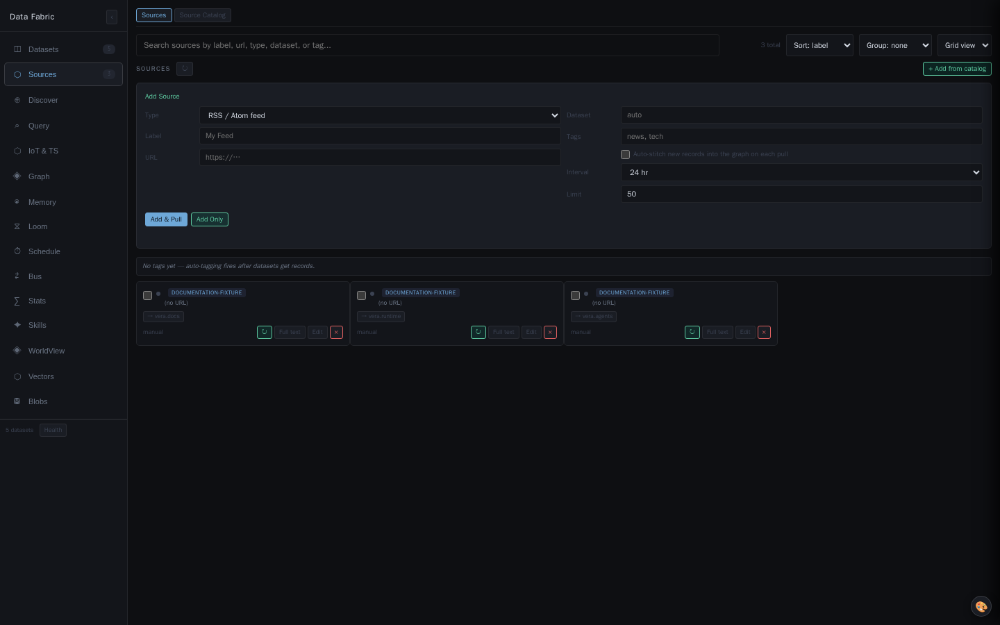
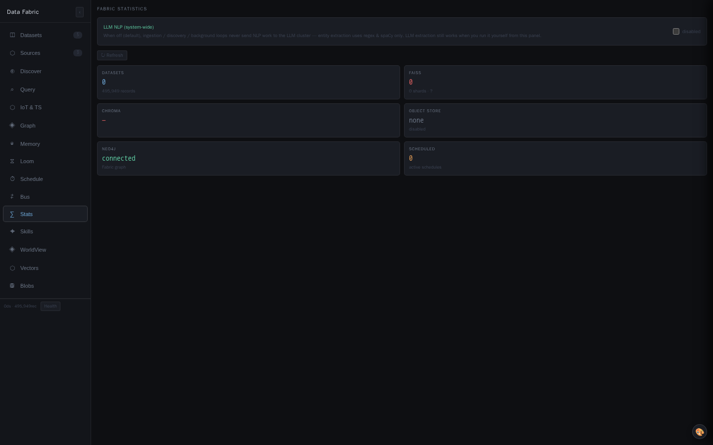
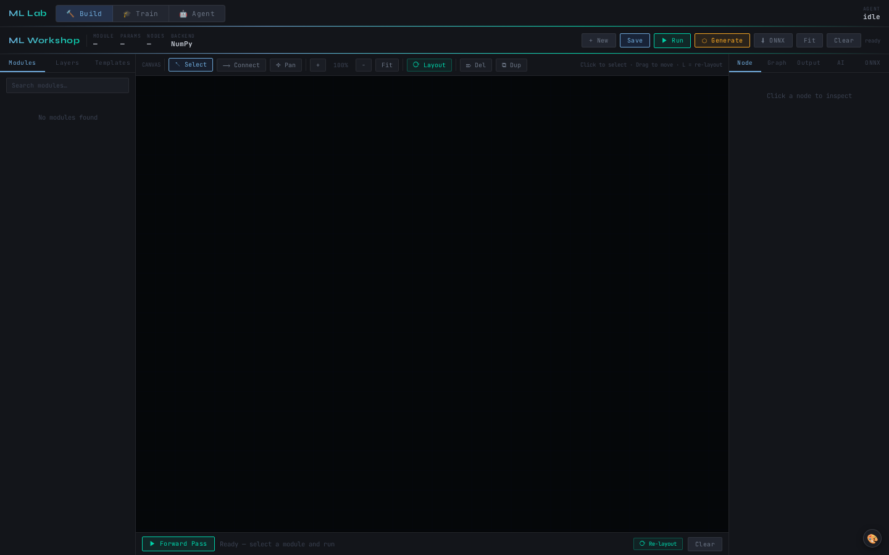
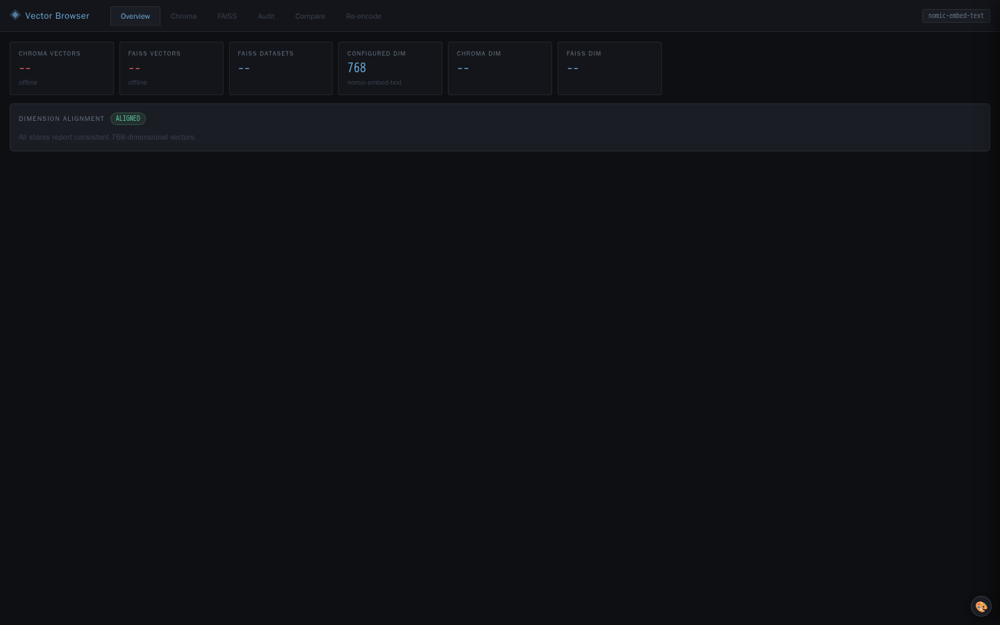

# 06 · Data Fabric


The polyglot data fabric is Vera's unified data layer. It combines multiple database paradigms — vector (FAISS + Chroma), graph (Neo4j), relational (SQLite + PostgreSQL), and object storage (Garage / Ceph S3) — into a single ingestion pipeline and query DSL. Anything Vera produces or consumes that's worth keeping ends up in the fabric, where it can be recalled semantically, by relation, by exact filter, or by any combination of the three.

The fabric is what makes Vera's components additive rather than siloed. A research result is fabric-recallable, so the IDE agent can find it. A crawled page is fabric-recallable, so dream cycles can use it. A chat message is fabric-recallable, so future sessions can build on it.

---

## 1. Storage layers

| Layer | Role | Notes |
|---|---|---|
| **SQLite** | Always-available local fallback | Eager init at import — tables exist before first HTTP request. Used as primary store when other backends are offline. |
| **PostgreSQL** | Authoritative relational store | Tables for datasets, records, sources, relationships. Uses `cfg.POSTGRES_URL`. |
| **FAISS** | Persistent sharded vector index | Sharded by dataset for scalable similarity. Snapshots saved to object storage. |
| **ChromaDB** | Metadata-filtered vector search | Used alongside FAISS for metadata-rich queries. |
| **Neo4j** | Auxiliary graph layer | Dataset relationships, lineage, categories, entity graph. |
| **Redis** | Hot cache + streaming | Query result cache, ingestion stream, shared pool with orchestrator. |
| **Garage / Ceph** | Object storage | Large blobs, FAISS index snapshots. S3-compatible API, optional. |

Each layer can fail independently. The pipeline degrades gracefully — if Neo4j is down, ingestion still writes to SQLite/Postgres/Chroma; if FAISS is down, queries fall through to Chroma; if Chroma is down, queries fall through to text search.

---

## 2. The data model

```python
@dataclass
class DataRecord:
    id:         str
    dataset_id: str          # logical grouping (e.g. "research.results", "web.crawl.example_com")
    source:     str          # "api" | "web" | "research" | "chat" | ...
    source_id:  str          # the entity that produced this record (e.g. session_id, job_id)
    text:       str          # ≤2000 chars, indexable
    data:       dict         # full structured payload
    tags:       List[str]
    created_at: str
```

Datasets are first-class: every record belongs to one dataset, and datasets carry their own metadata, sources, and (optionally) explicit relationships to other datasets.

---

## 3. The ingestion pipeline

`DEFAULT_PIPELINE` is a sequence of stages, each responsible for one concern:

```
Hash  →  Schema  →  TextExtract  →  Embed  →  PG  →  Vector  →  Neo4j
```

| Stage | Action |
|---|---|
| **Hash** | Compute a content hash for deduplication |
| **Schema** | Infer or refine the dataset's schema from the record |
| **TextExtract** | Pull indexable text from structured fields |
| **Embed** | Generate embedding via Ollama (`llm.embed` cap → `OLLAMA_EMBED_URL`) |
| **PG** | Write to PostgreSQL (or SQLite fallback) |
| **Vector** | Insert into FAISS shard + Chroma collection |
| **Neo4j** | Register dataset/relationship nodes |

Each stage is async, and the pipeline awaits them in sequence per record. A stage failure logs the error and continues — partial ingestion is preferred over none.

### Post-ingestion pipeline

After every batch is ingested, a non-blocking `_post_ingest_pipeline` runs:

- **Source registration** — if the record came from a known source, update the source's record count.
- **Entity extraction** — extract named entities, dates, places from the text (writes to the second-order entity graph).
- **Loom linking** — when configured per-dataset, run cross-dataset relationship inference.

Errors here are logged but don't surface to the caller — ingestion is considered successful as soon as the primary stages have written the record.


---

## 4. Ingestion API

### `fabric.ingest`

```python
await ingest_dataset(
    dataset_id = "my_dataset",
    data       = [{"text": "...", "title": "...", "extra_field": ...}, ...],
    source     = "api",
    tags       = ["t1", "t2"],
    source_id  = "session_abc",
)
```

Items can be:

- A list of dicts → each dict becomes one record (text auto-extracted from `text` field or concatenation of string values)
- A list of strings → each becomes a record with that string as text and as `data.value`
- A single dict or string → wrapped to a list

Returns `{ingested, errors, dataset_id}`.

Emits `fabric.ingested` event.

### `fabric.update`

Update an existing record by ID. Re-runs embedding if text changed.

### `fabric.delete_dataset`

Drop a dataset's records across all backends.

---

## 5. Query DSL

`fabric.query` accepts a hybrid query combining text, vector, filter, and graph expansion:

```python
await cap_fabric_query(
    text       = "machine learning frameworks",   # keyword/FTS search
    vector     = "ML libraries for Python",       # semantic search
    dataset_id = "research.results",              # scope to one dataset
    top_k      = 20,
    include_data = False,
)
```

Either or both of `text` and `vector` may be supplied. With both, results are fusion-scored (weighted vector + text + graph proximity, deduplicated by ID).

The cap also accepts:

- A `query` dict for the legacy API: `{text, vector, dataset_id, top_k, filter: {...}}`
- A JSON-encoded string (for MCP callers that serialise everything)
- A plain string (auto-converted to `text=...` + `vector=...`)

### Filter syntax

```python
{
    "filter": {
        "tags":     {"contains": "important"},
        "source":   "research",
        "created_at": {"gte": "2025-01-01"},
        "data.author": "Joe"
    }
}
```

Filters apply against PostgreSQL columns when the field is structured, and against Chroma metadata when going through the vector path.

### Graph expansion

If a dataset has explicit Neo4j relationships to others (set up via `fabric.link_datasets`), a query against one dataset can be expanded to include semantically-related results from linked datasets. The fusion score includes a graph-proximity component (decay by distance).

---

## 6. Sources

Sources are external feeds that get pulled into the fabric on demand or on schedule:

| Source type | Examples |
|---|---|
| RSS | News feeds, blogs |
| API | REST endpoints with JSON responses |
| Database | SQL queries (config-defined) |
| Web | Single URL or recursive crawl |
| File | Local file or upload |

### Source caps

| Cap | Path | Purpose |
|---|---|---|
| `fabric.source.add` | `POST /fabric/sources/add` | Register a new source |
| `fabric.source.list` | `GET /fabric/sources` | List all sources |
| `fabric.source.pull` | `POST /fabric/sources/pull` | Manually pull one source now |
| `fabric.source.delete` | `POST /fabric/sources/delete` | Remove a source |

When a source is pulled, items are deduplicated by content hash and bulk-inserted in chunks of 5, with `fabric.record.ingested` progress events emitted per chunk (so the UI can show records streaming in live). The async embed/vector/graph pipeline runs after SQLite writes so the UI sees data immediately.

---

## 7. Web acquisition

`fabric_web_acquisition.py` extends the fabric with a richer web pipeline beyond basic source pulls:

| Cap | Purpose |
|---|---|
| `fabric.web.acquire` | Multi-stage web crawl with full content fetch, page structure extraction (headings, sections, code blocks), and negative-filter exclusions |
| `fabric.web.continue` | Resume a previous acquisition that paused or was cancelled |
| `fabric.web.acquire_status` | Get status of running/completed acquisitions |
| `fabric.entity_graph.extract` | Extract a second-order entity graph from a dataset's records |
| `fabric.entity_graph.query` | Query the entity graph by entity, type, or dataset |
| `fabric.entity_graph.merge` | Merge duplicate entities across datasets |
| `fabric.entity_graph.bulk_load` | Bulk-load entities and relationships (used by analyser flows) |


### Entity graph

Entities (people, orgs, dates, places, technologies, code symbols) extracted from records get stored in Neo4j under the `:Entity` label, with `:MENTIONED_IN` edges to the `:FabricRecord` nodes they came from, and `:CO_OCCURS` / `:RELATES_TO` edges between entities that appear together. Entities are normalised (case-folded, deduplicated) so a single graph node aggregates all mentions across datasets.

### Loom (cross-dataset stitching)

The "Loom" pipeline finds relationships between datasets — pairs of datasets whose records mention the same entities or share topics. The harness's Fabric panel has a Loom tab with four numbered stages (gather, plan, stitch, link) and a graph view showing the resulting cross-dataset edges in distinct colours.


---

## 8. Fabric capabilities

| Cap | Purpose |
|---|---|
| `fabric.ingest` | Insert records into a dataset |
| `fabric.update` | Update an existing record |
| `fabric.query` | Hybrid vector + text + filter + graph search |
| `fabric.schema` | Get/refine a dataset's schema |
| `fabric.datasets` | List all datasets with record counts |
| `fabric.stats` | Aggregate stats (total records, dataset count, vector count, ...) |
| `fabric.link_datasets` | Add an explicit Neo4j relationship between two datasets |
| `fabric.stream_publish` | Publish a record to the ingestion stream |
| `fabric.delete_dataset` | Drop a dataset |
| `fabric.source.*` | Source management (see §6) |
| `fabric.web.*` | Web acquisition (see §7) |
| `fabric.entity_graph.*` | Entity graph (see §7) |
| `fabric.bus.*` | Configure the ingestion bus |
| `fabric.aux_graph.*` | Query the auxiliary graph (dataset relationships, lineage) |
| `fabric.ai_analyse_links` | LLM-driven Loom suggestion |
| `fabric.ai_stitch` | LLM-driven stitch execution |
| `fabric.chroma_reset` | Delete + recreate the vector collection (embed-model change) |
| `fabric.backfill_vectors` | Re-encode records present in Postgres but missing from Chroma (post-reset / embedder-outage repair; dry-run by default) |
| `fabric.objects.*` | Blob store: status / buckets / list / stat / get / put / delete |

### Vector performance

Bulk ingests and backfills **batch-embed**: one Ollama `/api/embed` call per
~64 records (`_embed_many`, routed via `pick_instance` like single embeds)
instead of one HTTP roundtrip per record, and the ingest pipeline fans records
out with bounded concurrency (8). Chroma's synchronous HTTP client is kept off
the event loop (executor) on both the ingest and query paths, and collection
`count()` is cached for 30 s instead of being re-fetched on every search.

**FAISS is OFF by default** (`FABRIC_FAISS=0`): it had no persistence — empty
after every restart, only ever holding records ingested by the current process
— while duplicating Chroma's cosine search over the same vectors at >1 GB RAM
at current scale (each vector stored twice: global shard + per-dataset index).
Chroma (HNSW, persistent) serves all fabric vector search. Set `FABRIC_FAISS=1`
to enable the in-RAM tier — it then **hydrates from Chroma in the background at
startup** so it is actually populated. `fabric.query` max-combines the FAISS and
Chroma scores (they index the same vectors; the old additive merge double-scored
whatever happened to be in FAISS). The worldview's latent-space FAISS index
(`WV_INDEX`) is separate and unaffected.

### Vector hygiene

Vectors are only ever written with an **explicit embedding** — if the embedder
is down, the vector write is skipped (the record still lands in Postgres/SQLite)
rather than letting Chroma fall back to its built-in 384-dim default embedder,
which dimension-mismatches the nomic 768-dim collections. The embed
circuit-breaker cools down after 5 minutes instead of latching for the process
lifetime. Repair gaps with `fabric.backfill_vectors` (Postgres-sourced) or
`worldview.reembed_missing` (SQLite-sourced, concurrent); the memory system's
twin is `memory.backfill_vectors`.

### Blob store (Garage)

`fabric.objects.status` reports `last_error` when the store is enabled but
unavailable. `AccessDenied` / `No such key` means the garage node has no
layout/key/bucket yet — the compose `garage-init` sidecar bootstraps it via the
**admin API** (`:3903`), and `provision.store.garage.bootstrap` does the same
from inside Vera (idempotent, then reconnects the ObjectStore). Garage can also
be provisioned onto any Docker host with `provision.store.deploy` (see
[Docker](./13-docker.md)).

---

## 9. The Fabric panel

`fabric_panel.html` has three primary tabs:

### Discover

Topic search → suggest sources → kick off acquisition. The "Deep Crawl →" button hands off a discovered URL to the Web Acquisition tab with the URL and topic pre-filled.

### Web Acquisition

Multi-stage crawl UI. Fields: seed URL, topic, max depth, max pages, breadth, exclude words/URLs, content type filters. Live progress log + a shared crawl graph that's mirrored in the Discover tab.

### Loom (pipeline workbench)

Single-page workbench combining:

- **Graph canvas** (full-height) showing entities, relations, and stitched cross-dataset edges
- **Right-side drawer** (collapsible) with:
  - View controls (source picker, filter, layout)
  - Items list (Entities / Relations / Loom Edges sub-tabs)
  - Dataset Config
  - Automatic Triggers
  - Four numbered pipeline stages
  - Pipeline Log

The entity graph and the stitched cross-dataset graph are separate views — switch via the View controls. Stitched edges have raised alpha for visibility and use the 7 distinct Loom edge type colours.

---

## 10. Recall

Once data is in the fabric, recall is just `fabric.query`. Higher-level recall caps wrap it for common patterns:

- `research.recall.search` — search across `research.*` datasets only
- `research.recall.crawled_pages` — semantic search + domain filter on crawl datasets
- `research.recall.session` — pull all jobs for a research session, cross-reference the memory graph chain
- `research.recall.notebook` — fetch a notebook and its cells

See [Research System](./07-research.md) for the full recall surface.

---

## 11. Operations and failure diagnosis

Treat the relational record store as the durable reference and vector, graph,
cache, and object layers as independently observable projections.

| Symptom | Likely layer | First checks |
|---|---|---|
| Dataset exists but semantic search misses it | embedding/Chroma/FAISS | embedder health, vector dimensions, backfill |
| Text search works but graph is empty | Neo4j projection | graph availability, labels, post-ingest errors |
| UI count changes between refreshes | graph limit or retry | snapshot limit, timeout, pending refresh |
| Source repeatedly imports duplicates | hashing/source cursor | content hash, checkpoint, canonical URL |
| Record exists but blob does not open | object store | bucket, key, credentials, presign endpoint |
| New data appears late | ingestion stream | Redis consumer status and backlog |

Recovery proceeds from fabric.health and fabric.stats, through authoritative
dataset/record counts, then repairs the smallest derived layer. Reconciliation
must be idempotent, bounded by dataset, and observable through progress events.
Destructive reset/delete capabilities require a verified authoritative copy.

Documentation fixtures follow the same model: a few namespaced vera.* datasets
are written only inside the selected sandbox, linked, and captured after the
graph summary is ready. Production is never seeded for screenshots.

---

## See also

- [Memory Graph](./05-memory-graph.md) — sister system; cap activity is mirrored to fabric `caps.*` datasets
- [Vector Browser](./25-vector-browser.md) — inspect/audit the Chroma + FAISS stores behind the fabric
- [Markets](./15-markets.md) & [Device Mesh](./14-mesh.md) — high-volume numeric sources that write straight to fabric datasets
- [Research System](./07-research.md) — research artifacts are fabric records
- [Capability Framework](./01-capability-framework.md) — the `fabric.*` caps surface

## Screenshots

<!-- VERA:AUTO:screenshots START -->
#### Data Fabric graph


*The populated structural graph connects datasets, sources, agents, skills, and ontologies.  ·  captured `seeded`*

#### Data Fabric sources



*Source management, acquisition status, and dataset routing.  ·  captured `seeded`*

#### Data Fabric statistics



*Backend health and storage statistics across the polyglot fabric.  ·  captured `seeded`*

#### ML Lab



*ML Lab  ·  captured `seeded`*

#### Vector Browser



*Vector Browser  ·  captured `seeded`*
<!-- VERA:AUTO:screenshots END -->

## Capabilities

<!-- VERA:AUTO:capabilities START -->
| Capability | HTTP | Description |
|---|---|---|
| `fabric.agents.delete` | — | Delete an agent. Input: id (str!). |
| `fabric.agents.list` | — | List registered agents. Output: {agents:[{id,name,description,tags,...}]}. |
| `fabric.agents.register` | — | Register or update an agent definition in the fabric. Input: name (str!), description (str), config (object/JSON-string — agent config), tags (str). Output: {id, name}. |
| `fabric.ai_analyse_links` | — | Suggest dataset-level relations using the LLM, then automatically drive Loom for each accepted pair. Replaces the old standalone analyser. Input: max_pairs (int default 8), min_score (float default… |
| `fabric.api.list` | — | List discovered API surfaces across all datasets for the API browser. Each API is annotated with its enumerated endpoint sub-tables and whether it has been promoted to a recurring source. Input: da… |
| `fabric.api.map` | — | Sample an API endpoint and MAP its response shape: locate the record array, infer a flat field schema, return a small sample, and suggest a jq_path so it can be wired up as a pull source. Input: su… |
| `fabric.aux_graph.link` | — | Link two typed nodes in the auxiliary Neo4j graph. |
| `fabric.aux_graph.query` | — | Read-only Cypher query on the fabric Neo4j graph. Returns: {rows (raw data shape), nodes [{id,name,label,labels,props}], edges [{from,to,rel,props}]} — the latter two are usable directly by graph v… |
| `fabric.backfill_vectors` | — | Re-encode fabric records that exist in Postgres (source of truth) but have NO vector in the shared vera_fabric Chroma collection — use after a chroma_reset or an embedder outage that skipped vector… |
| `fabric.browse` | — | Browse records in a dataset with pagination and full content. Input: dataset_id (str!), limit (int 1-200, default 50), offset (int, default 0), search (str, optional text filter). Output: {records,… |
| `fabric.bus.configure` | — | Enable/disable Redis event bus ingestion. Input: enabled (bool), filters (comma-sep event prefixes). Output: {enabled, filters}. |
| `fabric.bus.status` | — | Bus consumer status. Output: {enabled, filters, task_alive}. |
| `fabric.chroma_reset` | — | Delete and recreate the Chroma vector collection. Required when switching embedding models (dimension mismatch). All vectors are lost — rebuild afterwards with fabric.backfill_vectors (from Postgre… |
| `fabric.clear_dataset` | — | Delete ALL records in a dataset from all backends (SQLite + Chroma + FAISS). Input: dataset_id (str!). Output: {cleared, dataset_id, backends}. |
| `fabric.collection.detect` | — | Detect a multi-page structured collection from a list/index URL. Samples linked detail pages, induces a consistent field map, and persists a 'detected' collection ready for reconstruct. Input: url … |
| `fabric.collection.get` | — | Fetch one collection's metadata + a few sample records. Input: collection_id (str!). Output: {collection, sample_records}. |
| `fabric.collection.list` | — | List reconstructed/detected collections. Output: {collections:[...]}. |
| `fabric.collection.reconstruct` | — | Reconstruct a detected collection into a faithful internal dataset + graph. Crawls every detail page, extracts a uniform record per the field map, ingests them as one typed dataset, and links each … |
| `fabric.dags.delete` | — | Delete a DAG. Input: id (str!). |
| `fabric.dags.get` | — | Fetch a DAG by id, including its full definition. Input: id (str!). |
| `fabric.dags.list` | — | List saved DAGs. Output: {dags:[{id,name,description,tags,...}]}. |
| `fabric.dags.save` | — | Save a DAG definition to the fabric. Input: name (str!), description (str), definition (object/JSON-string — node and edge definitions), tags (str). Output: {id, name}. |
| `fabric.dataset.delete` | — | Fully delete a dataset — removes all records from SQLite, Chroma, and FAISS. Input: dataset_id (str!). Output: {ok, dataset_id, backends}. |
| `fabric.dataset.reset_edges` | — | Delete all RELATED_TO edges between FabricRecord nodes belonging to a single dataset, plus the aggregate Dataset-RELATED_TO edges that include this dataset. Useful for re-running Loom from scratch.… |
| `fabric.dataset.reset_edges_alias` | — | Internal alias to satisfy older clients. |
| `fabric.dataset_stats` | — | Get detailed stats for a specific dataset. Input: dataset_id (str!). Output: {dataset_id, total_records, oldest, newest, sample_tags}. |
| `fabric.datasets` | — | List datasets stored in the data fabric with record counts. WARNING: there can be THOUSANDS of datasets — NEVER call this without parent= to 'see everything'. Browse ONE namespace level at a time: … |
| `fabric.datasets.auto_tag` | — | Use the LLM to suggest and apply tags to a dataset based on its records. Input: dataset_id (str!), sample_size (int default 15), max_tags (int default 6), apply (bool default True — actually save).… |
| `fabric.datasets.config` | — | Get or set per-dataset processing configuration. Controls: auto_extract_entities (bool), auto_loom (bool), loom_scope (internal\|cross), entity_scope (internal\|cross), content_type (text\|code\|we… |
| `fabric.datasets.tag` | — | Add or remove tags on a dataset. Input: dataset_id (str!), tags (str — comma-sep!), action (add\|remove default add), source (user\|llm default user). Output: {dataset_id, tags_now}. |
| `fabric.datasets.tags` | — | List tags for one dataset, or all (dataset, tag) pairs. Input: dataset_id (str — empty for all). Output: {tags or all}. |
| `fabric.delete_dataset` | — | Remove Chroma vectors for a dataset. Input: dataset_id (str!). |
| `fabric.delete_record` | — | Delete a single record by id from all backends. Input: record_id (str!), dataset_id (str, optional — used for Chroma). Output: {deleted, record_id, backends}. |
| `fabric.discover.auto` | — | Automatically keep mining the BEST detected surfaces of a dataset for useful, non-duplicate data. Each round ranks un-pulled surfaces by confidence × topic relevance, then crawls crawlable ones and… |
| `fabric.discover.clear_history` | — | Bulk-delete discovery scans. Scope by dataset_id and/or status. Input: dataset_id (str — empty = all), status (str — running\|paused\|done\|error, empty = any), delete_data (bool default False — al… |
| `fabric.discover.compile` | — | Compile a coherent multi-section document from crawled pages about a topic. The LLM clusters pages into subtopics then writes each section from relevant page content. Output is a Markdown document … |
| `fabric.discover.continue` | — | Resume a discovery crawl from its saved frontier (queue + visited). Input: crawl_id (str!) OR dataset_id (str — most recent crawl), additional_pages (int=60 — extends the page budget). Output: same… |
| `fabric.discover.crawl` | — | Resumable discovery crawl. Fetches pages AND detects reachable interaction surfaces (RSS, git repos, OpenAPI/Swagger, GraphQL, JSON APIs, data files, DB hints) plus extracts embedded structured con… |
| `fabric.discover.delete_scan` | — | Delete a discovery scan and its artifacts (frontier, surfaces, sub-tables, edges). Optionally also delete the underlying fabric dataset (all records + entity graph) it produced. Input: crawl_id (st… |
| `fabric.discover.description` | — | Get the rolling LLM topic-description for a crawl. Input: crawl_id (str!). Output: {crawl_id, topic, description}. |
| `fabric.discover.detect` | — | One-shot analysis of a single page (no crawl): fetch it and return the interaction surfaces and structured sub-tables found, optionally ingesting the sub-tables. Input: url (str!), dataset_id (str)… |
| `fabric.discover.entity_extract` | — | Run entity and relationship extraction on all records in a discovery dataset. Uses the active NER backend (GLiNER / spaCy / heuristic). Results are written to fabric_entities and fabric_entity_ment… |
| `fabric.discover.expand` | — | Interactively grow the discovery graph from a node. Surface → register + pull it and fold the ingested data in; Page → crawl one level of its links; Subtable/Dataset → extract entities. Returns a {… |
| `fabric.discover.from_dataset` | — | Seed a discovery crawl from an EXISTING dataset's already-scanned structure and continue crawling. Loads the URLs already ingested (marking them visited) and the outbound links recorded in the grap… |
| `fabric.discover.graph` | — | Reconstruct the discovery map for a crawl or dataset as a node/edge graph (pages, detected surfaces, extracted sub-tables, data subsets). Suitable for direct hand-off to the VeraGraph renderer. Inp… |
| `fabric.discover.history` | — | List discovery crawls (resumable frontiers) with progress counts. Input: dataset_id (str — filter), status (str — running\|paused\|done), limit (int=50). Output: {crawls:[{crawl_id, dataset_id, see… |
| `fabric.discover.map_topic` | — | Map an ENTIRE topic comprehensively in one call. Seeds from a wide multi-angle web search PLUS targeted searches across many site types (reddit, X, youtube, news, github, stackoverflow, hackernews,… |
| `fabric.discover.query` | — | Ask the LLM a question about a crawl/dataset. Gathers page titles, summaries, and entity data from the discovery graph, builds a context window, and answers using the local LLM cluster. Good for: w… |
| `fabric.discover.scrape_page` | — | Fetch a single URL and extract its full text, headings, links, and metadata without ingesting it into the fabric. Also stores/updates the Page record in the current dataset so the content is visibl… |
| `fabric.discover.subtopic` | — | Launch a focused discovery crawl about a SINGLE entity/sub-topic (e.g. an entity extracted from a previous run) and link it back to the parent dataset in the graph. Input: entity (str!), parent_dat… |
| `fabric.discover.topic` | — | Deep topic-driven discovery. Runs MULTIPLE web searches across several query angles (reusing the host web.search / research engine) plus feed discovery, seeds a resumable crawl on all of them, then… |
| `fabric.domains.authority` | — | Learned domain-relevance-vs-topic table (Google-indexing style): which domains have proven to be good, authoritative sources for a topic. Input: topic (str, optional — blank = all), limit (int). Ou… |
| `fabric.entity_graph.attach_to_datasets` | — | Create HAS_ENTITY edges from each Dataset to every Entity that was extracted from records in that dataset. This makes the second-order entities visible in the main fabric graph view. Idempotent — s… |
| `fabric.entity_graph.bulk_load` | — | Bulk load entities and relationships into the entity graph. Use this to import pre-computed entities, merge external NER output, or restore from a backup. Input: entities (list of {name, type, reco… |
| `fabric.entity_graph.consolidate` | — | In-tandem consolidation of a dataset's entity graph: surgically MERGES cross-type / alias duplicate nodes (e.g. 'Pikachu' as character + pokemon + named_entity -> one node) without a full rebuild, … |
| `fabric.entity_graph.dedup` | — | Rebuild a dataset's entity graph cleanly with the current normalization + alias resolution (fixes pre-existing duplicate entities like 'Cherrygrove' / 'Cherry Grove City'). Purges the dataset's exi… |
| `fabric.entity_graph.extract` | — | Extract entities from a dataset. Alias for fabric.extract_graph with entity_graph-compatible progress events. Input: dataset_id (str!), limit (int default 500), content_type (str, ignored — always … |
| `fabric.entity_graph.extract_record` | — | Re-extract entities from a single record. Input: record_id (str!). Output: {ok, record_id, entities, relations}. |
| `fabric.entity_graph.extract_text` | — | Run entity + relationship extraction over caller-supplied text items instead of a stored dataset. Lets the Loom side-panel parse the nodes of the *active* graph (their labels / titles / text) throu… |
| `fabric.entity_graph.link_memory` | — | Bridge the fabric entity graph into the memory graph. For records in a dataset that carry a `node_id` (the Neo4j :Memory node they originated from — chat turns, capability activity, notebook cells)… |
| `fabric.entity_graph.mentions` | — | List records that mention a given entity. Input: entity_id (str!). Output: {ok, entity_id, records:[{id,dataset_id,snippet}]}. |
| `fabric.entity_graph.merge` | — | Merge one entity into another, moving all mention links. Input: entity_id (str! — source, will be deleted), target_id (str! — target, receives the mentions). Output: {ok, merged, source, target, me… |
| `fabric.entity_graph.ner` | — | Inspect and control the entity NER/NLP backend, and self-test it. GET/empty: report the ACTIVE backend (gliner\|spacy\|heuristic), which libraries are importable, the configured model names, and ru… |
| `fabric.entity_graph.ner_install` | — | Install or update NER/NLP model packages at runtime. Runs pip install for gliner or spacy, optionally also runs 'python -m spacy download <model>' for spaCy language models. Returns live stdout/std… |
| `fabric.entity_graph.ner_labels` | — | Get or set the GLiNER entity label set and confidence threshold at runtime. GET (no args): return current labels and threshold. POST with labels (comma-separated str) and/or threshold (float): upda… |
| `fabric.entity_graph.profile` | — | Build (and persist) a rich LLM profile for ONE entity from its mentions in a dataset: precise type, description, aliases, attributes and facts. Input: dataset_id (str!), name (str! — entity name), … |
| `fabric.entity_graph.purge` | — | Purge all entity state for a dataset. Input: dataset_id (str!), drop_entities (bool default False). Output: {ok, dataset_id, mentions_deleted, entities_deleted}. |
| `fabric.entity_graph.query` | — | Query the second-order entity graph. Search by entity name, type, or dataset. Returns entities and their relationships. Input: search (str — name/keyword), type (str — filter by entity type), datas… |
| `fabric.entity_graph.record_entities` | — | Get entities mentioned in a specific record. Input: record_id (str!), limit (int default 60). Output: {nodes, edges, node_count, edge_count}. |
| `fabric.entity_graph.records` | — | Get the fabric records that mention a specific entity. Input: entity_id (str!), limit (int default 20). Output: {records: [{id, dataset_id, text, title, url, ...}], count}. |
| `fabric.entity_graph.snapshot` | — | Get a snapshot of the entity graph for visualisation. Returns nodes (entities) and edges (relationships) suitable for graph rendering. Optionally includes first-order Dataset and FabricRecord nodes… |
| `fabric.entity_graph.types` | — | List all entity types and their counts. Output: {types: [{type, count}]}. |
| `fabric.extract_graph` | — | Extract entities and relations from records into a graph. Modes: nlp (regex/heuristics, fast), llm (deeper, slow), hybrid. Input: dataset_id (str!), mode (nlp\|llm\|hybrid default nlp), limit (int … |
| `fabric.fuse` | — | Row-level JOIN two datasets on shared key field(s) into a new ephemeral fused dataset, and store the recipe so it can be refreshed/reproduced. LEFT wins on field conflicts. Inputs: left (str!), rig… |
| `fabric.fuse.refresh` | — | Re-run a stored fusion recipe so the fused dataset reflects the current source rows. Input: into (str! — the fused dataset id). Output: {into, rows, refreshed} or {error}. |
| `fabric.gaps` | — | Report what a dataset is MISSING vs an expectation — missing fields (low coverage) and missing keys — and, crucially, which gaps are worth acting on NOW. Gaps marked noise/unfillable or still in fe… |
| `fabric.gaps.attempt` | — | Record that a fetch was ATTEMPTED for one or more gaps. On 'failed' the gap goes into an exponential backoff (retried ever-less-often) and, after too many failures, is auto-marked 'unfillable' so i… |
| `fabric.gaps.resolve` | — | Manually set a gap's status so it stops (or resumes) triggering fetches. Use 'noise' for a gap that is spurious and 'unfillable' for data that genuinely cannot be obtained — both suppress it perman… |
| `fabric.graph.node_actions` | — | Get available actions for a graph node by label. |
| `fabric.graph.run_node_action` | — | Execute a graph node action by dispatching to the named capability. |
| `fabric.graphs.list` | — | List registered graph adapters with availability status. Output: {graphs: [{name, available, kind, description}]} |
| `fabric.graphs.query` | — | Run a Cypher query against any registered graph. Input: graph (str — name, default 'fabric'), cypher (str!). Example: graph='fabric', cypher='MATCH (n:Dataset) RETURN n LIMIT 5'. Output: rows from … |
| `fabric.graphs.register` | — | Register a custom named graph view as a label-scoped subset of the fabric Neo4j. Input: name (str! — alphanumeric+underscore), description (str), node_labels (str — comma-sep Neo4j labels to scope … |
| `fabric.graphs.snapshot` | — | Return a node+edge snapshot of a registered graph for visualisation. Input: graph (str default 'fabric'), limit (int default 200), label_filter (str — comma-sep labels to include, or '' for default… |
| `fabric.graphs.unregister` | — | Remove a user-registered custom graph. Input: name (str!). Built-in graphs (fabric/memory/net) cannot be removed. |
| `fabric.health` | — | Diagnostic snapshot of fabric subsystem. Output: {db_path, journal_mode, db_size, has_journal_file, has_wal_files, writer_task_alive, write_queue_size, sources_count, datasets_count, auto_pull_acti… |
| `fabric.identify` | — | Recognise whether the fabric ALREADY has a dataset for what you are about to fetch, so you reuse it instead of re-collecting. WHEN TO USE: before any web/API fetch of reference data — 'do we alread… |
| `fabric.ingest` | — | Ingest records into a named dataset. Input: dataset_id (str!), records (JSON array or object), source (str), tags (comma-sep). Output: {ingested, errors, dataset_id}. |
| `fabric.kb.article` | — | Full knowledgebase article (markdown) + its facts. Input: kb_id (str) or subject (str), slug (str!). Output: {article:{...,content_md}, facts:[...]}. |
| `fabric.kb.build` | — | Build or EXTEND a structured knowledgebase (wiki) for a subject from discovery output: entities+relations, stitched tables, and pages of a dataset/crawl. Plans articles, writes them grounded in the… |
| `fabric.kb.delete` | — | Delete a knowledgebase (its articles + facts; contributing datasets are untouched). Input: kb_id (str!). |
| `fabric.kb.get` | — | One knowledgebase's metadata + article index. Input: kb_id (str) or subject (str). Output: {kb, articles:[{slug,title,kind,entity,summary}]}. |
| `fabric.kb.list` | — | List knowledgebases. Output: {knowledgebases:[{kb_id,subject,description,article_count,fact_count,status,updated_at}]}. |
| `fabric.kb.query` | — | Query a knowledgebase like an API. Searches facts (s-p-o triples), articles, and the KB's structured table rows; mode 'answer' (or a question ending in '?') also composes an LLM answer with citatio… |
| `fabric.kb.render` | — | Render a knowledgebase as consumable wiki markdown: the index page (no slug) or one article (slug). Intended for direct display in UI panels/drawers that render markdown. Input: kb_id (str) or subj… |
| `fabric.link_datasets` | — | Link two datasets in the auxiliary graph. Input: from_id (str!), to_id (str!), rel_type (str). Output: {ok, from, to, rel}. |
| `fabric.loom.record_match` | — | Find records related to a single record across all datasets. Input: record_id (str!), mode (vector\|keyword\|hybrid default hybrid), max_matches (int default 10). Output: {ok, record_id, matches:[{… |
| `fabric.loom.run` | — | Stitch relations across (or within) datasets. Runs server-side on the full dataset, emits fabric.loom.progress events, and writes RELATED_TO edges into the Neo4j graph so relations persist. Input: … |
| `fabric.nlp.get` | — | Get the system-wide LLM-NLP master switch. When DISABLED (default), automatic pipelines (ingestion, discovery crawls, collectors, agent loops) use regex/spaCy NLP only — LLM entity/relation extract… |
| `fabric.nlp.set` | — | Set the system-wide LLM-NLP master switch (persisted). Input: enabled (bool!). When false (default), LLM-driven NLP in automatic pipelines is disabled everywhere; humans can still run it per-call f… |
| `fabric.objects.bucket_create` | — | Create a bucket. Input: bucket (str!). Output: {ok, bucket}. |
| `fabric.objects.buckets` | — | List buckets in the object store. Output: {buckets:[{name, created}], count}. |
| `fabric.objects.delete` | — | Delete an object. Input: key (str!), bucket (str). Output: {ok, key, bucket}. |
| `fabric.objects.get` | — | Download an object. Input: key (str!), bucket (str), as_url (bool — return a presigned URL instead of inline bytes). Objects > 5 MB always return a presigned URL. Output: {key, size, content_type, … |
| `fabric.objects.list` | — | List objects under a prefix. Input: bucket (str — default configured), prefix (str), max_keys (int default 1000). Output: {objects:[{key, size, last_modified, etag}], count, bucket, prefix}. |
| `fabric.objects.presign` | — | Generate a presigned URL for direct browser GET/PUT. Input: key (str!), method (get\|put, default get), bucket (str), expires (int seconds, default 3600). Output: {url, key, method, expires} or {er… |
| `fabric.objects.put` | — | Upload an object from base64 content. Input: key (str!), content_base64 (str!), content_type (str), bucket (str). Output: {ok, key, bucket, size}. |
| `fabric.objects.stat` | — | Object metadata (HEAD). Input: key (str!), bucket (str). Output: {key, size, content_type, last_modified, etag, metadata} or {error}. |
| `fabric.objects.status` | — | Object store (Garage/Ceph/S3) status. Output: {enabled, available, mode, endpoint, default_bucket, has_boto, last_error}. If enabled but not available, last_error says why (AccessDenied/'No such ke… |
| `fabric.ontologies.build` | — | Build an ontology from one or more datasets. Samples records, asks the LLM to extract entity types and relationship rules, registers via the canonical ontologies.create capability so it shows in th… |
| `fabric.pipelines.delete` | — | Delete a saved pipeline. Input: id (str!). |
| `fabric.pipelines.list` | — | List saved search pipelines. |
| `fabric.pipelines.run` | — | Execute a saved pipeline (by id) or an inline pipeline definition. Input: id (str — saved pipeline ID, or empty if using stages), stages (list of stage objects, or empty if using id), input (dict —… |
| `fabric.pipelines.save` | — | Save a search pipeline definition. Input: name (str!), description (str), stages (list of stage objects [{type, config}] OR JSON string), tags (str). Output: {id, name}. |
| `fabric.query` | — | Search the data fabric across all stored datasets using keyword and/or semantic (vector) search. WHEN TO USE: when you need to look up records, documents, or data from structured datasets; when the… |
| `fabric.record.summarise` | — | Generate an LLM summary of a single record. Input: record_id (str!). Output: {ok, record_id, summary}. |
| `fabric.rss.fetch_content` | — | Pull an RSS feed and fetch full article text for each entry. Input: source_id (str!) — must be an existing RSS source. max_articles (int, default 10) — cap on article fetches (rate-limiting). Outpu… |
| `fabric.schema` | — | Get schema for a dataset. Input: dataset_id (query param). |
| `fabric.schema.declare` | — | Declare (and version) the schema for a dataset so agents and loops can operate on it reliably and quality can be checked. Inputs: dataset_id (str!), schema (object mapping field -> {type: string\|n… |
| `fabric.schema.get` | — | Get a dataset's DECLARED schema (with key/kind/trust/version). Falls back to an INFERRED schema (sampled from rows) when none has been declared, so agents always get something to work with. Input: … |
| `fabric.skills.build` | — | Build a skill from one or more datasets. Samples records, asks the LLM to extract concepts and relations, stores the resulting ontology. Input: name (str!), dataset_ids (str — comma-sep!), descript… |
| `fabric.skills.delete` | — | Delete a skill. Input: skill_id (str!). |
| `fabric.skills.get` | — | Fetch a single skill by id, including ontology and samples. Input: skill_id (str!). |
| `fabric.skills.list` | — | List all skills. Output: {skills:[{id,name,description,dataset_ids,...}]}. |
| `fabric.source_types.list` | — | List all supported source types and their config schemas. The panel UI uses this to render type-specific forms. Output: {types: [{name, description, config_fields, auth_fields, needs_url}]} |
| `fabric.sources` | — | List all registered data fabric sources. Output: {sources: [{id, type, url, label, dataset_id, ...}]} |
| `fabric.sources.add` | — | Register a data source (RSS, API, wiki, HTTP, scrape, recon, index). Input: url (str!), source_type (rss\|api\|http\|wiki\|scrape\|recon\|index), label (str), dataset_id (str), interval (int second… |
| `fabric.sources.add_index` | — | Register an INDEX source — a URL pointing at a list of other resources (a CSV of domains, a JSON array, or an HTML page of links). On pull it ingests the list as a dataset and can fan out to child … |
| `fabric.sources.auto_tag` | — | Auto-tag a single source by sampling its records and asking the LLM for tags. Same logic as fabric.datasets.auto_tag but applied to the source's dataset. Input: source_id (str!), sample_size (int d… |
| `fabric.sources.delete` | — | Remove a data source. Input: source_id (str!). |
| `fabric.sources.pull` | — | Pull a source immediately. Input: source_id (str!). Output: {ingested, dataset_id}. |
| `fabric.sources.update` | — | Update an existing source's fields (label, tags, interval, limit, enabled, jq_path, headers). Input: source_id (str!), plus any fields to update. Output: {ok, source_id}. |
| `fabric.stats` | — | Diagnostic statistics from all fabric storage backends. USE FOR: checking which storage backends are active, total record counts, storage sizes. Output: {postgres, faiss, chroma, neo4j, sqlite, obj… |
| `fabric.stream_publish` | — | Publish a record to the fabric Redis ingestion stream. Input: dataset_id (str!), data (JSON str), source (str). |
| `fabric.subtables.list` | — | List extracted sub-tables (embedded structured concepts pulled into sub-datasets). Input: parent_dataset (str), kind (str), limit (int=200). Output: {subtables:[...], count}. |
| `fabric.subtables.stitch` | — | Stitch schema-compatible sub-table fragments into single coherent tables. Groups a dataset's extracted sub-tables by column-schema similarity, aligns headers (LLM-assisted when they disagree), merg… |
| `fabric.surfaces.browse` | — | Browse the FULL content of a discovered surface with pagination. Input: surface_id or url, offset (default 0), page_size (default 100), follow_next (bool default True — follow REST pagination next … |
| `fabric.surfaces.delete` | — | Forget a detected surface. Input: surface_id (str!). |
| `fabric.surfaces.enumerate` | — | Enumerate a discovered API surface (an OpenAPI/Swagger spec or a REST resource-index) into an api_endpoints sub-table — capturing the WHOLE API rather than the single endpoint that was detected. Op… |
| `fabric.surfaces.list` | — | List detected interaction surfaces. Input: parent_dataset (str), kind (str), promoted (str: 'all'\|'yes'\|'no' = all), min_confidence (float=0), limit (int=200). Output: {surfaces:[...], count}. |
| `fabric.surfaces.preview` | — | Explore a discovered surface READ-ONLY without promoting/pulling it into the fabric. Fetches the surface and returns a small sample (rows/items/endpoints/text) plus inferred columns. Input: surface… |
| `fabric.surfaces.promote` | — | Promote a detected surface into a recurring fabric source (or, for data files / sitemaps, ingest it once). Input: surface_id (str!), auto_pull (bool=False — pull immediately). Output: {ok, source_i… |
| `fabric.synthesize.delete` | — | Delete a 3rd-order topic model (SQLite rows + Neo4j Concept layer). Input: model_id (str!). Output: {ok}. |
| `fabric.synthesize.get` | — | Fetch one 3rd-order topic model with its entries and relations. Input: model_id (str!). Output: {model, entries, relations}. |
| `fabric.synthesize.list` | — | List persisted 3rd-order topic models. Output: {models:[{id, topic, dataset_id, entry_type, entry_count, created_at}]}. |
| `fabric.synthesize.topic` | — | Build a 3rd-ORDER, coherent picture of a topic: an LLM plans the structure the topic needs, checks coverage against the existing records + entity graph, OPTIONALLY triggers additional discovery to … |
| `fabric.tags.fan_out` | — | Fan-out: pull all SOURCES whose tags include any of the given tags. Useful for 'pull all news', 'pull all pokemon sources'. Input: tags (str — comma-sep), match_dataset_tags (bool default True — al… |
| `fabric.tags.list_grouped` | — | List all tags with the count of sources and datasets that carry each. Output: {tags:[{tag, datasets, sources}]}. |
| `fabric.topic.save` | — | Save a discovery topic as a recurring 'topic source' that re-runs discovery on a schedule. Input: topic (str!), max_sources (int default 5), content_type (str default 'all'), interval (int default … |
| `fabric.upsert` | — | Ingest rows into a dataset WITH IDENTITY so re-ingesting the same business key does not duplicate. WHEN TO USE: whenever you collect data you may fetch again (a pokedex, a price series, a catalogue… |
| `fabric.validate` | — | Quality-check a dataset against its DECLARED schema so its data can be trusted. Reports required-field violations, type mismatches, per-field coverage (non-null fraction) and duplicate business key… |
| `fabric.vectors.audit` | — | Full vector dimension audit across Chroma and FAISS. Checks every dataset for consistent embedding sizes. Output: {aligned, configured_dim, chroma_audit, faiss_audit, issues}. |
| `fabric.vectors.chroma.browse` | — | Browse Chroma vectors with pagination. Returns ids, documents, metadata, and embedding stats (norm, dim, mean, std). Input: offset (int), limit (int 1-100), dataset_id (str, optional), include_embe… |
| `fabric.vectors.chroma.datasets` | — | List datasets present in Chroma with per-dataset vector counts and sample dimension. Output: {datasets: [{dataset_id, count, sample_dim}]}. |
| `fabric.vectors.chroma.get` | — | Get full detail for a single Chroma record by id. Input: record_id (str!). Output: {id, document, metadata, embedding_stats, embedding_preview}. |
| `fabric.vectors.compare` | — | Compare a record's vector representation across Chroma and FAISS. Input: record_id (str!), dataset_id (str — needed for FAISS lookup). Output: {chroma, faiss, match_status}. |
| `fabric.vectors.faiss.sample` | — | Sample vector IDs and stats from a FAISS shard or dataset index. Input: shard_name (str, e.g. 'shard_0') OR dataset_id (str), limit (int 1-50 default 10). Output: {samples: [{id, norm, mean, std}]}. |
| `fabric.vectors.faiss.shards` | — | FAISS shard and per-dataset index statistics. Output: {global_shards: [{name, vectors, dim}], dataset_indexes: [{dataset_id, vectors, dim}], dim, total}. |
| `fabric.vectors.overview` | — | Combined vector store overview: Chroma + FAISS stats, configured embedding dimension, model name, and alignment status. |
| `fabric.web.acquire` | — | Multi-stage web acquisition with full content fetching, structural extraction, negative word filtering, and entity graph building. Creates both a source and a dataset. Pages are fetched for their f… |
| `fabric.web.acquire_status` | — | List recent web acquisitions with their status. Input: limit (int default 20). Output: {acquisitions: [...]}. |
| `fabric.web.continue` | — | Continue a previous web acquisition from where it left off. Re-uses the same config (negative words, topic, etc.) and dataset. Input: acquisition_id (str!) OR source_id (str!) OR dataset_id (str!),… |
<!-- VERA:AUTO:capabilities END -->
