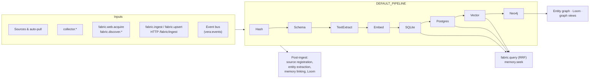
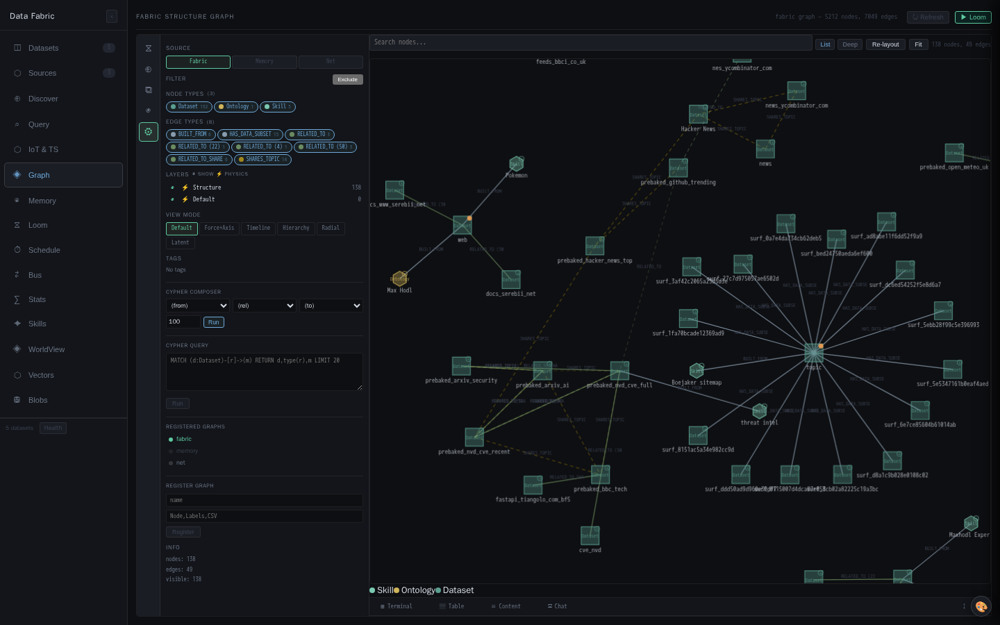
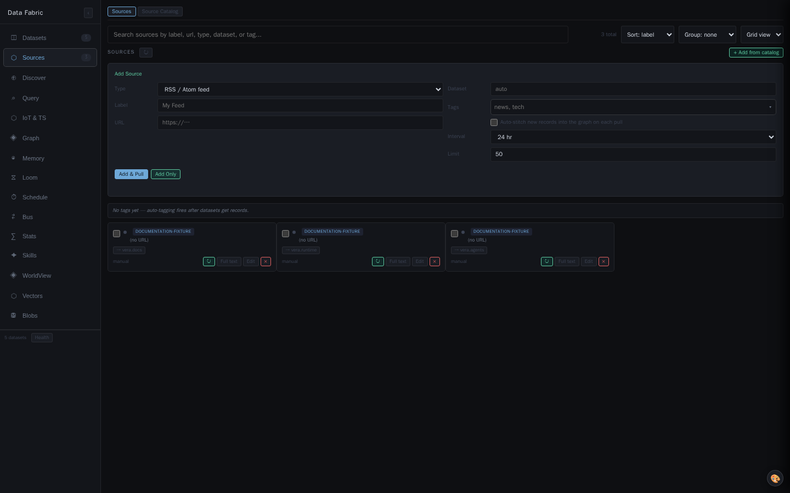
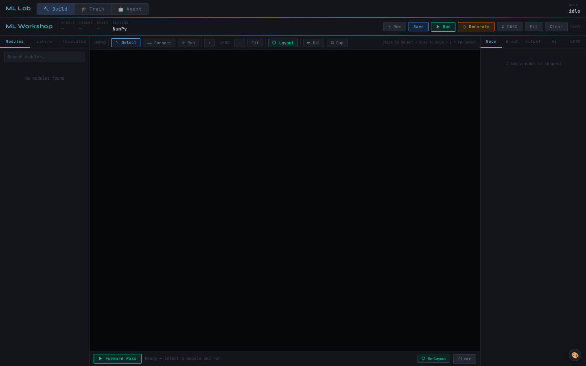

# 06 · Data Fabric


The polyglot data fabric is Vera's unified data layer. It combines several
database paradigms — relational (SQLite + PostgreSQL), vector (ChromaDB, with
an optional FAISS tier), graph (Neo4j), cache/streaming (Redis) and object
storage (Garage / Ceph via S3) — behind one ingestion pipeline and one query
surface. Anything Vera produces or consumes that is worth keeping ends up in a
fabric **dataset**, where it can be recalled semantically, by keyword, by
field value or through the entity graph.

The fabric is what makes Vera's components additive rather than siloed. A
research result is fabric-recallable, so the IDE agent can find it; a crawled
page is fabric-recallable, so dream cycles can use it; a chat message is
ingested so its entities join the shared graph. Around the core store sit
sources and collectors that pull external data on a schedule, a discovery
crawler that detects new feeds/APIs/tables, an entity graph and the Loom
cross-dataset stitcher, curated (keyed, schema-checked) datasets, and
knowledgebases synthesised from all of it.

The runtime lives in `vera/fabric/` — chiefly `data_fabric.py`,
`fabric_web_acquisition.py`, `discovery.py`, `data_fabric_collectors.py`,
`curation_capabilities.py` and `knowledgebase.py` — with the UI in
`vera/fabric/fabric_panel.html`. Next to the runtime, a set of
storage-neutral, offline-tested contracts (`record_revision.py`,
`revision_store.py`, `artifact_provider.py`, `dataset_provider.py`,
`projection_provider.py`, the `*_retrieval.py` modules and
`vera/discovery_*.py`) define canonical revisions, artifacts, snapshots and
comparable retrieval evidence.

**Maturity.** Ingest, query, sources, discovery, the entity graph, Loom,
curation and the blob store are in production use. The canonical revision and
artifact paths are live but deliberately narrow (SQLite authority, policy
gated). The dataset/projection/retrieval/discovery contracts and optional
adapters (Hugging Face, DuckDB, DVC, Qdrant, GraphRAG) are deterministic,
test-backed seams; live trials against those external systems are separate,
explicitly scheduled work and are not implied by this page.

## Contents

- [1. Concepts and architecture](#1-concepts-and-architecture)
- [2. Source map](#2-source-map)
- [3. Storage layers](#3-storage-layers)
- [4. Canonical revisions and provider contracts](#4-canonical-revisions-and-provider-contracts)
  - [Record revisions and the revision store](#record-revisions-and-the-revision-store)
  - [Caller policy](#caller-policy)
  - [Artifact provider](#artifact-provider)
  - [Graph and vector projection contract](#graph-and-vector-projection-contract)
  - [Dataset and query provider contracts](#dataset-and-query-provider-contracts)
  - [Optional dataset adapters](#optional-dataset-adapters)
- [5. The ingestion pipeline](#5-the-ingestion-pipeline)
- [6. Writing, curating and deleting data](#6-writing-curating-and-deleting-data)
  - [fabric.ingest](#fabricingest)
  - [Curated datasets (fabric.upsert and friends)](#curated-datasets-fabricupsert-and-friends)
  - [Deleting data](#deleting-data)
  - [Event bus and stream publishing](#event-bus-and-stream-publishing)
- [7. Querying and recall](#7-querying-and-recall)
  - [fabric.query](#fabricquery)
  - [Browsing datasets](#browsing-datasets)
  - [Agent-facing recall](#agent-facing-recall)
- [8. Sources and collectors](#8-sources-and-collectors)
- [9. Web acquisition, discovery and synthesis](#9-web-acquisition-discovery-and-synthesis)
  - [Web acquisition](#web-acquisition)
  - [Discovery crawls, surfaces and sub-tables](#discovery-crawls-surfaces-and-sub-tables)
  - [Collections, topic models and knowledgebases](#collections-topic-models-and-knowledgebases)
- [10. Entity graph, Loom and graph views](#10-entity-graph-loom-and-graph-views)
- [11. Vectors, embeddings and the blob store](#11-vectors-embeddings-and-the-blob-store)
- [12. Comparable retrieval evidence](#12-comparable-retrieval-evidence)
- [13. Discovery and context routing contracts](#13-discovery-and-context-routing-contracts)
- [14. The Fabric panel](#14-the-fabric-panel)
- [15. Configuration](#15-configuration)
- [16. Events](#16-events)
- [17. Worked examples](#17-worked-examples)
- [18. Operations and failure diagnosis](#18-operations-and-failure-diagnosis)
- [19. Related pages](#19-related-pages)
- [Screenshots](#screenshots)
- [Capabilities](#capabilities)

---

## 1. Concepts and architecture

- **Dataset** — a named, dotted namespace (for example `research.results`,
  `chat.messages`, `docs:<host>`, `bus.<event>`). There can be thousands, so
  they are browsed one namespace level at a time. Datasets carry tags, a
  processing configuration, optionally a declared schema, and can be linked to
  each other in the graph.
- **Record** — one `DataRecord` in exactly one dataset: short indexable `text`
  (≤ 2000 chars), the full structured `data` payload, tags, source, and
  derived `content_hash`, `schema` and `embedding`.
- **Source** — a registered external feed (RSS, API, database, crawl…) that is
  pulled on demand or on an interval into its dataset.
- **Entity graph** — named entities extracted from records, linked to the
  records (and memory nodes) that mention them.
- **Canonical revision** — an immutable, content-addressed version of a record
  with explicit lineage, held by the revision store (see [§4](#4-canonical-revisions-and-provider-contracts)).


```mermaid
flowchart LR
    subgraph Inputs
        SRC["Sources & auto-pull"]
        COL["collector.*"]
        WEB["fabric.web.acquire<br/>fabric.discover.*"]
        API["fabric.ingest / fabric.upsert<br/>HTTP /fabric/ingest"]
        BUS["Event bus<br/>(vera:events)"]
    end
    subgraph Pipeline["DEFAULT_PIPELINE"]
        direction LR
        H[Hash] --> S[Schema] --> T[TextExtract] --> E[Embed] --> SQ[SQLite] --> PG[Postgres] --> V[Vector] --> N[Neo4j]
    end
    Inputs --> Pipeline
    Pipeline --> POST["Post-ingest:<br/>source registration,<br/>entity extraction,<br/>memory linking, Loom"]
    PG & V & SQ --> Q["fabric.query (RRF)<br/>memory.seek"]
    N --> G["Entity graph · Loom ·<br/>graph views"]
```

---

## 2. Source map

| File | Responsibility |
|---|---|
| `vera/fabric/data_fabric.py` | Core: config, `DataRecord`, storage backends (SQLite, Postgres, FAISS, Chroma, Neo4j, ObjectStore), `DEFAULT_PIPELINE`, `ingest_dataset`, `execute_query`, sources and auto-pull, bus, graphs, skills/ontology builders, Loom, objects, canonical revision and artifact capabilities, `/fabric/panel` |
| `vera/fabric/fabric_web_acquisition.py` | `fabric.web.*` crawler and the second-order entity graph (`fabric.entity_graph.*`, NER backends) |
| `vera/fabric/discovery.py` | `fabric.discover.*`, surfaces, sub-tables, collections, topic synthesis, domain authority |
| `vera/fabric/url_dataset_resolve.py` | Cached, off-loop URL → discovery-dataset resolution |
| `vera/fabric/knowledgebase.py` | `fabric.kb.*` structured knowledgebases |
| `vera/fabric/data_fabric_collectors.py` | Prebaked collectors (`collector.*`) |
| `vera/fabric/curation_capabilities.py`, `curation_core.py` | Keyed upsert, declared schema, validation, identify, gaps, fusion, `memory.select`, `context.for_agent` |
| `vera/fabric/embed_policy_core.py` | Which datasets are excluded from embedding |
| `vera/fabric/embed_provider_capabilities.py`, `fastembed_provider.py` | `embed.provider.*` (see [ONNX](./30-onnx.md)) |
| `vera/fabric/record_revision.py`, `revision_store.py`, `revision_path.py`, `revision_policy.py`, `revision_projection.py`, `caller_policy.py` | Canonical revisions, transactional authority, policy and SQLite projection |
| `vera/fabric/artifact_provider.py` | Checksum-addressed local artifacts with optional object-store replica |
| `vera/fabric/projection_provider.py` | Graph/vector `ProjectionSpec`, `EmbeddingSpace`, `FrozenProjectionProvider` |
| `vera/fabric/dataset_provider.py` | `DatasetSnapshot`, `DatasetProvider`, `QueryProvider`, `CancellationSignal` |
| `vera/fabric/huggingface_dataset_adapter.py`, `duckdb_artifact_query.py`, `dvc_artifact_adapter.py` | Optional dataset/artifact adapters |
| `vera/fabric/retrieval_comparison.py`, `retrieval_execution.py`, `retrieval_lifecycle.py`, `retrieval_trial.py` | Comparable retrieval evidence |
| `vera/fabric/native_retrieval.py`, `external_retrieval.py`, `qdrant_retrieval.py`, `graphrag_retrieval.py`, `analytical_retrieval.py` | Snapshot-bound retrieval participants |
| `vera/discovery_contract.py`, `discovery_routing.py`, `discovery_orchestration.py`, `discovery_context_orchestration.py`, `discovery_benchmark.py`, `discovery_benchmark_runtime.py`, `discovery_operator_readmodel.py` | Discovery and context routing contracts |
| `vera/inventory/discovery_context_baseline.py` | Offline, source-bound inventory of discovery/context paths |
| `vera/fabric/fabric_panel.html` | The Data Fabric panel |

Memory-side modules that also live in `vera/fabric/` (`memory*.py`,
`context.py`, `session_notes.py`) are documented in
[Memory Graph](./05-memory-graph.md).

---

## 3. Storage layers

| Layer | Role | Details |
|---|---|---|
| **SQLite** | Always-available local store | `FABRIC_SQLITE` (default `vera/fabric/vera_fabric.db`). Initialised eagerly at import, so tables exist before the first request. Writes are serialised through a single writer. Tables include `fabric_datasets`, `fabric_records`, `fabric_sources`, `fabric_dataset_tags`, `fabric_dataset_config`, `fabric_custom_graphs`, `fabric_pipelines`, `fabric_agents`, `fabric_dags`, `fabric_skills`, `fabric_kv` and the curation tables |
| **PostgreSQL** | Authoritative relational store and word-overlap text search | `cfg.POSTGRES_URL`; `fabric_datasets`, `fabric_records` |
| **ChromaDB** | Persistent vector search (HNSW, cosine) | Shared collection `vera_fabric`; serves all fabric vector search |
| **FAISS** | Optional in-RAM vector tier | Off by default (`FABRIC_FAISS=0`); `FABRIC_FAISS_SHARDS` (4), `FABRIC_FAISS_INDEX` (`flat`) |
| **Neo4j** | Graph projection | `(:Dataset)-[:CONTAINS]->(:FabricRecord)`, dataset links, `(:Entity)-[:MENTIONED_IN]->(:FabricRecord)`, Loom `RELATED_TO` edges, registered graph views |
| **Redis** | Query cache and event bus | Query results cached under `fabric:cache:<md5>` for `FABRIC_CACHE_TTL` (3600 s); shared connection pool with the orchestrator |
| **Object store** | Large blobs (Garage / Ceph / any S3) | Disabled unless `FABRIC_OBJECT_STORE` is set (default `none`); bucket `FABRIC_S3_BUCKET` (`vera-data-fabric`) |

Each layer can fail independently and the pipeline degrades gracefully: the
SQLite stage always runs, so data appears in the UI even when Postgres, Chroma
or Neo4j are down; queries fall back from Postgres to SQLite keyword ranking
when Postgres returns nothing. On startup the optional backends connect
concurrently and the fabric emits `fabric.ready` with the active set
(`sqlite` is always included).

> [!NOTE]
> In development sandboxes the shared Neo4j/Chroma writes are suppressed by
> the same write guard described in
> [Memory Graph](./05-memory-graph.md#dev-sandbox-write-guard).

---

## 4. Canonical revisions and provider contracts

The live `fabric_records` path is mutable and best-effort. Alongside it, a
storage-neutral contract family defines immutable, content-addressed
authority and the providers that project or serve it.

### Record revisions and the revision store

`vera.fabric.record_revision` defines the `vera.fabric-record-revision/v1`
contract. It separates a stable logical `record_id` from an immutable
`revision_id` (`rev_<sha256>`), and binds content or an artifact reference,
ordered parent revisions, snapshot identity, source, policy, metadata, content
schema, media type, timestamps, valid time and tombstone state into a full
SHA-256 identity. Nested caller input is copied into canonical JSON so later
mutation cannot alter an existing observation.

`vera.fabric.revision_store.RevisionStore` supplies the transactional
authority. Its dedicated SQLite database (`FABRIC_REVISION_SQLITE`, default
`vera/fabric/vera_fabric_revisions.db`; tables `fabric_record_revisions`,
`fabric_record_heads`, `fabric_projection_receipts`, `fabric_revision_events`)
atomically persists the revision, a current-head compare-and-swap, projection
receipts and an audit event. Projection receipts move through a fixed state
machine:

| From | Allowed next states |
|---|---|
| `pending` | `applied`, `failed`, `removed` |
| `applied` | `stale`, `removed` |
| `failed` | `pending`, `rebuilding`, `removed` |
| `stale` | `rebuilding`, `removed` |
| `rebuilding` | `applied`, `failed`, `removed` |
| `removed` | `rebuilding` |

Applied and failed outcomes require bounded evidence. Bounded reconciliation
locates failed/stale work, and an authority rollback schedules the restored
revision's projections for a new generation instead of merely moving a head
pointer.

The public path is deliberately narrow:

| Capability | HTTP | Behaviour |
|---|---|---|
| `fabric.revision.put` | `POST /fabric/revisions/put` | Inputs `namespace`, `record_type`, `created_at`, `record_id` or `logical_key`, `content_json`, `parents` (csv), `policy_json`/`source_json`/`metadata_json`, `expected_head`, `tombstone`, `media_type`, `valid_from`/`valid_to`. Commits authority first, then projects the canonical envelope into the existing SQLite `fabric_records` read path and transitions its `sqlite` receipt to `applied`, `removed` or `failed`. Tombstones need `tombstone=true`, null content and a parent. Emits `fabric.revision.committed` |
| `fabric.revision.get` | `POST /fabric/revisions/get` | Current revision for `record_id`, or an exact `revision_id` bound to it |
| `fabric.revision.reconcile` | `POST /fabric/revisions/reconcile` | Bounded retry (`limit` 1–100) of failed/stale receipts through `rebuilding` |

Dataset counts stay idempotent across replay and tombstone deletion. A
projection failure does not erase the authoritative revision. `fabric.ingest`
behaviour is unchanged, and this path does not write FAISS, Chroma, Postgres
or Neo4j.

### Caller policy

Revision and artifact capabilities share `CallerPolicy`
(`caller_policy.py`). The actor is the request's caller kind (`user`,
`codex`, `claude`, `claude_code` — MCP callers map to `claude_code` — or
`autonomous`). By default **anyone may read and only direct human (`user`)
callers may write**. A JSON policy can widen or narrow this globally or per
namespace; an invalid policy fails the request closed rather than breaking
module load.

```json
{
  "readers": ["*"],
  "writers": ["user"],
  "namespaces": {
    "agent-notes": { "writers": ["user", "claude_code", "autonomous"] }
  }
}
```

Set it with `FABRIC_REVISION_POLICY` (revisions) or `FABRIC_ARTIFACT_POLICY`
(artifacts).

### Artifact provider

`vera.fabric.artifact_provider.LocalArtifactProvider` stores bytes by SHA-256
under hash-sharded paths (`FABRIC_ARTIFACT_ROOT`, default
`vera/fabric/artifact_store`) and keeps immutable metadata, retention and
reference identity in SQLite. Atomic publish, bounded reads, verification,
idempotent duplicates, non-retargetable references, monotonic retention and
partial-file cleanup are deterministic conformance behaviour.

| Capability | HTTP | Notes |
|---|---|---|
| `fabric.artifact.put` | `POST /fabric/artifacts/put` | `data_b64`, `media_type`, `created_at`, `retain_until`; decoded size ≤ `FABRIC_ARTIFACT_MAX_PUT_BYTES` (64 MiB) |
| `fabric.artifact.get` | `POST /fabric/artifacts/get` | `artifact_id`, `max_bytes` ≤ `FABRIC_ARTIFACT_MAX_GET_BYTES` (8 MiB) |
| `fabric.artifact.stat` / `.verify` | `POST /fabric/artifacts/stat`, `/verify` | Metadata; checksum and size verification |
| `fabric.artifact.reference` | `POST /fabric/artifacts/reference` | Idempotent, non-retargetable reference |
| `fabric.artifact.replica.reconcile` | `POST /fabric/artifacts/replica/reconcile` | Bounded retry (`limit` 1–100) of failed replication |
| `fabric.artifact.restore_local` | `POST /fabric/artifacts/restore-local` | Repair a missing/corrupt local object from a checksum-verified replica |

Authorisation precedes decoding or storage access. Remote replication is
opt-in: with `FABRIC_ARTIFACT_REPLICA=object_store` (default `none`, which
makes no replica network calls) the adapter copies locally committed
artifacts to the S3-compatible object store under deterministic checksum keys.
Local storage remains authoritative — a remote outage returns the successful
local artifact plus a durable failed replica receipt instead of rolling back
the put. Reconcile retries only after verifying local bytes, and restore
accepts downloaded bytes only when they match the immutable local checksum
and size. The offline suite exercises outage, retry, corrupt-local refusal and
verified restore with an injected fake backend; live S3/Garage compatibility
is not asserted by those tests.

### Graph and vector projection contract

`vera.fabric.projection_provider` is a provider-neutral projection boundary.
A `ProjectionSpec` identifies a graph or vector backend plus its schema
version. Vector specifications must also pin the exact model-package identity,
dimension, preprocessing contract and distance metric (an `EmbeddingSpace`);
changing any of them creates a different projection space and requires a
rebuild rather than mixed-vector reuse.

Each `ProjectionEntry` binds a stable projection identity to one exact Fabric
record revision, its authoritative content hash and a separate hash of the
derived graph/vector payload. Tombstones carry no derived payload. The offline
`FrozenProjectionProvider` demonstrates idempotent apply, compare-and-swap
revision updates, bounded snapshots, drift reconciliation and
generation-guarded atomic rebuild. Reconciliation reports only identity and
checksum evidence; it never makes a derived index authoritative or repairs it
implicitly. The contract does not redirect the existing Neo4j, FAISS or Chroma
paths.

### Dataset and query provider contracts

`vera.fabric.dataset_provider` defines storage-neutral datasets. A
`DatasetSnapshot` binds dataset identity, creation time, JSON schema,
provenance and the complete frozen record sequence to a SHA-256 snapshot id.
`DatasetProvider` exposes exact/latest metadata and bounded snapshot scans;
`QueryProvider` accepts an immutable `QueryRequest` and returns
provider/provenance-labelled `QueryPage`s. Opaque cursors are checksummed and
bound to the exact snapshot or query semantics, so they fail closed when
reused against changed filters, text, projection mode or another snapshot.

`CancellationSignal` is a process-local seam for mapping a native runtime's
cancellation into cooperative provider checkpoints. The offline
`FrozenDatasetProvider` exercises the contract deterministically and supports
only equality filters and substring matching; it is not wired into
`fabric.query` and makes no ranking-quality claim.

### Optional dataset adapters

None of these adapters is selected by a public capability yet. Each is
optional, never installed into the core runtime, and tested with injected
fakes.

**Hugging Face Datasets** (`huggingface_dataset_adapter.py`). An integration
host injects `datasets.load_dataset` and must report exactly `datasets==4.8.4`.
Sources accept only Hub `owner/name` repositories pinned to a full commit SHA
plus explicit config and split. Loader calls pass `token=False`, preventing
ambient credential discovery (private datasets need a future secret-reference
integration). `materialize` copies schema/features, bounded provenance and
every JSON-compatible row of a complete sized split into a content-addressed
snapshot, refusing oversized datasets rather than sampling or truncating.
With `streaming=True`, `stream_page` returns bounded rows and a checksummed
cursor carrying the provider's checkpoint state; resume recreates the exact
pinned source and calls `load_state_dict`. Cursors cannot cross revisions,
configs or splits, a page is never called a complete snapshot, and reaching an
exact page boundary may need one final empty request to observe exhaustion.

**DuckDB over Parquet** (`duckdb_artifact_query.py`).
`DuckDBArtifactQueryProvider` is an analytical adapter over one immutable
local Parquet artifact. It verifies the artifact's stored SHA-256 before
construction and before every page, derives the snapshot identity from that
checksum (or binds an explicit `DatasetSnapshot` id with a stable record-index
column), and returns bounded `QueryPage` results with artifact and engine
provenance. It does not expose SQL: equality filters use restricted column
identifiers and bound values; paths, limits and offsets are parameters; cursors
stay bound to the full `QueryRequest`. The default connection path requires
exactly `duckdb==1.5.5`, creates a fresh in-memory connection rather than the
shared global one, and locks configuration after disabling extension
auto-install/load, unsigned extensions, ambient S3 configuration and general
external access — only the verified artifact path is allow-listed. Text
search, arbitrary expressions, non-scalar filters, non-Parquet media, writes
and extensions are out of scope. The posture follows DuckDB's
[configuration options](https://duckdb.org/docs/stable/configuration/overview),
[security guidance](https://duckdb.org/docs/current/operations_manual/securing_duckdb/overview)
and advice to use independent connections rather than the
[shared Python connection](https://duckdb.org/docs/stable/clients/python/overview).

**DVC-tracked files** (`dvc_artifact_adapter.py`). `DVCArtifactAdapter` is an
inspect-only bridge from one local DVC-tracked file to the artifact contract.
It requires an explicit stable repository identity, a full Git commit and a
relative standalone `.dvc` descriptor, resolves `HEAD` with bounded reads of
in-tree Git metadata, and accepts only one cached regular-file output in DVC's
default `.dvc/cache/files/md5/<prefix>/<suffix>` layout. It never invokes Git
or DVC, loads `.dvc/config`, follows a remote, discovers credentials, checks
out data or executes `dvc.yaml` commands. Before import it checks descriptor
size and structure, path containment, declared size and MD5 cache identity,
then commits the verified bytes to `LocalArtifactProvider` (Vera's SHA-256
identity) and returns an `ArtifactRef` plus independent DVC/Git provenance —
preserving both ecosystems' identities instead of treating DVC's MD5 as Vera's
authority. Import rechecks descriptor bytes and `HEAD`; it does not prove the
working descriptor is clean and Git-tracked. Directories, custom caches,
multiple/uncached outputs and remotes fail closed. Vera deliberately stops
before the download and workspace-writing behaviour of
[`dvc get`](https://dvc.org/doc/command-reference/get).

---

## 5. The ingestion pipeline

`DEFAULT_PIPELINE` runs each record through these stages in order:

```
Hash → Schema → TextExtract → Embed → SQLite → Postgres → Vector → Neo4j
```

| Stage | Action |
|---|---|
| **Hash** | `content_hash` = sha256 of `text` (or canonical `data` JSON), first 16 hex chars |
| **Schema** | Infer a schema from `data` when none is set |
| **TextExtract** | When `text` is empty, join the string values of `data` (500 chars each, 2000 total) |
| **Embed** | Embed `text` via the configured embed model, unless deferred or already embedded |
| **SQLite** | Always written — guarantees the record is visible in the UI immediately |
| **Postgres** | Written when Postgres is available |
| **Vector** | Add to FAISS (when enabled) and upsert into Chroma (off the event loop) when the record has a vector |
| **Neo4j** | `MERGE` the `:Dataset` and `:FabricRecord` nodes and the `CONTAINS` edge |

A stage error is logged and the record continues to the next stage — partial
ingestion is preferred over none.

`ingest_dataset()` wraps the pipeline:

- **Embedding exclusion.** Datasets in `EMBED_EXCLUDED_DATASETS` or matching a
  `VERA_FABRIC_NO_EMBED` glob (default `vera.ha.*`, `*.ha.entities`,
  `*.ha.states`; set it empty to exclude nothing) are stored and
  text-searchable but get **no vector** and nothing is queued. A one-line
  notice is logged once per dataset per process. Naming such a dataset in an
  explicit backfill still embeds it.
- **Deferred embedding** (`defer_embedding=True`, opt-in per call). Records are
  stored without vectors and a fabric vector backfill is queued on the idle
  queue (de-duplicated per dataset). If it cannot be queued, the ingest embeds
  inline instead — storing records nothing will come back for is never chosen.
- **Batch embedding.** Multi-record ingests embed ~64 records per Ollama
  `/api/embed` call before the pipeline runs.
- **Bounded concurrency.** Records run through the pipeline 8 at a time.
- **Keyed upsert hook.** An item carrying `_id` uses it as the record id, so
  re-ingesting the same business key replaces the row (used by `fabric.upsert`).

It then emits `fabric.ingested` (`dataset_id`, `ingested`, `errors`, `source`,
up to 200 `record_ids`) and starts the non-blocking **post-ingest pipeline**,
whose LLM work is marked as background (demoted while a human is actively
using the system):

1. **Source registration** — create a source for the dataset if none exists.
2. **Entity extraction** — when `auto_extract_entities` is on (default),
   run `fabric.entity_graph.extract` (LLM extraction only when the dataset sets
   `use_llm` **and** the system-wide LLM-NLP switch is on).
3. **Memory linking** — when `link_memory` is on (default), link extracted
   entities to the `:Memory` nodes records came from.
4. **Loom** — when `auto_loom` is on (default off), stitch relations.

Per-dataset processing configuration (`fabric.datasets.config`, table
`fabric_dataset_config`) and its defaults:

| Key | Default | Meaning |
|---|---|---|
| `auto_extract_entities` | `true` | Run entity extraction after ingest |
| `link_memory` | `true` | Bridge entities to `:Memory` nodes |
| `auto_loom` | `false` | Run Loom after ingest |
| `extract_limit` | `500` | Max records per extraction run |
| `content_type` | `text` | Extraction hint |
| `use_llm` | `false` | Allow LLM triple extraction (still gated by `fabric.nlp.set`) |
| `loom_scope` / `entity_scope` | `internal` | `internal` (within dataset) or `cross` |
| `loom_mode` | `hybrid` | `vector`, `keyword` or `hybrid` |
| `loom_min_score` / `loom_max_matches` | `0.4` / `100` | Loom thresholds |


---

## 6. Writing, curating and deleting data

### fabric.ingest

```python
# Python (in-process)
await ingest_dataset(
    dataset_id = "my_dataset",
    data       = [{"text": "...", "title": "...", "extra": 1}, ...],
    source     = "api",
    tags       = ["t1", "t2"],
    source_id  = "session_abc",
)
```

As a capability: `fabric.ingest` (`POST /fabric/ingest`) takes `dataset_id`!,
`records` (a JSON array or object, as a string), `source` and `tags` (csv),
and returns `{ingested, errors, dataset_id}`. Items may be dicts (text taken
from a `text` field or the concatenated string values), strings (stored as
`text` and `data.value`) or a single dict/string.

### Curated datasets (fabric.upsert and friends)

`curation_capabilities.py` adds identity, declared schemas and quality checks
on top of the same store, so datasets that agents collect repeatedly stay
consistent and reusable.

| Capability | HTTP | Purpose |
|---|---|---|
| `fabric.upsert` | `POST /fabric/upsert` | Ingest rows **with identity**: `key` (csv business-key fields) and `mode` `merge` (update in place and gap-fill, default), `append` (still de-dups exact key repeats) or `replace`. Returns `{upserted, new, updated, record_count, mode}`; emits `fabric.upserted` |
| `fabric.schema.declare` | `POST /fabric/schema/declare` | Declare and version a dataset schema (field types, key, kind, trust) |
| `fabric.schema.get` | `GET /fabric/schema/get` | Declared schema, or an inferred one when none is declared |
| `fabric.validate` | `POST /fabric/validate` | Required-field violations, type mismatches, coverage and duplicate keys vs the declared schema |
| `fabric.identify` | `POST /fabric/identify` | "Do we already have a dataset for this?" — call before fetching reference data |
| `fabric.gaps` | `POST /fabric/gaps` | Missing fields/keys vs an expectation, and which gaps are worth acting on now |
| `fabric.gaps.attempt` | `POST /fabric/gaps/attempt` | Record a fetch attempt; failures back off exponentially and become `unfillable` after 4 failures |
| `fabric.gaps.resolve` | `POST /fabric/gaps/resolve` | Mark a gap `noise`/`unfillable` (or re-open it) |
| `fabric.fuse` | `POST /fabric/fuse` | Row-level join of two datasets on key fields into a fused dataset (left wins conflicts); the recipe is stored |
| `fabric.fuse.refresh` | `POST /fabric/fuse/refresh` | Re-run a stored fusion recipe |
| `memory.select` | `POST /memory/select` | Typed field filter/sort over a dataset's rows |
| `context.for_agent` | `POST /context/for_agent` | Trust-ranked curated datasets above an agent's memories |

State lives in SQLite tables `fabric_dataset_schema`, `fabric_gap_ledger` and
`fabric_fusion_recipes`.

### Deleting data

The delete capabilities differ in scope — choose deliberately:

| Capability | HTTP | Scope |
|---|---|---|
| `fabric.delete_record` | `POST /fabric/delete_record` | One record from all backends |
| `fabric.clear_dataset` | `POST /fabric/clear_dataset` | All records of a dataset (SQLite, Chroma, FAISS) |
| `fabric.dataset.delete` | `POST /fabric/dataset/delete` | Fully delete a dataset (SQLite, Chroma, FAISS) |
| `fabric.delete_dataset` | `POST /fabric/delete` | **Chroma vectors only** for a dataset |
| `fabric.dataset.reset_edges` | `POST /fabric/dataset/reset_edges` | Loom `RELATED_TO` edges for a dataset (to re-run Loom) |
| `fabric.entity_graph.purge` | `POST /fabric/entity_graph/purge` | A dataset's entity state (optionally the entities) |
| `fabric.chroma_reset` | `POST /fabric/chroma_reset` | Drop and recreate the whole `vera_fabric` collection |

> [!WARNING]
> Destructive reset/delete capabilities need a verified authoritative copy
> first. After `fabric.chroma_reset`, rebuild vectors with
> `fabric.backfill_vectors`.

### Event bus and stream publishing

- **Event bus** — `fabric.bus.configure` (`enabled`, `filters` as csv event
  prefixes) attaches a consumer group `fabric_bus` to the `vera:events` Redis
  stream and ingests matching events into datasets named
  `bus.<event_type with dots as underscores>`. `fabric.bus.status` reports
  `{enabled, filters, task_alive}`.
- **Stream publish** — `fabric.stream_publish` appends a record to the Redis
  stream `FABRIC_STREAM_KEY` (default `vera:fabric:ingest`). No in-tree
  consumer reads that stream; use `fabric.ingest` when the record must land in
  a dataset.

---

## 7. Querying and recall

### fabric.query

`fabric.query` (`POST /fabric/query`) is the hybrid search over all datasets.

| Parameter | Default | Meaning |
|---|---|---|
| `text` | — | Keyword query (Postgres word-overlap) |
| `vector` | — | Semantic query (falls back to `text`; `text` falls back to `vector`) |
| `dataset_id` | all | Restrict to one dataset |
| `top_k` | 20 | Results to return |
| `min_score` | `FABRIC_MIN_SCORE` (0.28) | Cosine floor; lower is wider and noisier |
| `include_data` | false | Return the full `data` payload |
| `include_revision_authority` | false | Attach `revision_id` for hits with an authorised canonical revision |

It also accepts a `query` dict, a JSON string, or a plain string (treated as
both `text` and `vector`). The legacy dict form additionally honours
`vector_weight` (1.0), `text_weight` (0.5), `weak_below`, `cache` and
`cache_ttl`.

How it ranks:

1. Embed the vector query; search Chroma (and FAISS when enabled) for
   `top_k × 2` neighbours, **max-combining** scores (they index the same
   vectors).
2. Postgres word-overlap search for `top_k × 3` hits.
3. Fuse the two **rankings** with weighted reciprocal-rank fusion
   (`FABRIC_RRF_K`, 60), because cosine similarity and keyword overlap are on
   different scales.
4. Drop any record that is neither above the cosine floor nor a keyword hit.
5. If Postgres returned nothing, fall back to SQLite with the same
   word-overlap ranking and floor.

Each result carries `score` (RRF), `vector_score` and `text_score`; the
response carries `relevance: {min_score, max_vector_score,
dropped_below_floor, weak}`. `weak` is true when nothing survived or the best
vector score is below `FABRIC_WEAK_BELOW` (0.42) without a full keyword match
— treat it as "no relevant stored data". Results are cached in Redis for
`FABRIC_CACHE_TTL` seconds.

> [!NOTE]
> `fabric.query` searches live, mutable indexes and does not accept a snapshot
> id, so its results are not snapshot-pinned evidence. With
> `include_revision_authority=true`, hits that have a canonical revision the
> caller may read gain that exact `revision_id`; legacy or unauthorised hits
> stay unqualified, and portable consumers (such as Agent RAG) must fail
> closed on unqualified hits rather than derive a revision from mutable text.
> Field filters and graph expansion are **not** part of `fabric.query`; use
> `memory.select` for field filters and the entity-graph/Loom capabilities for
> graph neighbourhoods.

### Browsing datasets

- `fabric.datasets` (`GET /fabric/datasets`) lists datasets with counts —
  always pass `parent=` to browse one namespace level at a time.
- `fabric.browse` pages through one dataset (`limit` 1–200, `offset`,
  optional `search`); `fabric.dataset_stats` and `fabric.schema` describe one
  dataset; `fabric.record.get` / `fabric.record.summarise` work on one record.
- Tags: `fabric.datasets.tag`, `fabric.datasets.tags`,
  `fabric.datasets.auto_tag` (LLM), `fabric.tags.list_grouped`.

### Agent-facing recall

LLM agents should normally use the canonical memory doors —
`memory.seek` (hybrid fabric + memory search with de-duplication and a context
budget), `memory.read`, `memory.map` and `memory.browse` — described in
[Memory Graph §9](./05-memory-graph.md#9-retrieval-surfaces). In the default
`canonical` tooling mode `fabric.query`, `fabric.datasets` and `fabric.browse`
are hidden from agent tool discovery (they remain callable).

Research has its own wrappers over fabric datasets — `research.recall.search`,
`research.recall.datasets`, `research.recall.job`, `research.recall.session`
and `research.recall.notebook`; see [Research System](./07-research.md).

---

## 8. Sources and collectors

Sources are registered feeds pulled into a dataset on demand or on an
interval. `fabric.source_types.list` returns every type with its config and
auth field schema (the panel renders forms from it):

| Type | Pulls |
|---|---|
| `rss` | RSS / Atom feed (`fabric.rss.fetch_content` fetches full article text) |
| `api` | Generic JSON API (with `jq_path`, headers) |
| `wiki` | MediaWiki API |
| `scrape` | HTML scrape |
| `recon` | Browser-driven API discovery (best for single-page apps) |
| `gitea`, `github`, `gitlab` | Issues / PRs / releases from a forge |
| `postgres`, `mysql`, `sqlite`, `mongodb`, `elasticsearch` | Database query or collection scan (SQLite read-only) |
| `docs` | Documentation crawler with change detection |
| `topic` | Re-runs web acquisition for a saved discovery topic (`fabric.topic.save`) |
| `index` | A CSV/JSON/HTML list of other resources, fanned out to child sources (`fabric.sources.add_index`) |

| Capability | HTTP | Purpose |
|---|---|---|
| `fabric.sources` | `GET /fabric/sources` | List sources |
| `fabric.sources.add` | `POST /fabric/sources/add` | Register a source (`url`!, `source_type`, `label`, `dataset_id`, `interval` seconds, …) |
| `fabric.sources.update` | `POST /fabric/sources/update` | Change label, tags, interval, limit, enabled, `jq_path`, headers |
| `fabric.sources.pull` | `POST /fabric/sources/pull` | Pull now |
| `fabric.sources.delete` | `POST /fabric/sources/delete` | Remove |
| `fabric.sources.auto_tag` | `POST /fabric/sources/auto_tag` | LLM-tag a source's dataset |
| `fabric.tags.fan_out` | `POST /fabric/tags/fan_out` | Pull every source carrying any of the given tags |

**Pull behaviour.** Items are de-duplicated by content hash and inserted in
chunks of 5, emitting `fabric.record.ingested` per chunk so the UI can show
records streaming in; the embed/vector/graph work follows the SQLite writes.
Lifecycle events are `fabric.source.added`, `fabric.source.pulling`,
`fabric.source.pulled`, `fabric.source.error` and
`fabric.source.index.expanded`.

**Auto-pull.** Sources load from SQLite at startup with their persisted
last-pull time (so a restart does not make every source due at once). A loop
checks every 30 seconds and pulls due, enabled sources with `interval > 0`, at
most two concurrently.

**Prebaked collectors** (`data_fabric_collectors.py`) provide
purpose-built ingestion for well-known sources, with incremental cursors in
SQLite for large feeds and versioned records for documentation sites:

| Capability | Purpose |
|---|---|
| `collector.catalog` / `collector.add_prebaked` | List / register prebaked source definitions (news, CVE/KEV, arXiv, Hacker News, weather, GitHub, PyPI, OpenAlex, …) |
| `collector.ingest_cve`, `collector.ingest_arxiv`, `collector.ingest_hn` | Incremental CVE (NVD), arXiv and Hacker News ingestion |
| `collector.ingest_docs` / `collector.monitor_docs` / `collector.version_list` | Crawl a documentation site into `docs:<hostname>` and store a new version when a page's hash changes |
| `collector.site_profile`, `collector.url_inspect`, `collector.discover` | Inspect a site/URL; AI-assisted dataset discovery |
| `collector.stealth_fetch`, `collector.stealth_crawl`, `collector.stealth_domain_config`, `collector.stealth_list_domains` | Fetching for sites that block plain clients, with per-domain configuration |
| `collector.timeseries.ingest` / `collector.timeseries.query` | Numeric time series |
| `collector.iot.serial_read`, `collector.iot.mqtt_sub`, `collector.iot.http_poll`, `collector.iot.list_ports` | IoT inputs (USB/serial, MQTT, HTTP polling) |

Per-source politeness delays are configurable (see [§15](#15-configuration)).


---

## 9. Web acquisition, discovery and synthesis

### Web acquisition

`fabric_web_acquisition.py` provides a multi-stage crawler that fetches full
page content, extracts structure (headings, sections, code blocks), applies
negative-word/URL filters and builds the entity graph. It creates both a
source and a dataset.

| Capability | Purpose |
|---|---|
| `fabric.web.acquire` | Start an acquisition (seed URL, topic, depth/pages/breadth, exclusions, content filters); emits `fabric.web.acquire.progress` |
| `fabric.web.continue` | Resume by `acquisition_id`, `source_id` or `dataset_id`, reusing the original config |
| `fabric.web.acquire_status` | Recent acquisitions and their status |


### Discovery crawls, surfaces and sub-tables

`discovery.py` makes discovery recursive and self-extending:

1. **Interaction-surface detection.** While crawling, each page is inspected
   for other consumable sources — RSS/Atom feeds, sitemaps, Git hosting,
   OpenAPI/Swagger specs, GraphQL endpoints, generic JSON APIs, data files
   (`csv`, `tsv`, `jsonl`, `ndjson`) and database connection hints. Each
   surface is stored, scored against the topic and can be **promoted** into a
   recurring source.
2. **Concept → sub-table extraction.** Structured concepts embedded in a page
   (HTML tables, API endpoint lists, CLI flag lists, definition lists) become
   sub-datasets named `<parent>.table.<slug>`, linked `HAS_SUBTABLE`.
3. **Resumable, dataset-seeded crawling.** Crawls persist their frontier
   (queue + visited) so they can be continued, or seeded from an existing
   dataset's already-scanned structure.

| Group | Capabilities |
|---|---|
| Crawl | `fabric.discover.crawl`, `.continue`, `.from_dataset`, `.detect` (one page), `.scrape_page`, `.expand` (grow the graph from a node), `.auto` (keep mining the best surfaces) |
| Topic | `fabric.discover.topic` (multi-angle searches + feeds), `.map_topic` (comprehensive multi-site mapping), `.subtopic`, `.description`, `.query` (ask the LLM about a crawl), `.compile` (multi-section Markdown document), `.entity_extract` |
| History | `fabric.discover.history`, `.graph`, `.delete_scan`, `.clear_history` |
| Surfaces | `fabric.surfaces.list`, `.preview` (read-only sample), `.browse`, `.enumerate` (whole OpenAPI/REST index into an `api_endpoints` sub-table), `.promote`, `.delete`; `fabric.api.list`, `fabric.api.map` (infer a record array, schema and `jq_path`) |
| Sub-tables | `fabric.subtables.list`, `fabric.subtables.stitch` (merge schema-compatible fragments) |
| Authority | `fabric.domains.authority` — learned per-topic domain relevance |

Discovery emits `fabric.discover.progress`, `fabric.discover.surface`,
`fabric.discover.subtable` and `fabric.discover.scan_deleted`. Crawl politeness
is `FABRIC_DISCOVER_DELAY_S` (falls back to `FABRIC_CRAWL_DELAY_S`, 2 s) with
at most `FABRIC_HOST_FETCH_CONCURRENCY` (2) concurrent fetches per host.
Resolving which discovery dataset a URL belongs to is a full scan of record
payloads, so `url_dataset_resolve.py` runs it off the event loop and caches
positive and negative answers per URL.

### Collections, topic models and knowledgebases

- **Collections** — `fabric.collection.detect` recognises a multi-page
  structured collection from a list/index URL and induces a field map;
  `fabric.collection.reconstruct` crawls every detail page into one typed
  dataset plus graph (`fabric.collection.list`, `.get`, `.progress`).
- **Topic models** — `fabric.synthesize.topic` builds a "third-order",
  coherent picture of a topic: an LLM plans the structure, checks coverage
  against records and the entity graph, optionally triggers more discovery,
  and persists the model (SQLite rows plus a Neo4j concept layer).
  `fabric.synthesize.list` / `.get` / `.delete` manage them.
- **Knowledgebases** (`knowledgebase.py`) — an accumulating, wiki-like body of
  knowledge per subject: LLM-written **articles** grounded in crawled records
  (re-builds extend by slug), subject–predicate–object **facts** harvested
  from the entity graph and article writing, and contributing **tables** that
  stay queryable. Capabilities: `fabric.kb.build`, `.list`, `.get`,
  `.article`, `.query` (facts + articles + table rows, optional cited LLM
  answer), `.render` (wiki Markdown for panels), `.delete`.
- **Skills and ontologies from data** — `fabric.skills.build` and
  `fabric.ontologies.build` sample records and ask the LLM for concepts,
  entity types and relationship rules (see
  [Skills & Ontologies](./18-skills-ontologies.md)).

---

## 10. Entity graph, Loom and graph views

**Entity graph.** Entities (people, organisations, places, dates,
technologies, code symbols…) extracted from records are normalised
(case-folded, alias-resolved) so one node aggregates all mentions. They are
stored in SQLite (`fabric_entities`, `fabric_entity_mentions`) and projected
to Neo4j as `:Entity` nodes with `MENTIONED_IN` edges to the `:FabricRecord`
(and, via `fabric.entity_graph.link_memory`, `:Memory`) nodes they came from,
`CO_OCCURS` edges between entities that appear together, and `HAS_ENTITY`
edges from datasets (`fabric.entity_graph.attach_to_datasets`).

Extraction uses the active NER backend — GLiNER, spaCy or a heuristic
fallback — chosen by `FABRIC_NER_BACKEND` (`auto`). `fabric.extract_graph`
supports `nlp` (fast, default), `llm` and `hybrid` modes. LLM-based NLP in
automatic pipelines is governed by a persisted system-wide switch
(`fabric.nlp.get` / `fabric.nlp.set`, **off** by default); humans can still
request it per call.

| Capability | Purpose |
|---|---|
| `fabric.entity_graph.extract` / `.extract_record` / `.extract_text` | Extract from a dataset, one record, or caller-supplied text |
| `fabric.entity_graph.query` / `.types` / `.snapshot` / `.mentions` / `.records` / `.record_entities` | Read the graph |
| `fabric.entity_graph.merge` / `.consolidate` / `.dedup` / `.purge` | Clean up duplicates or reset a dataset |
| `fabric.entity_graph.profile` | LLM profile for one entity (type, description, aliases, facts) |
| `fabric.entity_graph.bulk_load` | Import pre-computed entities and relations |
| `fabric.entity_graph.link_memory` / `.attach_to_datasets` | Bridge into the memory graph / dataset nodes |
| `fabric.entity_graph.ner` / `.ner_labels` / `.ner_install` | Inspect and self-test the NER backend, set GLiNER labels and threshold, install models |

**Loom (cross-dataset stitching).** Loom finds relations between records —
within a dataset or across datasets — by vector, keyword or hybrid matching.
`fabric.loom.run` runs server-side over a whole dataset, emits
`fabric.loom.progress` and writes `RELATED_TO` edges between `:FabricRecord`
nodes (plus aggregate dataset edges). `fabric.loom.record_match` finds matches
for one record, and `fabric.ai_analyse_links` asks the LLM to suggest related
dataset pairs and then drives Loom for each accepted pair.
`fabric.dataset.reset_edges` clears a dataset's Loom edges to start again.

**Graph views.**

| Capability | Purpose |
|---|---|
| `fabric.link_datasets` | Link two datasets (`rel_type`, default `SIMILAR_TO`) |
| `fabric.aux_graph.link` / `fabric.aux_graph.query` | Link typed nodes / read-only Cypher returning rows plus renderer-ready nodes and edges |
| `fabric.graphs.list` / `.register` / `.unregister` / `.snapshot` / `.query` | Named graph views — built-ins `fabric`, `memory`, `net`, plus label-scoped custom views |
| `fabric.graph.node_actions` / `fabric.graph.run_node_action` | Per-label node actions dispatched to capabilities |

---

## 11. Vectors, embeddings and the blob store

### Vector performance

Bulk ingests and backfills **batch-embed**: one Ollama `/api/embed` call per
~64 records (`_embed_many`, routed like single embeds) instead of one HTTP
roundtrip per record, and the pipeline fans records out with bounded
concurrency (8). Chroma's synchronous HTTP client is kept off the event loop
on both the ingest and query paths, and collection `count()` is cached for
30 s instead of being re-fetched on every search.

**FAISS is off by default** (`FABRIC_FAISS=0`). It had no persistence — empty
after every restart, holding only records ingested by the current process —
while duplicating Chroma's cosine search over the same vectors at > 1 GB RAM
(each vector stored twice: global shard plus per-dataset index). Chroma
(HNSW, persistent) serves all fabric vector search. Setting `FABRIC_FAISS=1`
enables the in-RAM tier, which then **hydrates from Chroma in the background
at startup**. `fabric.query` max-combines FAISS and Chroma scores. The
Worldview latent-space FAISS index is separate and unaffected.

### Vector hygiene

Vectors are only ever written with an **explicit embedding**. If the embedder
is down the vector write is skipped (the record still lands in
Postgres/SQLite) rather than letting Chroma fall back to its built-in 384-dim
default embedder, which would mismatch the 768-dim collection
(`FABRIC_VECTOR_DIM`). The embed circuit breaker cools down instead of
latching for the process lifetime, and slow embeds are bounded by
`VERA_EMBED_WAIT_S` (5 s) and `VERA_EMBED_SLOW_COOLDOWN_S` (30 s). Repair gaps
with `fabric.backfill_vectors` (Postgres-sourced, dry-run by default; also run
from the idle queue for deferred ingests) or `worldview.reembed_missing`
(SQLite-sourced, concurrent). The memory system's twin is
`memory.backfill_vectors`. Vector inspection (`fabric.vectors.*`) is covered
in [Vector Browser](./25-vector-browser.md); embedding providers
(`embed.provider.*`) in [ONNX](./30-onnx.md).

### Blob store

`fabric.objects.*` wraps an S3-compatible object store (Garage, Ceph or S3)
enabled by `FABRIC_OBJECT_STORE` with `FABRIC_S3_ENDPOINT`,
`FABRIC_S3_ACCESS`, `FABRIC_S3_SECRET`, `FABRIC_S3_BUCKET` and
`FABRIC_S3_REGION`.

| Capability | Purpose |
|---|---|
| `fabric.objects.status` | `{enabled, available, mode, endpoint, default_bucket, has_boto, last_error}` |
| `fabric.objects.buckets` / `.bucket_create` | List / create buckets |
| `fabric.objects.list` / `.stat` | List under a prefix / HEAD one object |
| `fabric.objects.get` / `.put` / `.delete` | Download (objects > 5 MB always return a presigned URL) / upload base64 / delete |
| `fabric.objects.presign` | Presigned GET/PUT URL (default 3600 s) |

`fabric.objects.status` reports `last_error` when the store is enabled but
unavailable. `AccessDenied` / `No such key` means the Garage node has no
layout, key or bucket yet — the compose `garage-init` sidecar bootstraps it
via the admin API (`:3903`), and `provision.store.garage.bootstrap` does the
same from inside Vera (idempotent, then reconnects the store). Garage can also
be provisioned onto any Docker host with `provision.store.deploy` (see
[Docker](./13-docker.md)).

---

## 12. Comparable retrieval evidence

These modules let retrieval implementations be compared on identical,
immutable inputs without granting any of them authority. None of them chooses
a winner, falls back to another provider or activates anything.

- **Comparator** (`retrieval_comparison.py`). Every provider must report
  against the same `DatasetSnapshot`, the same content-identified query cases
  (query text appears only as a SHA-256 digest), the same relevance citations,
  and the exact record revisions returned. The report keeps recall, precision,
  MRR, citation-revision accuracy, p50/p95 latency, failures,
  index/update/rebuild/deletion time and storage separate; an unmeasured value
  stays `null` rather than zero, and no composite score is produced.
- **Execution** (`retrieval_execution.py`). A `RetrievalQueryBinding` holds
  query text only during execution and verifies it against the case digest;
  neither the binding representation, evidence nor report serialises it. The
  executor runs at most 16 configured adapters over at most 200 cases,
  sequentially, with a per-operation deadline, cooperative cancellation and
  redacted error codes. `QueryProviderRetrievalAdapter` connects providers
  that honour `DatasetSnapshot`/`QueryRequest` and requires a complete
  index-to-`(record_id, revision_id)` map; `UnavailableRetrievalAdapter`
  records an intentionally configured but absent integration without claiming
  it was queried.
- **Lifecycle** (`retrieval_lifecycle.py`). Records completed, unavailable,
  failed, cancelled, timed-out, unsupported and not-requested phases per
  adapter. Recovery and teardown are explicit opt-in phases under the same
  deadline; recovery succeeds only after a fresh observation, teardown only
  when its receipt names the exact snapshot, reports the projection inactive
  and supplies a non-negative deletion measurement. Backend exception text is
  never retained.
- **Trial** (`retrieval_trial.py`). Joins query-quality and lifecycle
  evidence into one common-corpus receipt using the same snapshot, cases and
  adapter instances; profile or snapshot drift is rejected. A provider is
  evidence-complete only when every requested dimension is complete; missing
  integrations stay visible rather than scoring zero.

**Participants**

| Participant | Module | Boundary |
|---|---|---|
| Native vector | `native_retrieval.NativeFabricSnapshotProjection` | Rebuilds and verifies the full snapshot, one vector per record, reusing Fabric's `EmbeddingSpace`/`ProjectionSpec`; isolated in memory, integrity-checked around every query, idempotent teardown; never touches the shared indexes |
| Native graph | `native_retrieval.NativeFabricSnapshotGraphProjection` | Bounded, unique `SnapshotGraphEdge`s within the snapshot; deterministic lexical seeds and a 1–8-hop traversal that never walks directed edges backwards; shared Neo4j untouched |
| Qdrant / GraphRAG evidence | `external_retrieval.ExternalSnapshotBinding` | Content-identifies provider revision, projection revision, mode (`dense`/`sparse`/`hybrid`/`multivector`; `local`/`global`/`drift`) and the full citation manifest; every receipt must reproduce them. A missing driver yields provider-specific unavailable evidence |
| Qdrant driver | `qdrant_retrieval.py` | REST over a bounded standard-library transport; one deterministic isolated collection per binding; snapshot-filtered queries returning citation payloads only; no credentials, shared collections or fallback |
| GraphRAG driver | `graphrag_retrieval.py` | Host-supplied runtime; one deterministic workspace; accepts an index only when snapshot, projection, provider revision, mode, record count and citation manifest match; citation fields only cross the boundary |
| Analytical | `analytical_retrieval.AnalyticalSnapshotRetrievalAdapter` | Predeclared structured filter plans selected by case id over DuckDB artifacts bound to a snapshot and record-index column; query text is never translated to SQL |
| JEPA Worldview | `worldview/retrieval_adapter.JepaWorldviewRetrievalAdapter` | `worldview.retrieval.bind` pins the index to a `DatasetSnapshot` and checkpoint `ModelPackage`; drifted receipts are rejected and an unbound legacy checkpoint is reported unavailable |

Evidence profiles distinguish Fabric graph/vector retrieval, Qdrant,
GraphRAG, analytical retrieval and **JEPA Worldview evidence**. "Worldview" is
not accepted as an ambiguous provider kind: the older non-JEPA
Worldview/Godseye lineage is distinct from the JEPA model. Its data can
participate by first becoming canonical Fabric records and an immutable
`DatasetSnapshot` (the Godseye line projects normalised geospatial records
into immutable portable datasets without claiming JEPA authority); the
comparison layer never reads its database or UI state directly. Agent RAG
likewise projects revision-qualified Fabric hits into cited portable context.

---

## 13. Discovery and context routing contracts

Discovery work crosses subsystem boundaries through immutable,
content-addressed envelopes (`vera/discovery_contract.py`):

| Envelope | Schema | Id prefix |
|---|---|---|
| `DiscoveryRequest` | `vera.discovery-request/v1` | `dsr_` |
| `SourceCandidate` | `vera.discovery-source-candidate/v1` | `dsc_` |
| `CollectionOption` | `vera.discovery-collection-option/v1` | `dco_` |
| `CollectionReceipt` | `vera.discovery-collection-receipt/v1` | `dcr_` |
| `DiscoveryResult` | `vera.discovery-result/v1` | — |

A request fixes its source types, time, result limits, latency, byte and cost
budgets (query ≤ 16 384 chars, ≤ 256 candidates, ≤ 32 options, ≤ 1000
outputs). Candidates identify a versioned source (`api`, `capability`,
`database`, `dataset`, `feed`, `file`, `repository`, `sitemap`, `web`) and
offer explicit collection methods, resource needs (`cpu`, `gpu`, `network`,
`storage`), expected latency and output kinds (`artifact`, `context`,
`dataset`). Receipts preserve the exact request, candidate, option and
provider revision — even for cancellation, timeouts and failures (statuses
`succeeded`, `partial`, `failed`, `rejected`, `cancelled`, `timed_out`).
Successful outputs reuse cited `ContextItem`, `DatasetSnapshot` and
content-addressed artifact identities, with the receipt kept in their lineage.
These are descriptive contracts: they neither crawl nor claim a CPU/GPU worker
is available.

**Routing and orchestration.** `discovery_routing.plan_discovery_execution`
admits selected work only through exact, current `DiscoveryWorkerOffer`s and —
when needed — an exact `GpuAdmissionReceipt`. `run_discovery_route`
(`discovery_orchestration.py`) is provider-injected and two-stage: it scouts
independent source providers concurrently, isolates timeouts and failures,
ranks source/method combinations (`rank_collection_options`) and selects at
most one method per source; collection has separate concurrency and deadline
bounds, cleans up timed-out tasks and keeps healthy cited outputs when another
source fails. Actual bytes, costs and context counts are checked against the
reservations before a result is admitted, and rejected alternatives and
stable failure classes remain available as evidence.

**Context composition.** `ContextRegistry.select_discovery_result` derives a
payload-free selection from the portable context authorities already present
in a `DiscoveryResult`, validates the provider and ranker ids against its own
manifest, and binds the selection to the exact result, policy and
registry-manifest identities. Policy can restrict eligible providers, cap
their count, and either reject or explicitly record unregistered providers.
Composition refuses a selection after the registry changes. The selection
holds provider, item, source and revision identities — never retrieved text —
and the discovery result stays the authority for receipts and content.
`run_discovery_context_route` chains route, selection and composition (see
[Memory Graph §10](./05-memory-graph.md#10-portable-context-contracts)); no
provider is discovered implicitly and the coordination layer never probes a
source, model, worker or accelerator on its own.

**Benchmarks.** `discovery_benchmark.py` (schema
`vera.discovery-context-benchmark/v1`) is a payload-free, snapshot-bound
comparison contract. Each case binds the discovery request, query digest,
relevant source and record revisions and required support claims; each
observation binds a variant revision, configuration digest, repetition and
declared ablations with per-case timing, ranked authority/citation evidence,
support, cost and CPU/GPU accounting. A candidate must improve both p95
time-to-first-useful-context and nDCG while guarding MRR, citation coverage,
answer support, freshness, redundancy, source selection, failure rate, policy
violations and individual-case regressions; per-repetition evidence sits
beside aggregates so averages cannot hide a bad case.
`discovery_benchmark_runtime.py` is the separate live harness: it runs the
full variant × case × repetition matrix sequentially, owns monotonic
milestones, enforces a deadline per run, propagates cancellation and reduces
failures to stable codes — a timeout or malformed result retains no partial
hits, timing claims, queries, exception text or payloads.
`snapshot_retrieval_runner` binds existing snapshot-aware retrieval adapters
to it; answer-support claims need a separate explicit resolver, because
retrieving a relevant record is not proof that a generated claim is supported.

**Operator read model.** Completed routes and explicitly recorded benchmark
comparisons are appended to a bounded (50-entry), payload-free read model
(`discovery_operator_readmodel.py`) with candidate/option ranks, worker and
GPU-admission identities, resource class, receipt counts/timing/cost, stable
failures, output counts and baseline/candidate quality, latency, resource and
blocker summaries. It is exposed by `operator.discovery.evidence`
(`GET /operator/discovery/evidence`) and written by
`operator.discovery.benchmark.record`
(`POST /operator/discovery/benchmark/record`); it stores no queries or content
and cannot run discovery or activate a winner.

**Inventory.** `vera/inventory/discovery_context_baseline.py` keeps an
offline, source-bound inventory of the discovery and context paths that feed
the fabric. It distinguishes portable provider contracts from native adapters,
labels JEPA Worldview paths explicitly, records which paths still need live
source or accelerator evidence, and is content-addressed and checked against
a reviewed semantic baseline. It never contacts sources, models or workers.

---

## 14. The Fabric panel

`fabric_panel.html` is served at `/fabric/panel` and registered as the
**Data Fabric** tab (`fabric-panel`). A left-hand sidebar switches between
sections:

| Section | Contents |
|---|---|
| **Overview** | Dashboard of the fabric with configurable widgets |
| **Datasets** | Dataset list with counts; records browser (paged), schema, graph view, tags/auto-tag, clear/delete |
| **Sources** | Registered sources (pull, edit, delete) and the **Source Catalog** of prebaked collectors |
| **Discover** | Topic search → suggested sources, with a **Deep Crawl →** hand-off to Web Acquisition (seed URL and topic pre-filled); hosts the Discover+ view from `/ui/panels/discover-panel` |
| **Query** | DSL search, a visual pipeline builder and saved pipelines (`fabric.pipelines.*`) |
| **IoT & TS** | USB/serial, MQTT, HTTP polling, manual/OHLCV import (Stooq, CoinGecko, FRED), charting and stealth fetch |
| **Graph** | Structural graph of datasets, sources, agents, skills and ontologies |
| **Memory** | The memory graph (see [Memory Graph](./05-memory-graph.md#13-ui-panels-and-routes)) |
| **Loom** | Pipeline workbench (below) |
| **Schedule** | Collection schedule — source pull intervals |
| **Bus** | Redis system-bus (`vera:events`) ingestion: filter prefixes, enable/disable, status |
| **Stats** | Backend health and storage statistics |
| **Skills** | Skills built from datasets |
| **WorldView** | The Worldview panel, embedded (see [Worldview](./11-worldview.md)) |
| **Vectors** | Vector store overview (see [Vector Browser](./25-vector-browser.md)) |
| **Blobs** | Object-store browser |

**Loom workbench.** A full-height graph canvas showing entities, relations
and stitched cross-dataset edges, plus a collapsible right drawer with view
controls (source picker, filter, layout), an items list (Entities /
Relations / Loom Edges), **Dataset Config**, **Automatic Triggers**, the four
numbered pipeline stages — **1 Entity Extraction** (NLP/regex),
**2 Record Stitching (Loom)** (text similarity), **3 Graph Extraction**
(relationship discovery) and **4 AI Link Analysis** (LLM-driven) — and a
**Pipeline Log**. The entity graph and the stitched cross-dataset graph are
separate views; stitched edges use raised alpha and distinct colours per Loom
edge type.

> [!NOTE]
> The Discover+ view's markup and script (`fabric_discovery_panel.html` /
> `.js`) are read from files beside `discovery.py`. When they are absent the
> route serves a short notice instead; the `fabric.discover.*` capabilities
> remain available through the API and the Discover section's other tools.

---

## 15. Configuration

| Variable | Default | Effect |
|---|---|---|
| `FABRIC_SQLITE` | `vera/fabric/vera_fabric.db` | SQLite store path |
| `FABRIC_FAISS` | `0` | `1` enables the in-RAM FAISS tier (hydrated from Chroma) |
| `FABRIC_FAISS_SHARDS` / `FABRIC_FAISS_INDEX` | `4` / `flat` | FAISS layout |
| `FABRIC_VECTOR_DIM` | `768` | Expected embedding dimension |
| `FABRIC_MIN_SCORE` | `0.28` | `fabric.query` cosine floor |
| `FABRIC_WEAK_BELOW` | `0.42` | `weak` relevance threshold |
| `FABRIC_RRF_K` | `60` | Reciprocal-rank-fusion constant |
| `FABRIC_CACHE_TTL` | `3600` | Redis query-cache TTL (s) |
| `FABRIC_STREAM_KEY` | `vera:fabric:ingest` | Stream used by `fabric.stream_publish` |
| `VERA_FABRIC_NO_EMBED` | `vera.ha.*,*.ha.entities,*.ha.states` | Dataset globs stored without vectors (empty = none) |
| `VERA_EMBED_WAIT_S` / `VERA_EMBED_SLOW_COOLDOWN_S` | `5` / `30` | Embed wait and slow-embed cool-down |
| `FABRIC_OBJECT_STORE` | `none` | Enable the S3-compatible blob store |
| `FABRIC_S3_ENDPOINT` / `_ACCESS` / `_SECRET` / `_BUCKET` / `_REGION` | `http://localhost:3900` / — / — / `vera-data-fabric` / `garage` | Object-store connection |
| `FABRIC_REVISION_SQLITE` | `vera/fabric/vera_fabric_revisions.db` | Canonical revision store |
| `FABRIC_REVISION_POLICY` | read: all, write: `user` | Revision caller policy (JSON) |
| `FABRIC_ARTIFACT_ROOT` | `vera/fabric/artifact_store` | Local artifact store |
| `FABRIC_ARTIFACT_POLICY` | read: all, write: `user` | Artifact caller policy (JSON) |
| `FABRIC_ARTIFACT_REPLICA` | `none` | `object_store` enables replication |
| `FABRIC_ARTIFACT_MAX_PUT_BYTES` / `_MAX_GET_BYTES` | 64 MiB / 8 MiB | Artifact size ceilings |
| `FABRIC_CRAWL_DELAY_S` | `2` | Web-acquisition politeness delay |
| `FABRIC_DISCOVER_DELAY_S` | `FABRIC_CRAWL_DELAY_S` | Discovery crawl delay |
| `FABRIC_HOST_FETCH_CONCURRENCY` | `2` | Concurrent fetches per host during discovery |
| `FABRIC_SUBTABLE_MAX_ROWS` / `FABRIC_SPEC_FETCH_BYTES` | `500` / `2000000` | Sub-table and API-spec limits |
| `FABRIC_NER_BACKEND` | `auto` | `gliner`, `spacy`, `heuristic` or `auto` |
| `FABRIC_NER_MODEL` | `en_core_web_sm` | spaCy model |
| `FABRIC_GLINER_MODEL` / `FABRIC_GLINER_LABELS` / `FABRIC_GLINER_THRESHOLD` | `urchade/gliner_medium-v2.1` / built-in set / `0.4` | GLiNER settings |
| `COLLECTOR_*_DELAY_S` | CVE 6, arXiv 3, HN 1, wiki 1, docs 3, GitHub 10, default 2 | Collector politeness delays |

Connection endpoints for Postgres, Chroma, Neo4j and the embed model come
from `vera/config.py` (`cfg.POSTGRES_URL`, `cfg.CHROMA_HOST`,
`cfg.CHROMA_PORT`, `cfg.NEO4J_URI`, `cfg.NEO4J_USER`, `cfg.NEO4J_PASS`,
`cfg.OLLAMA_EMBED_URL`, `cfg.OLLAMA_EMBED_MODEL`); see
[Configuration](./10-configuration.md).

---

## 16. Events

| Event | Meaning |
|---|---|
| `fabric.ready` | Startup finished; lists active backends |
| `fabric.ingested` | A batch was ingested (`record_ids` for downstream consumers such as the Worldview stream worker) |
| `fabric.record.ingested` | Per-chunk progress during source pulls |
| `fabric.source.added` / `.pulling` / `.pulled` / `.error` / `.index.expanded` | Source lifecycle |
| `fabric.upserted`, `fabric.schema.declared`, `fabric.validated`, `fabric.gaps.attempted`, `fabric.gaps.resolved`, `fabric.fused`, `fabric.fuse.refreshed` | Curation |
| `fabric.revision.committed` | A canonical revision was written |
| `fabric.backfill` | Vector backfill progress |
| `fabric.discover.progress` / `.surface` / `.subtable` / `.scan_deleted` | Discovery |
| `fabric.web.acquire.progress` | Web acquisition |
| `fabric.entity_graph.progress`, `fabric.entity_graph.linked_memory`, `fabric.extract_graph.progress` | Entity extraction |
| `fabric.loom.progress`, `fabric.loom.auto` | Loom |
| `fabric.collection.progress`, `fabric.synthesize.progress`, `fabric.kb.progress`, `fabric.skills.progress`, `fabric.ontology.progress` | Long-running builds |
| `fabric.object.put` / `fabric.object.delete` | Blob store writes |
| `fabric.nlp.config`, `fabric.graph.registered`, `fabric.pipeline.saved`, `fabric.pipeline.stage`, `fabric.tags.fan_out`, `fabric.ner.install.progress` | Configuration and tooling |

---

## 17. Worked examples

Ingest, then query with an explicit relevance floor:

```bash
curl -s http://localhost:8999/mcp/call -H 'content-type: application/json' \
  -d '{"name":"fabric.ingest","arguments":{
        "dataset_id":"notes.vendors",
        "records":"[{\"text\":\"Acme supplies 10G switches\",\"vendor\":\"Acme\"}]",
        "source":"api","tags":"vendors"}}'

curl -s http://localhost:8999/fabric/query -H 'content-type: application/json' \
  -d '{"vector":"network switch suppliers","dataset_id":"notes.vendors","top_k":5,"min_score":0.3}'
```

Keep a reusable, keyed dataset and check its quality:

```bash
curl -s http://localhost:8999/mcp/call -H 'content-type: application/json' \
  -d '{"name":"fabric.upsert","arguments":{
        "dataset_id":"ref.prices","key":"symbol,date","mode":"merge",
        "rows":"[{\"symbol\":\"ABC\",\"date\":\"2026-09-30\",\"close\":12.5}]"}}'

curl -s http://localhost:8999/mcp/call -H 'content-type: application/json' \
  -d '{"name":"fabric.validate","arguments":{"dataset_id":"ref.prices"}}'
```

Register an RSS source that pulls hourly:

```bash
curl -s http://localhost:8999/fabric/sources/add -H 'content-type: application/json' \
  -d '{"url":"https://example.org/feed.xml","source_type":"rss","label":"Example feed",
       "dataset_id":"news.example","interval":3600}'
```

Repair vectors after a Chroma reset (dry run, then commit):

```bash
curl -s -X POST http://localhost:8999/fabric/backfill_vectors -H 'content-type: application/json' -d '{}'
curl -s -X POST http://localhost:8999/fabric/backfill_vectors -H 'content-type: application/json' -d '{"confirm":true}'
```

---

## 18. Operations and failure diagnosis

Treat the relational record store as the durable reference and vector, graph,
cache and object layers as independently observable projections.

| Symptom | Likely layer | First checks |
|---|---|---|
| Dataset exists but semantic search misses it | embedding / Chroma / FAISS | Embedder health, vector dimensions (`fabric.vectors.audit`), embedding exclusion globs, `fabric.backfill_vectors` |
| `relevance.weak` is true for every query | Floor too high or no vectors | Retry with lower `min_score`; check the dataset actually has vectors |
| Text search works but graph is empty | Neo4j projection | Graph availability, labels, post-ingest errors, `fabric.nlp.get` |
| UI count changes between refreshes | Graph limit or retry | Snapshot limit, timeout, pending refresh |
| Source repeatedly imports duplicates | Hashing / source cursor | Content hash, checkpoint, canonical URL; consider `fabric.upsert` with a key |
| Many sources pull at once after restart | Missing persisted last-pull time | Check the source's `last_pulled` in SQLite |
| Record exists but blob does not open | Object store | `fabric.objects.status` `last_error`, bucket, key, credentials, presign endpoint |
| Bus events never become datasets | Bus disabled or filtered | `fabric.bus.status`; Redis availability |
| Revision write refused | Caller policy | `FABRIC_REVISION_POLICY` admits the caller kind for that namespace; invalid JSON fails closed |

Recovery proceeds from `fabric.health` and `fabric.stats`, through
authoritative dataset/record counts, then repairs the smallest derived layer.
Reconciliation should be idempotent, bounded by dataset and observable
through progress events. Destructive reset/delete capabilities require a
verified authoritative copy.

Documentation fixtures follow the same model: a few namespaced `vera.*`
datasets are written only inside the selected sandbox, linked, and captured
after the graph summary is ready. Production is never seeded for screenshots.

---

## 19. Related pages

- [Memory Graph](./05-memory-graph.md) — sister system; canonical agent retrieval (`memory.seek`), context assembly and the memory graph
- [Vector Browser](./25-vector-browser.md) — inspect/audit the Chroma and FAISS stores behind the fabric
- [Research System](./07-research.md) — research artifacts are fabric records
- [Worldview](./11-worldview.md) — consumes `fabric.ingested`; JEPA retrieval evidence
- [Skills & Ontologies](./18-skills-ontologies.md) — skills and ontologies built from datasets
- [Markets](./15-markets.md) & [Device Mesh](./14-mesh.md) — high-volume numeric sources that write straight to fabric datasets
- [Docker](./13-docker.md) — provisioning the Garage blob store
- [ONNX Export & Runtime](./30-onnx.md) — embedding providers
- [Capability Framework](./01-capability-framework.md) — the `fabric.*` capability surface

## Screenshots

<!-- VERA:AUTO:screenshots START -->
#### Data Fabric graph



*The populated structural graph connects datasets, sources, agents, skills, and ontologies.  ·  captured `seeded`*

#### Data Fabric sources



*Source management, acquisition status, and dataset routing.  ·  captured `seeded`*

#### Data Fabric statistics


*Backend health and storage statistics across the polyglot fabric.  ·  captured `seeded`*

#### ML Lab



*ML Lab  ·  captured `seeded`*
<!-- VERA:AUTO:screenshots END -->

## Capabilities

<!-- VERA:AUTO:capabilities START -->
| Capability | HTTP | Description |
|---|---|---|
| `fabric.agents.delete` | — | Delete an agent. Input: id (str!). |
| `fabric.agents.list` | — | List registered agents. Output: {agents:[{id,name,description,tags,...}]}. |
| `fabric.agents.register` | — | Register or update an agent definition in the fabric. Input: name (str!), description (str), config (object/JSON-string — agent config), tags (str). Output: {id, name}. |
| `fabric.ai_analyse_links` | — | Suggest dataset-level relations using the LLM, then automatically drive Loom for each accepted pair. Replaces the old standalone analyser. Input: max_pairs (int default 8), min_score (float default… |
| `fabric.api.list` | — | List discovered API surfaces across all datasets for the API browser. Each API is annotated with its enumerated endpoint sub-tables and whether it has been promoted to a recurring source. Input: da… |
| `fabric.api.map` | — | Sample an API endpoint and MAP its response shape: locate the record array, infer a flat field schema, return a small sample, and suggest a jq_path so it can be wired up as a pull source. Input: su… |
| `fabric.artifact.get` | — | Policy-gated bounded artifact download. Inputs: artifact_id, max_bytes (capped by FABRIC_ARTIFACT_MAX_GET_BYTES). Returns data_b64. |
| `fabric.artifact.put` | — | Policy-gated checksum-addressed artifact upload. Inputs: data_b64, media_type, created_at, retain_until. Decoded size is bounded by FABRIC_ARTIFACT_MAX_PUT_BYTES. Output contains immutable metadata. |
| `fabric.artifact.reference` | — | Policy-gated immutable reference to an existing artifact. A reference_id is idempotent but cannot be retargeted. |
| `fabric.artifact.replica.reconcile` | — | Policy-gated bounded retry of failed artifact replication. Requires FABRIC_ARTIFACT_REPLICA=object_store. Local verified bytes remain authoritative; limit is clamped to 1..100. |
| `fabric.artifact.restore_local` | — | Policy-gated repair of a missing or corrupt local artifact from its checksum-verified replica. Requires an explicitly configured artifact replica and never accepts mismatched remote bytes. |
| `fabric.artifact.stat` | — | Policy-gated metadata lookup for one checksum-addressed artifact. |
| `fabric.artifact.verify` | — | Policy-gated checksum and size verification for one artifact. |
| `fabric.aux_graph.link` | — | Link two typed nodes in the auxiliary Neo4j graph. |
| `fabric.aux_graph.query` | — | Read-only Cypher query on the fabric Neo4j graph. Returns: {rows (raw data shape), nodes [{id,name,label,labels,props}], edges [{from,to,rel,props}]} — the latter two are usable directly by graph v… |
| `fabric.backfill_vectors` | — | Re-encode fabric records that exist in Postgres (source of truth) but have NO vector in the shared vera_fabric Chroma collection — use after a chroma_reset or an embedder outage that skipped vector… |
| `fabric.browse` | — | Browse records in a dataset with pagination and full content. Input: dataset_id (str!), limit (int 1-200, default 50), offset (int, default 0), search (str, optional text filter). Output: {records,… |
| `fabric.bus.configure` | — | Enable/disable Redis event bus ingestion. Input: enabled (bool), filters (comma-sep event prefixes). Output: {enabled, filters}. |
| `fabric.bus.status` | — | Bus consumer status. Output: {enabled, filters, task_alive}. |
| `fabric.chroma_reset` | — | Delete and recreate the Chroma vector collection. Required when switching embedding models (dimension mismatch). All vectors are lost — rebuild afterwards with fabric.backfill_vectors (from Postgre… |
| `fabric.clear_dataset` | — | Delete ALL records in a dataset from all backends (SQLite + Chroma + FAISS). Input: dataset_id (str!). Output: {cleared, dataset_id, backends}. |
| `fabric.collection.detect` | — | Detect a multi-page structured collection from a list/index URL. Samples linked detail pages, induces a consistent field map, and persists a 'detected' collection ready for reconstruct. Input: url … |
| `fabric.collection.get` | — | Fetch one collection's metadata + a few sample records. Input: collection_id (str!). Output: {collection, sample_records}. |
| `fabric.collection.list` | — | List reconstructed/detected collections. Output: {collections:[...]}. |
| `fabric.collection.reconstruct` | — | Reconstruct a detected collection into a faithful internal dataset + graph. Crawls every detail page, extracts a uniform record per the field map, ingests them as one typed dataset, and links each … |
| `fabric.dags.delete` | — | Delete a DAG. Input: id (str!). |
| `fabric.dags.get` | — | Fetch a DAG by id, including its full definition. Input: id (str!). |
| `fabric.dags.list` | — | List saved DAGs. Output: {dags:[{id,name,description,tags,...}]}. |
| `fabric.dags.save` | — | Save a DAG definition to the fabric. Input: name (str!), description (str), definition (object/JSON-string — node and edge definitions), tags (str). Output: {id, name}. |
| `fabric.dataset.delete` | — | Fully delete a dataset — removes all records from SQLite, Chroma, and FAISS. Input: dataset_id (str!). Output: {ok, dataset_id, backends}. |
| `fabric.dataset.reset_edges` | — | Delete all RELATED_TO edges between FabricRecord nodes belonging to a single dataset, plus the aggregate Dataset-RELATED_TO edges that include this dataset. Useful for re-running Loom from scratch.… |
| `fabric.dataset.reset_edges_alias` | — | Internal alias to satisfy older clients. |
| `fabric.dataset_stats` | — | Get detailed stats for a specific dataset. Input: dataset_id (str!). Output: {dataset_id, total_records, oldest, newest, sample_tags}. |
| `fabric.datasets` | — | List datasets stored in the data fabric with record counts. WARNING: there can be THOUSANDS of datasets — NEVER call this without parent= to 'see everything'. Browse ONE namespace level at a time: … |
| `fabric.datasets.auto_tag` | — | Use the LLM to suggest and apply tags to a dataset based on its records. Input: dataset_id (str!), sample_size (int default 15), max_tags (int default 6), apply (bool default True — actually save).… |
| `fabric.datasets.config` | — | Get or set per-dataset processing configuration. Controls: auto_extract_entities (bool), auto_loom (bool), loom_scope (internal\|cross), entity_scope (internal\|cross), content_type (text\|code\|we… |
| `fabric.datasets.tag` | — | Add or remove tags on a dataset. Input: dataset_id (str!), tags (str — comma-sep!), action (add\|remove default add), source (user\|llm default user). Output: {dataset_id, tags_now}. |
| `fabric.datasets.tags` | — | List tags for one dataset, or all (dataset, tag) pairs. Input: dataset_id (str — empty for all). Output: {tags or all}. |
| `fabric.delete_dataset` | — | Remove Chroma vectors for a dataset. Input: dataset_id (str!). |
| `fabric.delete_record` | — | Delete a single record by id from all backends. Input: record_id (str!), dataset_id (str, optional — used for Chroma). Output: {deleted, record_id, backends}. |
| `fabric.discover.auto` | — | Automatically keep mining the BEST detected surfaces of a dataset for useful, non-duplicate data. Each round ranks un-pulled surfaces by confidence × topic relevance, then crawls crawlable ones and… |
| `fabric.discover.clear_history` | — | Bulk-delete discovery scans. Scope by dataset_id and/or status. Input: dataset_id (str — empty = all), status (str — running\|paused\|done\|error, empty = any), delete_data (bool default False — al… |
| `fabric.discover.compile` | — | Compile a coherent multi-section document from crawled pages about a topic. The LLM clusters pages into subtopics then writes each section from relevant page content. Output is a Markdown document … |
| `fabric.discover.continue` | — | Resume a discovery crawl from its saved frontier (queue + visited). Input: crawl_id (str!) OR dataset_id (str — most recent crawl), additional_pages (int=60 — extends the page budget). Output: same… |
| `fabric.discover.crawl` | — | Resumable discovery crawl. Fetches pages AND detects reachable interaction surfaces (RSS, git repos, OpenAPI/Swagger, GraphQL, JSON APIs, data files, DB hints) plus extracts embedded structured con… |
| `fabric.discover.delete_scan` | — | Delete a discovery scan and its artifacts (frontier, surfaces, sub-tables, edges). Optionally also delete the underlying fabric dataset (all records + entity graph) it produced. Input: crawl_id (st… |
| `fabric.discover.description` | — | Get the rolling LLM topic-description for a crawl. Input: crawl_id (str!). Output: {crawl_id, topic, description}. |
| `fabric.discover.detect` | — | One-shot analysis of a single page (no crawl): fetch it and return the interaction surfaces and structured sub-tables found, optionally ingesting the sub-tables. Input: url (str!), dataset_id (str)… |
| `fabric.discover.entity_extract` | — | Run entity and relationship extraction on all records in a discovery dataset. Uses the active NER backend (GLiNER / spaCy / heuristic). Results are written to fabric_entities and fabric_entity_ment… |
| `fabric.discover.expand` | — | Interactively grow the discovery graph from a node. Surface → register + pull it and fold the ingested data in; Page → crawl one level of its links; Subtable/Dataset → extract entities. Returns a {… |
| `fabric.discover.from_dataset` | — | Seed a discovery crawl from an EXISTING dataset's already-scanned structure and continue crawling. Loads the URLs already ingested (marking them visited) and the outbound links recorded in the grap… |
| `fabric.discover.graph` | — | Reconstruct the discovery map for a crawl or dataset as a node/edge graph (pages, detected surfaces, extracted sub-tables, data subsets). Suitable for direct hand-off to the VeraGraph renderer. Inp… |
| `fabric.discover.history` | — | List discovery crawls (resumable frontiers) with progress counts. Input: dataset_id (str — filter), status (str — running\|paused\|done), limit (int=50). Output: {crawls:[{crawl_id, dataset_id, see… |
| `fabric.discover.map_topic` | — | Map an ENTIRE topic comprehensively in one call. Seeds from a wide multi-angle web search PLUS targeted searches across many site types (reddit, X, youtube, news, github, stackoverflow, hackernews,… |
| `fabric.discover.query` | — | Ask the LLM a question about a crawl/dataset. Gathers page titles, summaries, and entity data from the discovery graph, builds a context window, and answers using the local LLM cluster. Good for: w… |
| `fabric.discover.scrape_page` | — | Fetch a single URL and extract its full text, headings, links, and metadata without ingesting it into the fabric. Also stores/updates the Page record in the current dataset so the content is visibl… |
| `fabric.discover.subtopic` | — | Launch a focused discovery crawl about a SINGLE entity/sub-topic (e.g. an entity extracted from a previous run) and link it back to the parent dataset in the graph. Input: entity (str!), parent_dat… |
| `fabric.discover.topic` | — | Deep topic-driven discovery. Runs MULTIPLE web searches across several query angles (reusing the host web.search / research engine) plus feed discovery, seeds a resumable crawl on all of them, then… |
| `fabric.domains.authority` | — | Learned domain-relevance-vs-topic table (Google-indexing style): which domains have proven to be good, authoritative sources for a topic. Input: topic (str, optional — blank = all), limit (int). Ou… |
| `fabric.entity_graph.attach_to_datasets` | — | Create HAS_ENTITY edges from each Dataset to every Entity that was extracted from records in that dataset. This makes the second-order entities visible in the main fabric graph view. Idempotent — s… |
| `fabric.entity_graph.bulk_load` | — | Bulk load entities and relationships into the entity graph. Use this to import pre-computed entities, merge external NER output, or restore from a backup. Input: entities (list of {name, type, reco… |
| `fabric.entity_graph.consolidate` | — | In-tandem consolidation of a dataset's entity graph: surgically MERGES cross-type / alias duplicate nodes (e.g. 'Pikachu' as character + pokemon + named_entity -> one node) without a full rebuild, … |
| `fabric.entity_graph.dedup` | — | Rebuild a dataset's entity graph cleanly with the current normalization + alias resolution (fixes pre-existing duplicate entities like 'Cherrygrove' / 'Cherry Grove City'). Purges the dataset's exi… |
| `fabric.entity_graph.extract` | — | Extract entities from a dataset. Alias for fabric.extract_graph with entity_graph-compatible progress events. Input: dataset_id (str!), limit (int default 500), content_type (str, ignored — always … |
| `fabric.entity_graph.extract_record` | — | Re-extract entities from a single record. Input: record_id (str!). Output: {ok, record_id, entities, relations}. |
| `fabric.entity_graph.extract_text` | — | Run entity + relationship extraction over caller-supplied text items instead of a stored dataset. Lets the Loom side-panel parse the nodes of the *active* graph (their labels / titles / text) throu… |
| `fabric.entity_graph.link_memory` | — | Bridge the fabric entity graph into the memory graph. For records in a dataset that carry a `node_id` (the Neo4j :Memory node they originated from — chat turns, capability activity, notebook cells)… |
| `fabric.entity_graph.mentions` | — | List records that mention a given entity. Input: entity_id (str!). Output: {ok, entity_id, records:[{id,dataset_id,snippet}]}. |
| `fabric.entity_graph.merge` | — | Merge one entity into another, moving all mention links. Input: entity_id (str! — source, will be deleted), target_id (str! — target, receives the mentions). Output: {ok, merged, source, target, me… |
| `fabric.entity_graph.ner` | — | Inspect and control the entity NER/NLP backend, and self-test it. GET/empty: report the ACTIVE backend (gliner\|spacy\|heuristic), which libraries are importable, the configured model names, and ru… |
| `fabric.entity_graph.ner_install` | — | Install or update NER/NLP model packages at runtime. Runs pip install for gliner or spacy, optionally also runs 'python -m spacy download <model>' for spaCy language models. Returns live stdout/std… |
| `fabric.entity_graph.ner_labels` | — | Get or set the GLiNER entity label set and confidence threshold at runtime. GET (no args): return current labels and threshold. POST with labels (comma-separated str) and/or threshold (float): upda… |
| `fabric.entity_graph.profile` | — | Build (and persist) a rich LLM profile for ONE entity from its mentions in a dataset: precise type, description, aliases, attributes and facts. Input: dataset_id (str!), name (str! — entity name), … |
| `fabric.entity_graph.purge` | — | Purge all entity state for a dataset. Input: dataset_id (str!), drop_entities (bool default False). Output: {ok, dataset_id, mentions_deleted, entities_deleted}. |
| `fabric.entity_graph.query` | — | Query the second-order entity graph. Search by entity name, type, or dataset. Returns entities and their relationships. Input: search (str — name/keyword), type (str — filter by entity type), datas… |
| `fabric.entity_graph.record_entities` | — | Get entities mentioned in a specific record. Input: record_id (str!), limit (int default 60). Output: {nodes, edges, node_count, edge_count}. |
| `fabric.entity_graph.records` | — | Get the fabric records that mention a specific entity. Input: entity_id (str!), limit (int default 20). Output: {records: [{id, dataset_id, text, title, url, ...}], count}. |
| `fabric.entity_graph.snapshot` | — | Get a snapshot of the entity graph for visualisation. Returns nodes (entities) and edges (relationships) suitable for graph rendering. Optionally includes first-order Dataset and FabricRecord nodes… |
| `fabric.entity_graph.types` | — | List all entity types and their counts. Output: {types: [{type, count}]}. |
| `fabric.extract_graph` | — | Extract entities and relations from records into a graph. Modes: nlp (regex/heuristics, fast), llm (deeper, slow), hybrid. Input: dataset_id (str!), mode (nlp\|llm\|hybrid default nlp), limit (int … |
| `fabric.fuse` | — | Row-level JOIN two datasets on shared key field(s) into a new ephemeral fused dataset, and store the recipe so it can be refreshed/reproduced. LEFT wins on field conflicts. Inputs: left (str!), rig… |
| `fabric.fuse.refresh` | — | Re-run a stored fusion recipe so the fused dataset reflects the current source rows. Input: into (str! — the fused dataset id). Output: {into, rows, refreshed} or {error}. |
| `fabric.gaps` | — | Report what a dataset is MISSING vs an expectation — missing fields (low coverage) and missing keys — and, crucially, which gaps are worth acting on NOW. Gaps marked noise/unfillable or still in fe… |
| `fabric.gaps.attempt` | — | Record that a fetch was ATTEMPTED for one or more gaps. On 'failed' the gap goes into an exponential backoff (retried ever-less-often) and, after too many failures, is auto-marked 'unfillable' so i… |
| `fabric.gaps.resolve` | — | Manually set a gap's status so it stops (or resumes) triggering fetches. Use 'noise' for a gap that is spurious and 'unfillable' for data that genuinely cannot be obtained — both suppress it perman… |
| `fabric.graph.node_actions` | — | Get available actions for a graph node by label. |
| `fabric.graph.run_node_action` | — | Execute a graph node action by dispatching to the named capability. |
| `fabric.graphs.list` | — | List registered graph adapters with availability status. Output: {graphs: [{name, available, kind, description}]} |
| `fabric.graphs.query` | — | Run a Cypher query against any registered graph. Input: graph (str — name, default 'fabric'), cypher (str!). Example: graph='fabric', cypher='MATCH (n:Dataset) RETURN n LIMIT 5'. Output: rows from … |
| `fabric.graphs.register` | — | Register a custom named graph view as a label-scoped subset of the fabric Neo4j. Input: name (str! — alphanumeric+underscore), description (str), node_labels (str — comma-sep Neo4j labels to scope … |
| `fabric.graphs.snapshot` | — | Return a node+edge snapshot of a registered graph for visualisation. Input: graph (str default 'fabric'), limit (int default 200), label_filter (str — comma-sep labels to include, or '' for default… |
| `fabric.graphs.unregister` | — | Remove a user-registered custom graph. Input: name (str!). Built-in graphs (fabric/memory/net) cannot be removed. |
| `fabric.health` | — | Diagnostic snapshot of fabric subsystem. Output: {db_path, journal_mode, db_size, has_journal_file, has_wal_files, writer_task_alive, write_queue_size, sources_count, datasets_count, auto_pull_acti… |
| `fabric.identify` | — | Recognise whether the fabric ALREADY has a dataset for what you are about to fetch, so you reuse it instead of re-collecting. WHEN TO USE: before any web/API fetch of reference data — 'do we alread… |
| `fabric.ingest` | — | Ingest records into a named dataset. Input: dataset_id (str!), records (JSON array or object), source (str), tags (comma-sep). Output: {ingested, errors, dataset_id}. |
| `fabric.kb.article` | — | Full knowledgebase article (markdown) + its facts. Input: kb_id (str) or subject (str), slug (str!). Output: {article:{...,content_md}, facts:[...]}. |
| `fabric.kb.build` | — | Build or EXTEND a structured knowledgebase (wiki) for a subject from discovery output: entities+relations, stitched tables, and pages of a dataset/crawl. Plans articles, writes them grounded in the… |
| `fabric.kb.delete` | — | Delete a knowledgebase (its articles + facts; contributing datasets are untouched). Input: kb_id (str!). |
| `fabric.kb.get` | — | One knowledgebase's metadata + article index. Input: kb_id (str) or subject (str). Output: {kb, articles:[{slug,title,kind,entity,summary}]}. |
| `fabric.kb.list` | — | List knowledgebases. Output: {knowledgebases:[{kb_id,subject,description,article_count,fact_count,status,updated_at}]}. |
| `fabric.kb.query` | — | Query a knowledgebase like an API. Searches facts (s-p-o triples), articles, and the KB's structured table rows; mode 'answer' (or a question ending in '?') also composes an LLM answer with citatio… |
| `fabric.kb.render` | — | Render a knowledgebase as consumable wiki markdown: the index page (no slug) or one article (slug). Intended for direct display in UI panels/drawers that render markdown. Input: kb_id (str) or subj… |
| `fabric.link_datasets` | — | Link two datasets in the auxiliary graph. Input: from_id (str!), to_id (str!), rel_type (str). Output: {ok, from, to, rel}. |
| `fabric.loom.record_match` | — | Find records related to a single record across all datasets. Input: record_id (str!), mode (vector\|keyword\|hybrid default hybrid), max_matches (int default 10). Output: {ok, record_id, matches:[{… |
| `fabric.loom.run` | — | Stitch relations across (or within) datasets. Runs server-side on the full dataset, emits fabric.loom.progress events, and writes RELATED_TO edges into the Neo4j graph so relations persist. Input: … |
| `fabric.nlp.get` | — | Get the system-wide LLM-NLP master switch. When DISABLED (default), automatic pipelines (ingestion, discovery crawls, collectors, agent loops) use regex/spaCy NLP only — LLM entity/relation extract… |
| `fabric.nlp.set` | — | Set the system-wide LLM-NLP master switch (persisted). Input: enabled (bool!). When false (default), LLM-driven NLP in automatic pipelines is disabled everywhere; humans can still run it per-call f… |
| `fabric.objects.bucket_create` | — | Create a bucket. Input: bucket (str!). Output: {ok, bucket}. |
| `fabric.objects.buckets` | — | List buckets in the object store. Output: {buckets:[{name, created}], count}. |
| `fabric.objects.delete` | — | Delete an object. Input: key (str!), bucket (str). Output: {ok, key, bucket}. |
| `fabric.objects.get` | — | Download an object. Input: key (str!), bucket (str), as_url (bool — return a presigned URL instead of inline bytes). Objects > 5 MB always return a presigned URL. Output: {key, size, content_type, … |
| `fabric.objects.list` | — | List objects under a prefix. Input: bucket (str — default configured), prefix (str), max_keys (int default 1000). Output: {objects:[{key, size, last_modified, etag}], count, bucket, prefix}. |
| `fabric.objects.presign` | — | Generate a presigned URL for direct browser GET/PUT. Input: key (str!), method (get\|put, default get), bucket (str), expires (int seconds, default 3600). Output: {url, key, method, expires} or {er… |
| `fabric.objects.put` | — | Upload an object from base64 content. Input: key (str!), content_base64 (str!), content_type (str), bucket (str). Output: {ok, key, bucket, size}. |
| `fabric.objects.stat` | — | Object metadata (HEAD). Input: key (str!), bucket (str). Output: {key, size, content_type, last_modified, etag, metadata} or {error}. |
| `fabric.objects.status` | — | Object store (Garage/Ceph/S3) status. Output: {enabled, available, mode, endpoint, default_bucket, has_boto, last_error}. If enabled but not available, last_error says why (AccessDenied/'No such ke… |
| `fabric.ontologies.build` | — | Build an ontology from one or more datasets. Samples records, asks the LLM to extract entity types and relationship rules, registers via the canonical ontologies.create capability so it shows in th… |
| `fabric.pipelines.delete` | — | Delete a saved pipeline. Input: id (str!). |
| `fabric.pipelines.list` | — | List saved search pipelines. |
| `fabric.pipelines.run` | — | Execute a saved pipeline (by id) or an inline pipeline definition. Input: id (str — saved pipeline ID, or empty if using stages), stages (list of stage objects, or empty if using id), input (dict —… |
| `fabric.pipelines.save` | — | Save a search pipeline definition. Input: name (str!), description (str), stages (list of stage objects [{type, config}] OR JSON string), tags (str). Output: {id, name}. |
| `fabric.query` | — | Search the data fabric across all stored datasets using keyword and/or semantic (vector) search. WHEN TO USE: when you need to look up records, documents, or data from structured datasets; when the… |
| `fabric.record.summarise` | — | Generate an LLM summary of a single record. Input: record_id (str!). Output: {ok, record_id, summary}. |
| `fabric.revision.get` | — | Policy-gated canonical Fabric revision read. Returns the current revision for record_id, or an exact revision_id bound to that record. |
| `fabric.revision.put` | — | Policy-gated canonical Fabric revision write. Commits immutable authority and a SQLite projection receipt; projection failure is reported durably without undoing authority. Inputs: namespace, recor… |
| `fabric.revision.reconcile` | — | Policy-gated bounded retry of failed/stale canonical SQLite projection receipts. Inputs: limit (1..100). Each item is transitioned through rebuilding and ends applied/removed/failed. |
| `fabric.rss.fetch_content` | — | Pull an RSS feed and fetch full article text for each entry. Input: source_id (str!) — must be an existing RSS source. max_articles (int, default 10) — cap on article fetches (rate-limiting). Outpu… |
| `fabric.schema` | — | Get schema for a dataset. Input: dataset_id (query param). |
| `fabric.schema.declare` | — | Declare (and version) the schema for a dataset so agents and loops can operate on it reliably and quality can be checked. Inputs: dataset_id (str!), schema (object mapping field -> {type: string\|n… |
| `fabric.schema.get` | — | Get a dataset's DECLARED schema (with key/kind/trust/version). Falls back to an INFERRED schema (sampled from rows) when none has been declared, so agents always get something to work with. Input: … |
| `fabric.skills.build` | — | Build a skill from one or more datasets. Samples records, asks the LLM to extract concepts and relations, stores the resulting ontology. Input: name (str!), dataset_ids (str — comma-sep!), descript… |
| `fabric.skills.delete` | — | Delete a skill. Input: skill_id (str!). |
| `fabric.skills.get` | — | Fetch a single skill by id, including ontology and samples. Input: skill_id (str!). |
| `fabric.skills.list` | — | List all skills. Output: {skills:[{id,name,description,dataset_ids,...}]}. |
| `fabric.source_types.list` | — | List all supported source types and their config schemas. The panel UI uses this to render type-specific forms. Output: {types: [{name, description, config_fields, auth_fields, needs_url}]} |
| `fabric.sources` | — | List all registered data fabric sources. Output: {sources: [{id, type, url, label, dataset_id, ...}]} |
| `fabric.sources.add` | — | Register a data source (RSS, API, wiki, HTTP, scrape, recon, index). Input: url (str!), source_type (rss\|api\|http\|wiki\|scrape\|recon\|index), label (str), dataset_id (str), interval (int second… |
| `fabric.sources.add_index` | — | Register an INDEX source — a URL pointing at a list of other resources (a CSV of domains, a JSON array, or an HTML page of links). On pull it ingests the list as a dataset and can fan out to child … |
| `fabric.sources.auto_tag` | — | Auto-tag a single source by sampling its records and asking the LLM for tags. Same logic as fabric.datasets.auto_tag but applied to the source's dataset. Input: source_id (str!), sample_size (int d… |
| `fabric.sources.delete` | — | Remove a data source. Input: source_id (str!). |
| `fabric.sources.pull` | — | Pull a source immediately. Input: source_id (str!). Output: {ingested, dataset_id}. |
| `fabric.sources.update` | — | Update an existing source's fields (label, tags, interval, limit, enabled, jq_path, headers). Input: source_id (str!), plus any fields to update. Output: {ok, source_id}. |
| `fabric.stats` | — | Diagnostic statistics from all fabric storage backends. USE FOR: checking which storage backends are active, total record counts, storage sizes. Output: {postgres, faiss, chroma, neo4j, sqlite, obj… |
| `fabric.stream_publish` | — | Publish a record to the fabric Redis ingestion stream. Input: dataset_id (str!), data (JSON str), source (str). |
| `fabric.subtables.list` | — | List extracted sub-tables (embedded structured concepts pulled into sub-datasets). Input: parent_dataset (str), kind (str), limit (int=200). Output: {subtables:[...], count}. |
| `fabric.subtables.stitch` | — | Stitch schema-compatible sub-table fragments into single coherent tables. Groups a dataset's extracted sub-tables by column-schema similarity, aligns headers (LLM-assisted when they disagree), merg… |
| `fabric.surfaces.browse` | — | Browse the FULL content of a discovered surface with pagination. Input: surface_id or url, offset (default 0), page_size (default 100), follow_next (bool default True — follow REST pagination next … |
| `fabric.surfaces.delete` | — | Forget a detected surface. Input: surface_id (str!). |
| `fabric.surfaces.enumerate` | — | Enumerate a discovered API surface (an OpenAPI/Swagger spec or a REST resource-index) into an api_endpoints sub-table — capturing the WHOLE API rather than the single endpoint that was detected. Op… |
| `fabric.surfaces.list` | — | List detected interaction surfaces. Input: parent_dataset (str), kind (str), promoted (str: 'all'\|'yes'\|'no' = all), min_confidence (float=0), limit (int=200). Output: {surfaces:[...], count}. |
| `fabric.surfaces.preview` | — | Explore a discovered surface READ-ONLY without promoting/pulling it into the fabric. Fetches the surface and returns a small sample (rows/items/endpoints/text) plus inferred columns. Input: surface… |
| `fabric.surfaces.promote` | — | Promote a detected surface into a recurring fabric source (or, for data files / sitemaps, ingest it once). Input: surface_id (str!), auto_pull (bool=False — pull immediately). Output: {ok, source_i… |
| `fabric.synthesize.delete` | — | Delete a 3rd-order topic model (SQLite rows + Neo4j Concept layer). Input: model_id (str!). Output: {ok}. |
| `fabric.synthesize.get` | — | Fetch one 3rd-order topic model with its entries and relations. Input: model_id (str!). Output: {model, entries, relations}. |
| `fabric.synthesize.list` | — | List persisted 3rd-order topic models. Output: {models:[{id, topic, dataset_id, entry_type, entry_count, created_at}]}. |
| `fabric.synthesize.topic` | — | Build a 3rd-ORDER, coherent picture of a topic: an LLM plans the structure the topic needs, checks coverage against the existing records + entity graph, OPTIONALLY triggers additional discovery to … |
| `fabric.tags.fan_out` | — | Fan-out: pull all SOURCES whose tags include any of the given tags. Useful for 'pull all news', 'pull all pokemon sources'. Input: tags (str — comma-sep), match_dataset_tags (bool default True — al… |
| `fabric.tags.list_grouped` | — | List all tags with the count of sources and datasets that carry each. Output: {tags:[{tag, datasets, sources}]}. |
| `fabric.topic.save` | — | Save a discovery topic as a recurring 'topic source' that re-runs discovery on a schedule. Input: topic (str!), max_sources (int default 5), content_type (str default 'all'), interval (int default … |
| `fabric.upsert` | — | Ingest rows into a dataset WITH IDENTITY so re-ingesting the same business key does not duplicate. WHEN TO USE: whenever you collect data you may fetch again (a pokedex, a price series, a catalogue… |
| `fabric.validate` | — | Quality-check a dataset against its DECLARED schema so its data can be trusted. Reports required-field violations, type mismatches, per-field coverage (non-null fraction) and duplicate business key… |
| `fabric.vectors.audit` | — | Full vector dimension audit across Chroma and FAISS. Checks every dataset for consistent embedding sizes. Output: {aligned, configured_dim, chroma_audit, faiss_audit, issues}. |
| `fabric.vectors.chroma.browse` | — | Browse Chroma vectors with pagination. Returns ids, documents, metadata, and embedding stats (norm, dim, mean, std). Input: offset (int), limit (int 1-100), dataset_id (str, optional), include_embe… |
| `fabric.vectors.chroma.datasets` | — | List datasets present in Chroma with per-dataset vector counts and sample dimension. Output: {datasets: [{dataset_id, count, sample_dim}]}. |
| `fabric.vectors.chroma.get` | — | Get full detail for a single Chroma record by id. Input: record_id (str!). Output: {id, document, metadata, embedding_stats, embedding_preview}. |
| `fabric.vectors.compare` | — | Compare a record's vector representation across Chroma and FAISS. Input: record_id (str!), dataset_id (str — needed for FAISS lookup). Output: {chroma, faiss, match_status}. |
| `fabric.vectors.faiss.sample` | — | Sample vector IDs and stats from a FAISS shard or dataset index. Input: shard_name (str, e.g. 'shard_0') OR dataset_id (str), limit (int 1-50 default 10). Output: {samples: [{id, norm, mean, std}]}. |
| `fabric.vectors.faiss.shards` | — | FAISS shard and per-dataset index statistics. Output: {global_shards: [{name, vectors, dim}], dataset_indexes: [{dataset_id, vectors, dim}], dim, total}. |
| `fabric.vectors.overview` | — | Combined vector store overview: Chroma + FAISS stats, configured embedding dimension, model name, and alignment status. |
| `fabric.web.acquire` | — | Multi-stage web acquisition with full content fetching, structural extraction, negative word filtering, and entity graph building. Creates both a source and a dataset. Pages are fetched for their f… |
| `fabric.web.acquire_status` | — | List recent web acquisitions with their status. Input: limit (int default 20). Output: {acquisitions: [...]}. |
| `fabric.web.continue` | — | Continue a previous web acquisition from where it left off. Re-uses the same config (negative words, topic, etc.) and dataset. Input: acquisition_id (str!) OR source_id (str!) OR dataset_id (str!),… |
<!-- VERA:AUTO:capabilities END -->
