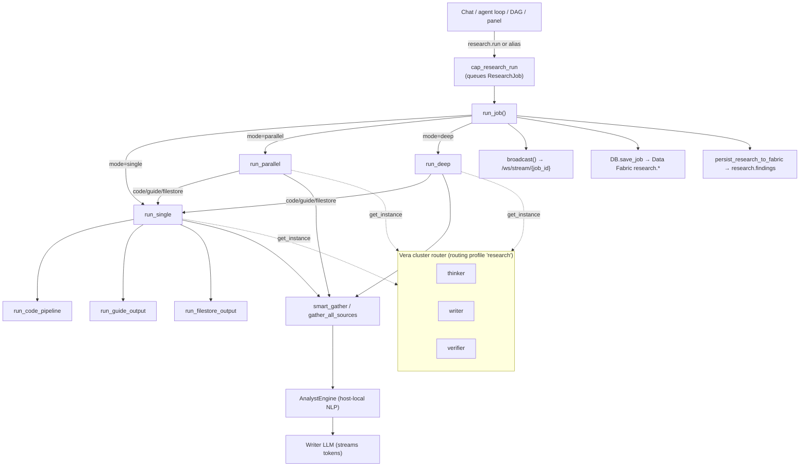

# 07 · Research System

Vera's research subsystem runs deep, multi-stage research jobs that combine web
search, recursive crawling, local NLP analysis and LLM synthesis, and produce a
report, a long-form guide, generated code, or a whole file tree. It also owns
the research **notebooks**, saved multi-stage **pipelines**, continuous
**iteration** targets, the off-host **NLP** capability family (`nlp.*`), and the
**Explode / Assess** structure-and-scoring tools.

The research engine lives in `vera/research/researcher_api.py`. When the module
is loaded by the orchestrator (the normal deployment, "Vera mode") it registers
its HTTP routes on the orchestrator's own FastAPI app and exposes roughly seventy
`research.*` capabilities; there is no separate research process to run. The
same file can still be started standalone on port `8765` for legacy use, in
which case it uses a hand-configured Ollama instance list instead of Vera's
cluster router. Persistence goes through the Data Fabric (`research_fabric.py`);
there is no separate research database any more.

**Maturity:** the core pipeline (single / parallel / deep × report / guide /
code / filestore), notebooks, projects, bookmarks and iteration are in daily
use. Workflow-IR and Run projections of saved pipelines are read-only views.
The NLP capabilities run on compute nodes and fail closed when no node serves
them. Explode and Assess are newer and persist nothing unless asked.

## Contents

- [1. Architecture](#1-architecture)
- [2. Source map](#2-source-map)
- [3. Model tiers and cluster routing](#3-model-tiers-and-cluster-routing)
- [4. Starting research: `research.run` and its aliases](#4-starting-research-researchrun-and-its-aliases)
  - [Modes and output modes](#modes-and-output-modes)
- [5. Pipeline stages](#5-pipeline-stages)
  - [Directive](#stage-1--directive-thinker)
  - [Source gathering](#stage-2--source-gathering)
  - [Analyst engine](#stage-3--analyst-engine)
  - [Synthesis, writing, expansion, verification, references](#stages-48--synthesis-writing-expansion-verification-references)
- [6. Sources](#6-sources)
- [7. Code and filestore pipelines](#7-code-and-filestore-pipelines)
- [8. Saved pipelines, Workflow IR and Run projection](#8-saved-pipelines-workflow-ir-and-run-projection)
- [9. Continuous iteration](#9-continuous-iteration)
- [10. Notebooks](#10-notebooks)
- [11. Persistence and recall](#11-persistence-and-recall)
- [12. Capability reference](#12-capability-reference)
- [13. HTTP routes and WebSocket events](#13-http-routes-and-websocket-events)
- [14. UI: panels and `<vera-research-card>`](#14-ui-panels-and-vera-research-card)
- [15. NLP capabilities (`nlp.*`)](#15-nlp-capabilities-nlp)
- [16. Explode and Assess](#16-explode-and-assess)
- [17. Configuration](#17-configuration)
- [18. Worked examples](#18-worked-examples)
- [19. Failure modes and troubleshooting](#19-failure-modes-and-troubleshooting)
- [20. Document-parser boundary](#20-document-parser-boundary)
- [See also](#see-also)

---

## 1. Architecture



Every job is an in-memory `ResearchJob` (query, mode, output mode, sources,
status, steps, citations, file tree, result). `run_job()` dispatches on `mode`,
broadcasts progress to WebSocket subscribers, updates the owning project's
rolling context, persists the job and its citations through the fabric, and —
when the job finishes `done` — writes the findings back into the fabric so
later research and discovery can build on them.

## 2. Source map

| File | Responsibility |
|---|---|
| `vera/research/researcher_api.py` | Job model, source gathering, analyst engine, all pipelines, notebooks, pipelines, iteration, HTTP routes, `research.*` capabilities, panel routes |
| `vera/research/research_fabric.py` | `DB` persistence class over the Data Fabric (replaces the old `research_db.py`), recall helpers, activity recording helper |
| `vera/research/alias_compatibility.py` | The `research.*` convenience aliases and their fixed `mode` / `output_mode` projection |
| `vera/research/research_route_core.py` | Pure helpers for the verifier role's prompt-length escalation |
| `vera/research/pipeline_workflow.py` | Deterministic Workflow IR projection of a saved pipeline |
| `vera/research/pipeline_run_projection.py` | Non-authoritative shared Run projection of a pipeline run |
| `vera/research/nlp_capabilities.py` | `nlp.rerank`, `nlp.classify`, `nlp.ner`, `nlp.zeroshot`, `nlp.qa`, `nlp.langid`, `nlp.embed`, `nlp.models` |
| `vera/research/nlp_dispatch.py` / `nlp_dispatch_core.py` | Where `nlp.*` work runs: node discovery, the `nlp.local` switch, chunking |
| `vera/research/explode_capabilities.py` / `code_explode_core.py` | `nlp.explode.*`, `code.explode`, `code.sources`, `explode.target` |
| `vera/research/assess_capabilities.py` / `assess_core.py` | Scorer registry and `assess.*` capabilities |
| `vera/research/research_panel.html` | Research tab UI |
| `vera/research/notebook_panel.html` | Notebook tab UI |
| `vera/research/nlp_panel.html` | NLP panel (injectable) |
| `vera/research_card_element.js` | `<vera-research-card>`, the shared progress/report renderer |

## 3. Model tiers and cluster routing

Research uses three logical tiers (`ModelTier` in `researcher_api.py`):

| Tier | Routing role | Role-profile rule | Typical work |
|---|---|---|---|
| `THINKER` | `thinker` | `job_type="research_planner"`, `prefer_gpu=True` | Builds the `ResearchDirective`, plans expansions, synthesises deep reports, architects code |
| `WRITER` | `writer` | `job_type="research_writer"`, `prefer_gpu=True` | Intent detection, sub-question decomposition, drafting, citation scoring, file implementation |
| `ANALYST` | `verifier` | `job_type="research_reader"`, `deny_gpu=True`, `escalate_chars=12000`, escalation `{deny_gpu: False, prefer_gpu: True}` | Structured analysis over the analyst digest, verification, code review |
| `AUTO` | `writer` | — | Used by pipeline stages with `model_tier="auto"` |

At import time in Vera mode the module calls
`register_routing_profile("research", …)` with these three roles. Every
`get_instance(tier)` call then resolves through the orchestrator's
`resolve_role("research", role, …)`, so research traffic obeys the routing
rules and load balancing configured on the Model Routing page (a user override
there wins). The static `DEFAULT_INSTANCES` list only supplies per-tier
model/context defaults.

> [!IMPORTANT]
> In Vera mode routing is authoritative: if the router returns no node,
> `get_instance` returns `None` and the job fails with
> "No Ollama instance available". It deliberately does **not** fall back to the
> static host list. Only the standalone server uses the static list.

**Length escalation.** A node must be chosen before the prompt is built, so the
verifier role's `escalate_chars` threshold could never fire at selection time.
`_escalated_for_prompt()` re-resolves the instance once the real prompt size is
known, using `should_escalate()` from `research_route_core.py`. It only
re-resolves instances the router originally chose, keeps the original node when
the threshold is not crossed, and never trades a GPU node for a CPU node.

## 4. Starting research: `research.run` and its aliases

`research.run` (`POST /research/run`) is the canonical entry point. It queues a
job and returns `{job_id, status: "queued"}` immediately; callers poll
`research.job.status` and then read `research.job.result`.

| Argument | Default | Notes |
|---|---|---|
| `query` | — (required) | |
| `mode` | `single` | `single` \| `parallel` \| `deep` |
| `output_mode` | `report` | `report` \| `guide` \| `code` \| `filestore` |
| `sources` | `""` | JSON array string or comma list of source IDs; empty = every enabled source |
| `project_id` | `""` | Groups the job into a project whose rolling context it updates |
| `context` | `""` | Prior text to include |
| `context_mode` | `fresh` | `fresh` \| `continue` |

The older convenience names are **compatibility aliases** declared in
`alias_compatibility.py`. Each wrapper projects to `research.run` with a fixed
mode pair and registers `compatibility_alias_for`, so discovery clients can see
the replacement. Unknown alias names raise rather than guessing.

| Alias | `mode` | `output_mode` | Replacement |
|---|---|---|---|
| `research.report` | single | report | `research.run` |
| `research.parallel` | parallel | report | `research.run` |
| `research.deep` | deep | report | `research.run` |
| `research.code` | deep | code | `research.run` |
| `research.guide` | single | guide | `research.run` |
| `research.filestore` | deep | filestore | `research.run` |
| `research.quick_search` | single | report | `research.report` |

Aliases accept only `query`, `project_id`, `context` and `context_mode`.

> [!NOTE]
> Despite its name, `research.quick_search` queues the same long-running,
> synthesised report as `research.report`. Use `web.search` for a direct list of
> search results.

### Modes and output modes

`mode` controls how evidence is gathered; `output_mode` controls what is
written. `run_parallel` and `run_deep` hand `code`, `guide` and `filestore`
jobs straight to `run_single`, because those outputs do not benefit from
parallel gathering.

| Mode | report | guide | code | filestore |
|---|---|---|---|---|
| **single** | One gather round → write | `run_guide_output` (section by section) | `run_code_pipeline` | Directive → `run_filestore_output` |
| **parallel** | Sub-question decomposition → concurrent gather/extract → synthesis | → single | → single | → single |
| **deep** | Directive → recursive research tree → thinker synthesis → writer draft → expansion | → single | → single | → single |

## 5. Pipeline stages

A report run moves through the stages below (`JobStatus` values: `queued`,
`thinking`, `searching`, `crawling`, `architecting`, `coding`, `reviewing`,
`writing`, `verifying`, `chaining`, `done`, `error`, `cancelled`).

### Stage 1 — Directive (THINKER)

`build_research_directive()` produces a `ResearchDirective` with:
`output_style`, `scope_focus`, `scope_exclude`, `key_questions`, `table_topics`,
`needs_recency`, `depth`, `sub_questions`, `writer_instructions`,
`source_priority`, `writer_sys` (a query-specific Writer system prompt) and
`nlp_tools` (which analyst phases to run). A `directive` event is broadcast so
the UI can show the plan.

### Stage 2 — Source gathering

`smart_gather()` first asks the fast model to classify the query (one of
`general`, `structured_data`, `documentation`, `financial`, `osint`,
`news_media`, `gaming`, `legal`, `academic`, `code`, `security`, `technical`)
and to propose seed URLs, authoritative targets and keywords. It then runs the
standard search, structured-URL fetches and documentation-site crawls in
parallel, and `gather_all_sources()` fans out to every active source (see
[§6](#6-sources)).

Shared web policy:

- Research and the general `web.search` capability use the same engine
  ordering, failure fallback, pagination, deduplication and redirect-decoding
  policy through one deterministic dispatcher (`vera/web/search_engines.py`).
- Configured platform search providers use the same boundary: when a provider
  matches a query its native results lead and ordinary engines fill the rest;
  provider errors fall back to normal web search.
- Every search and crawl HTTP attempt goes through the shared web client's
  request policy (`web_client.request_with_policy`): per-domain throttling and a
  bounded retry for transport failures and `429`/`502`/`503`/`504`, with capped
  `Retry-After`. Standalone deployments without the web client use direct
  requests.
- Recursive research and quick crawls share crawl identity rules: links are
  canonicalised before they consume the visit budget, fragments and default
  ports cannot duplicate work, embedded credentials and out-of-scope links are
  rejected, and repeated normalised content is emitted once. Failed pages stay
  isolated so earlier successes remain usable.

Candidates are ranked by `_rank_citations()` (relevance × authority ×
freshness into `rank_score`). When `VERA_RERANK_ENABLED=1` the merged pool is
additionally reordered by the `nlp.rerank` cross-encoder; any failure keeps the
original order. In recursive nodes the writer batch-scores up to 16 candidates
0–5 for relevance and redundancy before cross-source deduplication.

### Stage 3 — Analyst engine

`AnalystEngine` is a host-local NLP pipeline with an optional LLM phase. Its
phases, in code order:

| Phase | Name | `nlp_tools` key | LLM? |
|---|---|---|---|
| 1 | Text extraction and tokenisation | always | no |
| 2 | Per-source TF scoring → source-density ranking | always | no |
| 3 | Entity extraction (CVEs, CVSS, money, dates, versions, %, proper nouns) | `entities` | no |
| 4 | Contradiction detection (opposing signal pairs near shared terms) | `contradictions` | no |
| 5 | Anomaly detection in numeric data | `anomalies` | no |
| 6 | Knowledge compaction (knowledge bullets) | always | no |
| 7 | Gap detection | always | no |
| 9 | Timeline extraction | `timeline` | no |
| 10 | Key quotes and statistics | `key_quotes` | no |
| 11 | Keyword co-occurrence clusters | `clusters` | no |
| 12 | Per-source sentiment (−1…+1) | `sentiment` | no |
| 8 | Structured analysis → synthesis plan, scored bullets | — | yes, when an analyst instance exists and ≥ 4 bullets |
| 13 | Gap-fill searches (at most 2 gaps, 10 s timeout each) | — | no |

`nlp_tools=None` runs every tool. The resulting `AnalystReport` (bullets, top
sources, contradictions, gaps, entities, timeline, quotes, clusters, sentiment,
synthesis plan) is what the Writer sees in place of raw source text.

### Stages 4–8 — Synthesis, writing, expansion, verification, references

- **Synthesis (THINKER, deep only)** integrates findings across the research
  tree and plans the structure.
- **Writing (WRITER)** drafts with the directive's `writer_sys`, the analyst
  context and the numbered citation list, streaming `token` events.
- **Expansion (deep)** — `_plan_expansions()` finds thin sections and
  `_run_expansions()` gathers extra sources and writes addenda.
- **Verification (ANALYST)** — `run_analyst_phase()` reviews the draft against
  the evidence.
- **References** — sequential `[N]` markers map to the citation list; the UI
  renders them as clickable chips.

## 6. Sources

`DEFAULT_SOURCES` (persisted and editable via `research.sources.*`):

| ID | Type | Enabled by default | Notes |
|---|---|---|---|
| `searxng` | web_search | yes | Host from source config, else `VERA_SEARXNG_URL`, else `http://<BACKEND_HOST>:8888` |
| `brave` | web_search | no | Needs `api_key` in the source config |
| `crawl4ai` | web_crawl | yes | Recursive crawl of result pages |
| `commoncrawl` | web_archive | no | |
| `wayback` | web_archive | yes | |
| `neo4j` | neo4j | yes | Graph lookup |
| `chroma` | chroma | yes | Vector lookup |
| `github` | github | no | Needs `token` |
| `hackernews` | news | yes | |
| `arxiv` | news | yes | Only queried when explicitly in the active set |
| `redis` | redis | no | |
| `fabric` | fabric | yes | `top_k: 30` — Data Fabric recall |
| `memory` | memory | yes | `top_k: 20` — memory graph |
| `discovery` | discovery | yes | `top_k: 30` — discovery crawl store |
| `worldview` | worldview | yes | `top_k: 15` — nearest neighbours via `worldview.query` ([Worldview](./11-worldview.md)) |

The security intent additionally pulls NVD CVE records (`_gather_nvd`). Missing
default sources are re-added at startup and duplicates are removed. The web
search behaviour (`engine` = `searxng|brave|ddg`, `result_count` 8,
`crawl_depth` 1, `crawl_breadth` 3, `crawl_timeout` 8.0 s, `include_archive`,
`safe_search`) is set with `research.websearch.config.set`.

## 7. Code and filestore pipelines

**Code** (`run_code_pipeline`) is a three-agent chain: the Thinker architects
the file plan, the Writer implements file by file inside `=== FILE: path ===`
markers that are parsed and materialised as they arrive (`file_created`
events), and the Analyst reviews. A `ChainContext` (`chain_id`, `run_number`,
architecture, `files_planned` / `files_done` / `files_pending`, a continuity
summary and accumulated code) lets a large project continue across runs without
carrying the whole prior output: `research.chain.continue` starts the next run
and `research.chain.status` reports progress. Incomplete chains are kept in an
in-memory `chain_store`.

**Filestore** builds a directive for the file structure, gathers context,
extracts knowledge bullets and writes each planned file; the tree is
materialised under `projects/` and listed in a README. Generated files are
available through `research.job.files` / `research.job.file` and as a ZIP from
`GET /api/history/{job_id}/files.zip`.

## 8. Saved pipelines, Workflow IR and Run projection

A saved pipeline is an ordered list of `PipelineStage`s:

| Field | Default | Values |
|---|---|---|
| `name` | `Stage` | |
| `kind` | `research` | `research` \| `transform` \| `synthesis` |
| `mode` | `single` | `single` \| `parallel` \| `deep` |
| `output_mode` | `report` | `report` \| `guide` \| `filestore` \| `code` |
| `model_tier` | `auto` | `thinker` \| `writer` \| `analyst` \| `auto` |
| `sources`, `nlp_tools` | `[]` | |
| `query_template` | `{topic}` | `{topic}` = pipeline input, `{prev}` = previous stage output, `{all}` = every prior output |
| `prompt` | `""` | Extra writer instruction |

Pipelines are managed through `/api/pipelines` (list, get, save, delete) and run
with `POST /api/pipelines/run` (`pipeline_id`, `topic` up to 4000 chars); live
progress streams on `/ws/pipeline/{run_id}` (`pl_start`, `pl_stage_start`,
`pl_stage_done`, `pl_done`).

**Workflow IR.** `GET /api/pipelines/{id}?include_workflow_ir=true` returns the
native pipeline plus a deterministic `workflow_ir` projection
(`vera.research-pipeline-workflow/v1`). Each stage becomes a typed task
(`research.acquire-and-synthesize`, `research.transform`,
`research.synthesize`) with stable order, state bindings and a content hash. The
full native stage configuration stays in a namespaced extension. The
projection is non-authoritative and reports the native-stage execution gap for
every task: the researcher still owns models, search, streaming, cancellation,
citations, persistence and execution.

**Run projection.** `GET /api/pipelines/runs/{run_id}?include_run_protocol=true`
adds a parent Run and one child Run per started stage. Child `task_id`s are the
Workflow IR stage IDs; citation counts and validated native job IDs are kept as
correlation metadata. Topics, templates, prompts, output, citation text and
native error messages are never copied. After a research stage has persisted,
its child Run carries content-free `ArtifactRef`s (fabric record ID and dataset
URI) for the saved job and citation records; missing records are omitted and
malformed identities rejected.

Projections are recorded in the shared bounded Run registry used by DAG and
agent-loop observations. With `VERA_RUN_JOURNAL_PATH` set, parent and child
events are checkpointed to a checksummed SQLite journal and rebuilt after
restart; otherwise storage is reported as process-local memory. Deleting a
pipeline run removes its projections through checksum-verified journal
deletion. The research data and native WebSocket events remain the execution
and result authorities in both modes.

## 9. Continuous iteration

An iteration target re-runs research on a schedule and walks outward from a
seed. Create one with `research.iterate.create` / `POST /api/iterate`:

| Field | Default |
|---|---|
| `target_type` | `project` (`project` \| `job` \| `notebook`) |
| `target_id`, `seed_query` | required |
| `mode` / `output_mode` | `single` / `report` |
| `interval_secs` | `300` |
| `autostart` | `true` |

The loop (`_run_iteration_loop`) chooses the next query, runs a job through
`run_job_body`, and updates a traversal map (`research.iterate.map`). Progress
streams on `/ws/iterate/{it_id}` (`iter_start`, `iter_job`, `iter_done`).
`research.iterate.stop` stops **and deletes** the target.

API and capability responses carry non-executing schedule evidence
(`schedule_contract`, `schedule_policy`, `schedule_lifecycle`,
`schedule_projection`) shared with Vera's other native schedulers. The
projection states `authority: vera.research.iteration_loop`,
`execution: native`, `restart_behavior: native_immediate` (a persisted
`running` target resumes immediately at startup even if its interval has not
elapsed), `stop_behavior: native_delete_record` and `executes: false`. Because
stop deletes the record, only `active` and `paused` targets are projected.
Trigger, decision and receipt events carry opaque identities rather than the
seed query, and projection or event failures never block research.

## 10. Notebooks

A notebook is a page-organised document of cells, stored in the fabric
(`research.notebooks`, `research.notebook_cells`, `research.notebook_pages`).
Cells carry `cell_type` (the panel uses `markdown`, `code`, `mermaid`,
`illustrate`, `image`, `image-gen`, `object`, `panel`), `lang`, `tag` (for
example `research`, `flesh_out`, `to_code`, `summarise`), `content`,
`generated`, `citations`, a chat `thread` and free-form `props`.

A cell is executed over `WS /ws/notebook/{nb_id}/cell/{cell_id}` with
`action` = `generate`, `research` or `chat`. Each action receives a notebook
context built from the title, description and the first 400 characters of
every earlier cell (`_build_nb_context`). Other notebook operations: cell
reordering and moving between pages, auto-naming a cell, building a notebook
from a finished job (`research.notebook.from_job`), syncing to the graph
(`POST /api/notebooks/{nb_id}/sync_graph`) and pushing Markdown to a Gitea repo
(`POST /api/notebooks/{nb_id}/gitea`).

## 11. Persistence and recall

`research_fabric.DB` persists everything through the Data Fabric. Datasets:

`research.jobs`, `research.searches`, `research.citations`,
`research.crawl_pages`, `research.results`, `research.llm_calls`,
`research.notebooks`, `research.notebook_cells`, `research.notebook_pages`,
`research.projects`, `research.project_rounds`, `research.sessions`,
`research.bookmarks`, `research.generated_files`, `research.source_configs`,
`research.web_config`, `research.instance_configs`,
`research.iteration_targets`, `research.pipelines`, `research.pipeline_runs`.

On completion `persist_research_to_fabric()` (unless
`VERA_RESEARCH_PERSIST=0`) also ingests the report and citation index into
`research.findings` and registers each web citation as a discovery page in
`research.<slug>`.

**Recall capabilities** (registered in `researcher_api.py`, backed by
`research_fabric.py`):

| Capability | Arguments | Returns |
|---|---|---|
| `research.recall.search` | `query`, `dataset_id` (optional), `top_k` 20 | Semantic hits across the recall datasets |
| `research.recall.job` | `job_id` | Job, citations and result hydrated from the fabric |
| `research.recall.notebook` | `notebook_id` | Notebook + cells (falls back to the live store) |
| `research.recall.session` | `session_id` | Session timeline |
| `research.recall.datasets` | — | Fabric datasets whose IDs start with `research.` or `web.` |

`research_fabric.record_activity()` is an internal helper that records a
research event as a memory-graph node (optionally linked to a parent with a
`FOLLOWS_ACTIVITY` edge), writes an optional fabric record and emits a
`<category>.recorded` event. It is a function, not a capability.

> [!NOTE]
> The module docstring of `research_fabric.py` still lists
> `research.recall.notebook.list`, `research.recall.project*`,
> `research.recall.crawled_pages` and `research.activity.*` capabilities. None
> of those are registered; use the table above.

## 12. Capability reference

All capabilities below are registered by `researcher_api.py` in Vera mode. The
HTTP path is the capability route (`/research/...`); the panel's legacy
`/api/...` routes are listed in [§13](#13-http-routes-and-websocket-events).

| Group | Capabilities |
|---|---|
| Run | `research.run`, aliases (see [§4](#4-starting-research-researchrun-and-its-aliases)), `research.chain.continue`, `research.chain.status` |
| Job | `research.job.status`, `research.job.result`, `research.job.files`, `research.job.file`, `research.agent.stop`, `research.agents.status` |
| Post-processing | `research.crawl_additional` (deep-crawl a URL into an existing job), `research.format_section`, `research.expand` (dive deeper into a passage) |
| History | `research.history`, `research.history.delete` |
| Sources & config | `research.sources`, `research.sources.update`, `research.sources.add`, `research.sources.delete`, `research.sources.test`, `research.websearch.config.get`, `research.websearch.config.set`, `research.models`, `research.config.instances.get`, `research.config.instances.set` |
| Projects | `research.projects`, `research.projects.create`, `research.projects.get`, `research.projects.delete`, `research.projects.add_job` |
| Database | `research.db.stats`, `research.db.search`, `research.db.export` |
| Bookmarks | `research.bookmarks`, `research.bookmarks.add`, `research.bookmarks.update`, `research.bookmarks.delete` |
| Notebooks | `research.notebook.create`, `.list`, `.get`, `.update`, `.delete`, `.cell.add`, `.cell.update`, `.cell.delete`, `.from_job` |
| Iteration | `research.iterate.create`, `.list`, `.get`, `.start`, `.pause`, `.stop`, `.update`, `.map` |
| Recall | `research.recall.search`, `.job`, `.notebook`, `.session`, `.datasets` |
| Health | `research.health` → `{status, mode: "integrated", jobs_active, instances, sources}` |

## 13. HTTP routes and WebSocket events

The panels use the original REST surface, which is mounted on the orchestrator
app in Vera mode: `/api/research` (start), `/api/research/continue`,
`/api/research/chain/{chain_id}`, `/api/research/{job_id}/crawl`,
`/api/research/chat`, `/api/research/format_section`, `/api/agent/stop`,
`/api/agents/status`, `/api/history[/{job_id}[/result|/files|/files.zip]]`,
`/api/sources[/update|/add|/test|/{id}]`, `/api/websearch/config`,
`/api/models`, `/api/config/instances`, `/api/projects[...]`,
`/api/db/{stats,search,export}`, `/api/bookmarks[...]`, `/api/notebooks[...]`,
`/api/pipelines[...]`, `/api/iterate[...]`, `/api/expand` and
`/api/debug/screenshot`.

| WebSocket | Purpose |
|---|---|
| `/ws/stream/{job_id}` | Job progress |
| `/ws/notebook/{nb_id}/cell/{cell_id}` | Cell generate / research / chat |
| `/ws/pipeline/{run_id}` | Pipeline run progress |
| `/ws/iterate/{it_id}` | Iteration progress |

Job message types include `status`, `step`, `thinking`, `intent`, `directive`,
`token`, `citations`, `crawl_progress`, `crawl_done`, `crawl_error`,
`architecture`, `review`, `file_created`, `file_tree`, `chain_continue`,
`persisted`, `error` and `done` (the `done` message carries the result,
elapsed seconds, token count, citations, file list and chain state).

## 14. UI: panels and `<vera-research-card>`

| Panel id | Title | Route | Mode | `tab_order` |
|---|---|---|---|---|
| `research-panel` | Research | `/research/panel` | tab | 55 |
| `notebook-panel` | Notebook | `/notebook/panel` | tab | 56 |
| `nlp-panel` | NLP | `/nlp/panel` | injectable | 57 |

The **Research** panel shows a thread of runs with mode/output selectors
(`single|parallel|deep`, `report|guide|filestore|code`), live per-tier agent
cards, a citations bar, bookmarks, a project selector, saved pipelines, and an
**Iterate** toggle: with it on, a new query continues the previous thread
(`context_mode="continue"`, the previous result becomes `prior_context`, the
entry is tagged `[Iter N]`) and a **Dive** action drills into a passage through
`/research/expand`.

**`<vera-research-card>`** (`vera/research_card_element.js`, served at
`/ui/elements/research_card.js`) is the single research progress/report
renderer used by both the chat panel and the agent-loop output. Callers create
the element, set `jobId`, `push()` researcher messages verbatim (`token`,
`thinking`, `step`, `directive`, `citations`, `crawl_*`, `architecture`,
`review`, `iter_*`, `error`, `done`; the loop's `agent_loop.research_activity`
envelope is unwrapped from its `kind`), and call `finish(markdown)`. Its layout
is fixed from the first message to the final report — status, steps, research
method, pages read, sources, report — and each region updates in place.

## 15. NLP capabilities (`nlp.*`)

Small ONNX models — cross-encoder reranking, classification, NER, zero-shot,
QA, language ID and embeddings — are served by an NLP server on compute nodes
(`edge/nlp_server.py`), not on the Vera host. Each capability first offers the
call to `nlp_dispatch`, which picks a node serving NLP on `VERA_NLP_PORT`
(default `8771`) and calls it over HTTP. Only if the operator switch
`nlp.local` permits it does the call run in-process.

| Capability | Purpose |
|---|---|
| `nlp.rerank` | Re-rank documents against a query (cross-encoder) — used by research when `VERA_RERANK_ENABLED=1` |
| `nlp.classify` | Sequence / sentiment classification |
| `nlp.ner` | Named entities (OntoNotes v5 labels); the node chunks long documents, the local path truncates at 1024 characters |
| `nlp.zeroshot`, `nlp.qa`, `nlp.langid`, `nlp.embed` | Zero-shot labels, extractive QA, language ID, embeddings |
| `nlp.models` | Availability, models and where work would actually run |
| `nlp.config.get` / `nlp.config.set` | Read / flip the `nlp.local` switch (stored in Redis, read per call) |
| `nlp.nodes` | Which nodes serve NLP and which would win |

> [!WARNING]
> With `nlp.local` off (the default) and no node serving, `nlp.*` calls
> **fail with a reason** rather than silently running on the host.
> Placement rules live in `nlp_dispatch_core.resolve_placement()`; model
> packaging is described in [ONNX](./30-onnx.md).

## 16. Explode and Assess

**Explode** (`explode_capabilities.py`) turns one thing — a fabric record, a
character range of one, several records, a pasted passage, or code — into a
structured graph contract that `<vera-structgraph>` draws. It persists nothing.
Each analysis is a *layer* (fabric NER, sentence-scoped typed relations,
co-occurrence, node-tier NER, language ID, sentiment) that carries `layer` and
`by`; every card has a source span and every edge a resolution (`exact` or
`heuristic`).

| Capability | Route | Purpose |
|---|---|---|
| `nlp.explode.prose` | `POST /nlp/explode/prose` | `text` \| `record_id` \| `record_ids`, `ranges`, `mode`, `layers` → contract |
| `nlp.explode.layers` | `GET /nlp/explode/layers` | Registered layers and defaults |
| `code.explode` | `POST /code/explode` | Code (`text`+`lang`, `path`/`paths` with one hop of imports, or `record_id`) → contract; extractor in `code_explode_core.py` |
| `code.sources` | `GET /code/sources` | The repository code tree, for picking a target |
| `explode.target` | `POST /explode/target` | Resolve a clicked thing into an explode target |

The graph component's **Explode** sidebar panel is the main UI
([Galaxy Graph](./09-galaxy-graph.md)).

**Assess** (`assess_capabilities.py`) is a registry of *scorers* whose output is
assessments `{key, score, confidence, by, on, evidence}` over prose or an
Explode code contract. With `persist=true` (records only) assessments are
written to the record's `data.assess`, which makes cross-record ranking one
query.

| Capability | Route | Purpose |
|---|---|---|
| `assess.scorers` | `GET /assess/scorers` | Registered scorers |
| `assess.prose` | `POST /assess/prose` | `text` \| `record_id` (+ `scorers`, `persist`) → assessments |
| `assess.code` | `POST /assess/code` | `path` \| `paths` \| `text` (+ `scorers`) → assessments over the code contract |
| `assess.rank` | `POST /assess/rank` | Records ordered by a weighted composite of persisted assessments |

## 17. Configuration

| Variable | Default | Effect |
|---|---|---|
| `VERA_SEARXNG_URL` | — | SearXNG host when a source has no explicit `host`; fallback `http://<BACKEND_HOST>:8888` |
| `VERA_RERANK_ENABLED` | `0` | Rerank merged citations with `nlp.rerank` |
| `VERA_RESEARCH_PERSIST` | `1` | Write findings back to `research.findings` and `research.<slug>` |
| `RESEARCH_FAST_TIMEOUT` | `90` | Seconds for fast-writer calls (intent detection, decomposition) |
| `OLLAMA_KEEP_ALIVE` | `30m` | Keep-alive sent with research generations |
| `OLLAMA_MAX_AUTO_CTX` | `0` | Cap on auto-detected context size (0 = no cap) |
| `VERA_RUN_JOURNAL_PATH` | — | Enables the checksummed Run journal for pipeline projections |
| `VERA_NLP_PORT` | `8771` | Port of the node NLP server |

Persisted runtime configuration: sources, web-search config, instance defaults
and projects are stored in the fabric and reloaded at startup; when the store is
empty, `vera_config.json` in the working directory is used as a fallback for
sources. Screenshots are written to `screenshots/` and served at
`/screenshots`; generated project files go to `projects/`.

## 18. Worked examples

Start a deep report and poll it:

```bash
curl -s -X POST http://localhost:8999/research/run \
  -H 'Content-Type: application/json' \
  -d '{"query":"state of post-quantum TLS deployment","mode":"deep"}'
# → {"job_id":"…","status":"queued"}

curl -s "http://localhost:8999/research/job/status?job_id=<id>"
curl -s "http://localhost:8999/research/job/result?job_id=<id>"
```

Recall earlier work instead of researching again:

```bash
curl -s "http://localhost:8999/research/recall/search?query=post-quantum%20TLS&top_k=10"
```

Create an hourly iteration target on a project:

```json
{"target_type":"project","target_id":"<project_id>",
 "seed_query":"open-source vector databases","interval_secs":3600}
```

## 19. Failure modes and troubleshooting

| Symptom | Likely cause |
|---|---|
| Job errors with "No Ollama instance available" | The cluster router returned no node for the research role; check the Model Routing page and node health |
| Large digests stay on CPU | The verifier escalation only fires when the prompt exceeds `escalate_chars` and a GPU node is available |
| No web results | SearXNG unreachable or the `searxng` source disabled; set `VERA_SEARXNG_URL`, run `research.sources.test` |
| `worldview` source returns nothing | The Worldview model or index is not trained ([Worldview](./11-worldview.md)) |
| `nlp.*` calls fail | No NLP node is serving and `nlp.local` is off — see `nlp.nodes` |
| `research.quick_search` is slow | It is a full report; use `web.search` for direct results |
| Iteration resumes immediately after restart | Expected: `restart_behavior: native_immediate` |

## 20. Document-parser boundary

Research consumes verified, cited records; it does not convert documents.
`providers.document.*` (`status`, `plan`, `validate`, `corpus.evaluate`,
`teardown.plan`) defines an offline, provider-neutral `DocumentParser` boundary
around an original `ArtifactRef`. Plans carry supplied inspection evidence,
resource ceilings, OCR policy, parser profile and a stable identity; supplied
results are checked for source-bound element IDs, page/locator citations,
parser/config provenance, derived-artifact budgets and explicit OCR use. The
current Docling profile reports `not_imported` / `queued_live`: Vera does not
open documents or run OCR in this layer. A bounded frozen-corpus evaluator
compares only text/table/layout hashes and issue codes.

## See also

- [Data Fabric](./06-data-fabric.md) — where research datasets live
- [Memory Graph](./05-memory-graph.md) — the activity chain and `memory` source
- [Ollama Cluster](./04-ollama-cluster.md) — routing profiles and node selection
- [IDE Module](./08-ide.md) — code generation in the editor
- [Galaxy Graph](./09-galaxy-graph.md) — the Explode panel
- [Worldview](./11-worldview.md) — the `worldview` research source
- [ONNX](./30-onnx.md) — the models behind `nlp.*`
- [Web Browser](./24-web-browser.md) — the shared web client

## Screenshots

<!-- VERA:AUTO:screenshots START -->
_No screenshots captured yet — run `docs.build` (or `operator.mission.run documentation`)._
<!-- VERA:AUTO:screenshots END -->

## Capabilities

<!-- VERA:AUTO:capabilities START -->
_No capabilities resolved for this domain._
<!-- VERA:AUTO:capabilities END -->
