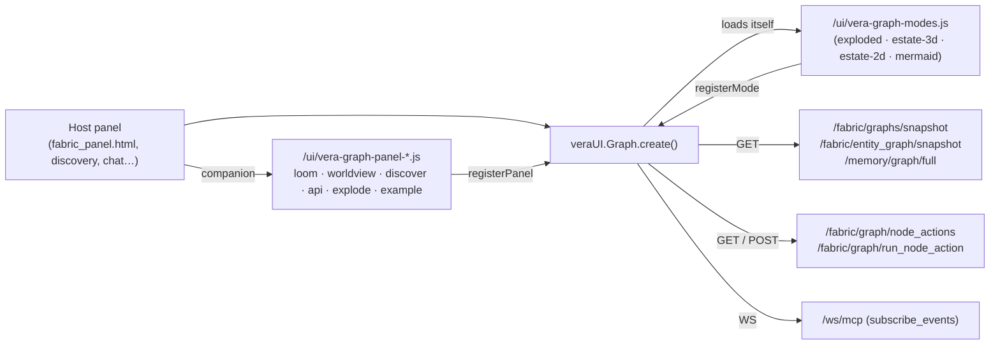
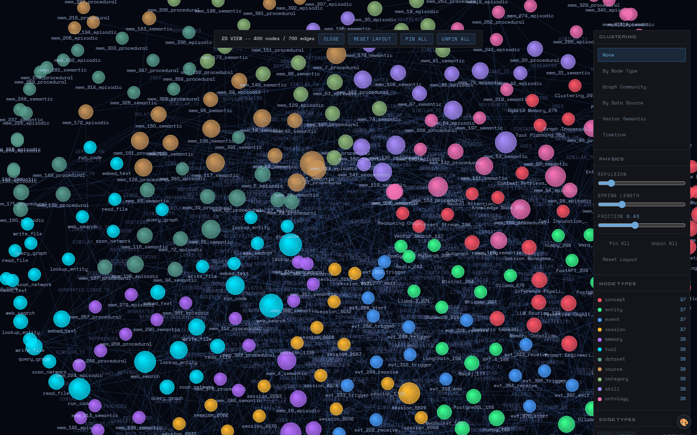

# 09 · Galaxy Graph

Vera has one reusable 2D graph component, `vera/vera_graph.js`, published on
the page as `window.veraUI.Graph`. It handles fetching, layout, canvas
rendering, interaction, a server-driven node-action registry, live event
streaming, plug-in **sidebar panels** and plug-in **display modes**. The Data
Fabric graph views, the Discover crawl view, the entity and Loom views, the
WorldView latent map and the inline `<vera-graph-embed>` all use it with
different options.

The **Galaxy** tab is a separate, full-screen **3D** star map
(`vera/fabric/memory_map.html`, THREE.js) for exploring the capability estate,
memory and fabric at scale. Both are covered here.

**Where it lives:** `vera/vera_graph.js` (component), `vera/vera_graph_modes.js`
(display modes), `vera/vera_graph_panel_*.js` (sidebar companions),
`vera/vera_graph_panels.py` (serves the companions), `vera/graph_embed_element.js`
(`<vera-graph-embed>`), `vera/graph/families.js` (unified-graph adapters) and
`vera/fabric/memory_map.html` (3D Galaxy). **Maturity:** in daily use; the
display modes and the families adapters are the newest parts.

## Contents

- [1. Components at a glance](#1-components-at-a-glance)
- [2. Creating a graph](#2-creating-a-graph)
  - [Options](#options)
  - [Instance API](#instance-api)
- [3. Layers and data sources](#3-layers-and-data-sources)
- [4. Layouts](#4-layouts)
- [5. Filtering and search](#5-filtering-and-search)
- [6. The detail drawer](#6-the-detail-drawer)
- [7. Server-driven node actions](#7-server-driven-node-actions)
- [8. Live updates](#8-live-updates)
- [9. Sidebar panels](#9-sidebar-panels)
- [10. Display modes](#10-display-modes)
- [11. `<vera-graph-embed>` and graph families](#11-vera-graph-embed-and-graph-families)
- [12. Rendering, theming and edge classes](#12-rendering-theming-and-edge-classes)
- [13. Performance](#13-performance)
- [14. The 3D Galaxy panel](#14-the-3d-galaxy-panel)
- [15. Routes and capabilities](#15-routes-and-capabilities)
- [16. Integration patterns](#16-integration-patterns)
- [17. Troubleshooting](#17-troubleshooting)
- [See also](#see-also)

---

## 1. Components at a glance



| File | Served at | Role |
|---|---|---|
| `vera/vera_graph.js` | `/ui/vera-graph.js` | The component (route registered in `vera/ui builder/ui_capabilities.py`) |
| `vera/vera_graph_modes.js` | `/ui/vera-graph-modes.js` | Display modes; `vera-graph.js` loads it automatically |
| `vera/vera_graph_panel_loom.js` | `/ui/vera-graph-panel-loom.js` | Loom workbench sidebar |
| `vera/vera_graph_panel_worldview.js` | `/ui/vera-graph-panel-worldview.js` | WorldView sidebar (training, latent map, concepts) |
| `vera/vera_graph_panel_discover.js` | `/ui/vera-graph-panel-discover.js` | Discover+ crawl sidebar |
| `vera/vera_graph_panel_api.js` | `/ui/vera-graph-panel-api.js` | API-browser sidebar |
| `vera/vera_graph_panel_explode.js` | `/ui/vera-graph-panel-explode.js` | Explode sidebar |
| `vera/vera_graph_panel_example.js` | `/ui/vera-graph-panel-example.js` | Reference panel |
| `vera/graph_embed_element.js` | `/ui/vera-graph-embed.js` | `<vera-graph-embed>` chrome-less inline graph |
| `vera/graph/families.js` | `/ui/graph/families.js` | Pure adapters for the unified graph document |
| `vera/fabric/memory_map.html` | `/galaxy/panel` | 3D Galaxy tab |

## 2. Creating a graph

```javascript
const graph = window.veraUI.Graph.create(containerEl, {
  defaultLayer: 'fabric',                 // initial layer (default 'fabric')
  layerOpts:    { dataset_id: 'research.findings' }, // initial params
  layers:       ['fabric', 'entity', 'memory', 'net'],
  showLayerToggle: true,
  height:       'fill',                   // px number, or 'fill' / '100%'
  actionsEnabled: true,                   // server node actions (default true)
  onNodeClick:  (node) => {},
  onAction:     (actionId, node, inst) => true,   // return false to handle locally
});
graph.fetchSnapshot('fabric', { dataset_id: 'research.findings' });
```

`create()` injects its CSS once, builds a three-pane layout (left controls,
canvas, right detail drawer), registers the instance so existing and future
sidebar panels and display modes attach to it, and starts the live-event
subscription.

### Options

Options read by `createGraph()` (grouped):

| Group | Options |
|---|---|
| Data | `apiBase` (default `window._veraBase` or same origin), `defaultLayer`, `layerOpts`, `layers`, `layerMap`, `memoryLayer`, `memoryStore` |
| Chrome | `height` (default `420`), `showSearch`, `showLegend`, `showLayerToggle`, `showLeftPanel`, `filtersOnly`, `layerUI`, `leftSections`, `drawerSections`, `excludeSections`, `sections`, `sidebar`, `sidebarPanels`, `defaultPanel`, `showRelevance`, `bottomDrawerHeight`, `autoOpenTerminal`, `fullDetailUrl` |
| Behaviour | `actionsEnabled`, `autoIngestResults`, `subscribeLiveEvents` (default on), `livePrefixes`, `eventBus`, `edgeStyleFn` |
| Callbacks | `onNodeClick`, `onNodeDblClick`, `onNodeSelect`, `onSelect`, `onNodeDetail`, `onAction`, `onActionDone`, `onActionResults`, `onActivity`, `onExpand`, `onCollapse` |

### Instance API

`create()` returns an instance with: `load({nodes, edges})`, `addNode`,
`addEdge`, `fetchSnapshot(layer, params, {merge})`, `fetchMemory(mode, params)`,
`expandNode` / `expandEntities`, `collapseNode`, `expandRecords`, `showDetail`,
`hideDetail`, `runAction(actionId, node)`, `pulseNode(id)`, `focusNode`,
`search`, `clear`, `setLayer`, `getNode`, `colorFor`, `applyLayout`,
`setLatentMap(positions)` / `clearLatentMap()`, layer controls
(`getLayers`, `setLayerVisible`, `setLayerPhysics`), `wake`, `fit`, `resize`,
`stop`, `destroy`, `showNodeTable`, `showNodeContent`, `bottomDrawer`, and the
`container`, `canvas` and `eventBus` handles.

Module-level API on `window.veraUI.Graph`: `create`, `colors`, `nodeColor`,
`edgeColor`, `isInferredEdge`, `eventBus`, `registerPanel`, `listPanels`,
`registerMode`, `listModes`.

## 3. Layers and data sources

`fetchSnapshot(layer, params)` routes by layer name:

| Layer | Endpoint | Notes |
|---|---|---|
| `memory` | `GET /memory/graph/full?mode=…&limit_nodes=…&limit_edges=…` | Modes include `session` (with `session_id`) and `recent` (`recent_hours`) |
| `entity` | `GET /fabric/entity_graph/snapshot` | `dataset_id`, `entity_type`, `limit` (default 300), `include_datasets`, `include_records` |
| anything else | `GET /fabric/graphs/snapshot?graph=<layer>` | `limit` (default 200), `dataset_id`, `label_filter` |

With no `dataset_id` and no `label_filter`, structural defaults keep the first
view collapsed: `fabric` shows `Dataset,Source,Category,Ontology,Skill,Agent,DAG`
and `net` shows `NetHost,SshHost,Subnet,NetService,Container,DockerHost`.
Unscoped fabric views also fetch `/fabric/datasets` to mark datasets that have
children.

Because every other name goes to `/fabric/graphs/snapshot`, any graph
registered through `fabric.graphs.register` (for example a code graph) appears
in the source row: the component lists `/fabric/graphs` and adds a button for
each custom graph next to Fabric / Memory / Net. `merge: true` adds new nodes
without disturbing the current layout.

## 4. Layouts

Layout chips in the left panel (`data-layout`):

| Layout | Behaviour | Controls |
|---|---|---|
| `default` | Force-directed: grid-binned repulsion, per-edge springs, gravity, decaying damping. After 280 ticks a cooling pass ends; remaining auto-anneal cycles re-energise it (3–8 cycles depending on node count) before it freezes and auto-fits once | Spread, gravity, repulsion; **Re-layout** button |
| `force-axis` | Nodes bucketed by (X, Y) axis values and laid out in a small grid around each zone; light physics declutters | X: type, cluster, layer, degree, label, time, importance, source, category. Y: cluster, type, layer, degree, importance, session, label. Spread |
| `timeline` | Static. X = time, Y = one lane per type | Lane height (80), px per hour (60) |
| `hierarchy` | Static top-down tree from a root type | Root: session, Dataset, message, dag; level gap (130), node gap (60) |
| `radial` | Static rings around the selected node (or first visible) | Radius (200) |
| `latent-map` | Static positions supplied by `setLatentMap()`; physics frozen | Set by the WorldView panel |

## 5. Filtering and search

- **Node Types** and **Edge Types** chip strips show every type in the loaded
  graph with counts; clicking toggles visibility. A filter-mode button switches
  between *exclude* (hide what you click) and *include* (show only what you
  click). Choices are held in memory by the graph instance; resetting the
  filters clears them, and they are not saved across page loads.
- **Search** has two modes: *List* (result list, zoom to a hit) and
  *Highlight* (highlight matches plus neighbours to a chosen depth 0–3).
  **Deep** search also queries the graph database for nodes not loaded in the
  view; collapsed sub-nodes are always searched.

## 6. The detail drawer

Clicking a node opens the right-hand drawer. Its header carries the label,
type and buttons that open the node's content or a records/properties table in
the bottom drawer, or the full untruncated detail (`fullDetailUrl`). Three
tabs follow:

| Tab | Contents |
|---|---|
| **Overview** | Node ID, link (when the node has a URL), expansion controls, properties, and incoming/outgoing connections (click to traverse) |
| **Actions** | Server-driven actions for the node's label ([§7](#7-server-driven-node-actions)) |
| **Tools** | A capability runner that lists `/mcp/tools` and runs any capability against the node with editable arguments |

## 7. Server-driven node actions

When the drawer opens it calls
`GET /fabric/graph/node_actions?node_label=<label>&node_id=<id>`
(`fabric.graph.node_actions`, registry `_NODE_ACTION_REGISTRY` in
`vera/fabric/data_fabric.py`). Each action looks like:

```json
{
  "id": "extract_entities",
  "label": "Extract entities",
  "icon": "◉",
  "capability": "fabric.entity_graph.extract_v2",
  "args": {"dataset_id": "$id"},
  "stream": "fabric.entity_graph.progress",
  "options": [
    {"name": "limit", "type": "int", "default": 1000, "label": "Max records"},
    {"name": "overwrite", "type": "bool", "default": false, "label": "Overwrite prior"}
  ],
  "context": "Pulls named entities from records, links each to every record it appears in."
}
```

- Option types: `bool`, `int`, `float`, `select` (with `options`), `string`.
- `$id` in `args` is replaced with the node ID.
- `capability: "__local"` means the host handles it (e.g. *Browse records*);
  `"__dispatch"` runs any capability named in the `capability` option with JSON
  `extra_args` (the server adds `available_capabilities`).
- Optional `confirm` text and `danger: true` add a confirmation step.

Running an action posts `{node_label, node_id, action_id, options}` to
`POST /fabric/graph/run_node_action`, opens a collapsible output strip that
subscribes to the action's `stream` event, adds emitted nodes and edges live,
and re-fetches the snapshot afterwards — but only when the view came from
`fetchSnapshot`, so a hand-built view is not replaced. If the registry cannot be
reached, `_LOCAL_FALLBACK` supplies actions for `Dataset` (browse, extract
entities, run Loom, AI-analyse links, unified run, run capability, purge entity
state) and other common labels. `onAction` returning `false` suppresses the
server round trip.

## 8. Live updates

The shared event bus (`veraUI.Graph.eventBus()`) is resolved in this order:

1. `opts.eventBus(prefix, cb)` supplied by the host;
2. `vera_fabric_event` messages posted by the parent harness;
3. its own WebSocket to `/ws/mcp`, sending `{action: "subscribe_events"}`
   (opened only when something subscribes; up to five reconnects with growing
   delay).

Unless `subscribeLiveEvents: false`, every graph subscribes to these prefixes
(override with `livePrefixes`): `fabric.web.acquire.progress`,
`fabric.entity_graph.progress`, `fabric.loom.progress`,
`fabric.unified_run.progress`, `fabric.record.ingested`. Matching events (for
example `page_added`, `data_detected` stages) add nodes and edges as long
operations run, without the host wiring anything.

## 9. Sidebar panels

A companion file calls `veraUI.Graph.registerPanel(def)`; every graph on the
page — existing or created later — gains a tab in its left rail.

```javascript
window.veraUI.Graph.registerPanel({
  id: 'my-panel', title: 'My panel', icon: '◇', order: 50,
  mount(bodyEl, graph, api) { /* api: activate, isActive, graphContainer, apiBase, eventBus */ },
  unmount(bodyEl, graph) {},
});
```

| Panel | `id` | `order` | What it does | Backend |
|---|---|---|---|---|
| Loom | `loom` | 10 | View controls (entities / stitched / combined), items list, per-dataset pipeline config, entity extraction, Loom stitching, graph extraction, AI link analysis | `/fabric/entity_graph/*`, `/fabric/graphs/snapshot`, `/fabric/graph/query`, `/fabric/datasets/config`, `/fabric/loom/run` |
| Discover+ | `discover` | 15 | Crawl controls, history grouped by topic, overwrite/expand/enhance | Discovery endpoints ([Data Fabric](./06-data-fabric.md)) |
| Explode | `explode` | 15 | Structured diagram of one record, a slice, several records or a pasted passage, drawn over the stage | `/nlp/explode/layers`, `/nlp/explode/prose` ([Research §16](./07-research.md#16-explode-and-assess)) |
| API | `api` | 16 | Browse discovered APIs, enumerate endpoints, map data, set up recurring pulls | `/fabric/api/list`, `/fabric/api/map`, `/fabric/surfaces/*`, `/fabric/sources/*`, `/fabric/browse` |
| WorldView | `worldview` | 20 | Sub-worldviews, training with stage counters, latent map via `setLatentMap`, concept injection ("connected" or "zone"), anomalies, loss history | `/worldview/*` ([Worldview](./11-worldview.md)) |
| Example | `example` | 90 | Reference implementation of the contract | — |

`VERA_GRAPH_PANEL_SCRIPTS` in `vera_graph_panels.py` is the standard tag set
(loom, worldview, discover, api, explode). The fabric panel and the discovery
page include their own sets.

## 10. Display modes

`vera_graph_modes.js` registers alternative renderings of the **same** nodes
and edges through `registerMode({id, mount})`; a mode selector on the graph
switches between them and a click still opens the graph's detail drawer.

| Mode id | Rendering |
|---|---|
| `exploded` | `<vera-exploded>` (`/ui/exploded_element.js`): a station per node type, showing what it read and what it made |
| `estate-3d` | Isometric projection (`/ui/iso.js`, `window.VeraISO`): a plate per group (host, else type), a block per node, height by degree; first 400 nodes |
| `estate-2d` | The same blocks seen from above |
| `mermaid` | `<vera-mermaid>` flowchart, one subgraph per type, edges labelled by relation |

## 11. `<vera-graph-embed>` and graph families

`<vera-graph-embed>` is `vera_graph.js` with every piece of chrome switched off
(no search, legend, left rail, layer switcher or node actions), for chat turns
and canvas blocks. Attributes: `layer` (default `entity`), `params` (JSON
passed to `fetchSnapshot`), `limit` (default 60), `height` (default 240),
`expand`, `full-url`. It emits `vera-graph-node` on click so a host can, for
example, scroll source code to a symbol.

```html
<vera-graph-embed layer="entity" limit="60" height="240"></vera-graph-embed>
```

`vera/graph/families.js` (`window.VeraGraphFamilies`) holds pure adapters that
map context, memory, DAG runs, the agent loop, plans and the estate into one
graph document (`toDoc`, `merge`, `counts`, `mix`, `sector`), keeping fields
such as real-versus-inferred and a non-authoritative flag. The memory graph
panel and the chat graph column use it; it has no DOM or fetch code and runs
under Node for tests.

## 12. Rendering, theming and edge classes

- Nodes are drawn on an HTML5 canvas, sized by a `ResizeObserver`. Radius
  comes from the node (`Dataset` 14, `FabricRecord` 8, `Entity` 6–20 by
  mention count, others 10). Colour comes from one palette (`COL`) per type —
  e.g. `Dataset #5a9e8f`, `Entity #c97a5a`, `Concept #d98cff`,
  `WorldviewPoint #8a7ec0`.
- Labels are clipped and zoom-gated; hovered, selected and search-matched
  nodes get heavier outlines.
- Edges are classed as **structural** (e.g. `CONTAINS`, `MENTIONED_IN`; strong
  springs), **inferred** (e.g. `SIMILAR_TO`, `CO_OCCURS`; weak springs, drawn
  lighter — `isInferredEdge()`), or **hub** edges to a session hub, which are
  hidden by default.
- Colours come from the host theme's CSS variables (`--bg0/1/2`, `--acc`…`--acc5`,
  `--text`, `--dim`, `--dim2`, `--border`, `--ok`, `--err`, `--warn`, `--mono`,
  `--radius`). A `vera:theme` postMessage clears the colour cache and redraws.

## 13. Performance

- **Repulsion** uses a spatial-hash grid with 150 px cells: each node is only
  compared with nodes in its own and the eight neighbouring cells, so the cost
  is roughly linear at thousands of nodes. The force `min(60, 1200/d²)` is
  negligible beyond about 120 px.
- **Damping** starts at `0.85` and decays with the tick count; the velocity cap
  shrinks likewise. Layers can have physics switched off (`setLayerPhysics`) so
  a structural backbone stays pinned while other nodes settle.
- Static layouts (`timeline`, `hierarchy`, `radial`, `latent-map`) skip
  physics.

> [!NOTE]
> The separate **Memory Graph** tab (`vera/fabric/memory_graph_panel.html`,
> served at `/memgraph/panel`) has its own simulation with
> `MG_REPEL_BUDGET_PAIRS = 25000` (full O(n²) repulsion up to about 225
> visible nodes) and `MG_GRID_CELL = 320` px for larger graphs. Those
> constants are not part of `vera_graph.js`.

## 14. The 3D Galaxy panel

`vera/fabric/memory_map.html` is served at `/galaxy/panel` by
`vera/fabric/memory.py` and registered as the `memory-galaxy-panel` tab
("Galaxy", `tab_order=58`).

- **Default view.** On boot it reads `GET /mcp/tools` from its own origin and
  renders the **capability galaxy**: the orchestrator at the centre, one spiral
  arm per module, one star per capability. `cap.call` / `cap.ok` / `cap.err`
  events from `/ws/mcp` pulse the star that ran (red on error). If the
  orchestrator is unreachable it falls back to a built-in demo dataset.
- **Other sources** (Neo4j Cypher, memory search, Data Fabric, chat history,
  Chroma vector space) are chosen in the ⚙ configuration modal.
- **3D layouts:** free, by node type, vector semantic, graph community, by data
  source, spiral (degree), galaxy (spiral arms), orbit shells and timeline. The
  galaxy layout picks its arm grouping automatically — capability module, then
  data source, then community, then type — whichever yields 2–32 arms.
- **Rendering:** one `THREE.InstancedMesh` for all node spheres (one draw call)
  and one merged `LineSegments` for edges; screen-space picking; hover work
  throttled to 25 Hz; pixel ratio capped at 1.5.
- **Spatial streaming:** with a Neo4j-backed graph, the SPATIAL toggle streams
  batches in as you fly (time on X, community on Y, embedding on Z) and unloads
  regions behind the camera (`unloadRadius`), reloading them on return.
- **Navigation:** an edge-of-screen beacon points back to the graph centroid;
  clicking it or pressing Home (`H` by default) re-frames the graph. The
  starfield moves with the camera so empty space keeps a horizon.
- **Controls:** every camera and starfighter key is remappable in the CONTROLS
  drawer; bindings persist in `localStorage('gg_keybinds')`.
- **Easter egg:** type `ship` while the canvas has focus.

## 15. Routes and capabilities

`vera_graph_panels.py` serves each companion with `Cache-Control: no-cache`
and registers silent capabilities so the files are discoverable:

| Capability | Route |
|---|---|
| `ui.graph_panels.loom_js` | `GET /ui/vera-graph-panel-loom.js` |
| `ui.graph_panels.example_js` | `GET /ui/vera-graph-panel-example.js` |
| `ui.graph_panels.worldview_js` | `GET /ui/vera-graph-panel-worldview.js` |
| `ui.graph_panels.api_js` | `GET /ui/vera-graph-panel-api.js` |
| `ui.graph_panels.discover_js` | `GET /ui/vera-graph-panel-discover.js` |
| `ui.graph_panels.explode_js` | `GET /ui/vera-graph-panel-explode.js` |
| `ui.graph_embed_js` | `GET /ui/vera-graph-embed.js` |

`/ui/vera-graph-modes.js` and `/ui/graph/families.js` are plain routes without
a capability. Backend capabilities the component relies on:
`fabric.graph.node_actions`, `fabric.graph.run_node_action`, the
`/fabric/graphs/snapshot` and `/fabric/entity_graph/snapshot` snapshot
endpoints, and `/memory/graph/full`.

## 16. Integration patterns

Drop in a graph scoped to one dataset:

```html
<script src="/ui/vera-graph.js"></script>
<script src="/ui/vera-graph-panel-loom.js"></script>
<div id="g" style="height:600px"></div>
<script>
  const g = veraUI.Graph.create(document.getElementById('g'), {
    defaultLayer: 'fabric', height: 'fill', actionsEnabled: true,
  });
  g.fetchSnapshot('fabric', { dataset_id: 'web.crawl.example_com' });
</script>
```

Handle an action locally:

```javascript
veraUI.Graph.create(el, {
  onAction: (id, node) => {
    if (id === 'browse') { myPanel.openDataset(node.id); return false; }
    return true;   // let the server action run
  },
});
```

Feed events from your own socket:

```javascript
function busSubscribe(prefix, cb) {
  const h = (ev) => { if (ev.type.startsWith(prefix)) cb(ev); };
  mySocket.addListener(h);
  return () => mySocket.removeListener(h);
}
veraUI.Graph.create(el, { defaultLayer: 'memory', eventBus: busSubscribe });
```

## 17. Troubleshooting

| Symptom | Check |
|---|---|
| A sidebar panel is missing | The companion `<script>` must load **after** `/ui/vera-graph.js` |
| Graph replaced by the "oldest 200 nodes" after an action | Only views loaded through `fetchSnapshot` are re-fetched; load hand-built views with `load()` |
| No live updates | The host blocks `/ws/mcp`, or `subscribeLiveEvents: false`; supply `eventBus` |
| Custom graph not in the source row | `/fabric/graphs` must list it (`fabric.graphs.register`) |
| Latent chip does nothing | The WorldView panel calls `setLatentMap`; the model must be trained |
| Galaxy shows demo data | `/mcp/tools` was unreachable from the panel's origin |

## See also

- [Memory Graph](./05-memory-graph.md) — data behind the `memory` layer
- [Data Fabric](./06-data-fabric.md) — snapshots, entity graph, Loom, node actions
- [Research](./07-research.md) — Explode and Assess
- [Worldview](./11-worldview.md) — the latent map and WorldView panel
- [Harness UI](./02-harness-ui.md) — how tabs are registered

## Screenshots

Documentation capture addresses the registered Galaxy panel directly and records
both the spatial galaxy and its 2D physics view. Each view has a named readiness
condition and a layout-settling interval; a missing canvas is reported instead of
publishing a blank frame.

<!-- VERA:AUTO:screenshots START -->
#### Memory galaxy


*The navigable memory galaxy renders records and relationships as a spatial graph.  ·  captured `seeded`*

#### Memory galaxy 2D physics view



*The alternate physics view makes clusters and relationship structure directly inspectable.  ·  captured `seeded`*
<!-- VERA:AUTO:screenshots END -->

## Capabilities

<!-- VERA:AUTO:capabilities START -->
_No capabilities resolved for this domain._
<!-- VERA:AUTO:capabilities END -->
