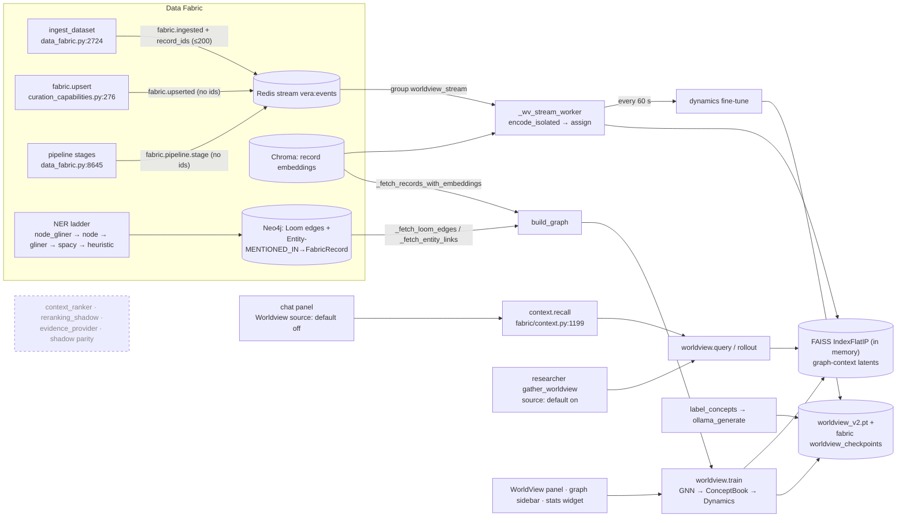

# 11 · Worldview: Graph-Native JEPA World Model

Worldview is Vera's experimental world model over the Data Fabric. It encodes
each fabric record together with its graph neighbourhood, quantises the result
into a fixed vocabulary of interpretable **concepts**, and learns how concepts
follow one another along walks through the graph. From that it answers
nearest-neighbour queries in latent space, predicts and rolls out concept
trajectories, explores counterfactual swaps, scores anomalies and reports
concept drift per dataset.

The operational model and all 38 `worldview.*` capabilities live in
`vera/worldview/worldview_jepa.py`. The rest of `vera/worldview/` holds
provenance, evidence and shadow-comparison contracts; apart from
`retrieval_provenance.py` and `legacy_snapshot_provenance.py`, those modules
are offline and are only exercised by tests. Worldview is optional: without
PyTorch, FAISS, a checkpoint or backing services, its capabilities return
"not ready" errors and Vera still starts.

**Maturity:** experimental. The model trains and serves inside the orchestrator
process. Two live consumers read it today: the researcher's `worldview` source
(enabled by default) and `context.recall` (chat uses it only when the user turns
the Worldview context source on). Its predictions, anomalies and counterfactuals
are model observations, not facts: they never overwrite the fabric, authorise
tools or establish causality. The revision-pinned ranking and evidence
contracts are **not** connected to chat or any other runtime path.

## Contents

- [1. Naming and product boundary](#1-naming-and-product-boundary)
- [2. Source map](#2-source-map)
- [3. How Worldview fits into the wider system](#3-how-worldview-fits-into-the-wider-system)
  - [3.1 Data flow](#31-data-flow)
  - [3.2 Inputs](#32-inputs)
  - [3.3 Internals at a glance](#33-internals-at-a-glance)
  - [3.4 Training objectives](#34-training-objectives)
  - [3.5 Outputs and consumers: live versus shadow](#35-outputs-and-consumers-live-versus-shadow)
  - [3.6 Where it runs](#36-where-it-runs)
  - [3.7 Health metrics and how to read them](#37-health-metrics-and-how-to-read-them)
  - [3.8 Relationship to System 1 decision models (not live)](#38-relationship-to-system-1-decision-models-not-live)
- [4. Capability reference](#4-capability-reference)
- [5. Routes, UI and events](#5-routes-ui-and-events)
- [6. Persistence](#6-persistence)
- [7. Configuration](#7-configuration)
- [8. Startup and lifecycle](#8-startup-and-lifecycle)
- [9. Known limitations](#9-known-limitations)
- [10. Projection-backed migration boundary](#10-projection-backed-migration-boundary)
- [11. Portable JEPA evidence and the reranking shadow](#11-portable-jepa-evidence-and-the-reranking-shadow)
- [12. Snapshot, parity and evidence window](#12-snapshot-parity-and-evidence-window)
- [13. Provenance-qualified retrieval](#13-provenance-qualified-retrieval)
- [14. Integration rules](#14-integration-rules)
- [15. Worked examples](#15-worked-examples)
- [16. Operational checks and troubleshooting](#16-operational-checks-and-troubleshooting)
- [Related guides](#related-guides)
- [Documentation capture](#documentation-capture)

---

## 1. Naming and product boundary

This guide describes **JEPA Worldview**, the predictive representation system in
`vera/worldview/worldview_jepa.py`. Vera also contains an older non-JEPA
Worldview product lineage: `vera/worldview/worldview.html` ("Intelligence
Platform v3") is one of its files, and its route and tab registration in
`capability_orchestration.py` are commented out, so it is not served. Godseye
is the integrated successor intended to converge with that non-JEPA experience;
it does not supersede JEPA Worldview. Keeping those lineages explicit prevents
model evidence, geospatial/visual product state and UI ownership from being
treated as interchangeable.

## 2. Source map

| File | Responsibility | Runtime status |
|---|---|---|
| `worldview_jepa.py` | Model classes, graph building, training, streaming worker, FAISS index, persistence, all `worldview.*` capabilities, panel route | **Live** |
| `retrieval_provenance.py` | `JepaRetrievalProvenance`: binds checkpoint bytes and index membership to a `DatasetSnapshot` (backs `worldview.retrieval.*`) | **Live** |
| `legacy_snapshot_provenance.py` | Copies bounded revision/hash fields from Chroma metadata during record fetch | **Live** |
| `worldview_panel.html` | WorldView panel, served at `/ui/panels/worldview-panel` inside the Data Fabric panel | **Live** (UI) |
| `context_ranker.py` | `WorldviewContextRanker` — blends a Worldview score into context items | Tests only; no ranker is registered anywhere |
| `reranking_shadow.py` | `compare_reranking_shadow` — payload-free "what would the order have been" report | Tests only |
| `evidence_provider.py` | Portable evidence envelope, `FrozenEvidenceProvider`, `JepaResultProjector` | Tests and `reranking_shadow.py` only |
| `worldview_projection_adapter.py` | Frozen graph/vector projection manifest | Tests only |
| `worldview_shadow_snapshot.py`, `worldview_shadow_parity.py`, `worldview_shadow_evidence.py` | Legacy-snapshot capture, parity report, evidence window | Tests only |
| `retrieval_adapter.py` | `JepaWorldviewRetrievalAdapter` for the offline provider comparison | Tests only |
| `worldview.html` | Non-JEPA "Intelligence Platform" page | Not served |
| `vera/vera_graph_panel_worldview.js` | WorldView sidebar for the graph component | **Live** (UI) |
| `vera/godseye/portable_dataset.py` | Portable non-JEPA Worldview/Godseye datasets | Offline boundary |

## 3. How Worldview fits into the wider system

### 3.1 Data flow



The dashed node has no runtime edges: those modules are reached only from tests.

### 3.2 Inputs

**Records and embeddings.** `_fetch_records_with_embeddings`
(`worldview_jepa.py:1674`) reads the fabric's Chroma collection
(`FABRIC_CHROMA._col.get`) with embeddings, documents and metadata. Scope is one
`dataset_id`, an explicit `node_ids` list (for example the nodes of a saved
graph), or every dataset, with `limit = min(limit, 50000)`; `worldview.train`
defaults to `max_nodes` = `WORLDVIEW_MAX_NODES` (`20000`). An unscoped fetch
has no ordering or dataset filter, so it takes whatever Chroma returns first.
Embeddings shorter than 10 values are skipped, texts are kept to 200
characters, and rows are L2-normalised in `build_graph`. The expected input
dimension is `EMBED_DIM` = `WORLDVIEW_EMBED_DIM` (`768`, matching
`nomic-embed-text`). If the data has another dimension, training rebuilds the
GNN for it (`reinitialize_for_embed_dim`), which resets the GNN weights and
clears concept assignments and transitions.

Query-time text is embedded by `_wv_embed` (`:2427`): first the fabric's own
`_embed`, then a direct Ollama call with `OLLAMA_EMBED_MODEL` (default
`nomic-embed-text`). A vector of the wrong dimension is rejected with a hint
rather than used.

**Edges.** `build_graph` (`:2221`) assembles one multi-relational graph:

| Edge type | Source | Built by |
|---|---|---|
| `SIMILAR_TO`, `SHARES_TOPIC`, `DERIVED_FROM`, `REFERENCES`, `RELATED_TO`, `CO_OCCURS` | Neo4j `(:FabricRecord)-[r]->(:FabricRecord)` between fetched records (Loom output) | `_fetch_loom_edges` (`:1790`) |
| `ENTITY_LINK` | Every pair of records mentioned by the same `(:Entity)-[:MENTIONED_IN]->(:FabricRecord)`, for entities with 2–30 mentions (both directions) | `_fetch_entity_links` (`:1812`) |
| `TEMPORAL_NEXT` | Consecutive records within a dataset ordered by `created_at` | `_build_temporal_edges` (`:1843`) |
| `RELATED_TO` (self loop) | One per record | `build_graph` |

The entity graph is written by the fabric's NER pipeline. Its backend cascade
(`_ner_backend`, `vera/fabric/fabric_web_acquisition.py:930`, controlled by
`FABRIC_NER_BACKEND=auto|gliner|spacy|node|node_gliner|heuristic`) tries the
preferred backend, then GLiNER on the compute nodes (`node_gliner`), the nodes'
OntoNotes NER (`node`), host GLiNER, host spaCy, and finally a heuristic.
Better NER therefore means denser, more meaningful `ENTITY_LINK` edges.

**Streaming encoder.** `_wv_stream_worker` (`:5376`) reads the Redis stream
`vera:events` through consumer group `worldview_stream` (created at `$`, so only
events after creation are seen), consumer `worldview-<pid>`, `count=20` per
read, blocking `STREAM_BLOCK_MS` (3000 ms). Defaults in `_STREAM_STATS`
(`:5158`):

| Setting | Default |
|---|---|
| `event_filters` | `fabric.ingested`, `fabric.upserted`, `fabric.pipeline.stage`, `fabric.dataset.created` (an event matches a filter exactly or as a `filter.` prefix) |
| `batch_size` | `64` records per encode batch (clamped 1–500 by `worldview.stream.start`); every `record_id` in an event is encoded, in batches of this size, before the event is acknowledged |
| `dynamics_interval` | `60` s between dynamics fine-tunes (minimum 10) |

For each matching event the worker calls `_stream_encode_new_records`
once per `batch_size` slice of the event's `record_ids`: it fetches those
records (or, when the event has none, up
to `min(2 × batch_size, 1000)` records of the dataset in Chroma insertion
order), skips records that already have a concept, encodes each through the GNN
**without graph edges** (`encode_isolated`), assigns the nearest concept, and
adds it to the FAISS index. Work runs in the default executor. The worker only
runs once the GNN has been trained, and starts automatically (see
[§8](#8-startup-and-lifecycle)).

Of the four filters, only `fabric.ingested` (`data_fabric.py:2724`) carries
`record_ids` (at most 200 per event). `fabric.upserted` and
`fabric.pipeline.stage` carry none, and `fabric.dataset.created` is not emitted
anywhere in the codebase (it is kept in the list; it is harmless). The
`fabric.backfill` events from `fabric.backfill_vectors` are not in the list:
their payloads carry counts only, with no record IDs or `dataset_id`.

### 3.3 Internals at a glance

| Class (line) | Shape with defaults | Role |
|---|---|---|
| `RelationalGNNLayer` (`:200`) | `edge_proj` of shape `[8, in, out]` (one projection per edge type), mean aggregation via `index_add_`, `combine = LayerNorm(2·out) → Linear(2·out→out) → GELU` | One message-passing layer; pure PyTorch, no `torch_geometric` |
| `GraphEncoder` (`:249`) | `input_mlp: 768→512 (LN, GELU)` → 2 residual relational layers (512) → `output_proj: 512→256 (LN)` | Context encoder `gnn` and its EMA copy `target_gnn` |
| `ConceptBook` (`:280`) | Codebook buffer `K × 256`, `K = 512` | EMA vector-quantised codebook: k-means++ init, optional periodic k-means re-init, dead-code revival, Gumbel-noise assignment, entropy and perplexity |
| `DynamicsTransformer` (`:524`) | Vocabulary `K + 2 = 514` (`BOS = 0`, `EOS = 1`), `d = 192`, 4 heads, 3 pre-norm layers, FF `768`, dropout `0.1`, context `32`, tied output head | Causal next-concept model; `rollout(temperature, top_k)`, `log_prob_of` |
| `JEPAPredictor` (`:600`) | `256 → 512 → 512 → 256` MLP with LayerNorm, GELU, dropout `0.1` | Predicts target-encoder latents from context latents (training only) |
| `vicreg_loss` (`:620`) | — | Variance–invariance–covariance regulariser |
| `WorldView` (`:653`) | Owns `gnn`, `target_gnn`, `predictor`, `codebook`, `dynamics`; AdamW `lr=3e-4`, `weight_decay=1e-4` for `gnn+predictor` and for `dynamics` | The model singleton `MODEL` (`:1283`) |
| `WorldViewIndex` (`:1207`) | `faiss.IndexFlatIP(256)` over L2-normalised latents (inner product = cosine) | Latent nearest-neighbour index `WV_INDEX` |

Computed from those default shapes, the trainable parameters are about 6.30 M
(GNN) + 0.53 M (predictor) + 1.44 M (dynamics) ≈ **8.3 M**, plus a frozen
6.30 M EMA target encoder and the `512 × 256` codebook buffer.

### 3.4 Training objectives

`worldview.train` runs three stages in order (defaults `gnn_epochs=20`,
`codebook_epochs=8`, `dynamics_epochs=15`), then rebuilds the index, saves and
persists the checkpoint, auto-labels concepts and starts streaming. Each
CPU-heavy step runs through `run_in_executor`.

**Stage 1 — graph encoder (`train_gnn_step`, `:780`).** One "epoch" is **one
full-batch optimiser step** over the whole graph. Per step:

1. The context encoder `gnn` encodes every node: `h`. The target encoder
   `target_gnn` (eval mode, `requires_grad=False`, inside `torch.no_grad()`)
   encodes the same graph: `h_target`.
2. Up to `min(1024, |edges|)` positive pairs are sampled from non-self edges of
   types `SIMILAR_TO`, `SHARES_TOPIC`, `DERIVED_FROM`, `REFERENCES`,
   `RELATED_TO`, `CO_OCCURS`, `ENTITY_LINK` (`TEMPORAL_NEXT` is not a positive),
   with an equal number of random negatives (`sample_pairs`, `:2298`).
3. Losses:

| Term | Definition | Weight |
|---|---|---|
| Contrastive | `relu(margin − cos(h_i, h_j) + cos(h_a, h_b))` over positive/negative pairs, `margin = 0.2` (`contrastive_margin`) | 1 |
| JEPA | `smooth_l1(predictor(h[i]), stopgrad(h_target[j]))` over positive pairs (i, j) | `jepa_weight = 1.0` |
| VICReg | `vicreg_loss(h[idx_a], stopgrad(h_target[idx_b]), sim_weight=10.0, var_weight=10.0, cov_weight=1.0)` where `idx_a`, `idx_b` are two independent random subsets of `min(128, N)` nodes. Invariance = MSE; variance = mean `relu(1 − std)` per dimension for each side; covariance = sum of squared off-diagonal covariances / `d(d−1)` for each side | `vicreg_weight = 0.5` |
| Uniformity | `−log mean exp(−2‖x−y‖²)` over the first 64 normalised latents | `uniformity_weight = 0.1` |

4. `total.backward()`, gradient-norm clipping at `1.0` over `gnn + predictor`,
   AdamW step, then the EMA update
   `target ← 0.996 · target + 0.004 · gnn` (`_update_target_encoder`, `:772`;
   the decay `0.996` is hard-coded at `:705`).

> [!NOTE]
> The JEPA predictor and EMA target only shape the GNN during Stage 1. No
> capability exposes latent prediction: `worldview.predict`, `rollout` and
> `counterfactual` all come from the `DynamicsTransformer`. Because `idx_a` and
> `idx_b` are drawn independently, the VICReg invariance term compares
> unrelated nodes rather than linked ones.

**Stage 2 — concept codebook (`train_codebook_step`, `:855`).** The GNN is
frozen and re-encodes the whole graph each epoch; the codebook learns by EMA,
not by gradient:

- Assignment uses Gumbel-perturbed distances with temperature annealed from
  `vq_temp_start = 2.0` to `vq_temp_end = 0.0` over `vq_temp_anneal_steps = 40`
  codebook steps, plus input jitter `0.05` for the first 30 steps.
- The EMA decay warms up from `0.85` to `VQ_DECAY = 0.99` over `3 × K` codebook
  forward passes (1536 with `K = 512`). The counter persists in the checkpoint;
  with 8 epochs per training run the effective decay stays close to `0.85` for
  many runs.
- Dead codes (EMA size ≤ `1e-3`) are re-seeded every step from the latents
  furthest from any live code (`revive_jitter = 0.03`). Periodic k-means
  re-initialisation is available but off (`kmeans_reinit_every = 0`).
- The reported loss is `0.25 × commitment MSE + entropy penalty`
  (`entropy_weight = 5.0`, ×3 for the first 20 steps, ×1.5 until step 50). No
  backward pass runs in this stage, so this number is a monitor, not an
  objective being optimised.

**Stage 3 — dynamics (`train_dynamics_step`, `:929`).** `generate_walks`
(`:2333`) first assigns every graph record to a concept (replacing
`record_concepts`) and then builds `min(max_walks, 4·N)` walks (`max_walks =
20000`) of up to `walk_len = 16` concepts. Each walk starts at a random record
and picks one style uniformly: `temporal` (follow `TEMPORAL_NEXT`), `entity`
(follow `ENTITY_LINK` / `CO_OCCURS`) or `random` (any out-edge); when the style
has no matching edge it uses any out-edge, and it stops at a dead end. Walks
become token sequences `[BOS, c1+2, c2+2, …]`. `transition_counts` is cleared
and refilled from these walks; it is not changed anywhere else in training,
and the stream fine-tune reads it without adding to it. Each epoch runs mini-batches of `batch_size =
128` walks (EOS-padded) through next-token cross-entropy, with gradient
clipping at `1.0`.

### 3.5 Outputs and consumers: live versus shadow

**Capabilities** ([§4](#4-capability-reference)) are the only outputs. Their
consumers:

| Consumer (file:line) | What it calls | Status |
|---|---|---|
| `vera/fabric/context.py:1199`–`1262` `_recall_worldview` | `worldview.query` (`text`, `top_k`, `dataset_id`) and, with `use_rollout`, `worldview.rollout`, whose step members are fetched from Postgres | **Live** inside `context.recall` (`context.py:1331`; its own default `sources` include `worldview`) |
| `vera/chat/chat_panel.html:13351` | Posts `/context/recall` with `sources` containing `worldview` only when the Worldview context source is selected; `use_rollout` from the Rollout checkbox (`:2368`) | **Live, opt-in.** Default chat sources are `memory, fabric, entities, urls` (`:3537`) |
| `vera/agents/agents.py:3690` | `context.recall` is in an agent tool allow-list | Live (agent may call it) |
| `vera/research/researcher_api.py:3725` `gather_worldview` | `worldview.query`; results become `Citation`s with `worldview://<dataset>/<id>` URLs | **Live, default on** (`DataSource("worldview", …, True, {"top_k": 15})`, `:434`) |
| `vera/research/researcher_api.py:7896` | Checks `worldview.query` is registered (source test) | Live (status) |
| `vera/widgets/layouts/main.json:2513`, `main-inference.json:1274` | Dashboard widget reading `worldview.stats` (`num_concepts`, `labelled_concepts`, `records_assigned`, `transitions_observed`) | Live (UI) |
| `vera/fabric/fabric_panel.html:1775` | Hosts `/ui/panels/worldview-panel`; forwards `worldview.progress` events (`:6136`, `:6157`) | Live (UI) |
| `vera/vera_graph_panel_worldview.js` | `/worldview/snapshot`, `query`, `anomalies`, `concepts`, `label_concepts`, `stats`, `train`, `loss_history`, `subviews*`; `graph.setLatentMap()` (`vera/vera_graph.js:5810`) | Live (UI) |
| `vera/vector browser/vector_browser_panel.html:1255` | `/worldview/reembed_missing` | Live (UI) |
| `vera/vector browser/vector_browser_panel.html:1191` | `POST /worldview/diagnose` (`worldview.diagnose`); the probe shows `probe_dim` | Live (UI) |
| `vera/capability_orchestration.py:8180` | A sandbox without the module reads `worldview.stats` through to production | Sandbox read-through |
| `vera/inventory/context_capability_probe_review.py:80`, `:83`; `vera/inventory/discovery_context_baseline.py:176`–`193` | Inventory metadata naming the JEPA capabilities and modules | Metadata |
| `vera/worldview/context_ranker.py` (`WorldviewContextRanker`), `reranking_shadow.py`, `evidence_provider.py`, `worldview_shadow_*.py`, `worldview_projection_adapter.py`, `retrieval_adapter.py` | — | **Not live.** `ContextRegistry.register_ranker` (`vera/context_registry.py:175`) has no caller anywhere |

No dream, planning, markets, netmon, mesh or execution code references
`worldview.*`.

> [!IMPORTANT]
> Chat context reaches Worldview only through the **unpinned**
> `worldview.query` / `worldview.rollout` path in `context.recall`, and only when
> the user selects the Worldview source. `WorldviewContextRanker` (blend weight
> `0.25`, cosine score mapped to `[0, 1]`) and `compare_reranking_shadow` are
> tested contracts awaiting a cited quality and latency evaluation; they do not
> change context selection today.

### 3.6 Where it runs

- **Process:** inside the orchestrator. The module is in the orchestrator's
  module-load list; importing it builds `MODEL` and `WV_INDEX`, connects FAISS
  and loads the local checkpoint. Development sandboxes skip the
  `worldview_startup_load` job.
- **Device:** `cuda` when `torch.cuda.is_available()`, otherwise `cpu`
  (`:663`). Graph tensors are built on CPU and moved to the device per step.
- **Threads:** before NumPy/Torch import, `OPENBLAS_NUM_THREADS`,
  `MKL_NUM_THREADS` and `OMP_NUM_THREADS` default to `2` (`:90`); then
  `torch.set_num_threads(2)` and `torch.set_num_interop_threads(1)` (`:121`).
  Training steps, index rebuilds, stream encoding and stream fine-tuning run in
  the event loop's default thread-pool executor so they do not block the loop.
- **Continuous work:** the stream worker fine-tunes the dynamics model every
  `dynamics_interval` seconds (when new concepts were touched) and saves the
  local checkpoint afterwards.

### 3.7 Health metrics and how to read them

`worldview.stats` (`GET /worldview/stats`) returns `{model, index, embed_model,
has_faiss, has_numpy, has_torch}`. The `model` block (`WorldView.stats`,
`:1180`):

| Field | Exact meaning |
|---|---|
| `ready`, `has_torch`, `device` | Model constructed; PyTorch present; device string |
| `embed_dim`, `latent_dim`, `num_concepts` | Input dimension (may differ from 768 after a rebuild), latent dimension, K |
| `train_steps.gnn` | Cumulative Stage-1 optimiser steps — **one per GNN epoch** (20 per default `worldview.train`) |
| `train_steps.codebook` | Cumulative Stage-2 EMA passes — one per codebook epoch (8 per default run); no gradient steps |
| `train_steps.dynamics` | Cumulative Stage-3 optimiser steps — one per mini-batch of walks per epoch, **plus up to 3 per stream fine-tune** |
| `train_loss.*` | Exponential moving average (`0.95·old + 0.05·new`) of per-step loss, not the last epoch's loss; per-epoch values are in `worldview.loss_history` |
| `records_assigned` | `len(record_concepts)`: records of the last training graph plus records added by the stream. Replaced, not accumulated, by each training run |
| `labelled_concepts` | Concepts with an LLM label. All labels are cleared when a training run completes at least one codebook step; the post-train auto-label repopulates up to `auto_label_k` (50) |
| `transitions_observed` | Number of **distinct** `(from, to)` concept pairs in `transition_counts` (upper bound K² = 262,144), not a count of transitions |
| `last_fabric_persist`, `last_fabric_load` | Timestamps (or `local`) |
| `active_subview`, `active_subview_datasets` | Active sub-worldview |
| `codebook.active_concepts` / `dead_concepts` | Codes whose EMA cluster size is above / at or below `1e-3` |
| `codebook.entropy`, `perplexity`, `max_entropy` | Entropy of EMA cluster sizes, `exp(entropy)` (ideal close to K), `ln K` |
| `codebook.max_population`, `min_population` | Largest / smallest EMA cluster size |

`index` is `{available, vectors, dim}` for the FAISS index.
`worldview.stream.status` adds `enabled`, `task_alive`, `started_at`,
`events_seen`, `records_encoded`, `records_indexed`, `dynamics_updates`,
`errors`, `last_event_at`, `last_error` and the stream settings.

How to read them honestly:

- **Records per concept** = `records_assigned / codebook.active_concepts`. With
  `K = 512`, a few thousand records gives single-digit records per concept: the
  concepts are then closer to small clusters than to stable topics, and labels
  generated from up to 8 member texts are fragile.
- **Codebook usage.** `perplexity / K` is the fraction of the vocabulary in
  effective use. The EMA sizes come from training passes only — streaming
  assignment does not update them — so codebook statistics describe the last
  training graph, not the current population.
- **Step-to-transition ratio** = `train_steps.dynamics / transitions_observed`.
  `transition_counts` comes only from synthetic walks over the sampled graph
  (stream fine-tunes sample from it but do not add to it). A high ratio therefore means the dynamics model has seen the same small set
  of pairs many times, not that it has learned many observed transitions.
- **Index versus assignments.** `index.vectors` should track
  `records_assigned`. After a restart the index is rebuilt from at most 20,000
  cached latents, so a larger assignment set will not be fully searchable until
  `worldview.rebuild_index` runs.
- **Embedding parity.** `embed_model` must be the model that filled Chroma;
  otherwise queries fail with a dimension-mismatch error.

There is no held-out metric (next-concept accuracy, recall@k) and no health
verdict; the counters above are raw.

> **Illustrative reading.** Suppose `records_assigned = 2,000`,
> `active_concepts = 450`, `transitions_observed = 700`,
> `train_steps.dynamics = 28,000`. That is about 4.4 records per concept and
> about 40 dynamics steps per distinct transition: the model is far larger than
> its evidence (≈ 4,000 trainable parameters per record) and its predictions
> should be treated as weak signals.

### 3.8 Relationship to System 1 decision models (not live)

> [!WARNING]
> **Not live — design only.**

A planned tier of small decision models ("System 1": typed choose-one-of-N,
yes/no and score decisions) could take Worldview state — a record's concept and
label, its anomaly score, a short rollout trajectory or a drift ratio — as
compact input features. Nothing in the code does this today; concept IDs also
change on every retrain, which such a consumer would have to account for. See
[System 1 decision models](./48-system-one-decision-models.md) and
[Worldview integration survey](./49-worldview-integration.md) (Not live —
survey of integration opportunities).

## 4. Capability reference

All 38 capabilities are registered in `worldview_jepa.py`.

| Capability | Route | Key inputs (defaults) | Purpose / notes |
|---|---|---|---|
| `worldview.train` | `POST /worldview/train` | `dataset_id`, `gnn_epochs` 20, `codebook_epochs` 8, `dynamics_epochs` 15, `limit` (0 → `max_nodes`), `embed_missing` false, `node_ids` | Full training → index → save + fabric persist → auto-label (`auto_label_k` 50) → start stream |
| `worldview.train_stage` | `POST /worldview/train_stage` | `stage` (`gnn`\|`codebook`\|`dynamics`), `epochs` 5, `dataset_id` | Calls `worldview.train` with only that stage's epochs |
| `worldview.rebuild_index` | `POST /worldview/rebuild_index` | `dataset_id`, `limit` | Re-encode with graph context and rebuild FAISS without training |
| `worldview.reembed_missing` | `POST /worldview/reembed_missing` | `dataset_id`, `limit` 5000, `gpu_batch_size` 32, `cpu_batch_size` 8, `dry_run`, `force` | Embed SQLite records missing from Chroma and upsert them; `force` resets Chroma on a dimension mismatch |
| `worldview.encode` | `POST /worldview/encode` | `text` \| `record_id` \| `embedding` | Latent + concept; a known `record_id` returns its stored concept, otherwise the vector is encoded without edges |
| `worldview.predict` | `POST /worldview/predict` | `record_id` \| `concept` \| `text`, `top_k` 8 | Next-concept distribution from prefix `[BOS, c]` |
| `worldview.rollout` | `POST /worldview/rollout` | start as above, `steps` 8, `temperature` 0.8, `top_k` 20 | Sampled trajectory; each step lists up to 3 member records of that concept (first assigned, not query-specific) |
| `worldview.counterfactual` | `POST /worldview/counterfactual` | `start_concept`, `swap_at` 1 (0-based generated step to replace; must be `< steps`), `swap_to`, `steps` 8, `temperature` 0.6, `seed` (optional) | Both timelines share the baseline's steps before `swap_at`; after it the baseline's sampled step and `swap_to` are each continued with the same seed. Returns `baseline`, `counterfactual`, `divergence_step` and the `seed` used (random when omitted) |
| `worldview.query` | `POST /worldview/query` | `text`, `top_k` 10, `dataset_id` | Latent nearest neighbours; `dataset_id` filters after the top-k search |
| `worldview.retrieval.bind` | `POST /worldview/retrieval/bind` | `snapshot_json`, `records_json`, `provider_revision`, `training_run_id` | Bind checkpoint + complete index to a `DatasetSnapshot` ([§13](#13-provenance-qualified-retrieval)) |
| `worldview.retrieval.status` | `GET /worldview/retrieval/status` | — | Re-verify the binding |
| `worldview.retrieval.query` | `POST /worldview/retrieval/query` | `text`, `top_k` 10, `snapshot_id` | Pinned, revision-qualified retrieval |
| `worldview.anomalies` | `POST /worldview/anomalies` | `dataset_id`, `top_k` 20 | `0.6 × normalised squared distance to the assigned code + 0.4 × max(0, −log p(prev → this))/8` over the last training graph |
| `worldview.snapshot` | `GET /worldview/snapshot` | `method` `pca` (or `umap` if installed), `limit` 500 | 2D projection of index vectors (falls back to cached latents) |
| `worldview.concepts` | `GET /worldview/concepts` | — | Concepts with populations and labels |
| `worldview.concept_neighbors` | `GET /worldview/concept_neighbors` | `concept`, `top_k` 8 | `observed` (from `transition_counts`) and `predicted` (dynamics) next concepts |
| `worldview.concept_members` | `GET /worldview/concept_members` | `concept`, `limit` 50 | Assigned records |
| `worldview.concept_detail` | `GET /worldview/concept_detail` | `concept`, `member_limit` 20 | Label, members, transitions, predictions, stats |
| `worldview.explain_record` | `GET /worldview/explain_record` | `record_id` | Concept, neighbours and trajectory for one record |
| `worldview.label_concepts` | `POST /worldview/label_concepts` | `concepts`, `max_concepts` 20, `batch_size` 5 | LLM labels (2–5 words) from up to 8 member texts each |
| `worldview.landscape` | `GET /worldview/landscape` | `top_k` 25, `dataset_id` | Top concepts with samples and predicted partners, for agents |
| `worldview.detect_drift` | `POST /worldview/detect_drift` | `dataset_id` (required) | Concepts whose dataset share / global share is `> 2.0` or `< 0.3` |
| `worldview.summarise` | `POST /worldview/summarise` | `dataset_id` | Readiness, steps, losses, totals, stream stats, top concepts, dataset breakdown. No anomaly scoring; use `worldview.anomalies` |
| `worldview.loss_history` | `GET /worldview/loss_history` | — | Persisted per-epoch losses for all three stages |
| `worldview.stats` | `GET /worldview/stats` | — | See [§3.7](#37-health-metrics-and-how-to-read-them) |
| `worldview.diagnose` | `POST /worldview/diagnose` | `dataset_id`, `probe` true | Read-only: Chroma/SQLite counts, datasets, sample embedding dim and a hint (the same report as a failed train); with `probe`, embeds one probe string with the current embed model and returns `probe_dim` |
| `worldview.config` | `GET /worldview/config` | — | Runtime config ([§7](#7-configuration)) |
| `worldview.config_set` | `POST /worldview/config` | any config key | Update runtime training config; `lr` applies immediately. Architecture keys are not stored: they come back in `rejected` with a `warning` |
| `worldview.stream.start` | `POST /worldview/stream/start` | `event_filters`, `dynamics_interval` 60, `batch_size` 64 | Start the streaming worker (requires a trained GNN) |
| `worldview.stream.stop` | `POST /worldview/stream/stop` | — | Stop it and save the local checkpoint |
| `worldview.stream.status` | `GET /worldview/stream/status` | — | Worker state and counters |
| `worldview.persist` | `POST /worldview/persist` | — | Save locally and write the checkpoint to the fabric |
| `worldview.load_from_fabric` | `POST /worldview/load_from_fabric` | `rebuild_index` true | Restore the checkpoint from the fabric |
| `worldview.subview.list` | `GET /worldview/subviews` | — | Saved sub-worldviews |
| `worldview.subview.create` | `POST /worldview/subviews/create` | `name`, `datasets`, `node_ids`, `graph` | Named model scoped to datasets or a node set |
| `worldview.subview.activate` | `POST /worldview/subviews/activate` | `name` (`""` = global) | Swap the global `MODEL` to that checkpoint |
| `worldview.subview.save` | `POST /worldview/subviews/save` | — | Save current state as the active sub-worldview |
| `worldview.subview.delete` | `POST /worldview/subviews/delete` | `name` | Delete name and checkpoint |

## 5. Routes, UI and events

- **Panel route:** `GET /ui/panels/worldview-panel` serves
  `worldview_panel.html`. `register_ui("worldview", "WorldView", "◈", …,
  mode="inject", tab_order=55)` lists the UI capabilities; the Data Fabric panel
  hosts the iframe rather than a standalone tab.
- **Graph sidebar:** `/ui/vera-graph-panel-worldview.js` adds a WorldView tab to
  every graph ([Galaxy Graph §9](./09-galaxy-graph.md#9-sidebar-panels)): sub-worldview
  selection, training with stage counters, the latent map via `setLatentMap`,
  concept injection ("connected" or "zone"), anomalies and loss history.
- **Events:** every progress message is emitted as
  `{"type": "worldview.progress", "stage": …}` (`_emit`, `:2420`). Stages
  include `building_graph`, `resolving_graph`, `resolve_done`,
  `resolve_fallback`, `graph_ready`, `dim_mismatch`, `train_plan`,
  `stage_gnn`, `gnn_epoch`, `gnn_error`, `stage_codebook`, `codebook_epoch`
  (with `active`, `entropy`, `perplexity`, `revived`), `codebook_error`,
  `stage_dynamics`, `dynamics_walks`, `dynamics_epoch`, `dynamics_error`,
  `indexing`, `indexing_error`, `done`, `auto_label`, `auto_label_done`,
  `labelling`, `labelled`, `label_done`, `label_error`, `stream_autostart`,
  `stream_attached`, `stream_encoded`, `stream_dynamics`, `stream_stopped`,
  `config_updated`, `embed_missing`, `embed_missing_done`, `reembed_scan`,
  `reembed_found`, `reembed_progress`, `reembed_done`, `chroma_reset`,
  `probe_ok`, `rebuilding_index`, `rebuild_done`. Only UI code consumes them.

## 6. Persistence

| Store | Location / key | Contents |
|---|---|---|
| Local checkpoint | `WORLDVIEW_CHECKPOINT_DIR/worldview_v2.pt` (default `~/.vera/worldview/worldview_v2.pt`) | `gnn`, `target_gnn`, `predictor`, `codebook`, `dynamics`, both optimiser states, `train_steps`, `train_loss`, `concept_labels`, `record_concepts`, `record_meta`, `transition_counts`, model `config`, and up to 20,000 cached latents with record IDs |
| Fabric checkpoint | Table `worldview_checkpoints(key, blob, meta, updated_at)` in the fabric SQLite database and, when available, Postgres; key `WORLDVIEW_BLOB_KEY` (default `worldview_v2`) | Same blob; `meta` holds steps, K, embed dim, record count, save time and, when verified, `retrieval_provenance` |
| Loss history | Same SQLite table, key `worldview_v2_loss` | Per-epoch losses (last 2,000 per stage) |
| Sub-worldviews | Table `worldview_subviews(name, datasets, meta, updated_at)`; checkpoints under key `worldview_sub_<name>` | Scoped models |
| FAISS index | In memory only | Rebuilt from cached latents at startup or by `worldview.rebuild_index` |

Training, labelling and `worldview.persist` write both the local file and the
fabric copy. The stream worker saves only the local file.

## 7. Configuration

Environment variables (read at import, `worldview_jepa.py:162`–`181`, `:1376`,
`:1591`):

| Variable | Default | Variable | Default |
|---|---|---|---|
| `WORLDVIEW_EMBED_DIM` | `768` | `WORLDVIEW_DYN_HEADS` | `4` |
| `WORLDVIEW_LATENT_DIM` | `256` | `WORLDVIEW_DYN_LAYERS` | `3` |
| `WORLDVIEW_HIDDEN_DIM` | `512` | `WORLDVIEW_DYN_CTX` | `32` |
| `WORLDVIEW_GNN_LAYERS` | `2` | `WORLDVIEW_LR` | `3e-4` |
| `WORLDVIEW_NUM_CONCEPTS` | `512` | `WORLDVIEW_BATCH_SIZE` | `128` |
| `WORLDVIEW_VQ_DECAY` | `0.99` | `WORLDVIEW_MAX_NODES` | `20000` |
| `WORLDVIEW_VQ_COMMIT` | `0.25` | `WORLDVIEW_MAX_WALKS` | `20000` |
| `WORLDVIEW_DYN_DIM` | `192` | `WORLDVIEW_WALK_LEN` | `16` |
| `WORLDVIEW_CHECKPOINT_DIR` | `~/.vera/worldview` | `WORLDVIEW_BLOB_KEY` | `worldview_v2` |
| `WORLDVIEW_STREAM_AUTOSTART` | `1` | `OLLAMA_EMBED_MODEL` | `nomic-embed-text` (fallback embed model) |

Runtime config (`worldview.config` / `worldview.config_set`, `_WV_CONFIG` at
`:5010`) holds the values above plus `contrastive_margin` 0.2,
`uniformity_weight` 0.1, `revive_dead` true, `revive_threshold` 1e-3,
`revive_jitter` 0.03, `entropy_weight` 5.0, `vq_jitter` 0.05, `vq_temp_start`
2.0, `vq_temp_end` 0.0, `vq_temp_anneal_steps` 40, `kmeans_reinit_every` 0,
`jepa_weight` 1.0, `vicreg_weight` 0.5, `target_ema_decay` 0.996,
`auto_label` true, `auto_label_k` 50.

> [!WARNING]
> Only the training-loop keys take effect at runtime (`lr`, `batch_size`,
> `max_nodes`, `max_walks`, `walk_len`, the loss weights, VQ temperature,
> jitter, revival, k-means and auto-label keys). The architecture keys
> (`latent_dim`, `hidden_dim`, `num_gnn_layers`, `num_concepts`, `vq_decay`,
> `vq_commitment`, `dyn_dim`, `dyn_heads`, `dyn_layers`, `dyn_ctx`) and
> `target_ema_decay` are never read: the model is built once at import from
> the environment, and the EMA decay is fixed at `0.996`. `worldview.config_set`
> therefore refuses them: they are not written to `_WV_CONFIG`, and the
> response lists them under `rejected` (with the env var to set) plus a
> `warning`. Runtime
> config is not persisted. Changing the architecture needs environment
> variables, a restart and a retrain, and a checkpoint with a different K is
> refused at load.

## 8. Startup and lifecycle

1. Import builds `MODEL` and `WV_INDEX`, connects FAISS and loads the local
   checkpoint (`:1283`).
2. `schedule(_worldview_startup_load, 900, name="worldview_startup_load")`
   (`:5957`) runs once (guarded by `_wv_startup_done`). If the local checkpoint
   has GNN steps it restores loss history, the FAISS index from cached latents
   and retrieval provenance; otherwise it loads the fabric checkpoint (Postgres
   first, then SQLite) and does the same.
3. If `WORLDVIEW_STREAM_AUTOSTART=1` and the GNN is trained, the stream worker
   starts. `worldview.train` also starts it after a successful run.
4. Retraining replaces `record_concepts` and `transition_counts` with the new
   graph's. Labels are kept unless the run trained the codebook, in which case
   they are cleared and the post-train auto-label relabels up to 50 concepts.

## 9. Known limitations

Current behaviour that affects anyone consuming Worldview output:

- **Train/serve skew.** Index latents are computed with graph context
  (`encode_subgraph`), but queries, `encode`, `predict`/`rollout` on text, and
  streamed records are encoded without edges (`encode_isolated`, `:3812`,
  `:3850`, `:3909`, `:4020`, `:5263`).
- **First-order prediction.** `predict` and `landscape` condition only on
  `[BOS, c]`, so they behave like a transition table, not a history-aware model.
- **Synthetic transitions.** Transitions come from random graph walks, not
  observed record-to-record events (see
  [§3.7](#37-health-metrics-and-how-to-read-them)).
- **Streaming gaps.** Events without
  IDs re-read the start of the dataset in insertion order and usually find
  nothing new; changed content of an already-assigned record is never
  re-encoded; `fabric.dataset.created` is never emitted; and events emitted
  before the group exists or trimmed from the stream are not seen.
- **Anomalies** cover only the last training graph (cached in memory; rebuilt
  from Chroma and Neo4j after a restart). Streamed records are never scored.
- **Rollout members** are the first records assigned to each concept, not the
  ones nearest the query.
- **Drift** is a ratio test with fixed thresholds and no significance test or
  time window.
- **Labels after codebook retraining.** Labels are cleared when a run trains
  the codebook; until auto-label (or `worldview.label_concepts`) runs, concepts
  are unlabelled, and auto-label covers at most `auto_label_k` (50) concepts.
- **Corpus.** There is no Worldview-specific include/exclude list; an unscoped
  train uses whatever Chroma returns, including self-generated datasets.
- **Retrieval binding versus streaming.** Any stream encode or dynamics update
  changes the checkpoint bytes, so a `worldview.retrieval.*` binding becomes
  unavailable while streaming runs.
- **Errors are quiet.** `context.recall` and the researcher log Worldview
  failures at debug level and return no results.

> [!NOTE]
> Fixed (no longer limitations): the stream worker now encodes every
> `record_id` of an event before acknowledging it; training no longer adds
> Chroma-return-order adjacency to `transition_counts`, and stream fine-tunes
> no longer feed their sampled walks back into it; codebook retraining clears
> concept labels; `worldview.counterfactual` shares the baseline prefix, takes
> a `seed` and continues both timelines with the same seed, and no longer
> repeats `swap_to` in its prefix; `worldview.config_set` rejects
> architecture keys with a warning; `worldview.summarise` no longer claims to
> return anomalies; `/worldview/diagnose` exists.

## 10. Projection-backed migration boundary

The projection path creates an offline seam between Fabric projections and
JEPA training. A frozen manifest (`worldview_projection_adapter.py`,
`vera.worldview-projection-manifest/v1`) pins graph/vector specification IDs and
generations, the embedding package/dimension/preprocessing/metric, exact active
record/revision pairs, tombstone count, and hashes of both snapshots.

Graph and vector inputs must agree on coverage, revision, content hash and
tombstone state. Duplicates, forged identities, drift, mixed dimensions,
cancellation, malformed edges and oversized snapshots fail closed. The manifest
contains no source content, embeddings, graph payload or result.

This path is not wired into `worldview.train`: it performs no backend read or
model work. The existing loader/trainer remains authoritative until live shadow
evidence supports a deliberate migration.

## 11. Portable JEPA evidence and the reranking shadow

`vera.worldview.evidence_provider` (`vera.worldview-evidence/v1`) defines an
offline contract for six signal kinds: `concept`, `prediction`, `anomaly`,
`counterfactual`, `drift` and `reranking`. Every evidence envelope binds an
exact immutable `DatasetSnapshot`, a compatible JEPA Worldview `ModelPackage`
checkpoint, a provider revision, a zoned observation time and cited record
revisions. Its identity (`wve_<sha256>`) changes when any authority input or
observation changes. Limits: 1,000 observations, 64 citations per observation,
32 attributes (16 KiB).

The contract carries bounded scores and non-payload attributes. It rejects raw
text, prompts, vectors, embeddings, payloads, credential-like fields
(`body`, `content`, `credential`, `embedding`, `password`, `payload`, `prompt`,
`secret`, `text`, `token`, `vector`), non-finite scores, duplicate observation
identities, uncited observations, incompatible checkpoints and evidence
predating its input snapshot. Counterfactuals and predictions remain derived
evidence — not causal facts or execution authority.

`FrozenEvidenceProvider` is a deterministic reference store. It can filter
exact evidence identities but cannot load Torch, inspect the fabric, generate a
signal, rank context, fall back to a stale revision or activate a checkpoint.
`evidence_availability()` requires exact snapshot and ModelPackage matches
before evidence is usable; missing evidence is `unavailable` and mismatched
evidence is `stale`.

`JepaResultProjector` is the pure compatibility seam for current result shapes.
It accepts already-produced concept lists, next-concept/rollout predictions,
anomalies, counterfactual paths, drift reports or latent-query rankings. The
caller must supply the authoritative record-to-revision mapping and support
records, because the operational responses do not carry revision evidence;
missing citations fail closed. It copies only identifiers, bounded labels,
ranks, scores, concept numbers and aggregate drift/counterfactual fields, and it
never calls a capability, loads a checkpoint, queries the fabric, runs
inference, alters ordering or attaches evidence to a consumer.

**Reranking shadow** (`reranking_shadow.py`,
`vera.worldview-reranking-shadow/v1`). `compare_reranking_shadow(items,
evidence, expected_snapshot_id, expected_model_package_id, weight=0.25)` accepts
up to 1,000 `ContextItem`s and one reranking envelope whose snapshot and package
identities match exactly. Every observation must cite exactly one candidate at
its exact source-record revision; unknown, ambiguous, duplicated or mismatched
identities fail closed, and stale or unavailable evidence yields
`status: "ineligible"`. The report (`mode: "shadow"`, `authoritative: false`,
`changes_context_selection: false`) lists baseline and hypothetical ranks,
`matched_candidates`, `changed_positions` and `would_change_order`, where the
hypothetical score is `(1 − weight) · score + weight · evidence_score`. It never
mutates candidates, registers a ranker or invokes the model.

**Context ranker** (`context_ranker.py`). `WorldviewContextRanker(results,
model_revision, weight=0.25)` maps `worldview.query` cosine scores in `[−1, 1]`
to `[0, 1]`, blends them into matching `ContextItem` scores the same way, and
records `ContextRankingEvidence("worldview", revision, score, weight)`; at most
1,000 results. It is tested but not registered with the context registry.

## 12. Snapshot, parity and evidence window

The live record fetch keeps backend-supplied revision/hash evidence
(`legacy_snapshot_provenance`); missing or malformed provenance stays visibly
incomplete rather than being inferred. `worldview_shadow_snapshot` copies only
record identity, vectors, revision/hash evidence and edge tuples (limits 50,000
records, 250,000 edges); source text and unrelated metadata are discarded.
Shape, duplicate, endpoint, size and cancellation checks fail closed.

`compare_legacy_worldview_snapshot` (`worldview_shadow_parity.py`,
`vera.worldview-shadow-parity/v1`) compares a legacy snapshot with a manifest
and reports expected/observed/matched counts and bounded ID lists for missing,
unexpected, invalid-embedding, missing-revision-evidence and drifted-revision
records, plus edge and dangling-edge counts, relation types and a snapshot
checksum — never source or vector payloads. `ready_for_shadow_comparison` is
true only when all of those lists are empty and no edge dangles.
`WorldviewShadowEvidenceWindow` keeps a bounded in-memory window (default 100,
maximum 1,000 samples) and reports ready samples, consecutive ready samples and
per-failure counts. Persistence and automatic live collection are not
implemented.

## 13. Provenance-qualified retrieval

The historical `worldview.query` remains the general interactive latent search.
Its result IDs alone are not enough for a provider comparison: an index can
outlive or drift from the checkpoint, and it does not identify canonical record
revisions.

`worldview.retrieval.bind` establishes the stricter boundary. It accepts a
complete record manifest that must reproduce one immutable `DatasetSnapshot`
(`vera.jepa-retrieval-provenance/v1`, at most 20,000 records); every record must
carry a unique `record_id` and `revision_id`, and the manifest membership must
exactly equal the active index. Vera serialises the active checkpoint,
content-identifies it as a `ModelPackage`, and persists the checkpoint and the
binding together. Partial indexes, changed records, duplicate identities and
legacy checkpoints without a binding fail closed.

`worldview.retrieval.status` rechecks the current checkpoint bytes and complete
index membership against the binding. `worldview.retrieval.query` runs only
while that check succeeds and requires the requested snapshot ID. Its response
contains a query digest, revision-qualified citations and the exact
snapshot/package/provider receipt; it omits query text and member text. A model
update, streaming index change, checkpoint swap or snapshot mismatch makes the
path unavailable until a new binding is created.

`JepaWorldviewRetrievalAdapter` verifies the live receipt again before handing
citations to the provider-neutral comparison executor
(`vera/fabric/retrieval_comparison.py`, provider kind
`jepa_worldview_evidence`). It reports unavailable or failed evidence on
identity drift and cannot choose a winner or activate JEPA. Offline comparisons
measure JEPA against other providers on identical snapshot and citation
fixtures and report quality, latency, failures, storage and lifecycle costs
separately.

## 14. Integration rules

Worldview can inform resolver, workflow, memory and remote-agent features only
through provenance-pinned projections:

- capability descriptions and Agent Cards are untrusted metadata, not facts;
- resolver/policy outcomes may become observations, never declarations;
- Run events need stable identity, redaction and retention before projection;
- fabric revisions outrank derived graph/vector indexes; and
- parity readiness is evidence for review, not automatic migration approval.

This prevents prompts and tool telemetry becoming an uncontrolled training
feedback loop. (The current trainer does not enforce it: see the corpus
limitation in [§9](#9-known-limitations).)

The lineages can exchange data through the same controlled boundary. Non-JEPA
Worldview and Godseye datasets may be normalised into canonical fabric records,
explicit record revisions and an immutable `DatasetSnapshot`, which JEPA
Worldview may consume as training or retrieval evidence while keeping its own
model-package provenance. `vera.godseye.portable_dataset` implements that
offline boundary for normalised CCTV, imagery and building records: it sorts
records by stable ID, binds each to the caller-supplied source revision and
emits an immutable `DatasetSnapshot` and a content-addressed artifact identity.
Duplicate IDs, invalid coordinates, malformed geometry, ambiguous revisions and
oversized collections fail closed. It performs no fetch, database read, UI
inspection or inference, and its provenance states that it is not JEPA
authority.

The `worldview.query` and `worldview.rollout` lookups used by context recall
refer specifically to JEPA Worldview. Their names do not make non-JEPA
Worldview or Godseye implementations of JEPA, and those lineages must not be
substituted behind the names.

## 15. Worked examples

Train on one dataset and watch progress (`worldview.progress` events):

```bash
curl -s -X POST http://localhost:8999/worldview/train \
  -H 'Content-Type: application/json' \
  -d '{"dataset_id":"research.findings","gnn_epochs":20,"codebook_epochs":8,"dynamics_epochs":15}'
```

Read health:

```bash
curl -s http://localhost:8999/worldview/stats | jq '.model | {records_assigned, transitions_observed, train_steps, codebook}'
curl -s http://localhost:8999/worldview/stream/status
```

Query and roll out:

```bash
curl -s -X POST http://localhost:8999/worldview/query \
  -H 'Content-Type: application/json' -d '{"text":"GPU scheduling","top_k":10}'
curl -s -X POST http://localhost:8999/worldview/rollout \
  -H 'Content-Type: application/json' -d '{"text":"GPU scheduling","steps":6}'
```

Drift for one dataset:

```bash
curl -s -X POST http://localhost:8999/worldview/detect_drift \
  -H 'Content-Type: application/json' -d '{"dataset_id":"research.findings"}'
```

## 16. Operational checks and troubleshooting

Before training, check optional dependencies and device (`worldview.stats`
`has_torch`, `has_faiss`, `device`), that the scope has records with embeddings
in Chroma (`worldview.reembed_missing` with `dry_run`), the embedding model and
dimension, and the checkpoint and index state. Never coerce malformed vectors,
invent provenance or drop dangling edges merely to obtain a green report.

| Symptom | Cause / fix |
|---|---|
| "PyTorch not available" / "WorldView not ready" | Install `torch`; check `has_torch` |
| "WorldView not ready — train the model first, then rebuild the index" | FAISS index empty: train or run `worldview.rebuild_index` |
| "No records with embeddings found" | Records lack Chroma vectors: run `worldview.reembed_missing` or `fabric.backfill_vectors` |
| "Embedding dim mismatch" | `OLLAMA_EMBED_MODEL` differs from the model that filled Chroma |
| Stream will not start | GNN untrained (`train_steps.gnn == 0`) |
| New records never appear | They arrived via an event without `record_ids` (for example `fabric.upserted` or a vector backfill); run `worldview.rebuild_index` |
| `config_set` returns `rejected` / `warning` | Architecture keys cannot change at runtime; set the named env var, restart and retrain |
| Retrieval binding unavailable | Streaming changed the checkpoint; stop the stream and bind again |
| Vector browser "probe" shows no dimension | `worldview.diagnose` could not embed with the configured model; the message shows `probe_error` |

## Related guides

[Data Fabric](./06-data-fabric.md) · [Memory graph](./05-memory-graph.md) ·
[Research](./07-research.md) · [Galaxy Graph](./09-galaxy-graph.md) ·
[Machine learning](./16-machine-learning.md) · [ONNX](./30-onnx.md) ·
[Interoperability foundations](./46-interoperability-foundations.md) ·
[System 1 decision models](./48-system-one-decision-models.md) ·
[Worldview integration survey](./49-worldview-integration.md) (Not live —
survey of integration opportunities)

## Documentation capture

The documentation recipe targets the dedicated **JEPA Worldview** panel, not
the separate Worldview Intelligence Platform or Godseye interfaces. It waits
for the latent-map canvas, initialized view description, and a positive
rendered-item count. If the optional JEPA runtime, model, or capability family
is unavailable, capture fails explicitly instead of publishing its empty shell.

<!-- VERA:AUTO:screenshots START -->
_No populated JEPA Worldview screenshot is currently available._
<!-- VERA:AUTO:screenshots END -->

<!-- VERA:AUTO:capabilities START -->
_No capabilities resolved for this domain._
<!-- VERA:AUTO:capabilities END -->
