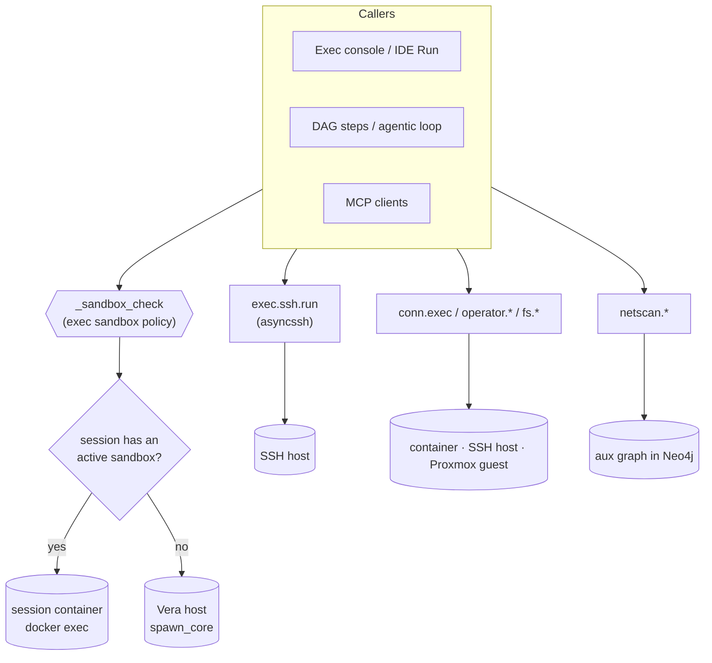

# 12 · Execution & Network Mapping

This page covers how Vera — and an agent driving it — actually *touches* hosts and networks: local shell and code execution behind one sandbox policy, SSH, file-native text operations, the remote-access layer (saved connections, interactive terminals, operator verbs, remote file systems and workspaces), and network discovery into an auxiliary topology graph. It also documents the runtime-neutral execution foundation (Runs, Workflow IR, shared schedule and trigger evidence) that lets native engines be observed and, later, moved behind portable adapters.

Source: [`vera/execution/exec_capabilities.py`](../vera/execution/exec_capabilities.py) (`exec.*`, `netscan.*`, `netmap.*`, the Exec and Network panels), [`vera/execution/ssh_cleanup_capabilities.py`](../vera/execution/ssh_cleanup_capabilities.py), [`vera/text/text_ops_capabilities.py`](../vera/text/text_ops_capabilities.py) (`text.*`), the [`vera/remote/`](../vera/remote/) package (`conn.*`, `operator.*`, `fs.*`, `workspace.*`, `app.*`, `mcp.detect`), and the contract modules in [`vera/execution/`](../vera/execution/) (`run_protocol`, `workflow_ir`, `workflow_schedule*`, `workflow_trigger*`, …). Docker containers, per-session sandboxes, Portainer and Prometheus live on [13 · Docker](./13-docker.md).

**Status:** `exec.*`, `netscan.*`, `text.*` and the remote-access layer are in production use by the UI, DAGs and the agentic loop. The execution-foundation contracts are non-executing: native engines (DAG runner, Dream, Calendar, Research) remain the authorities, and the shared contracts project their definitions and decisions as evidence.

> [!WARNING]
> This subsystem is dual-use by design: it runs commands and scans networks. Keep the sandbox enabled on any host you do not fully trust, and use the network caps only on your own infrastructure or in authorised assessments.

## Contents

- [1. Execution surfaces at a glance](#1-execution-surfaces-at-a-glance)
- [2. Source map](#2-source-map)
- [3. The exec sandbox](#3-the-exec-sandbox)
  - [Policy fields and defaults](#policy-fields-and-defaults)
  - [How a command is checked](#how-a-command-is-checked)
  - [Artifact directories](#artifact-directories)
- [4. Shell and code execution](#4-shell-and-code-execution)
  - [Where a command runs: host or session sandbox](#where-a-command-runs-host-or-session-sandbox)
  - [Streaming endpoints](#streaming-endpoints)
  - [Self-correcting runs](#self-correcting-runs)
- [5. SSH host registry](#5-ssh-host-registry)
- [6. File-native text operations](#6-file-native-text-operations)
- [7. Remote access](#7-remote-access)
  - [Connections](#connections)
  - [Interactive terminals](#interactive-terminals)
  - [Operator verbs](#operator-verbs)
  - [Remote file system, workspaces, apps and MCP](#remote-file-system-workspaces-apps-and-mcp)
  - [Session sandboxes](#session-sandboxes)
- [8. Network discovery](#8-network-discovery)
  - [Infrastructure scans and imports](#infrastructure-scans-and-imports)
  - [Target probing](#target-probing)
  - [Recon, enrichment and boundaries](#recon-enrichment-and-boundaries)
  - [OSINT](#osint)
- [9. Maps](#9-maps)
- [10. The auxiliary graph](#10-the-auxiliary-graph)
- [11. UI panels](#11-ui-panels)
- [12. Configuration](#12-configuration)
- [13. Events and storage](#13-events-and-storage)
- [14. Runtime-neutral execution foundation](#14-runtime-neutral-execution-foundation)
  - [Runs](#runs)
  - [Workflow IR and the DAG and Dream boundaries](#workflow-ir-and-the-dag-and-dream-boundaries)
  - [Shared schedule and trigger evidence](#shared-schedule-and-trigger-evidence)
  - [Scheduler, job and transition authority](#scheduler-job-and-transition-authority)
  - [Foundation module map](#foundation-module-map)
- [15. Operating guidance](#15-operating-guidance)
- [Requirements](#requirements)
- [See also](#see-also)
- [Screenshots](#screenshots)
- [Capabilities](#capabilities)

---

## 1. Execution surfaces at a glance



| Surface | Runs on | Gated by the exec sandbox |
|---|---|---|
| `exec.bash.run`, `exec.ps.run`, `exec.code.run`, `exec.<lang>.run`, `/exec/*/stream` | Vera host, or the session's sandbox container | yes |
| IDE **Run** ([08 · IDE](./08-ide.md)) | same | yes |
| `docker.exec`, `docker.run`, `docker.worker.spawn`, image builds ([13 · Docker](./13-docker.md)) | a Docker host | yes |
| Terminal launch (`/remote/*/term/ws/…`) | container or SSH host | the launch command, not each keystroke |
| `exec.ssh.run`, `conn.exec`, `operator.*`, `fs.*` | remote host / container | no (credentials scope them) |
| `text.*` | via `exec.python.run`, so host or session sandbox | yes |

---

## 2. Source map

| File | Responsibility |
|---|---|
| `vera/execution/exec_capabilities.py` | Exec sandbox, `exec.*` runners and streams, SSH host store, `netscan.*`, `netmap.mesh.ingest`, the aux graph, maps, OSINT campaigns, recon/enrichment, the Exec and Network panels, `exec.code.iterate`, `/dag/plan_stream_scoped` |
| `vera/execution/spawn_core.py` | Runs local commands via `subprocess.Popen` on a worker thread instead of forking on the event loop |
| `vera/execution/exec_result_note.py` | Adds a note when a command succeeded and printed nothing |
| `vera/execution/missing_path_hint.py` | When a run names a missing file, appends what the working directory does contain |
| `vera/execution/exec_target.py` | Meaning of a call that passes both `code` and `path` |
| `vera/execution/workdir_listing_core.py` | Lists a run's working directory below the top level |
| `vera/execution/ssh_cleanup_core.py`, `ssh_cleanup_capabilities.py` | `exec.ssh.hosts.cleanup`: fold repeated, superseded and stale SSH logins |
| `vera/text/text_ops_capabilities.py` | `text.grep|replace|extract|json|fields|uniq|slice` |
| `vera/remote/remote_capabilities.py` | `conn.*` connection registry and WebSocket terminals |
| `vera/remote/operator_capabilities.py` | `operator.sysinfo|processes|ports|services|service|pkg` |
| `vera/remote/workspace_capabilities.py` | `fs.*`, `workspace.*`, `app.*`, `mcp.detect`, the app reverse proxy |
| `vera/remote/session_sandbox_capabilities.py`, `sandbox_idle_core.py` | Per-session sandbox containers and their idle decisions (`sandbox.*`) |
| `vera/remote/vera-terminal.js` | `<vera-terminal>` element |
| `vera/remote/remote_panel.html`, `workspace_panel.html` | Remote and Workspace pages |
| `vera/execution/run_*.py`, `workflow_*.py`, `*_mapping.py`, … | Execution foundation (§14) |

---

## 3. The exec sandbox

Every local shell or code path runs through one gate, `_sandbox_check(text, cwd=, language=)`. It governs `exec.*`, IDE Run, the Docker lifecycle capabilities and terminal launches, so one policy controls everything that can execute on a host.

The policy is a JSON document at `~/.vera_exec_sandbox.json` (override with `VERA_EXEC_SANDBOX`), written with mode `0600`, merged over the shipped defaults and **read fresh on every call**, so edits apply immediately.

### Policy fields and defaults

| Field | Default | Meaning |
|---|---|---|
| `enabled` | `true` | Master switch. When off, every check passes. |
| `languages` | `[]` | Whitelist for code execution (`[]` = all languages). |
| `allow_paths` | `[]` | If set, a command's `cwd` must be under one of these roots (the artifact root is always allowed). |
| `deny_paths` | `[]` | Roots a `cwd` may not be inside and a command may not mention; override `allow_paths`. |
| `command_blocklist` | starter list | Regexes (case-insensitive); any match blocks. Ships with patterns for `rm -rf /`, `mkfs.*`, `dd of=/dev/…`, raw-disk redirects, shutdown/reboot, fork bombs, `chmod -R 777 /`, `chown -R … /`, `curl … \| sh`, Windows `format C:`, recursive forced deletes of a drive root. |
| `command_allowlist` | `[]` | Regexes; when non-empty, a command must match one. |
| `max_timeout` | `0` | Hard cap in seconds on any execution (`0` = uncapped). |
| `network` | `true` | Informational only — not enforced. |
| `artifact_root` | `""` (= `~/.vera_artifacts`) | Base directory for agent-generated files. |
| `artifact_scope` | `session` | How artifact directories are partitioned: `artifact` \| `session` \| `project` \| `workspace`. |

### How a command is checked

In order, the first failure wins and the reason is returned (and emitted as `exec.sandbox.blocked`):

1. `enabled` false → allow.
2. `language` not in a non-empty `languages` → deny.
3. `cwd` inside a `deny_paths` root, or the command text contains one → deny.
4. `allow_paths` non-empty and `cwd` outside all of them (and outside the artifact root) → deny.
5. Any `command_blocklist` regex matches → deny.
6. `command_allowlist` non-empty and nothing matches → deny.

`exec.sandbox.set` validates every regex before saving, so a bad pattern cannot silently disable a list; `reset: true` restores the defaults. It emits `exec.sandbox.updated` so every open editor re-reads the policy. The policy is edited from the shared `<vera-sandbox-controls>` element ([`sandbox_controls_element.js`](../vera/sandbox_controls_element.js)) shown in the Exec, IDE and Workers panels.

| Capability | Route | Purpose |
|---|---|---|
| `exec.sandbox.get` | `GET /exec/sandbox` | Current policy, its path, and the shipped defaults |
| `exec.sandbox.set` | `POST /exec/sandbox/set` | Patch the policy (omitted fields unchanged; `reset` restores defaults) |
| `exec.sandbox.artifact_dir` | `GET /exec/sandbox/artifact_dir` | Resolve (and create) the artifact directory for `session_id` / `project` / `workspace` / `artifact` |
| `exec.sandbox.write_artifact` | `POST /exec/sandbox/write_artifact` | Write a file confined to the run's artifact directory (path-traversal safe) |

### Artifact directories

Agent-generated files land in a directory chosen by `artifact_scope`:

| Scope | Directory |
|---|---|
| `artifact` | `<root>/<artifact or session_id>` |
| `session` (default) | `<root>/session/<session_id>` |
| `project` | `<root>/project/<project>` |
| `workspace` | `<root>/workspace/<workspace>` |

The resolved directory is always allowed by the sandbox even under a strict `allow_paths` jail (but `deny_paths` still apply). `GET /exec/artifacts/list` and `GET /exec/artifacts/download` serve them to the UI.

---

## 4. Shell and code execution

| Capability | Route | Runs |
|---|---|---|
| `exec.bash.run` | `POST /exec/bash/run` | A bash command (`VERA_BASH_BIN`, default `/bin/bash`) with captured stdout/stderr/rc |
| `exec.ps.run` | `POST /exec/ps/run` | A PowerShell command (`VERA_PS_BIN`, else `pwsh`/`powershell`) |
| `exec.code.run` | `POST /exec/code/run` | A snippet or an existing file in a named language: `python`, `node`, `ruby`, `php`, `perl`, `go`, `lua`, `deno`, `bash`, `powershell` (aliases such as `py`, `js`, `ts`); the language is inferred from `path` when omitted |
| `exec.python.run`, `exec.node.run`, `exec.ruby.run`, `exec.php.run`, `exec.perl.run`, `exec.go.run`, `exec.lua.run` | `POST /exec/<lang>/run` | Per-language shortcuts with the same inputs |
| `exec.code.langs` | `GET /exec/code/langs` | Which interpreters exist on the host and which the sandbox allows |
| `exec.code.iterate` | `POST /exec/code/iterate` | Run, test, and let an LLM fix and retry (below) |
| `exec.llm.models` | `GET /exec/llm/models` | Models across online Ollama nodes (used by the Network panel's analysis) |

Common inputs: `command`/`code`, `path`, `stdin`, `args`, `cwd`, `timeout` (default `VERA_EXEC_TIMEOUT` = 600 s, capped by `max_timeout`), `session_id`. Results are `{ok, rc, stdout, stderr, elapsed_ms, …}`; a successful run that printed nothing carries an explanatory note, and a run that names a missing file carries the files that do exist. Interpreter binaries can be pinned with `VERA_<LANG>_BIN`.

When both `code` and `path` are given inside a session sandbox, a path that does not exist yet is **created from `code` and then run** (the result carries `materialised=<path>`); an existing path is run as-is and the inline code is ignored.

### Where a command runs: host or session sandbox

`exec.bash.run`, `exec.ps.run`, `exec.code.run`, the per-language runners, `exec.code.iterate` and the stream endpoints all ask the session-sandbox module first (`route_shell`, `route_code`, `route_shell_argv`) using the call's `session_id` (or the triggering session). If that session has an **active** sandbox container — or is linked to one, or runs inside a governed run that owns one — the command executes inside that container with `docker exec`; otherwise it runs on the Vera host through `spawn_core`. Any routing error falls back to the host. See [13 · Docker §8](./13-docker.md#8-per-session-sandboxes).

### Streaming endpoints

Raw SSE routes (not capabilities, because they stream) used by the Exec console:

```
POST /exec/bash/stream     POST /exec/ps/stream     POST /exec/code/stream     POST /exec/ssh/stream
```

DAGs and agents call the captured `run` capabilities; the console uses the streams for live output.

### Self-correcting runs

`exec.code.iterate(language, code, goal, expect, test_code, max_iterations=3 (1–6), timeout, model, session_id)` runs the code (in the session sandbox when active), checks it — `expect` must appear in stdout and/or `test_code` must exit 0, else `rc == 0` — and on failure asks `llm.generate` to rewrite the code toward `goal`, then re-runs. It emits `exec.iterate` events (`run`, `pass`, `fix`, `stuck`, `done`) and returns every iteration plus `final_code`.

```bash
curl -X POST http://localhost:8999/exec/code/run -H 'Content-Type: application/json' \
  -d '{"language":"python","code":"import platform; print(platform.python_version())"}'
```

---

## 5. SSH host registry

SSH logins are stored once and reused by `exec.ssh.run`, the SSH terminal, `conn.*`, Docker-over-SSH hosts and network scans run from a remote vantage point.

| Capability | Route | Purpose |
|---|---|---|
| `exec.ssh.run` | `POST /exec/ssh/run` | Run a command remotely with a stored `host_id` or inline `host`/`port`/`user`/`password`/`key_path`/`passphrase` |
| `exec.ssh.hosts.list` | `GET /exec/ssh/hosts` | List stored logins (secrets redacted) |
| `exec.ssh.hosts.save` | `POST /exec/ssh/hosts/save` | Save or replace a login (`auth`: `password` or key) |
| `exec.ssh.hosts.delete` | `POST /exec/ssh/hosts/delete` | Remove a login |
| `exec.ssh.probe` | `POST /exec/ssh/probe` | TCP check of port 22 |
| `exec.ssh.hosts.cleanup` | `POST /exec/ssh/hosts/cleanup` | Find repeated, superseded (e.g. password login beside a key login for the same host and user) and stale logins; checks which ids other stores reference, probes each login's port once, matches against Proxmox guests. Dry run unless `apply=true`. |

Logins are `:SshHost` nodes in the fabric Neo4j database, with a JSON file (`~/.vera_ssh_hosts.json`, `VERA_SSH_STORE`) as fallback and cache; writes made while Neo4j is unavailable are flushed on the next healthy read. Passwords and passphrases are sealed with the shared Fernet vault (keyed by `VERA_SECRET_KEY`); legacy XOR-obfuscated records are still readable and upgrade on the next save. The list is cached for `VERA_SSH_HOSTS_TTL` (10 s).

---

## 6. File-native text operations

The `text.*` capabilities are deterministic, LLM-free equivalents of grep, sed, awk/cut, jq, sort|uniq and head/tail that operate **on a file path** where the file lives (they execute small stdlib-only Python programs through `exec.python.run`, so they run in the session sandbox when one is active). Results are bounded (200 matches, 1000 items, 600-character previews, with a `truncated` flag) and most can write their output to a file with `save_as`, so large data never passes through a model's context.

| Capability | Equivalent | Key inputs |
|---|---|---|
| `text.grep` | `grep` | `path`, `pattern`, `regex`, `ignore_case`, `invert`, `context`, `max_matches`, `count_only` |
| `text.replace` | `sed -i` | `path`, `find`, `replace`, `regex`, `ignore_case`, `count`, `dry_run` |
| `text.extract` | pattern extraction | `path`, `kind` (`urls`, `emails`, `ipv4`, `numbers`, `dates`, `domains`, `hashtags`, `paths`, or a custom `pattern` + `group`), `unique`, `sort`, `limit`, `save_as` |
| `text.json` | `jq` | `path`, `query` (dotted path such as `sources[].url`), `where`, `fields`, `limit`, `save_as` |
| `text.fields` | `awk`/`cut` | `path`, `fields` (`1,3` or `2-4`), `delimiter`, `skip_header`, `join`, `save_as` |
| `text.uniq` | `sort \| uniq -c` | `path`, `count`, `top`, `ignore_case`, `strip`, `save_as` |
| `text.slice` | `head`/`tail`/`sed -n` | `path`, `start` (negative counts from the end), `end`, `max_lines`, `save_as` |

All are `POST /text/<op>` and accept `session_id`.

---

## 7. Remote access

The `vera/remote` package gives Vera a persistent, unified way to reach three kinds of target — Docker containers, SSH hosts/VMs, and Proxmox guests — and builds terminals, operator verbs, remote file systems, workspaces and app mounts on top.

### Connections

A **connection** is a saved, named handle onto a target. It never duplicates a credential; it references one in the Docker host registry, the SSH host store or the Proxmox cluster store. Connections are stored in Redis `vera:remote:connections`.

| Capability | Route | Purpose |
|---|---|---|
| `conn.list` | `GET /remote/conn/list` | Saved connections (filter by `kind`) |
| `conn.save` | `POST /remote/conn/save` | Save a connection (`kind`: `docker`, `ssh` or `proxmox`, plus the referenced host, container or guest) |
| `conn.delete` | `POST /remote/conn/delete` | Delete a connection |
| `conn.targets` | `GET /remote/conn/targets` | Enumerate openable targets (containers, SSH hosts, optionally Proxmox guests) |
| `conn.open` | `POST /remote/conn/open` | Resolve a connection or ad-hoc target to a terminal WebSocket descriptor |
| `conn.exec` | `POST /remote/conn/exec` | One-shot command against a connection (`docker exec` or SSH run) |

Every `conn.*`, `operator.*` and `fs.*` call accepts either `conn_id` or an inline target (`kind`, `docker_host_id` + `container`, or `ssh_host_id`, …).

### Interactive terminals

```
WS /remote/docker/term/ws/{host_id}/{container}   TTY into a running container
WS /remote/ssh/term/ws/{host_id}                  interactive shell on an SSH host or VM
```

Proxmox guest consoles use the existing `/proxmox/console/ws` proxy. The wire protocol is shared: the browser sends JSON text frames `{"d": "<keystrokes>"}` and `{"r": [cols, rows]}` (resize); the server sends raw binary frames of terminal output. The Docker terminal uses the Engine API exec-hijack for local/TCP hosts and asyncssh for SSH hosts, falling back to a `docker exec -i` subprocess; the SSH terminal uses an asyncssh remote PTY (no local PTY needed). The launch command passes through the exec sandbox; keystrokes inside an accepted session are not individually gated. The shared `<vera-terminal>` element is served from `/ui/vera-terminal.js`.

### Operator verbs

OS-portable administration verbs over `conn.exec`, identical on a container, an LXC/VM guest or a bare SSH host:

| Capability | Purpose |
|---|---|
| `operator.sysinfo` | OS, kernel, uptime, CPU/memory, disk usage in one round-trip |
| `operator.processes` | Top processes by CPU or memory |
| `operator.ports` | Listening TCP ports (`ss` or `netstat`) |
| `operator.services` | System services (systemd or SysV) |
| `operator.service` | Start/stop/restart/status one service |
| `operator.pkg` | Detect the package manager and install/update/remove packages |

All are `POST /remote/operator/<verb>`. The `operator` loop profile pins this toolkit onto the infrastructure-operator specialist agent, so a goal like "update packages on debian-vm and restart nginx" runs end to end.

### Remote file system, workspaces, apps and MCP

| Family | Capabilities | Purpose |
|---|---|---|
| Remote FS | `fs.list`, `fs.stat`, `fs.read`, `fs.write`, `fs.mkdir`, `fs.delete` (`POST /remote/fs/*`) | Browse and edit a target's disk through `conn.exec`; portable across BusyBox and coreutils |
| Workspaces | `workspace.list`, `workspace.get`, `workspace.save`, `workspace.delete` (`/remote/workspace/*`) | Saved per-target layouts mixing terminals, a file explorer, embedded Vera panels and mounted apps (`vera:remote:workspaces`) |
| Apps | `app.detect`, `app.mount`, `app.list`, `app.unmount`, `app.pair_mcp` (`/remote/app/*`) | Detect web apps on a target and mount one behind Vera's reverse proxy at `/remote/app/{app_id}/{path}` (`vera:remote:apps`), so it can be operated off-LAN |
| MCP | `mcp.detect` (`POST /remote/mcp/detect`) | Probe a target for network MCP servers and register and pair them in the MCP catalogue |

The Remote page is served at `/remote/panel` and the Workspace page at `/remote/workspace/panel`.

### Session sandboxes

[`vera/remote/session_sandbox_capabilities.py`](../vera/remote/session_sandbox_capabilities.py) gives a chat, IDE or agentic-loop session (or a shared goal/project owner) its own Docker container. While a session's sandbox is **active**, the exec runners of §4 route that session's commands, code and file I/O into it with `docker exec`, so the Vera host is never used for that session's work. Containers are named `vera-sbx-…`, keep `/workspace` in a named volume, sleep when idle, and can be committed (`vera-session:<sid>`) and synced to the Garage/Gitea session store for full restore. The lifecycle, run ownership, durability, package approval and idle/archival behaviour are documented in [13 · Docker §8](./13-docker.md#8-per-session-sandboxes).

| Group | Capabilities (all under `/remote/sandbox/…`) |
|---|---|
| Lifecycle and state | `sandbox.session.start`, `sandbox.session.status`, `sandbox.session.stop`, `sandbox.session.sleep`, `sandbox.session.set_active`, `sandbox.session.list`, `sandbox.session.link`, `sandbox.session.context`, `sandbox.session.terminal` |
| Run and files | `sandbox.session.exec`, `sandbox.session.run_code`, `sandbox.session.fs.read`, `sandbox.session.fs.write` |
| Durability | `sandbox.session.commit`, `sandbox.session.sync`, `sandbox.session.restore`, `sandbox.session.snapshots`, `sandbox.session.seed` |
| Packages | `sandbox.packages.catalog`, `sandbox.packages.list`, `sandbox.packages.install`, `sandbox.packages.remove`, `sandbox.packages.pending`, `sandbox.packages.respond` |
| Configuration and hosts | `sandbox.config.get`, `sandbox.config.set`, `sandbox.host.provision` |

Records live in Redis `vera:remote:sandboxes` (links in `vera:remote:sandbox:alias`, defaults in `vera:remote:sandbox:cfg`).

---

## 8. Network discovery

The `netscan.*` capabilities discover infrastructure and persist it to an auxiliary graph (§10).

### Infrastructure scans and imports

| Capability | Discovers |
|---|---|
| `netscan.lan.scan` | TCP-ping sweep of a CIDR with an ICMP fallback → `:NetHost` (and `:NetPort` per open port); optionally saved to the `netscan_lan` fabric dataset. Stream: `POST /netscan/lan/stream`. |
| `netscan.docker.scan` | `docker ps` on a host (local or over SSH) → `:DockerHost`, `:Container` |
| `netscan.docker.import` | Docker hosts already registered in the Docker panel (Engine API, no SSH re-entry) |
| `netscan.proxmox.scan` | Proxmox API (via an SSH host or an API URL + token) → `:PVECluster`, `:PVENode`, `:PVEGuest` |
| `netscan.proxmox.import` | Proxmox clusters already registered in the Proxmox panel (sealed credentials) |
| `netscan.k8s.scan` | `kubectl get nodes/pods` (local or over SSH) → `:K8sCluster`, `:K8sNode`, `:K8sPod` |
| `netscan.web.scan` | Fetch a site, fingerprint its stack, crawl same-origin links → `:Website`, `:WebEndpoint`. Stream: `POST /netscan/web/stream`. |
| `netmap.mesh.ingest` | The encrypted overlay mesh ([32 · Cluster Encryption](./32-cluster-encryption.md)) → `:MeshNet`, `:MeshNode`, `:IN_MESH`, `:MESH_PEER`, `:SAME_IP` to the underlay host |

### Target probing

| Capability | Probe |
|---|---|
| `netscan.target.ports` | Port scan one target (`common` or a list). Stream: `POST /netscan/target/ports/stream`. |
| `netscan.target.tech` | Technology fingerprint of a web target |
| `netscan.target.traffic` | Active sockets (`ss -tn`) for up to 30 s, optionally a short `tcpdump`, locally or from an SSH vantage point |
| `netscan.target.banner` | Grab a service banner |
| `netscan.target.tls` | TLS configuration |
| `netscan.target.cert_scrape` | Certificates for a domain from certificate-transparency logs (crt.sh): subdomains, issuers, validity |
| `netscan.target.fingerprint` | Ports + banners + HTTP fingerprint + TLS by profile (`quick`, `common`, `web`, `database`, `iot`, `ms`, `extended`) |
| `netscan.target.traceroute` | Path trace, optionally tagged with ASNs |

### Recon, enrichment and boundaries

| Capability | Purpose |
|---|---|
| `netscan.recon.run` | Multi-stage pipeline: sweep/port-scan → fingerprint live hosts → optional OSINT for resolvable domains → optional link to registered Proxmox/Docker infrastructure. Stream: `POST /netscan/recon/stream`. |
| `netscan.enrich.host` | Geo, ASN/ISP, RDAP allocation CIDR, reverse DNS and Shodan InternetDB ports/CVEs for one host → properties plus `:ASN`, `:NetBlock`, `:GeoRegion` nodes; cached for `VERA_ENRICH_TTL` (7 days) |
| `netscan.enrich.bulk` | The same for up to `max_hosts` (128) hosts |
| `netscan.map.aggregate` | Group hosts into `:NetBlock` nodes by RDAP CIDR or a `/prefix_bits` prefix (no external calls) |
| `netscan.asn.expand` | An ASN's announced prefixes and peers (RIPEstat) → `:NetBlock` under `:ASN`, `:PEERS_WITH` |
| `netscan.graph.relink` | Attach websites and hostnames to their registrable `:Domain` and link sites to the hosts that serve them |

### OSINT

| Capability | Purpose |
|---|---|
| `netscan.dork.search` | Dork-style search through DuckDuckGo HTML (no API key); presets such as `exposed_env`, `open_directories`, `swagger_docs`, `jenkins`, `iot_cameras` |
| `netscan.dork.targeted` | The same scoped to a site, optionally fingerprinting each hit |
| `netscan.osint.campaign.list|create|get|delete|add` | Durable, de-duplicated buckets of OSINT hits (merged by URL, also forwarded to the `osint_dork` fabric dataset) |
| `netscan.osint.run` | Search (optionally fingerprint) and merge into a campaign in one call |

---

## 9. Maps

| Capability | Purpose |
|---|---|
| `netscan.map.save` | Snapshot the current aux graph as a named map |
| `netscan.map.list` | List saved maps |
| `netscan.map.load` | Restore a saved map |
| `netscan.map.delete` | Delete a saved map |
| `netscan.fabric.load_web` | Pull web-acquisition entities from the [Data Fabric](./06-data-fabric.md) into the map |

---

## 10. The auxiliary graph

Discovered assets are **not** written to the memory graph. They live in their own labels in the fabric Neo4j database, so infrastructure topology never pollutes session memory.

**Node labels:** `:NetHost`, `:NetPort`, `:DockerHost`, `:Container`, `:PVECluster`, `:PVENode`, `:PVEGuest`, `:K8sCluster`, `:K8sNode`, `:K8sPod`, `:Website`, `:WebEndpoint`, `:Domain`, `:ASN`, `:NetBlock`, `:GeoRegion`, `:MeshNet`, `:MeshNode` (and `:SshHost` for the login store).

| Edge | Meaning |
|---|---|
| `:HOSTS` | `DockerHost → Container` |
| `:IN_CLUSTER` | `PVENode → PVECluster`, `K8sNode → K8sCluster` |
| `:RUNS` | `PVENode → PVEGuest` |
| `:SCHEDULED_ON` | `K8sPod → K8sNode` |
| `:HAS_ENDPOINT`, `:LINKS_TO` | Website structure |
| `:HAS_SITE`, `:HAS_SUBDOMAIN`, `:SERVES` | Domains, sites and the hosts serving them |
| `:IN_PREFIX`, `:ANNOUNCED_BY`, `:PEERS_WITH` | Network boundaries and ASNs |
| `:IN_MESH`, `:MESH_PEER` | Overlay mesh membership and peering |
| `:SAME_IP` | Cross-source link when a `NetHost` IP matches a PVE/Docker/K8s/mesh node |

`:SAME_IP` fuses the layers: a LAN scan finds an IP, a Proxmox scan finds the same IP as a hypervisor, and the graph stitches them so one box shows all its roles.

| Capability | Purpose |
|---|---|
| `netscan.graph` | The aux graph in Cytoscape format |
| `netscan.node.get` | One node and its edges |
| `netscan.nodes.clear` | Wipe discovered nodes by `source` |
| `netscan.graph.clear_all` | Wipe the entire aux graph |

---

## 11. UI panels

The **Exec** tab (`exec-panel`) has two sub-tabs, each an iframe:

- **Exec** (`/exec/panel`) — Bash / PowerShell / SSH consoles backed by the stream endpoints, with the embedded `<vera-sandbox-controls>` policy editor.
- **Network** (`/netmap/panel`) — an interactive Cytoscape graph of discovered assets. Right-click a node → **SSH here** opens the Exec console with the host filled in; LLM-assisted analysis uses `exec.llm.models`.

The Remote and Workspace pages (§7) host terminals, file explorers and mounted apps.

---

## 12. Configuration

| Variable | Default | Purpose |
|---|---|---|
| `VERA_EXEC_SANDBOX` | `~/.vera_exec_sandbox.json` | Sandbox policy file |
| `VERA_EXEC_TIMEOUT` | `600` | Default execution timeout (s) |
| `VERA_BASH_BIN` | `/bin/bash` | Bash binary |
| `VERA_PS_BIN` | `pwsh` / `powershell` | PowerShell binary |
| `VERA_<LANG>_BIN` | discovered | Interpreter override per language |
| `VERA_SSH_STORE` | `~/.vera_ssh_hosts.json` | SSH login fallback file |
| `VERA_SSH_HOSTS_TTL` | `10` | SSH login list cache (s) |
| `VERA_SECRET_KEY` | — | Key for the sealed-credential vault |
| `VERA_ENRICH_TTL` | `604800` | Host enrichment cache (s) |

---

## 13. Events and storage

| Event | When |
|---|---|
| `exec.sandbox.blocked` | A command was refused (`shell`, `reason`) — also emitted by Docker caps |
| `exec.sandbox.updated` | The policy changed |
| `exec.sandbox.artifact_written` | `exec.sandbox.write_artifact` |
| `exec.iterate` | `exec.code.iterate` progress |

| Store | Content |
|---|---|
| `~/.vera_exec_sandbox.json` | Sandbox policy |
| Fabric Neo4j (`:SshHost`, aux labels) + `~/.vera_ssh_hosts.json` | SSH logins and the aux graph |
| Redis `vera:remote:connections`, `vera:remote:workspaces`, `vera:remote:apps` | Connections, workspaces, mounted apps |
| `~/.vera_artifacts/…` | Agent artifacts |

---

## 14. Runtime-neutral execution foundation

### Runs

The execution foundation separates Vera's durable `Run` identity and events from the engine that performs the work (`run_protocol.py`). Workflow IR, local DAGs, provider calls and remote-agent tasks can project into the same lifecycle without pretending their native identifiers are interchangeable. Adapters preserve native authority, report lossy state mappings, and bind cancellation, timeouts, retries, artifacts and teardown to the Run rather than to a UI session. The native agent loop is observed through a content-free shadow projection (`agent_loop_run_projection.py`) so Chat, IDE, Activity and graph views can correlate one execution; `run_journal.py` defines an append-only event journal and a non-authoritative control ledger; `portable_telemetry.py` produces content-redacted, SDK-neutral trace documents that exporters can translate to OTLP. See [Agent runtimes and providers](./36-agent-runtimes-providers.md) and [Interoperability foundations](./46-interoperability-foundations.md).

### Workflow IR and the DAG and Dream boundaries

`workflow_ir.py` describes workflows in a runtime-neutral form with loss-aware adapters for Vera's native DAG. It deliberately has no general execution entry point.

- **Plain DAGs.** Exactly round-trippable, unsupervised DAG definitions use normalised Workflow IR as their authoritative definition (`dag_workflow_execution.py`). The native DAG runner still owns node effects, so execution does not fork; Run records bind `workflow_id` to the Workflow IR content hash. Definitions that cannot be represented exactly keep native execution with explicit compatibility evidence. Supervised and other enhanced DAG modes are not covered.
- **Dream.** Dream's built-in generic, non-iterative pipeline is described in Workflow IR, which owns its normalised ordered plan and stable definition hash, while `dream.native-stage-runner` remains the declared execution owner. Dream's human-in-the-loop, cancellation, journaling, artifact collation, progress and persistence are unchanged. Custom and iterative Dream pipelines remain native.
- **Embedded runtime.** `workflow_runtime_adapter.py` executes an exact Workflow IR action through Vera's existing tool-call path (the native caller keeps admission, arguments, events and awaiting); `workflow_runtime_plan.py` is the shared injected-runner boundary. Opt-in compilers exist for LangGraph (`langgraph_workflow_adapter.py`, `langgraph_operational_runtime.py` — LangGraph schedules an already compiled graph, Vera still admits and executes each task) and Temporal (`temporal_workflow_adapter.py`); `dbos_mapping.py`, `temporal_mapping.py` and `a2a_mapping.py`/`a2a_adapter.py` are static comparison and mapping contracts that never import or start those systems.

### Shared schedule and trigger evidence

The long-term Calendar scheduler, Dream's idle scheduler and Research's continuous-iteration loop project their native fire decisions into the same `vera.workflow-trigger/v1` envelope (`workflow_trigger.py`). The envelope carries a stable trigger and idempotency key, source revision, opaque target reference, schedule kind, explicit timezone, occurrence identity and native authority declaration. It never contains an action title, goal, instructions, Dream prompt, sensor result or workflow payload, and it cannot execute work. Calendar still owns timestamp and threshold evaluation, notification and system-action dispatch; Dream still owns its idle, hour-window, cooldown, sensor and resource gates and cycle creation. Projection or event-bus failure is isolated from those decisions.

- **Schedule definitions** (`vera.workflow-schedule/v1`, `workflow_schedule.py`). Calendar one-shots normalise to a canonical UTC instant. Dream recurrences carry an explicit IANA timezone, a local-hours window and an elapsed-time interval anchored to the last completed run, so window checks follow daylight-saving transitions while cooldowns measure real elapsed time. Definitions are content-addressed, reject unknown fields and invalid zones, and declare `executes: false`.
- **Misfire and catch-up** (`vera.workflow-schedule-policy/v1` and `vera.workflow-schedule-decision/v1`, `workflow_schedule_policy.py`). Calendar one-shots keep their native "fire once when next observed" behaviour after downtime. Dream coalesces any number of missed intervals into at most one eligible cycle. Research exposes the same bounded catch-up evidence while keeping its native immediate-on-restart behaviour. Each decision records the due instant, lateness, missed-occurrence count, disposition and schedule/policy/trigger identities, and declares `executes: false` and `replay_effects: false`. A closed `skip` classification exists but is not applied to existing schedules.
- **Receipts** (`vera.workflow-trigger-receipt/v1`, `workflow_trigger_receipts.py`). A small out-of-tree SQLite ledger records each valid trigger identity atomically, classifies first observations versus duplicates, keeps bounded UTC observation times and counts, and rejects identity reuse with changed schedule or authority semantics. It does not suppress a native dispatch, schedule work, replay a trigger or claim exactly-once effects; ledger and stream failures are isolated from native execution.
- **Lifecycle** (`vera.workflow-schedule-lifecycle/v1`, `workflow_schedule_lifecycle.py`). States `active`, `paused`, terminal `cancelled`, `completed` and `failed`, with validated active↔paused and active/paused→cancelled transitions. In-flight and awaiting-reply Calendar actions fail closed rather than pretending a state flag stopped work already underway. Calendar and Dream persist native state first and emit content-safe transition evidence second; event failure cannot undo the native change. Deletion stays a separate destructive operation. Research iteration records project `active` and `paused`; because its native stop deletes the record, the shared adapter fails closed instead of manufacturing a cancelled state.

### Scheduler, job and transition authority

A source-bound inventory distinguishes execution surfaces by semantic scope, role, state owner, persistence and whether they execute. It records source digests rather than source bodies and cannot run, mutate, migrate or remove any component.

The process interval scheduler, the Calendar action scheduler, the Dream trigger scheduler and the Research iteration scheduler own different state and timing semantics; they are not duplicate executors merely because each advances work over time. The shared schedule and lifecycle contracts are projections, not another scheduler, and the native authorities are retained.

Job surfaces are layered too: worker job persistence owns durable inference history, while the Workshop observatory tracks jobs awaited by agent and DAG runs. One known overlap remains: the IDE module duplicates the idle queue's load, save and drop gateways although `idle_queue_service` owns that state, and it hosts the queue driver. Calendar and Dream transitions persist native state before emitting shared lifecycle evidence; fabric revision transitions and operator Run projections belong to different state machines, so the shared word "transition" does not mean duplicated authority.

### Foundation module map

| Module | Role |
|---|---|
| `run_protocol.py` | Versioned, runtime-neutral Run records |
| `run_journal.py` | Append-only Run event journal and control ledger contracts |
| `run_projection.py`, `run_shadow.py` | Ephemeral shadow projections and DAG child-run observation |
| `agent_loop_run_projection.py`, `agent_runtime_dispatch.py` | Shadow Run projection and portable dispatch record for the native agent loop |
| `durability_fixture.py` | Vendor-neutral durability semantics for runtime adapters |
| `portable_telemetry.py`, `observability_comparison.py`, `telemetry_eval_core.py` | Redacted trace projections and offline evaluation of observability backends |
| `workflow_ir.py`, `dag_workflow_execution.py`, `workflow_runtime_adapter.py`, `workflow_runtime_plan.py` | Workflow IR and its DAG/embedded boundaries |
| `langgraph_*`, `temporal_*`, `dbos_mapping.py`, `a2a_*` | External runtime adapters and mapping contracts |
| `workflow_schedule*.py`, `workflow_trigger*.py` | Schedule, policy, lifecycle, trigger and receipt evidence |

---

## 15. Operating guidance

Execution capabilities normalise local shell, PowerShell, code and SSH work behind one result contract: command, target, exit code, stdout, stderr, duration and error state.

- Choose the narrowest executor and working directory; set bounded timeouts; avoid interactive commands; treat stdout as untrusted data.
- A successful transport does not imply a successful command — always inspect the exit code. An SSH connection error, command-not-found, permission failure, timeout and a non-zero exit are different situations and should stay distinguishable.
- Resolve a logical machine through the connection or host registries before remote execution rather than embedding guessed addresses in prompts.
- Mutating commands need the same authorisation as an equivalent direct API call. Do not put credentials on command lines (they appear in process lists and traces); use stored logins.
- For repeatable automation prefer a purpose-built capability over a long shell string: typed inputs, policy and tests come with it.
- Start untrusted hosts from a tight `allow_paths` jail plus `command_blocklist`. Because the sandbox gates `exec.*`, IDE Run and Docker lifecycle caps, locking it down closes all three.

---

## Requirements

```
pip install asyncssh httpx
```

System tools used opportunistically: `arp`, `ping` (LAN scan); `docker` (Docker scan); `kubectl` (Kubernetes scan); `ss`/`netstat`, `tcpdump` (traffic). Proxmox uses its HTTP API.

---

## See also

- [Capability Framework](./01-capability-framework.md) — how `exec.*` / `netscan.*` register
- [IDE Module](./08-ide.md) — shares the exec sandbox for its **Run** action
- [Docker](./13-docker.md) — container lifecycle caps gated by the same sandbox; per-session sandboxes
- [Data Fabric](./06-data-fabric.md) — `netscan.fabric.load_web` and the fabric Neo4j database
- [Galaxy Graph](./09-galaxy-graph.md) — the graph component family the Network panel belongs to
- [Cluster Encryption](./32-cluster-encryption.md) — the overlay mesh `netmap.mesh.ingest` maps
- [Operator](./34-operator.md) — the operator system that drives remote targets
- [Security](./29-security.md) — sealed secrets and policy

## Screenshots

<!-- VERA:AUTO:screenshots START -->
_No screenshots captured yet — run `docs.build` (or `operator.mission.run documentation`)._
<!-- VERA:AUTO:screenshots END -->

## Capabilities

<!-- VERA:AUTO:capabilities START -->
_No capabilities resolved for this domain._
<!-- VERA:AUTO:capabilities END -->
