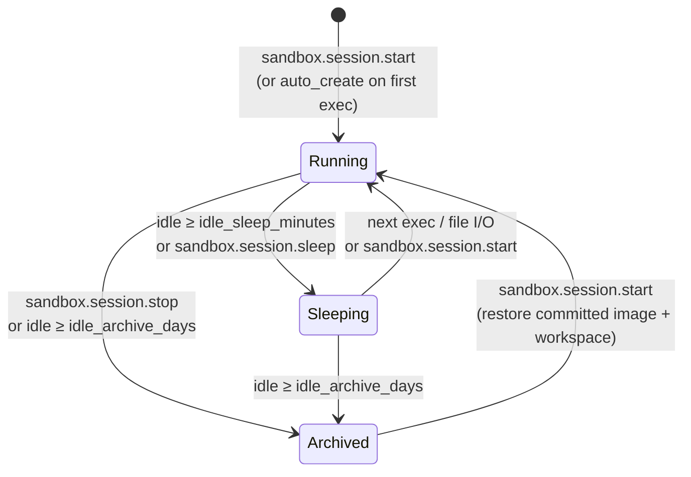

# 13 · Docker Subsystem

Vera has a real, **server-side** Docker backend. The UI talks to Docker Engines *through* Vera (no browser→daemon CORS or unix-socket problems); agents use containers as execution environments; Vera can spin up **Docker workers** — containers running the Vera image that join the cluster and consume the task stream — and provision its own backing stores, a build service, Portainer and a Prometheus exporter stack. Every chat, IDE or agentic-loop session can also get its own **session sandbox** container that becomes the only place that session's commands run.

Source: [`vera/workers/docker_capabilities.py`](../vera/workers/docker_capabilities.py) (host registry, Engine proxy, lifecycle, workers, stack), [`docker_disk_capabilities.py`](../vera/workers/docker_disk_capabilities.py) / [`docker_disk_core.py`](../vera/workers/docker_disk_core.py) and [`docker_host_health_capabilities.py`](../vera/workers/docker_host_health_capabilities.py) / [`docker_host_health_core.py`](../vera/workers/docker_host_health_core.py) (disk and daemon health), [`image_drift.py`](../vera/workers/image_drift.py) (image drift decisions), [`docker_effects.py`](../vera/workers/docker_effects.py) (effect observation), [`vera/docker/disk_headroom.py`](../vera/docker/disk_headroom.py) (disk headroom verdicts), [`vera/remote/session_sandbox_capabilities.py`](../vera/remote/session_sandbox_capabilities.py) and [`sandbox_idle_core.py`](../vera/remote/sandbox_idle_core.py) (session sandboxes), [`vera/remote/portainer_capabilities.py`](../vera/remote/portainer_capabilities.py), [`vera/remote/metrics_capabilities.py`](../vera/remote/metrics_capabilities.py), [`vera/build/`](../vera/build/) (build service) and [`vera/provisioning/stores_capabilities.py`](../vera/provisioning/stores_capabilities.py).

**Status:** production. Lifecycle mutations are gated by the [exec sandbox](./12-execution.md#3-the-exec-sandbox) and observed (not yet governed) by payload-free effect projections. Session sandboxes are opt-in per session unless `auto_create` is switched on.

## Contents

- [1. Connection model](#1-connection-model)
- [2. Host registry](#2-host-registry)
- [3. Monitoring](#3-monitoring)
  - [Engine reverse proxy](#engine-reverse-proxy)
  - [Containers, images, stats and drift](#containers-images-stats-and-drift)
  - [Disk and daemon health](#disk-and-daemon-health)
- [4. Container lifecycle](#4-container-lifecycle)
  - [Effect observation](#effect-observation)
- [5. Docker workers — running Vera](#5-docker-workers--running-vera)
- [6. The Vera stack and backing stores](#6-the-vera-stack-and-backing-stores)
- [7. Build service — vera-builder](#7-build-service--vera-builder)
  - [Progress on long builds](#progress-on-long-builds)
- [8. Per-session sandboxes](#8-per-session-sandboxes)
  - [Lifecycle](#lifecycle)
  - [Routing and run ownership](#routing-and-run-ownership)
  - [Durability: commit, sync, restore](#durability-commit-sync-restore)
  - [Packages](#packages)
  - [Idle sleep, archive and reaping](#idle-sleep-archive-and-reaping)
  - [Sandbox capability reference](#sandbox-capability-reference)
- [9. Portainer](#9-portainer)
- [10. Prometheus metrics stack](#10-prometheus-metrics-stack)
- [11. Configuration](#11-configuration)
- [12. Events and storage](#12-events-and-storage)
- [13. UI](#13-ui)
- [14. Host, container and persistence model](#14-host-container-and-persistence-model)
- [15. Troubleshooting](#15-troubleshooting)
- [See also](#see-also)
- [Screenshots](#screenshots)
- [Capabilities](#capabilities)

---

## 1. Connection model

Like the rest of Vera (the SSH host registry, the IDE), a Docker host can be reached three ways:

| Kind | How |
|---|---|
| `local` | The orchestrator's own Docker — a unix socket (`DOCKER_SOCK`, default `/var/run/docker.sock`) or `$DOCKER_HOST` |
| `tcp` | A remote daemon over the Engine HTTP API (`http://host:2375`, `tcp://…`) |
| `ssh` | A daemon reached over a **stored SSH host** — `curl --unix-socket` over SSH for Engine API calls, `docker -H ssh://user@host` for CLI actions |

The `ssh` kind reuses the SSH host registry of [`exec.ssh.*`](./12-execution.md#5-ssh-host-registry), so a host configured once is usable for shell, Docker and terminals. Docker CLI calls run through `spawn_core` (a worker-thread `Popen`, never a fork on the event loop).

---

## 2. Host registry

| Capability | Route | Purpose |
|---|---|---|
| `docker.hosts.list` | `GET /workers/docker/hosts` | Registered hosts (raw, including duplicates) |
| `docker.hosts.list.effective` | `GET /workers/docker/hosts/effective` | The same, de-duplicated by underlying engine identity (socket path or SSH target) — use for any aggregation across hosts |
| `docker.hosts.save` | `POST /workers/docker/hosts/save` | Add or update a host: `kind` (`local`\|`tcp`\|`ssh`), `label`, `url` (tcp), `ssh_host_id` (ssh), `socket`, `id` (update), `make_default` |
| `docker.hosts.delete` | `POST /workers/docker/hosts/delete` | Remove a host (the built-in `local` host cannot be removed) |

Hosts persist to `~/.vera_docker_hosts.json` (override with `VERA_DOCKER_HOSTS`).

---

## 3. Monitoring

### Engine reverse proxy

The Docker panes read daemons through a reverse proxy on Vera's own port, so the browser never talks to a daemon directly:

```
GET|POST|DELETE /workers/docker/engine/{host_id}/{api_path}
        ↓ proxied (connection kind handled server-side)
   that host's Docker Engine API
```

### Containers, images, stats and drift

| Capability | Route | Purpose |
|---|---|---|
| `docker.ping` | `POST /workers/docker/ping` | Engine reachable? → `{ok, version, api_version}` |
| `docker.ps` | `POST /workers/docker/ps` | Containers (`all`, `slim` for a dashboard-sized record) |
| `docker.images` | `POST /workers/docker/images` | Images |
| `docker.stats.top` | `GET /workers/docker/stats/top` | CPU % and working-set memory for the busiest running containers on every host, sampled every 30 s in the background, top 12 per host, with a 20-sample trend |
| `docker.drift` | `GET /workers/docker/drift` | Running containers no longer on the image their tag points at (a `docker restart` keeps the old image; only recreating picks up a rebuild). Loop Lab (`vera-dev-*`) and session (`vera-sbx-*`) containers are excluded on purpose. Decision only — it never recreates anything, because the roll-forward belongs to whatever created the container (compose for the stack, `docker.worker.spawn` for workers). |

### Disk and daemon health

| Capability | Route | Purpose |
|---|---|---|
| `docker.disk.breakdown` | `GET /docker/disk/breakdown` | Where a host's disk went: images, container writable layers, volumes and build cache with what each could give back; grown containers, untagged images, orphan volumes and reapable session sandboxes. Slow, so computed in the background and cached 10 minutes (`refresh` forces). |
| `docker.disk.status` | `GET /docker/disk/status` | Headroom on the filesystem holding Docker's data root → `level` `ok`/`warn`/`critical`, free and used, and how many exited session sandboxes could be reaped |
| `docker.disk.reap` | `POST /docker/disk/reap` | Remove exited `vera-sbx-*` session sandboxes finished more than `retain_hours` (default `VERA_SESSION_SANDBOX_RETAIN_HOURS`, 24) ago; never running containers, never Loop Lab `vera-dev-*` containers. Dry run by default. |
| `docker.host.health` | `GET /docker/host/health` | The Vera host's Docker daemon: state, resident memory and growth per day, `docker exec` helpers deadlocked in runc, live-restore and OOM protection |
| `docker.host.fix_stuck_execs` | `POST /docker/host/fix_stuck_execs` | Kill only the deadlocked `runc exec` / `runc init` pair older than `min_age_s` (default 3600); dry run unless `apply=true` |

Disk headroom (`disk_headroom.py`) fires a level only when **either** bound is crossed **and** the disk is at least 50 % used: warn at 85 % used or under 20 GB free, critical at 95 % or under 8 GB. A background sweep every `VERA_DISK_SWEEP_INTERVAL` (900 s) emits `docker.disk.headroom` on a change of level and, at **critical**, reaps exited session sandboxes automatically. The daemon watch runs every `VERA_DOCKER_WATCH_S` (300 s) on a real host (not inside a container) and, with `VERA_DOCKER_AUTOFIX` (default on), clears stuck exec helpers.

---

## 4. Container lifecycle

| Capability / route | Streaming | Purpose |
|---|---|---|
| `POST /workers/docker/build` | SSE | `docker build -t <tag> <cwd>` with live output |
| `POST /workers/docker/run` | SSE | `docker run` (`--rm`, or `-d` when `detach`) with live output |
| `POST /workers/docker/logs` | SSE | Follow a container's logs |
| `docker.run` | — | Deploy `docker run -d` on a host: `image`, `name`, `ports` (`host:container,…`), `env`, `volumes` (`src:dst,…`), `network`, `restart` (`unless-stopped`), `extra_args`, `command`, `pull` |
| `docker.exec` | — | Run a command in a running container (`workdir`, `timeout` 120) |
| `docker.stop` | — | Stop a container (`timeout` 10) |
| `docker.rm` | — | Remove a container (`force`) |

The SSE routes are plain HTTP routes, not capabilities. `docker.run` declares `POST /workers/docker/run` too; because the SSE route is registered first, an HTTP POST to that path reaches the streaming route — call the `docker.run` capability by name (MCP, DAG, capability call) for the non-streaming deploy.

`docker.exec`, `docker.run`, the build/run streams, `docker.worker.spawn` and image builds are **gated by the exec sandbox** (`_sandbox_check`), the same `<vera-sandbox-controls>` policy that governs Exec and IDE Run; a refusal emits `exec.sandbox.blocked`. `docker.stop` and `docker.rm` validate their target but are direct lifecycle mutations; callers must authorise them explicitly.

### Effect observation

`docker.exec`, `docker.stop`, `docker.rm`, `docker.run` and `docker.worker.stop` emit a payload-free external-effect projection immediately before invoking Docker. `docker.image.ensure` does the same only when it will build or transfer an image; an already-present image is a read-only short circuit. `docker.worker.spawn` observes the worker creation after any required image preparation succeeds. The projection hashes host, resource and operation identity; command text, environment values, target names, connection URLs and raw approval/idempotency references are not retained. These capabilities accept optional `idempotency_key`, `approval_receipt_ref` and `retry` inputs that are recorded only as digests and never sent to Docker. The projection is observe-only: it cannot block, retry or claim completion, and results include it as `effect_shadow`.

`docker.stack.deploy` and its canonical `provision.store.deploy` path emit one logical deployment observation rather than a nested `docker.run` observation. An already-running store is a read-only short circuit; restarting a stopped store, writing Garage configuration, creating a store container, and removing or purging a store are observed immediately before their first Docker mutation. Streaming routes and the remaining managed-host provisioning families are not fully covered, so infrastructure evidence in the Integrations UI is labelled partial.

---

## 5. Docker workers — running Vera

Every Vera process is also a worker (see `capability_orchestration.worker_loop` and the [Capability Framework](./01-capability-framework.md#6-distributed-dispatch)), so a Vera container that shares the cluster's `REDIS_URL` registers in `WORKER_REGISTRY` and starts draining `vera:tasks`.

| Capability | Route | Purpose |
|---|---|---|
| `docker.worker.spawn` | `POST /workers/docker/worker/spawn` | `docker run -d` the Vera image wired to the shared `REDIS_URL` (and the cluster's connection settings); options `name`, `image`, `network`, `gpus`, `env`, `ensure_image` |
| `docker.worker.list` | `GET /workers/docker/worker/list` | Worker containers (label `vera.role=worker`) cross-referenced with the live worker registry |
| `docker.worker.stop` | `POST /workers/docker/worker/stop` | Stop and remove a worker container |
| `POST /workers/docker/worker/logs` | SSE route | Follow a worker's logs |
| `docker.image.ensure` | `POST /workers/docker/image/ensure` | Guarantee a **local-only** image exists on a host — build it from this repo's Dockerfile or `save`/`load`-transfer it from the local daemon, never a registry pull (`strategy`, `context`, `dockerfile`, `timeout` 1800) |

`docker.worker.spawn` uses `VERA_WORKER_IMAGE` (default `vera:latest`). The Vera image is **not on Docker Hub** — a bare `docker run vera:latest` on a fresh host fails with *pull access denied*. Spawn therefore calls `docker.image.ensure` first (`ensure_image=true` by default): if the host already has the image it is a no-op; if the local daemon has it and the host is remote, it is streamed over with `docker save | docker load`; otherwise it is **built from the repo's Dockerfile** (`docker -H <host> build` ships the local build context, so this works for SSH and TCP hosts). `docker compose build` tags the same `vera:latest`. You can scale capability throughput by spawning workers onto any registered host straight from the harness.

---

## 6. The Vera stack and backing stores

| Capability | Route | Purpose |
|---|---|---|
| `docker.stack.catalog` | `GET /workers/docker/stack/catalog` | Vera's backing services as in `docker-compose.yml`: `redis`, `postgres`, `chromadb`, `neo4j`, `garage`, `ollama` — image, container name, ports, volumes, env |
| `docker.stack.status` | `GET /workers/docker/stack/status` | Which of those exist and run on a host |
| `docker.stack.deploy` | `POST /workers/docker/stack/deploy` | Provision one service on a host; delegates to `provision.store.deploy` (idempotent: an existing container is started, not recreated) |

The `provision.store.*` group ([`stores_capabilities.py`](../vera/provisioning/stores_capabilities.py), **Provision → Docker** pane) is the canonical implementation:

| Capability | Purpose |
|---|---|
| `provision.stores` | Catalogue (image, ports, volumes per store) |
| `provision.store.deploy` | Run one store — or `all` — as `vera-<store>` with named data volumes; Garage gets a generated config and automatic admin-API bootstrap |
| `provision.store.status` | Container state and reachability per store |
| `provision.store.remove` | Remove the container (volumes kept unless `purge_volumes`) |
| `provision.store.garage.bootstrap` | Layout, key import, bucket and grant via the Garage admin API — idempotent; also repairs a local stack whose `garage-init` never completed (`fabric.objects.status` → AccessDenied) |

Deploy and remove accept optional idempotency, approval-receipt and retry references for observe-only policy projection. Those values, store environment settings, generated Garage secrets and target identities are never retained in effect evidence or forwarded as Docker flags.

---

## 7. Build service — vera-builder

A dedicated compilation container so Vera never needs a toolchain in its own image. It ships **arduino-cli + the ESP32 Arduino core, PlatformIO, gcc/g++/make/cmake/ninja, esptool and mpy-cross** behind a small HTTP API ([`vera/build/builder_service.py`](../vera/build/builder_service.py)); Vera reaches it at `VERA_BUILDER_URL` over `vera-net`.

| Endpoint (builder) | Vera capability | What it does |
|---|---|---|
| `POST /build/arduino` | `build.arduino`, `mesh.firmware.build` | `arduino-cli compile` → a **merged, flash-at-0x0** `.bin` (bootloader + partitions + app via `esptool merge_bin`) dropped into the mesh firmware catalogue for the panel flasher |
| `POST /build/platformio` | `build.platformio` | `pio run` for any PlatformIO board/framework (PlatformIO installs platforms and `lib_deps` in its own per-project env) |
| `POST /build/python` | `build.python` | Run Python in a **fresh, isolated virtualenv** — install `requirements`, run, discard the env |
| `POST /build/exec` | `build.run` | Run an arbitrary build command (make/cmake/cargo/go/tsc/…); optional `apt` (system packages), `pip` (into a venv) and `env` |
| `GET /health` | `build.status` | Which toolchains and installed cores/libraries are present, and reachability |

**Automatic dependency management.** The builder installs what a build needs:

- **Arduino** — `build.arduino` / `mesh.firmware.build` install the **board core** for the FQBN if missing (`esp32:esp32`, `arduino:avr`, `rp2040:rp2040`, `STMicroelectronics:stm32`, … — third-party cores via `board_urls`), then scan the sketch's `#include`s and install the **libraries** they map to (`auto_libs`, on by default). ArduinoJson is pinned to **v6** (the node sketch uses the v6 API). The returned `deps` lists what was installed.
- **Python** — `build.python` (and `build.run` with `pip`/`venv`) provisions a per-call virtualenv, installs the requested packages (or a `requirements.txt` in `files`), runs, then throws it away.
- **System** — `build.run` can `apt`-install packages (not isolated; persists in the running container until restart).
- Cores, libraries and PlatformIO platforms are cached in the `builder-cache` / `builder-pio` volumes.

`mesh.firmware.build` prefers the builder and falls back to a local `arduino-cli`; with neither it returns a hint. It picks the FQBN from the selected board profile's `chip` (falling back to `esp32:esp32:esp32s3:CDCOnBoot=default` — ESP32-S3 with USB-CDC **off**, because the reference display board wires the parallel TFT's D4/D5 onto GPIO19/20) and applies the panel's bake options (pin map, display/SD/CSI, Wi-Fi, server URL) before compiling. Source is passed inline as JSON (`{files:{path:content}}`); artifacts come back base64-encoded.

**Discovery.** `VERA_BUILDER_URL` wins if set. Otherwise Vera probes the published port (`http://localhost:$BUILDER_PORT`) *and* the compose DNS name and remembers whichever answers `/health`.

> [!WARNING]
> `build.run` / `/build/exec` runs arbitrary commands — it is a self-hosted build runner. Keep it on `vera-net` or a trusted LAN; do not expose the port to untrusted networks. The first build installs the ESP32 toolchains (~2 GB) into the `builder-cache` volume.

```bash
docker compose up -d --build vera-builder     # in-stack
```

`build.builder.up` does the same for a native orchestrator (and backs the Mesh panel's **Start build service** button): it builds `vera/build/Dockerfile` if the image is missing, runs the container with `$BUILDER_PORT` published, and waits for `/health`. It is idempotent — a reachable builder returns immediately and emits no mutation observation; `rebuild: true` forces a fresh image. When startup does mutate infrastructure, its background job records one payload-free builder-service observation before the first build/container action.

`build.arduino`, `build.platformio`, `build.run` and `build.python` also project a payload-free infrastructure effect immediately before their builder POST. Source files, commands, environment variables, dependency lists, artifacts, builder URLs and raw approval/idempotency references are represented only by digests; optional control references are not sent to the builder.

### Progress on long builds

An image build takes ~10 minutes and a sketch compile ~90 seconds. Both run in the background and report into a shared job registry:

- `build.builder.up` and `mesh.firmware.build` return `{job_id}` immediately (`background: false` blocks instead).
- `build.progress?job_id=…` returns `{phase, pct, done, ok, elapsed_s, log, result, error}`.
- The image build streams `docker build` output; `Step n/m` becomes a percentage. The sketch compile reports phases (baking → compiling → saving) and appends the compiler log.
- Logs keep the newest 400 lines; finished jobs are evicted once 40 accumulate.

---

## 8. Per-session sandboxes

A **session sandbox** is a dedicated Docker container for one chat, IDE or agentic-loop session (or a shared owner such as a goal or project). While it is active, that session's shell commands, code runs and file I/O execute **inside the container**, never on the Vera host. Containers are named `vera-sbx-…` (derived from the session id), keep `/workspace` in a named volume, and can be committed to `vera-session:<sid>` for instant restore.

### Lifecycle



`sandbox.session.start` creates the container from the session's committed image if one exists, else from the base image (`VERA_SESSION_SANDBOX_IMAGE`, default `python:3.12-slim`, or the configured `base_image`), on the configured Docker host (`docker_host_id`, default `local`), best-effort installs `packages`, optionally rehydrates `/workspace` from the durable store, and (with `enable`) marks the session **active**. `sandbox.host.provision` can create a dedicated Docker host for sandboxes: a light Proxmox LXC with nesting, Docker installed over SSH, registered in the Docker host registry and made the sandbox default.

### Routing and run ownership

- **Active flag.** `exec.bash.run`, `exec.code.run`, the per-language runners, the exec streams and `text.*` route into the container only for calls that carry that session's id and only while the session is active (`sandbox.session.set_active` flips it without touching Docker).
- **Links.** `sandbox.session.link(session_id, target)` makes one session use another's container (e.g. every dream run of a goal links to `goal-<slug>`, project work to `proj-<slug>`, an IDE workspace to `ws-<name>`). Routing and status are alias-aware.
- **Run ownership.** A governed run (a dream cycle, a program loop, a project or goal loop) sets an owner key for its duration; any sandbox creation for another session id inside that run is redirected into the owner's container, so a run cannot fan out into per-step containers or nest a second sandbox.
- **Auto-create.** With `auto_create` on (system-wide), any session that executes shell/code or writes artifacts gets its own container automatically.
- **Confined writes.** With `confine_writes` (default on), `HOME`, temp and cache directories point into the workspace volume and the default exec cwd is `/workspace`.

### Durability: commit, sync, restore

| Operation | Effect |
|---|---|
| `sandbox.session.commit` | `docker commit` → `vera-session:<sid>` (captures installed packages) |
| `sandbox.session.sync` | Snapshot `/workspace` to the durable session store: the Garage object store (primary, versioned) plus a best-effort Gitea mirror (replicated on the next sync if Gitea was offline) |
| `sandbox.session.restore` | Rehydrate `/workspace` from the latest Garage snapshot |
| `sandbox.session.snapshots` | List stored snapshots |
| `sandbox.session.stop` | With `archive_on_stop` (default true): sync and commit first; then stop and (by default) remove the container. The `/workspace` volume is always kept. |
| `sandbox.session.seed` | Copy a host directory into `/workspace` (only if empty by default) and remember it as the container's default seed |

A periodic auto-sync (`auto_sync_interval`, default `VERA_SANDBOX_AUTOSYNC_SEC` = 900 s; checked every 60 s) re-syncs active sandboxes whose workspace is dirty.

### Packages

`package_policy` decides what happens when code needs a package the sandbox lacks: `ask` (default) pauses the run and asks the user (`sandbox.packages.pending` / `sandbox.packages.respond`, optionally approving a subset and remembering it in an auto-approve allowlist), `auto` installs silently, `deny` fails the run with the list. `package_headless_auto` turns an unanswerable ask in an unattended run into an install instead of a timeout. Blocklisted names are always refused. `sandbox.packages.catalog` lists a curated menu; `install`/`remove` act directly (`pip`, `apt`, `npm`, `pwsh`).

### Idle sleep, archive and reaping

| Tick | Interval | Default threshold | Action |
|---|---|---|---|
| Idle sleep | 120 s | `idle_sleep_minutes` = `VERA_SANDBOX_IDLE_SLEEP_MIN` (30) | `docker stop` (container, volume and active flag kept; wakes on next use) |
| Idle archive | 1 h | `idle_archive_days` = `VERA_SANDBOX_IDLE_ARCHIVE_DAYS` (7) | Full archive (commit + sync) and container removal; the committed image is kept so `start` restores from it |
| Registry reap | 1 h | — | Delete registry rows with nothing left to point at (at most `VERA_SANDBOX_REAP_MAX` = 200 per tick) |
| Disk headroom | 900 s | critical level | Reap exited sandboxes (§3) |

The idle decision is pure (`sandbox_idle_core`): a session linked to another container is judged by its target's activity, not by its own stale record.

### Sandbox capability reference

All under `/remote/sandbox/…`.

| Capability | Purpose |
|---|---|
| `sandbox.session.start` / `status` / `stop` / `sleep` / `set_active` / `list` | Lifecycle and state (`list` includes a best-effort Docker state per container) |
| `sandbox.session.exec` / `run_code` | Run a command or a snippet inside the container (`timeout` 120) |
| `sandbox.session.fs.read` / `fs.write` | Files inside the container |
| `sandbox.session.terminal` | Wake/create the container and return a `<vera-terminal>` descriptor plus a full-page URL (`/remote/sandbox/terminal`) |
| `sandbox.session.link` | Share one container between session ids |
| `sandbox.session.context` | The container's context package: record, every tied session/run and their loop state (optionally written to `/workspace/.vera/context.json`) |
| `sandbox.session.commit` / `sync` / `restore` / `snapshots` / `seed` | Durability (above) |
| `sandbox.config.get` / `sandbox.config.set` | Global defaults: `docker_host_id`, `base_image`, `auto_sync_interval`, `archive_on_stop`, `auto_create`, `idle_sleep_minutes`, `idle_archive_days`, `confine_writes`, `package_policy`, `package_headless_auto` |
| `sandbox.packages.catalog` / `list` / `install` / `remove` / `pending` / `respond` | Packages |
| `sandbox.host.provision` | Create a dedicated sandbox Docker host on Proxmox |

`GET /remote/sandbox/preview/{session_id}/{path}` serves files from a session's workspace for preview.

---

## 9. Portainer

Vera can drive a Portainer instance as a backend and provision Portainer itself. Connections are stored in Redis `vera:remote:portainer` with the API key sealed.

| Capability | Route | Purpose |
|---|---|---|
| `portainer.save` / `list` / `delete` | `/remote/portainer/…` | Connection store (`url`, `api_key`, `verify_tls`, `make_default`) |
| `portainer.ping` | `POST /remote/portainer/ping` | Reachability, authentication and version |
| `portainer.endpoints` | `POST /remote/portainer/endpoints` | Environments Portainer manages |
| `portainer.containers` | `POST /remote/portainer/containers` | Containers in an endpoint |
| `portainer.stacks` | `POST /remote/portainer/stacks` | Stacks |
| `portainer.container.action` | `POST /remote/portainer/container/action` | `start`, `stop`, `restart`, `kill`, `pause`, `unpause`, `remove` |
| `portainer.provision` | `POST /remote/portainer/provision` | Run Portainer CE/EE on a Docker host via sandbox-gated `docker.run` (`https_port` 9443, `http_port` 9000) if not already running |

---

## 10. Prometheus metrics stack

Container- and host-level time series for the monitor surfaces. Prometheus endpoints are stored in Redis `vera:remote:prometheus` with basic-auth passwords sealed.

| Capability | Route | Purpose |
|---|---|---|
| `metrics.prom.save` / `list` / `delete` | `/remote/metrics/prom/…` | Endpoint store |
| `metrics.prom.query` | `POST /remote/metrics/prom/query` | Instant PromQL |
| `metrics.prom.query_range` | `POST /remote/metrics/prom/query_range` | Range PromQL (`step` 30s) |
| `metrics.prom.targets` | `POST /remote/metrics/prom/targets` | Scrape-target health |
| `metrics.stack.status` | `POST /remote/metrics/stack/status` | Whether cAdvisor, node-exporter and Prometheus run on a host (by port probe) |
| `metrics.stack.provision` | `POST /remote/metrics/stack/provision` | Provision cAdvisor (:8080), node-exporter (:9100) and Prometheus (:9090, generated scrape config) via sandbox-gated `docker.run`, skipping running pieces, and register the new Prometheus |

---

## 11. Configuration

| Variable | Default | Purpose |
|---|---|---|
| `VERA_DOCKER_HOSTS` | `~/.vera_docker_hosts.json` | Host-registry path |
| `DOCKER_SOCK` | `/var/run/docker.sock` | Local unix socket |
| `DOCKER_HOST` | unset | Local daemon override |
| `VERA_WORKER_IMAGE` | `vera:latest` | Image for `docker.worker.spawn` |
| `VERA_DOCKER_STATS_CONCURRENCY` | `8` | Parallel `/stats` probes |
| `VERA_DOCKER_WATCH_S` | `300` | Daemon health watch interval |
| `VERA_DOCKER_STUCK_EXEC_S` | `3600` | Age at which an exec helper counts as stuck |
| `VERA_DOCKER_AUTOFIX` | `1` | Clear stuck exec helpers automatically |
| `VERA_DISK_SWEEP_INTERVAL` | `900` | Disk headroom sweep (s) |
| `VERA_SESSION_SANDBOX_RETAIN_HOURS` | `24` | Exited-sandbox retention before reaping |
| `VERA_SESSION_SANDBOX_IMAGE` | `python:3.12-slim` | Default sandbox base image |
| `VERA_SANDBOX_AUTOSYNC_SEC` | `900` | Default auto-sync interval |
| `VERA_SANDBOX_IDLE_SLEEP_MIN` | `30` | Default idle sleep |
| `VERA_SANDBOX_IDLE_ARCHIVE_DAYS` | `7` | Default idle archive |
| `VERA_SANDBOX_REAP_MAX` | `200` | Registry rows reaped per tick |
| `VERA_BUILDER_URL` | `http://vera-builder:8080` | Build service URL (native orchestrator: `http://localhost:8785`) |
| `BUILDER_PORT` | `8785` | Host port the builder is published on |
| `BUILDER_DEFAULT_FQBN` | `esp32:esp32:esp32` | Default board for `build.arduino` |

Runtime sandbox defaults (`sandbox.config.set`) live in Redis `vera:remote:sandbox:cfg` and override the environment defaults.

---

## 12. Events and storage

| Event | When |
|---|---|
| `docker.host.saved`, `docker.host.deleted` | Host registry changes |
| `docker.container.run`, `docker.container.stopped`, `docker.container.removed` | Lifecycle |
| `docker.image.build`, `docker.image.ensured` | Image preparation |
| `docker.worker.spawned`, `docker.worker.stopped` | Workers |
| `docker.stack.deployed` | Stack deploy |
| `docker.disk.headroom`, `docker.disk.reaped` | Disk level change, reaping |
| `exec.sandbox.blocked` | A Docker action refused by the exec sandbox |

| Store | Content |
|---|---|
| `~/.vera_docker_hosts.json` | Docker hosts |
| Redis `vera:remote:sandboxes` | Session sandbox records |
| Redis `vera:remote:sandbox:cfg`, `vera:remote:sandbox:alias`, `vera:remote:sandbox:pkg:pending` | Sandbox defaults, links, pending package approvals |
| Redis `vera:remote:portainer`, `vera:remote:prometheus` | Portainer and Prometheus connections |
| Redis `vera:docker:host:rss` | Daemon memory samples |
| Garage + Gitea | Session workspace snapshots |

---

## 13. UI

The Docker pane lives in the **Workers & Ollama** tab (`workers_ollama_panel.html`): hosts, containers, images and stats via the Engine proxy, lifecycle and worker-spawn actions, and the stack/provisioning views. Because lifecycle actions are sandbox-gated, the `<vera-sandbox-controls>` editor shown there governs whether they run. Session sandboxes have their own controls in chat, IDE and the loop views, and a terminal page at `/remote/sandbox/terminal`.

---

## 14. Host, container and persistence model

Docker hosts are registered endpoints; containers and images are discovered from a selected host. A container ID is only meaningful together with its host. Published ports describe reachability from that host, while volumes define which state survives replacement.

Before restart, recreate or remove, inspect mounts, environment references, health, dependent services, and whether the container belongs to Loop Lab (`vera-dev-*`) or a session (`vera-sbx-*`). Never infer disposability from a generated-looking name. Stopping a process is reversible; removing a container may not be; removing volumes is destructive data loss.

For failures, separate daemon reachability, authentication/context, image pull, container start, healthcheck and application health. Logs explain the process; `docker ps` explains only container state. Disk pressure frequently comes from images, layers, build cache, logs and volumes, so measure each category (`docker.disk.breakdown`) before pruning.

---

## 15. Troubleshooting

| Symptom | Cause / fix |
|---|---|
| `pull access denied` for `vera:latest` | The image is local-only; use `docker.image.ensure` (spawn does this by default). |
| A rebuilt image is not running | `docker restart` keeps the old image; check `docker.drift` and recreate. |
| Lifecycle call refused | The exec sandbox blocked it (`exec.sandbox.blocked` event); adjust the policy. |
| Commands run on the host instead of the session container | The call carried no session id, or the session is not active (`sandbox.session.status`). |
| A run is paused | It is waiting on a package approval (`sandbox.packages.pending`). |
| Disk filling | `docker.disk.status`, then `docker.disk.reap` (dry run first) and `docker.disk.breakdown`. |
| `docker exec` hangs on the host | Deadlocked runc helpers: `docker.host.health`, `docker.host.fix_stuck_execs`. |
| `can_build: false` with the builder running | Set `VERA_BUILDER_URL`, or check the published `BUILDER_PORT`. |

---

## See also

- [Execution & Network Mapping](./12-execution.md) — the sandbox that gates Docker CLI caps, remote terminals and `netscan.docker.scan`
- [Capability Framework](./01-capability-framework.md#6-distributed-dispatch) — how a spawned container becomes a worker
- [LLM Cluster](./04-ollama-cluster.md) — the cluster a Docker worker joins
- [Workers, Jobs & Syslog](./22-workers-jobs-syslog.md) — worker registry, metrics, job feed
- [Infrastructure Provisioning](./35-infrastructure-provisioning.md) — stores and node components
- [Evolve](./33-evolve.md) — Loop Lab dev sandboxes (`vera-dev-*`)
- [Configuration](./10-configuration.md) — all env vars in one place

## Screenshots

<!-- VERA:AUTO:screenshots START -->
_No screenshots captured yet — run `docs.build` (or `operator.mission.run documentation`)._
<!-- VERA:AUTO:screenshots END -->

## Capabilities

<!-- VERA:AUTO:capabilities START -->
_No capabilities resolved for this domain._
<!-- VERA:AUTO:capabilities END -->
