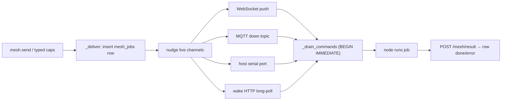

# 14 · Device Mesh

The **Mesh Manager** runs a fleet of **ESP32** edge nodes (or anything else that
speaks HTTP, WebSocket, MQTT or serial JSON). Each node enrolls, advertises the
**modules** it can run, streams **telemetry**, and is **sent work** through one
durable job queue. On top of that core sit firmware building and flashing from
the browser, fleet OTA, a server-driven touchscreen UI (screens, pictures,
animations, macro pads and dashboards), an SD-card toolkit, board and pin
management, and an ESP32-S3 RF toolkit that feeds positioning and the Network
Map.

The code lives in [`vera/mesh/`](../vera/mesh). The wire format every
transport carries is specified in [`PROTOCOL.md`](../vera/mesh/PROTOCOL.md);
this page is the architecture and capability reference, and the protocol doc
is the byte-level contract for firmware authors. The core queue, transports
and MicroPython/Arduino firmwares are in regular use on real hardware; the
display UI is verified on the `s3-uno-ili9488` board profile, and CSI and
promiscuous sniffing need the Arduino/IDF firmware.

## Contents

- [1. Design — one durable queue, many drains](#1-design--one-durable-queue-many-drains)
- [2. Source map and storage](#2-source-map-and-storage)
- [3. Transports and device routes](#3-transports-and-device-routes)
- [4. Identity, auth, status and topology](#4-identity-auth-status-and-topology)
- [5. Node modules](#5-node-modules)
- [6. Firmware: building and flashing](#6-firmware-building-and-flashing)
  - [Getting firmware onto a board](#getting-firmware-onto-a-board)
  - [Keeping the fleet current — auto-OTA](#keeping-the-fleet-current--auto-ota)
  - [Fleet updates on demand](#fleet-updates-on-demand)
- [7. Boards, pins and display bring-up](#7-boards-pins-and-display-bring-up)
  - [Board profiles](#board-profiles)
  - [Pin map, device profiles and probes](#pin-map-device-profiles-and-probes)
  - [The GPIO19/20 problem](#the-gpio1920-problem)
  - [Reading a node without a serial console](#reading-a-node-without-a-serial-console)
- [8. Server-driven UI](#8-server-driven-ui)
  - [Widget screens](#widget-screens)
  - [Declarative screens, widgets and the home dashboard](#declarative-screens-widgets-and-the-home-dashboard)
  - [Pictures — `mesh.ui.image`](#pictures--meshuiimage)
  - [Animation — `mesh.ui.animate`](#animation--meshuianimate)
  - [App library — `mesh.app.*`](#app-library--meshapp)
  - [Macro pads](#macro-pads)
- [9. SD toolkit](#9-sd-toolkit)
- [10. ESP32-S3 toolkit, RF positioning and the Network Map](#10-esp32-s3-toolkit-rf-positioning-and-the-network-map)
- [11. Telemetry → Data Fabric](#11-telemetry--data-fabric)
- [12. Capability reference](#12-capability-reference)
- [13. UI](#13-ui)
- [14. LAN gateway for firewalled nodes](#14-lan-gateway-for-firewalled-nodes)
- [15. Configuration](#15-configuration)
- [16. Events](#16-events)
- [17. Troubleshooting](#17-troubleshooting)
- [See also](#see-also)
- [Screenshots](#screenshots)
- [Capabilities](#capabilities)

---

## 1. Design — one durable queue, many drains

Every command sent to a node is a durable `mesh_jobs` row that moves
`queued → sent → done/error`. **That row is the single source of truth.**
Whichever transport the node happens to be using drains the *same* queue, so a
node can switch transports (Wi-Fi drops, falls back to serial) and never lose
work.



`_deliver` persists the job, then nudges every live channel.
`_drain_commands` atomically pops queued rows (`BEGIN IMMEDIATE`) so two
transports never double-deliver the same job. If no push channel is live, the
row simply waits for the node's next poll. Devices are expected to **dedupe by
`job_id`**, since a job could in theory arrive on two channels.

Optional transports are dependency-guarded (`HAS_AIOMQTT`, `HAS_PYSERIAL`) so
their absence never breaks startup.

---

## 2. Source map and storage

| File | Responsibility |
|---|---|
| `mesh_capabilities.py` | Core: node registry, job queue, transports, device HTTP/WS routes, telemetry, firmware catalog/build/upload, provisioning settings, auto-OTA, topology, panel registration |
| `mesh_ui_capabilities.py` | Server-driven UI: screens, images, animation, sprites, web pages, declarative screens, widgets, dashboard, apps and pads, touch calibration, SD toolkit, fleet OTA, pin map and probes |
| `mesh_toolkit_capabilities.py` | ESP32-S3 toolkit: RGB, BLE, sniff, CSI, I2C, touch, ESP-NOW, channel survey, sysinfo, deep sleep, RF ranging, multilateration, presence, Network Map sync |
| `mesh_boards_capabilities.py` | Board pin profiles, live pin remap, display test and probe |
| `mesh_gateway.py` | Stdlib-only LAN forwarder for nodes that cannot reach Vera directly |
| `mesh_panel.html` | The Mesh panel |
| `PROTOCOL.md` | Wire protocol for firmware authors |
| `firmware/arduino/vera_mesh_node.ino` | Arduino sketch |
| `firmware/micropython/main.py` | MicroPython firmware (`main.mpy` precompiled) |
| `firmware/esp-idf/` | ESP-IDF C sources |
| `firmware/boards.json`, `catalog.json` | Built-in board profiles and the flasher catalog |

**Storage**

| Store | Contents |
|---|---|
| Data Fabric SQLite (`mesh_nodes`, `mesh_jobs`, `mesh_telemetry`, `mesh_settings`) | Node registry, job queue, recent telemetry (500 rows kept per node), provisioning profile. Fresh WAL connections are opened in an executor |
| `vera/mesh/mesh_rf.db` (`node_pos`, `rf_obs`, `presence`) | Anchor positions, RSSI observations, CSI presence |
| `firmware/bin/` | Built and uploaded images; Vera-built images carry a `<name>.bin.json` sidecar |
| `firmware/img/` | Cached RGB565 frames for display nodes (newest 60 kept) |
| `firmware/sdstore/<node>/…` | Files archived off SD cards |
| `firmware/boards_custom.json`, `pads_custom.json`, `screens.json`, `dash_config.json`, `follow_modes.json` | User board profiles, saved pads, saved screens, home-dashboard config, per-node follow modes |
| Data Fabric datasets `mesh.<node_id>.<metric>` | Numeric telemetry history ([§11](#11-telemetry--data-fabric)) |

---

## 3. Transports and device routes

| Transport | Framing | Direction | Availability |
|---|---|---|---|
| **HTTP long-poll** | REST; `GET /mesh/poll` held open (default `wait=25`, max 30 s) | pull | Always on |
| **WebSocket** | JSON messages on `/mesh/ws`; server pushes `{"type":"jobs"}` | push + pull | Always on |
| **MQTT** | `vera/mesh/<id>/up` ⇄ `vera/mesh/<id>/down` | pub/sub | Optional (`VERA_MQTT_URL` + `aiomqtt`) |
| **Serial (server)** | Newline JSON on a host USB port | pull | Optional (`VERA_MESH_SERIAL_PORTS` + `pyserial`) |
| **Serial (browser)** | Newline JSON via the Web Serial API | relay | The panel relays a USB node into the mesh; no backend dependency |

A node advertises which channels it has in `hello.channels` (for example
`["http","serial"]`).

**Device-facing HTTP routes** (not capabilities; nodes call these directly):

| Route | Purpose |
|---|---|
| `POST /mesh/hello` | Enroll or re-announce; returns `node_id`, per-node `token`, stored module config |
| `GET /mesh/poll?node_id=…&wait=25&token=…` | Long-poll for jobs |
| `POST /mesh/telemetry` | Push telemetry samples |
| `POST /mesh/result` | Report a job's result |
| `WS /mesh/ws` | WebSocket transport |
| `POST /mesh/ui/event` | Touch events from a display node |
| `GET /mesh/ui/img/<name>.v565` | Cached RGB565 frames for display nodes |
| `POST /mesh/sd/upload` | Files streamed off an SD card |
| `GET /mesh/firmware`, `/mesh/firmware/bin/{name}`, `/mesh/firmware/fetch` | Firmware sources and images for flashing and OTA |
| `POST /mesh/firmware/upload` | Upload a `.bin` to the catalog |
| `GET /mesh/panel` | The Mesh panel HTML |

---

## 4. Identity, auth, status and topology

- A node picks a stable `node_id` (for example `esp32-<chip-mac>`); the first
  `hello` enrolls it.
- Auth is **open on the LAN by default**. Set `VERA_MESH_TOKEN` to require a
  token (`token` field or `X-Mesh-Token` header) on every device call; on
  enroll the server also issues a per-node token returned by `hello`.
- **Status** is computed from `last_seen` against `VERA_MESH_HEARTBEAT`
  (default 30 s): `new` (never seen), `online` (under 2× heartbeat), `stale`
  (under 10×), `offline`. A liveness tick runs every heartbeat and emits a
  `mesh.node` status event when a node goes stale or offline.
- Nodes may report `parent_id` (their mesh uplink). `mesh.graph` draws
  `child → parent` edges where the parent is a known node, otherwise a star edge
  to the **Vera Hub**. A flat Wi-Fi fleet renders as a star; an ESP-MESH relay
  tree renders as a tree.
- `mesh.topology` returns the same fleet in the dashboard's SVG topology shape
  and additionally shows **forwarding servers**: when a node's self-reported IP
  differs from the peer address its traffic arrived from, the relay (for
  example a [gateway](#14-lan-gateway-for-firewalled-nodes)) appears as its own
  node. `mesh.activity` feeds the map's animation with recent jobs and
  telemetry; poll it with `since` to get only new events.

---

## 5. Node modules

A node tells the server what it *can* do via `hello.modules`. The server stores
per-module config (which persists across re-enrolls) and the node applies it.

| Module | Does |
|---|---|
| `sensor` | Pushes telemetry samples (temperature, humidity, ADC, …) |
| `web_fetch` | Fetches a URL on the node's behalf |
| `watch` | Polls a target on an interval; alerts on failure |
| `alert` | Buzzer / LED / screen alert |
| `kiosk` | Drives a display. The Arduino and MicroPython reference firmwares include a self-contained driver for the 3.5" Arduino-Uno TFT shield (ILI9488, 320×480, 8-bit parallel) on ESP32-S3 Uno-footprint boards: boot status dashboard, `kiosk_set` text/BMP/status modes, runtime pin remap via `config.io.tft` |
| `storage` | SD card (the TFT shield's SPI slot): `sd_list` / `sd_read` / `sd_write` / `sd_delete` jobs plus `sd_total_mb` / `sd_used_mb` telemetry; pins via `config.io.sd` |
| `control` | Actuates a GPIO / relay channel |
| `ui` | Renders server-pushed screens and reports taps ([§8](#8-server-driven-ui)) |
| `rgb` | On-board WS2812/NeoPixel (`mesh.rgb`, effects; pin via `config.io.neopixel` or `mesh.rgb.probe`) |
| `ble` | BLE scan (`mesh.ble.scan`); devices are ingested to the Network Map and positioning |
| `toolkit` | ESP32-S3 multi-tool: CSI motion, Wi-Fi promiscuous sniff, I2C scan, touch, internal temperature, channel survey, ESP-NOW ranging, deep sleep, sysinfo |
| `position` | RF positioning: node coordinates and `rf_range` RSSI reports feed `mesh.locate` multilateration |

**Worker tasks.** `mesh.worker.assign(node_id, task={type, interval_s, payload})`
gives a node a recurring task it runs on-device and reports back, appended to
(or, with `replace=true`, replacing) its task list.

---

## 6. Firmware: building and flashing

### Getting firmware onto a board

Four routes, none of which need a local toolchain on your machine:

| Route | What happens | When |
|---|---|---|
| **MicroPython** | Flash the runtime over Web Serial (esptool-js), then `main.py` is pushed over the REPL and verified byte-for-byte | Default. No compile step |
| **Arduino** | `mesh.firmware.build` compiles the sketch in the **vera-builder** container, merges it to a flash-at-`0x0` image, drops it in the catalog, and the panel flashes it over Web Serial | Needed for CSI, promiscuous sniff, **and the S3-Uno display** |
| **Upload .bin** | You compiled elsewhere (Arduino IDE); upload the image and flash/OTA it from here forever after | No build service, or a custom sketch |
| **OTA** | `mesh.ota` pushes a built `.bin` (or a `main.py`) to a node already on Wi-Fi | Fleet updates — no cable |

The compiler lives in a separate container so the Vera image stays slim. It is **not running by default**: the Flash card shows its state and a **Start build service** button, which calls `build.builder.up` → builds `vera/build/Dockerfile` and starts the container with its port published. The first run pulls the ESP32 toolchains (~2 GB) and takes minutes; later builds take seconds. `VERA_BUILDER_URL` overrides discovery; otherwise Vera probes the published port *and* the compose DNS name, so a native (`./build.sh run`) orchestrator finds it just as an in-stack one does.

Whichever route you take, the **bake options are applied to the source first** — board pin map, display/SD/CSI toggles, Wi-Fi credentials, server URL — so a flashed node is already configured. `mesh.firmware.build` also picks the FQBN from the board profile's `chip`, so an S3 profile is never compiled as a classic ESP32.

**Wi-Fi credentials** are a default, not a lock: both firmwares prefer what was provisioned over serial (NVS / `vera_cfg.json`) and fall back to the baked pair, which is what gets a freshly erased node online with no cable step. The panel's password box clears after you save it, so the server fills a missing password from the saved (sealed) profile when the SSID matches — the password never round-trips through the browser. A node with no credentials at all says so on its screen and console rather than sitting silently on a blank Wi-Fi.

`mesh.firmware.catalog` lists what the flasher can offer (runtimes, sketches,
uploaded `.bin` files) plus host tool availability. `mesh.firmware.probe`
diagnoses a firmware download from the server's side (resolves the URL and
range-fetches the first bytes to check the image magic), which helps when a
large proxied download fails in the browser.

Arduino builds use one FQBN per chip, for example
`esp32:esp32:esp32s3:CDCOnBoot=default,PartitionScheme=min_spiffs`.

> [!NOTE]
> **Partition scheme:** Arduino builds use `PartitionScheme=min_spiffs`
> (1.9 MB per app slot, OTA preserved). The UI engine had already reached 90% of
> the 1.3 MB default, and an image that does not fit cannot be OTA'd at all.

### Keeping the fleet current — auto-OTA

**On by default.** At every `hello`, a node whose `fw` trails the newest artifact for its runtime gets an update queued over Wi-Fi. Opt out per node with `config.ota.auto = false`, or fleet-wide with the `ota_auto` mesh setting.

| Runtime | Artifact | Mechanism |
|---|---|---|
| MicroPython | the served `main.py` | `mesh.ota mode=file` → written over the REPL-installed script, then `machine.reset()` |
| Arduino | the newest **built** `.bin` for that node's chip | `mesh.ota mode=bin` → `httpUpdate` into the spare OTA partition, then reboots |

Nodes report `runtime` and `chip` in `hello`, and the version comparison uses each firmware's `FW_VERSION` (`x.y.z-mpy` / `x.y.z-ino`). **Bump `FW_VERSION` when you change a firmware** or nodes will never be offered the new build.

The selection rules are deliberately conservative — a wrong artifact here bricks a node:

- Arduino nodes are compared against the **`.bin`'s** recorded version, not the current `.ino`. Editing the sketch after a build therefore can't put nodes in a re-flash loop against an image they already run.
- Only images Vera built are eligible (they carry a `<name>.bin.json` sidecar). An uploaded `.bin` of unknown provenance is never auto-pushed.
- The chip must match. If a node's chip is unknown and several chips have builds, Vera refuses to guess and logs instead.
- Nodes that report neither `runtime` nor a recognisable `FW_VERSION` suffix (i.e. flashed before this existed) are left alone until reflashed.
- Serial/bridged nodes are skipped — they can't fetch the artifact themselves.

### Fleet updates on demand

- `mesh.ota(node_id, url | artifact, mode=bin|file, filename='main.py')`
  programs one node over Wi-Fi.
- `mesh.ota.plan(only_behind=true, node_ids=[…])` shows what a fleet update
  would do without sending anything: per node, which image and why, plus every
  skipped node and the reason (offline, no HTTP channel, auto-OTA disabled,
  unknown runtime, no image for its chip, already current).
- `mesh.ota.all(…, confirm=true)` performs it, sending each node the artifact
  built for **its** board and runtime. Nodes are flashed with different
  options, so one blanket image would silently reconfigure half of them.
  Without `confirm=true` nothing is sent.

---

## 7. Boards, pins and display bring-up

### Board profiles

A board profile is a pin map (display, SD, NeoPixel, touch) plus chip and
rotation. Built-ins in `firmware/boards.json`: `s3-uno-ili9488`
(hardware-verified), `esp32-d1r32-ili9488` (classic ESP32 "D1 R32" Uno) and
`manual`. User profiles are saved to `boards_custom.json`.

| Capability | Purpose |
|---|---|
| `mesh.boards.list` | Built-in and saved profiles |
| `mesh.boards.apply` | Push a profile's pin map to a node, persisted and applied live (no reflash); lands as `config.io.tft` / `sd` / `neopixel` and `kiosk.rotation` |
| `mesh.io.pins` | Set a node's pin map by hand; deep-merged into `config.io` so unrelated pins are kept |
| `mesh.boards.save` / `mesh.boards.delete` | Save or delete a custom profile (built-ins cannot be deleted) |
| `mesh.display.test` | Draw the bring-up test pattern (colour bars, border, live pin map) |
| `mesh.display.probe` | Read the display controller ID over the parallel bus (needs RD wired). `0x..9488` = ILI9488, `0x..9486` = ILI9486 (different init), `0x..9341` = ILI9341; all `00`/`FF` means the bus is not reading |

### Pin map, device profiles and probes

| Capability | Purpose |
|---|---|
| `mesh.pins.map` | Every GPIO on the node: what claims it (device + role), ADC capability, input-only or strapping/flash-reserved, plus **conflicts** (two devices on one pin) and warnings. Built from the node's live `config.io` |
| `mesh.pins.profiles` | Device profiles that can be mapped onto pins: display, touch, SD, NeoPixel, LED, relay, DS18B20, DHT22, generic analogue sensor, digital input, I2C, PWM. Each declares the roles it needs and how its signal is read, so new hardware is data rather than code |
| `mesh.pins.assign` | Attach a device profile to pins, validated against the chip first: unknown roles, missing pins, input-only pins asked to drive, non-ADC pins asked to measure, and collisions are refused with the reason (`force=true` overrides warnings) |
| `mesh.pins.probe` | Drive each pin high then low and read it back, to learn which GPIOs can really drive on this silicon. Display control lines are skipped |
| `mesh.pins.touch_scan` | Find a resistive panel's plates as continuity between LCD lines, no pressing needed |
| `mesh.pins.touch_hunt` | Interactive: measure "not touching" vs "press and hold" on the node's own screen and report the pairs that conduct only under pressure (about 10 s; `hold_s` default 8) |

Probe results come back as job results; read them with `mesh.jobs`.

### The GPIO19/20 problem

On the hardware-verified `s3-uno-ili9488` profile the shield's
**LCD_D4/D5 land on GPIO19/20, the ESP32-S3's native USB-Serial-JTAG (D-/D+)
lines**. While the USB PHY owns that pad those two data bits are stuck, so the
parallel bus writes garbage and the panel stays white. This is why the display
originally "only worked in the Arduino sketch": that build is compiled with
**USB CDC On Boot: Disabled** (`CDCOnBoot=default`, what `mesh.firmware.build`
uses), which puts the console on UART0 and leaves 19/20 free.

Both firmwares now release the pad explicitly
(`USB_SERIAL_JTAG_CONF0.USB_PAD_ENABLE`) rather than relying on the board
menu, and only when a data pin actually sits on 19/20:

- **Arduino**: `TFT_FREE_USB_PINS` (default on). The display still comes up if
  the sketch was built with the wrong USB setting, and it also runs on live pin
  remap.
- **MicroPython**: `TFT_FREE_USB_PINS` (default **off**, exposed as the panel's
  **🔌 Free USB pins** bake option). MicroPython's REPL *is* the
  USB-Serial-JTAG device, so taking the pad **kills the USB REPL**; the node is
  then reachable over Wi-Fi and UART0 only. Before it fires, the firmware moves
  the REPL to UART0 (`os.dupterm`) and waits `TFT_FREE_USB_GRACE` seconds, in
  which any keypress aborts the takeover. Recovery is always available: hold
  **BOOT**, tap **RESET**, and the ROM bootloader re-enables the pad so the
  panel can reflash.

`mesh.sysinfo` reports `usb_pads_freed` and `display`, and the node
inspector's pin-map card names all three ways out (Arduino build, Free USB
pins, or rewire and remap with `mesh.io.pins`).

### Reading a node without a serial console

The Arduino build runs with USB-CDC **off** (that's what frees GPIO19/20 for the display), so `Serial` goes to UART0 and a USB cable shows you nothing. The screen is the console:

- the **firmware version** appears on the boot screen, on the Wi-Fi screen, and in the corner of the status dashboard — so you can confirm which image is actually running;
- the status dashboard shows the **SSID and its live state**;
- on a failed join the node **scans** and says which it was: `SSID not seen (2.4GHz only?)` vs `seen -63dBm, check password` — the ESP32 is 2.4GHz-only, so a dual-band router advertising one SSID is a common trap;
- `enroll()` reports the real HTTP result instead of always claiming success, so "joined Wi-Fi but the server is unreachable" is visible rather than silent.

---

## 8. Server-driven UI

All app logic stays on the server, so adding an app never needs a reflash.

### Widget screens

Vera pushes a **screen** (a list of widgets) with `ui_screen`; the node renders it and reports taps back as `ui_event`, which route to a capability. All app logic stays on the server, so adding an app needs no reflash. Widget schema:

| Widget | Fields |
|---|---|
| `label` | `text, color, bg, size` |
| `rect` | `w, h, color, fill` |
| `hline` | `w, h, color` |
| `button` | `w, h, text, color, bg, size, action` |
| `bar` | `w, h, val (0-100), color, label` |

Colours are RGB565 ints. Both the MicroPython and Arduino firmwares implement the **same** schema and the same job types (`ui_screen`, `ui_clear`, `touch_raw`, `touch_cal`), and both advertise the `ui` module — `tests/test_mesh_firmware_build.py` fails if either side drops one.

**Touch** is the shield's 4-wire resistive panel, whose wires share LCD data/control pins — every read reconfigures them and hands them straight back, or the next render draws garbage. Pins default to the S3-Uno map and are remappable live via `config.io.touch = {xp,ym,yp,xm}`; calibration via `config.touch = {x0,x1,y0,y1,zmin,zmax,swap,invx,invy}` or the `touch_cal` job. Use `touch_raw` (hold a finger down) to read the raw ADC corners.

While a touch UI is on screen the node **shortens its long-poll** from 25s to 2s — taps are polled in the main loop, so a long block would make a macro pad feel dead.

Related capabilities: `mesh.ui.screen` (push a raw screen), `mesh.ui.text`
(quick text screen), `mesh.ui.home` (the launcher: Status, SysMon, Macros,
Companion tiles), `mesh.ui.sysmon` (Wi-Fi and heap vitals plus a Vera stack
summary), `mesh.ui.touch_raw` and `mesh.ui.calibrate`.

### Declarative screens, widgets and the home dashboard

Pixel coordinates are error-prone, so screens can also be described
declaratively:

- **`mesh.ui.build(node_id, spec, save_as?, preview?)`** compiles a spec made
  of blocks (`text`, `kv`, `list`, `bars`, `grid` of tappable buttons, `image`,
  `rule`, `space`) into widgets. Actions are semantic: `cap:<name>?k=v` runs a
  capability and shows the result, `app:<id>` opens an app, `panel:<id>` opens
  that panel's pad, `self` rebuilds the screen. Layout is done by the node UI
  kit, so content cannot overflow the action bar; anything that does not fit is
  reported as `+N more`. `save_as` keeps it re-openable as `screen:<id>`
  (listed by `mesh.ui.screens`); `preview=true` returns the compiled widgets
  without sending anything. This is the safe way for a person or an LLM to
  compose a screen.
- **`mesh.ui.widget(node_id, widget)`** sends a Vera dashboard widget, mapped by
  type onto a native screen (metric/stat → value rows, list/table → rows,
  gauge/progress/chart → bars, actions → buttons, text, image). It stays
  interactive and refreshes from the widget's own capability. Unmapped kinds
  are refused; `mesh.ui.widget.kinds` lists the mapping.
- **`mesh.ui.dash.config(sections, symbol, timeframe, rows)`** configures the
  node home dashboard (sections `clock`, `agenda`, `markets`; the markets
  section draws a candle chart for `symbol`).
- **`mesh.ui.webview(node_id, url, …)`** screenshots a web page with the
  headless browser and streams it to the node as RGB565; the device runs no
  browser. Best with large type.
- **`mesh.ui.sprite(node_id, sprite, animation?)`** shows a Sprite Studio
  character, animated if it has frames; `mesh.ui.sprites` lists them.

### Pictures — `mesh.ui.image`

Sprites, companions, generated art and page screenshots all go the same way. A 480x320 frame is **300 KB of RGB565** — far too big to push through the job queue and far too big to buffer on the node — so Vera renders the source and the node *streams* it:

1. `mesh.ui.image` takes a `url`, a server `path`, or `data_b64` (what the render/sprite capabilities hand back).
2. Pillow resizes it (`fit`: `contain` letterboxes, `cover` crops to fill, `stretch` ignores aspect) and encodes **V565** — an 8-byte header (`"V565"` + big-endian w,h) followed by raw RGB565 rows.
3. The frame is cached under `firmware/img/` and served at `/mesh/ui/img/<name>.v565` (basenamed, `.v565` only — an unauthenticated LAN device fetches it).
4. The node GETs it and blits row by row. It decodes nothing and never holds a full frame; a short read fails the job rather than leaving half a picture claiming success.

Three ways to show one: the `ui_image` job (full-screen), an `image` widget inside a normal screen (mixed with buttons and labels), or `kiosk_set {img_url}`. The frame cache keeps the newest 60.

> Byte order and geometry are pinned by tests — getting them wrong produces a garbled panel, which is miserable to debug on hardware.

### Animation — `mesh.ui.animate`

Companions, Sprite Studio sheets, animated GIFs and live emoji. Fetching a frame per tick would stutter and flood the link, so the **whole sequence goes in one file** (`V56A`: 12-byte header + raw frames) that the node caches in **PSRAM** and plays locally with no network at all. Playback is driven from `loop()`, so taps and jobs stay responsive.

Sources: an animated GIF/WebP (frames read directly), a sprite **sheet** (pass `cols`/`rows` to slice it), or an explicit `frames` list. `fps` is clamped to something the bus can actually draw, and the node refuses a sequence larger than its free PSRAM with a message naming the size rather than failing mid-blit. `mesh.ui.animate.stop` frees it.

> Every path that leaves animation mode frees the buffer — a stale sequence holds PSRAM until reboot. Pinned by a test.

### App library — `mesh.app.*`

An **app** is a server-side screen builder plus its tap→capability map, so adding one never means reflashing. `mesh.app.list` enumerates them, `mesh.app.launch` runs one, `mesh.app.stop` returns to the status dashboard. Taps route through `app:<id>` (launcher entries), `nav:<screen>` and `macro:<i>`.

**Pads follow the Vera UI you're looking at.** Bind a node in the Mesh panel (*"Selected node follows the Vera tab I'm on"*) and the harness reports the focused panel on every tab change; the node then shows that panel's pad — open Markets, get Markets controls. It is deliberately unobtrusive:

- **Opt-in.** Nothing is sent until you bind a node, so an unbound display is never touched.
- **Idempotent.** Re-pushing the pad already on screen is a no-op, so calling it on every tab change is free.
- **Panels with no pad leave the node alone** rather than blanking it — visiting an unrelated tab shouldn't wipe your pad.

Pads are defined in `PANEL_PADS` (panel id → buttons). A button marked `self` gets the tapping node's own `node_id` injected, so the Mesh pad drives *that* node rather than whichever one came first.

`mesh.app.follow.mode(node_id, mode)` chooses what a bound node mirrors as you
move around Vera: `pad` (that panel's controls), `dash` (that panel's readout,
for example Markets becomes a candle chart) or `off`. `mesh.app.pads` lists
every pad, including pads **derived automatically** from each panel's
registered `ui_caps` when no hand-written pad exists.

### Macro pads

Beyond the per-panel pads, the pad system itself does the things that make one usable in practice:

- **Every tap answers on the panel.** Running a capability used to change nothing on screen, so a success and a silent failure looked identical. A tap now shows the result (or the error, in red) with a **Back** button. Errors always win over a truncated success.
- **Paging.** A 480x320 panel fits ~6 buttons; more than that used to be laid out past the bottom edge where they could never be tapped. Pads now page, and button indices stay stable across pages.
- **Confirmation.** A button marked `confirm` asks first — a resistive panel picks up knocks and sleeves, and there's no undo on the other side of a tap. Built-in destructive actions (e.g. a LAN scan) are flagged.
- **Saved pads.** `mesh.app.pad.save` / `.delete` persist custom pads; they appear in the launcher and launch as `pad:<id>`.
- `self` on a button injects the tapping node's own `node_id`, so a pad drives *that* node.

`mesh.ui.macropad` renders an ad-hoc pad (a grid of buttons that each trigger
a capability) without saving it.

---

## 9. SD toolkit

The shield's SD slot makes a node a card reader. `mesh.sd.walk` lists a card recursively (budgeted — a card can hold tens of thousands of files and the result must fit one response, so it reports `truncated`; the firmware uses an explicit stack because nested `File` handles would exhaust the task stack).

`mesh.sd.identify` works out what the card *is* from the listing alone — Switch, 3DS, Wii U, Vita or a retro handheld, by signature directories — and lists games by ROM/title extension, biggest first, with dump decorations like `[0100ABC]` and `(USA)` stripped from titles. **Titles come from filenames**: this reads no title database, so a badly named dump reads badly.

`mesh.sd.dump` archives files into Vera's store **idempotently**. The node *pushes* each file (`POST /mesh/sd/upload`) streamed straight off the card — pulling them as job results would cost a long-poll round trip per kilobyte. A file already stored at the same size answers `208` and isn't rewritten, so re-running a dump is nearly free and never duplicates. Uploads land under a `.part` name and are renamed only once complete, so an interrupted transfer can't masquerade as a finished file.

> Store paths are built from device-supplied names on an unauthenticated LAN device, so every path component is sanitised and `..` is dropped — pinned by a traversal test. Spaces and brackets survive, because real game filenames have them.

Basic file jobs are also exposed directly: `mesh.sd.ls`, `mesh.sd.cat`
(at most 1400 bytes per call) and `mesh.sd.put`. Results return as job results
(`mesh.jobs`). `mesh.sd.store.list` lists what has been archived, per node,
under `firmware/sdstore/<node>/`.

---

## 10. ESP32-S3 toolkit, RF positioning and the Network Map

`vera/mesh/mesh_toolkit_capabilities.py` turns a mesh of headless S3 nodes into a distributed RF sensor grid. Job types are in [PROTOCOL.md](../vera/mesh/PROTOCOL.md); the highlights:

- **Distributed sensing**: `mesh.sniff` (anonymous Wi-Fi frame/MAC density — foot-traffic), `mesh.csi.start` (device-free human motion via Channel State Information; Arduino/IDF firmware only), `mesh.ble.scan`, `mesh.channel.survey`.
- **RF positioning**: place anchor nodes with `mesh.node.position` (x,y metres), broadcast `mesh.rf.range` so several nodes report RSSI to a target MAC/BSSID, then `mesh.locate` multilaterates its (x,y) with a log-distance path-loss model + weighted least-squares. CSI presence per node via `mesh.presence`.
- **Network Map bridge**: WiFi scans (`netscan.wifi.ingest`) and BLE scans (`netscan.ble.ingest`) feed the same aux graph the Network Map renders; `mesh.netmap.sync` (also on a 4-min timer) projects every node as a `:NetHost` so the fleet + what each node hears appear on the map, and located targets drop in as `:LocatedTarget`.
- **Board bring-up**: `mesh.rgb` / `mesh.rgb.probe` (find an unknown NeoPixel pin), `mesh.i2c.scan`, `mesh.touch`, `mesh.sysinfo`, `mesh.deep_sleep`.

Positioning details:

- `mesh.rf.ingest` records an RSSI observation (normally called automatically
  from `rf_range`, Wi-Fi and BLE results); `mesh.rf.targets` lists targets
  currently seen by two or more nodes (default `max_age_s` 120).
- `mesh.locate` needs three or more positioned observers. Distance uses the
  log-distance model `d = 10 ** ((A - rssi) / (10 * n))` with defaults
  `A = -45` dBm at 1 m and `n = 2.7`; calibrate per environment.
- `mesh.node.position.list` lists anchors. `mesh.netmap.sync` also runs every
  240 s. `mesh.rgb.probe` walks the common S3 NeoPixel pins 48, 38, 47, 21, 18,
  8 by default.

---

## 11. Telemetry → Data Fabric

Numeric telemetry readings are appended, best-effort, to
[Data Fabric](./06-data-fabric.md) datasets `mesh.<node_id>.<metric>`, alongside
the fast local table the panel reads. A fleet of temperature sensors therefore
becomes queryable, chartable fabric history without extra wiring, and is
recallable through the same query language as everything else Vera stores.

---

## 12. Capability reference

All routes are `/mesh/…` on the orchestrator. Typed shortcuts are thin
wrappers over `mesh.send` for a single job type.

**Fleet and inspection**

| Capability | Purpose |
|---|---|
| `mesh.nodes` | All nodes with computed status, modules, transports and latest telemetry |
| `mesh.node` | One node in detail |
| `mesh.graph` | Fleet topology graph ([§4](#4-identity-auth-status-and-topology)) |
| `mesh.topology` | Topology in the dashboard SVG shape, including forwarders |
| `mesh.activity` | Recent jobs and telemetry for map animation |
| `mesh.telemetry` | Recent telemetry rows for a node or metric |
| `mesh.jobs` | Job queue and history (job results land here) |

**Sending work and node management**

| Capability | Purpose |
|---|---|
| `mesh.send` | Queue an arbitrary `{type, payload}` job to one node |
| `mesh.broadcast` | Queue a job to many nodes by filter (for example by module) |
| `mesh.config` | Set per-module config (persisted and pushed) |
| `mesh.update` | Update a node's metadata |
| `mesh.forget` | Remove a node |
| `mesh.worker.assign` | Recurring on-device task |
| `mesh.settings.get` / `mesh.settings.set` | Provisioning profile: server URL, Wi-Fi SSID and password (sealed at rest), token, `ota_auto`, weather location |

**Typed job shortcuts**

| Capability | Job type | Effect |
|---|---|---|
| `mesh.web_fetch` | `web_fetch` | Node fetches a URL and returns status/body |
| `mesh.kiosk_set` | `kiosk_set` | Set the display (text, title, URL, status mode, colours, BMP) |
| `mesh.control_set` | `control_set` | Actuate a GPIO/relay (`1/0/on/off/toggle`) |
| `mesh.alert` | `alert` | Buzzer / LED / screen alert |
| `mesh.identify` | `identify` | Blink an LED to locate the node |
| `mesh.reboot` | `reboot` | Restart |
| `mesh.io.set` / `mesh.io.read` | — | Drive a GPIO / read a GPIO or ADC (result via telemetry) |
| `mesh.wifi.scan` | — | Nearby APs (SSID, BSSID, channel, RSSI, auth) |

**Firmware and OTA**: `mesh.firmware.catalog`, `mesh.firmware.build`,
`mesh.firmware.probe`, `mesh.ota`, `mesh.ota.plan`, `mesh.ota.all`
([§6](#6-firmware-building-and-flashing)).

**Boards and pins**: `mesh.boards.list`, `.apply`, `.save`, `.delete`,
`mesh.io.pins`, `mesh.display.test`, `mesh.display.probe`, `mesh.pins.map`,
`.profiles`, `.assign`, `.probe`, `.touch_scan`, `.touch_hunt`
([§7](#7-boards-pins-and-display-bring-up)).

**UI**: `mesh.ui.screen`, `.text`, `.home`, `.sysmon`, `.macropad`,
`.touch_raw`, `.calibrate`, `.image`, `.animate`, `.animate.stop`, `.webview`,
`.sprite`, `.sprites`, `.build`, `.screens`, `.widget`, `.widget.kinds`,
`.dash.config`; `mesh.app.list`, `.launch`, `.stop`, `.follow`,
`.follow.mode`, `.pads`, `.pad.save`, `.pad.delete`
([§8](#8-server-driven-ui)).

**SD**: `mesh.sd.ls`, `.cat`, `.put`, `.walk`, `.identify`, `.dump`,
`.store.list` ([§9](#9-sd-toolkit)).

**Toolkit and positioning**: `mesh.rgb`, `mesh.rgb.probe`, `mesh.ble.scan`,
`mesh.sniff`, `mesh.csi.start`, `mesh.csi.stop`, `mesh.i2c.scan`,
`mesh.touch`, `mesh.espnow.ping`, `mesh.channel.survey`, `mesh.sysinfo`,
`mesh.deep_sleep`, `mesh.rf.range`, `mesh.rf.ingest`, `mesh.rf.targets`,
`mesh.node.position`, `mesh.node.position.list`, `mesh.locate`,
`mesh.presence`, `mesh.netmap.sync`, and `netscan.ble.ingest`
([§10](#10-esp32-s3-toolkit-rf-positioning-and-the-network-map)).

### Example

```bash
# queue a fetch on one node, then read the result from the job history
curl -s localhost:8999/mesh/web_fetch -H 'content-type: application/json' \
  -d '{"node_id":"esp32-AABBCC","url":"http://example.com"}'
curl -s 'localhost:8999/mesh/jobs?node_id=esp32-AABBCC'

# dry-run a fleet update, then send it
curl -s localhost:8999/mesh/ota/plan -H 'content-type: application/json' -d '{}'
curl -s localhost:8999/mesh/ota/all  -H 'content-type: application/json' -d '{"confirm":true}'
```

---

## 13. UI

The **Mesh** tab (panel id `mesh`, served at `/mesh/panel` in an iframe that
is allowed Web Serial) renders the fleet: per-node cards (status, RSSI,
modules, telemetry sparklines), the topology graph, a job and command console,
the node inspector (pin map, board profile, display tools), the firmware
flasher, and the Web Serial relay for provisioning a USB-connected node
directly from the browser. Binding a node there makes its screen follow the tab
you are on ([§8](#app-library--meshapp)).

---

## 14. LAN gateway for firewalled nodes

`mesh_gateway.py` is a stdlib-only forwarder for nodes that sit on a LAN which
cannot reach Vera directly (for example when Vera is only reachable through a
VPN client on one machine). Run it on a machine that is on the nodes' LAN and
can already reach Vera:

```bash
python mesh_gateway.py --target http://vera-host:8000 --port 8088
# Vera on HTTPS with a private CA:
python mesh_gateway.py --target https://vera-host:8443 --cafile vera-ca.pem
```

Then set each node's **Server URL** to `http://<gateway-lan-ip>:8088`. The
nodes speak plain HTTP to the gateway, which terminates TLS and re-originates
the request to Vera; each request is threaded so many nodes can long-poll at
once. `mesh.topology` shows the gateway as a forwarder.

---

## 15. Configuration

| Env var | Default | Purpose |
|---|---|---|
| `VERA_MESH_TOKEN` | — | If set, every device call must present this token |
| `VERA_MESH_HEARTBEAT` | `30` | Expected check-in cadence in seconds; drives online/stale/offline |
| `VERA_MQTT_URL` | — | Enable the MQTT transport (needs `aiomqtt`) |
| `VERA_MESH_SERIAL_PORTS` | — | Comma-separated host USB ports to drain (needs `pyserial`) |
| `VERA_MESH_SERIAL_BAUD` | `115200` | Serial baud rate |
| `VERA_BUILDER_URL` | — | Override discovery of the firmware build service |

The provisioning profile (`mesh.settings.set`) holds the server URL, Wi-Fi
credentials, device token, the fleet-wide `ota_auto` switch (default on) and
the weather location used by the home dashboard.

---

## 16. Events

`mesh.node` (enroll, status changes), `mesh.job`, `mesh.telemetry`,
`mesh.firmware`, `mesh.board`, `mesh.ota.auto`, `mesh.ota.fleet`,
`mesh.ui.image`, `mesh.ui.animate`, `mesh.ui.macro`, `mesh.app`,
`mesh.app.pad`, `mesh.sd.upload`, `mesh.locate`, `mesh.presence`,
`mesh.netmap.sync`, `netscan.ble.ingested`.

---

## 17. Troubleshooting

| Symptom | Check |
|---|---|
| Node never appears | Server URL on the node, `VERA_MESH_TOKEN` mismatch, or the node cannot route to Vera (use the [gateway](#14-lan-gateway-for-firewalled-nodes)) |
| Wi-Fi join fails | The screen says `SSID not seen (2.4GHz only?)` or `seen …dBm, check password`; ESP32 is 2.4 GHz only |
| Jobs stay `queued` | No live channel and the node is not polling; check `mesh.nodes` status and transports |
| Display stays white | GPIO19/20 owned by USB ([§7](#the-gpio1920-problem)); run `mesh.display.probe` and `mesh.pins.map` |
| Touch taps land in the wrong place | Run `mesh.ui.touch_raw`, then `mesh.ui.calibrate`; use `mesh.pins.touch_scan` if the wires are unknown |
| Nodes are never offered an update | `FW_VERSION` was not bumped, the image has no `.bin.json` sidecar, or the chip is unknown; see `mesh.ota.plan` |
| Firmware download fails in the browser | `mesh.firmware.probe` to test the URL from the server's side |
| Build button does nothing useful | The build service container is not running; start it from the Flash card |

---

## See also

- [`PROTOCOL.md`](../vera/mesh/PROTOCOL.md) — the byte-level wire protocol (envelopes, job types, provisioning)
- [Data Fabric](./06-data-fabric.md) — where telemetry lands (`mesh.<node>.<metric>`)
- [Capability Framework](./01-capability-framework.md) — `mesh.*` registration and events
- [Execution & Network Mapping](./12-execution.md) — the Network Map that BLE/Wi-Fi scans feed
- [Markets](./15-markets.md) — the sibling module whose storage pattern this one mirrors
- [Infrastructure and Provisioning](./35-infrastructure-provisioning.md) — the build service and Foundry
- [Media & Characters](./38-media-characters.md) — Sprite Studio characters shown on display nodes

## Screenshots

<!-- VERA:AUTO:screenshots START -->
_No screenshots captured yet — run `docs.build` (or `operator.mission.run documentation`)._
<!-- VERA:AUTO:screenshots END -->

## Capabilities

<!-- VERA:AUTO:capabilities START -->
_No capabilities resolved for this domain._
<!-- VERA:AUTO:capabilities END -->
