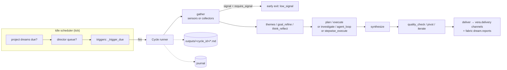

# 17 · Dream — Autonomous Reflection Engine

Dream is Vera's background cognition system. When the orchestrator has been
**idle** for a while, a scheduler picks a **trigger**, gates it on its time
window, cooldown and **sensor** signal, and runs a **dream cycle**: an ordered
pipeline of small capabilities — gather, themes, plan, execute or investigate,
synthesize, deliver — threaded through one shared state dict. Alongside the
idle-gated scheduler run two independent ambient loops: the **Director**, a
CPU-side "personal assistant" thought loop that can queue work and talk to the
user, and the **System Narrator**, a two-tier loop that narrates system state.

Source lives in `vera/dream/`: `dream_capabilities.py` (scheduler, sensors,
stages, cycle runner, director, narrator, review subsystem, ~150 capabilities,
~19k lines), `project_capabilities.py` (long-running projects and goals),
`dream_workflow_ir.py` (Workflow IR adapter for the generic pipeline) and three
panel files. It is the largest module in Vera. This page maps its architecture
and every capability group rather than documenting each cap's arguments.

**Status:** mature and in daily use, but **opt-in**. Ambient dreaming
(`dream.config.enabled`), the Director (`dream.director.config.enabled`) and the
Narrator (`narrator_enabled`) all default to **off** on a fresh install and
never auto-start in a dev sandbox. Manual runs (`dream.cycle.run`) work
regardless.

## Contents

- [1. Concepts & architecture](#1-concepts--architecture)
  - [The scheduler tick](#the-scheduler-tick)
  - [Workflow IR convergence](#workflow-ir-convergence)
- [2. Source map](#2-source-map)
- [3. Triggers](#3-triggers)
  - [3.1 Trigger record](#31-trigger-record)
  - [3.2 Firing decision (`_trigger_due`)](#32-firing-decision-_trigger_due)
  - [3.3 Schedules, timezones and catch-up](#33-schedules-timezones-and-catch-up)
  - [3.4 Lifecycle](#34-lifecycle)
  - [3.5 Trigger capabilities](#35-trigger-capabilities)
  - [3.6 Default triggers](#36-default-triggers)
- [4. Sensors — firing gates (and collectors — content)](#4-sensors--firing-gates-and-collectors--content)
  - [4.1 Idle detection](#41-idle-detection)
  - [4.2 Sensor catalogue](#42-sensor-catalogue)
  - [4.3 Collectors](#43-collectors)
  - [4.4 Custom sensors](#44-custom-sensors)
- [5. Stages — reasoning & acting](#5-stages--reasoning--acting)
  - [5.1 Stage catalogue](#51-stage-catalogue)
  - [5.2 Prompting style — one-shot vs agentic loop](#52-prompting-style--one-shot-vs-agentic-loop)
  - [5.3 Iteration, pivot and continuation](#53-iteration-pivot-and-continuation)
  - [5.4 Agent-loop settings](#54-agent-loop-settings)
- [6. Running cycles](#6-running-cycles)
  - [6.1 Cycle lifecycle](#61-cycle-lifecycle)
  - [6.2 Output workspace — files, not context](#62-output-workspace--files-not-context)
  - [6.3 Workflow-trigger evidence](#63-workflow-trigger-evidence)
- [7. Human-in-the-loop & safety](#7-human-in-the-loop--safety)
- [8. Higher-level constructs](#8-higher-level-constructs)
  - [8.1 Thinking loops](#81-thinking-loops)
  - [8.2 Composite pipelines and templates](#82-composite-pipelines-and-templates)
  - [8.3 Source review subsystem](#83-source-review-subsystem)
  - [8.4 Journal](#84-journal)
  - [8.5 Dream chat](#85-dream-chat)
- [9. The Director](#9-the-director)
- [10. The System Narrator](#10-the-system-narrator)
- [11. Chat → projects & thoughts](#11-chat--projects--thoughts)
- [12. Projects](#12-projects)
- [13. Delivery channels](#13-delivery-channels)
- [14. UI](#14-ui)
- [15. Configuration](#15-configuration)
- [16. Events and storage](#16-events-and-storage)
- [17. Worked examples](#17-worked-examples)
- [18. Failure modes and troubleshooting](#18-failure-modes-and-troubleshooting)
- [See also](#see-also)

---

## 1. Concepts & architecture

| Concept | Meaning |
|---|---|
| **Trigger** | The unit of configuration: when to run, what to sense, which pipeline, how to deliver. Stored in Redis hash `vera:dream:triggers`. |
| **Sensor** | A read-only `dream.sensor.*` cap that returns `{source, count, signal, sample, summary}`. Sensors **gate** firing. |
| **Collector** | Any capability call listed in a trigger's `collect`; provides the cycle's **content**. |
| **Stage** | A `dream.stage.*` cap that takes and returns the shared `state` dict. |
| **Cycle** | One run of a trigger's pipeline, with an 8-char `cycle_id`, live progress, journal and output files. |
| **Project** | A long-running body of work with user and LLM context that dream cycles advance. |
| **Director** | Ambient CPU-side thought loop that reports, converses and queues actions. |
| **Narrator** | Ambient two-tier narration of system state, independent of cycles. |



A dream cycle is an ordered list of stage capability names threaded with a shared state dict — the same pattern as the [DAG engine](./03-dag-engine.md), but self-initiated. Each stage is a real `@capability`: add, swap or reorder stages, or register a new `dream.stage.X` cap (or a custom stage) and list it in a trigger's pipeline.

### The scheduler tick

`_scheduler_loop` wakes every `tick_interval_seconds` (default 60). Each tick it checks, in order, and stops at the first gate that fails:

1. `dream.config.enabled` is true (default **false**).
2. No cycle is already running (one cycle at a time).
3. No interactive user is active (`defer_background_now()` — sees chat LLM traffic and UI activity pings).
4. Idle time ≥ `min_idle_minutes` (global, default 15).
5. No system-side long-term scheduled action is running (`longterm_scheduler.system_schedule_busy()`).
6. **Project dreams first:** the most-starved active project with `dream_trigger_names`, whose trigger's idle, hours and `min_interval_minutes` gates pass, is fired via `project.dream.run`.
7. **Director queue next:** the oldest queued Director action is executed (requeued if it cannot run now).
8. **Triggers:** the first trigger for which `_trigger_due` is true is fired. At most one cycle starts per tick.

### Workflow IR convergence

The built-in generic pipeline (`gather → themes → plan → execute → synthesize →
deliver`, `DEFAULT_GENERIC_DREAM_PIPELINE`) compiles to normalized Workflow IR
before it runs. This path is used when a trigger has neither an inline
`pipeline` nor a `pipeline_ref`. The validated IR stage plan — not a parallel
hard-coded list — is authoritative for that narrow path. Dream still owns stage
invocation, cancellation, low-signal exit, HITL, journals, artifacts, live
progress and cycle persistence. This separates the portable workflow
description from Dream product policy without introducing a second executor or
changing custom and iterative pipelines.

Each migrated cycle records the Workflow IR version, stable content hash, stage
IDs and execution owner (`dream.native-stage-runner`, schema
`vera.dream.workflow/v1`) in its event, history record, detail record and
`meta.json`. The live Dream panel and cycle-detail view display that
provenance. Malformed ownership, stage order or task provenance fails closed
(duplicate or unknown stages raise `DreamWorkflowContractError`); it cannot
silently fall back to the legacy list.

---

## 2. Source map

| Path | Responsibility |
|---|---|
| `vera/dream/dream_capabilities.py` | Constants and Redis keys, default triggers, pipeline templates, sensors (built-in and custom), stages, cycle runner, scheduler, Director, Narrator, trigger caps, composite pipelines, deep source review, dream chat, stepwise stage, listing, timeline projection, panel registration, startup. |
| `vera/dream/project_capabilities.py` | `project.*` and `goals.*` caps: projects, plans, artifacts, loops, context assembly and incremental update, project dreams, git integration, Projects panel. |
| `vera/dream/dream_workflow_ir.py` | Compiles and materialises the generic pipeline as Workflow IR. |
| `vera/dream/dream_panel.html` | The Dream panel (triggers, live cycle, flow builder, timeline, director, journal, projects view). |
| `vera/dream/dream_review_panel.html` | Deep source review panel (`/dream/review/panel`). |
| `vera/dream/dream_pipelines_panel.html` | Legacy pipelines page. Not served by any route; pipelines are managed in the Dream panel. |
| `vera/delivery.py`, `vera/output_formats.py` | Delivery-channel and output-format registries used by `deliver` and `synthesize`. |
| `vera/execution/workflow_schedule.py`, `workflow_trigger.py`, `workflow_trigger_receipts.py` | Shared schedule evaluator, trigger envelope and receipt ledger used by the scheduler gate. |

---

## 3. Triggers

### 3.1 Trigger record

`dream.trigger.upsert` (`POST /dream/trigger/upsert`) creates or updates a trigger; omitted fields keep their stored values. A new trigger starts from these defaults: sensors `[memory_recent]`, pipeline `gather → themes → synthesize → deliver`, mode `synthesize_only`, hours 0–24 UTC, `min_idle_minutes` 15, `min_interval_minutes` 120, `require_signal` 0.2, deliver to `memory`, depth `standard`, `max_steps` 6.

| Field group | Fields | Notes |
|---|---|---|
| Identity | `name`, `label`, `description`, `enabled` | |
| When | `hours_start`, `hours_end`, `timezone` (arg `timezone_name`), `min_idle_minutes`, `min_interval_minutes` | Local hours in the trigger's IANA zone; cooldown measured from the last completed run. |
| What to sense | `sensors`, `sensor_params`, `require_signal`, `collect` | `sensor_params[<sensor>]` may add `match`, `match_field`, `min_signal`, `negate`. |
| How to act | `pipeline` or `pipeline_ref`, `mode`, `stage_params`, `stage_config`, `depth` (`brief`/`standard`/`deep`/`exhaustive`), `max_steps`, `prompt`, `goals` | `mode` ∈ `synthesize_only`, `plan_execute`, `oneshot`, `stepwise`. `synthesize_only` makes the `plan` stage skip; otherwise behaviour follows the pipeline. |
| Iteration | `iterate`, `pivot`, `max_continuation_depth`, `loop_settings`, `handover` | See [§5.3](#53-iteration-pivot-and-continuation). |
| Safety | `hitl`, `whitelist`, `no_hitl_caps` | Per-trigger whitelist overrides the global one. |
| Delivery | `deliver_to`, `deliver_config` (`{channel: {format, target}}`) | See [§13](#13-delivery-channels). |
| Scope | `project`, `director_managed`, `journal` (default on), `persist_to_memory` | |
| Editor | `flow_graph` | The `<vera-flow-builder>` canvas; the runner ignores it and uses `sensors`/`pipeline`. |

### 3.2 Firing decision (`_trigger_due`)

A trigger fires only when **all** of these hold:

1. Its lifecycle state is `active` and `enabled` is true.
2. Current idle ≥ the trigger's `min_idle_minutes`.
3. The current local time is inside its hours window (`within_schedule_window`).
4. The recurrence is due since the last completed run (`recurrence_due`).
5. If it has sensors, `_eval_trigger_sensors` passes:
   - each sensor runs with its `sensor_params` (minus the gate keys);
   - `signal` = the **maximum** sensor signal, which must be ≥ `require_signal`;
   - a per-sensor `min_signal` floor fails that sensor if not met;
   - `match` is a regex (falling back to a substring) tested against `match_field` = `sample`, `summary` or `all` (the whole result JSON); `negate` inverts it;
   - all configured match conditions must hold. Otherwise a `dream.trigger.gated` event records why.

Sensors are evaluated again for content inside the cycle unless the trigger declares `collect`. The cycle has its own low-signal exit: if the **gather** signal is below `require_signal` (and the run is not forced), the cycle ends with `early_exit: {reason: "low_signal"}` and delivers nothing.

### 3.3 Schedules, timezones and catch-up

Trigger hours are local to the trigger's explicit IANA timezone (UTC by
default). The trigger editor exposes that timezone alongside the start/end
hours. Dream validates the zone and window before saving; an invalid schedule
fails closed before sensor collection or cycle creation. Overnight windows are
supported, and `0–24` (or equal endpoints) denotes a full day.

Cooldown recurrence is anchored to the previous completed run and measured as
elapsed UTC time, while the hours window is evaluated in local civil time. This
keeps recurrence duration stable through daylight-saving transitions without
making users express their desired working window in UTC. Trigger detail
returns the content-addressed, non-executing schedule contract used for the
decision.

After downtime, Dream does not replay every missed interval. Its explicit
schedule policy coalesces the backlog into at most one eligible cycle, which
must still pass the local-hours, idle, sensor, resource and exclusion gates.
The trigger editor states this behaviour, while trigger detail, timeline and
upcoming-event records expose the policy identity and maximum catch-up count.
The accompanying decision event reports how many intervals were missed but can
neither start a cycle nor replay effects.

### 3.4 Lifecycle

Trigger lifecycle is distinct in the API and UI. **Pausing** is reversible and
prevents scheduler selection; **cancelling** is terminal but retains the
trigger for audit (a cancelled trigger cannot be resumed or re-enabled);
**deleting** removes it. The trigger list labels paused and cancelled records,
disables manual run for cancelled records, and exposes separate cancel/delete
actions so these meanings are not collapsed into one boolean.

### 3.5 Trigger capabilities

| Cap | Route | Purpose |
|---|---|---|
| `dream.trigger.list` / `dream.trigger.get` | `/dream/trigger/…` | Browse triggers; detail includes schedule contract, policy and lifecycle. |
| `dream.trigger.upsert` | `POST /dream/trigger/upsert` | Create or update. |
| `dream.trigger.pause` / `resume` / `cancel` | | Reversible pause/resume; terminal cancel that keeps the record. |
| `dream.trigger.delete` | | Explicit deletion. |
| `dream.trigger.toggle` | | Compatibility toggle (delegates to pause/resume). |
| `dream.trigger.generate` | `POST /dream/trigger/generate` | **LLM**: draft a complete trigger from a description. Returns a draft; does not persist. |
| `dream.templates.list` / `dream.templates.apply` | `GET /dream/templates`, `POST /dream/templates/apply` | Apply a pipeline template (overwrites pipeline, mode, depth, `max_steps`; keeps schedule, sensors, delivery). |

### 3.6 Default triggers

Default triggers are seeded once on a fresh install. On later starts, only triggers that are genuinely new in code (not previously seeded and not present) are merged in, so user edits and deletions are respected. Examples:

| Trigger | Window (local) | Purpose |
|---|---|---|
| `morning_news` | 05–09 | Overnight RSS (fabric sources tagged `news,rss`) → morning brief to Telegram + memory. |
| `research_followup` | all day | Iteratively deepen the most promising open research thread (`investigate`, up to 6 iterations). |
| `error_review`, `system_health`, `stuck_detector`, `bus_watcher` | — | Operational watching. |
| `wander`, `agentic_explore`, `memory_cluster_dream`, `memory_gardener`, `memory_consolidation` | — | Exploration and memory upkeep. |
| `code_reflection`, `code_change_review`, `source_review`, `source_review_wander`, `source_review_continue`, `source_review_deep` | — | Source review family (see [§8.3](#83-source-review-subsystem)). |
| `fabric_digest`, `fabric_anomaly_watcher`, `cap_usage_analytics`, `activity_summariser`, `project_pulse`, `skills_review`, `integration_scout`, `content_creator`, `weekly_recap`, `morning_planner`, `telegram_digest`, `ide_session_recap`, `research_brief`, `research_iterate_review`, `deep_research_proposal`, `agentic_research_run`, `research_continue` | — | Digests, analytics and research. |
| `loop_eval_nightly`, `markets_evolve_nightly`, `observe_selfheal` | 02–07 | Nightly evaluation, market strategy evolution and self-heal reports. |

**Daily report dreams** (collector-based; deliver to notebook + memory by default — add `podcast`/`telegram`/`email`/`html` per trigger):

| Trigger | Window | Content |
|---|---|---|
| `daily_ai_report` | 06–11 | Wider AI/ML news, releases, research (`web.search`). |
| `daily_local_ai_report` | 06–12 | Local/self-hosted AI: open weights, llama.cpp/ollama ecosystem, hardware. |
| `daily_homelab_report` | 07–12 | Homelab and self-hosting releases and community highlights. |
| `security_watch` | all day | Terse CVE/breach ledger; accretes into its journal and fabric, flags homelab-relevant items with `[STACK]`. Delivers to memory. |
| `weekly_security_digest` | 08–20, ~weekly cooldown | Synthesises the week of `security_watch` ledgers into a digest with actions. |
| `daily_ops_report` | 17–23 | Detailed self-report: cycles run, outcomes, durations, errors, cap usage, director activity, tuning suggestions. |

> [!NOTE]
> Default triggers ship `enabled: true`, but nothing fires until the scheduler itself is enabled (`dream.config.set {enabled: true}` and `dream.scheduler.start`).

---

## 4. Sensors — firing gates (and collectors — content)

**Sensors gate, collectors feed.** A sensor's job is to decide *whether* a trigger should fire. Its thin, truncated samples are tuned for that decision, not for reasoning over. A trigger that wants a substantial working set declares **`collect`** — real data-gathering cap calls ([§4.3](#43-collectors)). Without `collect`, sensors are also run for content (legacy behaviour).

### 4.1 Idle detection

`_idle_minutes()` scans the 120 most recent capability calls (`vera:cap:recent`) for the newest one that counts as user activity:

- Ignored: anything from a `dream*` session, and read-only or infra prefixes (`dream.`, `obs.`, `health.`, `ui.`, `syslog.`, `cluster.`, `ollama.`, `caps.`, `mcp.`, `jobs.list`/`stats`/`status`…, `sysmon.`, `sysinfo.`, `metrics.`, …).
- Counted: caps whose prefix is in the effective **idle-reset prefixes**. By default these follow the cap-tracking system's tracked groups (`idle_reset_follow_tracking: true`). If tracking is unavailable they fall back to `llm.`, `agent.`, `research.`, `tg.send`, `tg.notify`. Editing `idle_reset_prefixes` switches to override mode.
- No qualifying call → idle `99999`. A Redis failure → idle `0` (fail safe: never dream).

### 4.2 Sensor catalogue

`dream.sensors.list` enumerates registered sensors (`SENSOR_REGISTRY`) with parameters; `dream.sensor.preview` runs one for inspection.

| Group | Sensor (`dream.sensor.<id>`) | What it reads |
|---|---|---|
| Memory | `memory_recent` | Recent memory records (chatter filtered). |
| | `memory_session` | A specific session. |
| | `memory_graph_walk` | A random graph walk. |
| Fabric | `fabric_recent`, `fabric_dataset` | Recent records; one dataset. |
| | `fabric_by_tag` | Auto-discover sources by tag (e.g. `news,rss`). |
| | `fabric_by_source_type` | By source type (rss/api/http/wiki). |
| External | `web_feed` | A web/RSS feed URL. |
| | `news_overnight` | Overnight RSS. |
| | `research_recent` | Recent research jobs (optionally full content of top N). |
| | `topic_research` | Memory + fabric + web search on a subject; surfaces only **new** items. |
| | `topics` | Composite candidate topics and entities from projects, source changes, research, schedule… |
| System | `syslog_errors`, `bus_events`, `cap_calls` | Errors/warnings; event bus; cap calls by prefix. |
| Workspace / projects | `notebook_recent`, `ide_workspace`, `project_context`, `active_projects` | Notebook entries; IDE changes; one project's context; projects inferred from cap-call clustering. |
| Source | `source_changes`, `source_review_state` | Code changes; review state. |

### 4.3 Collectors

```json
"collect": [
  {"cap": "web.search",         "label": "AI news",     "args": {"query": "…", "limit": 10}},
  {"cap": "dream.journal.read", "label": "Week's ledger", "args": {"journal_id": "trigger:security_watch", "limit": 250}, "max_items": 40}
]
```

When `collect` is present, `dream.stage.gather` calls each collector (emitting `dream.collect`), normalises the result into the working-set shape (`max_items`, default 40), and sets the gather signal to the **average** collector signal. Any cap family works. Edit collectors in the Pipeline config under *Content collectors*.

Without `collect`, gather runs each sensor (accepting full ids, short ids or `custom.*`), averages their signals, and honours a curated **seed**: `pinned_memory_ids`, `extra_fabric_ids` and `focus_topic` (a `memory.search` probe).

### 4.4 Custom sensors

| Cap | Purpose |
|---|---|
| `dream.sensor.custom.create` | Wrap any capability, DAG or Redis key as a sensor normalised to `{source, count, signal, sample, summary}`. |
| `dream.sensor.custom.list` / `delete` / `run` | Manage and run custom sensors (stored in `vera:dream:custom_sensors`). |

---

## 5. Stages — reasoning & acting

Stages receive `state` (which carries `trigger`, `seed`, `cycle_id`, `journal_id`, `gather`, `themes`, `findings`, `plan`, `report`, …) and return it mutated. A stage error is recorded as `state[stage] = {error}` and the cycle continues.

### 5.1 Stage catalogue

`dream.stages.list` enumerates `STAGE_REGISTRY` (each with a `phase` hint: gather / analyze / plan / act / emit).

| Group | Stage (`dream.stage.<id>`) | What it does |
|---|---|---|
| Context | `gather` | Builds the working set from collectors or sensors (required). |
| | `compose_topics` | Composite topic list and a focus topic. |
| | `enrich_context` | **LLM** asks what is missing, then fetches it via memory/fabric/web. |
| | `load_workspace` | Loads project workspace and context up front (`project.context.assemble` + RAG). |
| | `snapshot_source` | Fresh or reused source snapshot, diffed against a baseline. |
| Reasoning | `themes` | Themes via NLP modules, with an **LLM** fallback. |
| | `think_reflect` | Thinking-loop reflection on newly gathered items. |
| | `goal_refine` | Distils themes and data into **one** actionable goal. |
| | `plan` | Planner DAG constrained to the whitelist (skipped for `synthesize_only`). |
| Execution | `execute` | Runs the planned DAG; honours HITL. |
| | `cap_execute`, `dag_execute` | Run one configured capability, or a named/inline DAG. |
| | `stepwise_execute` | The designated **agentic** stage (tool-using loop by default). |
| | `agent_loop`, `investigate` | One-shot LLM or agent loop, per `prompt_style`. |
| | `project_action` | Executes concrete project next steps. |
| | `ide_workspace_act` | Off by default; drafts fixes for high-severity review files into a sandbox workspace. |
| | `ide_agent` | Bounded IDE agent loop over a seeded workspace. |
| Knowledge | `memory_deep_traverse` | 3–4-hop graph traversal from seed topics (orphans, clusters). |
| | `fabric_explore` | Datasets and entities needing processing. |
| Output | `synthesize` | **LLM** writes the report (honours `depth`, `REVIEW_STYLES` and `ANTI_HALLU` grounding). |
| | `propose_action` | **LLM** proposes one concrete next action. |
| | `quality_check` | **LLM** grades the report 1–10 on groundedness, specificity and usefulness (`state.quality`). |
| | `deliver` | Routes the report to channels ([§13](#13-delivery-channels)). |
| Code review | `review_codebase`, `review_report`, `deep_review` | See [§8.3](#83-source-review-subsystem). |
| Iteration | `pivot`, `iterate` | See [§5.3](#53-iteration-pivot-and-continuation). |

Custom stages mirror custom sensors: `dream.stage.custom.create` / `list` / `delete` wrap a capability (called with the state as kwargs) or a DAG (stored in `vera:dream:custom_stages`).

### 5.2 Prompting style — one-shot vs agentic loop

The three "brain" stages `agent_loop`, `investigate` and `stepwise_execute` support a **per-stage prompting style**, set in `stage_config.<stage>.prompt_style`:

- **`one_shot`** — a single grounded LLM prompt (no tools), streamed to the panel via the same Ollama path as the rest of the pipeline. Use it for pure **analysis or documentation** generation, where a tool loop is wasted cost.
- **`agent_loop`** — the tool-using loop. Use it when the task must *do* things: call tools, gather evidence iteratively, or edit.

| Stage | Default style |
|---|---|
| `stepwise_execute` | `agent_loop` (the designated agentic stage) |
| `agent_loop` | `one_shot` |
| `investigate` | `one_shot` |

Pick it in the Composite Pipelines editor (a dropdown appears for each of these stages) or by hand in the stage-config JSON. A trigger- or pipeline-level `prompt_style` sets a default for all its stages.

**Source review is always one-shot**: `review_codebase` runs one streaming review per file and `deep_review` streams per chunk — they never hand over to the agent loop. Drafting fixes (which *does* need to edit) lives in the separate `source_review_fix` pipeline via `ide_workspace_act`.

> [!NOTE]
> Existing installs are migrated automatically on startup: stale `source_review*` pipelines that still contained agentic stages are rewritten to one-shot, and any pre-existing pipeline or trigger whose `agent_loop`/`investigate` stage has a whitelist that can act is pinned to `prompt_style: agent_loop`, so the one-shot default does not silently switch its tool loop off.

### 5.3 Iteration, pivot and continuation

| Mechanism | Config | Behaviour |
|---|---|---|
| **Iterate block** | `iterate = {enabled, max_iterations (6), min_iterations (1), iterate_stages (default [investigate]), convergence_min_new_findings (1)}` | The pipeline is split into pre / iterate / post stages. The iterate block repeats until `max_iterations`, or halts once a pass adds fewer new findings than the threshold (after `min_iterations`). Including an iterate stage implicitly enables it. Emits `dream.iterate.start` / `pass` / `end`. |
| **`iterate` stage** | `stage_config.iterate = {basis, max_iterations, max_runtime_s, satisfaction_target, min_idle_minutes, llm_decides, apply_goals, apply_sensors}` | **LLM** decides whether the dream is complete or should continue, and may refine goals and sensors; continuation reuses the pivot reschedule. |
| **`pivot` stage** | `pivot = {enabled, candidates, min_confidence, max_pivots}` | **LLM** decides whether findings warrant handing off to a **different** trigger: `state.pivot = {to_trigger, reason, focus_topic, confidence}`, then `dream.pivot.scheduled`. |
| **Continue** | `dream.cycle.continue` | New cycle on the same trigger seeded with the previous cycle's findings, next steps and report. Recursion is bounded by `max_continuation_depth`. |
| **Handover** | `handover` | Stage-to-DAG handover (`dream.handover.created`). |

### 5.4 Agent-loop settings

Dream stages that run an agent loop resolve settings from `DEFAULT_LOOP_SETTINGS` < global override (`dream.loop.settings.set`, Redis `vera:dream:loop_settings`) < per-trigger or pipeline `loop_settings` < project < seed. Key defaults: `loop_version: v5` (falls back v5 → v2 → v1 if unavailable), `max_cycles` 8, `triage_top_k` 16, `max_search_calls` 2, `max_steps` 6, `long_running_timeout_secs` 1800, `require_approval` false, `hitl_timeout_secs` 300, `enabled_steps` `plan,explore,think,act,verify`. Loop sessions are named `dream:<cycle_id>:<stage>` so the panel can re-attach to them.

---

## 6. Running cycles

| Cap | Route | Purpose |
|---|---|---|
| `dream.scheduler.start` / `stop` / `status` | `/dream/scheduler/…` | The idle scheduler. |
| `dream.cycle.run` | `POST /dream/cycle/run` | Run a trigger now. Bypasses idle, hours and cooldown; **preempts** a scheduler-fired cycle in flight (`dream.cycle.preempted`). Optional `seed`: `focus_topic`, `pinned_memory_ids`, `extra_fabric_ids`, `extra_prompt`, `force_caps`, `skip_stages`, `only_stages`. |
| `dream.cycle.continue` | `POST /dream/cycle/continue` | Continue from a previous cycle. |
| `dream.cycle.cancel` | | Abort the running cycle. |
| `dream.cycle.detail` | | Full record of one cycle. |
| `dream.cycle.progress` | | **Live, pollable progress snapshot**: per-stage status and elapsed time, LLM token heartbeat, agent-loop session (for re-attach), output files. The panel polls it every 3 s so activity keeps rendering when the event stream drops. |
| `dream.cycle.files` / `dream.cycle.file` | | List / read the cycle's output files. |
| `dream.llm.tokens` | `GET /dream/llm/tokens` | Per-cycle LLM token ring buffer (`limit` 500) for poll-rendering. |
| `dream.history` / `dream.last` / `dream.timeline` | | Past cycles, most recent, projected fire windows. |
| `dream.preview` / `dream.preview.last` | `POST /dream/preview` | Gather + themes + plan only; no execute, deliver or history. |
| `dream.schedule.events` | `GET /dream/schedule/events` | Projected fires as discrete calendar events. |
| `dream.background.status` | `GET /dream/background/status` | Whether ambient background work (v8 program loops, director handovers) may run now under the activity gate. |

### 6.1 Cycle lifecycle

1. Copy the trigger and apply the seed; resolve `pipeline_ref` (pipeline fields fill in whatever the trigger has not set inline).
2. Compile the generic pipeline to Workflow IR when applicable ([§1](#workflow-ir-convergence)).
3. Apply project isolation, split iterate stages, and assign one shared sandbox owner for the whole cycle (`goal-<slug>` or `dream-<trigger>`).
4. For each stage: emit `dream.stage.started`; run under `BACKGROUND_LLM` (so LLM calls are demoted off the GPU while a human is active) and the sandbox owner; emit `dream.stage.summary`; update progress; collate output files; append to the journal.
5. Low-signal early exit after `gather`.
6. Post stages, then finalise the output workspace, store cycle detail, optionally persist the dream graph to the memory "dream layer" (`persist_to_memory`, `dream.memory.persisted`), run the auto-continue, pivot and handover hooks.

### 6.2 Output workspace — files, not context

Every non-preview cycle collates its material into real files under `vera/dream/outputs/<cycle_id>/` as stages complete:

| File | Written by |
|---|---|
| `01-gather.md` | `gather` — the full, untruncated working set |
| `02-themes.md` | `themes` / `compose_topics` |
| `03-plan.md` | `plan` |
| `04-findings.md` | Appended per iteration by `think_reflect`, `investigate`, `agent_loop`, `stepwise_execute`, `project_action`, `execute`, `memory_deep_traverse`, `fabric_explore` |
| `report.md` | `synthesize` |
| `journal.md`, `meta.json` | Finalisation (meta includes Workflow IR provenance) |

The file list rides on the history record and cycle detail (chips → click to view). Agent loops launched by dream stages are instructed to collate substantial results into durable output (notebook/workspace files) rather than carrying everything in their context window.

### 6.3 Workflow-trigger evidence

When the idle scheduler selects a configured trigger, it also emits the shared
content-safe workflow-trigger envelope before starting the native cycle. Its
occurrence key is based on the trigger's previous completed run, so repeated
observation of the same due decision has stable identity while the next
recurrence receives a new identity. This evidence does not move idle, cooldown,
sensor, cancellation or cycle authority out of Dream, and event projection
failure cannot prevent the selected cycle from starting.

Before publishing that evidence, Dream also records the observation in the
shared durable trigger-receipt ledger. Re-observing the same due occurrence
after a process restart increments its receipt instead of inventing another
identity. This currently improves audit and duplicate diagnosis; it does not
gate cycle creation.

The timeline and upcoming-event projections use the same timezone-aware window
and elapsed-recurrence evaluator as the scheduler gate. Their records include
the IANA timezone, local time/UTC offset, canonical UTC instant and stable
schedule identity, so the UI can explain a projected slot instead of presenting
an ambiguous hour. These views remain forecasts: idle, sensors, resources and
other native gates can still prevent a projected event from firing.

---

## 7. Human-in-the-loop & safety

**HITL.** If a trigger has `hitl=true` and a Telegram admin chat is configured (`telegram_bridge`), the execute stage sends *"I've been thinking about X — should I do Y?"* and waits up to `default_hitl_timeout_s` (default 600) for a reply. Answer `yes`, `ok`, `go` or `do it` to approve; anything else cancels. Caps in the trigger's `no_hitl_caps` (or the global `vera:dream:no_hitl_caps`) bypass the prompt.

| Cap | Purpose |
|---|---|
| `dream.hitl.pending` | Approvals awaiting a human. |
| `dream.hitl.respond` | Approve or deny from the UI (`dream.hitl.ui_response`). |
| `dream.hitl.clear` | Drop stale pending approvals. |

**Capability whitelist.** A whitelist gates which tools the planner may use while dreaming — dreams can only run caps the admin has explicitly allowed. Defaults (memory, fabric, syslog, obs, nlp, `llm.generate`/`summarize`/`qa`, research continuation, IDE inspection, …) are seeded on first start. The plan stage additionally drops `dream.`, `obs.`, `health.`, `ui.`, `caps.`, `mcp.` and `echo` caps from the planner's view.

| Cap | Purpose |
|---|---|
| `dream.whitelist.list` / `dream.whitelist.set` | Manage the global allowlist. |
| `dream.caps.search` | Grouped cap search for the whitelist and curate pickers. |
| `dream.fabric.browse` / `dream.memory.browse` | Curate pickers for seeding a cycle. |
| `dream.config.get` / `dream.config.set` | Global settings ([§15](#15-configuration)). |

Other safety properties: one cycle at a time; dreams yield to interactive users and to system-scheduled work; LLM calls inside stages are background-priority; each cycle's sandbox use is confined to one owner container; low-signal or empty reports are never delivered (so they cannot pollute memory).

---

## 8. Higher-level constructs

### 8.1 Thinking loops

A thinking loop is a standing subject Vera reflects on during idle slots. `dream.think.create` (`subject`, `goal`, `source`, `idle_minutes` 20, `interval_minutes` 120, `project_slug`) creates a **trigger** with `pipeline_ref: "think"`, `persist_to_memory`, journalling and `require_signal: 0`. The `source` may be an RSS/web URL (→ `web_feed` sensor), a sensor id, or empty (self-reflective topic). Its journal id is `trigger:<name>`.

| Cap | Purpose |
|---|---|
| `dream.think.create` / `list` / `delete` | Manage thinking loops. |
| `dream.think.run` | Run one now (bypasses idle and interval gates). |
| `dream.think.stream` | Read the rolling thought stream (`GET /dream/think/stream`). |

### 8.2 Composite pipelines and templates

**Composite pipelines** are named, reusable stage sequences with their own `stage_config`, `iterate` and settings, stored in `vera:dream:pipelines` and referenced by a trigger's `pipeline_ref`.

| Cap | Purpose |
|---|---|
| `dream.pipeline.list` / `get` / `upsert` / `delete` | Pipeline CRUD. |
| `dream.pipeline.run` | Execute a saved pipeline. |

**Templates** (`PIPELINE_TEMPLATES`): `passive_report`, `agentic_investigate`, `deep_research`, `enriched_synthesis`, `think`, `code_review`, `memory_maintenance`, `project_action`, `deep_exploration`.

### 8.3 Source review subsystem

Autonomous codebase/document review with selectable output styles (shares `REVIEW_STYLES` — `docs`, `critique`, `improvement`, `integration`, `architecture` — from `vera/output_formats.py` with chat). `dream.review.run` reviews the whole project recursively; large files are **chunked, never truncated**. Reviews pause when the user becomes active and resume on the next idle slot (unless forced).

| Cap | Purpose |
|---|---|
| `dream.review.styles` / `dream.review.run` | List styles / launch a review (`styles`, `area`). |
| `dream.review.status` / `pause` / `resume` | Control a running review. |
| `dream.review.list` / `get` / `search` / `grep` | Browse review results. |
| `dream.review.areas` / `area_report` / `source` | Per-area drill-down. |
| `dream.review.runs` / `snapshots` / `clear` | Run history and cleanup. |

Stages: `snapshot_source` → `review_codebase` (deterministic per-file review; `stage_config.review_codebase = {review_type: changes|wander|continue, max_files 40, plan}`) → `review_report`; `deep_review` runs the deep engine across styles. Results live under `vera:dream:review:*`.

### 8.4 Journal

`dream.journal.append` / `read` / `list` / `clear` — Vera's running diary. Every cycle journals a per-stage note (unless `journal: false`), the Director logs to journal `director`, and the Narrator to `narrator`. Stored as Redis lists `vera:dream:journal:<id>` with an index hash `vera:dream:journals`.

### 8.5 Dream chat

`dream.chat` (`POST /dream/chat`) holds a follow-up conversation about one cycle's output, loading its report, themes and gather data as context (`cycle_id`, `message`, `history`).

---

## 9. The Director

The Director is a lightweight, continuously running thought loop. It is routed with `job_type="dream_director"` (CPU, no GPU) and backs off when the CPU pool is busy (`dream.director.backoff`).

- **User active** (idle < `active_idle_below_min`, default 6 min): thinks about recent activity and current events; worthwhile thoughts can be delivered to the active chat (and spoken).
- **User idle**: thinks broadly and queues candidates, which the scheduler executes at idle handover ([§1](#the-scheduler-tick)).
- **Conversation**: when the user replies (`dream.director.reply`), a conversation window opens (`conversation_window_min`, default 12) and replies are GPU-preferred dialogue.

Each think pass builds a briefing (calendar and todos, long-term goals, active projects, dream schedule and queue, v8 loop programs, business snapshot, user-vs-background activity, the live agentic loop, its recent thoughts and freshness rules) and asks for JSON `{thought, deliver, actions[]}`. **Silence is the normal output.** The model's `deliver: true` is honoured only if the user is active (when `only_on_activity`), outside `quiet_hours`, and past `deliver_cooldown_min` (30). Actions (up to 2) have `kind` ∈ `steer`, `dream`, `project`, `think`, `loop`, `program`, `business`. With `project_linked_only` (default true) only actions that advance an existing project (`project` with a slug, or `think` with a target) are executed; others are refused (`dream.director.refused`). Queued actions auto-drain after `auto_drain_min` (45) even if the user stays active.

Every `dream.director.thought` raises a small clickable notification in the Dream panel; clicking opens a reply popover that feeds your text back into its train of thought. The Director card has a standing Reply button, and diamonds on the activity timeline open the same popover on a past thought.

| Cap | Route | Purpose |
|---|---|---|
| `dream.director.start` / `stop` / `status` / `config` | `/dream/director/…` | Control and configure. |
| `dream.director.think` | `POST /dream/director/think` | One thought now (ignores backoff). |
| `dream.director.reply` | `POST /dream/director/reply` | Talk back; opens a conversation window. |
| `dream.director.journal` | `GET /dream/director/journal` | Its thought log. |
| `dream.director.queue` / `queue_run` / `queue_remove` / `queue_clear` | | Inspect and drive the action queue. |
| `dream.director.assess` | `POST /dream/director/assess` | **LLM** ranks triggers with `{name, action: fire|skip|defer, reason, priority 1–10}`; `auto_fire` fires the top `fire` among `director_managed` triggers, falling back to the most-due trigger. |

---

## 10. The System Narrator

The Narrator is a decoupled mode of the Director loop, independent of dream cycles, that gives Vera an evolving narrative, mood and overall "steer". It is enabled with `system.narrator.start` (sets `narrator_enabled`).

| Tier | Model (default) | Role |
|---|---|---|
| **Gatherer** | default resident model (`narrator_gatherer_model` = `""`) | Operates a read-only **probe kit** (health, performance, goals, loops, memory, dreams, nodes, …) to assemble a tailored state digest. Bounded by `narrator_max_probes` (6), `narrator_gather_budget_s` (420) and `narrator_gather_call_timeout_s` (150). Can pull the watched world from the `gatherer` agent's knowledge sources via `agent.rag.query`. |
| **Narrator** | `narrator_model` (a CPU-only MoE) | Turns the digest plus initial state into the narrative. At most every `narrator_gap_min` (12) minutes; `narrator_think_timeout_s` 600. Can use a GPU model when the user has been idle (`narrator_idle_gpu`). |
| **Quick take** | default resident model | Brief real-time observations every `narrator_quick_gap_min` (3) minutes between deep passes; skips the gather. |

**User intent.** `_narrator_detect_intent` infers what the user is working on from recent messages, cap calls, live loops and goals (heuristic floor plus an **LLM** pass returning `{focus, topics, mode, confidence, evidence, probes, queries}`). The intent pulls relevant context in and steers which probes run (`narrator_intent_*` settings; re-detected at most every 8 minutes; stale after 45).

Output length is tiered (`brief` / `standard` / `long`, `auto` for quick takes) and delivery goes to any of `chat`, `telegram`, `speak` (`narrator_deliver`, default none).

| Cap | Route | Purpose |
|---|---|---|
| `system.narrator.start` / `stop` / `status` / `config` | `/system/narrator/…` | Control and configure. |
| `system.narrator.think` | `POST /system/narrator/think` | One full pass now (gather → narrate). |
| `system.narrator.quick` | `POST /system/narrator/quick` | One quick take now. |
| `system.narrator.intent` | `POST /system/narrator/intent` | Read or re-detect the user intent (`detect`, `context`). |
| `system.narrator.stream` | `GET /system/narrator/stream` | Recent `{narrative, mood, steer, ts}` entries. |

---

## 11. Chat → projects & thoughts

The chat panel's per-message actions can route a finished answer into the dream system:

- **+ Project** — folds the message into a project's rolling `llm_context` (`project.note.add`), creating the project if you name a new one. This is the same incremental LLM-merge path a dream cycle uses.
- **Think later** — creates a thinking loop via `dream.think.create` (optionally scoped to a project) with the message as its goal; Vera revisits it each idle slot.

---

## 12. Projects

`vera/dream/project_capabilities.py` gives dream cycles long-running goals to advance rather than one-shot reflections. A project points at resources (fabric datasets, notebooks, chats, memory ids, IDE workspaces) and keeps two context fields: `user_context` (static, human-written) and `llm_context` (dynamic, folded in by each cycle through an incremental LLM update). Projects are stored in Redis hash `vera:dream:projects`, with history in `vera:dream:project_dreams:{slug}`.

| Group | Caps |
|---|---|
| CRUD | `project.list`, `project.get`, `project.upsert`, `project.delete`, `project.dedupe`, `project.merge` |
| Context | `project.context.assemble` (`POST /dream/projects/context/assemble`), `project.context.update`, `project.context.regenerate`, `project.note.add` |
| Dreams | `project.dream.run`, `project.dream.history`, `project.dream.complete_hook`, `project.thoughts.list` |
| Plans | `project.plan.get`, `project.plan.set`, `project.plan.advance` |
| Artifacts & loops | `project.artifacts.list`, `project.artifact.get`, `project.artifact.add`, `project.loop.record`, `project.loops.list` |
| Goals | `goals.list`, `goals.detail` |
| Discovery & chat | `project.search_targets`, `project.browse_resources`, `project.chat` |
| Git | `project.git.status`, `project.git.pull`, `project.git.push`, `project.git.log`, `project.git.provision` |

Related sensors and stages: `dream.sensor.project_context`, `dream.sensor.active_projects`, `dream.stage.load_workspace`, `dream.stage.project_action`. Active projects with `dream_trigger_names` are advanced automatically by the scheduler ([§1](#the-scheduler-tick)). The **Projects** tab (`project-panel`) opens the Dream panel at `#projects`.

---

## 13. Delivery channels

`dream.stage.deliver` does not hard-code sinks. Channels live in the shared registry **`vera/delivery.py`** — the routing twin of the output-format registry (`vera/output_formats.py`): built-in channels plus runtime channels contributed by the Skills library.

| Channel | Cap | Default format | Target |
|---|---|---|---|
| `telegram` | `tg.notify` | verbatim (pick `short` to reshape) | — |
| `memory` | `memory.store` | verbatim | — |
| `notebook` | `notebook.create` | `markdown` (report + journal) | — |
| `email` | `mail.send` | `email` | recipient (blank = default account) |
| `chat` | `chat.deliver` | `standard` | chat session id |
| `podcast` | `podcast.generate` | `audio` | — (non-blocking episode) |
| `html` | `report.html` | verbatim | — (rich HTML report) |

For each channel in `deliver_to`, the stage resolves the format (`deliver_config[channel].format`, else the channel default). Transformative formats run **one LLM reshape pass** ("reformat without adding, removing or inventing facts"); passthrough formats (markdown, standard, text…) are sent verbatim. Results are cached per format, so channels that share a format reshape once. The stage then calls `delivery.build_args` and the channel cap. `delivery.channels` lists the registry (the deliver UI is built from it).

In addition, every delivered report is ingested into the fabric dataset **`dream.reports`** (always on; not a selectable channel). Cycles with an early exit or an empty report deliver nothing.

**Authoring channels.** A `delivery_channel` skill **is** a registry entry: author one in the Skills library (cap, default format, optional fixed target) and it appears in the deliver UI automatically. This mirrors how an `output_format` skill becomes a chat output style. See [Skills & Ontologies §3.3](./18-skills-ontologies.md#33-output-format-and-delivery-channel-skills). Finished cycle reports can also be re-delivered later with `output.redeliver` ([Render](./28-render.md)).

---

## 14. UI

| Panel | Served at | Shows |
|---|---|---|
| **Dream** (`dream-panel`) | `/dream/panel` (`dream_panel.html`) | Triggers, pipeline builder, live cycle viewer, sensors/stages, whitelist, journal, Director, merged timeline and history, projects view. |
| **Dream Review** | `/dream/review/panel` (`dream_review_panel.html`) | Launch and browse deep source reviews. |
| **Projects** (`project-panel`) | `/dream/panel#projects` | Projects, plans, thoughts, artifacts. |

**Live view.** Besides the event-driven stream and agent-loop cards (`<vera-agent-loop-output>`), the Activity card renders a poll-driven progress rail from `dream.cycle.progress`: pipeline chips with per-stage status and real elapsed time, the agent-loop session (with a Watch re-attach), an LLM token heartbeat and the output-file chips. Project and goal dreams and long loops therefore stay visible even if the event subscription drops mid-cycle.

**Timeline and history (merged).** The Timeline entry opens one section: an *activity timeline* (one lane per dream feature — project dreams, source review, reports, security, research, Director thoughts — with bars sized by each cycle's real duration; click a bar to open the record, click a ◆ to reply to a Director thought), a compact *upcoming fire windows* chart, and the searchable history list.

**Pipeline builder.** The canvas (`<vera-flow-builder>`, see [Flow Builder](./20-flow-builder.md)) is the default view when a trigger is selected; the compact list remains available via the toggle (remembered in `localStorage`). The canvas is stored in the trigger's `flow_graph`.

---

## 15. Configuration

Global config (`dream.config.get` / `dream.config.set`, Redis `vera:dream:config`):

| Key | Default | Meaning |
|---|---|---|
| `enabled` | `false` | Ambient dreaming on/off (opt-in). |
| `min_idle_minutes` | `15` | Global idle gate. |
| `tick_interval_seconds` | `60` | Scheduler cadence. |
| `telegram_bridge` | `true` | HITL via Telegram. |
| `default_hitl_timeout_s` | `600` | HITL wait. |
| `llm_prefer_gpu` | `true` | Prefer GPU for stage LLM calls (still demoted while a human is active). |
| `max_history` | `200` | History records kept. |
| `idle_reset_follow_tracking` | `true` | Idle-reset prefixes follow cap tracking. |
| `idle_reset_prefixes` | — | Explicit override list. |

Director config (`dream.director.config`, Redis `vera:dream:director:cfg`): `enabled` (false), `tick_seconds` 240, `think_gap_min` 20, `active_idle_below_min` 6, `deliver_to_chat` true, `speak` true, `max_queue` 12, `thought_memory` 8, `user_name`, `tone` (`warm`), `only_on_activity` true, `quiet_hours` (`HH:MM-HH:MM`), `auto_drain_min` 45, `deliver_cooldown_min` 30, `project_linked_only` true, plus all `narrator_*` keys ([§10](#10-the-system-narrator)).

Agent-loop settings: [§5.4](#54-agent-loop-settings). A Loop Lab dev sandbox never auto-starts the scheduler or Director.

---

## 16. Events and storage

| Redis key | Holds |
|---|---|
| `vera:dream:config`, `vera:dream:triggers`, `vera:dream:seeded_trigger_names` | Config, triggers, seeding record |
| `vera:dream:history`, `vera:dream:last_trigger_run`, `vera:dream:running`, `vera:dream:progress:<cycle>` | History, cooldown anchor, running flag, live progress |
| `vera:dream:whitelist`, `vera:dream:no_hitl_caps`, `vera:dream:hitl_pending`, `vera:dream:hitl_response` | Safety |
| `vera:dream:pipelines`, `vera:dream:custom_sensors`, `vera:dream:custom_stages`, `vera:dream:loop_settings` | Registries |
| `vera:dream:journal:<id>`, `vera:dream:journals` | Journals |
| `vera:dream:director:*`, `vera:system:narrator:*` | Director queue/thoughts/conversation; narrator last/thoughts/intent |
| `vera:dream:projects`, `vera:dream:project_dreams:<slug>` | Projects |
| `vera:dream:review:*` | Review reports, status, run log |

Files: `vera/dream/outputs/<cycle_id>/`. Fabric: `dream.reports`.

Key events: `dream.scheduler.started` / `stopped`, `dream.trigger.gated`, `dream.cycle.started` / `completed` / `preempted` / `continued`, `dream.stage.started` / `summary` / `completed`, `dream.collect`, `dream.iterate.start` / `pass` / `end`, `dream.pivot.scheduled`, `dream.handover.created`, `dream.hitl.requested` / `telegram_sent` / `responded` / `timeout` / `cleared`, `dream.llm.start` / `complete` / `error`, `dream.agent_loop.start` / `complete`, `dream.memory.persisted`, `dream.project.autofire`, `dream.director.thought` / `backoff` / `handover` / `refused` / `steered` / `assessed`, `dream.narrator.thought` / `quick` / `intent` / `backoff`, `dream.review.run.start` / `progress` / `file` / `run.done`, `dream.journal.entry`.

---

## 17. Worked examples

Enable dreaming and start the scheduler:

```json
{"name": "dream.config.set", "arguments": {"enabled": true, "min_idle_minutes": 20}}
{"name": "dream.scheduler.start", "arguments": {}}
```

A collector-based weekly report that fires only when there is new material about a subject:

```json
{"name": "dream.trigger.upsert", "arguments": {
  "name": "weekly_rust_digest", "label": "Weekly Rust digest",
  "sensors": ["dream.sensor.topic_research"],
  "sensor_params": {"topic_research": {"subject": "Rust async runtimes", "min_signal": 0.3}},
  "collect": [{"cap": "web.search", "label": "news",
               "args": {"query": "Rust async runtime release", "limit": 10}}],
  "pipeline": ["dream.stage.gather", "dream.stage.themes",
               "dream.stage.synthesize", "dream.stage.quality_check",
               "dream.stage.deliver"],
  "hours_start": 8, "hours_end": 18, "timezone_name": "Europe/London",
  "min_interval_minutes": 10080, "require_signal": 0.2,
  "deliver_to": ["notebook", "email"],
  "deliver_config": {"email": {"format": "email", "target": "me@example.org"}}}}
```

Run it now with a focus topic, then export the report:

```json
{"name": "dream.cycle.run", "arguments": {"trigger_name": "weekly_rust_digest",
  "seed": {"focus_topic": "tokio vs smol"}}}
{"name": "render.dream_export", "arguments": {"cycle_id": "<cycle_id>", "format": "pdf"}}
```

Create a thinking loop on an RSS feed:

```json
{"name": "dream.think.create", "arguments": {
  "subject": "Homelab storage", "goal": "Spot changes worth acting on",
  "source": "https://example.org/feed.xml", "interval_minutes": 240}}
```

---

## 18. Failure modes and troubleshooting

| Symptom | Check |
|---|---|
| Nothing ever fires | `dream.config.enabled` false (the default), scheduler not started, dev sandbox, user never idle long enough (`dream.scheduler.status` / idle minutes), or a system-scheduled action is running. |
| A specific trigger never fires | Lifecycle paused/cancelled, outside its local hours, cooldown not elapsed, or sensor gate failing — look for `dream.trigger.gated` events and `dream.timeline`. |
| Idle never accrues | A client keeps calling idle-reset caps. Check `idle_reset_prefixes` / tracking mode. |
| Cycle ends immediately | `early_exit: low_signal` — gather signal below `require_signal`. Lower it or add collectors. |
| Report empty or ungrounded | Sensors returned thin samples; use `collect`. Inspect `01-gather.md` and `quality_check` scores. |
| Nothing delivered | Early exit or empty report (by design), channel cap unavailable, or an unknown channel id in `deliver_to`. |
| Panel stops updating | Event stream dropped; the progress rail keeps polling `dream.cycle.progress`. |
| Director silent | Disabled (default), CPU backoff, quiet hours, cooldown, `only_on_activity`, or nothing new — silence is normal. |
| Director actions refused | `project_linked_only` rejects actions not tied to an existing project. |
| Invalid schedule on save | Bad IANA zone or hours window — the save fails closed. |

---

## See also

- [DAG Engine](./03-dag-engine.md) — the pipeline/execution pattern dream stages build on; agentic-loop engines
- [Memory Graph](./05-memory-graph.md) & [Data Fabric](./06-data-fabric.md) — the primary sensor sources, and where deliveries land
- [Agents & Chat](./19-agents-chat.md) — `dream.stage.agent_loop` reuses the agentic loop; chat actions feed projects and thoughts
- [Research System](./07-research.md) — `dream.sensor.research_recent` surfaces research artifacts
- [Integrations](./23-integrations.md) — Telegram delivery and HITL approvals
- [Skills & Ontologies](./18-skills-ontologies.md) — delivery-channel and output-format skills
- [Render](./28-render.md) — `render.dream_export`, `report.html`, `output.redeliver`
- [Podcast](./31-podcast.md) — the `podcast` delivery channel
- [Flow Builder](./20-flow-builder.md) — the pipeline canvas

## Screenshots (operator-captured)

<!-- VERA:AUTO:screenshots START -->
_No screenshots captured yet — run `docs.build` (or `operator.mission.run documentation`)._
<!-- VERA:AUTO:screenshots END -->

## Capabilities

<!-- VERA:AUTO:capabilities START -->
_No capabilities resolved for this domain._
<!-- VERA:AUTO:capabilities END -->
