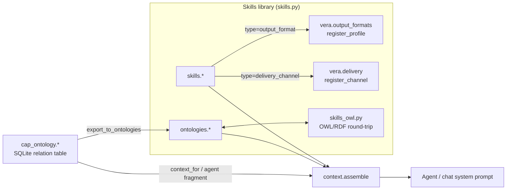

# 18 · Skills & Ontologies

Three related but distinct knowledge layers shape how Vera's agents reason.
**Skills** are reusable prompt fragments (persona, method, examples, tool
hints, output formats, delivery presets). **Domain ontologies** are structured
schemas — entities, relationships, processing rules, memory slots — with native
OWL 2 DL and SKOS fields. The **capability ontology** is a different kind of
thing: a directed cap × cap relation table that describes how capabilities
compose, used as planner and agent context.

| Layer | Module | Cap group | What it is |
|---|---|---|---|
| **Skills** | `vera/skills/skills.py` | `skills.*` | Named prompt fragments that augment LLM/agent behaviour; also the authoring surface for output formats and delivery channels. |
| **Domain ontologies** | `vera/skills/skills.py` + `vera/skills/skills_owl.py` | `ontologies.*` | Structured knowledge schemas — *how to process data*. |
| **Capability ontology** | `vera/ontologies/cap_ontology.py` | `cap_ontology.*` | A cap × cap relationship table — *the system map for the planner*. |

**Status:** skills and domain ontologies are stable and in daily use through
chat context assembly and agent records. The capability ontology is stable for
manual relations. LLM-generated relations are kept for review, but persistent
bulk generation and their use in prompts are **disabled by default** (see
[§5.4](#54-generated-relations-evaluation-and-defaults)).

## Contents

- [1. Concepts & architecture](#1-concepts--architecture)
- [2. Source map](#2-source-map)
- [3. Skills](#3-skills)
  - [3.1 Skill types and how they are injected](#31-skill-types-and-how-they-are-injected)
  - [3.2 Built-in skills](#32-built-in-skills)
  - [3.3 Output-format and delivery-channel skills](#33-output-format-and-delivery-channel-skills)
  - [3.4 Skill capabilities](#34-skill-capabilities)
- [4. Domain ontologies](#4-domain-ontologies)
  - [4.1 Record shape](#41-record-shape)
  - [4.2 Ontology capabilities](#42-ontology-capabilities)
  - [4.3 OWL / SKOS interop](#43-owl--skos-interop)
- [5. Capability ontology — the planner's system map](#5-capability-ontology--the-planners-system-map)
  - [5.1 Relation model](#51-relation-model)
  - [5.2 Capability reference](#52-capability-reference)
  - [5.3 Planner integration & the "adjacent hidden cap" trick](#53-planner-integration--the-adjacent-hidden-cap-trick)
  - [5.4 Generated relations: evaluation and defaults](#54-generated-relations-evaluation-and-defaults)
  - [5.5 Curated ontology context ranking](#55-curated-ontology-context-ranking)
- [6. How skills and ontologies reach an agent](#6-how-skills-and-ontologies-reach-an-agent)
- [7. UI panels](#7-ui-panels)
- [8. Configuration](#8-configuration)
- [9. Events and storage](#9-events-and-storage)
- [10. Worked examples](#10-worked-examples)
- [11. Resolution, composition, safety and troubleshooting](#11-resolution-composition-safety-and-troubleshooting)
- [See also](#see-also)

---

## 1. Concepts & architecture



- A **skill** shapes *tone and method*. An **ontology** shapes *structure and meaning*. The **capability ontology** shapes *which tools compose with which*.
- None of them grants permission to call a tool. Capability allowlists (`domain_caps`) and runtime policy stay authoritative.

---

## 2. Source map

| Path | Responsibility |
|---|---|
| `vera/skills/skills.py` | Skill and ontology stores, CRUD caps, `skills.apply`, `skills.compose`, `ontologies.apply`/`infer`, `skills.active_context`, built-in seeds, output-format and delivery-channel bridges, persistence. |
| `vera/skills/skills_owl.py` | OWL 2 DL + SKOS schema extension, RDF import/export (rdflib), class/property/restriction editing, validation. |
| `vera/skills/skills_panel.html` | Standalone Skills editor (served at `/ui/panels/skills-panel`). |
| `vera/ontologies/ontologies_panel.html`, `ontologies_owl_panel.js` | Ontologies browser + OWL editor (served at `/ui/panels/ontologies-panel`). |
| `vera/ontologies/cap_ontology.py` | Capability relation table, descriptions, LLM inference jobs, planner/agent context fragments, panel. |
| `vera/ontologies/cap_ontology_panel.html` | Cap × cap matrix editor (served at `/cap_ontology/panel`). |
| `vera/ontologies/capability_ontology_snapshot.py` | Content-addressed snapshot builder; env-flag status for auto-generation and generated-relation use. |
| `vera/ontologies/capability_ontology_evaluation.py` | Deterministic comparison harness behind `eval.ontology.decision`. |
| `vera/ontologies/context_ranker.py` | `CuratedOntologyContextRanker` — optional reranking of context items from a curated assertion snapshot. |
| `vera/fabric/context.py` | `context.assemble` — renders skills/ontologies/cap-mesh into the agent prompt. |
| `vera/agents_skills_ontologies_panel.html` | Combined **Agents** tab (agents + skills + ontologies). |

---

## 3. Skills

A skill is a reusable prompt fragment. Its `content` may contain `{{variable}}` placeholders. These are detected on save (`variables`) and filled from a JSON dict when the skill is applied.

Skill record (key fields): `id` (8-char), `name`, `description`, `type`, `content`, `variables`, `tags`, `applies_to_caps` (caps the skill teaches), `enabled`, `created`, `updated`, and for built-ins `builtin`, `builtin_version`.

### 3.1 Skill types and how they are injected

`skills.apply` stacks enabled skills into one system prompt according to type:

| `type` | Placement in the composed system prompt |
|---|---|
| `persona` | Inserted **first**. |
| `system_prompt` | Appended verbatim (default type). |
| `chain_of_thought` | Under `## Reasoning approach`. |
| `few_shot` | Under `## Examples`. |
| `tool_hint` | Under `## Available tools / capabilities`. |
| `output_format` | Under `## Output format`; also registered as a format profile ([§3.3](#33-output-format-and-delivery-channel-skills)). |
| `delivery_channel` | Not a prompt fragment in practice; registered as a delivery channel. |
| `custom` | Appended verbatim. |

In agent context assembly (`skills.active_context`, `context.assemble`) each skill is rendered as `[SKILL: <name> (<type>)]` followed by its content.

### 3.2 Built-in skills

`_seed_builtin_skills()` registers or refreshes guideline skills on every startup. A skill is only re-seeded when its built-in `version` increases:

| Id | Teaches |
|---|---|
| `sys-cap-usage` | General capability-calling conventions. |
| `sys-quant-visuals` | Quantitative visuals. |
| `sys-dag-creation` | Writing DAGs. |
| `sys-fabric-query` | Querying the data fabric. |
| `sys-exec-fileio` | Exec and file I/O conventions. |
| `sys-panel-dispatch` | Driving panels with `panel.dispatch` / `panel.actions` / `panel.query`. |
| `sys-ui-building` | Building panels with `ui.panel.create`. |
| `sys-doc-writing` | Writing Markdown documentation. |
| `sys-output-formatting` | Honouring the shared output-format palette. |

`_seed_format_skills()` mirrors every built-in output-format profile into the library as an editable `output_format` skill with id `fmt-<profile>` (for example `fmt-report`). Editing or disabling one re-shapes that format everywhere, because the skill registers back as a dynamic profile that shadows the baseline.

### 3.3 Output-format and delivery-channel skills

Two skill types act as registry entries for other subsystems:

| Type | Registry | Extra fields | Effect |
|---|---|---|---|
| `output_format` | `vera.output_formats.register_profile` (profile id = skill id) | `format_kind` (`length`/`structure`/`deliverable`), `target_file_format` (`md`, `docx`, `json`, …) | Appears in chat's **Output format** picker (`llm.formats`) and is honoured by `apply_format()` in `llm.generate`, the agent runner and Render. |
| `delivery_channel` | `vera.delivery.register_channel` (channel id = skill id) | `channel_cap`, `channel_format`, `channel_needs_target`, `channel_target_field`, `channel_target_label`, `channel_fixed_target` | Appears in Dream's deliver picker (`delivery.channels`) and `output.channels`; honoured by the deliver stage and `output.redeliver`. |

Disabling, deleting or changing the type of such a skill unregisters it. A skill with the same id as a built-in profile or channel shadows it.

### 3.4 Skill capabilities

| Cap | Route | Purpose / key args |
|---|---|---|
| `skills.list` | `GET /skills` | Filter by `tag`, `type`, `enabled_only`. |
| `skills.get` | `GET /skills/get` | By `id`. |
| `skills.create` | `POST /skills` | `name`, `content`, `description`, `type`, `tags` (CSV), `enabled`, `applies_to_caps` (CSV), plus output-format and delivery-channel extras. Emits `skills.created`; records to the memory graph and the `skills` fabric dataset. |
| `skills.update` | `POST /skills/update` | Only provided fields change. Emits `skills.updated`. |
| `skills.delete` | `POST /skills/delete` | Emits `skills.deleted`. |
| `skills.apply` | `POST /skills/apply` | **Runs an LLM call** with the composed skill system prompt: `prompt`, `skill_ids` (CSV; empty = all enabled), `variables` (JSON), `model`, `instance_id`, `prefer_gpu`. Returns `{text, skills_applied, skill_count, system_preview, model}`. |
| `skills.compose` | `POST /skills/compose` | **LLM drafts a new skill** from a plain-English `description` for a given `type` (with `{{var}}` placeholders); `save=true` stores it. |
| `skills.active_context` | `GET /skills/context` | The combined text the requested skills/ontologies would inject. With `skill_ids` / `ontology_ids` only those are rendered (strict allowlist); with none, every enabled item. `format=json` adds structured ontology payloads. |

> [!NOTE]
> Earlier docs described `skills.apply` as "resolve a skill into prompt text" and `skills.compose` as "combine several skills". Neither is accurate: `apply` performs the generation, and `compose` authors a new skill with the LLM. Use `skills.active_context` to preview prompt text without generating.

---

## 4. Domain ontologies

A domain ontology tells an agent **how to process data**: which entity types exist, how they relate, which rules to apply, and which memory slots to fill.

### 4.1 Record shape

| Group | Fields |
|---|---|
| Core | `id`, `name`, `description`, `domain` (e.g. `medical`, `code`, `general`), `context_hints`, `tags`, `enabled`, `created`, `updated` |
| Entities (`owl:Class`) | `name`, `description`, `attributes` (string or `{name, iri, range_type, functional, description}`), OWL: `iri`, `sub_class_of`, `equivalent_to`, `disjoint_with`, `restrictions[{kind, on_property, value, qualifier}]`; SKOS: `pref_label`, `alt_labels`, `notation`, `broader`, `narrower`, `related`, `annotations` |
| Relationships (`owl:ObjectProperty`) | `from`, `to`, `label`, `description`, OWL: `iri`, `inverse_of`, `sub_property_of`, `characteristics` (Functional, InverseFunctional, Transitive, Symmetric, Asymmetric, Reflexive, Irreflexive), `domain_classes`, `range_classes` |
| Rules / slots | `processing_rules[{trigger, action, priority}]`, `memory_slots[{key, type, description}]` |
| Ontology-level OWL/SKOS | `iri` (base IRI), `pref_label`, `alt_labels`, `imports`, `annotations` |

Restriction `kind` is one of `someValuesFrom`, `allValuesFrom`, `hasValue`, `minCardinality`, `maxCardinality`, `exactCardinality`, `minQualifiedCardinality`, `maxQualifiedCardinality`, `exactQualifiedCardinality`.

The built-in ontology `sys-vera-meta` (`vera_system_ontology`) describes Vera itself: `DomainOntology`, `OntologyEntity`, `OntologyRelationship`, `ProcessingRule`, `Capability`, `CapRelation`, `Skill`, `Agent`, `DAG`, `SessionMemoryNote`, `AssembledContext`, `FabricRecord`, and more.

### 4.2 Ontology capabilities

| Cap | Route | Purpose / key args |
|---|---|---|
| `ontologies.list` | `GET /ontologies` | Filter by `domain`, `tag`. |
| `ontologies.get` | `GET /ontologies/get` | By `id`. |
| `ontologies.create` / `ontologies.update` / `ontologies.delete` | `POST /ontologies`, `/ontologies/update`, `/ontologies/delete` | CRUD. Emit `ontologies.created` / `updated` / `deleted`. |
| `ontologies.apply` | `POST /ontologies/apply` | **LLM** processes `text` under one ontology (`ontology_id`) or all enabled ones. `task` ∈ `extract` (default), `classify`, `tag`, `summarize`, `relate`. JSON mode for every task except `summarize`; returns `{result:{raw, structured}, task, ontologies_applied}`. |
| `ontologies.infer` | `POST /ontologies/infer` | **LLM** drafts a full ontology from a description or example data. |

### 4.3 OWL / SKOS interop

`skills_owl.py` treats OWL as native rather than as a foreign export format. An ontology record **is** a minimal OWL document. Vera's native fields are preserved and the OWL/SKOS fields are additive.

| Cap | Route | Purpose |
|---|---|---|
| `ontologies.list_formats` | `GET /ontologies/owl/formats` | Supported serialisations and whether `rdflib` is installed. |
| `ontologies.schema` | `GET /ontologies/schema` | The extended Vera + OWL + SKOS schema (for UIs and validation). |
| `ontologies.export_owl` | `POST /ontologies/owl/export` | `id`, `format` ∈ `turtle` (default), `rdfxml`, `json-ld`, `ntriples`, `n3` → `{content, mime, triples}`. |
| `ontologies.import_owl` | `POST /ontologies/owl/import` | Raw RDF `content` (format auto-detected) → ontology record. |
| `ontologies.owl_context` | `POST /ontologies/owl/context` | Turtle view of selected (or all enabled) ontologies for agent context. |
| `ontologies.add_class` | `POST /ontologies/class/add` | Add an entity (`owl:Class`) with OWL + SKOS fields to an existing ontology. |
| `ontologies.add_property` | `POST /ontologies/property/add` | Add an object/datatype property. |
| `ontologies.add_restriction` | `POST /ontologies/restriction/add` | Add a restriction to a class. |
| `ontologies.validate` | `POST /ontologies/validate` | `{ok, errors, warnings}` against the extended schema. |

> [!WARNING]
> OWL imports can introduce classes you did not expect. Run `ontologies.validate` and review the record before enabling an imported ontology for agents.

---

## 5. Capability ontology — the planner's system map

`vera/ontologies/cap_ontology.py` stores **pairwise relations between capabilities**: a square table of caps × caps where each cell `(X, Y)` describes how `X` relates to `Y`. It sits *on top of* the domain ontologies — those describe domain knowledge, while this describes the **capability mesh** (what feeds what, what is an alternative to what).

### 5.1 Relation model

Each relation is stored in SQLite (`vera/ontologies/vera_cap_ontology.db`, table `cap_relations`, primary key `(from_cap, to_cap)`):

| Field | Meaning |
|---|---|
| `from`, `to` | Directed edge. The reverse is a separate edge. |
| `relation` | One of `feeds_into`, `alternative_to`, `complements`, `prerequisite_of`, `post_processes`, `validates`, `observes`, `configures`, `indexes`, `triggers`, or empty (no relation). |
| `description` | One sentence using the real cap names. |
| `direction` | `forward` (default), `backward`, `bidirectional`. |
| `strength`, `confidence` | 0–1. |
| `wire` | Optional `A.output_field -> B.input_param`. |
| `auto` | `true` when LLM-generated. |
| `tags`, `updated_at` | |

A second table, `cap_description_overrides`, holds curated per-cap descriptions that replace the decorator description in cards and prompts. Persistence is SQLite only (no Redis cache), and changes emit events for live UI updates.

### 5.2 Capability reference

| Cap | Route | Purpose |
|---|---|---|
| `cap_ontology.list` / `get` | `GET /cap_ontology/list`, `/get` | Browse relations (filters) / one `(from, to)`. |
| `cap_ontology.set` / `bulk_set` | `POST /cap_ontology/set`, `/bulk_set` | Upsert one / many. |
| `cap_ontology.delete` / `delete_all` | `POST /cap_ontology/delete`, `/delete_all` | Remove one / wipe (with confirmation). |
| `cap_ontology.matrix` | `GET /cap_ontology/matrix` | The full grid as a sparse object. |
| `cap_ontology.neighbours` | `GET /cap_ontology/neighbours` | Relations touching a cap. |
| `cap_ontology.context_for` | `POST /cap_ontology/context_for` | Planner snippet for `available_caps` (`include_hidden`, `max_relations=80`). |
| `cap_ontology.agent_context` | `POST /cap_ontology/agent_context` | Agent prompt fragment for `domain_caps` (`max_relations=60`). |
| `cap_ontology.descriptions` / `description_get` / `description_set` / `description_delete` | `/cap_ontology/description…` | Curated cap descriptions. |
| `cap_ontology.auto_pair` | `POST /cap_ontology/auto_pair` | **LLM**: infer one `(from, to)` relation (gated, see [§5.4](#54-generated-relations-evaluation-and-defaults)). |
| `cap_ontology.auto_group` / `auto_grid` | `POST /cap_ontology/auto_group`, `/auto_grid` | **LLM**: infer all pairs within a group / the full grid as a background job (gated). |
| `cap_ontology.suggest` | `POST /cap_ontology/suggest` | **LLM**: a non-saving suggestion for the editor. Always available for human review. |
| `cap_ontology.jobs` / `job_status` | `GET /cap_ontology/jobs`, `/job_status` | Background inference jobs. |
| `cap_ontology.stats` | `GET /cap_ontology/stats` | Coverage statistics plus auto-generation / generated-relation status. |
| `cap_ontology.snapshot` | `GET /cap_ontology/snapshot` | Canonical, content-addressed, restorable export of every relation. |
| `cap_ontology.export_to_ontologies` | `POST /cap_ontology/export_to_ontologies` | Promote the mesh into one domain ontology (`name=cap_mesh`, `domain=capability_mesh`, `min_strength`). |

The inference prompt (`_AUTO_SYSTEM`) asks whether A's output could be wired to B's input, reasons from signatures and source rather than names, is strongly biased towards "no relation", and returns strict JSON `{relation, description, direction, strength, wire, confidence}`. Descriptions that use placeholders ("Capability X") are rejected.

### 5.3 Planner integration & the "adjacent hidden cap" trick

`cap_ontology.context_for` and `build_ontology_system_prompt_fragment` (used by the agent runner when `cap_ontology_inject` is on, and by `context.assemble` with `attach_cap_ontology`) produce two sections, sorted by strength:

1. `## Capability relations (caps you can call)` — edges whose both ends are in the allowed set.
2. `## Adjacent capabilities (visible only by relation; you cannot call them directly)` — edges with one hidden end, rendered as `visible → [relation] → <hidden capability>`.

The planner thus learns that an adjacent capability exists, and how it relates, **without** seeing its name or schema: situational awareness without privilege escalation. A wildcard (`*`) allowlist has no hidden side.

### 5.4 Generated relations: evaluation and defaults

Generated relations are not trusted routing authority. A frozen, synthetic
comparison exposed by `eval.ontology.decision` (`GET /eval/ontology/decision`)
runs the resolver unchanged, then with typed curated `preferred_over` hints,
then with generated hints. It reports exact selection, unsafe choices,
unresolved ambiguity, relation precision, serialized hint size/token estimate,
and observed local latency. The fixture makes no model or network calls and
executes no capability.

The current fixture records an evidence-backed recommendation to disable
generated routing relations: curated hints improve its exact selection while
the generated set reduces it and includes a cycle. Resolver eligibility still
rejects a generated preference for a disallowed-effect capability. This report
does not itself activate curated hints, disable generation, or delete stored
relations.

**Defaults:**

| Behaviour | Default | Env var to restore legacy behaviour |
|---|---|---|
| Persistent LLM generation via `auto_pair`, `auto_group`, `auto_grid` | Disabled | `VERA_CAP_ONTOLOGY_AUTO_GENERATION=enabled` |
| Using `auto=true` relations in planner/agent prompt context | Disabled | `VERA_CAP_ONTOLOGY_GENERATED_RELATIONS=enabled` |

Clearing a variable or setting it to `disabled` is the rollback. Invalid values fail closed. The context response reports the active mode and how many generated rows were excluded (`excluded_generated_count`).

Disabling generation removes nothing: existing generated rows stay visible
through list, matrix, neighbourhood, statistics and snapshot operations.
`cap_ontology.snapshot` preserves relation type, description, direction,
strength, confidence, wiring, tags, provenance and update time; duplicate pairs,
malformed values or oversized exports fail closed. Take and retain a snapshot
before any later deletion or migration. Manual relations remain available as
context, but this does not grant them resolver authority. Before either
generated-relation feature is enabled more broadly, a bounded quality
evaluation must show a repeatable routing or tool-selection benefit.

### 5.5 Curated ontology context ranking

`vera/ontologies/context_ranker.py` provides `CuratedOntologyContextRanker`, which reranks existing `ContextItem`s using an explicit, caller-supplied snapshot of human-curated assertions (`CuratedOntologyAssertion`: `assertion_id`, `item_source`, `concept_id`, `relation`, `confidence`, `curator`, at most 10,000 per snapshot). It attaches ranking evidence only. It imports no ontology content, grants no authority, and is exercised by tests rather than wired into the live chat path.

---

## 6. How skills and ontologies reach an agent

| Path | Mechanism |
|---|---|
| Chat context assembly | `POST /context/assemble` with `attach_skills` / `attach_ontologies` = `auto` (semantic match to the message), the agent's `skill_ids` / `ontology_ids`, or a picked list. `attach_cap_ontology` = `*` or the agent's `domain_caps`. See [Agents & Chat §7.2](./19-agents-chat.md#72-server-side-contextassemble). |
| Agent runner | `agents_context_patch.py` resolves `skill_ids` / `ontology_ids` through `build_context_prompt` for callers that do not assemble context. `cap_ontology_inject` adds the capability-mesh fragment. |
| Direct calls | `skills.apply` / `ontologies.apply` run their own generation. |
| Output formats | `output_format` skills affect every `apply_format` caller. |
| Delivery | `delivery_channel` skills affect Dream delivery and `output.redeliver`. |

The rendered ontology block (`_render_ontology_block`) includes descriptions, attributes, relationships, rules and OWL/SKOS markers (`⊆` subclass, `≡` equivalent, `≢` disjoint, broader/narrower/related), so the agent receives the full structure, not just entity names.

---

## 7. UI panels

| Panel id | Tab | Source | For |
|---|---|---|---|
| `agents-skills-ontologies` | Agents | `vera/agents_skills_ontologies_panel.html` | Combined agent, skill and ontology editor. |
| `skills-editor` | Skills | inject registration; UI at `/ui/panels/skills-panel` (`skills/skills_panel.html`) | Skill editor (type filter, compose, apply). |
| `ontologies-browser` | Ontologies | inject registration; UI at `/ui/panels/ontologies-panel` (`ontologies/ontologies_panel.html` + `ontologies_owl_panel.js`) | Domain ontology browser, infer, apply, OWL editor. |
| `cap-ontology` | Capabilities › Ontology | `/cap_ontology/panel` (`ontologies/cap_ontology_panel.html`) | The cap × cap matrix editor, inference runners, coverage stats. |

`skills-editor` and `ontologies-browser` are registered with `mode="inject"` mainly for `ui_caps` tracking; the editors themselves are the standalone iframed pages.

---

## 8. Configuration

| Setting | Default | Effect |
|---|---|---|
| `VERA_CAP_ONTOLOGY_AUTO_GENERATION` | unset (disabled) | `enabled` re-allows persistent `auto_pair` / `auto_group` / `auto_grid`. |
| `VERA_CAP_ONTOLOGY_GENERATED_RELATIONS` | unset (disabled) | `enabled` lets `auto=true` relations into prompt context. |
| `rdflib` installed | — | Required for OWL import/export (`ontologies.list_formats` reports it). |

---

## 9. Events and storage

| Store | Location |
|---|---|
| Skills / ontologies | SQLite `vera/skills/vera_skills.db` (tables `skills`, `ontologies`), Redis `vera:skills:<id>` / `vera:ontologies:<id>`, fabric datasets `skills` / `ontologies`. Startup reloads fabric first, then fills gaps from SQLite, then from Redis, then seeds built-ins. |
| Capability relations | SQLite `vera/ontologies/vera_cap_ontology.db` (`cap_relations`, `cap_description_overrides`). |

| Event | Emitted by |
|---|---|
| `skills.created` / `skills.updated` / `skills.deleted` | Skill CRUD |
| `ontologies.created` / `ontologies.updated` / `ontologies.deleted` | Ontology CRUD |
| `cap_ontology.set`, `cap_ontology.bulk_set`, `cap_ontology.deleted`, `cap_ontology.wiped` | Relation edits |
| `cap_ontology.description_set`, `cap_ontology.description_cleared` | Description overrides |
| `cap_ontology.job_progress`, `cap_ontology.job_done` | Inference jobs |

---

## 10. Worked examples

Create a few-shot skill with a variable and apply it:

```bash
curl -s -X POST "$VERA/skills" -H 'Content-Type: application/json' -d '{
  "name": "CVE triage", "type": "few_shot",
  "content": "Input: {{cve}}\nOutput: severity, affected component, action.",
  "tags": "security"}'
curl -s -X POST "$VERA/skills/apply" -H 'Content-Type: application/json' -d '{
  "prompt": "Triage this", "skill_ids": "<id>",
  "variables": "{\"cve\": \"CVE-2026-0001 in libfoo\"}"}'
```

Add a custom output format (shows up in the chat picker immediately):

```json
{"name": "skills.create", "arguments": {
  "name": "Changelog", "type": "output_format", "format_kind": "deliverable",
  "target_file_format": "md",
  "content": "OUTPUT FORMAT: a Keep-a-Changelog section with Added/Changed/Fixed lists."}}
```

Extract entities with an ontology:

```json
{"name": "ontologies.apply", "arguments": {
  "ontology_id": "threat-intel", "task": "extract",
  "text": "APT-x used CVE-2026-0001 against the VPN gateway."}}
```

Preview what an agent's skills and ontologies inject:

```bash
curl -s "$VERA/skills/context?skill_ids=sys-doc-writing&ontology_ids=sys-vera-meta"
```

Planner snippet for a restricted agent:

```json
{"name": "cap_ontology.context_for", "arguments": {
  "available_caps": "web.search,fabric.query", "include_hidden": true}}
```

---

## 11. Resolution, composition, safety and troubleshooting

Skills provide reusable procedural context; ontologies provide explicit domain
structure. At invocation time Vera resolves the requested records and supplies
the resulting context to the caller. A skill may reference capabilities, while
an ontology may constrain vocabulary, classes, properties and inference.
Neither grants permission to call a tool: capability allowlists and runtime
policy remain authoritative.

Treat edits as behaviour changes. Validate a skill against the actual capability
schemas it names, and validate an ontology before export or use in inference.

| Symptom | Check |
|---|---|
| Agent ignores a skill | Is it enabled? Is it in the agent's `skill_ids`, or matched by `auto`? Preview with `skills.active_context`. |
| New format missing from the picker | The skill must be `type=output_format` and enabled. Check `llm.formats`. |
| Built-in skill edits reverted | Built-ins re-seed only when their code `version` increases; changing the version overwrites edits. |
| Prompt bloat | Overly broad skills or many ontologies. Use explicit lists instead of `auto`/all. |
| `auto_pair` returns a gate error | Generation is disabled by default; use `cap_ontology.suggest` or set `VERA_CAP_ONTOLOGY_AUTO_GENERATION=enabled`. |
| Generated relations missing from context | Expected by default; see `excluded_generated_count`. |
| OWL import fails | `rdflib` not installed (`ontologies.list_formats`). |

Common failures are stale capability names, overly broad instructions, OWL
imports that introduce unexpected classes, and circular composition that
inflates context. Inspect `skills.active_context`, `ontologies.validate` and the
capability-ontology neighbourhood before blaming the model.

---

## See also

- [Capability Framework](./01-capability-framework.md) — the caps these ontologies describe
- [DAG Engine](./03-dag-engine.md) — the planner that consumes capability-mesh context
- [Agents & Chat](./19-agents-chat.md) — agents apply skills and run under `domain_caps` allowlists; context assembly
- [Memory Graph](./05-memory-graph.md) — domain ontologies shape entity/relationship extraction
- [Dream](./17-dream.md) — delivery-channel skills; review styles shared with output formats
- [Capability Contracts](./43-capability-contracts.md) — the resolver that generated relations are evaluated against

## Screenshots

<!-- VERA:AUTO:screenshots START -->
_No screenshots captured yet — run `docs.build` (or `operator.mission.run documentation`)._
<!-- VERA:AUTO:screenshots END -->

## Capabilities

<!-- VERA:AUTO:capabilities START -->
_No capabilities resolved for this domain._
<!-- VERA:AUTO:capabilities END -->
