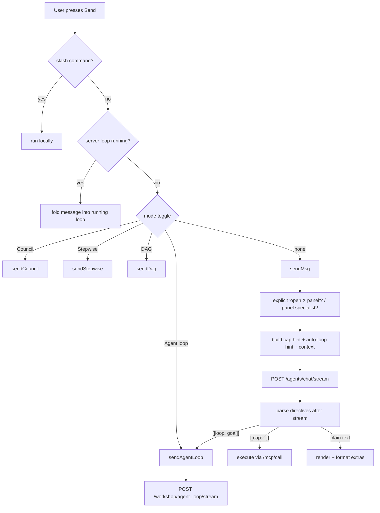

# 19 · Agents & Chat

Vera's **agents** are named, configurable LLM personas — a model plus generation
parameters, a system prompt, a capability allowlist, knowledge sources and
memory/notes behaviour — and **chat** is the conversational surface where a
person talks to them. One chat turn can stay a single streamed reply, run
capabilities inline through `[[cap:…]]` directives, or hand a goal to a
server-side **agentic loop** that triages it, assembles a toolkit and executes
a multi-step plan.

The backend lives in `vera/agents/` (agent records, the registry, the
`AgentRunner`, the streaming chat endpoint and its pure helper modules) and
`vera/chat/` (the chat panel and the panel bridge). Format and delivery
registries shared with Dream and Render live in `vera/output_formats.py` and
`vera/delivery.py`; authoring-task routing for loop steps is in
`vera/agent_task_intent.py`. The agentic-loop engines themselves are in
`vera/dag/dag_workshop_capabilities.py` and are documented in
[DAG Engine §5](./03-dag-engine.md#5-the-agentic-loop); this page explains how
chat reaches them.

**Status:** production. Ordinary chat, capability directives, server-side
context assembly, agent RAG and the loop hand-off are in daily use. Two-tier
replies, the quick opener and chat insights are opt-in and off on new agents.
The chat panel is a very large single file (`chat_panel.html`, ~21k lines);
most routing decisions described below are made client-side in it.

## Contents

- [1. Concepts & architecture](#1-concepts--architecture)
  - [Turn lifecycle at a glance](#turn-lifecycle-at-a-glance)
- [2. Source map](#2-source-map)
- [3. What an agent is](#3-what-an-agent-is)
  - [`tool_mode`](#tool_mode)
  - [Default agents](#default-agents)
  - [Persistence](#persistence)
- [4. Capability reference](#4-capability-reference)
- [5. Triage: how a chat turn is routed](#5-triage-how-a-chat-turn-is-routed)
  - [5.1 Client-side dispatch](#51-client-side-dispatch)
  - [5.2 Inside an ordinary turn](#52-inside-an-ordinary-turn)
  - [5.3 Hand-off to the agentic loop](#53-hand-off-to-the-agentic-loop)
  - [5.4 Server-loop triage and toolkit selection](#54-server-loop-triage-and-toolkit-selection)
  - [5.5 Authoring-task routing for loop steps](#55-authoring-task-routing-for-loop-steps)
- [6. Tool and capability selection in chat](#6-tool-and-capability-selection-in-chat)
- [7. Retrieval and context assembly](#7-retrieval-and-context-assembly)
  - [7.1 Client-side live context](#71-client-side-live-context)
  - [7.2 Server-side `context.assemble`](#72-server-side-contextassemble)
  - [7.3 Server-side injection in the runner](#73-server-side-injection-in-the-runner)
  - [7.4 Agent knowledge (per-agent RAG)](#74-agent-knowledge-per-agent-rag)
  - [7.5 Portable knowledge context](#75-portable-knowledge-context)
- [8. Output format and delivery](#8-output-format-and-delivery)
  - [8.1 Output-format profiles](#81-output-format-profiles)
  - [8.2 Format-specific rendering in chat](#82-format-specific-rendering-in-chat)
  - [8.3 Delivery channels](#83-delivery-channels)
- [9. Model routing and context window](#9-model-routing-and-context-window)
- [10. Latency features: opener, two-tier, web gating, insights](#10-latency-features-opener-two-tier-web-gating-insights)
- [11. The streaming endpoint and SSE frames](#11-the-streaming-endpoint-and-sse-frames)
- [12. The agentic loop renderer](#12-the-agentic-loop-renderer)
- [13. Panel bridge](#13-panel-bridge)
- [14. Voice](#14-voice)
- [15. UI panels and routes](#15-ui-panels-and-routes)
- [16. Configuration](#16-configuration)
- [17. Events and storage](#17-events-and-storage)
- [18. Observability and run evidence](#18-observability-and-run-evidence)
- [19. Worked examples](#19-worked-examples)
- [20. Failure modes and troubleshooting](#20-failure-modes-and-troubleshooting)
- [See also](#see-also)

---

## 1. Concepts & architecture

| Concept | Meaning |
|---|---|
| **Agent** | An `AgentRecord`: identity, model + Ollama options, persona prompt, `domain_caps` allowlist, `tool_mode`, skills/ontologies, memory/notes flags, knowledge sources, routing table. |
| **Turn** | One user message and the reply it produces. Usually a streamed `POST /agents/chat/stream`. |
| **Directive** | Inline markup the model emits — `[[cap:…]]`, `[[suggest:…]]`, `[[panel:…]]`, `[[dag:…]]`, `[[loop: …]]` — which the chat panel parses after the stream ends and acts on. |
| **Agentic loop** | A server-side engine (`dag.agent_loop` … `dag.agent_loop_v8`) streamed over `POST /workshop/agent_loop/stream`. |
| **Context block** | The system-prompt prefix assembled for a turn: skills, ontologies, DAGs, capability-mesh relations, session notes, related Q&A, artifacts, plus retrieved records. |
| **Output format** | A profile from `vera.output_formats` whose directive is appended to the system prompt (`apply_format`). |
| **Delivery channel** | An entry in `vera.delivery` that routes a finished report to a sink (`chat.deliver`, `mail.send`, …). |

### Turn lifecycle at a glance



---

## 2. Source map

| Path | Responsibility |
|---|---|
| `vera/agents/agents.py` | `AgentRecord`, `AgentRegistry` (Redis + Postgres + fabric), `AgentRunner` (`run`, `run_stream`, `run_with_tts`), `/agents/chat/stream`, all `agent.*` caps, default agents, panel registration. |
| `vera/agents/two_tier.py` | Pure planner for the two-tier reply (levels, deciders, markers, prompt surgery). |
| `vera/agents/two_tier_stream.py` | Streaming marker filters (`MarkerFilter`, `NoAdditionGate`) so markers never reach the user. |
| `vera/agents/chat_ctx_core.py` | `stable_chat_num_ctx` — picks a context window that reuses a resident Ollama runner. |
| `vera/agents/queue_status_core.py` | Honest "what is this turn waiting for" text for the `queued` frame. |
| `vera/agents/chat_insights_core.py` | Prompt/parse for the optional post-reply insights pass. |
| `vera/agents/rag_context_adapter.py` | Offline adapter from Fabric hits to the portable `ContextItem` contract. |
| `vera/agents/agents_context_patch.py` | Patches `AgentRunner` so agent `skill_ids`/`ontology_ids` reach the prompt via `build_context_prompt`. |
| `vera/chat/chat_panel.html` | The chat UI: dispatch, cap hints, auto-loop hint, live retrieval, directive execution, format rendering, loop panes. |
| `vera/chat/chat_panels_capabilities.py` | Panel bridge (`panel.dispatch`, `panel.query`, `panel.actions`), `chat.deliver`, `ui.panels.open`, LHM menus, chat attachments, and a copy of the `ui.*` caps (see [UI Builder](./26-ui-builder.md)). |
| `vera/output_formats.py` | Output-format palette (`FORMAT_PROFILES`, `REVIEW_STYLES`, `apply_format`). |
| `vera/delivery.py` | Delivery-channel registry (`DELIVERY_CHANNELS`, `build_args`). |
| `vera/agent_task_intent.py` | Deterministic `source_file.author` / `document.author` routing for loop steps. |
| `vera/role_profile_merge.py` | Merge rule for user Model Routing role overrides (inherit omitted fields). |
| `vera/fabric/context.py` | `context.assemble`, `context.recall`, `context.search_caps` and friends. |
| `vera/agent_loop_ouput.js` | `<vera-agent-loop-output>` loop renderer (served at `/ui/elements/agent_loop_output.js`). |

---

## 3. What an agent is

An agent bundles:

- A specific model and a full set of Ollama generation parameters.
- A system/personality prompt, optional greeting, and TTS voice settings.
- A **domain focus** — `domain_caps` (the capabilities it may use) and a `domain_description`.
- A **tool mode** — whether and how it invokes capabilities.
- Skills and ontologies (`skill_ids`, `ontology_ids`) — see [Skills & Ontologies](./18-skills-ontologies.md).
- Memory, session-notes and capability-mesh injection flags.
- Knowledge sources with optional per-agent RAG.
- A per-turn **routing table** that classifies messages into Model Routing job types.

Key `AgentRecord` fields and defaults (`vera/agents/agents.py`):

| Group | Field | Default | Notes |
|---|---|---|---|
| Model | `model` | `""` | Empty = system default model. |
| | `instance_id` | `""` | Pin to an Ollama instance; empty = auto. |
| | `prefer_gpu` | `True` | |
| | `temperature` / `top_p` / `top_k` | `0.7` / `0.9` / `40` | Only non-default values are sent. |
| | `repeat_penalty` / `repeat_last_n` | `1.1` / `64` | |
| | `num_ctx` | `0` | 0 = auto-size per turn (see [§9](#9-model-routing-and-context-window)); >0 caps it. |
| | `num_predict`, `seed` | `-1`, `-1` | |
| | `mirostat`, `mirostat_tau`, `mirostat_eta`, `tfs_z`, `stop` | `0`, `5.0`, `0.1`, `1.0`, `[]` | |
| | `think` | `False` | Native Ollama thinking flag (no prompt injection). |
| Persona | `system_prompt`, `greeting` | `""` | |
| | `voice`, `tts_speed`, `tts_engine` | `af_heart`, `1.0`, `""` | `tts_engine`: `""`, `kokoro`, `coqui`. |
| Domain | `domain_caps` | `[]` | Allowlist; `["*"]` = all caps. |
| | `domain_description` | `""` | Appended as `Domain: …`. |
| | `tool_mode` | `""` | `''`/`none`/`call`/`plan`. |
| | `routing_table` | `[]` | Ordered `{match, job_type, regex?, label?}` rows. |
| | `skill_ids`, `ontology_ids` | `[]` | |
| Memory | `memory_enabled` | `True` | Record turns to memory backends. |
| | `memory_inject`, `memory_inject_limit`, `memory_tags` | `False`, `5`, `""` | Server-side recall into the prompt. |
| | `notes_inject` | `True` | Inject chat-session + agent notes. |
| | `cap_ontology_inject` | `False` | Inject capability-mesh relations for `domain_caps`. |
| Latency | `quick_opener`, `quick_opener_threshold`, `quick_opener_model` | `False`, `1500`, `""` | |
| | `two_tier`, `two_tier_decider` | `off`, `tier2` | |
| Knowledge | `knowledge_sources` | `[]` | `{type: web\|fabric, target, note, search_recipe}`. |
| | `rag_enabled`, `rag_inject_limit`, `rag_refresh_hours` | `False`, `4`, `24.0` | Dataset is `agent_rag.<name>`. |

### `tool_mode`

| Value | Behaviour |
|---|---|
| `''` | Default; tools allowed when `domain_caps` is non-empty. |
| `none` | Pure chat — the chat panel injects no capability manifest and refuses to start an agentic loop for this agent. |
| `call` | The agent may invoke Vera capabilities as tools during its turn (via chat directives). |
| `plan` | The agent may build and run [DAGs](./03-dag-engine.md) (`[[suggest:dag …]]`, `[[dag:…]]`). |

When `domain_caps` is set and `tool_mode != none`, the non-streaming `AgentRunner.run` also lists the cap signatures (`CAP_INDEX.cap_signature`) as "Available tools you may reference". With `["*"]` it lists the first 40 registry entries. The [capability ontology](./18-skills-ontologies.md) can tell an agent that *adjacent* caps exist without granting access.

> [!NOTE]
> An agent with **no** `domain_caps` gets **no** capabilities in chat. Older behaviour granted every cap to unconfigured agents; `_getAgentCaps` now returns only the open panel's `ui_caps` in that case.

### Default agents

`DEFAULT_AGENTS` (seeded by `_seed_defaults()` at startup) includes `assistant` (label "Vera"), `aide`, `secretary`, `dag-planner`, `agentic-planner`, `dag-fixer`, `scheduler`, `code-reviewer`, `creative`, `analyst`, and specialist cohorts — planning, scheduling, coding (`coder`, `debugger`, `code-editor`, `code-tester`, `code-verifier`, `script-verifier`, `git-operator`, `file-operator`), networking, media (`image-director`, `sprite-smith`, `podcast-producer`, `dream-weaver`), cognition (`dream-orchestrator`, `dream-auditor`), infrastructure, data (`fabric-librarian`, `ontologist`, `research-analyst`, `memory-curator`), edge, ML, comms, meta (`capability-smith`, `ui-smith`), visual (`visual-analyst`, `image-artist`), business/markets, and `gatherer`.

Seeding is additive: a missing default is created; an existing default only gains newly granted `domain_caps` (never loses any). The `assistant` agent is upgraded once only if its stored prompt is still byte-identical to the legacy default.

### Persistence

| Store | Key / location | Role |
|---|---|---|
| Redis | `vera:agents:<…>`, version counter `vera:cachever:agents` | Hot cache; the version key invalidates per-process caches. |
| Postgres | table `vera_agents` | Durable store when available. |
| Fabric | dataset `agents` (one row per agent, deterministic id) and `agents_archive` (one row per save) | Durable source of truth + version history used by `agent.history`, `agent.restore_version`, `agent.restore_from_fabric`. |

---

## 4. Capability reference

| Cap | Route | Purpose / key args |
|---|---|---|
| `agent.create` | `POST /agents/create` | Define an agent (all record fields). Emits `agent.created`. |
| `agent.update` | `POST /agents/update` | Modify an agent. Emits `agent.updated`. |
| `agent.list` | `GET /agents/list` | `include_archived`. |
| `agent.get` | `GET /agents/get` | By `id` or `name`; `force_refresh`. |
| `agent.delete` | `POST /agents/delete` | Soft delete (archive). |
| `agent.chat` | `POST /agents/chat` | Non-streaming turn: `message`, `agent_name`/`agent_id`, `history` (JSON string), `session_id`, `model_override`, `instance_id`, `prefer_gpu`, `think`. Message/history/result are redacted from activity previews. Unknown agent → plain `ollama_generate`. |
| `agent.consult` | `POST /agents/consult` | One bounded single-turn question to a named specialist (`agent_name`, `message`, `context`). No tool loop; a consulted agent cannot consult again (depth 1); 90 s timeout. Emits `agent.consult.start` / `agent.consult.done`. |
| `agent.chat_voice` | `POST /agents/chat_voice` | Like `agent.chat` plus TTS audio (base64 WAV). |
| `agent.models` | `GET /agents/models` | Models available to agents. |
| `agent.history` / `agent.restore_version` | `GET /agents/history`, `POST /agents/restore_version` | Version history from `agents_archive`; restore by `archive_id`. |
| `agent.list_fabric` / `agent.restore_from_fabric` / `agent.purge_fabric_duplicates` | `/agents/list_fabric`, `/agents/restore_from_fabric`, `/agents/purge_fabric_duplicates` | Fabric-backed snapshots; purge defaults to `dry_run=true`. |
| `agent.rag.index` | `POST /agents/rag/index` | (Re-)index an agent's knowledge sources into `agent_rag.<name>`. Emits `agent.rag.indexed`. |
| `agent.rag.query` | `POST /agents/rag/query` | Query an agent's private knowledge (`agent`, `query`, `limit=4`). |
| `agent.knowledge.set` | `POST /agents/knowledge/set` | Set `knowledge_sources` and RAG options. |
| `agent.routing.set` | `POST /agents/routing/set` | Set the per-turn `routing_table` (`rules` JSON). |

Chat-side caps registered by `vera/chat/chat_panels_capabilities.py`:

| Cap | Route | Purpose |
|---|---|---|
| `panel.dispatch` | `POST /panel/dispatch` | Run an action in a panel open in the user's session (see [§13](#13-panel-bridge)). |
| `panel.query` | `POST /panel/query` | Read that panel's state snapshot (`__query__`). |
| `panel.actions` | `GET /panel/actions` | Discover a panel's semantic actions, buttons and inputs. |
| `chat.deliver` | `POST /chat/deliver` | Deliver a markdown report into a chat session as an assistant message (`session_id`, `report`, `title`, `speak`). |
| `ui.panels.open` | `GET /ui/panels/open` | The panels currently open across the harness. |
| `lhm.menu.save` / `lhm.menu.list` / `lhm.menu.delete` | `/ui/lhm/…` | Left-hand-menu library. |

> [!NOTE]
> Older docs listed `agent.call_with_tools` as a capability. It is not registered; the name only survives in a panel's `ui_caps` list. Tool use happens through chat directives and the agentic loop.

---

## 5. Triage: how a chat turn is routed

Routing happens in three layers: **client dispatch** in the chat panel (deterministic), **directive interpretation** after the model replies (model-proposed, client-verified), and **loop triage** on the server (heuristic plus optional LLM classification).

### 5.1 Client-side dispatch

`send()` in `chat_panel.html` runs these checks in order:

1. **Slash command** — a message starting with `/` that `_runSlash` recognises (open panel, switch agent, toggles) runs locally and is never sent. Unknown `/…` falls through as chat.
2. **Pinned documents** — attached document chips are prepended as fenced bodies; an empty message with documents still sends ("Please review the attached document(s).").
3. **Image mode** (`SD_MODE`) — sends to image generation instead.
4. **Running server loop** — if a server-side loop is active, the message is folded into that loop's context at its next step boundary (`_messageRunningLoop`) instead of starting a new turn. This is how a user steers a loop mid-plan.
5. **Mode toggles** (`_routeSend`), first match wins:

| Toggle | Function | What it does |
|---|---|---|
| Agent loop | `sendAgentLoop` | Run the selected loop variant (see [§5.3](#53-hand-off-to-the-agentic-loop)). |
| Council | `sendCouncil` | Fan the message out to several selected Ollama instances; `vote` asks an LLM to pick the best answer, `combine` streams a synthesis. |
| Stepwise | `sendStepwise` | Plan-and-run with per-step HITL via `/dag/plan_stream`. |
| DAG | `sendDag` | DAG-mode turn. |
| *(none)* | `sendMsg` | Ordinary streamed chat (below). |

### 5.2 Inside an ordinary turn

`sendMsg` paints the user message and a throbber immediately, then:

1. **Explicit panel open.** "Open the X panel" is resolved in code (`_maybeExplicitOpenPanel`) and mounted before the reply. There is no relevance-based pre-open; otherwise panels open only when the model emits `[[panel:id]]`.
2. **Panel specialist (opt-in `cfgPanelDefer`).** If the open panel has a bound specialist agent (`GET /ui/panel/specialist`), the question goes to `POST /agents/consult` with fresh context from the panel's `specialist_context_cap`. On success the turn ends there; on any failure it falls through to the normal path.
3. **Capability hint** (`buildCapHint`, [§6](#6-tool-and-capability-selection-in-chat)).
4. **Context block** (`_fetchContextBlock` → `POST /context/assemble`, [§7.2](#72-server-side-contextassemble)) and **retrieved context** (`buildCtxInj`, [§7.1](#71-client-side-live-context)). If live context was fetched for a different input, retrieval is re-run for this message but bounded to 600 ms so a slow embed node never blocks sending.
5. **Auto-loop hint** (`buildAutoLoopHint`, [§5.3](#53-hand-off-to-the-agentic-loop)), studio hint, UI "room" manifest and panel-state block.
6. `POST /agents/chat/stream` with the composed message, last 20 history turns, `output_format`, `system_prefix`, and the per-turn toggles (`quick_opener`, `insights`, `two_tier`, `two_tier_decider`, `web_search…`, `session_notes`).
7. **After the stream:** fenced placeholders are unwrapped, then `processCapPlaceholders` executes directives if integrated-cap mode is on (or a `[[loop]]` marker is present with Auto-loop on). An empty stream with no audio is reported as a failure, not "(no response)". Format extras render ([§8.2](#82-format-specific-rendering-in-chat)). The reply is pushed to history **without** `[[panel:…]]` markup so the model does not parrot past panel opens.

Directive grammar (`CAP_PLACEHOLDER_RE` and friends):

| Directive | Effect |
|---|---|
| `[[cap:name {"arg":v}]]` | Run the capability now via `/mcp/call`. |
| `[[suggest:cap name {…}]]` | Show a confirm card; run on approval. |
| `[[suggest:dag {"dag":[…],"initial_state":{…}}]]` | Propose a multi-step plan. |
| `[[dag:… …]]` | DAG directive. |
| `[[panel:id]]` | Open a UI panel (no-op if already open). |
| `[[loop: goal]]` | Hand the goal to the agentic loop. |

Directives inside fenced code blocks (including an unterminated fence still streaming) and Mermaid `id[[text]]` node shapes are ignored, so diagrams never trigger calls.

### 5.3 Hand-off to the agentic loop

There are two ways into a loop:

- **Explicit** — the Agent-loop toggle sends every message to `sendAgentLoop`.
- **Auto-loop** (`cfgAutoDeferLoop`, toggled by the toolbar **Auto-loop** button and remembered in `localStorage` key `vera_auto_loop`) — the model decides.

With Auto-loop on and the message not trivial, `buildAutoLoopHint` appends an "AGENTIC LOOP AVAILABLE" block telling the model to reply with exactly `[[loop: <the user's actual objective>]]` for goals that need planning or more than one step, and to answer directly for questions, quick facts and single simple actions. The prompt insists the goal be relayed verbatim, not reframed into "research…" or "make a plan…".

Two deterministic guards back this up:

| Guard | Rule |
|---|---|
| `_isTrivialChat` | Greetings, thanks, "ok", "how are you", "test", etc. (`_TRIVIAL_CHAT_RE`), and any message under 18 characters without an action verb (`make`, `build`, `create`, `write`, `fix`, `run`, `find`, `search`, `research`, `earn`, `plan`, `set up`, `deploy`, `install`, `generate`, `automate`, `analyse`, `scan`, `test`) never get the hint, and a `[[loop]]` for such a message is ignored. |
| `_preferActualGoal` | If the model's loop goal opens with a research/advice reframing (`research`, `look into`, `guide me`, `compile`, `outline`, `summarise`, "create a plan/guide/list…", …) and the user's own message did not, the user's wording is used instead. |

The variant used is the one selected in the Loop pane (`loopVariant`); if that is the built-in chat loop, the auto path uses `dag.agent_loop_v7`.

> [!NOTE]
> **🚧 Not live — System 1.** A small trained classifier for the chat-or-loop decision (`chat.route_to_loop`) has been proposed to replace the in-band `[[loop:]]` marker and its regex backstops. Today the decision is made only as described above. See [48 · System 1 decision models](./48-system-one-decision-models.md#53-chat).

`sendAgentLoop` then dispatches on the variant:

| `loopVariant` | Engine |
|---|---|
| `chat` | In-page step loop. Refuses to start if the agent has `tool_mode="none"` or integrated caps are off. |
| `dag.agent_loop` … `dag.agent_loop_v7` | Server loop over `POST /workshop/agent_loop/stream` (v1 ReAct · v2 triage + dynamic toolkit · v3 full history · v4 explore/think/act/verify · v5 specialist sub-agents · v6 adaptive specialists · v7 tiered + branching). |
| `dag.agent_loop_v8` | Not streamed: `POST /dag/agent_loop_v8` designs a long-horizon **loop program** of v5–v7 runs; constituent runs appear in the Loops pane (sessions `v8:<id>:…`). |
| `preset:<id>` / `profile:<id>` | A saved preset, or a specialist loop profile from `vera/dag/loop_profiles.py` (`POST /loops/profile`), resolved to an engine plus body. |
| `openclaw`, `smolagents`, `langgraph`, `pydanticai` | External or containerised runtimes (opt-in); see [OpenClaw](./27-openclaw.md) and [Agent Runtimes & Providers](./36-agent-runtimes-providers.md). |

Each server run gets a unique `run_id` so events from an earlier loop cannot bleed into a newer output element.

### 5.4 Server-loop triage and toolkit selection

These decisions happen inside `vera/dag/dag_workshop_capabilities.py`:

**Goal triage (v2-family).** `_workshop_triage_goal` classifies the goal into one primary `category`, an optional list of `categories` for compound goals, keywords and a reason:

1. `_heuristic_classify` matches unambiguous patterns (messaging/Telegram/email, image generation, audio/TTS/STT, …). A match with confidence ≥ 0.8 overrides the LLM's category.
2. An LLM call (JSON only) returns the category from `TRIAGE_CATEGORIES`: `research`, `web_check`, `data_lookup`, `file_edit`, `summarisation`, `analysis`, `search`, `monitoring`, `code_task`, `system_info`, `network_scan`, `ml_task`, `data_pipeline`, `memory_recall`, `creative`, `general_qa`, `messaging`, `image_gen`, `audio`, `browser_task`, `agent_op`, `report_generation`, `other`.
3. Results are cached per process by goal hash, so the same goal always triages the same way within a process lifetime.

The Loop pane can **force the category**, set **seed keywords** and the toolkit **top-K** (default 16).

**Dynamic toolkit.** `_workshop_build_toolkit` builds the toolkit from the **full** registry (access control happens at execution, not triage) in this order:

1. Universal discovery caps (`caps.search` etc.).
2. Universal essentials — the grounded authoring caps `code.author` and `prose.author`; the raw `llm.*` family is blocked from loop toolkits.
3. Category essentials for every triaged category.
4. Prefix-expanded caps for every category.
5. Keyword semantic search (`top_k`).
6. Caller-supplied extras and the base toolkit. The Loop pane's **Mirror agent baseline** includes the agent's `domain_caps`.

A blacklist (default blacklist, gated read caps, research-blocked caps, blocked `llm.*` caps) is applied throughout, and keyword-discovered caps are truncated to keep the total at most `top_k × 2`. With **Toolkit expansion** on, the loop may grow its toolkit mid-run (bounded by **Max search calls**, default 2).

**v7 tier and intent.** v7 adds two pre-passes:

| Decision | Heuristic floor | LLM pass | Combination |
|---|---|---|---|
| **Tier** — `single` / `simple` / `complex` / `strategic` | `_v7_tier_heuristic`: strategic hints → `strategic`; complex hints, ≥3 conjunctions or ≥60 words → `complex`; short single-action goals → `single`; ≤24 words with ≤1 conjunction → `simple`. | `_v7_classify_tier` (JSON `{tier, reason}`). Earning/business goals are `strategic` unless they are only a factual lookup. | Best effort; falls back to the heuristic. |
| **Intent** — `build` / `research` / `action` / `mixed` | `_v7_intent_heuristic` from research/action words and build verb+noun pairs; ambiguous → `mixed`. | `_v7_classify_intent` runs **only when the heuristic says `mixed`**. | The LLM may override the heuristic (intent is a category, not a magnitude). |

The intent shapes the planner prompt (`_v7_intent_plan_directive`): `build` plans direct authoring only, while `mixed` keeps the planner's normal latitude.

### 5.5 Authoring-task routing for loop steps

`vera/agent_task_intent.py` turns a step's explicit deliverable into Capability Contract canonical tasks without calling a model:

- `source_file.author` when a code verb (`write`, `create`, `generate`, `build`, `implement`, `refactor`, `fix`, …) and a code noun (`script`, `module`, `function`, `html`, `app`, a `.py`/`.js`/… extension, …) both appear.
- `document.author` when a document noun appears (`report`, `summary`, `documentation`, `readme`, `article`, `guide`, `.md`/`.docx`/…).
- Mode `ambiguous` (neither), `resolved` (one) or `compound` (both).

`resolve_authoring_tasks` projects each catalog cap's contract and calls `resolve_shadow` to choose an eligible provider. `route_authoring_caps` puts the selected providers first, removes `llm.generate` (a grounded author replaces it) and keeps unrelated caps. Ambiguous text or resolver failure leaves the planner's caps unchanged, and the result always reports `authorized: false, executed: false`. The routing grants no authority; session guards and capability policy still decide whether a call may run. If the module fails, the loop falls back to its historical regex rules (`code.author` / `prose.author`).

---

## 6. Tool and capability selection in chat

`buildCapHint(agent, message)` decides whether a turn gets a capability manifest:

1. **Gates:** integrated caps (`cfgCapInteg`) must be on and `tool_mode` must not be `none`.
2. **Allowed set** (`_getAgentCaps`): the Inspector override (if set), otherwise the agent's `domain_caps`, otherwise nothing — always unioned with the open panel's `ui_caps` (`_panelExtraCaps`). Opening the DAG Workshop therefore grants `dag.*` for that panel session.
3. **Relevance scoring** (`_findRelevantCaps`, client-side, no model): the message is lower-cased and split into words, and words of two characters or fewer and stop words are dropped. **Fewer than two content words → no manifest.** Each allowed cap scores +15 per word in its name, +5 per word in its description, +8 per word in its tags, and +20 if a word equals its group prefix. Caps scoring under 6 are dropped; the top 28 are kept.
4. **Panel seeding:** with a panel open (and a non-trivial message) `panel.dispatch`, `panel.query`, `panel.actions` and up to 10 panel caps are always added (up to 34 total).
5. If nothing survives, the hint is empty — casual chat gets no tools.

The manifest lists each cap as `name(param*:type=default, …) — first sentence`, the directive formats, the panel guidance (exact panel ids, which panel owns the relevant caps, what is already open, how to drive it with `panel.dispatch`), and the rule "conversational / simple questions → plain text". With **Auto-run caps** (`cfgCapAutoExec`) on, the model is told to use `[[cap:…]]` directly. Otherwise it should use `[[suggest:…]]` for destructive or slow operations. Selected caps are also added to the context graph as `cap` nodes, so the user can see what was offered.

> [!TIP]
> If an agent keeps proposing the wrong tool, check its `domain_caps` first, then the Inspector override. Relevance scoring only chooses *among* allowed caps.

---

## 7. Retrieval and context assembly

A turn can draw context from four independent places. Duplicate injection is prevented by section markers (`## Session memory`, `## Capability mesh`, …).

### 7.1 Client-side live context

`ctxFetch` fills the Context tab (`CTX_NODES`) from the enabled sources (default `memory`, `fabric`, `entities`, `urls`):

| Source | Endpoint | Notes |
|---|---|---|
| Memory | `POST /memory/search`, `POST /memory/agent/context`, `GET /memory/session/edges` | Vector + session context; 1-hop graph expansion of the top 5 hits via `POST /memory/traverse`. |
| Fabric | `POST /fabric/query` | Optional dataset filter. |
| Entities / related Q&A | `POST /context/recall` | Seeded with real record ids from memory/fabric hits; cross-source dedupe unions provenance and keeps the best score (+0.03). |
| URLs in the message | `http.get` via `/mcp/call` | First URL also opens in the browser pane. |
| Web / news | web search | Skipped when **Web live** is on (the server searches instead). |
| Runs | `GET /run/shadow/graph` | Recent run graph for the session. |
| Worldview | `POST /context/recall` (`sources` includes `worldview`) | JEPA latent-space neighbours. **Off by default**: the default source set is `memory`, `fabric`, `entities`, `urls`, so the Worldview chip must be switched on. See [Worldview](./11-worldview.md). |

`buildCtxInj` injects up to `ctxK` (default 8) nodes scoring at least `ctxSim` (default 0.55) as a `[Retrieved Context]` block appended to the user message. In live mode it never injects context fetched for a different message. Each turn's context set is frozen at send time, so past turns redraw their own graph.

### 7.2 Server-side `context.assemble`

`_fetchContextBlock` calls `POST /context/assemble` (`vera/fabric/context.py`) and sends the result as `system_prefix`:

| Argument | Chat setting | Values |
|---|---|---|
| `attach_skills` | Skill mode | `auto` (semantic), agent's `skill_ids`, or a picked list |
| `attach_ontologies` | Ontology mode | `auto`, agent's `ontology_ids`, or picked |
| `attach_dags` | DAG mode | `auto` |
| `attach_cap_ontology` | Cap-mesh mode | `*` (all) or the agent's `domain_caps` |
| `attach_related_qa` | Related Q&A | `''`, `auto` (4 pairs), or a number |
| `attach_session_notes` | Notes toggle | bool |
| `attach_caps` | — | always `''`; caps come from `buildCapHint` |
| `attach_memory` | — | always `false`; the Context tab already recalls memory |

Artifact context (`_fetchArtifactContext`) is fetched concurrently and appended.

### 7.3 Server-side injection in the runner

`/agents/chat/stream` and `AgentRunner` add, in this order:

1. The **output-format directive** (`apply_format("", output_format)`), appended to `system_prefix`.
2. **Session notes** (`session_notes.build_notes_context` for the chat session and the agent) when `notes_inject` is on, unless the client already included them or sent `session_notes:false`.
3. **Capability mesh** (`cap_ontology.build_ontology_system_prompt_fragment(domain_caps)`) when `cap_ontology_inject` is on.
4. In `run_stream`: the current date/time line (with explicit yesterday/tomorrow), `system_prefix`, the persona prompt, `Domain: …`.
5. **Memory recall** (`memory_hooks.get_agent_memory_context_v2`) when `memory_inject` is on — bounded by `AGENT_CTX_INJECT_TIMEOUT` and skipped during an agentic-loop run (`SUPPRESS_MEMORY_INJECT`).
6. **Agent knowledge** ([§7.4](#74-agent-knowledge-per-agent-rag)) when `rag_enabled` is on.
7. Web results when server-side web search is active ([§10](#10-latency-features-opener-two-tier-web-gating-insights)).

`agents_context_patch.py` additionally routes agent `skill_ids`/`ontology_ids` through `build_context_prompt` for callers that do not assemble context themselves. It leaves memory to the runner.

> [!NOTE]
> **🚧 Not live — System 1.** Gating memory retrieval per turn with a small classifier (`chat.memory_inject`) is a proposal only; today recall runs on every turn whenever `memory_inject` is on. See [48 · System 1 decision models](./48-system-one-decision-models.md#53-chat).

### 7.4 Agent knowledge (per-agent RAG)

- **Indexing** (`agent.rag.index`): web sources are fetched (feeds are parsed and salvaged where needed) and ingested into the agent's own dataset `agent_rag.<name>`. A `search_recipe` (feed, sitemap or API discovered at index time) is stored per source. Re-indexing is bulk work, so it runs on the idle queue every `rag_refresh_hours` and stops mid-sweep when Vera is in use. `rag_last_indexed` is the checkpoint.
- **Retrieval** (`agent_rag_retrieve`): one `fabric.query` per dataset (the agent's own plus any `fabric` sources), `top_k = rag_inject_limit`, falling back from `summary` to `text`. Results are merged, sorted by score and trimmed to the limit.
- **Injection** (`_agent_knowledge_block`): an `═══ AGENT KNOWLEDGE ═══` block with numbered excerpts plus up to 8 sources and their search recipes, steering the agent to those sources before generic web search.

### 7.5 Portable knowledge context

Agent knowledge retrieval still uses the agent's configured Fabric datasets,
but its native hits now preserve any canonical `record_id` and `revision_id`
returned by Fabric (`include_revision_authority=True`).
`vera.agents.rag_context_adapter` is the offline boundary from those hits to
Vera's shared `ContextItem` contract. It emits an exact
`fabric://...?...revision=...` citation and a deterministic, payload-free
projection receipt containing only provider and record/revision identities. It
never queries Fabric itself.

Legacy hits without canonical revision authority remain available to existing
prompt assembly, but they are deliberately inadmissible as portable context.
The adapter also rejects missing dataset/record identities, duplicate revision
citations, invalid scores, unbounded result sets, and invalid token counts. It
does not derive authority from result text, timestamps, ranking, or dataset
membership.

---

## 8. Output format and delivery

### 8.1 Output-format profiles

The chat **Output format** picker (`cfgFormat`) sends `output_format`. The server folds `apply_format("", profile)` into `system_prefix`, so the directive reaches the model ahead of the persona prompt. An unknown or empty profile is a no-op. Profiles (`vera/output_formats.py`):

| Kind | Profiles | Default export type |
|---|---|---|
| length / voice | `quick`, `short`, `standard`, `long`, `exhaustive`, `audio` | `md` (`audio` → `txt`) |
| structure | `docs`, `critique`, `improvement`, `integration`, `architecture` (from `REVIEW_STYLES`) | `docs` → `docx`, others `md` |
| deliverable | `markdown`, `report`, `json`, `code`, `email`, `slides`, `plain` | `md`, `docx`, `json`, `py`, `txt`, `pptx`, `txt` |

Skills of type `output_format` register additional profiles at runtime (`register_profile`) and shadow a built-in profile with the same id. The picker lists them via `llm.formats` → `list_profiles()`. `ANTI_HALLU` is the shared grounding preamble used by Dream's synthesize stage.

> [!NOTE]
> **🚧 Not live — System 1.** Suggesting an output format or delivery channel automatically (`chat.output_format`, `delivery.channel`) is a proposal only; both are user choices today. See [48 · System 1 decision models](./48-system-one-decision-models.md#53-chat).

### 8.2 Format-specific rendering in chat

The format only changes how the model writes. After the stream, `_renderFormatExtras` adds a view **below** the always-rendered markdown (it never replaces content):

| Profile | Extra |
|---|---|
| `json` | Collapsible, syntax-highlighted parsed view (skipped if not valid JSON). |
| `slides` | Inline deck split on `---` or H1s (needs ≥ 2 slides) plus a lazy `.pptx` export chip. |
| `report`, `docs` | Inline PDF preview (only if `render.formats` reports a live PDF engine) plus a lazy `.docx` chip via `render.export`. |

See [Render](./28-render.md).

### 8.3 Delivery channels

Chat answers stay in the conversation by default. Re-routing an answer elsewhere uses the delivery registry `vera/delivery.py`, shared with Dream's `deliver` stage and with `output.redeliver` in [Render](./28-render.md#5-re-delivery-outputredeliver):

| Channel | Cap | Default format | Target |
|---|---|---|---|
| `telegram` | `tg.notify` | verbatim | — |
| `memory` | `memory.store` | verbatim | — |
| `notebook` | `notebook.create` | `markdown` | — |
| `email` | `mail.send` | `email` | `to` (blank = default account) |
| `chat` | `chat.deliver` | `standard` | `session_id` (blank = calling session) |
| `podcast` | `podcast.generate` | `audio` | — (non-blocking, `wait=false`) |
| `html` | `report.html` | verbatim | — |

The registry holds descriptors and pure argument builders (keyed by **cap name**, so a skill channel over a known cap reuses its builder; unknown caps get a generic `{text, target}`). The caller renders the report through the channel's format, then calls the cap. `delivery_channel` skills register extra channels (`register_channel`, with optional `fixed_target`). `chat.deliver` reaches a chat session through the panel bridge's `__chat_deliver__` action (and also pushes to the printer's chat feed when subscribed).

The chat panel's per-message actions can also route an answer into Dream: **+ Project** (`project.note.add`) and **Think later** (`dream.think.create`). See [Dream §11](./17-dream.md#11-chat--projects--thoughts).

---

## 9. Model routing and context window

Per turn, `AgentRunner`:

1. **Classifies the job type** with `_agent_classify_job_type`: the first `routing_table` row whose `match` is found in the message (case-insensitive substring, or regex when `regex: true`; a bad regex never breaks routing) gives the `job_type`. Otherwise the job type is `chat`. No model call is involved.
2. **Picks an instance** with `pick_instance(prefer_gpu, instance_id, model, job_type)`, so the Model Routing table (pin/allow/deny/avoid) applies exactly as for any other caller. User role-profile overrides inherit omitted fields from the declared rule (`role_profile_merge.inherit_declared_fields`), so a partial override keeps the declared `options`.
3. **Sizes the context window.** `effective_num_ctx` gives a node-safe ceiling (model max, capped by the agent's `num_ctx`). `stable_chat_num_ctx` then reuses the window of a runner that is already resident when it is big enough, or rounds up to a 4096-token step (floor 4096). This prevents runner eviction thrash between chat and loops sharing a GPU.
4. **Compacts history** to the agent's budget (`min(cap, window) − reserve`, reserve = `num_predict` or 1024). Dropped turns are summarised (`compact_messages`, bounded by `AGENT_COMPACT_SUMMARY_TIMEOUT`), and a `compacted` frame reports how many were dropped.
5. **Takes a GPU slot** (`_chat_gpu_slot`) so chat shares the GPU queue with batch work. The wait is short and fails open (`VERA_CHAT_GATE_WAIT_S`).

> [!NOTE]
> **🚧 Not live — System 1.** A learned fallback for job-type classification when no `routing_table` row matches (`chat.job_type`) is proposed, not implemented; today an unmatched turn is always `chat`. See [48 · System 1 decision models](./48-system-one-decision-models.md#53-chat).

While waiting, `queued` frames describe what the turn is behind (`queue_status_core.describe_wait`). They only name jobs Vera itself started, say "work Vera did not start" when a runner is busy for another client, and emit nothing when nothing is known.

---

## 10. Latency features: opener, two-tier, web gating, insights

All four are opt-in. A chat-side checkbox forces a feature on for the turn; leaving it blank defers to the agent record.

| Feature | Trigger | Behaviour |
|---|---|---|
| **Quick opener** | `quick_opener` and message ≥ `quick_opener_threshold` (min 200) chars, not TTS | A one-sentence acknowledgement (≤ 22 words, `num_predict` 60, 25 s timeout) from the *other* GPU/CPU pool (`job_type=quick_opener`), shown above the reply as an `opener` frame. The main reply is told not to greet. |
| **Server web search** | `web_search=true` (web source on + **Web live**) | Emits `web_searching`, runs `web.search` (`limit` 1–10, default 5; 25 s timeout), emits `web_results` with sources, and **gates** the main generation on the results, injecting a `## Web search results` block with `[n]` citations. |
| **Two-tier reply** | `two_tier` = `fetched` or `message` | Tier 1 answers from a starved prompt (`fetched` drops retrieved sections, `message` drops history too). Decider `tier1`: tier 1 emits `[[NEEDS-CONTEXT]]` if it needs more. Decider `tier2` (default): tier 2 always runs with full context and emits `[[NO-ADDITION]]` when nothing changes. Markers are filtered from the stream, and tier 2 continues tier 1's text mid-flow, so the reader sees one message. Tier 1 never waits on web search. |
| **Insights** | `insights` (agent or chat toggle), reply ≥ 200 chars, not TTS | After the reply, a CPU long-horizon model (`job_type=chat_enrich`) returns up to 4 `insights`, `caveats` and `follow_ups`. Emitted as a `chat.insight` event and rendered in a card; never added to the conversation history. |

> [!NOTE]
> **🚧 Not live — System 1.** A classifier that would let two-tier skip tier 2 only when it is very confident the context adds nothing (`chat.needs_context`) is proposed, not live; today the markers above decide. See [48 · System 1 decision models](./48-system-one-decision-models.md#53-chat).

---

## 11. The streaming endpoint and SSE frames

```
POST /agents/chat/stream   → text/event-stream
body: {message, agent_name?, agent_id?, history? (JSON string), session_id?,
       model_override?, instance_id?, prefer_gpu?, think?, tts?,
       output_format?, system_prefix?, session_notes?, cap_ontology?,
       quick_opener?, insights?, two_tier?, two_tier_decider?,
       web_search?, web_search_query?, web_search_limit?, web_search_engine?}
```

The agent is resolved by `agent_id` first, then `agent_name`, falling back to a bare default record. Per-call overrides are applied to a copy and never mutate the stored agent. Ensuring the memory-graph session node is fire-and-forget.

| Frame `type` | Meaning |
|---|---|
| `token` | Reply text delta. |
| `thinking` | Reasoning delta (native thinking or `<think>` tags). |
| `audio_chunk` | Streaming TTS audio (sentence pipeline, in order). |
| `queued` | What the turn is waiting for (`state`: e.g. `loading`, `busy_elsewhere`; `ahead`: jobs). |
| `compacted` | History compaction happened (`dropped`, `ctx_max`). |
| `opener` | Quick-opener sentence. |
| `web_searching` / `web_results` | Server web search phases. |
| `error` | Failure (also used for stalls). |
| `done` | End of stream. |

On completion the endpoint records a `chat.stream` activity (message evidence and lengths only — see [§18](#18-observability-and-run-evidence)), pushes the reply to the thermal printer's chat feed when subscribed (`print.push`, fire-and-forget), and schedules insights. The turn is recorded to memory server-side by `memory_hooks.record_agent_turn` — the panel does **not** call `/memory/record/turn`.

---

## 12. The agentic loop renderer

Tool-using loop runs stream over a raw SSE endpoint (not a `@capability`, so it can stream):

```
POST /workshop/agent_loop/stream        → text/event-stream of loop events
POST /workshop/agent_loop/hitl/respond  → approve / reject / edit a paused step
```

[`agent_loop_ouput.js`](../vera/agent_loop_ouput.js) defines `<vera-agent-loop-output>`, a self-contained custom element that renders the full loop event stream: triage banner, dynamic toolkit, cycle cards (thinking, args, live progress, research streams, error-recovery boxes, awaits), **HITL pause cards**, handover synthesis, files produced, and a structured final-result pane. It is served at `/ui/elements/agent_loop_output.js`, and chat, the DAG Workshop, orchestration sub-panels and the [Dream panel](./17-dream.md) all reuse it.

```js
el.bindStream('/workshop/agent_loop/stream', requestBody); // stream a run
el.appendEvent(ev);                                         // or feed events manually
el.setHitlEndpoint('/workshop/agent_loop/hitl/respond');    // HITL approvals
```

Events are versioned by engine (`agent_loop_v2.*`, …). The engines currently span v1–v8; see [DAG Engine §5](./03-dag-engine.md#5-the-agentic-loop) for phases, budgets and continue/wrap behaviour.

The chat panel's **Loop** tab shows a live activity graph, the **⟳ Loops** tab lists running and recent loops (any can be picked back up), and **Stop** aborts all streams and loops.

---

## 13. Panel bridge

Chat can **drive other panels**. `panel.dispatch` publishes `{request_id, session_id, action, payload, panel}` on the Redis channel `vera:panel:dispatch:{sid}`. The chat panel holds `GET /ui/panels/dispatch/stream?session_id=…` open and forwards each request to the target panel iframe via `postMessage` (`vera:panel:action`). The panel's `vera-panel-bridge.js` shim runs the registered handler, and the reply returns via `POST /ui/panels/dispatch/ack` → `vera:panel:dispatch:reply:{sid}`. Without a listener the call times out (default 8 s) with `{ok:false, error}`.

- **Semantic actions** are those a panel registers with `VeraPanelBridge.registerActionHandler`. Panels publish catalogs (`POST /ui/panels/actions/publish`), which `panel.actions` exposes.
- **Universal actions** work on every panel: `click {id|label}`, `set_field {id,value}`, `set_fields {fields}`, `submit {fields,click}`, `describe`.
- **Pseudo-actions** used by Vera itself: `__query__` (`panel.query`), `__chat_deliver__` (`chat.deliver`), `__chat_render__` (`render.mermaid` / `render.html` / `render.chart` / `render.screen`).

Calling a panel's own caps directly also works: results mirror live into the open panel. The cap hint tells the model to prefer that path for results and to use `panel.dispatch` only to change the UI.

---

## 14. Voice

`agent.chat_voice` returns text plus synthesised audio via the GPU inference server's TTS, and the chat interface captures microphone input through the GPU server's Whisper STT (see [LLM Cluster](./04-ollama-cluster.md)). In the streaming path, `tts:true` makes `run_stream` split the reply at sentence boundaries and synthesise sentences serially, so `audio_chunk` frames play in order while text streams. Voice, speed and engine come from the agent (`voice`, `tts_speed`, `tts_engine`). The quick opener and insights are skipped for TTS turns.

---

## 15. UI panels and routes

| Panel id | Tab | Source | Purpose |
|---|---|---|---|
| `chat2` | Chat | `vera/chat/chat_panel.html` (served at `/chat_panel`) | Full chat: agent picker, options rail, Context/Loop/Loops/Canvas tabs, STT/TTS, loop streaming. |
| `agents-skills-ontologies` | Agents | `vera/agents_skills_ontologies_panel.html` (iframe `/ui/panels/agents-skills-ontologies`) | Create/edit agents, tune parameters, `domain_caps`, `tool_mode`, routing table, knowledge; skills and ontologies. |

The places map routes the logical place `chat` to panel `chat2` (`vera/ui/places_core.py`). Chat-side settings worth knowing:

| Control id | Meaning |
|---|---|
| `cfgCapInteg` | Integrated capability mode (master gate for the cap hint). |
| `cfgCapAutoExec` | Auto-run caps vs. suggest-first. |
| `cfgAutoDeferLoop` | Auto-loop (`[[loop]]` hand-off). |
| `cfgFormat` | Output format. |
| `cfgPanelDefer` | Defer panel-scoped questions to the panel's bound specialist. |
| `cfgQuickOpener`, `cfgInsights`, `cfgTwoTier`, `cfgTwoTierDecider` | Per-turn overrides. |
| `cfgWebInteractive` | Web live (server-side search). |
| `ctxInject`, `ctxSim`, `ctxK`, `ctxNotes` | Retrieved-context injection, score floor, count, session notes. |
| `loopVariant`, `loopTriageTopK`, `loopTriageCat`, `loopTriageKws`, `loopBaseMirror` | Loop engine and triage controls. |

---

## 16. Configuration

| Env var | Default | Effect |
|---|---|---|
| `AGENT_CTX_INJECT_TIMEOUT` | `12` | Seconds allowed for memory/RAG injection before it is skipped. |
| `AGENT_COMPACT_SUMMARY_TIMEOUT` | `20` | Seconds for history-compaction summarisation. |
| `VERA_CHAT_CTX_RESERVE_OUT` | `8192` | Output-token reserve used in context sizing. |
| `VERA_CHAT_PS_TIMEOUT_S` | `3` | Timeout for probing resident runners (`/api/ps`). |
| `VERA_CHAT_FIRST_TOKEN_S` | `90` | First-token stall threshold. |
| `VERA_CHAT_GATE_WAIT_S` | `600` | Max wait for the shared GPU slot. |
| `VERA_CHAT_QUEUE_REFRESH_S` | `5` | Refresh cadence for `queued` frames. |
| `VERA_CHAT_RUNNER_PROBE_S` | `3` | Runner-busy probe timeout. |
| `VERA_AGENT_WORKFLOW_RUNTIME` | `1` | `0` disables the one-node Workflow IR action boundary (native-path rollback). |

Model Routing job types used by chat: `chat` (default), whatever an agent's `routing_table` assigns, `quick_opener`, and `chat_enrich`.

---

## 17. Events and storage

| Event | Emitted by |
|---|---|
| `agent.created`, `agent.updated` | `agent.create`, `agent.update` |
| `agent.consult.start`, `agent.consult.done` | `agent.consult` |
| `agent.rag.indexed` | RAG indexing |
| `chat.insight` | Insights pass |
| Activity `chat.stream` (begin/end) | `/agents/chat/stream` |

Storage: agent records (see [§3 Persistence](#persistence)), per-agent RAG datasets `agent_rag.<name>`, panel dispatch channels `vera:panel:dispatch:{sid}` / `vera:panel:dispatch:reply:{sid}`, conversation memory via `memory_hooks`, and session notes via `session_notes`.

---

## 18. Observability and run evidence

Every streamed agent-loop request is also observed through the shared Run
protocol. The native loop and SSE stream remain authoritative; the observer
creates a non-authoritative parent Run plus child Runs for capability calls so
Activity, run graphs, Chat, and IDE can correlate the same lifecycle. It records
engine/profile, capability name, step/cycle identity, status, and elapsed time.
Goals, prompts, tool arguments, thoughts, previews, results, and error text are
excluded. Human-approval and clarification pauses appear as Run state changes,
and cancellation, timeout, failure, completion, and session supersession close
the projection explicitly. A projection outage never interrupts the native
loop.

Long-horizon constituent runs also retain an inert runtime-dispatch projection.
It identifies the selected native engine or specialist profile, Run/workflow
identity, portable semantics, and the adapter operations that remain deferred.
This record is observational: the existing capability remains execution
authority, and malformed legacy state degrades the projection instead of
blocking a run.

Individual capability actions now cross an embedded runtime-adapter boundary
(`vera/execution/workflow_runtime_adapter.py`). Each action is represented as
an exact one-node Workflow IR definition before the existing native tool caller
executes it. The adapter does not reinterpret arguments, grant authority,
duplicate events, or invoke a second tool; it retains the native result while
attaching graph-free runtime provenance. Operators can disable the boundary at
process startup with `VERA_AGENT_WORKFLOW_RUNTIME=0` for an immediate
native-path rollback.

The loop renderer separates model-slot queue time, provider execution time, and
end-to-end time for controller, quality-check, and completion-check calls.
Throughput and routing statistics use provider time, so time spent waiting
behind another request no longer makes the model itself appear slow. These
values are operational telemetry for the current run, not latency guarantees.

When the native loop confirms that it saved a file, the observer binds a
content-safe `ArtifactRef` to the parent Run and, when identifiable, the tool
Run that produced it. The reference retains the portable relative filename,
native version, byte count, and language media type. It never copies file
content, absolute host/container paths, repository URLs, or an unverified
checksum into Run history. The native artifact store remains authoritative.

The loop's **Files produced** card reads the authoritative session artifact
inventory independently of the Run projection. It renders loading, a confirmed
empty directory, and an unavailable or malformed inventory as distinct states;
failures retain a safe retry. Concurrent refreshes are ordered so an older
response cannot overwrite newer evidence.

Successful review, test, and commit capabilities are also linked to the parent
agent-loop Run as evidence. Each link names the evidence kind and capability and
points to the authoritative child Run that performed the work. It does not copy
review text, test output, commit messages, tool arguments, or result previews.
Failed checks are retained as failed child Runs but are never labelled as passed
evidence, and generic shell commands are not guessed to be tests.

**Privacy of activity records.** The chat, IDE-chat, and IDE-generation
capability boundaries redact prompts, system instructions, conversation
history, file context, and returned model text from generic capability-activity
previews. Streaming chat activity records message length and digest plus
response length, audio count, and elapsed time, without a message or response
preview. IDE chat events retain only a prompt character count and short digest.
Conversation memory continues to store the content needed by the product, but
observability does not create a second prompt or response copy. IDE generation
also uses the shared model router, queue, cancellation, and stage-timing path.
The IDE token-stream endpoint cancels its shared generation task if the client
disconnects, allowing the coordinator to release any held model lease.

---

## 19. Worked examples

Create a coding agent that routes code-looking messages to a `code` job type:

```bash
curl -s -X POST "$VERA/agents/create" -H 'Content-Type: application/json' -d '{
  "name": "py-helper", "label": "Python Helper", "model": "qwen2.5-coder",
  "system_prompt": "You write small, correct Python.",
  "domain_caps": ["code.author", "exec.bash.run", "ide.fs.read"],
  "tool_mode": "call"
}'
curl -s -X POST "$VERA/agents/routing/set" -H 'Content-Type: application/json' -d '{
  "agent": "py-helper",
  "rules": "[{\"match\": \"traceback|\\\\.py\\\\b\", \"regex\": true, \"job_type\": \"code\"}]"
}'
```

Stream a turn with a format and server-side web search:

```bash
curl -N -X POST "$VERA/agents/chat/stream" -H 'Content-Type: application/json' -d '{
  "agent_name": "assistant", "session_id": "demo-1",
  "message": "Summarise this week'\''s llama.cpp releases",
  "output_format": "short", "web_search": true, "web_search_limit": 5
}'
```

Consult a specialist from inside a loop step or capability:

```json
{"name": "agent.consult", "arguments": {
  "agent_name": "comms-liaison",
  "message": "Draft a two-line reply declining the meeting.",
  "context": "Meeting: Thursday 14:00 vendor demo."}}
```

Deliver a finished report into a chat session:

```json
{"name": "chat.deliver", "arguments": {
  "session_id": "demo-1", "title": "Nightly summary", "report": "# Summary\n…"}}
```

---

## 20. Failure modes and troubleshooting

| Symptom | Likely cause / check |
|---|---|
| Agent ignores tools | `tool_mode` is `none`, integrated caps off, empty `domain_caps`, or the message had fewer than two content words (no manifest). |
| Wrong panel opened | Model guessed a panel id; the hint lists exact ids. Re-opening an open panel is a no-op. |
| Turn sits on "⏳ …" | A `queued` frame: another Vera job holds the node, a model is loading, or the runner is busy with work Vera did not start. |
| "No response — the model returned nothing" | Silent Ollama failure or timeout; check the instance and job status. |
| Reply from the wrong agent | Stale name→id cache; the panel sends `agent_id` too. `agent.restore_from_fabric` repairs bare records. |
| Slow first token | Split the latency by stage: context fetch, memory/fabric recall (bounded by `AGENT_CTX_INJECT_TIMEOUT`), model queue, generation, capability execution. Pre-response work over 1.5 s is logged with a per-phase breakdown. |
| `[[loop]]` ignored | Auto-loop off, or `_isTrivialChat` matched both the user message and the goal. |
| Loop goal "downgraded" to research | `_preferActualGoal` substitutes the user's wording when the reframe is detected; force a variant or the category in the Loop pane. |
| `panel.dispatch` times out | No chat session is listening on that `session_id`, or the target panel is not open. |

Operators should verify the agent's model still exists, its capability names
resolve, and its selected datasets are healthy. Restore/version operations alter
agent configuration, not historical turns. If remembered text contains tool-like
markers, it must remain quoted context rather than becoming executable
instructions.

---

## See also

- [DAG Engine](./03-dag-engine.md) — agentic-loop engines, the planner, HITL; `tool_mode="plan"` agents emit DAGs
- [Skills & Ontologies](./18-skills-ontologies.md) — skills shape agent prompts; `domain_caps` and cap-ontology adjacency
- [LLM Cluster](./04-ollama-cluster.md) — model routing, GPU STT/TTS
- [Memory Graph](./05-memory-graph.md) & [Data Fabric](./06-data-fabric.md) — recall sources
- [Dream](./17-dream.md) — `dream.stage.agent_loop` runs these loops autonomously; shares the delivery registry
- [Render](./28-render.md) — format exports, `report.html`, `output.redeliver`, in-chat `render.*`
- [UI Builder](./26-ui-builder.md) — `ui.*` caps also registered by the chat module
- [Capability Framework](./01-capability-framework.md) — agents-as-capabilities, event streaming
- [Capability Contracts](./43-capability-contracts.md) — canonical tasks used by authoring routing

## Screenshots

<!-- VERA:AUTO:screenshots START -->
_No screenshots captured yet — run `docs.build` (or `operator.mission.run documentation`)._
<!-- VERA:AUTO:screenshots END -->

## Capabilities

<!-- VERA:AUTO:capabilities START -->
_No capabilities resolved for this domain._
<!-- VERA:AUTO:capabilities END -->
