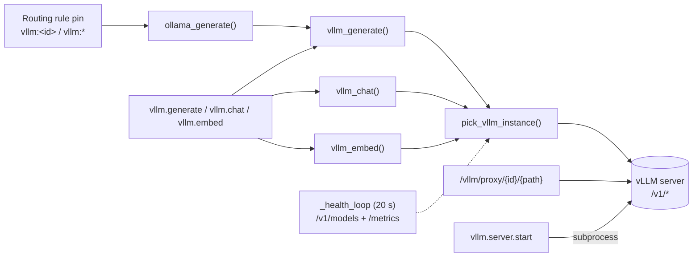

# 21 · vLLM Backend

[`vera/vllm/vllm_capabilities.py`](../vera/vllm/vllm_capabilities.py) integrates **vLLM** as an LLM backend. It mirrors the Ollama layer's pattern — an instance registry, health checks, a picker, a generate function — but targets vLLM's OpenAI-compatible server (`/v1/completions`, `/v1/chat/completions`, `/v1/embeddings`, `/v1/models`, Prometheus `/metrics`). The [LLM cluster router](./04-ollama-cluster.md) can delegate any job type, capability or role to it with a `vllm:` pin, so a caller does not need to know whether vLLM or Ollama served it.

The module loads with the normal orchestrator module set. Loading it makes `vllm.status` and the administrative surface available; it does not create a server or route traffic. Instances come from `VLLM_INSTANCES` or are added at runtime, and they are held **in memory only** — runtime additions are lost on restart.

**Status:** integration code is stable but optional; the reference deployment runs no vLLM server, so `vllm.status` normally reports zero instances. The portable OpenAI-compatible adapter (§14) is an offline, injected-transport seam.

## Contents

- [1. Why vLLM](#1-why-vllm)
- [2. Architecture](#2-architecture)
- [3. Instances and configuration](#3-instances-and-configuration)
- [4. Health monitoring and metrics](#4-health-monitoring-and-metrics)
- [5. Routing](#5-routing)
  - [Choosing a vLLM instance](#choosing-a-vllm-instance)
  - [How traffic reaches vLLM](#how-traffic-reaches-vllm)
- [6. Generation, chat and embeddings](#6-generation-chat-and-embeddings)
- [7. LoRA adapters](#7-lora-adapters)
- [8. Managed server lifecycle](#8-managed-server-lifecycle)
- [9. OpenAI-compatible passthrough proxy](#9-openai-compatible-passthrough-proxy)
- [10. Capability reference](#10-capability-reference)
- [11. Configuration reference](#11-configuration-reference)
- [12. Events](#12-events)
- [13. UI](#13-ui)
- [14. Portable inference boundary](#14-portable-inference-boundary)
- [15. Serving lifecycle and capacity](#15-serving-lifecycle-and-capacity)
- [16. Limitations and troubleshooting](#16-limitations-and-troubleshooting)
- [See also](#see-also)
- [Screenshots](#screenshots)
- [Capabilities](#capabilities)

---

## 1. Why vLLM

vLLM unlocks features that matter on a home-lab GPU:

| Feature | Benefit | How Vera exposes it |
|---|---|---|
| **PagedAttention** | KV-cache allocator without fragmentation; far better utilisation under concurrency | Server-side |
| **Continuous batching** | New prompts join in-flight batches at the iteration level | Server-side |
| **Speculative decoding** | A draft model runs ahead; the target verifies several tokens per step | `VLLM_SPEC_MODEL`, `spec_model` on `vllm.server.start` |
| **Prefix caching (APC)** | Shared prompt prefixes reuse KV blocks → lower time-to-first-token | `enable_prefix_caching` (default on for managed servers) |
| **Chunked prefill** | Long prompts do not starve decode | `enable_chunked_prefill` (default on for managed servers) |
| **Quantisation** | GPTQ / AWQ / FP8 / GGUF checkpoints | `VLLM_QUANTIZATION`, `quantization` |
| **Tensor parallelism** | Shard across GPUs | `VLLM_TENSOR_PARALLEL`, `tensor_parallel_size` |
| **CPU offload** | Spill to host RAM on small GPUs | `VLLM_CPU_OFFLOAD_GB`, `cpu_offload_gb` |
| **LoRA hot-swap** | Several adapters, chosen per request | `vllm.lora.load`, `lora_name` |
| **Logprobs / guided decoding** | Logprobs and JSON-schema / regex / choice / grammar constrained output | `logprobs`, `guided_json`, `guided_regex`, `guided_choice` (and `guided_grammar` on `vllm_generate`) |
| **Embeddings** | `/v1/embeddings` beside generation | `vllm.embed` |

---

## 2. Architecture



| Piece | Role |
|---|---|
| `VLLMInstance` | Dataclass for one server: `id`, `url`, `label`, `has_gpu`, `priority`, `api_key`, runtime state (`status`, `latency_ms`, `in_use`, `errors`, `models`), scraped metrics (`running_requests`, `waiting_requests`, `gpu_cache_usage`, `cpu_cache_usage`, `tokens_per_second`), `loaded_loras`, managed `pid` |
| `VLLM_INSTANCES` | The in-memory registry (`id → VLLMInstance`) |
| `pick_vllm_instance()` | Chooses an instance (§5) |
| `vllm_generate()` | `/v1/completions`; the drop-in companion to `ollama_generate()` |
| `vllm_chat()` | `/v1/chat/completions` with tools and guided decoding |
| `vllm_embed()` | `/v1/embeddings` |
| `_health_loop()` | 20 s health and metrics loop (§4) |
| `_vllm_proxy` | Reverse proxy `/vllm/proxy/{instance_id}/{path}` (§9) |
| `vllm_panel.html` | The vLLM pane, served at `/vllm/panel` |

---

## 3. Instances and configuration

`VLLM_INSTANCES` accepts either a single URL or JSON:

```bash
# one server → registered as id "vllm-0", has_gpu true, label "vLLM default"
VLLM_INSTANCES="http://10.0.0.30:8001"

# several, with optional label / priority / api_key per entry
VLLM_INSTANCES='[{"id":"gpu0","url":"http://10.0.0.30:8001","has_gpu":true,"priority":0},
                 {"id":"gpu1","url":"http://10.0.0.31:8001","has_gpu":true,"priority":1}]'
```

Missing fields default to `has_gpu: true`, `priority` = registration order, `api_key` = `VLLM_API_KEY`. A parse error is logged and no instances are registered.

At runtime:

```bash
curl -X POST http://localhost:8999/vllm/instances \
  -H 'Content-Type: application/json' \
  -d '{"id":"gpu0","url":"http://10.0.0.30:8001","label":"vLLM GPU"}'

curl -X DELETE http://localhost:8999/vllm/instances/gpu0
```

`vllm.instances.add` refuses an id that already exists, pings the new instance once, and emits `vllm.instance.added`. Because the registry is not persisted, put permanent instances in `VLLM_INSTANCES`.

---

## 4. Health monitoring and metrics

`_health_loop` (scheduled at module load) runs every 20 s **only when at least one instance is configured**; with none it sleeps quietly and emits nothing.

Per instance:

1. `GET /v1/models` (5 s timeout, bearer token if `api_key` is set). Success → `status: online`, `models`, `latency_ms`, `errors: 0`. Failure → `status: offline`, `errors += 1`.
2. If online, `GET /metrics` and parse the gauges `vllm:num_requests_running`, `vllm:num_requests_waiting`, `vllm:gpu_cache_usage_perc`, `vllm:cpu_cache_usage_perc`, `vllm:avg_generation_throughput_toks_per_s`.
3. An online instance with more than **32 waiting requests** or **GPU cache usage above 97 %** is marked `degraded`.

Each tick emits `vllm.health` with status, latency, running/waiting counts, GPU cache usage and tokens/s per instance. `vllm.metrics` returns the full parsed metric map for one instance on demand.

---

## 5. Routing

### Choosing a vLLM instance

`pick_vllm_instance(prefer_gpu=True, instance_id=None, model=None, require_lora=None)`:

1. An `instance_id` that exists in the registry is returned **regardless of its status**.
2. Candidates: instances with status `online` or `degraded` (never `offline`). None → `None`.
3. `require_lora`: keep instances that have that adapter registered, if any do.
4. `model`: keep instances whose `/v1/models` list contains it exactly, if any do.
5. `prefer_gpu`: keep GPU instances, if any.
6. Lowest score wins:

```
score = (0 if online else 10)          # degraded penalty
      + 2 × in_use + 0.5 × waiting_requests
      + 20 × max(0, gpu_cache_usage − 0.85)
      + priority
```

Each narrowing step is skipped when it would leave no candidates, so a model or LoRA mismatch degrades to "best available" rather than failing.

### How traffic reaches vLLM

| Path | Behaviour |
|---|---|
| **Routing pin** (recommended) | A job-type rule, per-capability rule or role-profile role whose `pin` is `vllm:<id>` (or `vllm:*` for the best instance) makes `ollama_generate` call `vllm_generate` with `system + "\n\n" + prompt`, the rule's model, `max_tokens` = the caller's `num_predict` (default 1024), `temperature`/`top_p` from options (0.7 / 0.9), `guided_json: {"type":"object"}` for JSON-mode calls, and the caller identity. If no vLLM instance is online, or the call raises, the request continues on normal Ollama routing. A caller that pins an Ollama `instance_id` bypasses the delegation. See [04 · LLM Cluster §11](./04-ollama-cluster.md#11-delegation-to-vllm-and-api-providers). |
| **Direct capabilities** | `vllm.generate`, `vllm.chat`, `vllm.embed` call the helpers directly. |
| **Passthrough proxy** | `/vllm/proxy/{id}/{path}` forwards any OpenAI-compatible request (§9). |
| **`llm.generate` `backend` argument** | See the limitation in §16. |

The Model Routing page lists vLLM servers beside Ollama nodes (it reads `vllm.status`), so `vllm:` pins can be chosen from the node pickers.

> [!NOTE]
> `vllm_generate` returns an empty string, not an exception, when no instance is available or both the primary and the failover attempt fail. The `vllm:` delegation in `ollama_generate` only falls back to Ollama when `pick_vllm_instance` finds nothing or the call raises; an empty completion is returned as-is.

---

## 6. Generation, chat and embeddings

**`vllm_generate`** (`/v1/completions`)

- Model: argument → `VLLM_MODEL` → the instance's first served model; none → logs an error and returns `""`.
- Body: `model`, `prompt`, `max_tokens` (512), `temperature` (0.7), `top_p` (0.9), `stream`, plus `top_k` (when > 0), `repetition_penalty` (when ≠ 1.0), `stop`, `logprobs`, `guided_json`, `guided_regex`, `guided_choice`, `guided_grammar`, a `lora_request` when `lora_name` is registered on the instance, and any `extra` keys merged in.
- Streaming: with `stream_cb`, SSE `data:` lines are parsed and each text delta is awaited on the callback.
- Accounting: `in_use` is held for the call; timeout 180 s.
- Events: reuses the cluster's `ollama.request`, `ollama.request_done`, `ollama.request_error` (with `backend: "vllm"`), so vLLM calls appear in the same Jobs views.
- Failover: on error, `errors += 1`, then one non-streaming retry on `pick_vllm_instance(prefer_gpu, model)` if that is a different instance.

**`vllm_chat`** (`/v1/chat/completions`) returns `choices[0].message` (including `tool_calls`), accepts `tools`, `tool_choice`, `stop`, `guided_json`, `guided_regex`, `lora_name`, `extra`, and streams `delta.content` to `stream_cb`. Errors return `{"error": …}`; there is no failover.

**`vllm_embed`** (`/v1/embeddings`, 60 s timeout) returns vectors ordered by `index`; errors return `[]`.

```bash
curl -X POST http://localhost:8999/vllm/chat -H 'Content-Type: application/json' -d '{
  "messages": [{"role":"user","content":"List three prime numbers as JSON."}],
  "guided_json": {"type":"object","properties":{"primes":{"type":"array","items":{"type":"integer"}}}},
  "max_tokens": 64
}'
```

---

## 7. LoRA adapters

`vllm.lora.load(lora_name, lora_path, instance_id)` assigns the next integer adapter id and records `lora_name → id` on the chosen instance; vLLM loads the adapter from `lora_path` on the server host on first use. The instance must run with `--enable-lora` (`VLLM_ENABLE_LORA=1` or `enable_lora: true` on a managed server) and enough `--max-loras`. Requests select an adapter with `lora_name`; `pick_vllm_instance(require_lora=…)` prefers instances that have it. `vllm.lora.list` shows registrations per instance. Registrations are in memory and are not re-applied after a Vera restart.

> [!NOTE]
> The request's `lora_request.lora_local_path` is set to the adapter *name*. Register adapters under a name that is also the path the server can resolve, or pass a custom `extra` body.

---

## 8. Managed server lifecycle

`vllm.server.start` launches `python -m vllm.entrypoints.openai.api_server` as a subprocess of the Vera process and registers it as `vllm-managed-<port>` (or the given `instance_id`) at `http://127.0.0.1:<port>`:

| Argument | Flag | Default |
|---|---|---|
| `model` (required) | `--model` | — |
| `host`, `port` | `--host`, `--port` | `0.0.0.0`, `8001` |
| `tensor_parallel_size` | `--tensor-parallel-size` | `VLLM_TENSOR_PARALLEL` (1) |
| `gpu_memory_utilization` | `--gpu-memory-utilization` | `VLLM_GPU_MEM_UTIL` (0.90) |
| `dtype` | `--dtype` | `VLLM_DTYPE` (`auto`) |
| `cpu_offload_gb` | `--cpu-offload-gb` (when > 0) | `VLLM_CPU_OFFLOAD_GB` (0) |
| `quantization` | `--quantization` | `VLLM_QUANTIZATION` |
| `max_model_len` | `--max-model-len` | `VLLM_MAX_MODEL_LEN` |
| `spec_model`, `spec_num_speculative_tokens` | `--speculative-model`, `--num-speculative-tokens` | `VLLM_SPEC_MODEL`, 5 |
| `enable_lora`, `max_loras` | `--enable-lora --max-loras` | `VLLM_ENABLE_LORA`, `VLLM_MAX_LORAS` (4) |
| `enable_prefix_caching` | `--enable-prefix-caching` | on |
| `enable_chunked_prefill` | `--enable-chunked-prefill` | on |
| `max_num_batched_tokens` | `--max-num-batched-tokens` | — |
| `api_key` | `--api-key` | `VLLM_API_KEY` |
| `served_model_name` | `--served-model-name` | — |
| `extra_args` | appended verbatim | — |

The call returns immediately with `{instance_id, pid, url, cmd}`; health checks pick the server up once it binds. If the `vllm` package is not installed the result says so. `vllm.server.stop` terminates the process (kill after 10 s), removes the instance, and emits `vllm.server.stopped`.

> [!WARNING]
> A managed server is a child of the Vera process: it shares Vera's host, is not supervised or restarted, and its exact flag set depends on the installed vLLM version. It is an administrative convenience, not a production deployment. It also does not take the [cross-process Ollama gate](./04-ollama-cluster.md#6-concurrency-slots-semaphores-and-the-cross-process-gate), so it can contend with Ollama for the same GPU.

---

## 9. OpenAI-compatible passthrough proxy

```
GET|POST|DELETE http://<vera-host>:8999/vllm/proxy/{instance_id}/{path}
```

Forwards the raw body and query string to `<instance url>/{path}` with the instance's bearer token, holding an `in_use` slot for the request. A body with `"stream": true` is relayed as `text/event-stream`; otherwise the JSON response and status code are returned. Unknown instance → 404; transport error → 502. The proxy does not pick an instance — the caller names one.

---

## 10. Capability reference

| Capability | Route | Purpose |
|---|---|---|
| `vllm.status` | `GET /vllm/status` | Every instance (status, latency, in_use, errors, models, metrics, LoRAs, pid), totals, default model, global launch config |
| `vllm.instances.add` | `POST /vllm/instances` | Register an instance (`id`, `url`, `label`, `has_gpu`, `priority`, `api_key`) |
| `vllm.instances.remove` | `DELETE /vllm/instances/{instance_id}` | Remove an instance |
| `vllm.models` | `GET /vllm/models` | Models per online/degraded instance plus a de-duplicated list |
| `vllm.generate` | `POST /vllm/generate` | `/v1/completions` with sampling, stop, logprobs, guided decoding, LoRA |
| `vllm.chat` | `POST /vllm/chat` | `/v1/chat/completions` with tools and guided decoding |
| `vllm.embed` | `POST /vllm/embed` | `/v1/embeddings` → `{embeddings, count, dim}` |
| `vllm.lora.load` | `POST /vllm/lora/load` | Register a LoRA adapter on an instance |
| `vllm.lora.list` | `GET /vllm/lora` | Registered adapters per instance |
| `vllm.metrics` | `GET /vllm/metrics` | Parsed Prometheus metrics for one instance |
| `vllm.server.start` | `POST /vllm/server/start` | Launch a managed server subprocess |
| `vllm.server.stop` | `POST /vllm/server/stop` | Stop a managed server |

There is no separate `vllm.instances.list` capability; `vllm.status` lists instances.

---

## 11. Configuration reference

| Variable | Default | Purpose |
|---|---|---|
| `VLLM_INSTANCES` | empty | A URL or JSON list of instances |
| `VLLM_MODEL` | empty | Default model name |
| `VLLM_API_KEY` | empty | Bearer token for instances without their own |
| `VLLM_QUANTIZATION` | empty | `gptq` \| `awq` \| `fp8` \| `gguf` \| … for managed launches |
| `VLLM_TENSOR_PARALLEL` | `1` | Tensor-parallel size |
| `VLLM_GPU_MEM_UTIL` | `0.90` | GPU memory fraction |
| `VLLM_CPU_OFFLOAD_GB` | `0` | Host-RAM offload |
| `VLLM_SPEC_MODEL` | empty | Draft model for speculative decoding |
| `VLLM_MAX_MODEL_LEN` | unset | Context window override |
| `VLLM_ENABLE_LORA` | `0` | `1` enables LoRA on managed launches |
| `VLLM_MAX_LORAS` | `4` | Concurrent adapters |
| `VLLM_DTYPE` | `auto` | `bfloat16` \| `float16` \| `float32` \| `auto` |

The launch settings apply only to `vllm.server.start`; an externally run server is configured on its own command line.

---

## 12. Events

| Event | When |
|---|---|
| `vllm.health` | Each health tick (only when instances exist) |
| `vllm.instance.added`, `vllm.instance.removed` | Registry changes |
| `vllm.lora.loaded` | `vllm.lora.load` |
| `vllm.server.started`, `vllm.server.stopped` | Managed server lifecycle |
| `ollama.request`, `ollama.request_done`, `ollama.request_error` | Each `vllm_generate` call (`backend: "vllm"`) |

---

## 13. UI

The **vLLM** pane inside the **Workers & Ollama** tab iframes `/vllm/panel` (`vllm_panel.html`). It shows per-instance health, served models, registered LoRA adapters and parsed metrics (throughput, queue, KV-cache usage), and offers add/remove, a test console (`/vllm/chat` or `/vllm/generate`), LoRA registration, metrics, and the managed-server start/stop controls. It refreshes from `vllm.status` when `vllm.health` events arrive. The panel is served standalone because its scripts must run in their own window.

---

## 14. Portable inference boundary

`vera/models/openai_inference_adapter.py` provides the provider-neutral boundary for OpenAI-compatible completion, chat and embedding servers. A model package, backend model selector and transport are bound when the provider is created; callers submit the same content-addressed `InferenceRequest` and consume the same ordered `InferenceEvent` stream used by other model runtimes.

The transport is injected. It owns HTTP, authentication, endpoint discovery and server-sent-event decoding, while the adapter owns deterministic request mapping, response validation, output limits, usage accounting and stable failure codes. Routing, retries and fallback remain above this layer, so wrapping a vLLM server does not introduce a second hidden policy loop. The adapter supports `/v1/completions`, `/v1/chat/completions` and `/v1/embeddings`. Package compatibility fixes the accepted task and input/output contracts; a request cannot replace the bound model, endpoint, credentials or transport. The same inference call is therefore portable to vLLM and other OpenAI-compatible serving products.

### Readiness is more than module availability

`vllm.status` can be healthy as a Vera capability while reporting zero instances: the integration code loaded, but no serving endpoint is configured. A usable deployment additionally needs a reachable endpoint with known GPU admission, a compatible content-verified `ModelPackage`, an `InferenceDeployment`, and fresh health evidence for that package and placement (see [30 · ONNX §10](./30-onnx.md#10-portable-model-layer)). Do not infer inference readiness from capability registration alone.

The managed subprocess controls are administrative tools, not a shortcut around those requirements. A process launched inside the orchestrator does not by itself prove shared GPU admission, package provenance, restart ownership or production routing safety.

---

## 15. Serving lifecycle and capacity

Vera treats each vLLM endpoint as a model-serving instance with health, available models, routing metadata and optional managed-process state. On an installation with no configured endpoint, `vllm.status` reports an empty instance set rather than pretending a model is ready. Add an instance only after its lifecycle owner, package, placement, GPU sharing, rollback and teardown path are known.

Capacity is dominated by model weights, KV cache, maximum model length, batching, tensor parallelism and LoRA allocation. A server that binds but cannot complete a warm-up request is not healthy. Verify `/v1/models`, run a small generation, then inspect `vllm.metrics` before routing production traffic to it with a `vllm:` pin. Reduce context or batch pressure before raising GPU memory utilisation.

Managed launch settings such as quantisation, dtype, speculative model, prefix caching and chunked prefill are workload decisions, not universal optimisations. Record them with benchmarks; see [Performance and sizing](./00-performance-and-sizing.md) for a repeatable measurement procedure.

---

## 16. Limitations and troubleshooting

| Symptom / limitation | Explanation |
|---|---|
| `llm.generate` with `backend="vllm"` (or `auto` + `prefer_gpu`) still answers from Ollama | `llm.generate` looks for the vLLM module under a package path at which the loader does not register it; the lookup fails silently and the call uses Ollama. Route to vLLM with a `vllm:` pin in the routing rules, or call `vllm.generate` / `vllm.chat` directly. |
| Instances disappear after restart | The registry is in memory; use `VLLM_INSTANCES`. |
| Empty text from `vllm.generate` | No instance online, no model resolvable, or both attempts failed; check the log line `vllm_generate [...] FAILED` and `vllm.status`. |
| Instance shows `degraded` | More than 32 queued requests or GPU KV cache above 97 %; reduce load or `max_model_len`. |
| A pinned `instance_id` is used even though it is offline | Explicit ids bypass the status filter by design. |
| LoRA request ignored | The adapter is not registered on the chosen instance, or the server was started without `--enable-lora`. |
| vLLM and Ollama contend for the GPU | vLLM calls do not take the cluster's gate lease; give vLLM its own GPU or route all GPU work to one backend. |

---

## See also

- [LLM Cluster](./04-ollama-cluster.md) — the router that delegates to vLLM; Ollama is the sibling backend
- [ONNX Export & Runtime](./30-onnx.md) — the portable model layer (ModelPackage, deployments, inference contracts)
- [Agent Runtimes & Providers](./36-agent-runtimes-providers.md) — external API providers, the other delegation target
- [Configuration](./10-configuration.md) — env vars in one place
- [Capability Framework](./01-capability-framework.md) — `vllm.*` registration
- [Machine Learning](./16-machine-learning.md) — training that can produce LoRA adapters

## Screenshots

<!-- VERA:AUTO:screenshots START -->
_No screenshots captured yet — run `docs.build` (or `operator.mission.run documentation`)._
<!-- VERA:AUTO:screenshots END -->

## Capabilities

<!-- VERA:AUTO:capabilities START -->
_No capabilities resolved for this domain._
<!-- VERA:AUTO:capabilities END -->
