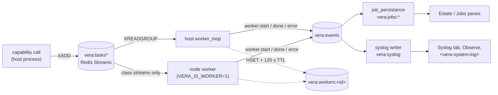

# 22 · Workers, Jobs & Syslog

The `vera/workers/` package holds Vera's distributed-execution and
operational-observability internals: the **worker registry** every Vera process
joins, the **placement rules** that decide which process may run a task,
**durable job persistence and orphan recovery** for the Redis task streams, the
**syslog** feed (enriched error records plus an LLM-backed diagnosis helper), the
**node agent / node activity** views into what the compute nodes are actually
doing, and the reusable observability UI elements. Two siblings complete the
picture: `vera/monitor/` (the stack monitor and the Perf/diagnostics tools) and
the process-level helpers `vera/scheduler_leadership.py` (one instance runs the
shared sweeps) and `vera/log_setup.py` (the on-disk application log).

The LLM routing half of `workers/cluster.py` is covered in
[LLM Cluster](./04-ollama-cluster.md) and the Docker backend
(`docker_capabilities.py`, `docker_disk_*`, `docker_host_health_*`,
`image_drift.py`) in [Docker](./13-docker.md). Everything here is in daily use
on the live instance; the node-worker offload stages and automatic runner
reaping are opt-in and off by default.

## Contents

- [1. Architecture at a glance](#1-architecture-at-a-glance)
- [2. Source map](#2-source-map)
- [3. Worker registry](#3-worker-registry)
  - [3.1 Registration, heartbeat and metrics](#31-registration-heartbeat-and-metrics)
  - [3.2 Ghost registrations](#32-ghost-registrations)
  - [3.3 Worker routes and capabilities](#33-worker-routes-and-capabilities)
- [4. Task placement and node workers](#4-task-placement-and-node-workers)
  - [4.1 Streams](#41-streams)
  - [4.2 Node-safe namespaces and task classes](#42-node-safe-namespaces-and-task-classes)
  - [4.3 Offload stages](#43-offload-stages)
  - [4.4 What a node worker does not run](#44-what-a-node-worker-does-not-run)
- [5. Dispatch, ownership and recovery](#5-dispatch-ownership-and-recovery)
- [6. Durable job persistence — `jobs.*`](#6-durable-job-persistence--jobs)
  - [6.1 How jobs are recorded](#61-how-jobs-are-recorded)
  - [6.2 Orphan recovery at boot](#62-orphan-recovery-at-boot)
  - [6.3 Background sweeps](#63-background-sweeps)
  - [6.4 Capabilities](#64-capabilities)
- [7. Cluster job views — `obs.cluster`, `cluster.job.stop`](#7-cluster-job-views--obscluster-clusterjobstop)
- [8. Syslog — enriched events and errors](#8-syslog--enriched-events-and-errors)
  - [8.1 Records and categories](#81-records-and-categories)
  - [8.2 Trigger chain](#82-trigger-chain)
  - [8.3 Capabilities](#83-capabilities)
  - [8.4 The proactive monitor](#84-the-proactive-monitor)
- [9. Compute-node visibility](#9-compute-node-visibility)
  - [9.1 Node agent and runners](#91-node-agent-and-runners)
  - [9.2 Node activity](#92-node-activity)
  - [9.3 Routing helpers](#93-routing-helpers)
- [10. Stack monitor and Perf diagnostics](#10-stack-monitor-and-perf-diagnostics)
  - [10.1 `sysmon.*`](#101-sysmon)
  - [10.2 `perf.*`](#102-perf)
- [11. Scheduler leadership](#11-scheduler-leadership)
- [12. Application log file](#12-application-log-file)
- [13. Reusable observability elements](#13-reusable-observability-elements)
- [14. Discovery execution planning](#14-discovery-execution-planning)
- [15. Configuration reference](#15-configuration-reference)
- [16. Redis keys and events](#16-redis-keys-and-events)
- [17. Troubleshooting](#17-troubleshooting)
- [See also](#see-also)
- [Screenshots](#screenshots)
- [Capabilities](#capabilities)

---

## 1. Architecture at a glance



Every Vera process is a worker: it runs `worker_loop`, reads one or more task
streams through the `GROUP_WORKERS` consumer group, and mirrors its state into
`vera:workers:<worker_id>`. Every state change is published on `vera:events`,
which two independent listeners turn into durable records — job history
(`vera:jobs:*`) and the syslog (`vera:syslog`).

## 2. Source map

| File | Responsibility |
|---|---|
| `vera/workers/workers.py` | Worker metrics collector, ghost-registration sweep, `/cluster/jobs`, `/cluster/workers/*` routes, the **Estate** and **Models** tabs |
| `vera/workers/worker_registry_hygiene.py` | Pure rules: when a metrics write may touch a registration; what counts as a ghost |
| `vera/workers/worker_placement_core.py` | Pure placement rules: node-safe namespaces, task classes, streams, offload stages, reply streams |
| `vera/workers/job_persistance.py` | `jobs.*`: event listener, orphan recovery, history hydration, cleanup/sweep/prune timers |
| `vera/workers/cluster.py` | `obs.cluster`, `obs.proxy_log`, `cluster.job.stop`, `cluster.mimic.*` (routing half → [04](./04-ollama-cluster.md)) |
| `vera/workers/syslog.py` | `syslog.*`: enriched log writer, trigger chain, DAG error context, monitor |
| `vera/workers/syslog_summary_core.py` | Pure windowed error/warning summary for `syslog.error_summary` |
| `vera/workers/node_agent_capabilities.py` | `nodes.agent.status`, `nodes.runner.*`, `nodes.ollama.dispatch_check` |
| `vera/workers/node_activity_capabilities.py`, `node_activity_core.py`, `node_activity_element.js` | `nodes.activity*` and the `<vera-node-activity>` element |
| `vera/workers/node_choice.py`, `route_preference.py`, `probe_backoff.py`, `poll_cache.py`, `node_temps_core.py`, `routing_parity_core.py` | Pure routing/probing helpers (see [§9.3](#93-routing-helpers)) |
| `vera/workers/warm_models_capabilities.py`, `warm_models_core.py` | `ollama.warm.*` warm-slot planner (→ [04](./04-ollama-cluster.md)) |
| `vera/workers/nodes_capabilities.py` | Node estate, detection, unified provisioning, storage, backups, `obs.node_temps`, `nodes.ollama.*` tuning (→ [35](./35-infrastructure-provisioning.md), [04](./04-ollama-cluster.md)) |
| `vera/workers/observe_elements_capabilities.py` + `live_event_stream_element.js`, `system_log_element.js` | Reusable `<vera-live-event-stream>` and `<vera-system-log>` elements |
| `vera/workers/job_persistence_panel.html` | Standalone job-history panel markup |
| `vera/monitor/monitor_capabilities.py` | `sysmon.status`, `sysmon.history`, the **Monitor** widget |
| `vera/monitor/perf_capabilities.py`, `perf_gate_core.py`, `stall_trace_core.py` | `perf.*`: log capture, stall feed, scan/gate/remediate, the **Perf** widget |
| `vera/scheduler_leadership.py` | Pure lease rules for `singleton=True` scheduled jobs |
| `vera/log_setup.py` | Pure config for the rotating on-disk application log and credential redaction |
| `vera/provisioning/components_capabilities.py` | `nodes.workers.*` (node-worker roles, offload stage, provisioning) |

## 3. Worker registry

### 3.1 Registration, heartbeat and metrics

Each worker's registration is a Redis hash `vera:workers:<worker_id>` with a
**120 s TTL**, written by the worker loop in `capability_orchestration.py` and
refreshed on every poll. `obs.workers` (`GET /workers`, defined in
`capability_orchestration.py`) reads every such key, decodes the capability
list, then overlays the in-process `WORKER_REGISTRY` (more accurate for the
local host), so a dashboard on any host sees every host.

`workers.py` adds a metrics collector (`worker_metrics` startup hook) that
every 10 s writes `cpu_pct`, `ram_*` and `disk_*` (via `psutil`, sampled
non-blocking) into each **local** worker's hash and re-asserts the TTL.

Per-worker on/off flags are persisted in the hash `vera:worker_meta` so a
disabled worker stays disabled across restarts (`_restore_worker_meta`).

### 3.2 Ghost registrations

A metrics `HSET` on a key whose TTL has lapsed would recreate it with metrics
only and no expiry — a permanent "unknown" worker. `worker_registry_hygiene`
prevents that: metrics are written only onto a key that already exists, and the
TTL is refreshed on every write. Ghosts that predate the guard (no
`id`/`host`/`pid`/`started` **and** no expiry) are removed by:

- the `worker_registry_ghost_sweep` scheduled job (every 600 s, `singleton=True`), and
- `obs.workers.prune` (`POST /workers/prune`, `dry_run=true` by default), which
  re-checks each key at delete time and emits `workers.registry.pruned`.

### 3.3 Worker routes and capabilities

| Route / cap | Purpose |
|---|---|
| `obs.workers` — `GET /workers` | Merged worker registry (all hosts) |
| `obs.pending` — `GET /pending` | Pending result futures awaiting distributed completion |
| `obs.workers.prune` — `POST /workers/prune` | Remove ghost registrations (`dry_run`) |
| `GET /cluster/jobs?limit=&offset=` | Pending (unacknowledged stream entries, via `XPENDING`), running (from the registry) and done jobs |
| `POST /cluster/workers/init` | SSE stream: SSH-initialise a remote worker (`worker_id`, `host`, `port`, `user`, `auth`, `packages`, `worker_class`) |
| `POST /cluster/workers/sync` | SSE stream: sync code to a worker |
| `POST /cluster/workers/heartbeat` | Heartbeat from an SSH-provisioned worker |
| `POST /cluster/workers/{wid}/drain` | Drain a worker |
| `POST /cluster/workers/{wid}/enable` / `disable` | Toggle dispatch to a worker (persisted in `vera:worker_meta`) |
| `DELETE /cluster/workers/{wid}/remove` | Delete the registration and its meta |

UI: `workers.py` registers the **Estate** tab (`workers-ollama`, `tab_order=1`,
specialist agent `infra-operator`) and the **Models** tab (`models`,
`tab_order=2`) — the same `workers_ollama_panel.html` opened with
`?view=models`.

## 4. Task placement and node workers

A **node worker** is a full Vera process started with `VERA_IS_WORKER=1` on a
compute node and joined to the shared streams. Because a node has every
capability loaded, "has the cap" is not enough: `worker_placement_core.py`
decides what such a process may run, using an **allow-list** (a deny-list would
fail open — a harmless-looking cap can keep host-local state, and composing caps
run children in-process).

### 4.1 Streams

| Stream | Read by |
|---|---|
| `vera:tasks` | Everyone (legacy shared stream, kept for older processes) |
| `vera:tasks:host` | The Vera host only — host-bound caps |
| `vera:tasks:cls:<class>` | The host, plus node workers given that class |
| `vera:results:p:<proc>` | Per-process reply stream (TTL 3600 s), so a result returns to the process that asked |

`stream_for(cap)` sends a host-bound cap to `vera:tasks:host` and a node-safe
one to its class stream. A worker that meets a task it may not run hands it to
`handoff_stream()` — a stream the host always reads, so tasks cannot bounce
between nodes.

### 4.2 Node-safe namespaces and task classes

Node-safe namespaces: `llm`, `nlp`, `text`, `math`, `http`, `memory`, `echo`.
Individually vetted caps: `gpu.health`, `stt.transcribe`, `tts.synthesize`,
`tts.voices` (class `media`), `data.json_validate`, `data.json_flatten`,
`system.timestamp` (class `general`). A cap whose last name segment is a
mutator (`set`, `config`, `configure`, `enable`, `disable`, `reset`, `reload`,
`register`, `unregister`, `save`, `delete`) or that contains `.config.` is
always host-only.

| Class | Covers | Default on |
|---|---|---|
| `general` | `llm`, `text`, `math`, `http`, `memory`, `echo` + vetted pure caps | CPU nodes |
| `nlp` | `nlp.*` (NER, classification, zero-shot, QA, embeddings, rerank) | CPU nodes |
| `cpu_compute` | Nothing vetted yet | — |
| `media` | STT/TTS calls to the media server | — |

A GPU node's worker takes no classes by default. A worker resolves its
classes in this order: roles set from the UI (hash `vera:node_workers:roles`,
keyed by `VERA_WORKER_HOST_ID`, re-read every 30 s without a restart), then
`VERA_WORKER_CLASSES` (comma list; `none` takes nothing), then the CPU default. Operator overrides: `VERA_WORKER_NODE_OK` (admit a namespace
or exact cap) and `VERA_WORKER_HOST_ONLY` (force host-only; wins over
everything).

| Capability | Purpose |
|---|---|
| `nodes.workers.list` — `GET /nodes/workers` | Classes, each node's worker (status, commit, caps, whether on the host's commit) |
| `nodes.workers.roles.set` — `POST /nodes/workers/roles` | Set a node's classes (`host_id`, `classes`, `reset`) |
| `nodes.workers.dispatch` — `POST /nodes/workers/dispatch` | Set the offload stage (below) |
| `nodes.workers.provision` — `POST /nodes/workers/provision` | Install or refresh the native worker on a node over SSH |

### 4.3 Offload stages

The offload stage (stored at `vera:node_workers:dispatch` as
`{"stage": n, "exclude": [...]}`) controls which node-safe calls the host
**sends** to node workers. A call is offloaded only when a node worker of its
class is idle right now; otherwise it runs on the host as before. Calls from a
dev sandbox and calls whose arguments are not JSON are never offloaded.

| Stage | Name | Classes offloaded |
|---|---|---|
| 0 | `idle` | None (idle-queue jobs only) — the default |
| 1 | `nlp` | `nlp` |
| 2 | `compute` | `nlp`, `general` except `llm.*` |
| 3 | `llm` | `nlp`, `general` (LLM generation still goes through the shared GPU gate) |
| 4 | `media` | + `media` |
| 5 | `full` | Every class |

### 4.4 What a node worker does not run

`scheduler_may_run()` gives a node worker **no periodic jobs** and only three
startup hooks: `worker_metrics`, `memory_startup`, `memory_hooks_startup`. That
is why pollers such as `telegram_startup`, `email_startup`, `job_persist_startup`
or `syslog_startup` never run twice on a node. Worker BLAS/OpenMP pools are
capped at 2 threads by default (`OMP_NUM_THREADS` and friends), with systemd
`CPUWeight=50` and `nice 5` so the node's Ollama runner keeps priority.

## 5. Dispatch, ownership and recovery

Distributed calls are published to a Redis Stream with a task identity and are
claimed by workers that advertise compatible capabilities. The orchestrator
tracks the pending result (`obs.pending`); the worker emits `worker.start`,
then `worker.done` or `worker.error`; job history provides the durable
operator view. Model requests add a second routing layer to the selected
Ollama/vLLM instance ([04](./04-ollama-cluster.md), [21](./21-vllm.md)).

Distinguish **queued**, **claimed**, **running** and **terminal** states:

| Symptom | Likely cause |
|---|---|
| Growing queue, idle workers | Capability/route or class mismatch — nobody reads that stream |
| Claimed work, no heartbeat | Dead worker; recovery will reclaim it after `VERA_RECOVERY_IDLE_MS` |
| Terminal model request, pending parent job | Result correlation or restart recovery |

Use `obs.workers`, `obs.pending`, `jobs.stats`, Redis group information, and
syslog — in that order. Recovery operations can fail-mark stale work or prune
dead consumers; they **do not recreate lost side effects**. Capabilities with
external mutations must be idempotent or carry their own operation key before
automatic retry is safe.

See [Capability Framework §6](./01-capability-framework.md#6-distributed-dispatch)
for the dispatch mechanics.

## 6. Durable job persistence — `jobs.*`

`job_persistance.py` (the file name keeps its historical spelling) makes job
state survive a restart and gives visibility into what Ollama was processing
when a process died.

### 6.1 How jobs are recorded

A listener subscribes to the `vera:events` pub/sub channel and persists every
job transition into a hash `vera:jobs:<id>` (TTL `VERA_JOB_TTL`, 7 days) indexed
by the sorted set `vera:jobs_idx` (score = timestamp):

| Event | Recorded as |
|---|---|
| `worker.start` | `running` |
| `worker.done` | `done` (with `elapsed_s`) |
| `worker.error` | `failed` (with `error`) |
| `ollama.request` (fires at submission and again as a heartbeat with `phase`) | `ollama.generate` record, merged rather than reset; caller file/function, model, instance, prompt preview and full prompt (capped at `VERA_JOB_PROMPT_FULL_MAX`) |

Terminal records are also archived to Postgres table `vera_task_results` when
`VERA_JOB_ARCHIVE_PG=1` (default) and a pool is available. Recent Ollama calls
are kept in the hash `vera:ollama_log`.

### 6.2 Orphan recovery at boot

`job_persist_startup` runs once Redis is up:

1. Sets a new boot id (`vera:boot_id`, `boot-<epoch>-<pid>`).
2. For every stream the host reads, scans `XPENDING` and reclaims entries idle
   longer than `VERA_RECOVERY_IDLE_MS` (default 120 000 ms) — **unless** the
   consumer's own `vera:workers:<consumer>` registration still exists, because
   idle time counts from delivery and a live worker on a long task would
   otherwise run it twice.
3. Re-queues each reclaimed task on its placement stream with `recovered=true`
   (records `orphan_reclaimed`), or marks it `failed` if the capability is no
   longer registered, then `XACK`s the original.
4. Prunes dead consumers, hydrates `COMPLETED_JOBS` (last 500) so
   `/cluster/jobs` shows history after a reboot, and starts the event listener.
5. Emits `job_persist.recovery_done` with `boot_id` and `reclaimed`.

### 6.3 Background sweeps

| Job | Interval | Does |
|---|---|---|
| `job_persist_cleanup` | 3600 s | Trims `vera:jobs_idx` past the TTL and above `VERA_JOB_IDX_MAX` (5000); trims `vera:ollama_log` above 600 entries |
| `job_persist_sweep_stuck` | 600 s | Fail-marks `ollama.generate` records still `running` after `max(2 × OLLAMA_GEN_TIMEOUT, 1800 s)` — scoped to generation only, since agent loops legitimately run for hours |
| `job_persist_prune_consumers` | 900 s | `XGROUP DELCONSUMER` for consumers with no pending messages idle ≥ `VERA_CONSUMER_STALE_IDLE_MS` (10 min) |

### 6.4 Capabilities

| Cap | Route | Purpose |
|---|---|---|
| `jobs.history` | `GET /jobs/history` | Persisted records; filters `limit`, `offset`, `status`, `cap`, `since_ts` → `{jobs, total, boot_id}` |
| `jobs.stats` | `GET /jobs/stats` | Done/failed/reclaimed counts, stream health, consumers with idle times (skipped above `VERA_CONSUMER_DETAIL_MAX`), boot info |
| `jobs.ollama_log` | `GET /jobs/ollama_log` | Which `caller_file:caller_func` hit which instance (GPU vs CPU), model, elapsed |
| `jobs.recover_now` | `POST /jobs/recover` | Run the orphan recovery scan now |
| `jobs.running_at_boot` | `GET /jobs/running_at_boot` | Jobs that were `running` when the server last died |
| `jobs.delete_consumer` | `POST /jobs/delete_consumer` | Remove a stale consumer from the group (`XGROUP DELCONSUMER`) |
| `jobs.purge_pending` | `POST /jobs/purge_pending` | ACK and discard **all** pending messages in the task stream |

> [!WARNING]
> `jobs.purge_pending` discards work rather than recovering it. Prefer
> `jobs.recover_now` first; purge only when entries can never complete.

UI: the Jobs pane of the Estate panel (`workers_ollama_panel.html`) gains a
History view and "Recovered" badges; `job_persistence_panel.html` holds the
standalone history/stats/maintenance markup.

## 7. Cluster job views — `obs.cluster`, `cluster.job.stop`

| Cap | Route | Purpose |
|---|---|---|
| `obs.cluster` | `GET /cluster` | Workers cross-referenced with their Ollama nodes — VRAM, running models, queue ([04 §5](./04-ollama-cluster.md)) |
| `obs.proxy_log` | `GET /cluster/proxy_log` | Recent requests through the local Ollama proxy (`vera:ollama_proxy_log`) |
| `cluster.job.stop` | `POST /cluster/job/stop` | Stop a job by `task_id`: cancels it if running in this process, adds it to the cancelled set, and broadcasts a cancel through Redis so the host running it cancels or discards it |
| `cluster.mimic.status` / `.config` / `.requests` / `.requests.clear` | `/cluster/mimic/*` | Status and runtime control (`paused`, `max_concurrency`, `prefer_gpu`) of the Ollama-compatible mimic proxy (`/ollama/*`), and its request log |

## 8. Syslog — enriched events and errors

`syslog.py` turns the thin `cap.error`/`cap.call`/`cap.ok`/`worker.*` events into
structured, queryable records with source context, and surfaces them in the
harness **Syslog** tab, the Observe page, and `<vera-system-log>`.

### 8.1 Records and categories

The `SyslogWriter` reads `vera:events` (XREAD) and writes `SyslogRecord`s to the
stream `vera:syslog` (`SYSLOG_MAXLEN`, 5000). `WARNING`/`ERROR`/`CRITICAL`
records are **also** copied to `vera:syslog:errors` (`SYSLOG_ERR_MAXLEN`, 3000)
with their main-stream id, so an error from minutes ago is still findable after
routine lines have rolled the main stream. At startup it also patches the
`@capability` wrapper to capture tracebacks before they are folded into
`{"error": ...}` dicts.

| Event | Level | Category |
|---|---|---|
| `cap.error` | ERROR | `cap` (with resolved source file, function, code and line) |
| `worker.error` | ERROR | `worker` |
| `system.error`, `module.load_error` | CRITICAL | `system` |
| `ollama.proxy_request` | DEBUG | `proxy` |
| `ollama.request`, `ollama.request_done` | INFO | `ollama` |
| `ollama.request_error` | ERROR | `ollama` |
| `cap.call`, `cap.ok` | INFO | `cap` |

Record fields include `id`, `ts`, `level`, `category`, `event_type`, `message`,
`detail` (full error/traceback), `cap_name`, `cap_group`, the trigger chain,
`source_file`/`source_func`/`lineno`, `extra` and `resolved`.

### 8.2 Trigger chain

Every call already has a `trace_id`. Syslog adds a context-variable chain —
`trigger_id` (parent call's trace id), `trigger_cap` and `session_id` — that
flows through async code, so a record says what called what. The DAG replanner
uses `get_dag_error_context(cap_name, error)` to pull the latest matching record
(with source and traceback) into its replanning prompt ([03](./03-dag-engine.md)).

### 8.3 Capabilities

| Cap | Route | Purpose / key args |
|---|---|---|
| `syslog.query` | `GET /syslog/query` | Filter by `level`, `category`, `cap_name`, `keyword`; `limit` (100) |
| `syslog.errors` | `GET /syslog/errors` | Recent errors + warnings, with source code when `include_code` |
| `syslog.error_summary` | `GET /syslog/error_summary` | Counts by level/cap/category, a bucketed series, newest entries, last error over `window_s` (3600) in `bucket_s` (300) buckets |
| `syslog.ask` | `POST /syslog/ask` | **LLM**: `question` + one entry (`log_id`), the latest error for `cap_name`, or several (`entries_json`) with their source code → diagnosis and fix |
| `syslog.monitor_start` | `POST /syslog/monitor/start` | Start the monitor; `interval` (s, min 60) |
| `syslog.monitor_stop` | `POST /syslog/monitor/stop` | Stop it |
| `syslog.monitor_run` | `POST /syslog/monitor/run` | One check now; returns the report |
| `syslog.clear` | `POST /syslog/clear` | **Trim** both streams to the last `keep` (500) entries |
| `syslog.status` | `GET /syslog/status` | Record count, monitor state/interval, last 5 errors |

`syslog.ask` is what powers "why did that fail?" in the UI. Syslog errors are
also a [Dream](./17-dream.md) sensor source.

### 8.4 The proactive monitor

Off unless `SYSLOG_MONITOR=1` (or started with `syslog.monitor_start`). Every
`SYSLOG_MONITOR_INT` seconds (300) it reads the latest 20 errors and 10
warnings, groups them by capability, asks the cluster for a 2–4 sentence
root-cause analysis, and emits a `syslog.monitor_report` event
(`error_count`, `warn_count`, `caps_affected`, `analysis`, `top_errors`).

## 9. Compute-node visibility

### 9.1 Node agent and runners

Ollama reports which models are **resident**, never which are **computing**.
`node_agent_capabilities.py` talks to the Vera node agent on each compute node
(port `VERA_NODE_AGENT_PORT`, 8770; mutating calls carry `VERA_NODE_TOKEN`).

| Cap | Route | Purpose |
|---|---|---|
| `nodes.agent.status` | `GET /nodes/agent/status` | Cores, load, memory, runner count per node |
| `nodes.runner.list` | `GET /nodes/runner/list` | Every compute-worker process (Ollama's `llama-server`) with pid, model, state, CPU and a `stuck` flag |
| `nodes.ollama.dispatch_check` | `GET /nodes/ollama/dispatch_check` | Is each node actually generating, or only answering metadata? Probes a 1-token generation on a resident model |
| `nodes.runner.kill` | `POST /nodes/runner/kill` | Terminate one runner (`node`, `pid`, `force`, `reason`); emits `nodes.runner.killed` |
| `nodes.runner.reap` | `POST /nodes/runner/reap` | Apply the stuck rule now |

**Stuck rule:** a runner still computing after `VERA_RUNNER_STUCK_S` (default
`2 × OLLAMA_GEN_TIMEOUT`) has outlived every client waiting on it. The
`nodes_runner_reap` job (300 s, singleton, skipped in sandboxes) only **reports**
(`nodes.runner.stuck`) unless `VERA_RUNNER_REAP=1`, and then kills at most
`VERA_RUNNER_REAP_MAX` (2) per pass (`nodes.runner.reaped`). Dispatch probes
time out after `VERA_DISPATCH_PROBE_S` (25 s); a node failing
`VERA_DISPATCH_CONFIRM_N` (3) probes in a row raises
`nodes.ollama.dispatch_wedged` once, and `nodes.ollama.dispatch_recovered` when
it answers again. The wedge check never kills anything.

### 9.2 Node activity

Node-side taps (`edge/ollama_tap.py`, installed by `nodes.ollama.tap`) write
every generate/chat/embed call — from prod, sandboxes or external clients — to
the shared stream `vera:node_activity`, and in-flight calls to
`vera:node_activity:inflight:<node>`.

| Cap | Route | Purpose |
|---|---|---|
| `nodes.activity` | `GET /nodes/activity` | Per node: running now, recent calls (model, caller class `prod`/`sandbox`/`vera`/`external`, job type, duration, tokens, tok/s, previews), window summaries, node load, GPU gate holder |
| `nodes.activity.record` | `GET /nodes/activity/record` | One call's full prompt and response, fetched from the node's tap |

UI: the `node-activity` element (`<vera-node-activity>`, served from
`/nodes/activity/panel`).

### 9.3 Routing helpers

Small pure modules the cluster router uses, each pinned by its own test:

| Module | Rule |
|---|---|
| `node_choice.py` | Pick order is load → soft preference → least-recently-used fairness → static `priority`, so equally idle nodes share work |
| `route_preference.py` | `prefer` is a 0.5 score bonus, not a pin: it breaks ties between idle nodes but loses to an idle node when the preferred one is busy |
| `probe_backoff.py` | Back off SSH probes to hosts that refused credentials (long cap) or were unreachable (one-hour cap); unknown errors retry normally |
| `poll_cache.py` | Cache each node's `/api/version` for `OLLAMA_VERSION_TTL` (3600 s); invalidated when `/api/ps` fails |
| `node_temps_core.py` | Attribute an LXC guest's sensor readings to its host (`host_temps`), not the guest |
| `routing_parity_core.py` | A dev sandbox seeds the three user routing layers from prod on first boot (`VERA_IS_DEV_SANDBOX=1`; `VERA_ROUTING_PARITY=0` disables) |

## 10. Stack monitor and Perf diagnostics

### 10.1 `sysmon.*`

`monitor/monitor_capabilities.py` composes existing Proxmox, Docker and Ollama
capabilities into one "is my stack healthy?" view. A sampler
(`sysmon_sampler`, every `SYSMON_SAMPLE_SEC` = 10 s) builds the snapshot once
per interval and appends a compact row to an in-memory ring
(`SYSMON_HISTORY_MAX` = 720, about two hours). History is per-process and does
not survive a restart.

| Cap | Route | Purpose |
|---|---|---|
| `sysmon.status` | `GET /sysmon/status` | Cached health of Proxmox clusters, Docker hosts, the Ollama cluster and the process |
| `sysmon.history` | `GET /sysmon/history` | Ring buffer of `{t, cpu, mem, proc_mb, proc_cpu, …}` samples |

UI: the **Monitor** dashboard widget (`system-monitor`, inject mode), served
from `GET /sysmon/panel`.

### 10.2 `perf.*`

`monitor/perf_capabilities.py` provides log capture, the event-loop stall
feed, and a scan/gate/remediate loop.

| Cap | Route | Purpose |
|---|---|---|
| `perf.stalls` | `GET /perf/stalls` | Stall/hang records from the orchestrator watchdog: `kind`, `stalled_ms`, `where`, `stack` |
| `perf.log.tail` | `GET /perf/log/tail` | Tail the in-memory ring (`VERA_LOG_RING`, 3000 lines) or a named file |
| `perf.log.files` | `GET /perf/log/files` | Files in the captured log directory |
| `perf.note` | `POST /perf/note` | Push a diagnostic line into the log and Perf feed |
| `perf.scan` | `GET /perf/scan` | Checks: loop stalls, stale consumers, zombie jobs, Ollama health/saturation, context-window shift, host CPU/RAM → `{findings, summary:{crit,warn,info,ok}}` |
| `perf.gate` | `GET /perf/gate` | Reduce `perf.scan` to `pass`/`warn`/`fail` against `VERA_PERF_GATE_MAX_CRIT` (0) and `VERA_PERF_GATE_MAX_WARN` (4); advisory unless `VERA_PERF_GATE_STRICT=1` |
| `perf.remediate` | `POST /perf/remediate` | Apply a safe fix: `prune_consumers` or `sweep_zombies` (the job-persistence sweeps) |

`stall_trace_core.py` chooses the stall's `where`: the deepest frame inside the
Vera package, then a non-stdlib/non-site-packages frame, then the old
"deepest non-site-packages" rule; a stdlib-only stack is reported as such
(it usually means GIL/CPU starvation). UI: the **Perf** widget
(`perf-monitor`, inject mode). See also
[Performance & Sizing](./00-performance-and-sizing.md).

## 11. Scheduler leadership

Every non-sandbox orchestrator used to run every ambient job against the one
shared Redis — so a stale, orphaned process could run an old destructive sweep.
Jobs registered with `schedule(..., singleton=True)` now run only in the
instance holding the Redis lease `vera:scheduler:leader`
(`{"holder", "expires_at"}`). The lease lasts `LEASE_TTL_S` = 90 s and is
re-checked every `RENEW_EVERY_S` = 30 s, so a crashed leader is replaced within
about a minute and a half. Non-singleton jobs keep per-instance behaviour.
`scheduler_leadership.py` holds the pure decision; `capability_orchestration.py`
does the I/O and logs leadership changes. `obs.scheduler` (`GET /scheduler`)
lists scheduled jobs with interval, run count and last run.

## 12. Application log file

`log_setup.py` makes every process write a rotating log file however it was
started:

| Env var | Default | Meaning |
|---|---|---|
| `VERA_LOG_FILE` | `<state dir>/logs/vera.log` | Path; a path inside the repository checkout is refused |
| `VERA_LOG_FILE_ENABLED` | on | Set falsy to disable |
| `VERA_LOG_MAX_BYTES` | 32 MiB (bounded) | Rotation size |
| `VERA_LOG_BACKUPS` | 5 | Rotated files kept |
| `VERA_LOG_FILE_LEVEL` | `INFO` | File handler level |

The handler is installed once (Vera may be imported under several module
names), tagged so the orchestrator moves it behind a queue (a stalling disk
cannot block the event loop), and a log-record redaction filter masks
credentials such as tokens embedded in URLs. Bad values fall back to defaults
rather than stopping startup.

> [!NOTE]
> `perf_capabilities.py` installs a second, independent capture for the Perf
> panel: a rotating `vera.log` under `VERA_LOG_DIR` (default `logs/` beside the
> package) plus the in-memory ring. It reads the same `VERA_LOG_MAX_BYTES` /
> `VERA_LOG_BACKUPS` settings with the same defaults and bounds (32 MiB × 5).

## 13. Reusable observability elements

`observe_elements_capabilities.py` serves two custom elements (the same pattern
as [Flow Builder & UI Elements](./20-flow-builder.md)), each registered as an
injectable widget:

| Cap | Route | Element | Renders |
|---|---|---|---|
| `ui.elements.live_event_stream_js` | `GET /ui/elements/live_event_stream.js` | `<vera-live-event-stream>` | A live, filterable feed of `vera:events` |
| `ui.elements.system_log_js` | `GET /ui/elements/system_log.js` | `<vera-system-log>` | The syslog feed as a drop-in component |

```html
<script src="/ui/elements/system_log.js"></script>
<vera-system-log style="display:block;height:100%"></vera-system-log>
```

## 14. Discovery execution planning

Portable discovery work can be planned against short-lived **worker offers**
(`vera.discovery-worker-offer/v1`, valid at most 60 s) that name exact methods,
provider revisions, resources (`cpu`, `gpu`, `network`, `storage`) and remaining
concurrency. The planner in `vera/discovery_routing.py` consumes caller-supplied
evidence and never polls workers, acquires leases or enqueues work itself.
CPU/network/storage work is assigned only from a current matching offer. GPU
work additionally requires a current **gate admission**
(`vera.discovery-gpu-admission/v1`) for the exact request, collection option and
worker: a cached health response never implies permission, and a gate held by
census or another workload remains an explicit denial. Plans retain the worker
evidence and GPU admission identities so later execution and benchmarking can
prove what resource decision was made.

## 15. Configuration reference

| Env var | Default | Used by |
|---|---|---|
| `VERA_IS_WORKER` | unset | Run as a node worker |
| `VERA_WORKER_CLASSES` | CPU: `general,nlp`; GPU: none | Node worker classes (`none` = take nothing) |
| `VERA_WORKER_NODE_OK` / `VERA_WORKER_HOST_ONLY` | empty | Widen / narrow node-safe placement |
| `VERA_JOB_TTL` | 604800 | Job record TTL (s) |
| `VERA_JOB_IDX_MAX` | 5000 | Job index size |
| `VERA_JOB_PROMPT_FULL_MAX` | 16000 | Full-prompt chars stored per Ollama job |
| `VERA_RECOVERY_IDLE_MS` | 120000 | Idle time before an entry is an orphan |
| `VERA_JOB_ARCHIVE_PG` | `1` | Archive terminal jobs to Postgres |
| `VERA_CONSUMER_DETAIL_MAX` | 200 | `jobs.stats` consumer enumeration ceiling |
| `VERA_CONSUMER_STALE_IDLE_MS` | 600000 | Stale-consumer prune threshold |
| `SYSLOG_MAXLEN` / `SYSLOG_ERR_MAXLEN` | 5000 / 3000 | Syslog stream lengths |
| `SYSLOG_MONITOR` / `SYSLOG_MONITOR_INT` | `0` / 300 | Monitor on at startup / interval (s) |
| `SYSLOG_CODE_LINES` | 30 | Source lines resolved per error |
| `VERA_NODE_AGENT_PORT` / `VERA_NODE_TOKEN` | 8770 / empty | Node agent address and shared secret |
| `VERA_RUNNER_STUCK_S`, `VERA_RUNNER_REAP`, `VERA_RUNNER_REAP_MAX` | 2×gen timeout, off, 2 | Runner reaping |
| `VERA_DISPATCH_PROBE_S`, `VERA_DISPATCH_CONFIRM_N` | 25, 3 | Dispatch wedge detection |
| `SYSMON_SAMPLE_SEC` / `SYSMON_HISTORY_MAX` | 10 / 720 | Stack monitor sampling |
| `VERA_PERF_GATE_MAX_CRIT` / `_MAX_WARN` / `_STRICT` | 0 / 4 / off | Perf gate |
| `VERA_LOG_*` | see [§12](#12-application-log-file) | Log file |

See also [Configuration](./10-configuration.md).

## 16. Redis keys and events

| Key | Type | Owner |
|---|---|---|
| `vera:workers:<id>` | hash, 120 s TTL | Worker registration + metrics |
| `vera:worker_meta` | hash | Persisted enable/disable flags |
| `vera:tasks`, `vera:tasks:host`, `vera:tasks:cls:<class>` | streams | Task queues |
| `vera:results:p:<proc>` | stream | Per-process replies |
| `vera:node_workers:roles`, `vera:node_workers:dispatch` | hash / string | Node worker classes, offload stage |
| `vera:jobs:<id>`, `vera:jobs_idx`, `vera:jobs_stats`, `vera:boot_id`, `vera:ollama_log` | hash / zset / hash / string / hash | Job persistence |
| `vera:syslog`, `vera:syslog:errors` | streams | Syslog |
| `vera:node_activity`, `vera:node_activity:inflight:<node>` | stream / keys | Node taps |
| `vera:ollama_proxy_log` | stream | Proxy / mimic request log |
| `vera:scheduler:leader` | string, ~100 s TTL | Scheduler lease |

Events emitted here: `workers.registry.pruned`, `job_persist.recovery_done`,
`syslog.monitor_report`, `nodes.runner.killed`, `nodes.runner.reaped`,
`nodes.runner.stuck`, `nodes.ollama.dispatch_wedged`,
`nodes.ollama.dispatch_recovered`. Consumed: `worker.start`, `worker.done`,
`worker.error`, `ollama.request*`, `cap.call`, `cap.ok`, `cap.error`,
`system.error`, `module.load_error`.

## 17. Troubleshooting

| Problem | Check |
|---|---|
| "unknown" workers in `obs.workers` | `obs.workers.prune` with `dry_run=true`, then `false` |
| Jobs stuck "pending" after a restart | `jobs.stats`, then `jobs.recover_now`; `jobs.purge_pending` as a last resort |
| `jobs.stats` slow | Too many consumers — `perf.remediate prune_consumers` |
| Dozens of phantom "running" Ollama jobs | `perf.remediate sweep_zombies` |
| A CPU node at full load with nothing waiting | `nodes.runner.list` (look for `stuck`), then `nodes.runner.kill` |
| Node answers `/api/tags` but never generates | `nodes.ollama.dispatch_check` |
| Error you saw a few minutes ago is gone from the Syslog tab | `syslog.error_summary` (reads `vera:syslog:errors`) |
| WebSocket flapping / UI freezes | `perf.stalls` — the `where` column names the blocking call |
| A sweep ran twice | Check `vera:scheduler:leader`; only `singleton=True` jobs are lease-gated |
| No log file | `VERA_LOG_FILE_ENABLED`, and that `VERA_LOG_FILE` is outside the repo |

---

## See also

- [LLM Cluster](./04-ollama-cluster.md) — routing half of `cluster.py`, warm slots, node tuning
- [Docker](./13-docker.md) — `docker.worker.*` spawns containers that join this registry; host health and disk
- [Capability Framework](./01-capability-framework.md#6-distributed-dispatch) — task streams, consumer groups, result listeners
- [Infrastructure Provisioning](./35-infrastructure-provisioning.md) — node estate and provisioning
- [Dream](./17-dream.md) — consumes syslog errors and the event bus as sensors
- [Harness UI](./02-harness-ui.md) — the Workers / Redis / Syslog built-in tabs
- [Performance & Sizing](./00-performance-and-sizing.md)

## Screenshots

<!-- VERA:AUTO:screenshots START -->
_No screenshots captured yet — run `docs.build` (or `operator.mission.run documentation`)._
<!-- VERA:AUTO:screenshots END -->

## Capabilities

<!-- VERA:AUTO:capabilities START -->
_No capabilities resolved for this domain._
<!-- VERA:AUTO:capabilities END -->
