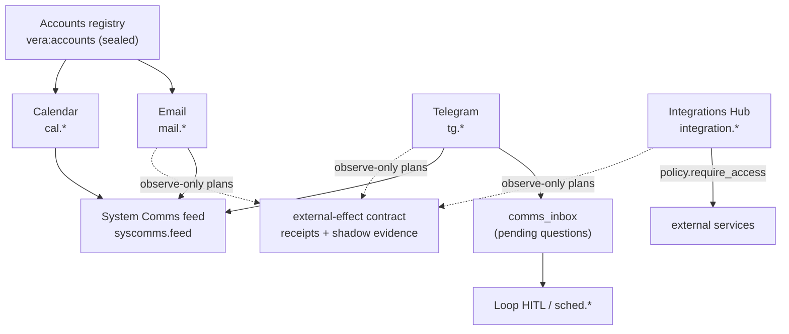

# 23 · Integrations — Services, Accounts, and Agent Protocols

Vera's outward-facing modules connect it to everyday services and to other
systems. There are two layers. The **personal comms** layer — Accounts,
Calendar, Email, Telegram and the System Comms feed — covers the operator's own
identities, diary, mailbox and chat. The **Integrations Hub** turns external
services (n8n, Home Assistant, Gitea, GitHub, Grafana, WordPress and so on)
into integration records with enforced per-mode access. On top of both sits a
shared, non-executing **external-effect contract** that plans, observes and
records outbound mutations, plus admission contracts for new external sources
and A2A agents.

Source lives in `vera/accounts/`, `vera/calendar/`, `vera/email/`,
`vera/telegram/`, `vera/syscomms/`, `vera/integrations/`, and the
process-level helpers `vera/comms_inbox.py` and `vera/approval_receipts.py`.
Everything shares two foundations: the unified **Accounts** registry
(credentials configured once and reused) and **Fernet-sealed secrets** (see
[Security & Secrets](./29-security.md)). Accounts, Calendar, Email, Telegram and
the Integrations Hub are in daily use. The external-effect machinery runs in
**observe-only** mode everywhere: it records evidence but blocks nothing unless
an operator explicitly activates enforcement for the generic API path. Source
intake and A2A are inspection-only contracts.

## Contents

- [1. Overview](#1-overview)
- [2. Source map](#2-source-map)
- [3. Accounts registry](#3-accounts-registry)
  - [3.1 Unified OAuth](#31-unified-oauth)
- [4. Calendar](#4-calendar)
  - [4.1 Long-term scheduler](#41-long-term-scheduler)
- [5. Email](#5-email)
- [6. Telegram](#6-telegram)
  - [6.1 Multiple bots](#61-multiple-bots)
  - [6.2 Replies to questions Vera asked](#62-replies-to-questions-vera-asked)
- [7. Comms tab and System Comms feed](#7-comms-tab-and-system-comms-feed)
- [8. Integrations Hub](#8-integrations-hub)
  - [8.1 Access model](#81-access-model)
  - [8.2 Service kinds](#82-service-kinds)
  - [8.3 Capabilities](#83-capabilities)
- [9. MCP server catalog and client](#9-mcp-server-catalog-and-client)
- [10. Platform configuration](#10-platform-configuration)
- [11. Connection and trust model](#11-connection-and-trust-model)
- [12. External-effect admission](#12-external-effect-admission)
  - [12.1 Plans and receipts](#121-plans-and-receipts)
  - [12.2 Connection projection](#122-connection-projection)
  - [12.3 Generic API enforcement](#123-generic-api-enforcement)
  - [12.4 Retry planning](#124-retry-planning)
  - [12.5 Evidence drawer and readiness](#125-evidence-drawer-and-readiness)
  - [12.6 Operator decision and activation](#126-operator-decision-and-activation)
  - [12.7 Per-family observation](#127-per-family-observation)
  - [12.8 Effect capabilities](#128-effect-capabilities)
- [13. External source intake](#13-external-source-intake)
- [14. A2A agent interoperability](#14-a2a-agent-interoperability)
- [15. Storage and configuration](#15-storage-and-configuration)
- [16. Troubleshooting](#16-troubleshooting)
- [See also](#see-also)
- [Screenshots](#screenshots)
- [Capabilities](#capabilities)

---

## 1. Overview



| Module | Group | UI |
|---|---|---|
| Accounts | `acct.*` | **Accounts** (inside the **Comms** tab) |
| Calendar | `cal.*`, `sched.*` | **Calendar** (Comms sub-tab) |
| Email | `mail.*` | **Email** |
| Telegram | `tg.*` | **Telegram** |
| System Comms | `syscomms.*` | **System Comms** |
| Integrations Hub | `integration.*` | **Integrations** |
| MCP catalog | `mcp.catalog.*` | **MCP Catalog** |
| Platforms | `platform.*` | **Platforms** |

Each comms module can bridge selected `vera:events` outward and ingests inbound
data into the [Data Fabric](./06-data-fabric.md).

## 2. Source map

| File | Responsibility |
|---|---|
| `vera/accounts/accounts_capabilities.py` | `acct.*`, unified OAuth, `get_account()` helpers, Accounts + combined Comms panels |
| `vera/calendar/calendar_capabilities.py` | `cal.*`: diary, cloud sync, brain-dump, assistant, effect status |
| `vera/calendar/ical.py` | ICS parsing |
| `vera/calendar/effect_inventory.py` | Static inventory behind `cal.effects.status` |
| `vera/calendar/longterm_scheduler.py` | `sched.*` long-term scheduled actions and triggers |
| `vera/email/email_capabilities.py` | `mail.*` |
| `vera/email/transport.py` | IMAP/SMTP transport (stdlib, threaded), XOAUTH2 support |
| `vera/email/email_effects.py` | Email external-effect projection |
| `vera/telegram/telegram_capabilities.py` | `tg.*`, the polling loop, slash commands, event bridge |
| `vera/telegram/tg_bots_core.py` | Pure multi-bot config normalisation |
| `vera/telegram/telegram_effects.py` | Telegram external-effect projection |
| `vera/comms_inbox.py` | In-process store of outbound questions awaiting a reply |
| `vera/syscomms/syscomms_capabilities.py`, `syscomms_core.py` | `syscomms.feed` timeline and its pure normaliser |
| `vera/integrations/integrations_capabilities.py` | `integration.*` hub, reverse proxy, effect/source capabilities |
| `vera/integrations/policy.py` | Pure: kind specs, kind guessing, base URL, `require_access()`, auth headers |
| `vera/integrations/external_effects.py` | Non-executing effect planner (`vera.external-effect-plan/v1`) |
| `vera/integrations/effect_receipts.py` | Durable `ExternalEffectReceiptLedger` |
| `vera/integrations/effect_shadow_evidence.py` | Per-family observe-only evidence and readiness thresholds |
| `vera/integrations/effect_enforcement_decision.py`, `effect_enforcement_activation.py` | Operator decision and activation ledgers |
| `vera/integrations/effect_retry.py` | Non-executing retry planner |
| `vera/integrations/connection_projection.py` | Read-only connection projection |
| `vera/integrations/infrastructure_effects.py` | Infrastructure (Docker/Proxmox/provisioning) observation |
| `vera/integrations/provider_effect_inventory.py` | Static provider boundary inventory |
| `vera/integrations/source_intake.py`, `source_build_plan.py` | External source inspection and build planning |
| `vera/mcp/mcp_catalog_capabilities.py` | `mcp.catalog.*` ecosystem MCP server catalog |
| `vera/mcp/mcp_client.py`, `mcp_client_core.py` | MCP JSON-RPC client (streamable HTTP + SSE) and its pure wire format |
| `vera/platforms/platform_capabilities.py`, `platform_core.py` | `platform.*` shared values/secrets and config push |
| `vera/approval_receipts.py` | Signed, scope-bound approval receipts ([45](./45-capability-policy.md)) |

## 3. Accounts registry

A single shared store of *identities*, so Calendar and Email do not each hold
their own credentials. Each account is a label + email carrying whatever
credential blocks it needs:

- **Mail block** — IMAP/SMTP host settings (`imap_port` 993 SSL by default) +
  an app-password, or OAuth → used by Email.
- **Calendar block** — CalDAV url/user/password and/or an ICS URL (for example
  a Google "secret address in iCal format") → used by Calendar sources.
- **OAuth block** — provider, client id/secret, refresh token, granted scope keys.

Secret fields (`app_password`, `caldav_password`, `oauth_client_secret`,
`oauth_refresh_token`) are sealed at rest with the shared Fernet helper and
**never returned to the UI** — list/get redact them to `has_*` flags.

| Cap | Route | Purpose |
|---|---|---|
| `acct.list` / `acct.get` | `GET /accounts/list`, `/accounts/get` | Browse accounts (secrets redacted) |
| `acct.upsert` / `acct.delete` | `POST /accounts/upsert`, `/accounts/delete` | Account CRUD |
| `acct.test` | `POST /accounts/test` | IMAP+SMTP if a mail block is set, best-effort CalDAV if a calendar block is set |
| `acct.oauth.providers` | `GET /accounts/oauth/providers` | Providers and selectable scopes |
| `acct.oauth.auth_url` | `GET /accounts/oauth/auth_url` | Consent URL for an account and chosen scope keys |
| `acct.oauth.complete` | `POST /accounts/oauth/complete` | Manual fallback: exchange a code, store the sealed refresh token |
| `acct.oauth.disconnect` | `POST /accounts/oauth/disconnect` | Revoke Vera's stored grant (clears token and scopes; keeps the client id/secret) |
| `acct.panel.html` | `GET /accounts/panel` | Panel HTML |

Other modules import helpers directly: `get_account(id)` (secrets opened),
`list_accounts(opened=False)`, `default_mail_account()`.

### 3.1 Unified OAuth

OAuth lives on the **account**, not on individual consumers: one grant per
account, and the scopes ticked decide what it can do. You can keep one account
with several scopes or split purpose-specific accounts — both work the same
way. Google is the implemented provider; its scope keys are `calendar`
(read-only), `calendar_manage`, `mail` (IMAP/SMTP over XOAUTH2) and `contacts`
(read-only), always alongside `openid` + `userinfo.email`. The single callback
is `/accounts/oauth/callback` under `GOOGLE_OAUTH_REDIRECT_BASE`; consent state
is held in `vera:accounts:oauth:state:<token>` for 600 s.

## 4. Calendar

A personal scheduler/diary: events, todos and notes stored in Redis (with a
sorted-set index by start time for fast date-range queries), plus cloud sync
and an LLM brain-dump.

- **Cloud sync (pull)** from Google Calendar, generic CalDAV, and ICS
  subscription URLs — all via `httpx`. A background job (`cal_auto_sync`, ticks
  every 60 s) self-throttles to `sync_interval_min` (default 15; 0 disables).
- **Brain-dump** — free text → the local cluster turns it into a coherent set
  of events/todos/notes + a suggested daily plan for review, then
  `cal.braindump.commit` persists the edited proposal.
- **Scheduling assistant** — an embedded agent dock with a briefing
  (`cal.assistant.briefing`) and a hand-over into scheduling mode.
- Optional persistence of the diary into the fabric (`diary` dataset).

| Cap group | Caps |
|---|---|
| Events | `cal.events.list`, `cal.event.upsert`, `cal.event.delete` |
| Todos | `cal.todos.list`, `cal.todo.upsert`, `cal.todo.toggle`, `cal.todo.delete` |
| Notes | `cal.notes.list`, `cal.note.upsert`, `cal.note.delete` |
| Brain-dump | `cal.braindump`, `cal.braindump.commit` |
| Assistant | `cal.assistant.briefing`, `cal.assistant.config`, `cal.assistant.handover` |
| Sources | `cal.sources.list`, `cal.source.upsert`, `cal.source.delete` (also deletes its synced events) |
| Sync | `cal.sync.run`, `cal.sync.status` |
| Google OAuth (legacy per-source flow) | `cal.google.auth_url`, `cal.google.auth_complete`, `cal.google.calendars` |
| Misc | `cal.fabric.persist`, `cal.config.get`, `cal.config.set`, `cal.effects.status`, `cal.panel.html` |

Cloud credentials are sealed before they touch Redis and never returned to the UI.

`cal.effects.status` makes the execution boundary explicit. Event, todo, note,
and brain-dump commits currently mutate only Vera's local Redis diary. ICS
fetch, CalDAV `REPORT`, and Google event listing are inbound remote reads.
Google OAuth exchange and refresh belong to credential lifecycle rather than
calendar-event mutation. Vera does not currently implement a remote event
create/update/delete adapter, so Calendar truthfully reports no external
mutation evidence, enforcement, receipts, or retry behavior instead of borrowing
another family's readiness. The Calendar sidebar shows **local edits · remote
sync read-only** alongside sync state. When a real remote-write adapter is
introduced, it must first adopt the shared effect contract and a
Calendar-specific evidence ledger before this status can claim instrumentation.

### 4.1 Long-term scheduler

`longterm_scheduler.py` sits between the calendar (what the user committed to)
and the agentic loops (what Vera can do). It reads the user's calendar and the
[Dream](./17-dream.md) calendar and lays down **scheduled actions** and
**trigger thresholds**:

- **System-side** actions run unattended through a loop profile
  (`default_profile`, `planning`). While one runs, `vera:sched:system_busy` is
  set and the dream scheduler stands aside; a system action never spawns a dream.
- **User-side** actions send a notification over the comms channel (Telegram by
  default) and wait for the reply, which is routed back through
  [`comms_inbox`](#62-replies-to-questions-vera-asked).

| Cap | Purpose |
|---|---|
| `sched.plan.generate` | **LLM**: read both calendars over a horizon and propose actions + triggers |
| `sched.plan.list` | List scheduled actions |
| `sched.action.upsert` / `.delete` / `.pause` / `.resume` / `.cancel` | Manage one action (cancel keeps the record) |
| `sched.action.respond` | Record a user reply to a user-side notification |
| `sched.triggers.list` | Actions with a threshold trigger and their last evaluation |
| `sched.tick` | Run one evaluation pass now (a `longterm_scheduler` job ticks every 30 s and honours `tick_seconds`, default 60) |
| `sched.config.get` / `sched.config.set` | `enabled`, `tick_seconds`, `default_profile`, `comms_channel`, `model`, `max_concurrent_system` (1) |

Action statuses: `pending`, `scheduled`, `notified`, `awaiting_reply`, `paused`,
`running`, `done`, `failed`, `cancelled`.

## 5. Email

Multi-account IMAP/SMTP backed by the Accounts registry, with AI assistance.

- **Reading is gated** behind a global `reading_enabled` flag (**off** by
  default) — inbox/search/message caps only work when enabled.
- **Send & reply** via SMTP from any configured account (`account=<id>`).
- **AI draft / summarise** using the local cluster.
- **Event bridge** — forward selected `vera:events` to an address.
- Transport: stdlib `imaplib`/`smtplib` run in a worker thread so the event loop
  never blocks; app-password or XOAUTH2 (a Google account with the `mail` scope).

| Cap group | Caps |
|---|---|
| Config | `mail.config.get`, `mail.config.set` (`reading_enabled`, `model`, `signature`, `default_account`) |
| Accounts | `mail.accounts.list`, `mail.test` |
| Reading (gated) | `mail.inbox.list` (headers only), `mail.message.get`, `mail.search` |
| Sending | `mail.send`, `mail.reply` (threaded), `mail.draft` |
| Events | `mail.events.configure`, `mail.events.status` |
| Panel | `mail.panel.html` (`/mail/panel`) |

Email keeps only global settings and the notification bridge config in Redis
(`vera:mail:settings`, `vera:mail:events`; a legacy `vera:mail:config` is
migrated on startup); credentials live sealed in Accounts.

SMTP sends, replies and event-bridge deliveries project into the shared
external-effect contract before account transport resolution — see
[§12.7](#127-per-family-observation).

## 6. Telegram

A bidirectional bot that brings the capability framework into Telegram.

- **Long-poll `getUpdates` loop** (25 s poll timeout, backoff to 30 s) that never
  blocks the orchestrator; auto-resumes on restart.
- **Per-chat `session_id`** (`tg:{chat_id}`) so all activity flows onto the
  [memory graph](./05-memory-graph.md) and shows up in the UI like web sessions.
- **Slash commands**: `/help` (`/start`), `/id`, `/caps`, `/agents`,
  `/agent <name>` (per-chat agent), `/run`, `/status`, `/think on|off`, `/reset`.
  Free text routes to the configured default agent (`agent.chat`).
- **Per-chat allow-list** — the admin chat is always allowed; others must be
  whitelisted.
- **Event bridge** — forward selected `vera:events` (DAG complete, research
  finished, errors) to a target chat. This is also the channel for
  [Dream](./17-dream.md) HITL approvals.
- **Fabric ingest** — inbound messages land in dataset `tg.messages`.

| Cap group | Caps |
|---|---|
| Config | `tg.config.set`, `tg.config.get` (token redacted) |
| Bot | `tg.bot.start`, `tg.bot.stop` (every enabled bot, or one), `tg.bot.status` |
| Send | `tg.send`, `tg.send_markdown` (MarkdownV2), `tg.notify` (admin chat), `tg.broadcast` (every allowed chat) |
| Chats | `tg.chats.list`, `tg.chats.allow`, `tg.chats.revoke`, `tg.history` |
| Events | `tg.events.configure`, `tg.events.status` |
| Panel | `tg.panel.html` (`/telegram/panel`) |

Redis: `vera:tg:config` (bot token sealed), `vera:tg:offset`, `vera:tg:chats`,
`vera:tg:history:<chat_id>` (capped at 200), `vera:tg:events`, `vera:tg:bot_info`.

Outbound sends project into the external-effect contract — see
[§12.7](#127-per-family-observation).

### 6.1 Multiple bots

One bot token can have only one poller; a second gets
`409 Conflict: terminated by other getUpdates request`. Vera therefore supports
a **list of bots**, one per consumer (for example Vera and
[OpenClaw](./27-openclaw.md)), each with its own token, admin chat and poller.
The legacy top-level `token`/`admin_chat_id` are the bot called `default` and
keep their unsuffixed Redis keys, so existing installs upgrade without data
movement (`tg_bots_core.normalise_bots`).

### 6.2 Replies to questions Vera asked

`comms_inbox.py` is the return-path twin of delivery. When a loop asks a
clarifying question over Telegram, it registers the question against the chat
address (`kind="clarify"`, with the loop's session and step); the long-term
scheduler registers user-side notifications as `kind="schedule"`. The next
message from that chat is taken from the inbox and resolves the waiting loop's
HITL future (or `sched.action.respond`) instead of going to the default agent.
Entries live in process memory with a TTL (default 24 h, minimum 30 s); the
newest question to an address wins.

## 7. Comms tab and System Comms feed

The **Comms** tab (`comms-panel`, served from `/comms/panel`) wraps Accounts,
Calendar, Email and Telegram as sub-tabs; each keeps its own route and
capabilities.

`syscomms.feed` (`GET /syscomms/feed`) merges everything the system has said or
flagged into one newest-first timeline: Telegram traffic, open action items,
failing n8n workflows and archived briefs. Inputs: `limit` (80), `sources`
(csv of `telegram,actions,n8n,reports`), `min_severity`
(`''|info|warning|critical`). Each entry is `{ts, source, kind, severity, title,
detail, ref}`. Severity is **derived**, not trusted: words such as *down*,
*failed*, *unreachable* mark critical; *warning*, *stale*, *pending*, *overdue*
mark warning. Sources are read through their own capabilities, so a missing
one degrades to an empty section with a reason. UI: **System Comms**
(`syscomms`, `/syscomms/panel`).

## 8. Integrations Hub

`integrations_capabilities.py` is an integration-centric layer over pieces Vera
already has (app-mount reverse proxy, the [Operator](./34-operator.md), the MCP
catalog, the SSH/exec host store, the identity/PKI/mesh stack). Each external
service becomes one **integration record** (`vera:integrations`, API token
sealed) that can be used in five modes.

### 8.1 Access model

| Mode | Meaning |
|---|---|
| `embed` | View its web UI through Vera's reverse proxy (`/integrations/{id}/embed/...`) |
| `interact` | Let the operator drive its pages (observe → think → act) |
| `api` | Call its HTTP API through an authenticated passthrough; the sealed token is injected server-side and never returned |
| `mcp` | Activate/drive a paired MCP server (via `mcp.catalog.connect`) |
| `ssh` | Reach the host shell |

Each mode is a toggle **enforced at every entry point** by
`policy.require_access()` — not merely hidden in the UI. Auto-discovered
integrations are created **default-locked**: `embed` on, everything else off. A
`sensitive` flag hard-locks `interact`, `api` and `mcp` regardless of their
toggles. Every access change is audited.

### 8.2 Service kinds

`policy.KIND_SPECS` carries labels and API-auth conventions, and
`guess_kind()` infers a kind from port, image or label:

| Kind | Default port(s) | API base | Auth |
|---|---|---|---|
| `n8n` | 5678 | `/api/v1` | header `X-N8N-API-KEY` |
| `homeassistant` | 8123 | `/api` | bearer |
| `gitea` | 3000 | `/api/v1` | token |
| `github` | 443 | (`https://api.github.com`) | token |
| `grafana` | 3000, 3001 | `/api` | bearer |
| `wordpress` | 80, 443 | `/wp-json` | basic |
| `portainer` | 9000, 9443 | `/api` | bearer |
| `prometheus` | 9090 | `/api/v1` | none |
| `generic` | — | — | bearer |

### 8.3 Capabilities

| Cap | Route | Purpose |
|---|---|---|
| `integration.list` / `.get` | `GET /integrations/list`, `/get` | Records (API secrets redacted) |
| `integration.save` / `.delete` | `POST /integrations/save`, `/delete` | CRUD (delete does not touch the service) |
| `integration.import_apps` | `POST /integrations/import_apps` | Fold legacy Workspaces app mounts (`vera:remote:apps`) into the registry |
| `integration.access.set` | `POST /integrations/access/set` | Set mode toggles and `sensitive` |
| `integration.operate` | `POST /integrations/operate` | Drive the web UI with the operator (needs `interact`) |
| `integration.api.call` | `POST /integrations/api/call` | Authenticated API passthrough (needs `api`) |
| `integration.mcp.call` | `POST /integrations/mcp/call` | Connect the paired MCP server (needs `mcp`) |
| `integration.identity.register` | `POST /integrations/identity/register` | Register in the directory (FreeIPA-first via `identity.resolve.app`) |
| `integration.connections` | `POST /integrations/connections` | Every connection to/from an integration (embed path, operator, API, MCP, SSH) |
| `integration.connections.project` | `GET /integrations/connections/project` | Read-only cross-registry projection ([§12.2](#122-connection-projection)) |
| `integration.discover` | `POST /integrations/discover` | Surface Docker containers, detected web apps + MCP servers and directory hosts as default-locked integrations |
| `integration.panel.html` | `GET /integrations/panel` | Integrations Hub panel |

Example — call an n8n API through the passthrough once `api` is enabled:

```bash
curl -s -X POST http://localhost:8999/integrations/api/call \
  -H 'Content-Type: application/json' \
  -d '{"id":"<integration-id>","method":"GET","path":"/workflows"}'
```

## 9. MCP server catalog and client

Vera is itself an MCP server (`/mcp/tools`, `/mcp/call`, `/ws/mcp` — see
[Capability Framework §4](./01-capability-framework.md#4-mcp-interface)), and its
peer proxy (`register_mcp_server`) wires one Vera to another. `vera/mcp/` adds
the other half: a catalog of ecosystem MCP servers and a real MCP **client**.

**Catalog.** `mcp_catalog_capabilities.py` keeps a persisted registry
(`vera:mcp:catalog`) pre-seeded with blank records for common servers —
reference servers (Filesystem, Fetch, Memory, Sequential Thinking, Time),
dev tools (GitHub, GitLab, Git, Sentry, E2B, Docker, Kubernetes), databases
(PostgreSQL, SQLite, Redis, Neo4j, Chroma, MongoDB, Supabase), search and web
(Brave, Tavily, Exa, Perplexity, Firecrawl, Puppeteer, Playwright),
productivity (Slack, Notion, Linear, Todoist, Obsidian, Airtable,
Jira/Confluence, Google Drive, Discord), commerce (Stripe, Shopify), Google
Maps and ElevenLabs — so the operator only supplies credentials. Each record
carries a transport (`stdio`, `sse`, `http`, `vera_proxy`), a launch command or
URL, env/header templates, `config_fields` for the UI, and a status
(`unconfigured`, `configured`, `connected`, `error`). Secret env/header values
are sealed and redacted to `••••`.

| Cap | Route | Purpose |
|---|---|---|
| `mcp.catalog.list` / `.get` | `GET /mcp/catalog/list`, `/get` | Records (redacted) |
| `mcp.catalog.upsert` / `.delete` | `POST /mcp/catalog/upsert`, `/delete` | Record CRUD |
| `mcp.catalog.reseed` | `POST /mcp/catalog/reseed` | Re-add missing built-in records (never overwrites) |
| `mcp.catalog.connect` | `POST /mcp/catalog/connect` | Connect a configured server (below) |
| `mcp.catalog.panel.html` | `GET /mcp/catalog/panel` | **MCP Catalog** panel |

`mcp.catalog.connect` behaves by transport: `vera_proxy` registers the peer
through the orchestrator proxy; `sse`/`http` connect with the MCP client,
list the server's tools and register each as a Vera capability named
`<server>.<tool>` (names normalised to registry-safe characters); `stdio` is
validated and marked `configured`, since launching the process needs an
external MCP runtime. `integration.mcp.call` connects the server paired with an
integration through this same path.

**Client.** `mcp_client.py` (httpx only, no app imports) speaks MCP JSON-RPC
2.0; the pure wire format lives in `mcp_client_core.py`. It tries the
streamable-HTTP transport (protocol `2025-03-26`) first and falls back to the
older SSE transport (`2024-11-05`), where replies arrive on the long-lived SSE
stream rather than the POST response. The n8n integration uses the same client.

## 10. Platform configuration

`vera/platforms/` is a small controller for "set a fact once, push it
everywhere". Three record kinds are kept separate:

| Kind | Redis | Holds |
|---|---|---|
| Values | `vera:platform:values` | Non-secret shared facts such as `home_coords`, `work_coords`, `timezone` |
| Secrets | `vera:platform:secrets` | Reusable credentials, sealed (OpenBao-backed secrets service, `platform/<key>`) and redacted on output |
| Platforms | `vera:platform:targets` | Targets (`homeassistant`, `n8n`) whose fields are literals or references `@value:<key>` / `@secret:<key>` |

Changing a value once changes every platform field bound to it.
`platform.apply` pushes resolved configuration into a target and is a **dry run
by default** — it reports exactly what it would send and changes nothing until
`dry_run=false`. Actions: `ha.core_location` (Home Assistant home
latitude/longitude/timezone), `ha.waze_travel_time` (home↔work commute
sensors), `n8n.ping`. Unresolved references or incomplete config are refused.

| Cap | Purpose |
|---|---|
| `platform.values.list` / `.set` / `.delete` | Shared values |
| `platform.secrets.list` / `.set` / `.delete` | Reusable credentials |
| `platform.kinds` | Known platform types, field schemas and apply actions |
| `platform.list` / `platform.upsert` / `platform.delete` | Targets with resolved status |
| `platform.seed` | Create blank records for unconfigured kinds, pre-wired to shared values |
| `platform.apply` | Push config (`id`, `action`, `dry_run=true`) |
| `platform.panel.html` | **Platforms** panel (`/platform/panel`) |

## 11. Connection and trust model

Integrations separate a service definition from credentials, granted access,
and a live connection. Accounts hold sealed provider-specific configuration;
integration records describe how Vera may use it; capability families expose
mail, calendar, messaging, or generic API/MCP operations. Disconnecting an app
should revoke Vera's active use without silently deleting unrelated local data.

Test in layers: credential presence, provider authentication, account/service
discovery, a read-only operation, then an explicitly authorized write. OAuth
redirect mismatches, expired refresh tokens, provider scopes, clock skew, and
container DNS are more common than application logic failures. Never paste
secrets into board items, traces, screenshots, or capability arguments that are
persisted as ordinary history.

`integration.access.set` is the policy boundary for general integrations.
Operator-driven web access adds Operator's allowlist/destructive-action policy;
API access remains governed by the integration and account capabilities.

## 12. External-effect admission

### 12.1 Plans and receipts

`integration.effect.plan` is the non-executing policy boundary for outbound
operations. It classifies HTTP-shaped operations as reads, idempotent writes,
or non-idempotent writes and produces a stable `vera.external-effect-plan/v1`
record. Mutations require an opaque approval-receipt reference; POST and PATCH
also require an idempotency key. A retry is admitted only when those conditions
remain satisfied.

The plan contains connection and operation identity plus SHA-256 digests of the
opaque references. It never contains request payloads, credential values, raw
receipt references, or raw idempotency keys, and it neither resolves secrets
nor executes the operation. This is a shared contract for gradual adoption by
Email, Telegram, Calendar, commerce, generic API/MCP connectors, provisioning,
and other external-effect adapters; those existing paths are not silently
treated as migrated until they enforce and retain corresponding receipts.

Completed adapters can record each attempt in the durable, out-of-tree
`ExternalEffectReceiptLedger`. Attempt identities are hashed; response evidence
is accepted only as a SHA-256 digest; provider receipt references are hashed;
and request/response payloads are never accepted. Re-observing the same attempt
is idempotent, while different evidence for that attempt fails as a conflict.
`integration.effect.replay.status` validates the complete plan and reports
`do_not_repeat` after any matching successful receipt. The inspection surface
cannot execute or retry an operation, and there is intentionally no general
capability that lets an untrusted caller manufacture completion receipts.

Approval receipts themselves are signed, scope-bound and single-use
(`vera/approval_receipts.py`, schema `vera.approval-receipt/v1`, TTL at most
3600 s); see [Capability Policy](./45-capability-policy.md).

### 12.2 Connection projection

`integration.connections.project` provides a separate, deterministic read model
over Integration, Account, and model-provider records. Every projected
connection retains its source system and record identity; explicit references
are resolved only when unique, and shared endpoint origins are reported as
collisions rather than automatically merged. Endpoint userinfo, path, query,
and fragment data are discarded, which prevents private calendar URLs and API
credentials from entering the projection. Credential state is presence-only.

The projection reports unavailable source registries and malformed endpoints as
gaps. It never opens a secret, probes a service, changes access, establishes a
connection, or becomes the authority for the underlying records. This gives UI
and tool-using models one bounded inventory while preserving the existing
registries as owners.

### 12.3 Generic API enforcement

The generic `integration.api.call` boundary emits the same policy decision as
`effect_shadow`. It remains in `observe_only` mode unless three independent
conditions agree: the deployment gate (`VERA_INTEGRATION_API_EFFECT_ENFORCEMENT`)
is enabled, the current operator decision approves enforcement, and a fresh
activation is bound to that exact decision revision and enforcement contract.
Optional idempotency and approval references are evaluated but never forwarded
to the remote API; the request path is represented only by an operation digest
in audit events. If a durable success receipt already exists, telemetry reports
that enforcement would suppress the replay. When enforcement is active, a
denied or already-completed mutation is rejected before credentials are opened
or an HTTP request is made. Vera does not add automatic retries.

### 12.4 Retry planning

`integration.effect.retry.plan` turns a validated effect plan plus bounded
outcome evidence into a non-executing retry decision. It recognizes a small,
stable set of transient HTTP statuses and transport error codes, enforces a
maximum attempt budget, refuses retries after a durable success, and requires
the original plan to have explicitly requested and admitted retry behavior.
Provider `Retry-After` or exhausted-rate-limit reset evidence becomes a minimum
delay that local backoff cannot shorten. Vera returns a jitter window for a
scheduler to use later; the capability itself never sleeps, chooses random
timing, executes the operation, opens credentials, or records a receipt.

### 12.5 Evidence drawer and readiness

The Integrations header includes an **Effect evidence** drawer backed by
`integration.effect.receipts`. It shows aggregate plan, receipt, observation,
and outcome counts plus a bounded recent window. Entries contain effect
classification, method, connection/operation identity, shortened plan/receipt
digests, and observation counts. Request and response bodies, credentials, raw
approval receipts, raw idempotency keys, and mutation controls are absent. An
empty view means no migrated adapter has recorded durable evidence yet; it is
not presented as proof that external effects did not occur.

The same drawer reads `integration.effect.retry.policy` to explain the exact
transient HTTP/error vocabulary, refusal reasons, hard attempt/delay bounds, and
the evidence required before a scheduler may consider another attempt. This is
a policy legend, not a retry control.

Observe-only decisions are accumulated separately as bounded, payload-free
evidence (`integration.effect.shadow.evidence`). The drawer reports how many
generic API calls policy would admit, execute, or suppress as replays, alongside
refusal-reason counts from the recent window. Stored observations contain only
policy fields, digests, classifications, methods, and timestamps — not paths,
queries, bodies, headers, credentials, or raw approval/idempotency references.

Vera applies fixed, fail-closed coverage thresholds
(`integration.effect.enforcement.readiness`) before describing the evidence as
ready for operator review: total observations, read and mutation coverage,
admitted and denied decisions, and at least one replay-suppression example.
Passing every check means only that the shadow sample is representative enough
to review. It does not prove safety, authorize a rollout, or enable enforcement.

The drawer can switch among the **Generic API**, **Telegram**, **Email**,
**Commerce** and **Infrastructure** evidence families. Enforcement readiness,
approval, and activation controls appear only for the Generic API contract; the
other family views do not borrow or imply that authority. A static **Provider
boundaries** inventory (`integration.effect.inventory`) separates local
business records and simulations from marketplace reads, OAuth lifecycle,
marketplace writes, container/build mutations, and Proxmox/provisioning
mutations. It performs no probe.

### 12.6 Operator decision and activation

An operator may record either `continue_observing` or an approval for a future
rollout (`integration.effect.enforcement.decide`). Decisions use optimistic
revisions so a stale browser cannot overwrite a newer choice, preserve bounded
immutable history, and store operator and approval references only as digests.
Future-rollout approval is rejected until the readiness checks pass and an
approval receipt is supplied. Requested and effective modes remain separate:
recording approval changes the requested mode, but the effective generic API
mode remains `observe_only` until the deployment gate is enabled and an
operator records a separate activation receipt
(`integration.effect.enforcement.activate`). Activation is revision-guarded,
reversible, stored as immutable history, and automatically invalidated by a
changed approval or enforcement contract. If the deployment gate is enabled but
activation state cannot be read, mutations fail closed; reads and deployments
with the gate disabled retain compatibility behavior. Recording
`continue_observing` or deactivating reverses the effective mode without
deleting its audit history.

### 12.7 Per-family observation

All families below are **observe-only**: they record bounded policy evidence in
their own ledger but never block delivery, retry, manufacture a completion
receipt, or turn an evidence failure into a delivery failure. Separate ledgers
mean one family cannot satisfy another family's readiness thresholds.

| Family | What is observed | Never retained |
|---|---|---|
| **Email** | SMTP send, reply and event-bridge deliveries, before account transport resolution; account and destination as digests | Recipients, thread ids, subjects, bodies, credentials, raw approval/idempotency references |
| **Telegram** | `tg.send`, `tg.send_markdown`, `tg.notify`, `tg.broadcast` — one plan per recipient; broadcast returns only aggregate evidence | Message bodies, raw chat ids, credentials, raw references |
| **Commerce** | Listing push, publish and archive, before marketplace credentials are opened | Payloads; eBay/Vinted idempotency is not claimed as validated |
| **Infrastructure** | `docker.exec/stop/rm/run`, `docker.worker.stop`, image ensure (only when a build or transfer is needed), worker spawn, stack/store deploy and removal, builder startup and compiler paths, Proxmox guest lifecycle/exec/clone/create/destroy/firewall, managed-host component and runtime installs, security-service deploy/removal | Commands, environments, connection URLs, host/container/image ids, generated secrets, cloud-init, SSH keys, addresses, provider responses |

Optional approval, idempotency and retry intent is evaluated but never
forwarded to the provider. Durable success evidence is consulted to report
whether a replay would be suppressed. Canonical store deployment suppresses a
second nested `docker.run` identity, so one requested deployment produces one
logical observation; already-running stores produce none. Nested runtime
installation likewise suppresses the duplicate identity when the combined run
delegates to install. Capability activity also redacts Email arguments and
results; the existing mail event stream remains a separate legacy surface.

### 12.8 Effect capabilities

| Cap | Method | Purpose |
|---|---|---|
| `integration.effect.plan` | POST | Plan one outbound operation without executing it |
| `integration.effect.replay.status` | POST | Replay evidence for a plan (`do_not_repeat`) |
| `integration.effect.receipts` | GET | Payload-free receipt summary |
| `integration.effect.shadow.evidence` | GET | Observe-only aggregates per family |
| `integration.effect.inventory` | GET | Static provider boundary inventory |
| `integration.effect.retry.policy` / `.retry.plan` | GET / POST | Retry vocabulary / one retry decision |
| `integration.effect.enforcement.readiness` | GET | Evidence sufficiency checks |
| `integration.effect.enforcement.decision` / `.decide` | GET / POST | Operator decision |
| `integration.effect.enforcement.activation` / `.activate` | GET / POST | Contract-bound activation |

All live under `/integrations/effect/...`.

## 13. External source intake

Vera applies an inspection boundary in `vera/integrations/source_intake.py`
before an external source can become an integration, MCP catalog entry,
wrapper, or active capability. The lifecycle is:

`discovered → inspected → proposed → built → verified → approved → active → deprecated → removed`

The first three states are implemented. An inline MCP descriptor or OpenAPI
document is bounded, fingerprinted, checked for plaintext credentials and
unsafe endpoints, and projected into candidates with `effects_status: unknown`,
`authorized: false`, and `executable: false`. Inspection never fetches a URL,
starts an MCP command, resolves an external `$ref`, writes a catalog record,
installs a package, builds a wrapper, activates an integration, or uses a
secret.

| Capability | Purpose |
|---|---|
| `integration.source.lifecycle` | Report implemented and queued lifecycle states |
| `integration.source.inspect` | Inspect one inline MCP/OpenAPI fixture |
| `integration.source.transition.plan` | Validate one adjacent transition without applying it |
| `integration.source.build.status` | Report supported source kinds, required evidence, and queued execution |
| `integration.source.build.plan` | Validate one inline descriptor and return an inert reproducible plan |

Transitions through `inspected` and `proposed` can be planned
deterministically. `built` and every later state require further
implementation or an operator approval boundary. Existing MCP
discovery/catalog and Fabric OpenAPI crawling remain operational systems; they
do not bypass this admission contract.

The build-planning boundary in `vera/integrations/source_build_plan.py`
accepts bounded inline proposals for exactly pinned Python packages, CLI
artifacts, OCI images, and repositories. Python and CLI sources require exact
versions plus artifact SHA-256 digests; OCI references require `image@sha256`;
repositories require credential-free HTTPS, a full commit revision, and an
archive digest. These are unverified provenance claims until later evidence
proves them. Each proposal declares entry points, licence, effects,
CPU/memory/accelerator needs, opaque `secretref:` references, and a
deny-or-HTTPS-allowlist network policy. The resulting stable plan queues
materialisation, SBOM/licence/malware/vulnerability scans, manifest and policy
review, conformance, rollback and teardown proof, approval, activation, export,
upgrade, rollback, and teardown. It always reports `ready_for_build: false`,
`ready_for_activation: false`, and that no credential, network, fetch, install,
build, registration, activation, or execution occurred. Real materialisation,
scans, builders, approval consumption, activation, and rollback evidence remain
`queued_live`.

## 14. A2A agent interoperability

A2A is the boundary for communicating with an independent, potentially opaque
remote agent; MCP remains the boundary for tools and resources used by an agent.
The agent-to-agent foundation begins with a non-executing v1.0 contract in
`vera/execution/a2a_mapping.py` and the inspection capability
`interop.a2a.conformance`.

`vera/execution/a2a_adapter.py` adds deterministic client and server plans. It
can plan one reviewed non-mutating task and an authenticated server exposure,
but deliberately performs no discovery fetch, credential resolution, request,
listener, registration, or artifact promotion. The Agent Bridges UI
([36](./36-agent-runtimes-providers.md)) reports these contracts separately from
the queued live transport and conformance work.

The manifest pins `a2a-sdk==1.1.2` for later implementation, but does not import
it. It maps Agent Cards and skills to unauthorised remote Capability Contract v2
candidates, server-assigned task IDs to `Run.task_id`, remote context IDs to an
opaque namespaced policy field rather than a Vera session, task states to Run
states/events, and verified outputs to `ArtifactRef`. Unknown, auth-required,
input-required, and rejected states retain their A2A meaning instead of being
silently coerced.

`analyze_agent_card` validates an inline card without fetching it. It bounds
size/depth, rejects plaintext credential-like values and credential-bearing or
non-HTTPS endpoints, honours ordered v1.0 interfaces, fails closed on
unsupported required extensions, and projects skills with unknown effects and
`authorized: false`, `executable: false`. It never registers those candidates.

The deterministic matrix covers card shape, malicious metadata, status
coverage, identity authority, and artifact boundaries. Actual discovery, a
read-only task, authentication/policy, duplicate sends, cancellation,
disconnect/resubscribe, push callbacks, artifact fetching, and teardown remain
`queued_live`. Until those pass, the manifest reports no client/server
implementation and `ready_for_execution: false`.

## 15. Storage and configuration

| Store | Holds |
|---|---|
| `vera:accounts` (hash) | Accounts, secrets sealed |
| `vera:accounts:oauth:state:*`, `vera:accounts:oauth:token:*` | OAuth consent state (600 s) and token references |
| `vera:cal:events`, `vera:cal:events:by_start`, `vera:cal:todos`, `vera:cal:notes`, `vera:cal:sources`, `vera:cal:config`, `vera:cal:sync:status` | Calendar |
| `vera:sched:actions`, `vera:sched:config`, `vera:sched:system_busy` | Long-term scheduler |
| `vera:mail:settings`, `vera:mail:events` | Email |
| `vera:tg:*` | Telegram |
| `vera:integrations` (hash) | Integration records, API token sealed |
| `vera:mcp:catalog` (hash) | MCP server records, secrets sealed |
| `vera:platform:values`, `vera:platform:secrets`, `vera:platform:targets` | Platform configuration |
| `<state dir>/integrations/external-effect-receipts.sqlite3` | Receipt ledger |
| `<state dir>/integrations/external-effect-shadow[-<family>].sqlite3` | Observe-only evidence per family |
| `<state dir>/integrations/external-effect-enforcement-decisions.sqlite3`, `…-activations.sqlite3` | Operator decision and activation history |

| Setting | Default | Meaning |
|---|---|---|
| `VERA_INTEGRATION_API_EFFECT_ENFORCEMENT` | off | Deployment gate for generic API enforcement |
| `GOOGLE_OAUTH_REDIRECT_BASE` | (config) | Base URL for `/accounts/oauth/callback` |
| `reading_enabled` (mail config) | `false` | Allow mailbox reads |
| `sync_interval_min` (calendar config) | 15 | Background cloud-sync interval |

## 16. Troubleshooting

| Problem | Check |
|---|---|
| `mail.inbox.list` refuses | `reading_enabled` is off by default — `mail.config.set` |
| OAuth redirect mismatch | The exact `GOOGLE_OAUTH_REDIRECT_BASE` + `/accounts/oauth/callback` must be registered on the OAuth client |
| Telegram `409 Conflict` | Two pollers on one token — give each consumer its own bot |
| Telegram reply went to the agent instead of the waiting loop | The pending question expired, or a newer question to the same chat replaced it |
| `integration.api.call` returns an error with `code: 403` | The `api` toggle is off, or the integration is marked `sensitive` |
| Effect evidence drawer empty | No migrated adapter has recorded evidence yet — not proof that nothing happened |
| Calendar shows events but no remote edits | Remote writes are not implemented; see `cal.effects.status` |

---

## See also

- [Security & Secrets](./29-security.md) — the Fernet sealing everything relies on
- [Data Fabric](./06-data-fabric.md) — `tg.messages`, `diary`, and event ingest
- [Agents & Chat](./19-agents-chat.md) — Telegram free-text routes to `agent.chat`
- [Dream](./17-dream.md) — Telegram delivery, HITL approvals, the dream calendar
- [Operator](./34-operator.md) — `integration.operate` drives web UIs
- [Capability Policy](./45-capability-policy.md) — approval receipts
- [Agent Runtimes & Providers](./36-agent-runtimes-providers.md) — Agent Bridges, MCP catalog
- [Interoperability Foundations](./46-interoperability-foundations.md)
- [Capability Framework](./01-capability-framework.md) — capability registration

## Screenshots

<!-- VERA:AUTO:screenshots START -->
_No screenshots captured yet — run `docs.build` (or `operator.mission.run documentation`)._
<!-- VERA:AUTO:screenshots END -->

## Capabilities

<!-- VERA:AUTO:capabilities START -->
_No capabilities resolved for this domain._
<!-- VERA:AUTO:capabilities END -->
