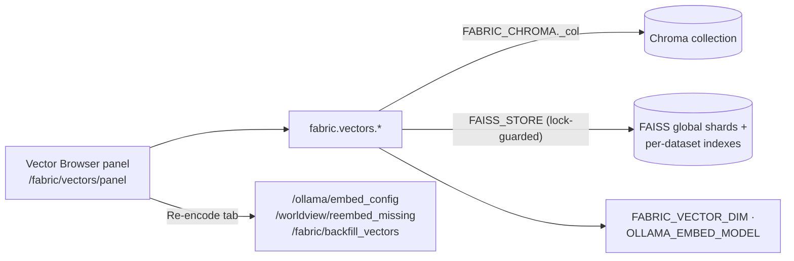
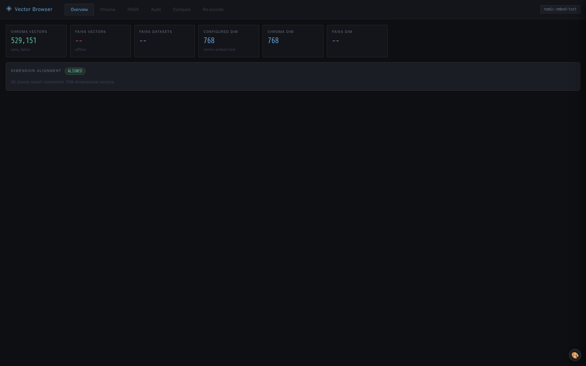
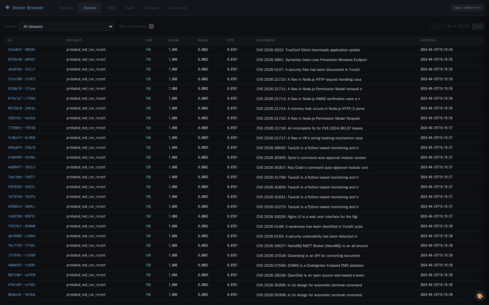

# 25 · Vector Browser

The Vector Browser is an inspection, audit and repair surface for the two
vector stores behind the [Data Fabric](./06-data-fabric.md): the shared
**Chroma** collection and the sharded **FAISS** store. Where the fabric *uses*
vectors for recall, this module lets you *see inside* them: confirm that
dimensions line up with the configured embedding model, browse records and
embedding statistics, check whether one record exists in both stores, and
re-encode records that are missing vectors.

It lives in `vera/vector browser/` — `vector_browser_capabilites.py` (note the
spelling of the file name) and `vector_browser_panel.html` — and is loaded by
the orchestrator's module list. It registers eight read-only `fabric.vectors.*`
capabilities and a panel that is hosted inside the Data Fabric panel. It is not
a source of truth: dataset identity and record metadata belong to the fabric.

**Maturity:** stable, read-only diagnostics. Re-encoding is delegated to
existing fabric and Worldview capabilities. Some views sample rather than scan
the whole store (see [§6](#6-limits-and-sampling)).

## Contents

- [1. How it fits](#1-how-it-fits)
- [2. Capability reference](#2-capability-reference)
- [3. The dimension audit](#3-the-dimension-audit)
- [4. The panel](#4-the-panel)
  - [Re-encode tab](#re-encode-tab)
- [5. Configuration](#5-configuration)
- [6. Limits and sampling](#6-limits-and-sampling)
- [7. Worked examples](#7-worked-examples)
- [8. Reading the vector stores and troubleshooting](#8-reading-the-vector-stores-and-troubleshooting)
- [See also](#see-also)

---

## 1. How it fits



The module imports the fabric's live handles directly from
`vera/fabric/data_fabric.py`: `FABRIC_CHROMA`, `FAISS_STORE`,
`FABRIC_VECTOR_DIM`, `OLLAMA_EMBED_MODEL`, `HAS_NUMPY` and `HAS_FAISS`.
Synchronous Chroma calls in the overview run in a worker thread; FAISS reads
hold the store's lock.

## 2. Capability reference

| Capability | Route | Inputs (defaults) | Output |
|---|---|---|---|
| `fabric.vectors.overview` | `GET /fabric/vectors/overview` | — | `{chroma, faiss, configured_dim, chroma_dim, faiss_dim, embed_model, dims_aligned, mismatches}` |
| `fabric.vectors.chroma.browse` | `POST /fabric/vectors/chroma/browse` | `offset` 0, `limit` 50 (1–100), `dataset_id`, `include_embeddings` false | `{records, total, offset, limit, has_more}`; each record has `document` (first 500 chars), `metadata`, `embedding_stats`, and with `include_embeddings` an `embedding_preview` of the first and last 8 values |
| `fabric.vectors.chroma.get` | `GET /fabric/vectors/chroma/get` | `record_id` | Document (first 2000 chars), metadata, embedding stats and the first 16 values |
| `fabric.vectors.chroma.datasets` | `GET /fabric/vectors/chroma/datasets` | — | `{datasets: [{dataset_id, count, sample_dim}], total_count}` |
| `fabric.vectors.faiss.shards` | `GET /fabric/vectors/faiss/shards` | — | `{global_shards: [{name, vectors, ids, dim}], dataset_indexes: [...], dim, total, index_type, n_shards}` |
| `fabric.vectors.faiss.sample` | `POST /fabric/vectors/faiss/sample` | `shard_name` (e.g. `shard_0`) or `dataset_id`, `limit` 10 | `{samples: [{id, norm, mean, std, dim}], label, total}` |
| `fabric.vectors.audit` | `GET /fabric/vectors/audit` | — | `{aligned, configured_dim, embed_model, chroma_audit, faiss_audit, issues}` |
| `fabric.vectors.compare` | `POST /fabric/vectors/compare` | `record_id`, `dataset_id` (taken from Chroma metadata when omitted) | `{record_id, chroma, faiss, match_status}` with `match_status` = `both_stores`, `chroma_only`, `faiss_only` or `neither` |

Embedding statistics (`_safe_embedding_stats`) are `dim`, `norm`, `mean`,
`std`, `min`, `max`, `zeros` (count of exact zeros) and `nans`. Full vectors
are never returned.

## 3. The dimension audit

Embedding-model changes and mixed-dimension ingests are the classic cause of
silent recall failures. `fabric.vectors.audit` reports them as issues with a
`level` (`error` or `warning`) and a `store` (`chroma`, `faiss` or `cross`):

| Check | Level |
|---|---|
| Chroma sample contains more than one vector dimension | error |
| Chroma vectors whose dimension differs from `FABRIC_VECTOR_DIM` | warning |
| Records with null or empty embeddings | warning |
| Embeddings containing NaN | error |
| FAISS indexes with mixed dimensions | error |
| A FAISS index whose dimension differs from `FABRIC_VECTOR_DIM` | warning |
| Chroma and FAISS dimensions differ | error |

`aligned` is `true` only when there are no issues. `chroma_audit` also carries
a per-dataset dimension breakdown; `faiss_audit` lists dimensions per global
shard and per dataset index. `fabric.vectors.overview` gives the quick version:
one sampled Chroma dimension, the FAISS dimension and the configured dimension,
with human-readable `mismatches`.

## 4. The panel

`register_ui("vector-browser-panel", "Vector Browser", "◈", …, mode="inject",
tab_order=36)` — the panel (`GET /fabric/vectors/panel`, served from
`vector_browser_panel.html`) is hosted as a sub-section of the Data Fabric
panel rather than as a top-level tab. Its `ui_caps` are the eight
`fabric.vectors.*` capabilities plus `fabric.backfill_vectors`.

| Tab | Uses |
|---|---|
| **Overview** | `fabric.vectors.overview` — counts, dimensions, model, alignment |
| **Chroma** | `fabric.vectors.chroma.datasets` and `fabric.vectors.chroma.browse` — paginated records with dataset ownership and embedding health |
| **FAISS** | `fabric.vectors.faiss.shards` and `fabric.vectors.faiss.sample` |
| **Audit** | `fabric.vectors.audit` |
| **Compare** | `fabric.vectors.compare` |
| **Re-encode** | Embedding-model selection and re-embedding (below) |

### Re-encode tab

- **Embedding model.** Reads `GET /ollama/embed_config` (`ollama.embed_config`)
  and sets the model with `POST /ollama/embed_config`
  (`ollama.embed_config_set`, field `embed_model`).
- **Probe.** After setting a model the panel calls `/worldview/diagnose` to read
  back the embedding dimension. **No such route or capability exists**, so the
  probe cannot report a dimension; use `fabric.vectors.overview` or
  `worldview.stats` instead.
- **Re-embed missing.** Calls `POST /worldview/reembed_missing`
  (`worldview.reembed_missing`) with `dataset_id`, `gpu_batch_size`,
  `cpu_batch_size`, `force` and `limit: 500000`: records present in the fabric's
  SQLite mirror but absent from Chroma are embedded and upserted. `force` resets
  Chroma on a dimension mismatch. Progress arrives as `worldview.progress`
  events (`reembed_scan`, `reembed_found`, `reembed_progress`, `reembed_done`,
  `chroma_reset`), read from the `/ws/mcp` event stream or by polling
  `GET /events`.
- **Backfill from Postgres.** `POST /fabric/backfill_vectors`
  (`fabric.backfill_vectors`) re-encodes records that exist in Postgres but
  have no Chroma vector. It is a dry run unless `confirm=true`; other inputs are
  `dataset_id`, `limit` (0 = all missing) and `batch` (64). It also feeds FAISS.

## 5. Configuration

These are fabric settings that the browser reports against:

| Variable | Default | Meaning |
|---|---|---|
| `FABRIC_VECTOR_DIM` | `768` | Configured embedding dimension used by the audit |
| `OLLAMA_EMBED_MODEL` | from `vera/config.py` | Embedding model name reported as `embed_model` |
| `FABRIC_FAISS_SHARDS` | `4` | Number of global FAISS shards (`n_shards`) |
| `FABRIC_FAISS_INDEX` | `flat` | FAISS index type (`index_type`; `hnsw` is also supported) |

## 6. Limits and sampling

| View | What it actually reads |
|---|---|
| `overview` | One Chroma record (`peek(limit=1)`) for `chroma_dim` |
| `audit` | The first 500 Chroma records (not every dataset), all FAISS indexes |
| `chroma.datasets` | Metadata of the first 10,000 Chroma records; one sampled embedding per dataset |
| `chroma.browse` | The requested page; `total` is the whole collection's count even when `dataset_id` filters the page |
| `faiss.sample` | The first `limit` vectors of the chosen shard or dataset index (reconstructed) |
| `compare` | Checks membership of the record ID in the dataset index, then in the global shards; it does not compare vector values |

On large collections, a clean audit therefore means "no problems in the sample",
not "no problems anywhere".

## 7. Worked examples

```bash
# Quick alignment check
curl -s http://localhost:8999/fabric/vectors/overview | jq '{configured_dim, chroma_dim, faiss_dim, dims_aligned, mismatches}'

# Full audit
curl -s http://localhost:8999/fabric/vectors/audit | jq '.issues'

# Is this record vectorised in both stores?
curl -s -X POST http://localhost:8999/fabric/vectors/compare \
  -H 'Content-Type: application/json' -d '{"record_id":"<id>"}'

# What would a Postgres → Chroma backfill do? (dry run)
curl -s -X POST http://localhost:8999/fabric/backfill_vectors \
  -H 'Content-Type: application/json' -d '{"dataset_id":"research.findings"}'
```

## 8. Reading the vector stores and troubleshooting

An apparently empty semantic result can mean no vectors were written, the wrong
collection or shard was selected, embedding dimensions changed, metadata
filters excluded the records, or query and corpus used different embedding
models. Use the audit and compare capabilities before rebuilding. Re-indexing
is an explicit data operation: record the provider, model and version so mixed
embeddings do not silently coexist.

| Symptom | Check |
|---|---|
| `dims_aligned: false` | `OLLAMA_EMBED_MODEL` changed after ingest, or `FABRIC_VECTOR_DIM` does not match the model (common dimensions: `nomic-embed-text` 768, `all-minilm` 384, `mxbai-embed-large` 1024) |
| Many null embeddings | The embedder was unavailable at ingest; run `fabric.backfill_vectors` (dry run first) or `worldview.reembed_missing` |
| `chroma_only` | Record vectorised in Chroma but not indexed in FAISS |
| `faiss_only` / `neither` | Record missing from Chroma; backfill |
| "Chroma not connected" / "FAISS not available" | The fabric store handle is unavailable; check the fabric's own status |
| Probe shows no dimension | Known: the panel calls the non-existent `/worldview/diagnose` |

For deletion or reset, start from the owning dataset in the
[Data Fabric](./06-data-fabric.md); avoid deleting raw vector rows without also
repairing the fabric's record and index state.

## See also

- [Data Fabric](./06-data-fabric.md) — the stores this module inspects; ingestion and recall
- [Ollama Cluster](./04-ollama-cluster.md) — the embedding endpoint whose dimension must stay consistent
- [Memory Graph](./05-memory-graph.md) — the other half of recall
- [Worldview](./11-worldview.md) — `worldview.reembed_missing` and the latent index built on Chroma vectors

## Screenshots

Documentation capture records the storage overview and the Chroma record table
as separate states. The overview must contain rendered store statistics; the
record view must finish pagination and report either a range or an explicit empty
result before a screenshot is accepted.

<!-- VERA:AUTO:screenshots START -->
#### Vector storage overview



*The overview reports vector counts, dimensions, and alignment across configured stores.  ·  captured `seeded`*

#### Chroma vector records



*The record browser shows dataset ownership and embedding health without exposing full vectors.  ·  captured `seeded`*
<!-- VERA:AUTO:screenshots END -->

## Capabilities

<!-- VERA:AUTO:capabilities START -->
_No capabilities resolved for this domain._
<!-- VERA:AUTO:capabilities END -->
