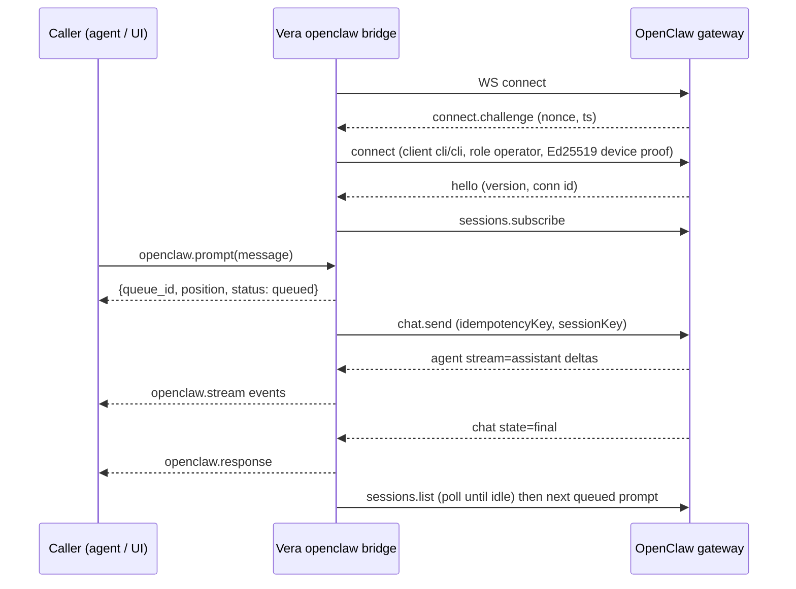

# 27 · OpenClaw

`vera/openclaw/` bridges Vera with a running **OpenClaw** agentic-loop gateway.
It is optional and opt-in: the module always loads with the orchestrator, but
it does not dial the gateway until `OPENCLAW_ENABLED=1` (or an explicit
`openclaw.connect`). The bridge runs in both directions:

- **Vera → OpenClaw** — Vera connects to the OpenClaw WebSocket gateway
  (protocol 3–4) as a signed operator device, creates/resumes sessions, queues
  and sends prompts, streams agent turns, and surfaces results on Vera's event
  stream.
- **OpenClaw → Vera** — a lightweight REST surface (`/openclaw/tools`,
  `/openclaw/call/{capability}`) and an installer that writes Vera into
  `openclaw.json`, so OpenClaw can use Vera's Ollama proxy as its model
  provider and Vera's capabilities as tools.

Source: `openclaw_capabilities.py` (capabilities, connection loop, prompt
queue, installer, panel route), `openclaw_device_core.py` (the pure connect
contract, Ed25519 device proof, stream parsing — testable without the app) and
`openclaw_panel.html`. The Vera → OpenClaw path is the mature, exercised half;
the inbound REST tool bridge has known limitations (see
[§9](#9-openclaw--vera-tool-bridge-and-installer)).

## Contents

- [1. Architecture](#1-architecture)
- [2. Source map](#2-source-map)
- [3. Capabilities](#3-capabilities)
- [4. Configuration](#4-configuration)
- [5. The connect handshake](#5-the-connect-handshake)
  - [5.1 Client identity](#51-client-identity)
  - [5.2 Device proof and pairing](#52-device-proof-and-pairing)
  - [5.3 Reconnect supervision](#53-reconnect-supervision)
- [6. Sending a prompt, and reading the answer](#6-sending-a-prompt-and-reading-the-answer)
  - [6.1 Overlapping prompts and the queue](#61-overlapping-prompts-and-the-queue)
  - [6.2 When a turn is really over](#62-when-a-turn-is-really-over)
  - [6.3 Stream events](#63-stream-events)
- [7. Events](#7-events)
- [8. Session and gateway lifecycle](#8-session-and-gateway-lifecycle)
- [9. OpenClaw → Vera: tool bridge and installer](#9-openclaw--vera-tool-bridge-and-installer)
- [10. UI](#10-ui)
- [11. Troubleshooting](#11-troubleshooting)
- [See also](#see-also)
- [Screenshots](#screenshots)
- [Capabilities](#capabilities)

---

## 1. Architecture



## 2. Source map

| File | Responsibility |
|---|---|
| `vera/openclaw/openclaw_capabilities.py` | Config/state, reconnect loop, handshake, `openclaw.*` capabilities, per-session prompt queue, REST tool bridge, installer, `/openclaw/panel`, `/openclaw/status/extended` |
| `vera/openclaw/openclaw_device_core.py` | Closed client enums, device identity (Ed25519), signed payloads v1–v3, connect/`chat.send` params, unexpected-property parsing, stream/final-answer parsing, supervisor rule |
| `vera/openclaw/openclaw_panel.html` | Bridge panel (status, config, chat, sessions, install) |

## 3. Capabilities

| Cap | Route | Purpose |
|---|---|---|
| `openclaw.status` | `GET /openclaw/status` | Connection state, gateway version, `device_id`, `device_public_key`, `pairing_required`, `gateway_unsupported_params` |
| `openclaw.config.get` | `GET /openclaw/config` | Current connection config (token redacted) |
| `openclaw.config.set` | `POST /openclaw/config` | Update config at runtime; rejects `client_id`/`client_mode` outside the gateway's enums |
| `openclaw.connect` | `POST /openclaw/connect` | Connect or reconnect |
| `openclaw.disconnect` | `POST /openclaw/disconnect` | Disconnect gracefully |
| `openclaw.prompt` | `POST /openclaw/prompt` | Queue (default) or send a prompt. Args: `message`, `session_key`, `agent_id`, `thinking`, `queue` (true), `queue_mode` |
| `openclaw.queue.list` | `GET /openclaw/queue` | Prompts in flight and waiting, per session |
| `openclaw.queue.cancel` | `POST /openclaw/queue/cancel` | Drop a prompt not yet sent |
| `openclaw.sessions.list` | `GET /openclaw/sessions` | Active OpenClaw sessions |
| `openclaw.sessions.reset` | `POST /openclaw/sessions/reset` | Clear one session's history |
| `openclaw.ollama-models` | `GET /openclaw/ollama-models` | Models on Vera's Ollama proxy (falls back to querying cluster nodes directly) |
| `openclaw.install.discover` | `GET /openclaw/install/discover` | Find `openclaw.json` via npm paths and common directories |
| `openclaw.install.write` | `POST /openclaw/install/write` | Merge Vera's provider and tool-bridge config into `openclaw.json` |

Plain routes: `GET /openclaw/status/extended` (status plus Ollama-proxy
routing fields), `GET /openclaw/panel`, `GET /openclaw/tools`,
`POST /openclaw/call/{capability_name}`.

## 4. Configuration

| Env var | Default | Purpose |
|---|---|---|
| `OPENCLAW_ENABLED` | `0` | Opt-in switch for the auto-connect supervisor |
| `OPENCLAW_WS_URL` | `ws://localhost:18789` | Gateway WebSocket |
| `OPENCLAW_TOKEN` | — | Shared secret / gateway password |
| `OPENCLAW_AGENT_ID` | `main` | Default agent to address |
| `OPENCLAW_VERA_BASE_URL` | `http://localhost:8000` | Vera's own URL for the tool bridge |
| `OPENCLAW_CLIENT_ID` | `cli` | Gateway client id — a **closed enum** (below) |
| `OPENCLAW_CLIENT_MODE` | `cli` | Gateway client mode — a **closed enum**; `operator` is a *role*, not a mode |
| `OPENCLAW_RUN_TIMEOUT` | `900` | Seconds before a run with no terminal frame is abandoned |
| `OPENCLAW_USE_VERA_OLLAMA` | `0` | Route OpenClaw's LLM calls through Vera's `/ollama` proxy |
| `OPENCLAW_VERA_OLLAMA_BASE` | `http://<BACKEND_HOST>:<ORCHESTRATOR_PORT>/ollama` | Vera Ollama proxy base |
| `OPENCLAW_OLLAMA_MODEL` | Vera's `OLLAMA_MODEL` | Model to advertise when using the proxy |

Runtime-only config fields (set with `openclaw.config.set`): `session_key`
(default `vera-bridge`), `settle_poll` (0.5 s), `settle_fallback` (2.0 s),
`settle_timeout` (60 s), `role` (`operator`) and `scopes`
(`operator.read`, `operator.write`).

## 5. The connect handshake

The gateway validates `connect.params` against its published JSON schema
(`@openclaw/gateway-protocol`) and refuses anything else outright.

### 5.1 Client identity

`client.id` and `client.mode` are **closed enums**. An invented id (Vera used to
send `vera-bridge`) or a role in the mode slot (`operator`) fails with *"must be
equal to one of the allowed values"*. Vera presents as the generic `cli`/`cli`
client with role `operator`; `openclaw.config.set` rejects a value outside the
enum instead of letting every reconnect fail.

| Enum | Accepted values |
|---|---|
| `client.id` | `webchat-ui`, `openclaw-control-ui`, `openclaw-browser-copilot`, `openclaw-tui`, `webchat`, `cli`, `gateway-client`, `openclaw-macos`, `openclaw-linux`, `openclaw-ios`, `openclaw-watchos`, `openclaw-android`, `node-host`, `openclaw-worker`, `test`, `fingerprint`, `openclaw-probe` |
| `client.mode` | `webchat`, `cli`, `ui`, `backend`, `node`, `worker`, `probe`, `test` |

### 5.2 Device proof and pairing

A real device proof is required. Vera keeps one **Ed25519 identity**
(`<state dir>/openclaw/device-identity.json`, private key sealed with
`security/secrets.py`), derives `device.id` as `sha256(raw public key)`, and
signs the challenge-bound payload the gateway expects:

```text
v3|deviceId|clientId|clientMode|role|scopes|signedAt|token|nonce|platform|deviceFamily
v2|deviceId|clientId|clientMode|role|scopes|signedAt|token|nonce
v1|deviceId|clientId|clientMode|role|scopes|signedAt|token
```

The newest version is tried first, falling back for older gateways; the
accepted version is remembered so reconnects skip the ladder. `signedAt` is the
`ts` from the gateway's `connect.challenge`, not local time. Public key and
signature travel as unpadded base64url of the raw 32-byte key / 64-byte
signature.

The identity is persisted precisely because an operator approves that
fingerprint once: `openclaw.status` returns `device_id`, `device_public_key`
and `pairing_required`, so a `PAIRING_REQUIRED` refusal tells you which device
to approve in the OpenClaw Control UI (Devices) or via `openclaw devices`. A
trusted local backend (`client_id: gateway-client`, `client_mode: backend`) may
skip the proof, but only over a direct loopback connection with the shared
gateway token.

| Gateway error code | Bridge behaviour |
|---|---|
| `DEVICE_AUTH_INVALID`, `DEVICE_AUTH_SIGNATURE_INVALID`, `DEVICE_AUTH_NONCE_REQUIRED`, `DEVICE_AUTH_NONCE_MISMATCH`, `DEVICE_AUTH_DEVICE_ID_MISMATCH` | Retry once with an older payload version |
| `PAIRING_REQUIRED`, `AUTH_TOKEN_MISSING`, `AUTH_TOKEN_MISMATCH`, `AUTH_PASSWORD_MISSING`, `AUTH_PASSWORD_MISMATCH`, `AUTH_SCOPE_MISMATCH`, `PROTOCOL_MISMATCH` | Terminal — stop retrying until a human acts |

### 5.3 Reconnect supervision

A periodic job (`_maybe_autostart`, every 30 s) supervises **one** reconnect
loop while `OPENCLAW_ENABLED=1`: it starts the loop only if none is alive, and
logs the exception of a loop that died before replacing it. Once the reader is
live the bridge calls `sessions.subscribe`, since `sessions.changed` reaches
subscribers only.

## 6. Sending a prompt, and reading the answer

`chat.send` requires an `idempotencyKey`; without one the gateway refuses the
call. `agentId` is accepted by newer gateways and rejected as an unexpected
property by older ones (2026.4.29), so the bridge retries once without any
property the gateway names — and **remembers the refusal for that gateway
version**, so only the first such call pays for it. `openclaw.status` reports
the memo as `gateway_unsupported_params`, and a version change re-probes it.
The agent is selectable through the session key regardless, since a bare key
like `vera-bridge` resolves to `agent:main:vera-bridge`. Vera reports the key
you asked for, not the resolved one.

### 6.1 Overlapping prompts and the queue

A second `chat.send` into a **busy** session is accepted — runId,
`status: started` — and then given nothing: no deltas, an empty final message.
The protocol's `queueMode` (`steer`/`followup`/`collect`/`interrupt`) exists for
this, but 2026.4.29 refuses the property outright, so the bridge keeps its own
per-session queue.

`openclaw.prompt` therefore **queues by default** and returns a `queue_id` with
its position rather than a `run_id`:

```json
{"ok": true, "queue_id": "8f2c…", "position": 2, "status": "queued", "queued": true}
```

The prompt goes out when the session is free; `openclaw.prompt.sent` then
carries its `run_id`, and `openclaw.stream` / `openclaw.response` carry both ids
so a reply can be traced to the request that asked for it. Pass `queue: false`
to send immediately anyway, or `queue_mode` to let a newer gateway order it
server-side. `openclaw.queue.list` shows what is in flight and waiting;
`openclaw.queue.cancel` drops a prompt that has not been sent yet — one already
with the gateway cannot be recalled. Prompt states: `queued`, `sent`, `done`,
`failed`, `cancelled`, `interrupted`.

### 6.2 When a turn is really over

**The final frame is not the end of the turn.** At the `chat` final the session
still reports `running` and only reads `done` about a second later (measured
0.34 s → 1.04 s on 2026.4.29); a prompt sent inside that window is accepted and
answered with nothing. The queue therefore releases the next prompt on the
session's own status from `sessions.list`, polled every `settle_poll` seconds,
not on the final frame — bounded by `settle_timeout` (60 s) so an unrecognised
status can never stall the queue. If the status cannot be read at all, it waits
`settle_fallback` seconds instead.

A run whose terminal frame never arrives is abandoned after
`OPENCLAW_RUN_TIMEOUT` (default 900 s, event `openclaw.prompt.timeout`) so the
queue behind it is not stranded, and a dropped connection loses only what was in
flight — queued prompts keep their place and go out on the next connection.

### 6.3 Stream events

The answer comes back on **two** event families carrying the same text:

| Event | Carries | Bridge uses it for |
|---|---|---|
| `agent` (`stream: "assistant"`) | `data.delta` increment, `data.text` cumulative | live `openclaw.stream` deltas |
| `agent` (`stream: "lifecycle"`) | `data.phase` | run lifecycle only |
| `chat` (`state: "delta"`) | full message snapshot | ignored — appending it doubles every token |
| `chat` (`state: "final"\|"aborted"\|"error"`) | authoritative final message | `openclaw.response` |

The final `chat` message is authoritative rather than the accumulated buffer,
so a reconnect mid-run cannot truncate the reply.

## 7. Events

| Event | When |
|---|---|
| `openclaw.connected` / `openclaw.disconnected` / `openclaw.error` | Connection lifecycle |
| `openclaw.config.changed` | `openclaw.config.set` applied |
| `openclaw.prompt.queued` / `.sent` / `.failed` / `.cancelled` / `.timeout` | Prompt lifecycle |
| `openclaw.stream` | Assistant delta (with `queue_id` and `run_id`) |
| `openclaw.response` | Final answer |
| `openclaw.installed` | `openclaw.install.write` wrote the config |

## 8. Session and gateway lifecycle

OpenClaw is an external agent-gateway integration. Configuration establishes
the endpoint and credentials; connect negotiates a usable session; prompt sends
work through that session; session listing/reset provides recovery. Vera still
owns capability policy and records the bridge call like any other integration.

Check status before prompting and distinguish gateway reachability from model
availability. A connected gateway can still fail because its selected model is
missing, its upstream provider rejected authentication, or a prior session is
stale. Reset only the affected session rather than deleting global integration
configuration.

Treat all gateway-returned tool requests as untrusted external proposals. They
must pass Vera's normal allowlists and confirmation rules; connection trust does
not imply permission to mutate local files, services, or third-party accounts.

If OpenClaw also runs a Telegram bot on the same host, give it its own bot
token — one token supports one poller ([Integrations §6.1](./23-integrations.md#61-multiple-bots)).

## 9. OpenClaw → Vera: tool bridge and installer

`openclaw.install.write(config_path, vera_base_url, set_ollama_provider=true,
set_tool_bridge, ollama_model)` merges into an existing (or new) `openclaw.json`,
writing a backup to `openclaw.json.vera-bak` first:

| Section | Written when | Content |
|---|---|---|
| `ollama` | `set_ollama_provider` | `baseUrl: <vera>/ollama` — Vera's Ollama-compatible cluster proxy ([04](./04-ollama-cluster.md)) — and a default `model` |
| `skills.vera` | `set_tool_bridge` | `url: <vera>/openclaw/tools`, `callUrl: <vera>/openclaw/call` |
| `_vera_bridge` | always | Bookkeeping marker |

`GET /openclaw/tools` lists every registered Vera capability as an
OpenClaw-style tool schema (name, description, JSON parameters), and
`POST /openclaw/call/{capability_name}` executes one with the JSON body as
arguments.

> [!WARNING]
> Known limitations of the REST tool bridge in the current source: the routes
> perform no authentication of their own and bypass the capability wrapper, so
> they must not be exposed beyond a trusted network; `/openclaw/tools` reads a
> `doc` field the capability registry does not populate, so tool descriptions
> come back empty; and `/openclaw/call` looks up an `fn` entry the registry does
> not provide, so calls currently fail with HTTP 500. For tool use from external
> agents, prefer Vera's MCP exposure ([Agent Runtimes & Providers](./36-agent-runtimes-providers.md)).

## 10. UI

OpenClaw has no top-level tab of its own: the bridge panel
(`openclaw_panel.html`, served at `/openclaw/panel`) is embedded as the
**OpenClaw** section of the **Automations** tab. (A source comment in
`openclaw_capabilities.py` still describes an older placement under the Estate
panel.)

## 11. Troubleshooting

| Symptom | Check |
|---|---|
| Never connects | `OPENCLAW_ENABLED=1`, or call `openclaw.connect`; `OPENCLAW_WS_URL` reachable |
| "must be equal to one of the allowed values" | `client_id`/`client_mode` outside the enums — reset to `cli`/`cli` |
| `pairing_required: true` | Approve the `device_id` from `openclaw.status` in the Control UI or `openclaw devices` |
| `AUTH_TOKEN_MISMATCH` | `OPENCLAW_TOKEN` differs from the gateway's |
| Prompt accepted but empty answer | Another prompt was running — keep the default queue; check `openclaw.queue.list` |
| Prompts stuck in the queue | The session status never reads idle; `settle_timeout` releases after 60 s, a lost run after `OPENCLAW_RUN_TIMEOUT` |
| `gateway_unsupported_params` lists `agentId` | Older gateway; select the agent through the session key instead |
| Device identity changed | `<state dir>/openclaw/device-identity.json` was removed or its seal key changed; re-approve |

---

## See also

- [Agents & Chat](./19-agents-chat.md) — Vera's native agentic loop (the in-house counterpart)
- [Agent Runtimes & Providers](./36-agent-runtimes-providers.md) — other runtime bridges and MCP
- [LLM Cluster](./04-ollama-cluster.md) — the `/ollama` proxy OpenClaw can use as its provider
- [Capability Framework §5](./01-capability-framework.md) — MCP proxying, the general pattern for bridging external tool servers
- [Security & Secrets](./29-security.md) — sealing of the device private key

## Screenshots

<!-- VERA:AUTO:screenshots START -->
_No screenshots captured yet — run `docs.build` (or `operator.mission.run documentation`)._
<!-- VERA:AUTO:screenshots END -->

## Capabilities

<!-- VERA:AUTO:capabilities START -->
_No capabilities resolved for this domain._
<!-- VERA:AUTO:capabilities END -->
