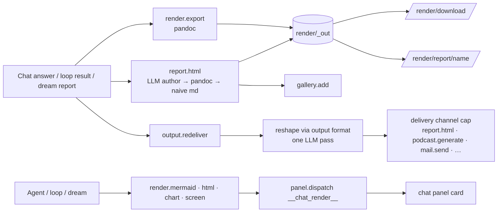

# 28 · Render — Document Export, Reports & In-Chat Visuals

Render is where Vera's text answers become **artifacts** people can open, share
and keep. It covers four things:

1. **Document export** — Markdown/text → DOCX, PDF, HTML, ODT, RTF, EPUB, PPTX, LaTeX via `pandoc`, or plain `md`/`txt` written directly.
2. **Rich HTML reports** — `report.html` turns any output into a self-contained, themed HTML document with Mermaid diagrams, inline-SVG charts and optional generated images.
3. **Re-delivery and the artifacts gallery** — `output.redeliver` sends an existing output through another delivery channel; `gallery.*` is a curated shelf of artifacts.
4. **In-chat visuals** — `render.mermaid`, `render.html`, `render.chart` and `render.screen` put diagrams, snippets, charts and panels in front of the user through the chat panel bridge.

Source: `vera/render/render_capabilities.py` (export, `report.html`,
re-delivery, gallery) and `vera/render/chat_render_capabilities.py` (in-chat
rendering), with the `<vera-mermaid>` element in `vera/render/vera_mermaid.js`.
Output-format profiles come from `vera/output_formats.py` and delivery channels
from `vera/delivery.py`.

**Status:** stable. `pandoc` is installed in the Docker image; `wkhtmltopdf` is
installed when the base distribution provides it. Formats whose binaries are
missing are reported as not live rather than failing silently.

## Contents

- [1. Source map](#1-source-map)
- [2. Architecture](#2-architecture)
- [3. Document export (`render.*`)](#3-document-export-render)
  - [3.1 Formats and engines](#31-formats-and-engines)
  - [3.2 Capabilities](#32-capabilities)
  - [3.3 Output files and download routes](#33-output-files-and-download-routes)
- [4. Rich HTML reports (`report.html`)](#4-rich-html-reports-reporthtml)
- [5. Re-delivery (`output.redeliver`)](#5-re-delivery-outputredeliver)
- [6. In-chat rendering](#6-in-chat-rendering)
- [7. Artifacts gallery](#7-artifacts-gallery)
- [8. Who uses Render](#8-who-uses-render)
- [9. Events and storage](#9-events-and-storage)
- [10. Worked examples](#10-worked-examples)
- [11. Parsing is not rendering](#11-parsing-is-not-rendering)
- [12. Safety, failure modes and troubleshooting](#12-safety-failure-modes-and-troubleshooting)
- [See also](#see-also)

---

## 1. Source map

| Path | Responsibility |
|---|---|
| `vera/render/render_capabilities.py` | `render.formats`, `render.export`, `render.dream_export`, `report.html`, `output.channels`, `output.redeliver`, `gallery.*`; `/render/download`, `/render/report/{name}`, `/gallery/view`; the **Artifacts** tab. |
| `vera/render/chat_render_capabilities.py` | `render.mermaid`, `render.html`, `render.chart`, `render.screen`; serves `/ui/elements/vera_mermaid.js`; registers the `vera-mermaid` inject element. |
| `vera/render/vera_mermaid.js` | `<vera-mermaid>` — Vera's own theme-aware Mermaid renderer (no CDN; pan/zoom; SVG/PNG export). |
| `vera/render/_out/` | Generated files (created on import). |
| `vera/output_formats.py` | Format profiles and their `target_file_format` hints. |
| `vera/delivery.py` | Channel registry used by re-delivery. |

---

## 2. Architecture



---

## 3. Document export (`render.*`)

### 3.1 Formats and engines

| Format | Engine | Needs |
|---|---|---|
| `md` (`markdown`), `txt` (`text`) | Written directly | nothing |
| `docx`, `html` (standalone), `odt`, `rtf`, `epub`, `pptx`, `latex` (`tex`) | `pandoc -f markdown` | `pandoc` |
| `pdf` | `pandoc --pdf-engine=<engine>` | `pandoc` plus the first available of `wkhtmltopdf`, `weasyprint`, `xelatex`, `pdflatex`, `tectonic` |

Aliases: `markdown → md`, `text → txt`, `tex → latex`. A title is written as a pandoc title block and `--metadata title=…`. Conversions time out after 120 s.

Each output-format profile carries a default file type (`target_file_format`), for example `report` and `docs` → `docx`, `slides` → `pptx`, `json` → `json`, `audio`/`email`/`plain` → `txt`; the chat panel uses these for its export chips.

### 3.2 Capabilities

| Cap | Route | Purpose |
|---|---|---|
| `render.formats` | `GET /render/formats` | `{pandoc, pdf_engine, formats:[{id, live}]}` — which targets can be produced right now. |
| `render.export` | `POST /render/export` | `content` (required), `format` (default `md`), `title`, `filename` → `{ok, format, filename, url, bytes}`. Emits `render.export`. |
| `render.dream_export` | `POST /render/dream_export` | `cycle_id` (required), `format` (default `docx`), `filename`. Pulls the report via `dream.cycle.detail` and exports it. |

### 3.3 Output files and download routes

Files are written to `vera/render/_out/` as `<safe-stem>-<8 hex>.<ext>` (the stem is sanitised to `[A-Za-z0-9._-]`, max 80 chars).

| Route | Behaviour |
|---|---|
| `GET /render/download?name=…` | Serves any output file as an attachment. The name is reduced to its basename and must resolve inside `_out/`; otherwise 400/404. |
| `GET /render/report/{name}` | Serves an `.html` report **inline** (same origin, so `<vera-mermaid>` and `/images/file` URLs resolve). |

---

## 4. Rich HTML reports (`report.html`)

`report.html` (`POST /render/report_html`) turns any run's output into a durable, self-contained HTML document. It is the rich sibling of `render.html` (an ephemeral in-chat snippet) and `render.export` (plain pandoc).

| Input | Meaning |
|---|---|
| `content` (required) | The report text (Markdown allowed). |
| `title` | Default: first heading or first non-empty line (max 140 chars). |
| `mode` | `auto` (default), `author`, `template`, `pandoc`. |
| `illustrate` | Number of images (max 6) to generate via `media.illustrate` and embed (default 0). |
| `session_id`, `filename` | Recorded in the sidecar; base name. |

**Pipeline:**

1. **Illustrations** (optional): `media.illustrate` is asked for "clean editorial illustration" images of the title and headings.
2. **Body**, by mode:
   - `auto` / `author` / `template`: `llm.generate` authors the **inner** HTML (sections, tables, `<div class="card">` takeaways, `<vera-mermaid bare>` diagrams, hand-written inline `<svg>` charts, `<figure>` images). It is told to stay faithful to the source and not invent facts, numbers or citations; input is capped at 14,000 characters.
   - If that yields nothing and mode is `auto` or `pandoc`: a pandoc HTML fragment.
   - Last resort: a built-in naive Markdown-to-HTML conversion.
3. Any illustration not already placed is appended as an **Illustrations** section.
4. The body is wrapped in a self-contained, light/dark-aware document with the Mermaid boot script.
5. Saved as `<stem>-<hex>.html` plus a sidecar `….html.json` (`kind: html_report`, title, mode, bytes, images, session).

Output: `{ok, url (/render/report/…), download_url, filename, artifact_id, title, bytes, mode_used, images}`. Emits `report.html` events with `stage: start|done`.

`report.html` is also the **`html` delivery channel**, so Dream triggers and `output.redeliver` can produce HTML reports.

---

## 5. Re-delivery (`output.redeliver`)

`output.redeliver` (`POST /render/redeliver`) takes an existing output — a chat message, a run's final text, a dream report — and sends it through **another** delivery channel without touching the original.

| Input | Meaning |
|---|---|
| `channel` (required) | A channel id from `output.channels`: `html`, `podcast`, `email`, `chat`, `telegram`, `notebook`, `memory`, or a skill channel. |
| `content` | The text, **or** `source_type` + `source_id` (currently `dream_cycle` / `dream` / `cycle` + a cycle id) to resolve it. |
| `title` | Default: first line. |
| `target` | Channel address (email, session id) when the channel needs one; never auto-filled. Falls back to the channel's `fixed_target`. |
| `format` | Output-format override (else the channel default). |
| `illustrate`, `html_mode` | Passed to the `html` channel. |

The text is reshaped through the format with **one LLM pass** ("reformat without adding, removing or inventing facts"). Passthrough formats (`""`, `markdown`, `md`, `standard`, `text`, `txt`, `verbatim`), unknown profiles or an unavailable LLM leave it unchanged. `delivery.build_args` then builds the channel cap's arguments and the cap is called. The result surfaces `url`, `download_url`, `filename`, `artifact_id`, `job_id` or `episode_id` when present. Emits `output.redeliver` (`start`/`done`).

`output.channels` (`GET /render/output_channels`) lists the channels with an `available` flag (whether the channel's cap is registered).

---

## 6. In-chat rendering

`vera/render/chat_render_capabilities.py` lets chat directives, agentic loops, dream pipelines and DAG steps put **live visuals** in the user's chat. Each cap publishes a `__chat_render__` pseudo-action through `panel.dispatch` to the chat session; the chat panel renders the payload and acknowledges. With no listening chat session the call returns `{ok:false, error:"timeout"}` (default wait 8 s), which is harmless.

| Cap | Route | Inputs | Renders |
|---|---|---|---|
| `render.mermaid` | `POST /render/mermaid` | `code` (required), `title`, `session_id` (required), `popout` (default false) | A Mermaid diagram (`flowchart`/`graph TD\|LR`, `sequenceDiagram`, `stateDiagram`, `pie`) via `<vera-mermaid>`. In a chat reply a ` ```mermaid ` block renders inline anyway; use the cap from loops and dreams. |
| `render.html` | `POST /render/html` | `html` (required), `title`, `session_id` (required), `popout` (default false), `height` (120–1600, default 380) | A sandboxed code card — the same card a ` ```html ` block gets (source toggle, pane, pop-out). A complete document draws itself; a fragment waits to be asked. |
| `render.chart` | `POST /render/chart` | `spec` (required: `{type: bar\|line\|pie, labels, series:[{name, values}], title?, y_label?}`), `title`, `session_id`, `popout` | A themed SVG chart drawn client-side. Use `render.html` for anything fancier. |
| `render.screen` | `POST /render/screen` | `panel_id` (required), `session_id` (required), `title` | Floats any registered panel — including one just created with `ui.panel.create` — over the chat as a pop-out window. |

> [!NOTE]
> Pop-out is the user's choice. `render.html` defaults to `popout: false`, and its description tells models not to pass it unless the user asked, because a floating window covers the whole UI.

Each call emits `render.push` (`what`: `mermaid`, `html`, `chart` or `panel`). `<vera-mermaid>` is served at `/ui/elements/vera_mermaid.js` (re-read per request) and registered as the inject element `vera-mermaid`.

---

## 7. Artifacts gallery

A single global, curated shelf for outputs worth keeping, stored in Redis (`vera:gallery:h` hash of records plus `vera:gallery:z` sorted set by creation time), so it survives restarts and is shared across instances using the same Redis.

| Cap | Route | Purpose |
|---|---|---|
| `gallery.add` | `POST /gallery/add` | Pin an artifact: `title` or `url` (one required), `kind` (`html_report`, `image`, `export`, `podcast`, `link`, `text`, `other`), `download_url`, `thumb`, `tags` (CSV or list), `note`, `source_id`, `artifact_id`, `bytes`, `meta`, `session_id`. Needs Redis. Emits `gallery.add`. |
| `gallery.list` | `GET /gallery/list` | Newest first: `limit` (60), `kind`, `tag`, `q` (title/note substring). |
| `gallery.get` | `GET /gallery/get` | One item by `id`. |
| `gallery.update` | `POST /gallery/update` | Edit title, note, tags. |
| `gallery.remove` | `POST /gallery/remove` | Remove from the gallery (does **not** delete the underlying file). Emits `gallery.remove`. |

The **Artifacts** tab (panel `gallery`, `tab_order` 212) iframes the self-contained browser at `/gallery/view`.

---

## 8. Who uses Render

| Caller | Uses |
|---|---|
| Chat | `render.formats` and `render.export` for format extras (PDF preview, `.docx`/`.pptx` chips); `render.*` directives; re-delivery actions. See [Agents & Chat §8](./19-agents-chat.md#8-output-format-and-delivery). |
| Dream | `html` delivery channel (`report.html`), `render.dream_export`. See [Dream](./17-dream.md). |
| Agent loops and DAG steps | `render.mermaid` / `render.html` / `render.chart` to show work; `report.html` for durable output. |
| UI Builder | `render.screen` to show a freshly built panel. See [UI Builder](./26-ui-builder.md). |

---

## 9. Events and storage

| Event | Emitted by |
|---|---|
| `render.export` | `render.export`, `render.dream_export` (`source: dream`) |
| `report.html` (`stage: start\|done`) | `report.html` |
| `output.redeliver` (`stage: start\|done`) | `output.redeliver` |
| `gallery.add`, `gallery.remove` | Gallery |
| `render.push` | In-chat render caps |

Storage: files and sidecars in `vera/render/_out/`; gallery in `vera:gallery:h` / `vera:gallery:z`. There is no automatic cleanup of `_out/`.

---

## 10. Worked examples

Check what can be produced, then export a report to DOCX:

```bash
curl -s "$VERA/render/formats"
curl -s -X POST "$VERA/render/export" -H 'Content-Type: application/json' -d '{
  "content": "# Q3 review\n\n## Findings\n- Latency down 18%", "format": "docx",
  "title": "Q3 review", "filename": "q3-review"}'
# → {"ok":true,"url":"/render/download?name=q3-review-1a2b3c4d.docx",...}
```

Turn a dream report into an illustrated HTML report and pin it:

```json
{"name": "output.redeliver", "arguments": {
  "channel": "html", "source_type": "dream_cycle", "source_id": "<cycle_id>",
  "illustrate": 2}}
{"name": "gallery.add", "arguments": {"title": "Weekly digest", "kind": "html_report",
  "url": "/render/report/weekly-digest-….html"}}
```

Show a diagram from inside a loop:

```json
{"name": "render.mermaid", "arguments": {"session_id": "<chat session>",
  "title": "Pipeline", "code": "flowchart LR\n  A[gather] --> B[synthesize] --> C[deliver]"}}
```

---

## 11. Parsing is not rendering

Render is product policy for producing presentation files. Inbound document
understanding belongs to the separate `providers.document.*` contract
(`providers.document.status`, `plan`, `validate`, `corpus.evaluate`,
`teardown.plan` in `vera/providers/`). That boundary accepts an original
`ArtifactRef`, describes a future isolated parser, and validates supplied
records, derived artifacts, citations, OCR declarations and resource evidence.
It does not route conversion binaries through Render or treat a rendered file
as parsed merely because it exists.

The initial Docling profile is static and `queued_live`: the offline contract
imports no Docling package and reads no file. A future live adapter must retain
the original artifact and parser/config provenance; Render may consume verified
records or derived artifacts only after that separate gate succeeds. See
[Agent Runtimes & Providers](./36-agent-runtimes-providers.md).

---

## 12. Safety, failure modes and troubleshooting

Inputs are content, not trusted code. `render.html` snippets run in a sandboxed
card; `report.html` bodies are LLM-authored HTML served same-origin from
`_out/`, so treat generated reports as you would any other HTML you open. Paths
are constrained to `_out/`. Review Mermaid and templating features before
rendering model-produced text. A successful render returns the artifact
identity, media type information and size — do not infer success from a zero
exit code if the expected file is absent.

| Symptom | Check |
|---|---|
| `pandoc not installed` / format not live | `render.formats`; install `pandoc` (present in the Docker image). |
| `no PDF engine available` | Install `wkhtmltopdf`, `weasyprint` or a LaTeX engine; the chat PDF preview is hidden without one. |
| `pandoc timed out` | Very large input; split it or export Markdown. |
| `report.html` came out plain | `mode_used` is `pandoc` or `markdown` because the LLM author produced nothing usable; check model availability. |
| Images missing from a report | `media.illustrate` unavailable or failed (best-effort, never raises). |
| `render.*` returns `timeout` | No chat session listening on that `session_id`. |
| Redelivered text changed meaning | The reshape pass is an LLM rewrite; use a passthrough `format` (`markdown`) to send verbatim. |

Failures usually fall into missing external binaries or fonts, malformed source,
unsupported formats or options, unwritable artifact storage, or PDF engine
startup. Preserve the source and render settings alongside important artifacts
so they can be reproduced.

---

## See also

- [Dream](./17-dream.md) — `render.dream_export` and the `html` channel consume dream reports
- [Agents & Chat](./19-agents-chat.md) — output-format profiles, format extras, panel bridge
- [Media & Characters](./38-media-characters.md) — `media.illustrate` images for reports
- [Podcast](./31-podcast.md) — the `podcast` re-delivery channel
- [UI Builder](./26-ui-builder.md) — panels that `render.screen` can float
- [Docker](./13-docker.md) — the image that ships `pandoc`

## Screenshots

<!-- VERA:AUTO:screenshots START -->
_No screenshots captured yet — run `docs.build` (or `operator.mission.run documentation`)._
<!-- VERA:AUTO:screenshots END -->

## Capabilities

<!-- VERA:AUTO:capabilities START -->
_No capabilities resolved for this domain._
<!-- VERA:AUTO:capabilities END -->
