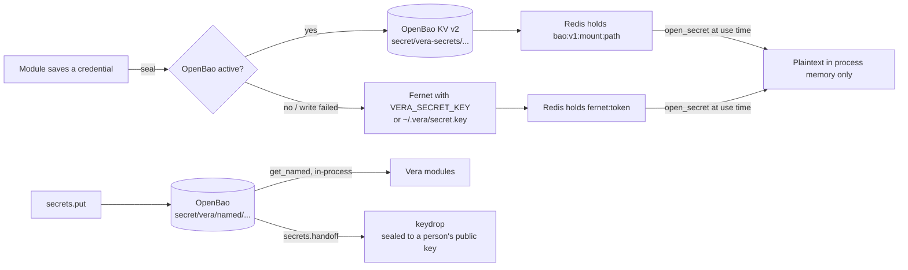

# 29 · Security & Secrets

Vera stores and uses credentials for many outside systems: Google OAuth refresh
tokens, CalDAV/IMAP/SMTP app passwords, the Telegram bot token, marketplace and
exchange API keys, SSH logins, OpenBao tokens and the shared Redis passwords.
This page explains how those secrets are protected at rest and how they are
handed to people. It also covers the boundaries that limit what a caller,
an agent or a development sandbox can do.

The code lives in `vera/security/`: `secrets.py` (sealing), `secret_service_core.py`
and `secrets_capabilities.py` (the `secrets.*` service over OpenBao and keydrop),
`redis_auth_core.py` and `redis_auth_capabilities.py` (Redis ACL users),
`certs_core.py` and `certs_capabilities.py` (the estate certificate list).
The access boundaries are spread across the framework: `vera/capability_policy_core.py`,
`vera/capability_enforcement.py`, `vera/approval_receipts.py`, `vera/sandbox_guard.py`
and `vera/evolve/sandbox_estate_guard.py`. The OpenBao and step-ca services themselves
are adopted and operated by the provisioning suite
(`vera/provisioning/provisioning_capabilities.py`, see
[Infrastructure provisioning](./35-infrastructure-provisioning.md)).

**Maturity.** Sealing at rest, the secrets service, Redis ACL users, the
certificate list and the sandbox guards are in production use. Central
capability-policy enforcement is still mostly **shadow-only**: every call is
evaluated and the verdict is recorded, but only one small capability family can
be blocked, and only when two explicit flags are set. The orchestrator's HTTP API
has **no built-in authentication**. Network reachability is the outer access
boundary (see [§7](#7-api-access-boundaries)).

## Contents

- [1. Security model at a glance](#1-security-model-at-a-glance)
- [2. Source map](#2-source-map)
- [3. Sealed secrets](#3-sealed-secrets)
  - [3.1 Token formats and backends](#31-token-formats-and-backends)
  - [3.2 Master key resolution](#32-master-key-resolution)
  - [3.3 When OpenBao is used](#33-when-openbao-is-used)
  - [3.4 Public API](#34-public-api)
  - [3.5 Who seals what](#35-who-seals-what)
- [4. The secrets service](#4-the-secrets-service)
  - [4.1 Named secrets](#41-named-secrets)
  - [4.2 Scoping Vera's OpenBao token](#42-scoping-veras-openbao-token)
  - [4.3 Migrating file-key seals into OpenBao](#43-migrating-file-key-seals-into-openbao)
  - [4.4 Keydrop: handing a secret to a person](#44-keydrop-handing-a-secret-to-a-person)
  - [4.5 The watcher](#45-the-watcher)
  - [4.6 Findings](#46-findings)
  - [4.7 Capability reference](#47-capability-reference)
- [5. Redis authentication](#5-redis-authentication)
- [6. Certificates and HTTPS](#6-certificates-and-https)
- [7. API access boundaries](#7-api-access-boundaries)
- [8. Capability policy and enforcement](#8-capability-policy-and-enforcement)
- [9. Approval receipts](#9-approval-receipts)
- [10. Development-sandbox guards](#10-development-sandbox-guards)
- [11. Repository secret scanning](#11-repository-secret-scanning)
- [12. Configuration reference](#12-configuration-reference)
- [13. Events and storage](#13-events-and-storage)
- [14. Worked examples](#14-worked-examples)
- [15. Troubleshooting](#15-troubleshooting)
- [16. Security boundaries and operational checks](#16-security-boundaries-and-operational-checks)
- [Related pages](#related-pages)

---

## 1. Security model at a glance

| Layer | What it protects | Where |
|---|---|---|
| Sealing at rest | Credentials stored in Redis are Fernet ciphertext or an OpenBao reference, never plaintext | `security/secrets.py` |
| Secrets service | OpenBao as store of record, a least-privilege Vera token, migration off the file key, hand-off to people through keydrop | `security/secrets_capabilities.py` |
| Redis ACL users | One Redis user and password per client of the shared Redis, with no anonymous access once locked | `security/redis_auth_*.py` |
| Certificates | Expiry and issuer visibility across every HTTPS service on the estate | `security/certs_*.py` |
| Argument redaction | Secret-looking argument names are masked in events, activity records and previews | `capability_orchestration._args_preview`, `redact_args=` |
| Capability policy | Every non-silent call is evaluated against its declared contract; the verdict is recorded and can, for one opted-in family, block | `capability_policy_core.py`, `capability_enforcement.py` |
| Approval receipts | Signed, scope-bound, single-use approval evidence that cannot be forged through call arguments | `approval_receipts.py` |
| Sandbox guards | A development sandbox cannot write to shared production stores or mutate the shared estate and branches | `sandbox_guard.py`, `evolve/sandbox_estate_guard.py` |
| Repository scanning | Credentials are blocked from entering git | `tools/secret_scan.py`, `tools/hooks/` |



---

## 2. Source map

| File | Responsibility |
|---|---|
| `vera/security/secrets.py` | `seal` / `open_secret` / `is_sealed` / `redact` / `backend_status`; Fernet and OpenBao backends; master-key resolution. A leaf library, not a capability group. |
| `vera/security/secret_service_core.py` | Pure rules: named-secret path validation, Vera's OpenBao policy (HCL), finding sealed values inside stored JSON, migration plans, keydrop payloads, plain-language findings. |
| `vera/security/secrets_capabilities.py` | The `secrets.*` capabilities, the `/secrets/panel` route and the background token-renew / auto-unseal watcher. |
| `vera/security/secrets_panel.html` | Trust → **Secrets** sub-tab: service state, values still on the file key, named secrets (never values), the SSH-login cleanup. |
| `vera/security/redis_auth_core.py` | Pure rules for Redis ACL users: per-user rules, URL credential handling, redaction, env-file updates, the `default`-user lock plan. |
| `vera/security/redis_auth_capabilities.py` | The `redis.auth.*` capabilities. |
| `vera/security/certs_core.py` | Pure rules: issuer naming, days-left, state, superseded FreeIPA copies, findings. |
| `vera/security/certs_capabilities.py` | `certs.list` and the `/certs/panel` route (Trust → **Certificates**). |
| `vera/config.py` | `_apply_local_redis_credentials()` opens the host's sealed Redis credential at start-up; TLS settings. |
| `vera/capability_policy_core.py` | `evaluate_policy_shadow` — the deterministic, content-free policy verdict. |
| `vera/capability_enforcement.py` | The bounded enforcement rollout (`VERA_POLICY_MODE`, `VERA_POLICY_ENFORCE_FAMILIES`). |
| `vera/approval_receipts.py` | HMAC-signed approval receipts, nonce replay ledgers, the dispatcher-owned trusted policy context. |
| `vera/sandbox_guard.py` | Dev-sandbox write guard, Cypher write classification, prod read-through policy. |
| `vera/evolve/sandbox_estate_guard.py` | The explicit list of capabilities refused inside a dev sandbox. |
| `tools/secret_scan.py`, `tools/hooks/` | Dependency-free secret scanner and the git hooks that run it. |

---

## 3. Sealed secrets

`vera/security/secrets.py` provides authenticated encryption for the
*account-level* secrets that Vera modules keep in Redis. They must never sit in
Redis as plaintext, or under the old reversible XOR obfuscation.

### 3.1 Token formats and backends

There are two interchangeable backends behind one API. Reads always understand
both token forms, so switching backends migrates values lazily: old `fernet:`
tokens keep opening, and new secrets seal to `bao:`.

| Stored form | Backend | Where the plaintext lives |
|---|---|---|
| `fernet:<token>` | **Fernet** (AES-128-CBC + HMAC-SHA256). The default, always available, and no external service needed. | Inline in Redis as ciphertext; the key is kept out-of-band. |
| `bao:v1:<mount>:<path>` | **OpenBao** KV v2 (opt-in, once stood up). | In OpenBao under `<mount>/data/vera-secrets/<uuid>`; Redis holds only the opaque reference. |
| anything else | legacy plaintext | Returned as-is by `open_secret` so pre-encryption records still work. Re-save to seal. |

OpenBao gains audit, rotation and central revocation. Fernet stays necessary
even when OpenBao is active, because it is the **bootstrap store for OpenBao's
own secrets**. The vault cannot hold the token and unseal key that open it. Those
are sealed with `force_fernet=True` into the Redis hash `vera:provisioning:state`.

### 3.2 Master key resolution

The Fernet key is **never** stored in Redis next to the ciphertext. The resolution order is:

1. **`VERA_SECRET_KEY`** — a urlsafe-base64 32-byte Fernet key. This is preferred for
   production, because the operator manages it out-of-band. Generate one with
   `make secret`.
2. **Fallback: `~/.vera/secret.key`.** It is generated on first use and written `0600`.
   A warning is logged recommending the environment variable for production.
   If the file cannot be written, an error is logged: secrets will not survive a
   restart.

> [!WARNING]
> If `VERA_SECRET_KEY` (or the key file) changes, every `fernet:` value becomes
> undecryptable. `open_secret` then returns `""` and logs *"stored credential is
> corrupt or was sealed with a different key — re-enter it"*. Keep the key stable
> and back it up separately from Redis.

If the `cryptography` package is missing, sealing **fails closed**. `seal()` raises
`RuntimeError` instead of storing plaintext, and callers treat that as "no secret
stored". The SSH login store (`execution/exec_capabilities.py`) is the one
exception. It falls back to the legacy XOR form so that saving a host never
hard-fails, and it logs a warning. `secrets.migrate` later moves those values
into OpenBao (see [§4.3](#43-migrating-file-key-seals-into-openbao)).

### 3.3 When OpenBao is used

OpenBao is used at seal time when **both** an address (`BAO_ADDR` or `VAULT_ADDR`)
and a token (`BAO_TOKEN` or `VAULT_TOKEN`) are set, **and** `VERA_SECRET_BACKEND` is
empty, `openbao` or `auto`. Any other value, such as `fernet`, pins Fernet. The
backend must also be **healthy**: `GET /v1/sys/health` must return 200 (unsealed
and active). The result of that probe is cached for 30 seconds, so an unseal at
runtime takes effect quickly.

Optional settings are `BAO_KV_MOUNT` (default `secret`), `BAO_NAMESPACE` and
`BAO_VERIFY_TLS`. TLS verification to OpenBao is **off unless** `BAO_VERIFY_TLS` is
`1`/`true`/`yes`.

The provisioning flow (`secstore.bootstrap`, and the secrets watcher after an
unseal) exports these variables into the running process. You normally do not
set them by hand.

If an OpenBao write fails, `seal()` falls back to Fernet so that a secret is
never lost. Reading a `bao:` reference while OpenBao is not configured logs a
warning and returns `""`.

### 3.4 Public API

| Function | Returns |
|---|---|
| `seal(plaintext, *, force_fernet=False)` | `"bao:v1:…"` or `"fernet:…"`. An empty string passes through. An already-sealed value is returned unchanged, so re-saving a record never double-encrypts. |
| `open_secret(value)` | The plaintext. A `bao:` reference is fetched from OpenBao, a `fernet:` token is decrypted, legacy plaintext is returned as-is, and a corrupt or blank value returns `""`. |
| `is_sealed(value)` | `True` for either prefix. |
| `redact(value)` | `"••••••••"` when a value is set, `""` otherwise. It never returns the secret. |
| `backend_status()` | `{backend, openbao_configured, openbao_active, addr, mount}`, for diagnostics panels. |

`redact()` and `has_*` flags are what the Accounts, Calendar, Email and
Integrations panels show in place of credentials. The UI never receives plaintext.

### 3.5 Who seals what

`secrets.py` is imported by about 30 modules. The main users are:

| Area | Sealed values |
|---|---|
| Accounts / Integrations ([23](./23-integrations.md)) | Provider credentials held in the shared account registry |
| Calendar, Email, Telegram | Google OAuth client secret and refresh token, CalDAV/IMAP/SMTP app passwords, bot token |
| Execution SSH store ([12](./12-execution.md)) | SSH login passwords and key passphrases (`password_obf`, `passphrase_obf`) |
| Provisioning ([35](./35-infrastructure-provisioning.md)) | OpenBao token and unseal keys, step-ca provisioner password, identity/LDAP binds |
| Commerce ([37](./37-business-commerce.md)) | eBay OAuth client secret and tokens, Vinted session cookies |
| Markets ([15](./15-markets.md)) | Broker / exchange API keys (linked read-only until trading is enabled) |
| Providers, MCP catalog, Proxmox, Portainer, Home Assistant, n8n, OpenClaw, IDE, mesh | API keys and service tokens |
| Redis auth (§5) | The host's own Redis credential (`~/.vera/redis.auth`) |

---

## 4. The secrets service

`secrets_capabilities.py` turns three formerly separate stores into one service:

- **OpenBao** is the store of record for everything Vera seals and for *named secrets*.
- **Vera holds a token limited to its own paths**, not the root token, once
  `secrets.setup` has run.
- **Keydrop** is the one-way channel to a person. Anything a human needs is sealed
  to their public key in an append-only drop that no process on the estate can read back.

> [!IMPORTANT]
> **No `secrets.*` capability returns a secret's value.** `/mcp/call` has no
> authentication, so secrets go *in*, and come *out* only to keydrop. Vera's own
> modules read named secrets in-process through `get_named()`. For example, the
> mesh reads its netctl door token this way ([32](./32-cluster-encryption.md)).

### 4.1 Named secrets

A named secret lives at `<mount>/data/vera/named/<path>` with fields `value`,
`username`, `url`, `notes` and `updated`. The rules for paths
(`secret_service_core.check_path`) are:

- lowercase letters, digits, `.`, `_` and `-`
- each segment is 1–64 characters and starts with a letter or digit
- at most **seven** `/`-separated segments
- no `..`

For example: `netctl/door-vera`, `netctl/door-files`.

Named secrets need OpenBao to be **active**. Otherwise `put`, `list` and `delete`
return an error that points at `secrets.status`.

In-process helpers for other modules are `put_named(path, fields)`,
`get_named(path)` (which returns `None` when the secret is absent or unreadable)
and `delete_named(path)` (which removes all versions).

### 4.2 Scoping Vera's OpenBao token

After `secstore.bootstrap`, Vera holds OpenBao's **root** token. Run
`secrets.setup` as a dry run first, then with `apply=true`. It does the following
in this order, and stops before changing anything if keydrop refuses the first step:

1. It hands the root token and unseal key(s) to keydrop. The entry is titled
   *"OpenBao on the Vera host"*, and the unseal keys go in the extra fields.
2. It writes the `vera` ACL policy, which reaches only Vera's own paths:

   | Path | Capabilities |
   |---|---|
   | `<mount>/data/vera/*`, `<mount>/data/vera-secrets/*` | create, read, update, delete |
   | `<mount>/metadata/vera/*`, `<mount>/metadata/vera-secrets/*` | list, read, delete |
   | `auth/token/renew-self` | update |
   | `auth/token/lookup-self` | read |

3. It enables the file audit device at `/openbao/logs/audit.log`, unless a file
   audit device already exists.
4. It creates an orphan, **renewable periodic token** with only that policy
   (period `768h`, display name `vera`).
5. It stores that token through `prov.config.save` in place of the root token,
   re-exports the environment, and records `{scoped_at, policy, period, audit, keydrop_entry}`
   in Redis `vera:secrets:setup`.

Afterwards, the root token exists **only in keydrop**. Re-running the
capability reports `already_scoped: true`.

### 4.3 Migrating file-key seals into OpenBao

`secrets.migrate` finds values that are still sealed with the Fernet file key
and re-seals them into OpenBao:

- **Redis.** It scans every string key and hash field. A sealed value can be the
  whole stored string or a string nested anywhere inside a JSON document. The JSON
  shape is preserved, and only the sealed leaves are swapped.
- **The SSH login store.** It covers `password_obf` and `passphrase_obf`, including
  legacy XOR values.

The migration has these safety rules:

- **Dry run by default.** `apply=true` is required to move anything.
- **Pinned.** `vera:provisioning:state` (OpenBao's own bootstrap secrets) always
  stays on the file key.
- **Skipped.** Capability result caches (`vera:cap:result:*`) and the service's own
  backups are skipped.
- **Backed up.** Every original is copied to `vera:secrets:migrate:backup:<YYYYmmddHHMMSS>`,
  which expires after **30 days**. SSH originals are backed up re-sealed with Fernet.
- **Compare-before-write.** A value that changed while the migration was running
  is left alone and reported in `errors`.
- **Refused** if OpenBao is not active.

### 4.4 Keydrop: handing a secret to a person

Keydrop is the user's own tool, loaded from the drop directory
(`VERA_KEYDROP_DIR`, default `~/.vera-keydrop`). The directory needs
`bin/keydrop.py` and `recipient.pub`.

Entries are sealed to that public key in an append-only, hash-chained log.
Each payload has the shape `keydrop_pick.py` turns into a KeePass row:
`{title, username, password, url, notes, tags, extra}`.

- If the drop's hash chain does not verify, keydrop **refuses new entries**.
  This is reported as an error finding.
- The cleartext *label* on an entry is visible to anyone with the file, so keep it
  generic. The content is not visible.
- The entry author defaults to `vera@secrets-service` and can be changed with
  `VERA_KEYDROP_AUTHOR`.

### 4.5 The watcher

A background loop runs every **60 seconds** (it starts when the module loads
inside a running event loop):

- If OpenBao is reachable, initialized and **sealed**, and Vera holds a stored
  unseal key, it calls `secstore.unseal` and emits `secrets.unsealed`.
- If OpenBao is up but Vera's process has no OpenBao environment yet, it
  re-exports it from the provisioning state.
- Every **6 hours** it renews Vera's token, provided the token is renewable and
  is not the root token.

### 4.6 Findings

`secrets.status` turns readings into plain-language findings, most serious first:

| Severity | Condition |
|---|---|
| error | OpenBao unreachable; storage is `inmem` (everything lost on restart); not initialized; sealed; keydrop hash chain broken |
| warn | Vera not configured for OpenBao (new secrets use the file key); configured but not usable right now; Vera is using the **root** token; the token expires within 7 days and cannot be renewed |
| info | *N* stored secrets are still on the file key (run `secrets.migrate`); keydrop is not available here |

The counts of values still on the file key are cached for 5 minutes. Pass
`refresh=true` to recount immediately.

### 4.7 Capability reference

| Capability | Route | Purpose / key inputs |
|---|---|---|
| `secrets.status` | `GET /secrets/status` | Backend, OpenBao reachability, seal state and storage, Vera's token (root or scoped, TTL, renewable), keydrop entries and chain, file-key counts, setup record, findings. `refresh` (bool). |
| `secrets.setup` | `POST /secrets/setup` | Scope Vera's token ([§4.2](#42-scoping-veras-openbao-token)). `apply` (bool). |
| `secrets.put` | `POST /secrets/put` | Store a named secret. `path`!, `value`!, `username`, `url`, `notes`, `handoff` (also seal it to keydrop), `title`, `label`. The value is never echoed. |
| `secrets.list` | `POST /secrets/list` | Paths, last updated, version count. Never values. `prefix`. Up to 500 entries. |
| `secrets.delete` | `POST /secrets/delete` | Delete all versions. Dry run unless `confirm=true`. |
| `secrets.handoff` | `POST /secrets/handoff` | Seal an existing named secret into keydrop. `path`!, `title`, `label`. |
| `secrets.migrate` | `POST /secrets/migrate` | Re-seal file-key values into OpenBao ([§4.3](#43-migrating-file-key-seals-into-openbao)). `apply` (bool). |
| `secrets.renew` | `POST /secrets/renew` | Renew Vera's token now. Refused while Vera is using the root token. |

The related provisioning capabilities are documented in
[35](./35-infrastructure-provisioning.md): `secstore.bootstrap`, `secstore.unseal`,
`secstore.kv.put/get/list/delete`, `prov.config.get/save` and
`pki.bootstrap/root/cert.issue/cert.list`. `secstore.kv.get` *does* return values. It is the
operator's tool for reading a credential, such as a Redis password, when configuring
a client by hand.

---

## 5. Redis authentication

The Redis on the Vera host serves the whole stack, not only Vera: Vera itself,
its node workers, vikunja, searxng and redisinsight. It now uses **Redis ACL
users, one per client, each with its own password**:

| User | ACL rules | Client |
|---|---|---|
| `vera` | `~* &* +@all` | The Vera host. It boots from a local sealed copy. |
| `vera-node` | `~* &* +@all` | Node workers. Provisioning puts it in their `0600` env file. |
| `searxng` | `~* &* +@all -@admin -@dangerous` | searxng (`SEARXNG_REDIS_URL`) |
| `inspector` | `~* &* -@all +@read +@connection -@dangerous` | redisinsight and people browsing (read-only) |
| `default` | `~* &* +@all` | vikunja. It can send a password but not a username, so `default` stays enabled with vikunja's password. |

Passwords are 256-bit `token_urlsafe(32)` values. Each is stored in OpenBao at
`vera/redis/users/<user>` under the KV mount, which is the store of record.

**How the host gets its own password.** The Vera host cannot read its Redis
password from OpenBao first, because OpenBao's own token lives in Redis. Instead,
`config.py` opens a **local Fernet-sealed copy** at start-up and injects it
into `REDIS_URL` (and `os.environ`):

- The copy is `~/.vera/redis.auth` (override with `VERA_REDIS_AUTH_FILE`). It is
  mode `0600` and contains `user:password`.
- Nothing changes when `REDIS_URL` already carries credentials or there is no copy.
  This is the case for sandboxes, node workers and fresh installs.
- A copy that will not open is logged, never guessed at. Redis then refuses with `NOAUTH`.

**Other credential handling:**

- A node worker's URL has the host's credential **stripped** and the `vera-node`
  credential put in its place (`node_redis_url`). One process's credential is
  never handed on to another client.
- Every log line uses `redact_url()`, which shows the user and host, never the password.

**Order of operations.** Each capability is safe to call again.

| Step | Capability | Route | What it does |
|---|---|---|---|
| 1 | `redis.auth.status` | `GET /redis/auth/status` | ACL file in use? Each user's enabled, `nopass` and password-count state; connections per user and which addresses are still on `default`; which users OpenBao holds; whether the local copy exists. Never returns a password. |
| 2 | `redis.auth.ensure` | `POST /redis/auth/ensure` | `users` (from the table above), `rotate`. Writes OpenBao **first**, then `ACL SETUSER`, then `ACL SAVE`; for `vera` it also writes the local copy. `rotate=true` **adds** a new password beside the old one. `default` keeps `nopass` until step 5. Refused when Redis has no ACL file, because users would vanish on restart. |
| 3 | — | — | Restart, re-provision or reconfigure each client onto its user. |
| 4 | `redis.auth.retire_old` | `POST /redis/auth/retire_old` | `user`. Keep only the current (OpenBao) password. Not for `default`. |
| 5 | `redis.auth.lock_default` | `POST /redis/auth/lock_default` | `allowed_addrs`, `force`. Give `default` its password, ending anonymous access. **Refused** while any client other than `allowed_addrs` is connected as `default`, and those clients are named. |
| — | `redis.auth.export_env` | `POST /redis/auth/export_env` | `user`, `path`, `var`. Writes `VAR=<password>` into an **existing** `.env` / `*.env` file under `VERA_REDIS_EXPORT_ROOTS` (colon-separated; the code default is the LLM stack directory). The path is resolved, so symlinks and `..` cannot escape. The variable name must be UPPER_CASE. The file is left `0600` and keeps its CRLF/LF style. The password is never returned. |

> [!TIP]
> A `nopass` user accepts any password. Configure vikunja with its password
> *before* `lock_default`, and it keeps working through the switch.

---

## 6. Certificates and HTTPS

### The certificate list

`certs.list` (`GET /certs/list`, Trust → **Certificates**, `/certs/panel`)
assembles one read-only list from four sources, each with a 40-second timeout:

| Source | What is read |
|---|---|
| Services | The certificate each known HTTPS endpoint actually presents: Vera itself (local port 8999), each Proxmox cluster API, PBS storages, FreeIPA, and Integrations records with `https://` addresses. Probes do not verify the chain, because the goal is to read the certificate. Each probe has a 5-second timeout. |
| FreeIPA (Dogtag) | `cert_find` (up to 500). Older copies per name are marked `superseded`. |
| step-ca | What Vera recorded when issuing (`pki.cert.list`) |
| netctl | The Let's Encrypt wildcard status, read inside netctl's guest through `proxmox.guest.exec` |

Each row has its issuer kind (Let's Encrypt, Let's Encrypt staging, FreeIPA,
step-ca, Proxmox, self-signed or other), names, expiry, days left and a state:

| State | Meaning |
|---|---|
| `ok` | More than 30 days left |
| `renew soon` | 30 days or fewer |
| `expiring` | 14 days or fewer |
| `expired` | Past its expiry date |
| `revoked` | Revoked |
| `superseded` | An older FreeIPA copy of a newer certificate |
| `unreachable` | The service could not be probed |
| `recorded` | A step-ca record, with no expiry known |
| `not issued` | netctl has issued no certificate yet |
| `unknown` | No expiry could be read |

Findings say what has expired or is about to, which services could not be read,
which present self-signed certificates, and which sources failed. The result is
cached for **5 minutes**; pass `refresh=true` to re-read.

### Serving Vera over HTTPS

`TLS_ENABLED=1` serves the orchestrator over HTTPS on the same `ORCHESTRATOR_PORT`.
This gives browsers on the LAN a *secure context*, which is required for Web
Serial (thermal printers) and webcam/microphone access.

- Paths come from `TLS_CERTFILE` and `TLS_KEYFILE`, which default to `~/.vera/tls/cert.pem`
  and `~/.vera/tls/key.pem`.
- If either file is missing, a self-signed RSA-2048 pair is generated on first start.
  Browsers show a one-time trust warning for it.
- Issuing proper certificates through step-ca is covered in
  [35](./35-infrastructure-provisioning.md).

---

## 7. API access boundaries

> [!WARNING]
> The orchestrator's HTTP API, including `/mcp/call` and every capability route,
> has **no built-in authentication**. CORS allows all origins. Anyone who can
> reach the port can call any capability. Keep the port on a trusted network or
> behind an authenticating proxy, and treat reachability as the outer boundary.

What the framework does provide:

- **Secret-free results by design.** Credential-handling capabilities return
  redacted hints, `has_*` flags or references, never values (§3.4, §4, §5).
- **Argument redaction in telemetry.**
  - The `cap.call` event preview and activity records mask any argument whose
    name matches `pass(word)`, `token`, `secret`, `api_key`/`apikey`,
    `credential` or `auth`.
  - A capability can list further argument names with `redact_args=[…]`, and can
    hide its result with `redact_result=True`. The marketplace write paths do both.
  - `system.inventory` likewise reports `[redacted]` for secret-looking keys
    ([41](./41-system-inventory.md)).
- **Confirmation flags on high-impact operations.** Examples are
  `markets.broker.order` (needs `confirm=true` **and** trading enabled on the
  account), `secrets.delete` (`confirm`), and dry-run-by-default capabilities
  (`secrets.setup`, `secrets.migrate`).
- **Agent tool allowlists.** Agent loops and specialist profiles run with
  `allowed_caps` lists ([19](./19-agents-chat.md)).
- **Policy verdicts** on every non-silent call (§8).

---

## 8. Capability policy and enforcement

Every capability can declare a **contract** ([43](./43-capability-contracts.md)):
its effects, approval posture, tenant scope, secrets posture and more. On each
**non-silent** call, the capability wrapper runs `evaluate_policy_shadow(name,
contract, context)` and attaches the result to the `cap.call` event as `policy`.
The full design is in [Capability policy](./45-capability-policy.md). In summary:

| Rule | Verdict effect |
|---|---|
| No contract, or no declared `effects` | `indeterminate` |
| A declared effect is not in the allowed set (the baseline is `none` and `read`) | `deny` (`effect_grant_missing`) |
| Approval is `required`/`human_required`/`user_required`/`per_call` and no approval is present | `deny` (`approval_missing`) |
| Approval posture unknown and a sensitive effect is declared (`write`, `delete`, `execute`, `network`, `filesystem`, `secrets`, `approval`, `model`, `accelerator`, `external_side_effect`) | `indeterminate` |
| Session- or tenant-scoped capability without a session or tenant | `deny` |
| The `secrets` effect without an opaque-reference secrets contract, or without confirmed opaque references | `deny` |

The verdict always reports `authorized: false, executed: false`. It is a
prediction, not a grant.

**Enforcement** (`capability_enforcement.py`) is a bounded rollout:

- **Default mode is `shadow`.** Nothing is blocked.
- Blocking requires **both** `VERA_POLICY_MODE=enforce` **and**
  `VERA_POLICY_ENFORCE_FAMILIES` naming a supported family. The only supported
  family today is `run.shadow`: `run.shadow.list`, `run.shadow.graph`,
  `run.shadow.get` and `run.shadow.export`.
- A selected call with any verdict other than `allow` emits `cap.denied` and raises
  `PolicyEnforcementDenied` **before dispatch**. Over `/mcp/call` that becomes
  HTTP **403**.
- **Kill switch:** set `VERA_POLICY_MODE=shadow` or clear `VERA_POLICY_ENFORCE_FAMILIES`.

| Capability | Route | Purpose |
|---|---|---|
| `cap.policy.shadow` | (MCP) | Preview the verdict for one capability with simulated grants (`allowed_effects`, `session_id`, `tenant_id`, `approval_present`, `opaque_secret_refs`). Grants nothing. |
| `cap.policy.enforcement.status` | `GET /cap/policy/enforcement` | Mode, supported and selected families, invalid configuration, kill-switch instruction. Returns no environment values. |

---

## 9. Approval receipts

`approval_receipts.py` defines how approval evidence is carried without letting
a caller forge it:

- **A receipt is HMAC-SHA256 signed** over `{schema, capability, effects, session_id,
  tenant_id, issued_at, expires_at, nonce}` (schema `vera.approval-receipt/v1`).
  The TTL is at most **3600 s**. Changing any field invalidates the signature.
- **Verification is pure.** Consumption claims the nonce exactly once, in an
  in-process `NonceReplayLedger` or the durable `RedisNonceReplayLedger`
  (`SET NX` + expiry on `vera:approval:nonce:<sha256(nonce)>`).
- **`TrustedPolicyContext` is dispatcher-owned.** It holds capability, effects,
  session, tenant, nonce hash and expiry. It cannot be constructed outside the
  module, and it cannot arrive through JSON arguments.
  - The capability wrapper reads it with `current_trusted_policy_context(name,
    session_id)`. A context only counts when it matches this exact dispatch.
  - When present, it supplies `allowed_effects` and `approval_present` to the
    policy evaluation, and its projection is recorded as `trusted_context`.

Receipts are currently issued by the policy evaluation corpus
(`capability_policy_eval_core.py`, [44](./44-evaluation-corpus.md)). Approval
and idempotency references passed to the marketplace write capabilities are
recorded as observe-only evidence and are not enforced
([37](./37-business-commerce.md#7-external-effects-and-policy-evidence)).

---

## 10. Development-sandbox guards

A Loop Lab development sandbox ([33](./33-evolve.md)) is a full Vera process.
It registers every capability prod does. Its Redis and SQLite `fabric.db` are its
own, but it **shares** prod's Postgres, Chroma and Neo4j, and prod's
coordinator Redis. The guards below apply only when `VERA_IS_DEV_SANDBOX` is
`1`/`true`/`yes`/`on`, and they are strictly inert in prod.

### Shared-store write guard (`sandbox_guard.write_blocked`)

In a sandbox, writes to prod-shared stores are suppressed while reads pass
through. Guarded writes include:

- Postgres task-result archiving
- Neo4j graph writes in the data fabric and memory (Cypher statements are
  classified by `is_write_cypher`, so `MATCH … RETURN` still reads)
- memory writes
- board writes

`VERA_SANDBOX_WRITE_GUARD=0` deliberately lifts the guard, for example to seed
an isolated mirror, without leaving sandbox mode.

### Estate guard (`evolve/sandbox_estate_guard.py`)

These capabilities are **refused before anything else happens**: no events and
no retries. The refusal explains that the call belongs on prod's API.

| Group | Denied in a sandbox |
|---|---|
| Shared sandbox estate | `evolve.sandbox.prune`, `.reap`, `.down`, `.up`, `.restart`, `.pause`, `.resume`, `.spawn`, `.pin`, `.approve`, `evolve.sandbox.worktree.repair`, `evolve.bleeding_edge.container.ensure` |
| Shared git history | `evolve.branch.create`, `evolve.branch.delete`, `evolve.bleeding_edge.promote_to_main`, `evolve.pipeline.promote`, `evolve.pipeline.rollback`, `evolve.repo.gitea_push`, `content.edit` |

Reads and in-sandbox writes stay allowed, and are listed explicitly so the list
cannot quietly widen. Examples are `evolve.sandbox.status`, `.exec`, `.fs.read`,
`.fs.write`, `.diff`, `evolve.git.status`, `evolve.pipeline.adopt` and
`evolve.pipeline.review.request`.

### Read-through to prod

A sandbox's own estate stores are empty, so its dashboards would show nothing.
Instead, a serving sandbox answers qualifying **read-only** calls from prod's
`/mcp/call`. The default is `https://host.docker.internal:8999/mcp/call`; override
it with `VERA_UPSTREAM_READ_URL`, or set it to `0`/`off` to disable read-through.

A capability qualifies only when **all** of these hold:

- It has a GET route, **or** its last name segment is a reading word: `status`,
  `stats`, `health`, `snapshot`, `summary`, `list`, `get`, `history`, `topology`,
  `results`, `nodes`, `installed`, `info`, `config`, `overview`, `usage`, `scan`,
  `report`, `metrics`, `recent`, `top`, `errors` or `ps`.
- Its first segment is in the read-through group list. The default list covers
  estate groups such as `obs`, `sysmon`, `cluster`, `workers`, `proxmox`, `memory`,
  `fabric`, `markets`, `board` and `ci`. Override it with `VERA_UPSTREAM_READ_GROUPS`
  (comma-separated).
- No later segment is a writing word, such as `set`, `save`, `delete`, `run`,
  `start`, `apply`, `create`, `update`, `send`, `promote` or `migrate`.
- It is not a reading about the sandbox itself, such as `evolve.sandbox.status`,
  `obs.diagnostics`, `obs.modules` or `sandbox.session.list`, and not
  `sys.*`, `ui.*`, `widget.*` or `session.*`.

Nothing flows the other way.

---

## 11. Repository secret scanning

`tools/secret_scan.py` is a dependency-free scanner.

| Command | What it does |
|---|---|
| `make install-hooks` | Sets `core.hooksPath tools/hooks`. The `pre-commit` hook scans staged files (`--staged`). The other hooks guard protected branches and commit metadata. |
| `make scan` | Scans every tracked file (`--all`), as CI does. |

The named rules cover:

- AWS key IDs and secrets
- GitHub, Slack, Stripe and Telegram tokens, and Slack webhooks
- Google OAuth client secrets and API keys
- OpenAI/Anthropic-style keys
- JWTs
- private-key blocks
- generic secret assignments

An entropy pass catches long random strings. Suppress a false positive with
`# pragma: allowlist secret` (or `gitleaks:allow`) on the line, or with a regex in
`.secretscanignore`.

---

## 12. Configuration reference

| Variable | Default | Effect |
|---|---|---|
| `VERA_SECRET_KEY` | (unset → `~/.vera/secret.key`) | Fernet master key. Keep it stable. |
| `VERA_SECRET_BACKEND` | (empty) | `openbao`/`auto`/empty allow OpenBao; any other value pins Fernet. |
| `BAO_ADDR` / `VAULT_ADDR` | — | OpenBao address. Usually exported by provisioning. |
| `BAO_TOKEN` / `VAULT_TOKEN` | — | OpenBao token. Usually exported by provisioning. |
| `BAO_KV_MOUNT` | `secret` | KV v2 mount. |
| `BAO_NAMESPACE` | — | Sent as `X-Vault-Namespace`. |
| `BAO_VERIFY_TLS` | off | `1`/`true`/`yes` verifies OpenBao's TLS certificate. |
| `VERA_KEYDROP_DIR` | `~/.vera-keydrop` | Keydrop directory (`bin/keydrop.py`, `recipient.pub`). |
| `VERA_KEYDROP_AUTHOR` | `vera@secrets-service` | Author recorded on keydrop entries. |
| `VERA_REDIS_AUTH_FILE` | `~/.vera/redis.auth` | The host's sealed Redis credential. |
| `VERA_REDIS_EXPORT_ROOTS` | the LLM stack directory | Colon-separated roots `redis.auth.export_env` may write under. |
| `TLS_ENABLED` | `0` | Serve HTTPS on `ORCHESTRATOR_PORT`. |
| `TLS_CERTFILE` / `TLS_KEYFILE` | `~/.vera/tls/cert.pem` / `key.pem` | TLS pair. Self-signed if missing. |
| `VERA_POLICY_MODE` | `shadow` | `enforce` arms blocking for the selected families. |
| `VERA_POLICY_ENFORCE_FAMILIES` | (empty) | Comma-separated families. Only `run.shadow` is supported. |
| `VERA_IS_DEV_SANDBOX` | (unset) | Marks a development sandbox and enables the §10 guards. |
| `VERA_SANDBOX_WRITE_GUARD` | `1` | `0` lifts the shared-store write guard inside a sandbox. |
| `VERA_UPSTREAM_READ_URL` | `https://host.docker.internal:8999/mcp/call` | Sandbox read-through target; `0`/`off` disables it. |
| `VERA_UPSTREAM_READ_GROUPS` | built-in list | Comma-separated read-through groups. |

---

## 13. Events and storage

**Events**

| Event | When |
|---|---|
| `secrets.setup` | Vera's token was scoped (carries the keydrop entry number). |
| `secrets.put` | A named secret was stored (path and handoff flag, no value). |
| `secrets.delete` | A named secret was deleted. |
| `secrets.migrate` | Values were moved (`moved`, `ssh_store` counts). |
| `secrets.unsealed` | The watcher unsealed OpenBao (`ok`). |
| `redis.auth.ensure` | Per-user results (`created`, `kept`, `rotated` or `error`). |
| `redis.auth.lock_default` | `default` was locked (`forced` flag). |
| `redis.auth.export_env` | A password was written to an env file (`user`, `var`, `path`, `action`). |
| `cap.call` | Every non-silent capability call, carrying the `policy` verdict and redacted `args_preview`. |
| `cap.denied` | An enforced policy block. |

**Storage**

| Location | Contents |
|---|---|
| Redis `vera:provisioning:state` (hash, field `main`) | Provisioning config. OpenBao token and unseal keys sealed with the file key (pinned). |
| Redis `vera:secrets:setup` | Record of `secrets.setup`. |
| Redis `vera:secrets:migrate:backup:<ts>` | Pre-migration originals (30-day TTL). |
| Redis `vera:approval:nonce:<sha256>` | Consumed approval-receipt nonces. |
| OpenBao `<mount>/vera-secrets/<uuid>` | Values sealed through `seal()`. |
| OpenBao `<mount>/vera/named/<path>` | Named secrets. |
| OpenBao `<mount>/vera/redis/users/<user>` | Redis user passwords. |
| `~/.vera/secret.key` | Fallback Fernet key (`0600`). |
| `~/.vera/redis.auth` | Host Redis credential, Fernet-sealed (`0600`). |
| `~/.vera-keydrop/` | Keydrop tool, recipient key and drop. |
| `~/.vera/tls/` | Self-signed TLS pair, when generated. |
| `/openbao/logs/audit.log` (OpenBao side) | OpenBao file audit log enabled by `secrets.setup`. |

---

## 14. Worked examples

Generate a master key and check which backend is live:

```bash
make secret                       # prints a fresh VERA_SECRET_KEY — put it in .env
curl -s localhost:8999/secrets/status | jq '{backend, findings}'
```

Scope Vera's OpenBao token: dry run first, then apply.

```bash
curl -s -X POST localhost:8999/mcp/call -H 'content-type: application/json' \
  -d '{"name":"secrets.setup","arguments":{}}' | jq .content.steps
curl -s -X POST localhost:8999/mcp/call -H 'content-type: application/json' \
  -d '{"name":"secrets.setup","arguments":{"apply":true}}' | jq .content
```

Store a named secret and hand a copy to yourself through keydrop:

```json
{"name": "secrets.put",
 "arguments": {"path": "netctl/door-vera", "value": "<token>",
               "handoff": true, "label": "Vera secret"}}
```

Move everything still sealed with the file key into OpenBao:

```json
{"name": "secrets.migrate", "arguments": {}}
{"name": "secrets.migrate", "arguments": {"apply": true}}
```

Rotate the `searxng` Redis password with overlap:

```json
{"name": "redis.auth.ensure", "arguments": {"users": ["searxng"], "rotate": true}}
{"name": "redis.auth.export_env", "arguments": {"user": "searxng", "path": "<stack>/searxng.env", "var": "SEARXNG_REDIS_PASSWORD"}}
{"name": "redis.auth.retire_old", "arguments": {"user": "searxng"}}
```

Run the third call after searxng has been recreated on the new password.

Preview a policy verdict:

```json
{"name": "cap.policy.shadow", "arguments": {"name": "secrets.put", "allowed_effects": ["read", "write"]}}
```

---

## 15. Troubleshooting

| Symptom | Cause / fix |
|---|---|
| A credential suddenly reads as empty; the log says *"corrupt or was sealed with a different key"* | `VERA_SECRET_KEY` or `~/.vera/secret.key` changed. Restore the old key, or re-enter the credential. |
| `RuntimeError: cannot seal — encryption unavailable` | Install `cryptography`, or set `VERA_SECRET_KEY`. |
| `secrets.status` reports *"OpenBao keeps its data in memory"* | OpenBao is running in dev mode. Run it with file or raft storage; otherwise everything in it is lost on restart. |
| *"OpenBao is sealed"* | The watcher unseals automatically when Vera holds the unseal key. Otherwise run `secstore.unseal`. |
| Named-secret capabilities say *"OpenBao is not active"* | There is no address or token in the environment, or the health probe failed. Check `secrets.status`. |
| *"keydrop refuses new entries"* | The drop's hash chain does not verify. Repair the drop with the keydrop tool; Vera will not append to a broken chain. |
| `NOAUTH` from Redis after a restart | `~/.vera/redis.auth` is missing or did not open, and `REDIS_URL` has no credentials. The log line names the file. |
| `redis.auth.ensure` refuses with *"Redis has no ACL file"* | Start Redis with `--aclfile` (seed it with `user default on nopass ~* &* +@all`) so users persist. |
| `redis.auth.lock_default` lists `unexpected` clients | Those clients would be locked out. Move them to their own users, or add their IPs to `allowed_addrs`. |
| HTTP 403 *"policy denied capability …"* | Enforcement is armed for that family. Check `cap.policy.enforcement.status`. To roll back, set `VERA_POLICY_MODE=shadow`. |
| *"… is refused inside a dev sandbox"* | The estate guard. Run the call against prod's API. |
| Certificate rows show `unreachable` | The service is down or not listening on the probed port. The `detail` field carries the connection error. |

---

## 16. Security boundaries and operational checks

Sealed-secret support protects stored credentials at rest. It does not
make arbitrary capability arguments, logs, screenshots, prompts or generated
files secret. Keep plaintext values within the account/provider configuration
path and pass references elsewhere. Redaction is defence in depth, not a reason
to put secrets into observable channels.

Authorization is enforced at multiple layers: capability policy, agent and tool
allowlists, integration access, Operator host and destructive-action policy, and
explicit confirmation for high-impact operations. UI visibility alone is never
an authorization boundary. External content, including recalled memory and web
pages, must remain data and cannot grant itself additional tools.

Operational checks:

- the secret key is available
- secrets still decrypt after a restart
- file ownership and permissions (`0600` on key files)
- token scope and expiry (`secrets.status`)
- certificate expiry (`certs.list`)
- Redis users and anonymous access (`redis.auth.status`)
- audit-event coverage
- no credentials in logs

Rotate a credential if exposure is suspected. Deleting a log entry is not
remediation.

---

## Related pages

- [Integrations](./23-integrations.md) — the Accounts registry and the modules whose secrets this seals
- [Configuration](./10-configuration.md) — `VERA_SECRET_KEY`, TLS and key management
- [Infrastructure provisioning](./35-infrastructure-provisioning.md) — OpenBao, step-ca, enrolment and identity
- [Cluster E2E encryption](./32-cluster-encryption.md) — the encrypted mesh, which reads its door token from the secrets service
- [Capability contracts](./43-capability-contracts.md) and [Capability policy](./45-capability-policy.md) — the declarations policy is evaluated against
- [Evolve / Loop Lab](./33-evolve.md) — development sandboxes and the pipeline the sandbox guards protect
- [Execution](./12-execution.md) — the SSH login store

## Screenshots

<!-- VERA:AUTO:screenshots START -->
_No screenshots captured yet — run `docs.build` (or `operator.mission.run documentation`)._
<!-- VERA:AUTO:screenshots END -->

## Capabilities

<!-- VERA:AUTO:capabilities START -->
_No capabilities resolved for this domain._
<!-- VERA:AUTO:capabilities END -->
