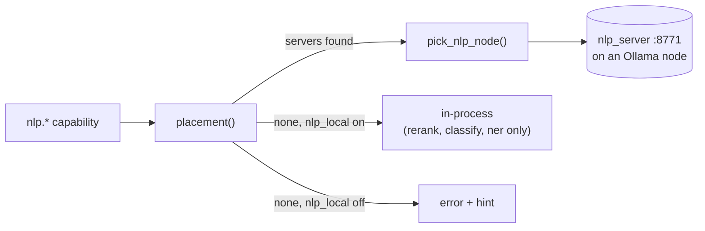

# 30 · ONNX Export & Runtime

Vera uses ONNX Runtime (ORT) in four places: it can turn a **trained ML Workshop module** into a portable `.onnx` artifact and serve it as a capability or from an edge server; it can embed text with a local ORT model (fastembed) instead of Ollama; it runs a family of small **NLP models** (NER, classification, zero-shot, extractive QA, language ID, sentence embeddings, reranking) on compute nodes; and it records models in a provider-neutral **portable model layer** (ModelPackage identity, verification, admission, activation, deployments and inference contracts) that ONNX, Ollama, vLLM and native tensor runtimes share.

Source: the exporter is [`vera/machine learning/ml_onnx.py`](../vera/machine%20learning/ml_onnx.py); the edge servers are [`edge/onnx_runtime.py`](../edge/onnx_runtime.py) and [`edge/nlp_server.py`](../edge/nlp_server.py); NLP capabilities and their node routing are [`vera/research/nlp_capabilities.py`](../vera/research/nlp_capabilities.py), [`nlp_dispatch.py`](../vera/research/nlp_dispatch.py) and [`nlp_dispatch_core.py`](../vera/research/nlp_dispatch_core.py); embeddings are [`vera/fabric/fastembed_provider.py`](../vera/fabric/fastembed_provider.py) and [`embed_provider_capabilities.py`](../vera/fabric/embed_provider_capabilities.py); the portable model layer is the [`vera/models/`](../vera/models/) package.

**Status:** everything here is additive and optional. `onnx`, `onnxruntime`, `optimum`, `transformers` and `fastembed` are guarded imports: when absent, the relevant capabilities report it and the rest of Vera is unaffected. NLP inference runs on compute nodes by design and refuses to run on the Vera host unless explicitly allowed. The portable model layer is non-executing: it records identity, evidence and decisions, and no existing inference call is redirected through it yet.

## Contents

- [1. Why ONNX](#1-why-onnx)
- [2. Source map](#2-source-map)
- [3. Export: ML Workshop module → .onnx](#3-export-ml-workshop-module--onnx)
- [4. ML ONNX capabilities](#4-ml-onnx-capabilities)
  - [Capability identity and artifact authority](#capability-identity-and-artifact-authority)
  - [Verified parity](#verified-parity)
- [5. Artifacts](#5-artifacts)
- [6. Edge ONNX runtime server](#6-edge-onnx-runtime-server)
- [7. ONNX Runtime embeddings (opt-in)](#7-onnx-runtime-embeddings-opt-in)
  - [Embedding backend migration guard](#embedding-backend-migration-guard)
- [8. Off-host NLP routing](#8-off-host-nlp-routing)
  - [Placement: where an nlp call may run](#placement-where-an-nlp-call-may-run)
  - [Node choice](#node-choice)
  - [The NLP node server](#the-nlp-node-server)
- [9. NLP capabilities](#9-nlp-capabilities)
- [10. Portable model layer](#10-portable-model-layer)
  - [ModelPackage identity](#modelpackage-identity)
  - [Durable registry, verification and activation](#durable-registry-verification-and-activation)
  - [Admission](#admission)
  - [Legacy capability bindings](#legacy-capability-bindings)
  - [Import boundary](#import-boundary)
  - [Inference contracts, adapters and dispatch plans](#inference-contracts-adapters-and-dispatch-plans)
  - [Deployed NLP and model inventory](#deployed-nlp-and-model-inventory)
- [11. UI](#11-ui)
- [12. Configuration](#12-configuration)
- [13. Dependencies](#13-dependencies)
- [14. Troubleshooting](#14-troubleshooting)
- [See also](#see-also)
- [Screenshots](#screenshots)
- [Capabilities](#capabilities)

---

## 1. Why ONNX

ONNX Runtime is the standard choice for **fast, portable, low-footprint inference decoupled from the training framework**:

- One `.onnx` file runs anywhere via selectable **execution providers** — `CUDAExecutionProvider` (GPU node), `DmlExecutionProvider` (Windows host / DirectML), `CPUExecutionProvider` (CPU nodes).
- int8-quantisable; far lighter than carrying a full PyTorch install for inference.
- Already present in the stack (`kokoro-onnx` TTS in `edge/GPU_inference.py`).

---

## 2. Source map

| File | Responsibility |
|---|---|
| `vera/machine learning/ml_onnx.py` | `ml.export.onnx`, `ml.onnx.run|verify|list|delete`, per-artifact `ml.onnx.model.<slug>` capabilities |
| `edge/onnx_runtime.py` | Orchestrator-free ORT model server and CLI for `.onnx` artifacts (tensor in, tensor out) |
| `edge/nlp_server.py` | Text-level NLP server on a compute node (port 8771) |
| `edge/nlp_export_models.py` | Pre-exports NLP models into the read-only shared model store |
| `vera/research/nlp_capabilities.py` | `nlp.rerank|classify|ner|zeroshot|qa|langid|embed|models` |
| `vera/research/nlp_dispatch.py` | Node discovery, placement and the HTTP call; `nlp.config.get|set`, `nlp.nodes` |
| `vera/research/nlp_dispatch_core.py` | Pure decisions: placement, node scoring, default model registry, chunking, entity merging |
| `vera/fabric/fastembed_provider.py` | Local ORT embedding backend |
| `vera/fabric/embed_provider_capabilities.py` | `embed.provider.info|check|benchmark` |
| `vera/workers/cluster.py` | Advertises shared artifacts and edge ORT servers in `/cluster` |
| `vera/models/*.py` | Portable model layer (§10) |
| `vera/models/model_inventory_capabilities.py` | `model.inventory` |

---

## 3. Export: ML Workshop module → .onnx

The exporter reproduces the **trained** reference forward — `ml_training._forward_with_weights(module, weights, X)` — not the `ml.run` demo path (which uses throwaway seed-42 weights). Weights are resolved exactly as `ml.train.predict` does: in-memory `_WEIGHTS` → `_load_weights` (Redis/fabric) → fresh `_init_weights`.

It emits the feed-forward subset faithfully and **refuses** anything else rather than shipping a wrong model:

| Supported node types | Refused (for now) |
|---|---|
| `input`, `dense`, `linear_probe`, `mlp`, `activation`, `layer_norm`, `rms_norm`, `dropout`, `add`, `residual`, `concat`, `output` | `rnn`, `gru`, `lstm`, `multi_head_attention`, `transformer_block`, `conv1d/2d`, `embedding`, `pool`, `reshape`, `kan_layer`, … |

Activations (relu, gelu, sigmoid, tanh, swish/silu, softmax, step) are emitted as primitive ops so the result matches the NumPy reference within dtype error. A refused module returns `{"unsupported": [...], "supported": [...]}` and writes nothing.

---

## 4. ML ONNX capabilities

| Capability | Method / path | Purpose |
|---|---|---|
| `ml.export.onnx` | `POST /ml/export/onnx` | Export `module_id` → validated artifact. Params: `dtype` (`float32`\|`float64`), `register_cap` (bool). |
| `ml.onnx.run` | `POST /ml/onnx/run` | Run inference. Params: `artifact`, `X` (JSON list). |
| `ml.onnx.verify` | `POST /ml/onnx/verify` | Numeric parity against the reference forward. Params: `module_id`, optional `X`, `n`, `tol`. |
| `ml.onnx.list` | `GET /ml/onnx/list` | Artifacts and provider availability. |
| `ml.onnx.delete` | `POST /ml/onnx/delete` | Delete an artifact and its capability. |
| `ml.onnx.model.<slug>` | `POST /ml/onnx/model/<slug>` | Auto-registered runner bound to one artifact. |

Each exported model can be promoted to its own `ml.onnx.model.<slug>` capability (MCP / DAG / HTTP callable) without loading torch. These are re-registered from disk at startup so they survive restarts. Execution providers are tried in the order CUDA → DirectML → CPU.

```bash
curl -X POST http://localhost:8999/ml/export/onnx -d '{"module_id":"my_mlp","dtype":"float32","register_cap":true}'
curl -X POST http://localhost:8999/ml/onnx/verify -d '{"module_id":"my_mlp","n":32}'
curl -X POST http://localhost:8999/ml/onnx/run    -d '{"artifact":"my_mlp","X":[[0.1,0.2,0.3]]}'
```

### Capability identity and artifact authority

Both invocation forms remain callable, with different roles. `ml.onnx.run` is the stable executor and accepts an artifact selector; `ml.onnx.model.<slug>` is an artifact-bound compatibility surface restored from the export manifest. New integrations should prefer the stable executor rather than creating another global capability identity for every model.

Artifact identity belongs to the provider-neutral `ModelPackage` registry (§10). Legacy bindings associate both invocation forms with one immutable package without changing execution, so discovery can present models as catalogue data while MCP, DAG and HTTP callers keep working. Removing the dynamic capabilities is not authorised by this: stored definitions, external consumers, runtime calls and inference parity must be measured before any routing or retirement decision.

### Verified parity

Offline against `dense → gelu → layer_norm → dense+softmax`:

| dtype | max abs diff vs reference |
|---|---|
| float32 | ~1.3e-7 |
| float64 | ~4.9e-10 |

---

## 5. Artifacts

Artifacts are written to `ML_ONNX_DIR` (default `<repo>/edge/models/`, on the network share, so the server exports and any edge node serves):

```
edge/models/<slug>.onnx        # the model        (slug = sanitised module_id)
edge/models/<slug>.json        # manifest: dtype, opset, node_types, cap_name, created
edge/models/<slug>.int8.onnx   # optional int8-quantised copy (§6)
```

`ML_ONNX_OPSET` (default 17) and `ML_ONNX_IR_VERSION` (default 10 — older ORT builds reject the IR version newer `onnx` stamps) are environment-overridable.

---

## 6. Edge ONNX runtime server

`edge/onnx_runtime.py` is a small, orchestrator-free ORT model server for edge/CPU nodes. It reads the same `ML_ONNX_DIR` as the exporter.

- **Provider selection** — CUDA → DirectML → CPU, whichever is available.
- **int8 dynamic quantisation** — `quantize_model(slug)` → `<slug>.int8.onnx` (no calibration data; ~4× smaller, faster on CPU).
- **HTTP** — `GET /health`, `GET /models`, `POST /run/{slug}`, `POST /quantize/{slug}`.
- **CLI** — `serve`, `list`, `run`, `quantize`, `bench`.

```bash
python edge/onnx_runtime.py serve --port 8772     # CLI default is 8770 (ONNX_PORT)
python edge/onnx_runtime.py quantize <slug>
python edge/onnx_runtime.py bench    <slug> --n 1000
```

> [!NOTE]
> When deployed with `nodes.provision` (component `onnx_runtime`) it listens on **8772**, because the node agent owns 8770 on every node. Run it by hand on 8770 only where no node agent is installed. This server is tensor-level; text tasks (NER, classification, reranking) are served by the NLP server (§8).

**Cluster advertising:** `obs.cluster` (`GET /cluster`) reports the shared `edge/models/` artifacts and, when `ONNX_RUNTIME_URLS` lists running servers, each server's selected provider and hosted-model count (from its `/health`).

---

## 7. ONNX Runtime embeddings (opt-in)

`ollama_embed()` — the single entry point every embedding goes through ([04 · LLM Cluster §9](./04-ollama-cluster.md#9-embeddings)) — can use a local fastembed (ORT CPU) backend instead of Ollama. It is **off by default**; set `VERA_EMBED_PROVIDER=fastembed` (`cfg.EMBED_PROVIDER`). On any failure it falls through to Ollama.

- Model: `VERA_FASTEMBED_MODEL`, default `nomic-ai/nomic-embed-text-v1.5`.
- A per-call `provider="ollama"` or `provider="fastembed"` overrides the global setting.

> [!WARNING]
> The fastembed model is 768-dimensional like Ollama's `nomic-embed-text`, but the values differ. Re-index before enabling it on a populated vector store.

This local backend is distinct from the routed NLP embedding service: `nlp.embed` sends a batch to a compute node and returns L2-normalised MiniLM vectors (384-dimensional) plus the serving node. Those vectors must not be mixed with either 768-dimensional Nomic space. Select or rebuild a projection by package and embedding-space identity, not by the word "ONNX".

### Embedding backend migration guard

Before switching `VERA_EMBED_PROVIDER` on a populated store:

```
GET  /embed/provider/info       → active backend + fastembed availability
POST /embed/provider/check      {"text": "..."}  → dimension match, cosine, re-index guidance
POST /embed/provider/benchmark  {"n": 20}         → Ollama vs fastembed throughput
```

`embed.provider.check` embeds the same text through both backends (forcing each via the `provider=` override) and reports whether they share a dimensionality and how different the vectors are. To roll out: set `VERA_EMBED_PROVIDER=fastembed`, then re-embed with `memory.reindex_embeddings` (`POST /memory/reindex_embeddings`) — a dry run by default; `confirm=true` re-embeds the Chroma vectors in place (documents and metadata preserved).

---

## 8. Off-host NLP routing

The NLP models are CPU-bound, and the Vera host is a small VM whose event-loop stalls affect the whole system. Every `nlp.*` call is therefore **offered to a compute node first**; the host runs it only if the operator explicitly permits it.



### Placement: where an nlp call may run

`nlp_dispatch.placement()`:

1. **Discover** (cached 20 s): for every node in the Ollama registry, derive `http://<node host>:<VERA_NLP_PORT>` (8771) and call `/health`. Nodes that answer `ok` are candidates, enriched with node-agent facts (runners, memory, GPU) and the node's task inventory. A node that does not answer is simply not a candidate.
2. **Pin.** If `nlp.config` has a `node`, keep only that node.
3. **Decide** (`resolve_placement`):
   - any candidate → `remote`;
   - none and `nlp_local` on → `local` (run in-process);
   - none and `nlp_local` off (the default) → `fail` with a reason naming the switch.
4. For `remote`, **choose** a node (below). The call is POSTed with an `X-Vera-Origin` header and `timeout_s` (120 s); the result carries `node` and `routed` (the reason).

`nlp.zeroshot`, `nlp.qa`, `nlp.langid`, `nlp.embed`, and `nlp.ner` with `task` `gliner` or `spacy` have **no in-process implementation**: they run only on a node, whatever `nlp_local` says. The in-process path for `nlp.ner` truncates at 1024 characters, while the node chunks the whole document (`VERA_NLP_CHUNK_CHARS` 1000, overlap 100) and merges entities.

### Node choice

`pick_nlp_node` ranks candidates by a penalty score — **lower wins**, ties by node id:

```
score = 1.0 × runners on the node                     (compute processes already there)
      + 2.0 × (1 − mem_available / mem_total)          (memory pressure)
      − 0.5 if the node's GPU utilisation ≥ 50 %       (GPU busy ⇒ its CPU cores are free)
```

Load average is deliberately not a term: the reference nodes are containers on one hypervisor, and all of them report the host's load. `nlp.nodes` shows the decision (`where`, `node`, `why`, `candidates`) and the raw discovery; `refresh=true` bypasses the 20 s cache. `nlp.config.set` (`nlp_local`, `node`, `timeout_s`) is stored in Redis `vera:nlp:config`, read per call, and takes effect immediately.

### The NLP node server

`edge/nlp_server.py` is deployed to an Ollama node with `nodes.provision` (component `nlp_server`) and serves `GET /health`, `GET /models`, `POST /ner|classify|zeroshot|qa|langid|embed|rerank`. Models are **pre-exported** into a read-only shared store (`VERA_NLP_MODEL_DIR`, default `/opt/nlp-models`) by `edge/nlp_export_models.py`; the server never converts or downloads at request time (`HF_HUB_OFFLINE=1`) and reports a missing model rather than reaching for the hub. `VERA_NLP_THREADS` (default 4) caps ONNX Runtime/OpenMP threads so NLP does not starve an Ollama runner in the same container. `VERA_NLP_PRELOAD` (`all`, a comma list, or empty for lazy loading) warms models at start; `/health` never loads a model, so a node that is still loading is not mistaken for a dead one.

Default task models (`nlp_dispatch_core.DEFAULT_MODELS`; `VERA_NLP_MODEL_<TASK>` overrides on the node):

| Task | Model | Kind |
|---|---|---|
| `ner` | `djagatiya/ner-roberta-base-ontonotesv5-englishv4` (OntoNotes v5, includes DATE/TIME) | token classification |
| `ner_multi` | `Davlan/xlm-roberta-base-ner-hrl` (PER/ORG/LOC, ten languages) | token classification |
| `classify` | `distilbert-base-uncased-finetuned-sst-2-english` | text classification |
| `sentiment3` | `cardiffnlp/twitter-roberta-base-sentiment-latest` | text classification |
| `zeroshot` | `MoritzLaurer/DeBERTa-v3-base-mnli-fever-anli` | zero-shot classification |
| `qa` | `deepset/roberta-base-squad2` | extractive QA |
| `langid` | `papluca/xlm-roberta-base-language-detection` | text classification |
| `embed` | `sentence-transformers/all-MiniLM-L6-v2` | feature extraction |
| `rerank` | `Xenova/ms-marco-MiniLM-L-6-v2` | fastembed cross-encoder |
| `gliner` | `urchade/gliner_medium-v2.1` (zero-shot NER over the fabric's 37 labels by default) | GLiNER |
| `spacy` | `en_core_web_sm` | spaCy pipeline |

> [!NOTE]
> The NER label vocabulary is OntoNotes (`PERSON`, `ORG`, `GPE`, `DATE`, …), not CoNLL (`PER`, …). Consumers matching on entity labels must use the OntoNotes names.

---

## 9. NLP capabilities

| Capability | Route | Runs | Input → output |
|---|---|---|---|
| `nlp.rerank` | `POST /nlp/rerank` | node, or host if allowed | `query`, `documents` (array or newline-separated), `top_k` → `{ranked:[{index, score, text}]}` |
| `nlp.classify` | `POST /nlp/classify` | node, or host if allowed | `text`, `task` (`classify`\|`sentiment3`) → `{top, labels:[{label, score}]}` |
| `nlp.ner` | `POST /nlp/ner` | node, or host if allowed (`ner` only) | `text`, `task` (`ner`\|`ner_multi`\|`gliner`\|`spacy`), `labels`, `threshold` (0.4) → `{entities:[{entity, word, score, start, end}], model, node}` |
| `nlp.zeroshot` | `POST /nlp/zeroshot` | node only | `text`, `labels`, `multi_label` → `{top, labels}` |
| `nlp.qa` | `POST /nlp/qa` | node only | `question`, `context` → `{answer, score, start, end}` |
| `nlp.langid` | `POST /nlp/langid` | node only | `text` → `{lang, langs:[{lang, score}]}` |
| `nlp.embed` | `POST /nlp/embed` | node only | `texts` → `{embeddings, dim, count}` |
| `nlp.models` | `GET /nlp/models` | — | Availability (host or via a node), model names, `placement`, ORT providers, and `model_package_inventory` |
| `nlp.nodes` | `GET /nlp/nodes` | — | Which nodes serve NLP and which would win, and why |
| `nlp.config.get` / `nlp.config.set` | `GET /nlp/config`, `POST /nlp/config/set` | — | `nlp_local` (default false), `node` pin, `timeout_s` |

```bash
curl -X POST http://localhost:8999/nlp/zeroshot -H 'Content-Type: application/json' \
  -d '{"text":"The invoice is overdue by 30 days.","labels":["billing","shipping","support"]}'
```

Research retrieval can use `nlp.rerank` as an **opt-in** step: with `VERA_RERANK_ENABLED=1` the merged citation pool is re-ordered by query relevance before the context is built (off by default; any failure leaves source order unchanged). Other consumers include the fabric's entity extraction (`nlp.ner`), the DAG workshop (`nlp.ner`, `nlp.zeroshot`) and research assessment (`nlp.langid`). Host-side model choices for the in-process path are `VERA_RERANK_MODEL`, `VERA_SENTIMENT_MODEL` and `VERA_NER_MODEL`.

---

## 10. Portable model layer

The `vera/models/` package defines provider-neutral, mostly non-executing contracts for the whole model lifecycle. ONNX was its first consumer; Ollama, OpenAI-compatible (vLLM) and native tensor runtimes have adapters too.

| Module | Role |
|---|---|
| `model_package.py` | Immutable `ModelPackage` identity and in-memory registration |
| `model_package_store.py` | `SQLiteModelPackageRegistry` (durable packages, aliases, activation/rollback receipts, admission receipts, legacy bindings) and `verify_local_artifact` |
| `admission.py` | `evaluate_model_admission` against a deployment target and trust policy |
| `legacy_binding.py` | Bindings from legacy capability identities to packages |
| `onnx_import.py` | Inspect-only ONNX registration (`inspect_and_register_onnx`) |
| `inference_contracts.py` | `InferenceRequest`, `InferenceEvent`, `InferenceProvider` contracts and the shared stream consumer |
| `inference_registry.py` | Provider discovery and explicit resolution |
| `inference_deployment.py` | `SQLiteInferenceDeploymentRegistry`: deployment lifecycle records and observations |
| `inference_health.py` | Bounded, externally observed health evidence |
| `inference_dispatch.py` | `plan_inference_dispatch`: validate one explicit route; never choose, execute, retry or fail over |
| `inference_conformance.py` | Offline conformance checks for inference transcripts |
| `onnx_inference_adapter.py`, `legacy_prediction_adapter.py`, `ml_workshop_inference_adapter.py` | Legacy ONNX / ML Workshop prediction adapters |
| `ollama_inference_adapter.py`, `openai_inference_adapter.py`, `native_tensor_inference_adapter.py`, `native_tensor_runtime.py` | Runtime adapters (see [04](./04-ollama-cluster.md#17-portable-inference-compatibility), [21](./21-vllm.md#14-portable-inference-boundary)) |
| `live_inference_validation.py` | Opt-in, bounded live validation of shipped adapters (reports exclude prompts and outputs) |
| `training_contracts.py`, `ml_workshop_training_adapter.py`, `ml_workshop_runtime_bridge.py`, `optimizer_contracts.py` | Training, evaluation and prompt-optimisation contracts and the ML Workshop bridge |
| `evaluation_evidence.py`, `evaluation_execution.py`, `deterministic_evaluation.py`, `external_evaluation_import.py` | Evaluation evidence contracts |
| `nlp_inventory.py`, `model_inventory.py`, `model_inventory_capabilities.py` | Read-only inventory projections and `model.inventory` |

### ModelPackage identity

`vera.models.model_package` is an offline, provider-neutral identity contract. A package pins architecture and format; role-addressed artifact URIs with SHA-256 and size; tokenizer and preprocessing; framework and optional opset; source, licence, signature, training/evaluation lineage; hardware requirements; and typed task/input/output compatibility. Canonical ordering produces a stable `mpkg_…` identity. The in-memory registry is immutable and idempotent, aliases use compare-and-set semantics, and registering a URI never opens, moves, deletes, verifies or activates its file.

### Durable registry, verification and activation

`SQLiteModelPackageRegistry` keeps canonical package JSON and aliases in transactional tables. Package content is revalidated and its identity recomputed on every read, so malformed or forged stored state fails visibly. Alias changes are compare-and-set operations.

`verify_local_artifact` produces a read-only receipt for an explicit local path or `file:` URI. It checks the size ceiling, expected size and streamed SHA-256 with cancellation, and reports missing, unsupported, oversized, size-mismatched, hash-mismatched or verified state. Verification never imports, moves, deletes, activates or executes the artifact. Signature trust policy and durable receipt history are not implemented.

`activate` is the audited control-plane operation for changing a serving alias. It requires the expected current package and a caller-supplied idempotency ID, then moves the alias and appends a `ModelActivationReceipt` in one immediate SQLite transaction. Competing stale requests fail without a partial history entry. `rollback` names the exact activation receipt to reverse and succeeds only while the alias still points to that activation's target; retrying the same rollback is idempotent, while a second or stale rollback is refused. Reopening preserves ordered history. Activation changes registry identity only: it does not load a model, inspect artifact files, create an ORT session or claim inference parity. The older low-level `alias` method remains for compatibility but produces no activation history.

### Admission

Before an audited alias activation, `evaluate_model_admission` compares the package against an explicit `ModelDeploymentTarget` and `ModelTrustPolicy`. It classifies task and input/output contract mismatches, insufficient declared memory, missing accelerators, unsupported framework/opset, and missing or untrusted signature identifiers. The stable receipt contains package, policy, target and reason identities, not model data.

`activate_admitted` recomputes this receipt from the immutable stored package rather than accepting a caller's assertion. An accepted receipt and alias activation commit in one transaction and remain queryable by operation or in activation order; rejected or corrupt evidence leaves no alias or activation entry. This is a declarative gate: target facts are not hardware probes, and trusted signature identifiers are policy input rather than cryptographic signature verification.

### Legacy capability bindings

`legacy_onnx_bindings` describes both the selector-based `ml.onnx.run#<slug>` identity and the dynamic `ml.onnx.model.<slug>` capability. `bind_legacy_capabilities` verifies that the target package is registered and writes the pair transactionally with compare-and-set protection, so a conflict cannot leave a half-migrated pair. Bindings keep their manifest-source provenance, survive reopen, and are queryable independently of execution. They are a discovery and migration bridge, not runtime delegation: the legacy capabilities do not consult them, and redirecting traffic requires identical legacy/package inference evidence.

### Import boundary

`inspect_and_register_onnx` (`vera/models/onnx_import.py`) registers an existing ONNX artifact by reference. It requires an immutable `ModelPackage` with exactly one `model` artifact whose path ends in `.onnx`, and hashes every declared artifact under an explicit size limit before writing the package. It does not import ONNX libraries, parse a graph, create a session, activate an alias, or move, delete, rewrite or execute the source file. A failed, cancelled, missing, changed or oversized artifact returns a verification-failed receipt and performs no registry write.

### Inference contracts, adapters and dispatch plans

`vera.models.inference_contracts` adds the portable execution seam without redirecting an existing call. Every request names an immutable ModelPackage, task, input/output contracts, canonical bounded inputs and scalar parameters, streaming intent and an output-byte ceiling. Large or binary values travel as URI, SHA-256, size and media-type artifact references. Request identity is derived from the complete canonical request.

An `InferenceProvider` emits a contiguous asynchronous event stream tied to the request, package and provider identities. The shared consumer validates provider task claims, event order, exactly one terminal outcome, output budgets, bounded usage counters and cancellation. It does not retry, interpret payloads, load artifacts or choose a provider.

The legacy ONNX adapter binds exactly one ONNX ModelPackage and legacy artifact identity to that contract. It accepts only the package's declared task and contracts, one inline JSON `X` input, no portable parameters, and non-streaming execution. The legacy runner is injected, so importing it does not import ONNX Runtime or load a model. Successful `{predictions, shape, provider}` results become one bounded portable output and a terminal event; malformed responses and backend failures become stable error codes, and cancellation remains cancellation. Request and result validation is shared with ML Workshop batch inference through `legacy_prediction_adapter.py`. `ml.onnx.run` and the dynamic capabilities do not route through this adapter yet.

`plan_inference_dispatch(request, provider_id, deployment_id, as_of_ms, policy, providers, deployments)` validates one *explicitly named* route. It refuses when the deployment is unregistered, belongs to another provider or package, the provider is not eligible for the request and placement, the deployment is not `active`/`ready`, health evidence is absent, stale or mismatched between provider and deployment, no slot is available (when `require_available_slot`), or the queue is deeper than `max_queue_depth`. The returned plan records a bounded retry limit (0–3) and the retry owner. It never chooses among providers, executes, retries or fails over; selection stays with the caller.

### Deployed NLP and model inventory

NLP nodes publish a task-shaped inventory in their `/health` (`tasks: {task: {model, present, loaded, model_package?}}`), which discovery keeps intact when it enters placement. `nlp.models` projects those deployments through `nlp_inventory.project_nlp_inventory`: a content-verified export manifest supplies a strict `ModelPackage` (artifact relative store URIs, SHA-256 and size, task contracts, ORT provenance), and identical packages from several nodes are de-duplicated by `package_id`. Older deployments stay visible as unresolved candidates with the nodes on which they are present or loaded, marked `missing_content_verified_manifest`; they are never promoted from a model name into a package. Re-running the export process creates the richer manifest without changing request-time behaviour. Discovery never loads, downloads, executes, activates or hashes artifacts.

`model.inventory` (`GET /models/inventory`) joins registered packages, aliases, admission receipts, deployments, current observations and source-owned candidates into one read-only projection. It validates package schemas and exposes dangling or conflicting references instead of inventing identities. The package and deployment registries live under the state directory (`models/packages.sqlite3`, `models/deployments.sqlite3`), overridable with `VERA_MODEL_PACKAGE_DB` and `VERA_INFERENCE_DEPLOYMENT_DB`. It understands embedding, NER, classification, zero-shot, QA, language-identification and reranking deployments.

---

## 11. UI

- **ML Workshop** ([`ml_workshop_panel.html`](../vera/machine%20learning/ml_workshop_panel.html)): a **⬇ ONNX** toolbar button and an **ONNX** right-tab to export the current module, browse artifacts, and one-click **Verify** (shows `max|Δ|`, pass/fail and provider) or **Delete**.
- **NLP panel › Models**: a read view backed by the portable inventory. It distinguishes content-verified ModelPackages from unresolved node candidates, shows placement evidence and blockers, and reports whether the package registry, deployment registry and NLP discovery sources are available. Viewing it does not warm or execute any model.
- **Estate › Models & NLP**: NLP placement (`nlp_local`, node pin) beside the warm-slot and routing controls.

---

## 12. Configuration

| Variable | Default | Where | Purpose |
|---|---|---|---|
| `ML_ONNX_DIR` | `<repo>/edge/models` | orchestrator, edge | Artifact directory |
| `ML_ONNX_OPSET` / `ML_ONNX_IR_VERSION` | `17` / `10` | orchestrator | Export opset and IR version |
| `ONNX_PORT` / `ONNX_HOST` | `8770` / `0.0.0.0` | edge | `onnx_runtime.py serve` defaults |
| `ONNX_RUNTIME_URLS` | empty | orchestrator | Edge ORT servers advertised in `/cluster` |
| `VERA_EMBED_PROVIDER` | `ollama` | orchestrator | `fastembed` to embed locally |
| `VERA_FASTEMBED_MODEL` | `nomic-ai/nomic-embed-text-v1.5` | orchestrator | fastembed model |
| `VERA_NLP_PORT` | `8771` | both | NLP server port |
| `VERA_NLP_THREADS` | `4` | node | ORT/OpenMP thread cap |
| `VERA_NLP_MODEL_DIR` | `/opt/nlp-models` | node | Read-only model store |
| `VERA_NLP_MODEL_<TASK>` | see §8 | node | Per-task model override |
| `VERA_NLP_PRELOAD` | empty | node | `all` or a comma list to preload |
| `VERA_NLP_CHUNK_CHARS` / `VERA_NLP_CHUNK_OVERLAP` | `1000` / `100` | node | NER chunking |
| `VERA_RERANK_MODEL` | `Xenova/ms-marco-MiniLM-L-6-v2` | orchestrator | In-process reranker |
| `VERA_SENTIMENT_MODEL` | `distilbert-base-uncased-finetuned-sst-2-english` | orchestrator | In-process classifier |
| `VERA_NER_MODEL` | `djagatiya/ner-roberta-base-ontonotesv5-englishv4` | orchestrator | In-process NER |
| `VERA_RERANK_ENABLED` | `0` | orchestrator | Rerank research citations |
| `VERA_MODEL_PACKAGE_DB` / `VERA_INFERENCE_DEPLOYMENT_DB` | state dir | orchestrator | Portable registries |

Runtime NLP placement (`nlp_local`, `node`, `timeout_s`) is not an environment variable; it lives in Redis (`vera:nlp:config`) and is changed with `nlp.config.set`.

---

## 13. Dependencies

```
onnx>=1.16            # graph builder for ml.export.onnx
onnxruntime>=1.18     # inference engine (CPU)
# onnxruntime-gpu          — on the CUDA GPU node (instead of onnxruntime)
# onnxruntime-directml     — on a Windows host (DirectML EP)
# fastembed>=0.3           — §7 embeddings and the reranker (downloads weights on first use)
# optimum[onnxruntime], transformers — NLP server and the in-process classify/NER path
```

The `ml.*onnx*` capabilities need `onnx`/`onnxruntime` on the **orchestrator host**; the edge runtime needs them on the **edge node**; the NLP server's dependencies are installed by its provisioning component. `optimum[onnxruntime]` pulls torch as a hard dependency, so pre-exporting removes conversion and network access at request time but does not shrink the install.

---

## 14. Troubleshooting

| Symptom | Cause / fix |
|---|---|
| `nlp.* … no NLP node available` | No node answers `/health` on 8771 and `nlp_local` is off. Deploy the `nlp_server` component (`nodes.provision`) or set `nlp.config.set nlp_local=true` (rerank/classify/ner only). |
| `nlp.qa runs only on a node` | These tasks have no in-process path; deploy the NLP server. |
| A task reports `missing` on a node | The model is not in the read-only store; run `edge/nlp_export_models.py` where the store is writable. |
| Entities lack `PER` | The NER model uses OntoNotes labels (`PERSON`). |
| `ml.export.onnx` returns `unsupported` | The module uses a node type outside the supported feed-forward subset. |
| ORT rejects the model's IR version | Lower `ML_ONNX_IR_VERSION` for older runtimes. |
| Search quality drops after enabling fastembed | Mixed vector spaces; run `memory.reindex_embeddings confirm=true`. |
| `onnx_runtime.py` fails to bind 8770 | The node agent owns it; use 8772. |

---

## See also

- [Machine Learning](./16-machine-learning.md) — the ML Workshop / training engine these export from
- [LLM Cluster](./04-ollama-cluster.md) — the embedding hot path (`ollama_embed`) and the Ollama inference adapter
- [vLLM Backend](./21-vllm.md) — the OpenAI-compatible inference adapter
- [Research System](./07-research.md) — `nlp.rerank` in retrieval
- [Data Fabric](./06-data-fabric.md) — entity extraction with `nlp.ner`
- [Infrastructure Provisioning](./35-infrastructure-provisioning.md) — deploying `nlp_server` and `onnx_runtime` components
- [Capability Framework](./01-capability-framework.md) — the `@capability` pattern these follow

## Screenshots

<!-- VERA:AUTO:screenshots START -->
_No screenshots captured yet — run `docs.build` (or `operator.mission.run documentation`)._
<!-- VERA:AUTO:screenshots END -->

## Capabilities

<!-- VERA:AUTO:capabilities START -->
_No capabilities resolved for this domain._
<!-- VERA:AUTO:capabilities END -->
