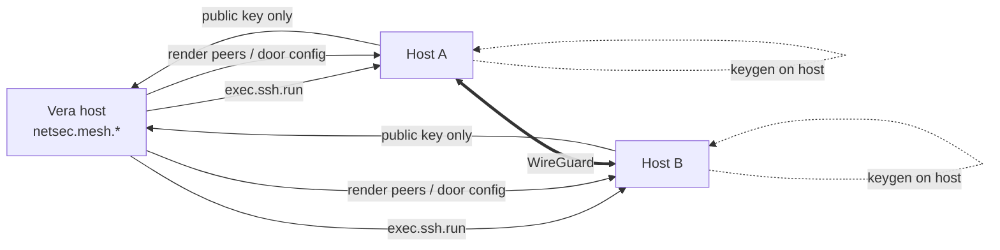

# 32 · Cluster E2E Encryption

Vera can put the Proxmox nodes, their guests and the Docker hosts on an
**encrypted overlay mesh**, so that control-plane and data connections ride a
private WireGuard network instead of the plain LAN. Membership is
enrolment-aware: a host's step-ca enrolment is checked, recorded and, once
`enforce` is on, required. All work on a host runs over the canonical execution
SSH store (`exec.ssh.run`), so any machine Vera can already reach can be pulled
onto the mesh with one call.

The mesh lives in `vera/networking/netsec_capabilities.py` (`netsec.mesh.*`).
Its pure script and config builders are in `vera/networking/netsec_core.py`, and
the panel is `/netsec/panel` (Trust → **Mesh** sub-tab). It builds on pieces that
already exist:

- the security backing services (`provisioning/security_provision_capabilities.py`)
- the Enroll flow (`provisioning/enroll_capabilities.py`: step-ca trust, the SSH
  user CA and certificate-only logins)
- the secrets service, which holds the netctl door token ([29](./29-security.md))
- the netgraph and netmap capabilities, which map the overlay into the network graph

**Status.**

| Area | State |
|---|---|
| Overlay (phase 1) | **Built.** Three pluggable providers ship: `netctl` (the default; joins the estate's existing WireGuard door), `wireguard` (Vera as the coordinator) and `nebula` (experimental; certificates are minted but the on-host config push is not wired). |
| Subnet gateways and node self-enrolment | Built. |
| Per-service enforcement (phase 2) | Designed, not built. |
| Policy and key rotation (phase 3) | Designed, not built. |

## Contents

- [1. Concepts](#1-concepts)
- [2. Providers](#2-providers)
  - [2.1 netctl door (default)](#21-netctl-door-default)
  - [2.2 WireGuard (Vera-coordinated)](#22-wireguard-vera-coordinated)
  - [2.3 Nebula (experimental)](#23-nebula-experimental)
  - [2.4 Adding a provider](#24-adding-a-provider)
- [3. Capability reference](#3-capability-reference)
- [4. Joining, syncing and leaving](#4-joining-syncing-and-leaving)
- [5. Gateways and self-enrolment](#5-gateways-and-self-enrolment)
- [6. Configuration and storage](#6-configuration-and-storage)
- [7. Events](#7-events)
- [8. Design goals and approach](#8-design-goals-and-approach)
- [9. Backend choice](#9-backend-choice)
- [10. Rollout phases](#10-rollout-phases)
- [11. Trust establishment and rotation](#11-trust-establishment-and-rotation)
- [12. Troubleshooting](#12-troubleshooting)
- [13. Non-goals and notes](#13-non-goals-and-notes)
- [Related pages](#related-pages)

---

## 1. Concepts

| Term | Meaning |
|---|---|
| **Member** | A host on the mesh, keyed by its exec-store `host_id`. It has an overlay `ip`, a `pubkey`, an `endpoint`, a `state` (`identity`, `up`, `error` or `self-enrolled`) and an `enrolled` flag. |
| **Candidate** | A machine with an SSH login that is not yet a member. Candidates come from `estate.machines`, falling back to the SSH store alone. |
| **Enrolled** | The host's address appears in the enrol store (`vera:provisioning:ssh_hosts`) with `auth = cert`, meaning it holds a step-ca identity. |
| **Enforce** | When on, `netsec.mesh.join` refuses non-enrolled hosts. It is off by default (tolerant). |
| **Provider** | The transport backend behind the `MeshProvider` interface. |
| **Gateway** | A member that advertises LAN subnets to the rest of the mesh and forwards and masquerades traffic for them. |

The invariant every provider keeps is this: **private keys are generated on the
device and never leave it.** Vera only ever handles public keys. The config
written to a host reads the private key with `$(cat /etc/wireguard/<iface>.key)`
*on the host*, inside an unquoted heredoc.

---

## 2. Providers

`netsec.mesh.providers` lists the providers. Each entry has a `name`, `label`,
`description` and an `experimental` flag.

| Name | Label | Who allocates overlay IPs | Status |
|---|---|---|---|
| `netctl` | netctl door | The door | **Default**, working |
| `wireguard` | WireGuard | Vera, from `subnet` | Working |
| `nebula` | Nebula (experimental) | Vera, from `subnet` | Certificates only |

### 2.1 netctl door (default)

The estate already has one WireGuard door, netctl. It owns the server key, the
endpoint, the DuckDNS name and the router forward. Rather than run a second
control plane beside it, Vera's machines join the door as devices on a `vera`
profile:

- A `vera` device reaches Vera and the other machines Vera manages.
- Vera may open connections back to it.
- Nothing else on the estate answers it.
- Every other profile keeps the opposite guarantees: a phone is not reachable,
  and devices cannot see each other.

How it works:

- **Install and keygen are inherited** from the WireGuard provider. The key pair
  is made on the host, and only the public half is sent to the door.
- **Door API.** Vera calls `GET /api/door/peers`, `POST /api/door/peer` and
  `POST /api/door/peer/delete/<name>` on `door_url`, with the header
  `X-Netctl-Door: <token>`.
- **The token is held in the secrets service** at the named path in `door_secret`
  (default `netctl/door-vera`). It is never stored in the mesh config. It can only
  add, list and revoke `vera`-profile devices.
  - If it is missing, join fails with *"the secrets service holds no netctl door
    token … issue one on the door node: `door.py issue <name> vera`"*.
- **Rekeying.** If the door already lists the device with an older public key, the
  device is deleted and re-added.
- **Addressing.** The door allocates the address, and the member record follows it.
  `apply` ignores the peer set, because at a door every member has exactly one peer:
  the door.
- **Bring-up can be slow.** `systemctl enable --now` on a fresh install can take
  minutes. If the SSH channel gives up first, the interface is probed directly
  before an error is reported.
- **Teardown** removes the interface and deletes the door device. If the door
  still lists the device afterwards, a `warning` is returned.

`netsec.mesh.members` on this provider also reports what the door sees live for
each member: `connected`, `last_handshake_s` and `door_device`. It also reports
the door itself: `up`, `endpoint`, `cidr` and the device count. A member Vera
remembers but the door does not is flagged `door_missing`.

### 2.2 WireGuard (Vera-coordinated)

In-kernel WireGuard with Vera as the coordinator.

- **Install.** A package-manager-agnostic script (`wireguard_install_script()`)
  supports apt, dnf/yum, zypper, pacman, apk and opkg. It waits for cloud-init and
  the apt lock to finish.
- **Identity.** `umask 077; wg genkey | tee /etc/wireguard/<iface>.key | wg pubkey`.
  An existing key is reused.
- **Apply.** It renders `/etc/wireguard/<iface>.conf` with `Address = <ip>/32`,
  `ListenPort` and one `[Peer]` block per other member (`AllowedIPs` includes the
  routes a gateway advertises, and `PersistentKeepalive = 25`). It then
  **hot-reloads** with `wg-quick strip` + `wg syncconf` when the interface exists,
  otherwise brings it up with `systemctl enable --now wg-quick@<iface>`, falling
  back to `wg-quick up`.
- **Status.** `wg show <iface> dump`.
- **Root.** Every script runs under one root shell, either directly as root or
  through passwordless `sudo -n`. A host with neither reports an actionable
  *"needs root"* error.

### 2.3 Nebula (experimental)

Nebula is a certificate-based mesh with a built-in host firewall (security groups).

- Vera keeps a **Nebula CA** on the Vera host in `~/.vera/nebula`, created once
  with `nebula-cert ca -name "Vera Mesh CA"`.
- It signs one host certificate per member (`-groups vera`).
- `ensure_installed` only checks that the `nebula` binary is present. It does
  not download it.
- `apply` deliberately **returns an error**: *"nebula apply not wired — certs
  are minted locally; on-host config push is the remaining step"*. This stops an
  operator believing traffic is encrypted when it is not.
- Use `netctl` or `wireguard` for a working mesh.

### 2.4 Adding a provider

Implement `MeshProvider`:

- `ensure_installed`
- `gen_identity` (return only `pubkey`)
- `apply(host_id, cfg, member, peers)`
- `status`
- `teardown`

Set `assigns_addresses = True` if the provider's own control plane hands out
overlay addresses. Then register the provider in `_PROVIDERS`. Adding a backend
is a class, not a rewrite.

---

## 3. Capability reference

| Capability | Route | Purpose / inputs |
|---|---|---|
| `netsec.mesh.providers` | `GET /netsec/mesh/providers` | Installed providers and the active one. |
| `netsec.mesh.config` | `GET /netsec/mesh/config` | Provider, subnet, `listen_port`, `iface`, `enforce`, door settings, `member_count`. |
| `netsec.mesh.config.save` | `POST /netsec/mesh/config/save` | `provider`, `subnet` (CIDR), `listen_port`, `iface`, `enforce`. Changing the provider or subnet while members exist is **refused**; make them leave first. |
| `netsec.mesh.candidates` | `GET /netsec/mesh/candidates` | Machines with an SSH login that are not yet members: kind, state, address, entity `ref` (`guest:<vmid>` / `host:<id>`), `enrolled`, `auth`. `source` is `estate.machines` or `exec.ssh.hosts`. |
| `netsec.mesh.members` | `GET /netsec/mesh/members` | Members with overlay IP, enrolment flag and last state, plus live door data on the netctl provider. |
| `netsec.mesh.join` | `POST /netsec/mesh/join` | `host_id`! (an exec SSH host), `endpoint` (overrides the `host:port` peers dial; default `<host>:<listen_port>`). Install → keygen on host → allocate IP → register → resync everyone. |
| `netsec.mesh.sync` | `POST /netsec/mesh/sync` | Re-render and hot-reload the peer set. `host_id` limits it to one member. Then re-maps the overlay into the network graph (`netmap.mesh.ingest`, best-effort). |
| `netsec.mesh.status` | `GET /netsec/mesh/status` | Live per-member state: interface up, peers, peers handshaken within 180 s, rx/tx, last error. An enrolled member that has never handshaken is a warning, not a failure. |
| `netsec.mesh.leave` | `POST /netsec/mesh/leave` | `host_id`!. Tear down on the host, drop the member, resync the rest. |
| `netsec.mesh.gateway` | `POST /netsec/mesh/gateway` | `host_id`! (a member), `routes` (list of CIDRs; `[]` clears the gateway role). See §5. |
| `netsec.mesh.enroll_token` | `POST /netsec/mesh/enroll_token` | Get, set (`token`) or mint (`generate=true`) the shared self-enrol token. A token is minted if none exists. |
| `netsec.mesh.enroll` | `POST /netsec/mesh/enroll` | Node-initiated self-enrolment. `pubkey`!, `token`!, `host`, `label`, `endpoint`. Returns the node's WireGuard config. |

`netsec.policy.apply` does not exist yet. It is planned for phase 3 (§10).

---

## 4. Joining, syncing and leaving

`netsec.mesh.join(host_id)`:

1. It resolves the exec SSH host and looks up its address in the enrol store.
2. If the host is **not enrolled and `enforce` is on**, it refuses: *"enrol it first
   (Provision → Enroll) or turn enforce off"*.
3. It creates or reuses the member record. The overlay IP is the next free address
   in `subnet`, skipping `.0` and `.255`. A door provider leaves the IP blank and
   fills it in during `apply`.
4. It runs `ensure_installed` and then `gen_identity` (public key only), and
   persists the member with `state = identity`.
5. It runs `_sync_all`, which applies the config on **every** member, so they all
   learn the new peer. This is tolerant: one member failing does not stop the
   rest. Each member's `state` becomes `up` or `error`, and `last_error` is recorded.
6. It emits `netsec.mesh.joined`. A non-enrolled join returns a `warning`:
   *"traffic is encrypted, but this device has no step-ca identity"*.

`netsec.mesh.leave` tears the interface down (on the netctl provider it also
deletes the door device), removes the member and resyncs the rest.

---

## 5. Gateways and self-enrolment

**Gateways.** `netsec.mesh.gateway(host_id, routes=[…])` makes a member advertise
LAN subnets to the mesh:

- Other members add those routes to the gateway peer's `AllowedIPs`.
- The gateway enables `ip_forward` and masquerade for mesh traffic. This is
  applied over SSH immediately and persisted as `PostUp`/`PostDown` in the
  WireGuard config.
- Routes that contain a member's own LAN address are filtered out for that
  member, so it never routes its own LAN through the tunnel.

Mesh nodes can then reach a whole LAN through one on-LAN member, without
putting every service host on the mesh.

**Self-enrolment** lets a node join without Vera having SSH access to it:

1. Mint a token with `netsec.mesh.enroll_token generate=true`.
2. On the node, run `wg genkey | wg pubkey` and POST the **public** key and the
   token to `netsec.mesh.enroll`.
3. Vera allocates an IP, registers the peer as `state = self-enrolled`, resyncs
   the mesh and returns a ready `[Interface]`/`[Peer]` config for the node to
   bring up.

The node's private key never leaves it.

> [!WARNING]
> - `netsec.mesh.enroll_token` returns the token in clear text, and the API has
>   no authentication of its own ([29](./29-security.md#7-api-access-boundaries)).
>   Anyone holding the token can add a peer.
> - Self-enrolled members are recorded `enrolled = false`, and **`enforce` does not
>   gate self-enrolment**.
> - Rotate the token with `generate=true` after use, or set it to a fresh value
>   to retire the old one.

---

## 6. Configuration and storage

The configuration is a JSON document in Redis hash `vera:netsec:mesh`, field
`main`. Members are stored inside it.

| Field | Default | Notes |
|---|---|---|
| `provider` | `netctl` | `netctl`, `wireguard` or `nebula`. |
| `subnet` | `10.88.0.0/16` | Used by self-hosted providers only; the door allocates its own addresses. |
| `listen_port` | `51820` | WireGuard listen port. |
| `iface` | `vera0` | Interface name; files are `/etc/wireguard/<iface>.{key,pub,conf}`. |
| `door_url` | the netctl node on the LAN | The netctl door API base. |
| `door_secret` | `netctl/door-vera` | Named-secret path of the door token in the secrets service. |
| `enroll_token` | `""` | Shared self-enrol token. Empty means self-enrolment is disabled. |
| `enforce` | `false` | Refuse non-enrolled hosts in `join`. |
| `members` | `{}` | `host_id` → member record. |

Enrolment is cross-referenced **by IP** against the enrol store
`vera:provisioning:ssh_hosts`, because the execution and enrol SSH stores have not
yet converged. The Nebula CA and host certificates live in `~/.vera/nebula` on
the Vera host.

---

## 7. Events

| Event | Fields |
|---|---|
| `netsec.mesh.joined` | `host_id`, `ip`, `provider`, `enrolled` |
| `netsec.mesh.left` | `host_id` |
| `netsec.mesh.gateway` | `host_id`, `routes` |
| `netsec.mesh.enrolled` | `host_id`, `ip` (self-enrolment) |

---

## 8. Design goals and approach

The goals are:

1. Every Vera control-plane and data connection (Redis, Postgres, Neo4j,
   Chroma, Garage, Ollama, worker RPC) can run over an encrypted overlay.
2. Only **authenticated, enrolled** devices participate. Enrolment (a step-ca
   certificate) is the admission ticket.
3. **Tolerant first.** The overlay is additive. Nothing breaks the day it goes
   in, and existing LAN paths keep working until enforcement is deliberately
   switched on, per service.
4. SSH stops being password-bootstrapped. After enrolment, Vera connects with its
   step-ca-minted SSH certificate only. This part already works: Enroll panel →
   "Vera SSH identity" → Mint.

The approach is a WireGuard overlay with Vera as the coordination plane, or
joined to the estate's existing door:

- WireGuard is in-kernel on PVE nodes and Debian guests. LXC guests only need the
  host module. Docker hosts run it on the host, and containers ride host routing.
  No third-party coordination server is needed.
- Vera already has everything a coordinator needs: root SSH to every node (the
  exec store), `pct exec` into containers, a Redis registry, and an enrolment
  authority (step-ca).
- step-ca stays the single identity root for TLS and SSH certificates. WireGuard
  keys are *transport* keys, bound to an enrolment record.

---

## 9. Backend choice

The default is the estate's **netctl door**, so that only one WireGuard control
plane runs. Where there is no netctl, **raw WireGuard coordinated by Vera** works
without an external control server and without duplicating the identity root.

**Nebula** is the strongest alternative and ships as a selectable provider. Its
built-in host firewall (security groups) is the reason to prefer it once per-edge
policy matters (phase 3), but it introduces a second CA.

NetBird and Headscale (self-hosted Tailscale) were considered, but add a heavier
control plane to run; they could be added as providers later. Hosted Tailscale
and hosted ZeroTier were rejected because they depend on a third-party
coordinator.

---

## 10. Rollout phases

- **Phase 0 (done in the panels).** Deploy OpenBao, step-ca, lldap and OPA from
  Provision → Security. Enrol guests, mint Vera's SSH certificate, and flip host
  records to `auth=cert`.
- **Phase 1: overlay, tolerant (built).** Join nodes and hosts to the mesh. All
  services still listen on the LAN. A dead overlay link should fall back to the
  LAN address: log it, don't fail it.
- **Phase 2: enforcement, per service (designed).**
  - Rebind sensitive services (Redis, Postgres, Neo4j, Garage admin) to the overlay IP.
  - Publish Docker ports on the WireGuard address instead of `0.0.0.0`.
  - The PVE firewall drops LAN ingress to those ports.
  - Do this one service at a time, with a revert switch.
- **Phase 3: policy and rotation (designed).**
  - OPA decides peer↔peer edges, rendered into WireGuard `AllowedIPs` and
    nftables through `netgraph.edge.allow/deny`.
  - WireGuard keys rotate on re-enrolment.
  - Revoking an enrolment removes the peer within one `mesh.sync`.

---

## 11. Trust establishment and rotation

Cluster encryption protects traffic between Vera components. It does not decide
which component is authorized to perform an action
([29](./29-security.md#8-capability-policy-and-enforcement)). Establish node
identity, distribute trust material through a secure out-of-band path, verify
the peer, and only then enable encrypted transport for production traffic.

Plan rotation before expiry. During a staged rotation, nodes need either a
deliberate overlap in accepted trust roots or a coordinated cutover; otherwise
healthy services appear offline at the same moment.

- Record certificate and key identity, not private key material, in diagnostics.
- The most common failures are clock skew, hostname/SAN mismatch, incorrect file
  permissions, and containers missing the updated mount.
- Encryption errors should fail closed and surface the exact peer and
  verification stage. Do not silently downgrade to plaintext.
- After rotation, test health, worker dispatch, Redis and database connectivity
  where TLS applies, and one real capability round trip, before retiring the old
  trust material.

---

## 12. Troubleshooting

| Symptom | Cause / fix |
|---|---|
| *"keygen needs root"* / *"bring-up needs root"* | The SSH user is not root and passwordless sudo is unavailable. Grant `NOPASSWD` sudo, enrol the host as root, or pre-provision `/etc/wireguard`. |
| *"exec.ssh.run unavailable"* | The execution module is not loaded; the mesh has no way to reach hosts. |
| *"the secrets service holds no netctl door token"* | Issue a `vera`-profile token on the door node and store it with `secrets.put path=netctl/door-vera` ([29](./29-security.md#41-named-secrets)). |
| *"netctl refused the door token"* | The token was revoked or is for another profile. Re-issue it. |
| *"the door did not say how to reach it"* | The door has no server key or endpoint; check its DuckDNS name. |
| *"cannot switch provider while members exist"* | Make every member leave first, then change the provider or subnet. |
| *"host is not enrolled … and enforce is on"* | Enrol the host (Provision → Enroll), or turn `enforce` off. |
| Member is `up` but `status` shows no handshake | Check the endpoint is reachable on `listen_port/udp`, and run `netsec.mesh.sync` for that host. |
| A Nebula join always fails at apply | Expected. The Nebula config push is not wired. |
| *"overlay subnet exhausted"* | Enlarge `subnet`. This needs an empty mesh. |

---

## 13. Non-goals and notes

- This is not a VPN for users. It is machine-to-machine only, and the harness UI
  stays on its existing ingress.
- ESP32 mesh devices ([14](./14-mesh.md)) are out of scope. They cannot run
  WireGuard, so their transport security stays at the protocol layer.
- The dual SSH stores (exec and enroll) should converge before phase 2, so the
  cert-auth flag and the mesh IP live in one place.

---

## Related pages

- [Security & Secrets](./29-security.md) — the secrets service (door token), access boundaries
- [Infrastructure provisioning](./35-infrastructure-provisioning.md) — OpenBao, step-ca, Enroll, identity
- [Execution](./12-execution.md) — the SSH store and `exec.ssh.run`
- [Device Mesh](./14-mesh.md) — the ESP32 device mesh, which is a different thing

## Screenshots

<!-- VERA:AUTO:screenshots START -->
_No screenshots captured yet — run `docs.build` (or `operator.mission.run documentation`)._
<!-- VERA:AUTO:screenshots END -->

## Capabilities

<!-- VERA:AUTO:capabilities START -->
_No capabilities resolved for this domain._
<!-- VERA:AUTO:capabilities END -->
