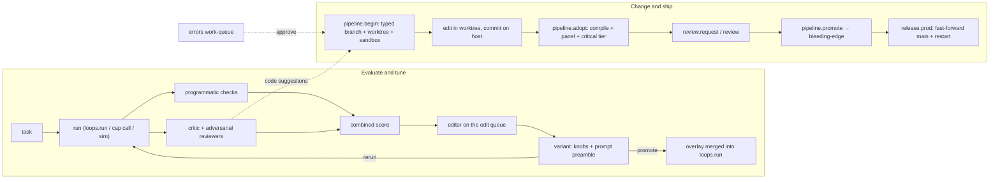
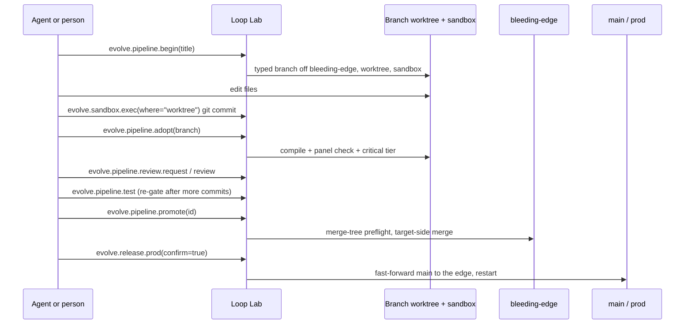

# 33 — Loop Lab (Evolve): CI/CD for the agentic loops


Loop Lab is Vera's test, evaluation and delivery harness. It has two halves that
share one panel and one record store. The **evaluation half** runs benchmark
tasks through the agentic loops (and, through capability-type tasks, smoke-tests
any other subsystem), grades them against programmatic checks and LLM critics,
and tunes loop *profiles* with learned variants — the "Vera runs, Claude edits,
until Vera can take over" pattern. The **delivery half** is CI/CD for Vera's own
source (and any other registered git repo): every change is made on a typed
branch in an isolated worktree with its own dev sandbox, gated by compile,
panel and critical-tier tests, reviewed, merged into an integration branch
(`bleeding-edge`), and only then released to `main` and prod by a deliberate,
fast-forward-only step.

The core is [`vera/evolve/evolve_capabilities.py`](../vera/evolve/evolve_capabilities.py)
(tasks, runs, critics, improvement sessions, variants, pipelines, repos,
sandboxes, errors queue), with neighbouring modules for CI views
(`ci_capabilities.py`), schedules (`schedule_capabilities.py`), prod release
(`release_capabilities.py`), delegation (`delegate_capabilities.py`), result
history (`task_history_capabilities.py`), the autonomous orchestrator
(`orchestrator_capabilities.py`), the integration-branch registry
(`edge_registry.py`) and roughly thirty pure `*_core.py` / helper modules that
hold the unit-tested decisions. The panel is
[`vera/evolve/evolve_panel.html`](../vera/evolve/evolve_panel.html), registered as
the **Loop Lab** tab (icon ⌬) and served at `/evolve/panel`.

**Maturity.** The CI/CD path (begin → adopt → review → test → promote →
release) is the day-to-day route by which changes to Vera land, and the
sandbox, schedule and release machinery is in active use. The evaluation and
tuning half is stable; code edits suggested by critics are never applied
automatically. The autonomous orchestrator is opt-in and observes before it acts.

> [!TIP]
> **If nothing seems to run**, press **✓ Self-test** in the top bar
> (`evolve.selftest`). It pre-flights Redis, task seeding, the `loops.run` engine
> (a real one-cycle run), and the critic and editor providers, and tells you which
> link is broken. Local-only loop runs are slow (CPU inference) — the live strip
> and each stage's `current` field show progress, and **Stop** hard-cancels a run
> stuck mid-loop.

## Contents

- [1. Concepts and architecture](#1-concepts-and-architecture)
- [2. Source map](#2-source-map)
- [3. The panel](#3-the-panel)
- [4. Tasks, checks, and runs](#4-tasks-checks-and-runs)
  - [4.1 Task types and checks](#41-task-types-and-checks)
  - [4.2 Census templates](#42-census-templates)
  - [4.3 Running a test in the background](#43-running-a-test-in-the-background)
  - [4.4 Activity-aware timeouts](#44-activity-aware-timeouts)
  - [4.5 The live implementer timeline and trace fidelity](#45-the-live-implementer-timeline-and-trace-fidelity)
  - [4.6 One result store for every driver](#46-one-result-store-for-every-driver)
  - [4.7 Task and run capabilities](#47-task-and-run-capabilities)
- [5. Targets: what you are improving](#5-targets-what-you-are-improving)
- [6. Evaluation: critics and adversarial review](#6-evaluation-critics-and-adversarial-review)
- [7. Improvement sessions, the edit queue, and variants](#7-improvement-sessions-the-edit-queue-and-variants)
  - [7.1 Improve sessions](#71-improve-sessions)
  - [7.2 The background edit queue](#72-the-background-edit-queue)
  - [7.3 Variants and the overlay](#73-variants-and-the-overlay)
- [8. Sandbox-first execution](#8-sandbox-first-execution)
- [9. CI/CD pipelines](#9-cicd-pipelines)
  - [9.1 The lifecycle](#91-the-lifecycle)
  - [9.2 Pipeline kinds](#92-pipeline-kinds)
  - [9.3 Gates](#93-gates)
  - [9.4 Review, controller identity, and rollback](#94-review-controller-identity-and-rollback)
  - [9.5 Promotion and guards](#95-promotion-and-guards)
  - [9.6 Multi-repo pipelines](#96-multi-repo-pipelines)
  - [9.7 Change sources and the errors work-queue](#97-change-sources-and-the-errors-work-queue)
  - [9.8 Pipeline, branch, and git capabilities](#98-pipeline-branch-and-git-capabilities)
- [10. Integration branches and release](#10-integration-branches-and-release)
  - [10.1 The edge registry](#101-the-edge-registry)
  - [10.2 Promoting an edge to main](#102-promoting-an-edge-to-main)
  - [10.3 Releasing to prod, gated on the census](#103-releasing-to-prod-gated-on-the-census)
- [11. Dev sandboxes](#11-dev-sandboxes)
  - [11.1 Primary, spawned, and standing sandboxes](#111-primary-spawned-and-standing-sandboxes)
  - [11.2 What keeps the real source safe](#112-what-keeps-the-real-source-safe)
  - [11.3 Lifecycle: pause, reap, prune, preflight](#113-lifecycle-pause-reap-prune-preflight)
  - [11.4 Recovering a lost controller registry](#114-recovering-a-lost-controller-registry)
  - [11.5 Recovering a severed worktree](#115-recovering-a-severed-worktree)
  - [11.6 Work plans and shared private planning](#116-work-plans-and-shared-private-planning)
  - [11.7 Sandbox capabilities](#117-sandbox-capabilities)
- [12. Unit tests and test generation](#12-unit-tests-and-test-generation)
- [13. Schedules](#13-schedules)
- [14. Suite automation and reports](#14-suite-automation-and-reports)
- [15. Delegating work to Vera](#15-delegating-work-to-vera)
- [16. Autonomous mode and the orchestrator](#16-autonomous-mode-and-the-orchestrator)
- [17. CI views](#17-ci-views)
- [18. Markets self-improving loop](#18-markets-self-improving-loop)
- [19. Configuration](#19-configuration)
- [20. Storage and events](#20-storage-and-events)
- [21. Worked examples](#21-worked-examples)
- [22. Troubleshooting](#22-troubleshooting)
- [23. Related pages](#23-related-pages)

---

## 1. Concepts and architecture



The evaluation cycle in one picture:

```
task ─ run (loops.run / cap call) ─→ trace + final output
     ─ checks (ground truth) ──────→ pass/fail per assertion
     ─ critic LLM (rubric) ────────→ score 0-10 + critique + edit suggestions
     ─ adversarial reviewers ──────→ more failures, harsher score
     ─ editor LLM ─────────────────→ next tuning variant (knobs + prompt preamble)
     ─ rerun with variant ─────────→ … until target_score or max_rounds
     ─ promote best variant ───────→ overlay merged into every loops.run of that profile
```

The **combined** score is programmatic checks (50%) + critic score (50%), so
tuning cannot be gamed by a generous LLM — the ground-truth checks anchor it.

## 2. Source map

| Path | Responsibility |
|---|---|
| `evolve_capabilities.py` | Config, providers, targets, tasks, census templates, runs, critics, suites, variants/overlay, edit queue, improve sessions, repos, git/branches, pipelines, autonomous lock, errors queue, worktree claims, sandbox gate leases, sandboxes (primary, spawned, standing), unit tests, test generation, content write-back, sandbox logs/metrics, code-server sidecar |
| `ci_capabilities.py`, `ci_view_core.py` | `ci.*` and `loop.ci.*` views (matrix, race to green, tests, compare, pulse, track, board, fleet, run, branch, census, loop perf) |
| `schedule_capabilities.py`, `schedule_core.py` | Calendar schedules for censuses, suites, tasks, pipeline steps, board items and capabilities |
| `release_capabilities.py`, `release_core.py` | `evolve.release.*`: prod release gated on the census, node sync |
| `edge_registry.py` | Registry of integration branches (`bleeding-edge`, `bleeding-edge-design`, `VERA_EDGES`) |
| `delegate_capabilities.py`, `delegate_core.py`, `delegate_trajectory_core.py` | `evolve.delegate.*`: hand a brief to a Vera loop in its own worktree; trajectories and ratings |
| `task_history_capabilities.py`, `task_history_core.py`, `result_ingest_core.py`, `loop_record_core.py`, `work_core.py` | One result store across census, suite, improvement and single runs; Work page rows |
| `ship_capabilities.py`, `ship_core.py` | Ship page: one row per branch |
| `agents_capabilities.py`, `agents_core.py` | Agents page: one row per agent session |
| `mission_capabilities.py`, `mission_core.py` | Mission control: one row per event |
| `orchestrator_capabilities.py`, `orchestrator_core.py`, `autonomous_lock_core.py` | Closed-loop orchestrator and the hard main lockout |
| `evolve_git_core.py`, `attribution_core.py`, `panel_check.py` | Pure git helpers and the main-merge guard; controller/author attribution; HTML/JS syntax gate |
| `sandbox_pool.py`, `sandbox_lifecycle.py`, `sandbox_reap.py`, `sandbox_redis.py`, `sandbox_pool_reconcile.py`, `sandbox_registry_reconstruction.py`, `sandbox_estate_guard.py`, `sandbox_workplan.py`, `worktree_repair.py`, `estate_role.py`, `instance_identity.py`, `singleflight.py` | Sandbox port/DB allocation, lifecycle decisions, cleanup classification, private Redis, registry reconciliation and reconstruction, estate-guard (a sandbox may not reap the estate), work plans, worktree repair, estate ownership, writer stamps, single-flight test runs |
| `evolve_unittest_core.py`, `unittest_history.py`, `test_gen_core.py` | Ephemeral pytest runner helpers, test-run history, test generation helpers |
| `gate_politeness.py`, `census_seed.py`, `evolve_logs_core.py`, `ttl_cache.py`, `estate_role.py` | Box-is-busy courtesy check for suites, census templates as suite tasks, sandbox log parsing, coalescing caches |
| `evolve_panel.html` | The Loop Lab panel |
| `vera/markets/markets_evolve_capabilities.py` | The markets self-improving loop (§18) |

## 3. The panel

Loop Lab opens as its own top-level tab, as a view inside the IDE's VS Code panel
(`vscode_panel.html`, with commit cross-links to Dispatch), and inside the DAG
Workshop's **Loop Eval / Sim** section. The top bar carries the autonomous-mode
banner and kill switch (§16), a global repo and sandbox/branch filter, the
sandbox-mode pill (🛡) and **✓ Self-test**. The sections:

| Section | What it shows |
|---|---|
| **Work** | Every task and every driver run — census, suite, improvement session, single run — in one table, the live one first; census templates (seed, run, edit); a live widget layout (census in flight, loop performance, census runs among commits); the regression-guard matrix (every task × its recent runs) and hourly test activity |
| **Ship** | One row per branch (`evolve.ship.branches`): its latest pipeline, gate and decision, sandbox, last test run; expand for pipelines (a pending one shows its review card), sandbox controls and test history. Sandbox panes: **Connection**, **Terminal** (container or worktree shell), **Files** (worktree browser + editor with save-to-branch), **Diff** (worktree vs main) and **VS Code** (code-server sidecar). Below: the commit graph (`<vera-git-graph>`), race lanes, authorship and the gate strip, plus the **Integration branches** card |
| **Agents** | One row per agent session — Claude Code, Codex, a Vera loop, an edit-queue agent — with its board items, pipelines and sandboxes; the work board by lane, notes, and the edit-queue work grid |
| **Mission control** | One row per event — audit actions, errors, gates — with what is live and what needs a person above it; run once, improve, errors sync/auto-sync/clear, sandbox status, routing-drift warning, and the live theatres (pipeline lifecycle, who is changing this branch, the dynamic workflow diagram implementer → reviewers → result, suite stream, live improvement) |
| **Schedule** | A calendar of Loop Lab work (§13) |
| **Settings** | Critic/editor providers, default profile, target score, max rounds, code-edit queueing, background synthesis model and CPU node |

The page uses one shared event bus for all its embedded elements and, inside a
dev sandbox, reads loop events from prod (where the census and other loops run).

## 4. Tasks, checks, and runs

### 4.1 Task types and checks

A **task** is a benchmark (Redis hash `vera:evolve:tasks`). Three types:

- **`loop`** — a `goal` run through a loop **profile** (via `loops.run`), with an
  `allowed_caps` floor, `max_steps` and `timeout_s`. Exercises the full engine:
  planning, tool calls, verification, synthesis.
- **`cap`** — a single capability call (`cap` + `args`). A fast smoke test for any
  subsystem (`fabric.datasets`, `dream.scheduler.status`, `llm.generate`, …).
- **`sim`** — an agent loop run against the **business simulation**
  (`business.sim.start` → evaluate → the loop operates the sim → score). The
  combined score is the mechanical sim-ledger outcome (0–100 → 0–10) — real
  ground truth, no critic needed. `sim` tasks use the simulation's own `is_sim=1`
  isolation and never route to the dev sandbox.

Every task carries **checks** (programmatic ground truth) and a **rubric** (LLM
judge guidance). Built-in check types: `contains`, `not_contains`, `regex`,
`cap_called`, `min_steps`, `max_steps`, `max_seconds`, `final_nonempty`,
`json_valid`, `no_error`. File and answer checks (`file` with
`exists`/`contains`/`absent`/`regex`/`any_of`/`all_of`/`min_bytes`, and
`answer_contains`/`answer_regex`/`answer_min_words`) are delegated to the census
evaluator so a check can judge what was actually written, not only the final
text.

Tasks seed on first start (tags such as `core`, `loop`, `smoke`, `dream`, `sim`,
`markets`). Seeding merges — your edits are never clobbered. `evolve.task.upsert`
merges over the stored record by default. `evolve.tasks.generate` asks the editor
LLM to write `count` tasks for a goal or subsystem (optionally biased to a
`cap_prefix`) and saves them tagged `generated`.

### 4.2 Census templates

A **census template** is a named set of goals
(`{name, description, model, wall_cap_s, goals:[{id, goal, intent, tier, output,
shape, checks}]}`, stored in `vera:evolve:census_templates`). Seeding a template
turns it into suite tasks tagged `census-<name>`, so `evolve.suite.run(tag=…)`
runs it and `evolve.suites(tag=…)` is its timeline — runs of a different question
set never share a chart. Saving refuses templates that would produce meaningless
numbers (for example duplicate goal ids) unless forced. Census runs from the
off-repo harness are recorded through `evolve.result.ingest` (§4.6); see
[Evaluation corpus](44-evaluation-corpus.md).

The translation lives in `census_seed.py` (pure: template dict in, task records
out). Parity is its point: every historical census number was produced by
`dag.agent_loop_v7` called with the goal alone, so seeded tasks use the
`planning` profile (the profile whose engine is v7) through `loops.run`, which
passes the caller's explicit arguments and drops the v7 profile body — a bare v7
run, exactly as the harness made it. If that asymmetry ever changes, seeded
census tasks stop being comparable with earlier runs and the template needs a
new name.

### 4.3 Running a test in the background

**`evolve.run.start`** launches one test in the background and returns a
`run_id` immediately: `kind` (`loop|cap|task|goal`), `target` (a category:id such
as `specialist:coding` or `agent:coder`, §5), `goal`, `allowed_caps`, `cap`,
`args`, `task_id`, `checks`, `assess` (default true), `provider` (critic),
`max_steps` (6). The panel streams it live and polls `evolve.run.status` as a
fallback. `evolve.goal.run` runs an ad-hoc goal through a profile with critic
analysis and can save it as a task (`save_as`). `evolve.cap.test` calls any
capability with arguments and grades it against checks, respecting the sandbox
mode. The composer's **ℹ** button shows the target's description and full
configuration (`evolve.target.info`): the loop profile (engine, agent, caps,
defaults, skills) with any promoted overlay, the agent's model/domain
caps/system prompt, engine knobs, or the remote IDE instance record.

Every failed test (a run error, or three or more failed tool calls) is
auto-ingested into the errors work-queue (§9.7) tagged with its `run_id`. Dedup
keys on the stable profile/cap + goal, not the run id, so repeated failures bump
one item's counter and refresh its run link. A run refused by the sandbox posture
(§8) is recorded as `blocked` — an environment issue, never filed as a defect.

**Remote IDE code.** Every registered remote IDE (`ide.remote.instances`) appears
as an **IDE code** target. `evolve.ide.improve` runs a goal over that workspace
via `ide.remote.run` (Claude Code CLI or a Vera agent editing over SSH),
streaming into the workflow diagram and recent runs. It is diagnose-only by
default (`apply=false` reviews and proposes the exact edits); `apply=true` lets
it change files.

### 4.4 Activity-aware timeouts

Single tests launched from the composer are not killed on a fixed clock — a loop
under test may legitimately run for a long time. A watchdog tracks **activity**:
a liveness fingerprint (`updated_at`, refreshed on every loop event and immune to
the event-list trim cap) from the run's own session plus any goal-matched
strategic sub-sessions that started after this run began. It cancels only after
`run_idle_timeout_s` (default 300 s) with no new activity, or at the `run_max_s`
hard ceiling (default 7200 s; `0` = unlimited). When the run executes in the dev
sandbox, the HTTP hop to the sandbox's `/mcp/call` gets a matching client
timeout. Suite, benchmark and improvement-session runs keep their fixed per-task
`timeout_s` — benchmarks must stay bounded. Before each task, the suite also
waits (with a ceiling) while the GPU gate is held or another loop is running
(`gate_politeness.py`), so a task is not charged for queueing behind other work.

### 4.5 The live implementer timeline and trace fidelity

The implementer panel (`<vera-agent-loop-output>`) is fed the way the DAG
Workshop feeds its loop view: on run start it **reattaches** over SSE to the
run's persisted agent-loop session
(`/workshop/agent_loop/reattach?session_id=evolve:<run_id>`), which replays every
stored step and then tails the live ones. Because the events live in Redis
(`vera:loop:events:evolve:<run_id>`), the timeline populates reliably and
**restores when you navigate away and back**. Runs executed inside the dev
sandbox emit into the sandbox's own Redis.

The engines' `loops.run` result often carries no usable steps list, so
`_run_task` rebuilds the tool trace from the run's persisted event log (falling
back to the dev Redis for sandboxed runs) — every `tool_call`/`tool_done` with
thought, ok and preview — so reviewers judge the whole run and timed-out runs
keep their partial trace.

### 4.6 One result store for every driver

A census goal, a suite task, an improvement round and a single run are all
recorded as the same run record, with a `source` and a `driver`:

- `evolve.result.ingest` writes census goal rows as run records
  (`source=census`, `run_id` = the loop session, task `census-<template>-<goal>`).
- `evolve.loop.record` records **any** finished agent loop (chat, Dream, a v8
  program, the API) from its own event log.
- `evolve.results`, `evolve.task.history`, `evolve.tasks.overview` read them back
  (per-task runs, ok rate, capped count, wall-time median/spread, quality, streak,
  trend, sparkline series), and `evolve.work.drivers` / `evolve.work.live` feed
  the Work page.
- `evolve.runs` correlates each run with the commits that landed in its window;
  `evolve.compare` aggregates runs into an A-vs-B comparison between two variant
  groups; `evolve.authors` maps recent commits to who produced them.

### 4.7 Task and run capabilities

| Capability | Purpose |
|---|---|
| `evolve.tasks` / `evolve.task.upsert` / `evolve.task.delete` | Task CRUD (`tag` filter) |
| `evolve.task.run` | Run one task now (`id`, `assess`, `provider`) |
| `evolve.goal.run` | Run an ad-hoc goal + critic analysis; optionally save as a task |
| `evolve.cap.test` | Test any capability against checks |
| `evolve.tasks.generate` | LLM-generate benchmark tasks (tag `generated`) |
| `evolve.census.templates` / `.template.save` / `.template.seed` | Census templates |
| `evolve.run.start` / `evolve.run.status` | Background single run / live snapshot |
| `evolve.runs` / `evolve.run.get` / `evolve.compare` | Run history / full record / A-vs-B comparison |
| `evolve.result.ingest` / `evolve.loop.record` | Record census rows / any finished loop |
| `evolve.results` / `evolve.task.history` / `evolve.tasks.overview` | Read results across drivers |
| `evolve.work.drivers` / `evolve.work.live` | Work page rows / what is running now |
| `evolve.ide.improve` | Test or loop over a remote IDE workspace |
| `evolve.selftest` | Pre-flight Redis, tasks, `loops.run`, critic, editor |

## 5. Targets: what you are improving

Loop Lab picks a target as *category → id* (`evolve.targets` returns the tree).
Every run, session and pipeline carries a `target` that resolves to the loop
profile used to exercise it.

| Category | Target id | Exercised through | Improve by |
|---|---|---|---|
| **Specialist loops** | `specialist:<profile>` (the 23 loop profiles) | that profile | Variant overlay (tune) or code edit to `loop_profiles.py` |
| **Agentic loops** | `engine:v5` … `engine:v8` | the `planning` profile with that engine | Engine-knob variant or code edit |
| **Agents** | `agent:<name>` (from `agent.list`) | the profile bound to that agent, if any | Prompt/model variant or code edit to `agents.py` |
| **Chat** | `chat:…` | the `planning` profile | Code edit |
| **System components** | `system:<group>` (dream, markets, fabric, …) | the `planning` profile | Code edit via a pipeline |
| **IDE code** | `ide:<instance>` | the `coding` profile over a remote workspace | `evolve.ide.improve` |

A bare or legacy profile name maps to `specialist:<name>`.

## 6. Evaluation: critics and adversarial review

Critics and editors accept a provider **spec**: `ollama[:model]` runs on the
local cluster (`llm.generate`); `anthropic[:model]`, `openai[:model]` or any
stored provider id routes through `providers.chat` (sealed keys plus
usage/cost tracking). Add API keys under **Estate → API** (the providers
registry, [agent runtimes and providers](36-agent-runtimes-providers.md)). The
defaults are critic `ollama`, editor `anthropic` — Claude tunes while the local
models run.

**The critic** (`evolve.assess`) sees the task, goal, rubric, check results, the
tool trace, the final output, the current variant and the tunable-knob guide,
and returns JSON with a `score` (0–10), `passed` (default `score ≥ 7`), a
`critique`, `failures`, and `edits` (`overrides` restricted to the knob
whitelist, a `prompt_preamble`, and up to six `code_suggestions`). The run record
gets `score`, `combined` and `assessed_by`, and `evolve.assessed` is emitted.

**Adversarial review** (on by default, `adversarial=true`, `reviewers=2`):
after the scoring critic, N−1 more reviewers each see *only* the goal, the trace
and the output — never the rubric — and are told to assume the output is wrong
and enumerate concrete failures. Their failures are unioned (up to 15) and the
stored score is the **minimum** of all scores, so the evaluation is the harsher
aggregate. `evolve.workflow` events animate the dynamic workflow diagram
(implementer → reviewers → result).

**Agreement.** `evolve.assess.compare` scores one run with two critics (default
`ollama,anthropic`) and reports the score delta and pass/fail agreement — how
you know the local critic is ready to take over from Claude.

| Capability | Purpose |
|---|---|
| `evolve.providers` | Providers usable as critic/editor |
| `evolve.assess` | Critic scores a stored run |
| `evolve.assess.compare` | Two critics on one run → agreement |
| `evolve.config.get` / `evolve.config.set` | Configuration (§19) |

## 7. Improvement sessions, the edit queue, and variants

### 7.1 Improve sessions

`evolve.improve.start` launches a background session that loops three visible
phases per round until `target_score` or `max_rounds`:

1. **Test** — run the agent loop for each task (sandbox-first, watchable live).
2. **Evaluate** — the critic and reviewers score each run.
3. **Synthesize** — propose a better **variant**: engine-knob overrides
   (whitelisted and clamped) plus a **prompt preamble** prepended to the agent's
   system prompt. This runs on the background edit queue (§7.2).

**Goal source** (`goal_source`): `tasks` (default — the profile's benchmark loop
tasks, optionally filtered by `tag`), `goals` (an explicit `goals` list, or the
system's long-term goals from `goals.list`), or `generate` (LLM-generated tasks
from `generate_from`). Other inputs: `profile`/`target`, `critic`, `editor`,
`max_rounds`, `target_score`, `base_variant`.

Code suggestions from the critic and editor are **never auto-applied**. They
accumulate on the session; with `allow_code_edits` on (or one click /
`evolve.code.queue`) a suggestion becomes a gated code pipeline (§9) whose edit
is dispatched to the Claude Code work queue (`ide.remote.queue.add`) pinned to
the pipeline's worktree — the "Claude edits" half.

| Capability | Purpose |
|---|---|
| `evolve.improve.start` / `status` / `list` | Session lifecycle |
| `evolve.improve.cancel` | Sets the cooperative cancel flag **and** hard-cancels the task; force-marks a stale running record done |
| `evolve.code.queue` | Route one code suggestion through a gated pipeline |

### 7.2 The background edit queue

The synthesis phase is enqueued rather than run inline and drained by a single
background worker on a cheap local model pinned to a CPU node — by default
`gpt-oss:20b` — so editing stays off the critical path and off the GPU/API, and
every action is **visible and editable before it runs**. Configure the model and
node in Settings → *Background synthesis*; set `editq_enabled` off to run the
`editor_provider` (for example Claude) inline instead.

| Capability | Purpose |
|---|---|
| `evolve.editq.list` / `evolve.editq.get` | The queue / one action (prompt, result, status) |
| `evolve.editq.update` | Edit a **queued** action's prompt or system before it runs |
| `evolve.editq.cancel` / `evolve.editq.worker` | Cancel an action / ensure the worker is running |
| `evolve.instances` | Ollama instances, for pinning to a CPU node |

### 7.3 Variants and the overlay

The best variant of a session can be **promoted** to the active **overlay** for
its profile. `loops.run` merges the overlay **between** the profile defaults and
the caller's explicit overrides (`_apply_evolve_overlay`, see
[DAG engine §11](03-dag-engine.md#11-loop-profiles-and-loopsrun)), so every
production run of that profile picks up the learned knobs and preamble while a
caller can still override any of them. Clear it at any time to revert to stock.

> [!NOTE]
> The overlay is merged into the profile *body*. For a v7 profile (`planning`,
> `long-term-scheduling`, `operator`, `research-brief`) `loops.run` filters the
> profile body by v7's own schema, so overlay knobs reach the engine only on
> v5/v6 profiles or when passed explicitly by the caller (see
> [DAG engine §11](03-dag-engine.md#11-loop-profiles-and-loopsrun)).

The editor may only tune these knobs (anything else is dropped; numbers are
clamped):

| Knob | Range | Knob | Type |
|---|---|---|---|
| `max_cycles` | 2–24 | `enabled_steps` | csv |
| `max_steps` | 1–16 | `model` | str |
| `triage_top_k` | 4–48 | `satisfaction_check`, `require_verify`, `strict_complete` | bool |
| `catalog_size` | 10–120 | `enable_replan`, `enable_recon`, `enable_subplans` | bool |
| `max_search_calls` | 0–6 | `enable_phases`, `enable_master_planner`, `phased` | bool |
| `max_expands` | 0–4 | `prefer_terminal_tools`, `select_steps` | bool |
| `min_explore_cycles` | 0–6 | `prompt_preamble` | str |
| `recon_max_rounds` | 0–6 | | |
| `step_cycle_budget` | 1–12 | | |

| Capability | Purpose |
|---|---|
| `evolve.variants` | Variants for a profile + the active overlay |
| `evolve.variant.promote` / `evolve.variant.clear` | Promote / revert the overlay |
| `evolve.overlay.get` | The active overlay (read by `loops.run`) |

## 8. Sandbox-first execution

The default posture is **`require`** (`config.sandbox_mode`) — Loop Lab only
operates on a containerised copy of the source:

- **`require`** (default) — tests must run in a dev sandbox; a run is refused
  (recorded as `blocked`, never filed in the errors queue) with a clear reason if
  none is up. Bring one up (`evolve.sandbox.ensure`) before testing.
- **`prefer`** — tests run in the dev sandbox whenever one is up, silently falling
  back to in-process (touching real Vera) otherwise.
- **`off`** — always in-process (fast, but a loop can touch real Vera).

A config value already stored in Redis always overrides the code default, so a
changed default does not disturb an existing install. Execution routes through
the sandbox's universal `/mcp/call` endpoint, so any capability (including
`loops.run`) runs against the sandbox's isolated state. As defence in depth, a
**test denylist** (`config.test_denylist`) strips external-effect capability
families from every test loop's toolkit, even in-process:

```
mail. tg. exec. docker. git. provision. ssh. mesh. deploy. comms. netsec.
ide.remote. sandbox.host. loops.run dream.cycle.run dream.scheduler. evolve.
markets.evolve. business. commerce. accounts.
```

`evolve.sandbox.ensure` brings up an isolation sandbox on a loop-lab branch off
the current HEAD if none is reachable — one click to the safe posture. Each run
records **where** it ran.

## 9. CI/CD pipelines

A **pipeline** record (`vera:evolve:pipeline:<id>`) carries one change through
its stages, with `controller`, `reviews[]`, `gate_passed`, `decision`
(`pending`/`held`/promoted/rolled back), steps and scores.

### 9.1 The lifecycle



1. **Begin** — `evolve.pipeline.begin(title, branch?, spawn?, session_id?, repo?,
   base?)` creates a typed branch (`feat/<slug>` unless a full typed name such as
   `fix/…`, `docs/…`, `test/…`, `chore/…` is given) off `bleeding-edge` (or the
   repo's mainline if it has none, or an explicit `base`), materialises its
   worktree and a dev sandbox (its own container with `spawn=true`), records the
   pipeline and returns the exact next calls.
2. **Edit and commit** — edit the worktree, then commit through
   `evolve.sandbox.exec(where="worktree", branch=…)` on the host (git inside the
   container over a network share does not work).
3. **Adopt** — `evolve.pipeline.adopt(branch, to?, title?, summary?)` registers
   the already-edited branch as a code pipeline, attributes it, and runs the gate
   (§9.3). Use this for hand-authored changes; generated changes come in through
   `evolve.pipeline.run`.
4. **Review** — `evolve.pipeline.review.request(id, reason)` flags it;
   `evolve.pipeline.review(id, verdict, findings, edits_made?)` records a verdict
   (`approved|changes_requested|blocked`).
5. **Test** — `evolve.pipeline.test(id)` re-gates the committed branch.
6. **Promote** — `evolve.pipeline.promote(id, to?)` merges into `bleeding-edge`
   (or another registered edge).
7. **Release** — `evolve.bleeding_edge.promote_to_main` or
   `evolve.release.prod` (§10).

### 9.2 Pipeline kinds

- **`kind=variant`** (`evolve.pipeline.run`) — a tuning variant. Applied at
  runtime via the overlay, so no reload is needed: the pipeline measures a
  baseline suite, runs the suite with the candidate, gates on the score delta
  (`gate_threshold`, default 0.0 = must not regress) and, if it passes and
  `auto_promote`, promotes the overlay. Fully in-process.
- **`kind=code`** — a source change. From `evolve.pipeline.run(kind="code",
  edits=[{area, suggestion}])` the pipeline cuts a branch, hands the edit to the
  Claude Code work queue pinned to the branch worktree, and gates it once the edit
  has landed. From `evolve.pipeline.adopt` it starts with the edit already made.
  Either way, git is the rollback mechanism and a bad change never touches the
  integration branch until promoted.

### 9.3 Gates

A code change merges only when its pipeline gate passed. The gate for Vera has
up to three parts:

| Part | What it checks |
|---|---|
| Compile | `ast.parse` of every changed `.py` on the branch (a docs/UI-only branch has no Python gate) |
| Panel check | Syntax of changed panel HTML and JavaScript (`panel_check.py`) |
| Critical tier | `pytest -m critical` (`tests/conftest.py`) in a fresh **ephemeral** `vera:latest` container with the branch worktree mounted read-only — never the container serving HTTP. Gates run their critical tier one at a time (a Redis lease, `vera:evolve:critical_tier:lease`) with a 900 s budget that excludes queueing |

`gate_passed` is true only when every part that applies passes; with no live
worktree the gate falls back to the compile check. `force=true` on promote is
the sanctioned override for a change the gate cannot evaluate (docs/infra),
still validated by the git hooks. A **perf gate** (`perf.gate`) is recorded on
code promotions and is advisory unless `VERA_PERF_GATE_STRICT=1` makes a `fail`
block (`force` still overrides). Every gate run is kept
(`vera:evolve:unittest_history`), which is what the race-to-green views draw.

### 9.4 Review, controller identity, and rollback

Every pipeline records **who is driving it** (`controller`) and, per entry in
`reviews[]`, **who reviewed it** (`reviewer`): `claude_code`, `codex`,
`autonomous` or `user`. This is not a picker — it is read from the request's
caller signal (`CALLER_KIND`, `BACKGROUND_LLM`) via `_triggered_by()`
(`evolve_capabilities.py`, using `attribution_core.controller_for`). The MCP
bridge that Claude Code launches (`vera/ide/vera_mcp_bridge.py`) sets it on every
call it forwards, so `claude_code` means a real Claude Code session drove that
exact call. The Ship table, the pipeline detail, and `<vera-branch-pipeline>`'s
implement/gate stages render it through a shared controller badge. To review a
pipeline as Claude Code, call `evolve.pipeline.review` over the same MCP session
driving the work — the identity is automatic.

**Rollback always shows what it is about to discard.** Every rollback trigger
opens a confirmation with the pipeline's diff (or, for a variant pipeline, a
statement that this clears the promoted overlay) before
`evolve.pipeline.rollback` runs. For a variant pipeline rollback clears the
overlay; for a code pipeline it deletes the branch — the integration branch is
untouched.

### 9.5 Promotion and guards

`evolve.pipeline.promote(id, to="bleeding-edge", force=false)`:

1. **Autonomous lock** — while autonomous mode is engaged, any promote or merge
   to the real mainline is refused unconditionally (§16).
2. **Main-merge guard** — promoting or adopting a feature branch directly toward
   `main`/`master` is refused unless an explicit authorization sentinel is passed
   (`authorize_main`). All code lands on an edge; `main` advances only through
   §10.2.
3. **Gate** — `gate_passed` must be true (or `force=true`).
4. **Perf gate** — advisory unless strict (§9.3).
5. **Merge preflight** — a non-mutating `git merge-tree` between the current
   target tip and the committed feature branch; a conflict holds the pipeline
   with a conflict report and is never auto-resolved.
6. **Merge from the target side** — in an isolated throwaway worktree when the
   target is not checked out anywhere, or as a guarded in-checkout merge (no
   branch switch, refuses a dirty tree) when the target is a live checkout such as
   a standing edge container; the latter returns `restart_required`. The feature
   branch is not first merged with the target, so intervening target commits are
   preserved (or reported as a conflict) without sync commits, and a stopped
   sandbox or severed checkout cannot by itself block a valid committed branch.
7. **Refresh** — after a successful promote into a registered edge, that edge's
   mirror and standing container are refreshed. Mirror refresh resolves the
   mirror checkout through Git's common worktree registry, so a standing
   controller can promote into its own edge and still take the guarded
   in-worktree fast-forward path.

### 9.6 Multi-repo pipelines

Every pipeline, branch and git capability is **repo-aware**: an optional `repo`
input (default `"vera"`, the Vera checkout itself, always present and protected)
picks which git repo the branch, worktree and merge act on. Other repos must be
registered first:

| Capability | Purpose |
|---|---|
| `evolve.repo.add` | Register a local git repo (`id`, `label`, `path`, `remote_url`, `test_cmd` — default `pytest -q --tb=no`) |
| `evolve.repo.list` / `evolve.repo.get` | Registered repos |
| `evolve.repo.remove` | Unregister (refuses `vera`; nothing on disk is touched) |
| `evolve.repo.gitea_push` | Provision (idempotently) and push the repo's Gitea remote using the server's own Gitea configuration |

For `kind=code` pipelines on another repo the gate is that repo's own
`test_cmd`: once at branch creation against the repo's current mainline (the
baseline) and again via `evolve.pipeline.test` against the branch worktree once
the edit has landed. The pass rate (0.0–1.0) fills the same
`baseline_score`/`candidate_score`/`gate_delta`/`gate_passed` fields, so
rendering, promote and rollback work unchanged and resolve the repo from the
pipeline record. Dev sandboxes stay **Vera-only** (a generic repo has no
`vera:latest` image or Loop Lab state); its worktree is still git-isolated.

### 9.7 Change sources and the errors work-queue

The critic is not the only source of improvements:

- **Dream source review** (`evolve.pipeline.from_review(area, …)`) — the
  autonomous source review's technical recommendations for an area
  (`dream.review.area_report`) are distilled into concrete edits and launched as a
  code pipeline.
- **Perf and observability** (`evolve.observe.scan(launch?)`) — perf findings
  (`perf.scan`), event-loop stalls (`perf.stalls`) and recent errors are distilled
  into suggested fixes; `launch=true` turns them into gated code pipelines. The
  `observe_selfheal` Dream trigger runs this nightly (report only).

The **errors work-queue** (`vera:evolve:errors`) turns errors into approved
changes. Monitors push into it; nothing is applied without a human approve:

| Capability | Purpose |
|---|---|
| `evolve.errors.ingest` | Entry point any monitor calls (`source`, `title`, `detail`, `meta`); repeats dedup into a counter |
| `evolve.errors.sync` | Pull current signals into the queue and optionally suggest a fix for each: `perf.scan` findings of severity crit/warn only (healthy `ok`/`info` statuses are ignored), real stall/hang events from `perf.stalls`, and `dream.sensor.syslog_errors` (which aggregates Ollama/worker request errors) |
| `evolve.errors.suggest` | Distil a concrete fix for one item (new → suggested) |
| `evolve.errors.approve` | Launch a gated code pipeline from the suggestion, gated against the profile that actually failed (`meta.profile`); a perf finding with a built-in safe remediation (`remediation_id`) is applied directly via `perf.remediate` instead |
| `evolve.errors.dismiss` / `evolve.errors.clear` | Drop one (a fresh occurrence re-opens it) / purge by state |
| `evolve.errors.list` | The queue with counts per state (`new`, `suggested`, `approved`, `applied`, `dismissed`) |

A config-gated background tick (`errors_autosync`, default off, every
`errors_autosync_s` = 900 s) runs the sync without anyone watching.

### 9.8 Pipeline, branch, and git capabilities

| Capability | Purpose |
|---|---|
| `evolve.pipeline.begin` | Atomic start: typed branch + worktree + sandbox + record |
| `evolve.pipeline.run` | Generated pipeline (`kind`, `profile`, `variant_id`/`edits`, `gate_threshold`, `auto_promote`, `critic`, `repo`) in the background |
| `evolve.pipeline.adopt` | Register a hand-edited branch and gate it |
| `evolve.pipeline.review.request` / `evolve.pipeline.review` | Request / record a review |
| `evolve.pipeline.test` | Re-gate a committed branch |
| `evolve.pipeline.promote` | Variant → overlay; code → merge into an edge |
| `evolve.pipeline.rollback` | Variant → clear overlay; code → delete branch |
| `evolve.pipeline.list` / `evolve.pipeline.get` | History / full stage record |
| `evolve.pipeline.diff` | Unified diff of a pipeline's worktree vs its repo's default branch (any repo) |
| `evolve.pipeline.from_review` / `evolve.observe.scan` | Pipelines from source review / observability |
| `evolve.git.status` | Branch, dirty flag, loop-lab branches (`repo`) |
| `evolve.git.graph` | Real commit graph (`git log --all --topo-order`, real parents and refs) for `<vera-git-graph>` (`vera/git_graph_element.js`, a gitk-style lane walk; loop-lab refs drawn distinctly) |
| `evolve.branch.create` / `evolve.branch.delete` | Work-branch primitives |
| `evolve.worktree.claim` / `.release` / `.claims` | Declare you are working in a worktree so the cleanup sweep leaves it alone (claims expire after `VERA_WORKTREE_CLAIM_TTL_H`, 12 h) |
| `evolve.ship.branches` | Ship page rows |
| `evolve.audit.list` | Verbose activity/change log (`vera:evolve:audit`) |
| `evolve.estate.writers` | Who has been mutating the shared estate and whether they run stale code |
| `evolve.authors` | Commit authorship map |

**Audit.** Every mutating action — promote, rollback, merge, branch create or
delete, code queue, pipeline decision, sandbox up/down, config change, unit test
— is appended to the audit log, stamped with the writing instance, and emitted as
`evolve.audit`.

## 10. Integration branches and release

### 10.1 The edge registry

A programme that must land on its own trunk gets a second integration branch,
not a second copy of the machinery. `vera/evolve/edge_registry.py` is the
registry of edges; `bleeding-edge` is the default edge (released to `main`,
standing container preferred on port 8994 and Redis DB 4) and
`bleeding-edge-design` is the UI redesign programme's own trunk. Every site that
used to spell the literal asks the registry instead:

| Site | Behaviour |
|---|---|
| Fork point / merge target (`pipeline.begin`, `adopt`, `promote`) | `edge=<name>` resolves to the edge's branch; `to=` still accepts any branch |
| Standing container (`bleeding_edge.container.ensure`) | `edge=<name>`; each edge has its own mirror `loop-lab/<branch>-mirror`, pool slug and (preferred) port + Redis DB |
| Refresh after promote | Whichever registered edge was merged into is refreshed |
| Release (`bleeding_edge.promote_to_main`) | `edge=<name>`; fast-forward only, per edge, `confirm=true` |
| Primary sandbox (`sandbox.up target=`) | `main` or any edge name (default `bleeding-edge`) |
| Reaper / lifecycle guard / worktree repair | `edge_protected_branches()` — an edge is protected the moment it is registered |
| Git hooks (`pre-push`) | `tools/hooks/protected-branches`, one name per line; `tests/test_edge_registry.py` keeps it equal to the registry |
| Panel | An **Integration branches** card (state against main, container, ensure / sandbox → edge / promote to main) and an *into* selector on Promote |

`evolve.bleeding_edge.list` returns the registry with live state (branch tip,
standing against `main` — released / ahead-of-main / behind-main / diverged —
mirror head, container). Sandbox observations carry `edge_commits` and
`merged_to_edges` per edge. An edge can be declared without a code change with
`VERA_EDGES="name=branch[:base],..."`; add its name to
`tools/hooks/protected-branches` as well, or the registry test fails.

A standing container per edge needs a free pool slot (port + Redis DB). Landing
on an edge never needs a container — adopt, gate and promote work from worktrees
— so an edge without a standing container is still a valid trunk. A mainline
mirror (`loop-lab/mainline-mirror`) is refreshed on a schedule
(`VERA_MAINLINE_MIRROR_REFRESH_INTERVAL_S`, default 24 h).

### 10.2 Promoting an edge to main

`evolve.bleeding_edge.promote_to_main(repo="vera", confirm=false, edge=…)` is the
deliberate release step, never called automatically by any gate, scheduler or
capability. It requires `confirm=true` and permits only an ancestry-checked,
expected-tip-checked **fast-forward**; main-ahead or diverged history is
preserved and refused for reviewed reconciliation into the edge. Two edges are
two independent release paths: the second to release after the first is refused
as diverged until it reconciles the other's release (merge `main` into it through
a normal reviewed pipeline, then retry). It reports when a census is in flight.

### 10.3 Releasing to prod, gated on the census

`evolve.release.prod(confirm, edge, census, force, restart, reason, sync_nodes)`
is the one call that puts an edge on prod: fast-forward `main` to it
(`evolve.bleeding_edge.promote_to_main`) and restart (`sys.dev.restart`). A
restart kills every loop in flight and pauses the census goal, so the release
checks the census first and, when a goal is in flight, **waits**:

| `census` mode | Behaviour |
|---|---|
| `finish` (default) | Wait until no census is in flight |
| `goal` | Write a yield: the goal in flight finishes, the harness parks, the release goes, and the census is resumed once the new process is up |
| `force=true` | Go now |

A wait returns `held: true` at once and is carried by a 30 s job
(`evolve.release.tick`); `evolve.release.status` shows the pending release and
recent history, and `evolve.release.cancel` drops it (resuming a census it
yielded). The Ship page's release button asks which mode.

With `sync_nodes` (default true) a finished release also brings the nodes onto
it: every syncable node component (`provision.component.sync` — `nlp_server`,
`gpu_inference`, `model_builder`), the Ollama activity taps (`nodes.ollama.tap`),
the node workers (`nodes.workers.sync`) and the warm model slots
(`ollama.warm.apply`). The sync runs from the same 30 s job in the new process
after the restart, never while a census goal is in flight (a refusal for a
census is retried, not counted as a failure). `evolve.release.node_sync` shows it
(`run=true` queues one by hand).

## 11. Dev sandboxes

A dev sandbox is a second, complete Vera running a **branch's** code in a
container, so changes are tested running-and-reloaded before they reach an edge.
It requires docker on the orchestrator host; everything degrades gracefully (no
sandbox → a code pipeline holds for manual review instead of failing).

### 11.1 Primary, spawned, and standing sandboxes

- **Primary** (`evolve.sandbox.up`) — a git worktree of the branch at
  `<repo>/.loop-lab-worktrees/<branch>`, a generated `docker-compose.dev.yml`
  running `vera-dev` from the `vera:latest` image with the worktree bind-mounted
  over `/app/Vera`, on `VERA_DEV_PORT` (default **8998**). `vera:latest` is
  local-only, so `sandbox.up` first calls `docker.image.ensure` to build it from
  the repo Dockerfile if missing (`pull_policy: never`). `snapshot=true` copies
  Loop Lab config and tasks, prod's Ollama routing overrides and the data-fabric
  SQLite DB into the sandbox so it tests with the same suite and routing.
- **Spawned** (`evolve.sandbox.spawn`) — additional per-branch containers
  (`vera-dev-<slug>`) alongside the primary, each with its own worktree and an
  allocated host port (pool 8998 down to 8980; 8999 is prod) and Redis slot (pool
  3–15), recorded in `vera:evolve:sandbox:pool`. `evolve.pipeline.begin(spawn=true)`
  uses this for multi-agent work.
- **Standing edge containers** (`evolve.bleeding_edge.container.ensure`) — a
  persistent sandbox per edge tracking that edge's mirror, refreshed after every
  promote into the edge.

Each sandbox gets a **private Redis sidecar** (`sandbox_redis.py`) so it cannot
address production Redis; the descriptor keeps a bounded Redis slot identifier
for pool allocation, not the sidecar's database number. Sandboxes share prod's
Ollama nodes through opaque, controller-owned inference leases
(`ollama.gate.lease.status/acquire/renew/release`) that expose no Redis address,
key or owner token. A sandbox is a guest: it may not reap or mutate the estate
(`sandbox_estate_guard.py`, `estate_role.py`), and ambient background jobs that
would recompute prod's state are skipped inside it. `evolve.sandbox.status`
includes a routing-drift check (does the sandbox's planner/controller/tier
routing still match prod's).

### 11.2 What keeps the real source safe

- Loop-lab branches are created with a bare `git branch` (no checkout — prod's
  working tree stays on `main`), and a branch's code only exists in its
  **worktree**, materialised by the self-healing `_ensure_worktree` (prunes stale
  registrations; restores prod to `main` if a legacy state left it on a branch).
- Code-pipeline edits are **worktree-pinned**: `ide.remote.queue.add` /
  `ide.remote.run` accept a `workdir` override and the pipeline passes the
  worktree path, so the editor's shell is confined to the branch copy.
- `evolve.sandbox.fs.write` and the Files pane write only inside the worktree
  (path-jailed); `evolve.sandbox.exec` runs in the container or the branch
  worktree, never the real tree.
- `evolve.sandbox.approve` merges a sandbox branch into an integration branch in a
  throwaway isolated worktree — never into a live working tree.
- `content.edit` lands a doc, skill, note or tracked image on `main` through a
  machine-managed out-of-tree worktree without a container and without dirtying
  prod's checkout (allowlisted paths; `content.status` shows unpushed commits).

### 11.3 Lifecycle: pause, reap, prune, preflight

| Mechanism | Behaviour |
|---|---|
| Idle pause | Spawned containers idle past `VERA_SANDBOX_IDLE_PAUSE_S` (1800 s) are paused (`docker pause`) by a sweep every `VERA_SANDBOX_IDLE_SWEEP_INTERVAL_S` (300 s); the primary, the code-server sidecar and **pinned** containers are exempt. Any real use auto-resumes |
| `evolve.sandbox.pause` / `resume` / `pin` / `reap` | Manual controls |
| `evolve.sandbox.restart` | Restart one sandbox in place without changing role, branch, worktree, port, Redis slot or descriptor |
| `evolve.sandbox.down` | Stop the exact container and sidecar; preserve the worktree by default. When an old descriptor has outlived its compose file, teardown discovers containers and networks only through Docker's exact compose-project label and drops the descriptor only after teardown succeeds; if membership cannot be observed, the descriptor and worktree are kept as the retry handle |
| `evolve.sandbox.prune` | Dry-run by default: reap loop-lab worktrees whose branch is fully merged with no live container, orphaned compose files and dead pool entries; claimed worktrees and protected branches are kept |
| `evolve.sandbox.preflight` | Read-only safety decision for one sandbox (ownership, runtime/Git state, whether restart, stop, reuse, removal or reconciliation is safe) |
| Disk headroom | `docker.disk.status` / `docker.disk.reap` (exited session sandboxes older than `VERA_SESSION_SANDBOX_RETAIN_HOURS`, 24 h); a sweep every `VERA_DISK_SWEEP_INTERVAL` (900 s) |
| `sandbox_follow_host` | When on (`VERA_DEV_FOLLOW_HOST=1` presets it), the sandbox comes up when Vera starts and goes down when Vera stops. Default off |

Critical and targeted test runs are single-flight by worktree and normalized
pytest arguments: concurrent retries share one ephemeral runner, and a lost HTTP
response does not start another test container.

### 11.4 Recovering a lost controller registry

Spawned sandbox compose definitions carry controller-owned labels for their role,
exact branch and allocated Redis slot. If the registry is lost,
`evolve.sandbox.registry.reconstruct(dry_run=true)` compares those labels with
Docker's compose project and service metadata, the single published Vera port,
the `/app/Vera` source mount, Git's exact worktree branch, the generated compose
file and the hashed broker identity. An absent, ambiguous, duplicated or
unreadable source blocks that candidate.

Applying the plan requires `dry_run=false` and the exact digest from the latest
dry run. The registry is watched and written transactionally; any concurrent
change requires a new review. Restoration records the owner as unknown and the
source as recovered evidence. It never starts, stops, restarts, pauses, removes
or recreates a container, worktree, branch or compose file. Sandboxes created
before the recovery labels existed remain visible as blocked evidence rather
than being guessed into the registry.

### 11.5 Recovering a severed worktree

`evolve.sandbox.worktree.repair(branch, dry_run=true)` repairs one fully severed
`feat/`, `fix/`, `test/`, `docs/` or `chore/` worktree. It refuses protected
branches, healthy or registered worktrees, unknown Docker state, and a target
mounted by any running or stopped container. Review the exact dry-run paths
before repeating with `dry_run=false`.

The repair moves the orphan directory atomically into a unique quarantine,
recreates Git linkage from the existing branch, overlays tracked, untracked and
ignored files, replays tracked deletions, and verifies the preserved-file
manifest. The quarantine remains after success. If recreation fails, the original
directory is restored and any partial replacement is kept separately for
diagnosis. The operation never runs repository-wide worktree pruning and never
deletes the quarantine automatically.

### 11.6 Work plans and shared private planning

Each sandbox can carry a gitignored `.vera-work/work-plan.json`
(`evolve.sandbox.workplan.get` / `.update`) recording a concise purpose,
owner/session, current step, actionable steps, blockers, and links to durable
board items and session/workspace notes. It is deliberately not a second backlog:
board items remain the coordination plane ([Activity and boards](39-activity-boards.md))
and notes remain the cross-session handoff plane. Plans are revision-guarded
(`expected_revision` must match). Validation rejects duplicate step IDs, a
`current_step` that does not exist, and a plan marked complete while actionable
steps remain. A plan cannot make a dirty, unknown, protected or Git-severed
sandbox safe to restart or reap; preflight remains the authority.

Files that must outlive one worktree but must never reach origin belong under
`<git-common-dir>/vera-work/shared-planning/`. Resolve the root with
`git rev-parse --git-common-dir`; do not assume it is the worktree's `.git` file.
Every linked checkout — main, bleeding-edge and feature sandboxes — shares the
same common Git directory, so a handover saved there is visible across the
topology and outside Git's tracked tree. Use a bounded subdirectory named for the
board item or work unit, with no secrets, raw prompts, credentials or unredacted
result bodies. Actionable plans stay board items, progress is recorded as board
comments, and `.vera-work/work-plan.json` points at those records. Archive or
remove obsolete handovers deliberately rather than publishing them under
`documentation/`. Legacy ignored plans and handovers migrate to
`<git-common-dir>/vera-work/shared-planning/legacy-documentation/`: prove each is
untracked, move exact files preserving relative paths, refuse overwrites, verify
before/after checksums, and never bulk-delete the old directory.

### 11.7 Sandbox capabilities

| Capability | Purpose |
|---|---|
| `evolve.sandbox.status` / `evolve.sandbox.list` | Primary descriptor + health probe + routing drift / every sandbox with branch, port, Redis slot, running state and URL |
| `evolve.sandbox.up` / `evolve.sandbox.ensure` / `evolve.sandbox.spawn` | Primary for a branch (`target` main or an edge; `snapshot`, `rebuild_image`, `replace_primary`, `dry_run`) / ensure an isolation sandbox / additional per-branch container |
| `evolve.bleeding_edge.container.ensure` / `evolve.bleeding_edge.list` | Standing edge container / edge registry with live state |
| `evolve.sandbox.down` / `restart` / `pause` / `resume` / `pin` / `reap` / `prune` / `preflight` | Lifecycle (§11.3) |
| `evolve.sandbox.snapshot` | Copy Loop Lab state, routing overrides and the fabric DB into the sandbox |
| `evolve.sandbox.exec` | Terminal: run a command in the container or (`where="worktree"`) in the branch worktree on the host — the way to commit |
| `evolve.sandbox.fs.list` / `fs.read` / `fs.write` | File explorer over the worktree (path-jailed) |
| `evolve.sandbox.diff` | `git diff <base>` of a worktree (committed + uncommitted, untracked files listed) |
| `evolve.sandbox.review` / `evolve.sandbox.approve` | Send sandbox changes to the Workspace Changes review panel / merge the branch into an integration branch in an isolated worktree |
| `evolve.sandbox.code.attach` / `code.detach` | code-server sidecar (`vera-dev-code`, `VERA_DEV_CODE_PORT` 8996) with the worktree mounted, behind the `/vscode/loop-lab-dev/` same-origin proxy |
| `evolve.sandbox.logs` / `metrics` / `log_status` | Captured container logs (stamped with branch and code sha), CPU/memory samples, collector health |
| `evolve.sandbox.registry.reconstruct` | Dry-run and digest-confirmed restore of lost spawned-sandbox descriptors (§11.4) |
| `evolve.sandbox.worktree.repair` | Non-destructive repair of a severed worktree (§11.5) |
| `evolve.sandbox.workplan.get` / `.update` | Worktree-local work plan (§11.6) |
| `ollama.gate.lease.*` | Opaque inference leases for an authenticated sandbox |
| `docker.disk.status` / `docker.disk.reap` | Docker disk headroom and exited-sandbox cleanup |
| `content.edit` / `content.status` | Land docs/content on main without a container |

## 12. Unit tests and test generation

`evolve.unittest.run(branch?, paths="tests", markers?, extra?, timeout=600,
repo?, pipeline_id?)` runs a branch's pytest suite in a **fresh, ephemeral**
`vera:latest` container (`docker run --rm`) — never a sandbox container that is
serving HTTP — with the branch worktree mounted read-only at `/app/Vera` and
`PYTHONPATH=/app:/app/Vera`, so both `Vera.vera.*` and `vera.*` imports bind to
the branch code and no bytecode is written back. Arguments are sanitised before
they reach the shell. It must run on the managing instance (which has docker). The
output includes a summary and `failure_details` (node id, name, kind, concise
description) for each failed test. For a registered non-Vera repo it runs that
repo's own `test_cmd` instead.

| Capability | Purpose |
|---|---|
| `evolve.unittest.run` | Ephemeral pytest run for a branch (above) |
| `evolve.unittest.history` | Every gate/test run over time — the race-to-green lanes |
| `evolve.tests.matrix` | Coverage matrix: every test module, its test count, and whether it is in the critical tier |
| `evolve.tests.generate` | For a branch's changed pure-logic modules, LLM-propose pytest unit tests in the repo's import style |

## 13. Schedules

The **Schedule** page is a calendar (`<vera-calendar>`, the reusable
month/week/day element at `/ui/elements/calendar.js`) of when Loop Lab work may
run. A schedule is one of six kinds — a **census** template (the off-repo
harness, one template per run), a **suite** tag, a **task**, a **pipeline** step
(`test`, `adopt` or `promote`, always to `bleeding-edge`, never `main`), a
**board item** (`board.dispatch`) or any **capability** (fenced: nothing under
`sys.`, `background.`, or promotions to main) — on a weekly window (days,
start–end, timezone; default Mon–Fri 05:00–17:00 Europe/London) or once at a
time. Inside a window it repeats **back to back** (a census: the next starts when
the last has finished, after a short cooldown), **once per window**, or **every N
minutes**.

The scheduler is a 60 s job (`evolve.schedule.tick`, one orchestrator, never a
dev sandbox). It starts work only when the box allows it: a census needs no
census in flight, no agent loop running and no partial run files in the harness
directory; every other kind waits for a census by default (`exclusive`). A census
schedule can say what happens when its window closes with its census still
running: let it **finish** (default), **yield** (park after the goal in flight)
or **drop**. Everything the scheduler starts is a run record
(`evolve.schedule.history`) and appears on the calendar beside the windows; the
main Calendar panel can overlay both with `cal.events.list(include_loop_lab=true)`.
The page's **results** mode lays every archived census run and suite on the same
calendar as a span coloured by its pass rate (per run, or per goal placed by
elapsed time), so the series reads over time; a chip opens the run's goals
(`evolve.schedule.events mode=results|both granularity=runs|goals`).

| Capability | Purpose |
|---|---|
| `evolve.schedule.list` / `get` / `upsert` / `delete` / `enable` | Schedule records |
| `evolve.schedule.run_now` | Start a schedule's work now, still subject to the box |
| `evolve.schedule.tick` | Run the scheduler pass by hand |
| `evolve.schedule.events` / `history` | Calendar events / runs started |
| `evolve.schedule.config.get` / `config.set` | Master switch, default timezone, `max_starts_per_tick` |
| `evolve.schedule.seed_weekday_census` | Create the standard weekday census schedule |

Records and every decision live in `vera/evolve/schedule_core.py` (pure;
`tests/test_schedule_core.py` is in the critical tier).

## 14. Suite automation and reports

`evolve.suite.run(tag?, profile?, assess=true, provider?, variant_id?)` executes
every enabled task sequentially and stores a **scoreboard**
(`vera:evolve:suites`); fast capability smoke tests run first so the counter
moves immediately. `evolve.suite.start` launches the same in the background
(the panel polls `evolve.suite.status`). `evolve.report` renders the latest
scoreboard, the trend over recent suites and regressions versus the previous
suite as markdown. `evolve.board` returns race-to-green lanes (one per task,
cells coloured by combined score across recent suites), and `evolve.activity`
hourly buckets of runs and edit-queue actions.

The **`loop_eval_nightly`** Dream trigger ([Dream](17-dream.md)) runs
`evolve.suite.run` with critic assessment during idle hours (02:00–06:00) and
delivers `evolve.report` — the automated regression harness for the loops and,
via capability tasks, other systems.

| Capability | Purpose |
|---|---|
| `evolve.suite.run` / `evolve.suite.start` / `evolve.suite.status` | Run the suite / in the background / live status |
| `evolve.suites` / `evolve.report` | Scoreboards (`tag` filter) / markdown QA report |
| `evolve.board` / `evolve.activity` | Race-to-green board / activity buckets |

## 15. Delegating work to Vera

`evolve.delegate.start` hands a task to Vera the way an agent briefs one of its
own sub-agents: a `title`, a `brief` (up to 8000 characters), an optional rough
`plan`, `suggest_caps`, `suggest_commands`, `paths`, `ref` (default
`bleeding-edge`), `effort` (`standard|max`), `max_steps` (12), `plan_style`
(default `stepwise`), an optional `board_item`, `parent_task` and `delegator`. A
v7 agentic loop carries it out in its **own detached worktree** of `ref` (removed
afterwards) and returns a markdown **report** (Summary, Findings with
`path:line`, Structure, Open questions). The job id comes back immediately.

The only mode today is `report` (code reading and reporting); editing is not
enabled. The loop runs under a session capability guard that admits only the
jailed read tools `evolve.delegate.fs.grep/list/read/outline` (rooted at the
job's worktree, refusing any path that escapes it) and, when a board item was
given, `board.comment` pinned to that item.

| Capability | Purpose |
|---|---|
| `evolve.delegate.start` / `status` / `result` / `cancel` / `list` | Job lifecycle (session `delegate:<id>`) |
| `evolve.delegate.trajectory` / `trajectories` | The job as a trajectory for analysis and training: parent task, brief, plan, the loop's tier/intent/catalogue, every step with its calls, the report, the verdict |
| `evolve.delegate.rate` | Rate a report with a verdict from `VERDICTS` (`useful`, `partly`, `wrong`) plus notes, once checked against the code; anything else is refused (`delegate_trajectory_core.py`) |
| `evolve.delegate.fs.grep` / `list` / `read` / `outline` | Jailed read tools over the job's checkout |

## 16. Autonomous mode and the orchestrator

**Autonomous mode** is a hard lockout of `main`. While engaged
(`autonomous.engage`, flag `vera:autonomous:mode`), every promote or merge to the
real mainline is refused unconditionally — no sentinel, no force. The top-bar
banner shows it; `autonomous.release(confirm=true)` is the kill switch that
restores human access and signals the loop to stand down. `autonomous.status`
reports the state.

The **closed-loop orchestrator** (`autonomous.orchestrate`) decides and
optionally takes the single next action — dispatching one ready board item into a
container. It is dry-run by default and its decision core is pure
(`orchestrator_core.py`). `autonomous.drive(action=start|stop|status)` controls
the scheduled ticker that runs it (`VERA_ORCHESTRATOR_INTERVAL_S`, default 60 s);
starting it is safe because it observes before it acts. Events:
`autonomous.engaged`, `autonomous.released`, `autonomous.orchestrate.tick`,
`autonomous.orchestrate.dispatch`, `autonomous.drive.start`/`stop`.

## 17. CI views

`ci_capabilities.py` draws the same few pictures for any automated development
work — whoever did it — and for the agentic loop itself. Each returns
`{kind:'ci', view, …}` for a matching widget.

| Capability | Route | View |
|---|---|---|
| `ci.matrix` | `GET /ci/matrix` | Status matrix: one lane per branch (or controller, day, marker), one cell per gate/test run |
| `ci.race` | `GET /ci/race` | Race to green: each lane's red → green laps (runs and seconds it took) |
| `ci.tests` | `GET /ci/tests` | Every failing test across runs, classified broken / flaky / fixed |
| `ci.compare` | `GET /ci/compare` | Two gate runs: fixed, broken, still failing |
| `ci.pulse` | `GET /ci/pulse` | Pass rate and runs per day or hour, streak, runs by agent, median attempts and time to green |
| `ci.track` | `GET /ci/track` | One pipeline as a track of stages (begin → commit → compile → tests → review → promote) |
| `ci.board` | `GET /ci/board` | The work board as columns, each card joined to its pipeline's gate and decision |
| `ci.fleet` | `GET /ci/fleet` | Every sandbox with its branch's latest pipeline and owner |
| `ci.run` | `GET /ci/run` | One run, whole: every failing test, every step, the branch lane |
| `ci.branch` | `GET /ci/branch` | Everything behind one branch: its pipelines, gate lane, merged branches |
| `ci.census` | `GET /ci/census` | Census runs of a template beside the commits that landed before each |
| `loop.ci.matrix` / `loop.ci.race` / `loop.ci.board` / `loop.ci.perf` | `GET /loop/ci/*` | One agentic loop as a matrix (steps × calls), its gate rounds, its plan as a board, and loop performance (wall time, planned vs executed steps, tool time, model calls by stage) |

Other one-table views: `evolve.agents.rows` (Agents page), `evolve.mission.events`
(Mission control), `evolve.ship.branches` (Ship).

## 18. Markets self-improving loop

`vera/markets/markets_evolve_capabilities.py` applies the same idea to the
markets system — a perpetual loop that improves on two fronts by orchestrating
existing markets and Loop Lab capabilities:

1. **Strategies and backtests** — for each target (a saved strategy + a dataset)
   it derives a parameter grid from the strategy's own spec, runs it through the
   native backtest **sweep** engine (`markets.backtest.sweep`), takes the best by
   the chosen metric and — when the best beats both the incumbent and the
   acceptance floor — writes the improved params back (`markets.strategy.save`)
   and puts the strategy live (`markets.strategy.accept`). Underperformers are
   archived. Each iteration re-centres the grid on the current best and widens the
   search when a target stalls — a self-correcting hill-climb.
2. **Its own agent loop** — every N ticks it starts a Loop Lab improve session
   (`evolve.improve.start`, tag `markets`) so the loop Vera uses to reason about
   markets keeps improving. Markets benchmark tasks are seeded into Loop Lab.

| Capability | Purpose |
|---|---|
| `markets.evolve.tick` | One iteration (sweep → accept/archive → maybe improve the loop) |
| `markets.evolve.start` / `markets.evolve.stop` | The perpetual background loop (every `interval_minutes`) |
| `markets.evolve.status` / `markets.evolve.history` | Config, live flag, leaderboard, recent ticks / past iterations |
| `markets.evolve.config.set` | Metric, floors, grid, targets, cadence |
| `markets.evolve.prune_backtests` | Prune stored backtest results |

Turn it on with `markets.evolve.start` after saving and accepting at least one
strategy on a dataset (so it has a monitor target), or set explicit `targets`.
The Markets panel has a control card for it, and the `markets_evolve_nightly`
Dream trigger drives it. See [Markets](15-markets.md).

## 19. Configuration

Loop Lab config (`evolve.config.get` / `evolve.config.set`, stored in
`vera:evolve:config`; a stored value always overrides the code default):

| Key | Default | Meaning |
|---|---|---|
| `critic_provider` | `ollama` | Scores runs |
| `editor_provider` | `anthropic` | Proposes variants (when the edit queue is off) and code suggestions |
| `target_score` | `8.0` | Improve-session stop score |
| `max_rounds` | `4` | Improve-session rounds |
| `allow_code_edits` | `false` | Queue code suggestions to Claude Code (via gated pipelines) |
| `default_profile` | `planning` | Default loop profile |
| `sandbox_mode` | `require` | `off` / `prefer` / `require` (§8) |
| `test_denylist` | see §8 | Capability prefixes stripped from test loops |
| `editq_enabled` | `true` | Run synthesis on the background edit queue |
| `editq_provider` / `editq_model` / `editq_instance` / `editq_timeout_s` | `ollama` / `gpt-oss:20b` / `""` (auto CPU) / `600` | Edit-queue worker |
| `adversarial` / `reviewers` | `true` / `2` | Adversarial review |
| `run_idle_timeout_s` / `run_max_s` | `300` / `7200` | Single-run activity timeouts (§4.4; `run_max_s` 0 = unlimited) |
| `errors_autosync` / `errors_autosync_s` | `false` / `900` | Errors queue auto-sync |
| `dev_port` | `VERA_DEV_PORT` or `8998` | Primary sandbox host port |
| `sandbox_follow_host` | `VERA_DEV_FOLLOW_HOST` or `false` | Tie the sandbox lifecycle to this Vera |

Environment variables:

| Variable | Default | Effect |
|---|---|---|
| `VERA_DEV_PORT` | `8998` | Primary dev sandbox port |
| `VERA_DEV_REDIS_DB` | `3` | Primary sandbox Redis slot |
| `VERA_DEV_CODE_PORT` / `VERA_DEV_CODE_IMAGE` | `8996` / `codercom/code-server:latest` | code-server sidecar |
| `VERA_DEV_FOLLOW_HOST` | `""` | Preset `sandbox_follow_host` |
| `VERA_WORKER_IMAGE` | `vera:latest` | Image for sandboxes and ephemeral test runs |
| `VERA_SANDBOX_READY_CAP` | `loops.run` | Capability whose presence proves a sandbox image is current |
| `VERA_SANDBOX_IDLE_PAUSE_S` / `VERA_SANDBOX_IDLE_SWEEP_INTERVAL_S` | `1800` / `300` | Idle pause |
| `VERA_SANDBOX_LOG_INTERVAL` | `10` | Sandbox log/metrics collector interval (s) |
| `VERA_SESSION_SANDBOX_RETAIN_HOURS` / `VERA_DISK_SWEEP_INTERVAL` / `VERA_DOCKER_DISK_MOUNT` | `24` / `900` / `""` | Docker disk headroom sweep |
| `VERA_SCAFFOLD_SWEEP_ENABLED` / `VERA_SCAFFOLD_SWEEP_INTERVAL_S` | `1` / `3600` | Stale scaffolding sweep |
| `VERA_SWEEP_STARTUP_GRACE_S` | `180` | Grace period after startup before the scaffolding sweep acts |
| `VERA_WORKTREE_CLAIM_TTL_H` | `12` | Worktree claim expiry |
| `VERA_MAINLINE_MIRROR_REFRESH_INTERVAL_S` | `86400` | Mainline mirror refresh |
| `VERA_ORCHESTRATOR_INTERVAL_S` | `60` (minimum 15) | Autonomous drive tick |
| `VERA_EDGES` | `""` | Extra integration branches `name=branch[:base],…` |
| `VERA_PERF_GATE_STRICT` | unset | Make a perf-gate `fail` block promotion |
| `VERA_CENSUS_DIR` | `~/loop-census` when empty | Off-repo census harness directory |

## 20. Storage and events

| Redis key | Contents |
|---|---|
| `vera:evolve:config` | Loop Lab config |
| `vera:evolve:tasks`, `vera:evolve:seeded`, `vera:evolve:census_templates` | Tasks, seed marker, census templates |
| `vera:evolve:runs`, `vera:evolve:run:<id>` | Run index and records |
| `vera:evolve:suites` | Suite scoreboards |
| `vera:evolve:sessions`, `vera:evolve:session:<id>` | Improve sessions |
| `vera:evolve:variants:<profile>`, `vera:evolve:overlay:<profile>` | Variants and active overlay |
| `vera:evolve:editq`, `vera:evolve:editq:<id>` | Edit queue |
| `vera:evolve:pipelines`, `vera:evolve:pipeline:<id>` | Pipelines |
| `vera:evolve:repos` | Registered repos |
| `vera:evolve:errors` | Errors work-queue |
| `vera:evolve:audit` | Audit log (newest first) |
| `vera:evolve:sandbox`, `vera:evolve:sandbox:pool`, `vera:evolve:sandbox:pinned`, `vera:evolve:sandbox:activity` | Primary descriptor, spawned pool, pinned set, last activity |
| `vera:evolve:worktree:claims` | Worktree claims |
| `vera:evolve:unittest_history`, `vera:evolve:critical_tier:lease` | Test-run history, critical-tier lease |
| `vera:evolve:schedules`, `vera:evolve:schedule:runs`, `vera:evolve:schedule:config`, `vera:evolve:schedule:census` | Schedules |
| `vera:evolve:release:pending`, `vera:evolve:release:history`, `vera:evolve:release:node_sync` | Releases |
| `vera:delegate:job:<id>`, `vera:delegate:jobs`, `vera:delegate:trajectory:<id>`, `vera:delegate:trajectories` | Delegation |
| `vera:autonomous:mode` | Autonomous lockout flag |

Events emitted (grouped):

| Group | Events |
|---|---|
| Runs and suites | `evolve.run.started`, `evolve.run.done`, `evolve.run.reviewed`, `evolve.assessed`, `evolve.workflow`, `evolve.phase`, `evolve.suite.started`, `evolve.suite.progress`, `evolve.suite.done`, `evolve.tasks.generated` |
| Improvement | `evolve.improve.started`, `.round`, `.task`, `.scored`, `.editing`, `.cancelling`, `.done`; `evolve.editq.enqueued`, `.running`, `.done`; `evolve.overlay.promoted`, `evolve.overlay.cleared` |
| Pipelines and git | `evolve.pipeline.begun`, `.started`, `.stage`, `.gate`, `.adopted`, `.review_requested`, `.reviewed`, `.promoted`, `.rolledback`, `.done`; `evolve.branch.created`, `evolve.branch.deleted`; `evolve.bleeding_edge.promoted_to_main`; `evolve.repo.added`, `evolve.repo.removed`; `evolve.from_review`, `evolve.observe.scan` |
| Errors | `evolve.errors.new`, `.suggested`, `.approved`, `.dismissed`, `.cleared`, `.sync` |
| Sandboxes | `evolve.sandbox.up.start`, `.up.done`, `.up.refused`, `.spawned`, `.down`, `.restarted`, `.paused`, `.resumed`, `.reaped`, `.pin`, `.prune`, `.snapshot`, `.refresh`, `.fs.write`, `.code`, `.review`, `.approved`, `.image.rebuild`, `.image.autorebuild`, `.registry.reconstructed`, `.worktree.repaired`, `.workplan.updated`; `evolve.unittest.done`, `evolve.tests.generated` |
| Schedules and release | `evolve.schedule.saved`, `.deleted`, `.started`, `.finished`; `evolve.release.requested`, `.yielded`, `.go`, `.restarting`, `.done`, `.failed`, `.cancelled`, `.node_sync` |
| Other | `evolve.audit`, `evolve.delegate.done`, `autonomous.*` |

## 21. Worked examples

Begin a change, commit it, gate and land it on the integration branch:

```bash
# 1. branch + worktree + sandbox
curl -s -X POST localhost:8999/evolve/pipeline/begin -H 'content-type: application/json' \
  -d '{"title":"tighten planner drift check","branch":"fix/planner-drift"}'

# 2. edit files in the returned worktree, then commit on the host
curl -s -X POST localhost:8999/evolve/sandbox/exec -H 'content-type: application/json' \
  -d '{"branch":"fix/planner-drift","where":"worktree","cmd":"git add -A && git commit -m \"Tighten planner drift check\""}'

# 3. register and gate it, ask for review, then promote into bleeding-edge
curl -s -X POST localhost:8999/evolve/pipeline/adopt -H 'content-type: application/json' \
  -d '{"branch":"fix/planner-drift","title":"Tighten planner drift check"}'
curl -s -X POST localhost:8999/evolve/pipeline/review/request -H 'content-type: application/json' \
  -d '{"id":"<pipeline id>","reason":"touches the planner"}'
curl -s -X POST localhost:8999/evolve/pipeline/promote -H 'content-type: application/json' \
  -d '{"id":"<pipeline id>"}'
```

`evolve.sandbox.exec` takes `cmd`, `where` (`container` or `worktree`),
`branch` or `name`, and `timeout` (60 s).

Probe a loop with an ad-hoc goal and a critic:

```bash
curl -s -X POST localhost:8999/evolve/goal/run -H 'content-type: application/json' -d '{
  "goal": "list the five largest files in /workspace and their sizes",
  "profile": "file-operations",
  "checks": [{"type": "cap_called", "value": "exec.bash.run"}, {"type": "final_nonempty"}]
}'
```

Tune a profile, then promote the best variant:

```bash
curl -s -X POST localhost:8999/evolve/improve/start -H 'content-type: application/json' \
  -d '{"profile":"coding","goal_source":"tasks","max_rounds":3}'
# … poll /evolve/improve/status?session_id=…, then:
curl -s -X POST localhost:8999/evolve/variant/promote -H 'content-type: application/json' \
  -d '{"profile":"coding","variant_id":"<best variant>"}'
```

Release the edge to prod once the current census goal has finished:

```bash
curl -s -X POST localhost:8999/evolve/release/prod -H 'content-type: application/json' \
  -d '{"confirm":true,"census":"goal","reason":"planner drift fix"}'
```

## 22. Troubleshooting

| Symptom | Cause and fix |
|---|---|
| A suite or run "does nothing" | Run **Self-test**: Redis, task seeding, `loops.run`, critic and editor are each checked |
| Run recorded as `blocked` | `sandbox_mode=require` and no sandbox is up — `evolve.sandbox.ensure`, or change the mode deliberately |
| Test run killed after a while | `run_idle_timeout_s` with no loop events, or `run_max_s`; suite tasks use their own `timeout_s` |
| Reviewer says "(no tool calls)" | The trace is rebuilt from `vera:loop:events:evolve:<run_id>`; for sandboxed runs it is read from the sandbox's Redis |
| Promote returns `held` | Gate not passed (run `evolve.pipeline.test`), merge preflight conflict (reconcile in the branch), strict perf gate, main-merge guard, or autonomous lock — the response names which |
| Gate fails with "ephemeral test container failed to run pytest" | The critical tier exceeded its budget or another gate held the lease; check `evolve.unittest.history` and retry |
| `promote_to_main` refused as diverged | `main` has commits the edge lacks (often another edge's release); merge `main` into the edge through a reviewed pipeline, then retry |
| Release stays pending | A census goal is in flight and the mode is `finish`/`goal`; see `evolve.release.status` or cancel |
| Sandbox will not start | Docker missing on the host, a stale `vera:latest` (use `rebuild_image`), or no free pool port/Redis slot |
| A worktree vanished after merging | Merged, unclaimed worktrees are reapable; claim it with `evolve.worktree.claim` while you work |
| A severed worktree | `evolve.sandbox.worktree.repair(branch, dry_run=true)` (§11.5) |

## 23. Related pages

- [DAG Engine and Agentic Loops](03-dag-engine.md) — `loops.run`, the profiles Loop Lab tunes, the loop events it records
- [IDE and remote development](08-ide.md) — where queued code edits execute; the IDE's Loop Lab view
- [Docker](13-docker.md) — images and containers behind sandboxes
- [Markets](15-markets.md) — the backtest/sweep engine the markets loop drives
- [Dream](17-dream.md) — `loop_eval_nightly`, `markets_evolve_nightly` and `observe_selfheal` triggers; source review feeds `evolve.pipeline.from_review`
- [Agent runtimes and providers](36-agent-runtimes-providers.md) — API keys for critic and editor providers
- [Business and commerce](37-business-commerce.md) — the business simulation behind `sim` tasks
- [Activity and boards](39-activity-boards.md) — board items, notes and work plans
- [Evaluation corpus](44-evaluation-corpus.md) — census goals and grading

## Screenshots

<!-- VERA:AUTO:screenshots START -->
_No screenshots captured yet — run `docs.build` (or `operator.mission.run documentation`)._
<!-- VERA:AUTO:screenshots END -->

## Capabilities

<!-- VERA:AUTO:capabilities START -->
_No capabilities resolved for this domain._
<!-- VERA:AUTO:capabilities END -->
