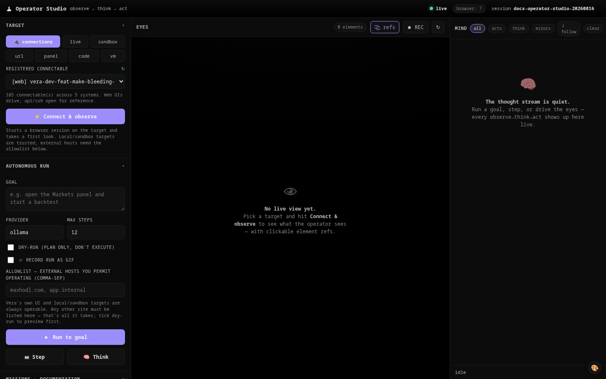

# 34 · Operator



The **operator** gives Vera hands and eyes on a web browser. It drives *any* web
page — and any machine whose desktop is served through a web page (noVNC,
Guacamole, code-server) — the way a person would: it **observes** (screenshot +
accessibility tree), **thinks** (an LLM picks the next action), and **acts**
(click, type, scroll, navigate), looping until the goal is met.

Like everything in Vera, the operator is **capabilities**: each primitive is a
singular tool you can call on its own, and together they compose into one
framework — a dedicated `operator.run` loop, an `operator` loop-profile for the
existing agent engine, and higher-level **missions**. The first mission,
`documentation`, is what screenshots this very UI and regenerates these docs.

> **TL;DR** — `operator.run(goal="…", target=…)` drives a browser to a goal.
> `docs.build` screenshots every panel and rebuilds the docs. Both are just
> capabilities: MCP, REST, the Operator Studio panel, or the `docgen` CLI.

---

## 1. Why

Vera already had a browser (Playwright, used by the research crawler) but no way
to *operate* an interface. Two needs converged:

1. **Self-documentation** — capture every panel, in populated states, and keep
   the docs' screenshots + capability tables current automatically.
2. **A general actuator** — a capability that can do "anything a person could do
   at a machine that presents a web UI": fill a form, run a remote IDE, click
   through a dashboard, operate a VM's browser console.

Documentation is therefore *a mission on top of a general operator*, not a
bespoke screenshot script.

---

## 2. Architecture

```
                    ┌──────────────── PRIMITIVES (toolkit) ─────────────────┐
 operator.session.* │  browser_engine.py   Playwright: 1 browser, 1         │
 operator.observe   │                      context+page per session          │
 operator.act       │  perception.py       hybrid observe →                 │
 operator.read      │                        {screenshot, refs[e1,e2…], text} │
                    │  actions.py          click/type/press/scroll/goto/…    │
                    │  safety.py           allowlist + dry-run + destructive  │
                    └───────────────▲───────────────────▲────────────────────┘
                                    │                    │  (both consume)
       dedicated driver   operator.run (operator_loop.py)   existing loops.run
       observe→think→act    thinker.py  (ollama / Claude)    via "operator" profile
                                    │
                    ┌──────────────── MISSIONS (applications) ───────────────┐
                    │  operator.mission.run("documentation", …)               │
                    │    ensure target → seed → screenshot every panel →      │
                    │    cap-tables + gallery  (docs.build is the alias)       │
                    │  (future: web RPA, QA flows, operate a VM …)            │
                    └─────────────────────────────────────────────────────────┘
```

Everything runs **host-side**: the browser lives wherever the operator runs and
points at a target *base URL* over HTTP. That target can be a loop-lab sandbox
(`:8998`), the live Vera (`:8999`), or any external site.

---

## 3. Perception — hybrid observe

Reliable acting needs more than pixels. Every `operator.observe` returns **both**:

- an **accessibility/DOM scan** — each interactive element gets a stable **ref**
  (`e1`, `e2`, …), its `role`, accessible `name`, `bbox` and `enabled` state. The
  scan tags each element with `data-vera-ref` in the page, so a ref resolves back
  to a deterministic locator (`[data-vera-ref="e12"]`) even if the DOM reshuffles.
- a **screenshot** — for vision reasoning and for opaque surfaces (a VM canvas has
  no DOM to speak of).

```jsonc
// operator.observe → 
{
  "url": "http://localhost:8998/ui/panel/window?id=markets-studio",
  "title": "Quant Studio",
  "elements": [
    {"ref":"e1","role":"button","name":"Run backtest","bbox":[24,80,120,32],"enabled":true},
    {"ref":"e2","role":"combobox","name":"Timeframe","bbox":[160,80,90,32],"enabled":true}
  ],
  "text": "Quant Studio … Strategies … Accounts …",
  "screenshot_url": "/operator/artifact?path=<session>/obs-….png"
}
```

The thinker reasons over the **ref list** by default (cheap, robust, model-agnostic)
and keeps the screenshot for the record and for vision-capable providers.

---

## 4. Actions

One unified surface — `operator.act(session_id, action, …)` — with ref-based
targeting and an `x,y` fallback for canvases/VMs:

| action | args | notes |
|---|---|---|
| `goto` | `url` | absolute or site-relative |
| `click` | `ref` \| `x,y` | ref preferred |
| `type` | `text`, `ref?`, `clear?`, `submit?` | `submit` presses Enter after |
| `press` | `key` | `Enter`, `Tab`, `Control+A` … |
| `scroll` | `dy?`, `dx?`, `ref?` | wheel, or scroll a ref into view |
| `hover` | `ref` \| `x,y` | reveal menus/tooltips |
| `select` | `ref`, `value?`/`label?` | `<select>` options |
| `wait` | `ms?`, `selector?` | fixed delay or await a selector |
| `nav` | `direction` | `back` / `forward` / `reload` |
| `done` | `summary?` | ends the loop |

`validate_action` checks structure before anything touches the page, so a
malformed decision is reported, not executed.

---

## 5. Safety — "do anything a person could" needs guardrails

Every act passes a policy check ([`safety.py`](../vera/operator/safety.py)):

- **Local / sandbox targets** (localhost, 127.0.0.1, `host.docker.internal`,
  `192.168.*`, `.local`) are trusted — acts run for real.
- **External hosts** must be in the mission/run **allowlist**, or the act is
  **blocked**.
- **Mutating** acts (click/type/press/select/goto/nav) on an external host need
  `allow_destructive` (or an interactive `confirm`); otherwise they're reported
  as needing confirmation.
- **`dry_run`** turns every mutating act into a plan-only note.
- Read-only acts (observe/scroll/wait/screenshot/hover) are always allowed.

Every step is emitted (`operator.step`, `operator.act`) so the Operator Studio
timeline — and the audit trail — show exactly what happened.

---

## 6. The loop, layered two ways

You chose a **layered** engine, so the same primitives drive two ways:

**Dedicated loop** — `operator.run(goal, target)` runs a bounded
observe→think→act loop ([`operator_loop.py`](../vera/operator/operator_loop.py)),
emitting each step, stopping on `done` / max-steps / a safety block / repeated
errors. The three phases are dependency-injected, which is also why the loop is
fully unit-tested with mocks.

```bash
curl -s localhost:8999/operator/run -H 'content-type: application/json' -d '{
  "goal": "open the Capabilities panel and read its title",
  "kind": "live", "provider": "ollama", "max_steps": 8
}'
```

**Existing agent engine** — the `operator` loop-profile
([`loop_profiles.py`](../vera/dag/loop_profiles.py)) scopes `allowed_caps` to the
operator primitives, so Vera's general `loops.run` engine can operate a UI with
its own planner/verifier when you want the heavier machinery.

### Think providers

`thinker.py` is provider-pluggable, exactly like evolve's critic/editor:

- `ollama` / `ollama:<model>` → the local cluster via `llm.generate`
- `anthropic:<model>` / `openai:<model>` / any stored provider id → `providers.chat`
  (sealed keys, usage + cost tracked)

Background operator runs are demoted off the GPU while a human is active (the
same interactive-priority rule the dream/v8 loops follow).

---

## 7. Targets

`target` says *what* to drive ([`targets.py`](../vera/operator/targets.py)):

| kind | meaning |
|---|---|
| `url` | any web page (`{"kind":"url","url":"https://…"}`) |
| `live` | this Vera's own UI |
| `sandbox` | a loop-lab sandbox Vera — boots it via `evolve.sandbox.ensure` (`:8998`) |
| `panel` | a specific Vera panel window (`{"panel_id":"markets-studio"}`) |
| `codeserver` | a browser-served IDE (`/vscode/{id}/`) |
| `vm` / `novnc` | a desktop served in-browser — acts fall back to `x,y` on the canvas |

The loop-lab sandbox is the default target for documentation: it's isolated
(its own Redis DB), reproducible, and never touches prod state.

---

## 7b. Connections — drive anything registered in Vera

The operator can reach **anything already registered across Vera's
infrastructure**, without duplicating a registry — the **connectors** layer
([`connectors.py`](../vera/operator/connectors.py)) just calls each subsystem's
own list cap and normalises the result:

| source | from | type | driveable |
|---|---|---|---|
| `integration` | Integrations Hub (`integration.list`) — apps in the stack | web | if `access.interact` & not sensitive |
| `ollama` | `ollama.instances` | api | reference (drive via `ollama.*`) |
| `node` | `nodes.list` (the unified machine registry) | web / ssh | web if it has an HTTP UI |
| `docker` | `docker.hosts.list` + `docker.ps` — containers with published ports | web | yes |
| `proxmox` | `proxmox.cluster.list` + guests → in-Vera noVNC console | vnc | if the guest is running |

`operator.connect.list` enumerates them all; `operator.connect(source, ref, goal?)`
opens a session on one (and optionally drives it). Web UIs — integration apps,
Docker web ports, Proxmox consoles, code-server — are **fully driven**
(observe→think→act); API/SSH endpoints are opened for reference (control them
through their own caps). Resolution is lazy, so a Proxmox console ticket is only
minted when you actually connect.

**Trust model:** registered connectables on the local/private network are
operable by default (the same rule the safety gate uses); external hosts still
need the allowlist; integration apps still respect the Hub's `access.interact`
gate. The Integrations Hub's own `integration.operate` routes through the same
operator loop.

In the **Operator Studio**, the target picker defaults to **🔌 connections** — a
grouped, searchable dropdown of everything you can reach (with `[web]`/`[api]`/
`[ssh]`/`[vnc]` tags); pick one and **Connect**.

---

## 8. The documentation mission

`operator.mission.run("documentation", …)` (alias **`docs.build`**):

1. **Ensure the target** — boot/attach a sandbox, or use `--base-url`.
2. **Discover** live panels (`/ui/panels`) and capabilities (`/mcp/tools`).
3. For each of the 34 **domains** ([`docs/domain_map.py`](../vera/operator/docs/domain_map.py)):
   - **seed** representative data (best-effort fixtures, [`missions/seeds.py`](../vera/operator/missions/seeds.py)) so panels render populated;
   - **screenshot** every matching panel (rendered standalone at
     `/ui/panel/window?id=…`) → `documentation/assets/<domain>/<panel>.png`;
   - collect the domain's **capabilities** into a reference table.
4. Refresh each doc's **managed auto-blocks** (only the regions between
   `<!-- VERA:AUTO:… -->` markers — authored prose is preserved), then rebuild
   the **gallery** (`documentation/README.md`) and an asset **manifest**.

> Seeds are intentionally light today (the plan: seeded fixtures now, scripted
> live scenarios once Vera's own flows are complete). Adding a richer scenario is
> just a new entry in `missions/seeds.py` + a `mode` on the domain.

### Generate the docs

```bash
# one-time: the browser extra
pip install -r requirements-operator.txt && playwright install chromium

# against a loop-lab sandbox (needs the orchestrator, which owns the sandbox):
python tools/vera-docgen/docgen.py run --sandbox --orchestrator http://localhost:8999

# or drive a live Vera directly (in-process; no orchestrator round-trip):
python tools/vera-docgen/docgen.py run --base-url http://localhost:8999

# a subset:
python tools/vera-docgen/docgen.py run --base-url http://localhost:8999 --only markets,dream,operator
```

Equivalent capability call: `POST /docs/build {"target":"sandbox"}`.

---

## 8b. GIFs, time-lapse & scripted tours

Static screenshots don't show a workflow *happening*. Three deterministic
(LLM-free) capture paths turn motion into docs:

**GIF of an operator run** — `operator.run` already saves one PNG per step, so
`operator.run(goal=…, record_gif=true)` assembles them into an animated GIF of
the whole observe→act sequence (returned as `gif`). Nearly free.

**Time-lapse of a long task** — sample a panel while something runs (a dream
cycle, a backtest, a loop):

```bash
operator.session.start kind=live panel_id=dream       # watch the Dream panel
operator.capture.start session_id=<sid> interval_ms=1000
… trigger the dream cycle (UI or a cap) …
operator.capture.stop  capture_id=<cid> domain=dream name=cycle
#   → documentation/assets/dream/cycle.gif  (or artifacts, served live, if no domain)
```

The Operator Studio's **⏺ REC** button does exactly this on the current session.

**Scripted tours** — a named, deterministic walkthrough that navigates, waits,
clicks labelled controls and captures stills + GIF clips the same way every time
([`tours.py`](../vera/operator/tours.py)):

```bash
operator.tour.list
operator.tour.run slug=markets target=sandbox
#   → assets/markets/overview.png + assets/markets/scan.gif
```

Steps are dicts or a compact mini-DSL — `goto`, `wait`, `scroll`, `shot`,
`gif_start`/`gif_stop`, `click_text` (match a control by its label), `type_text`,
`seed`. Because they're scripted, they're reproducible for a docs build (unlike
the LLM-driven `operator.run`).

**Capture directives in the docs** — drop a marker where an image belongs and
`docs.capture` fills it in, idempotently, preserving your prose
([`docs/directives.py`](../vera/operator/docs/directives.py)):

```html
<!-- VERA:CAPTURE panel="markets-studio" name="backtest" gif="true"
     steps="click_text Run backtest; gif_start; wait 3000; gif_stop backtest" -->
```

`docs.capture` navigates to the panel, runs the steps, captures a still or GIF,
and inserts/refreshes it in a managed `<!-- VERA:CAPTURED … -->` block right after
the directive. Omit `steps` to capture the panel as-loaded (or a default scroll
GIF with `gif="true"`).

---

## 9. Operator Studio panel

A dedicated tab (🕹 **Operator**) drives all of the above: pick a target, set a
goal, and watch the observe→think→act **timeline** (thoughts, chosen actions and
per-step screenshots) render live. The **Eyes** viewport shows the live page with
clickable element-ref overlays; **⏺ REC** captures a time-lapse GIF; a **Tour**
picker runs a scripted walkthrough; and buttons run the documentation mission,
fulfil `VERA:CAPTURE` directives, rebuild the gallery, and run the unit suite.
It's a standalone page served at `/operator/panel` and mounted as an iframe (so
its CSS never leaks into the harness).

---

## 10. Testing

The operator ships Vera's first unit suite ([`tests/`](../tests)), run in-process
with httpx's ASGI transport — **no live server or browser required**:

- `test_operator_perception` / `_actions` / `_safety` / `_thinker` / `_loop` —
  the pure primitives (ref maps, action validation, the safety gate, decision
  parsing, loop stop-conditions via mocks).
- `test_docgen` — domain-map integrity, managed-block round-trips, the gallery.
- `test_capabilities_contract` / `test_ui_panels` — every operator cap is
  registered and well-formed and every panel renders (these self-skip if the full
  runtime isn't installed).

```bash
make test-unit          # python -m pytest tests -q
# or via the capability:  POST /operator/test/run
```

A `@pytest.mark.browser` slot is reserved for real-Playwright tests where a
browser is present.

---

## 11. File map

| File | Role |
|---|---|
| [`vera/operator/browser_engine.py`](../vera/operator/browser_engine.py) | Playwright session/page lifecycle |
| [`vera/operator/perception.py`](../vera/operator/perception.py) | hybrid observe → refs + screenshot |
| [`vera/operator/actions.py`](../vera/operator/actions.py) | act primitives (ref + xy) |
| [`vera/operator/safety.py`](../vera/operator/safety.py) | allowlist / dry-run / destructive gate |
| [`vera/operator/thinker.py`](../vera/operator/thinker.py) | provider-pluggable decide step |
| [`vera/operator/operator_loop.py`](../vera/operator/operator_loop.py) | the observe→think→act driver |
| [`vera/operator/targets.py`](../vera/operator/targets.py) | target resolution (url/live/sandbox/vm/…) |
| [`vera/operator/connectors.py`](../vera/operator/connectors.py) | connect to anything registered (integrations/ollama/nodes/docker/proxmox) |
| [`vera/operator/capture.py`](../vera/operator/capture.py) | GIF assembly (Pillow) + time-lapse frame sampler |
| [`vera/operator/tours.py`](../vera/operator/tours.py) | deterministic scripted tours (stills + GIF clips) |
| [`vera/operator/docs/directives.py`](../vera/operator/docs/directives.py) | `VERA:CAPTURE` directive parse + insert |
| [`vera/operator/missions/`](../vera/operator/missions) | mission registry + `documentation` + seeds |
| [`vera/operator/docs/`](../vera/operator/docs) | domain map, doc scaffolder, gallery |
| [`vera/operator/operator_web_capabilities.py`](../vera/operator/operator_web_capabilities.py) | the `operator.*` / `docs.*` caps + panel |
| [`tools/vera-docgen/`](../tools/vera-docgen) | the `docgen` CLI |

---

## Screenshots

<!-- VERA:AUTO:screenshots START -->
_No screenshots captured yet — run `docs.build` (or `operator.mission.run documentation`)._
<!-- VERA:AUTO:screenshots END -->

## Capabilities

<!-- VERA:AUTO:capabilities START -->
_No capabilities resolved for this domain._
<!-- VERA:AUTO:capabilities END -->
