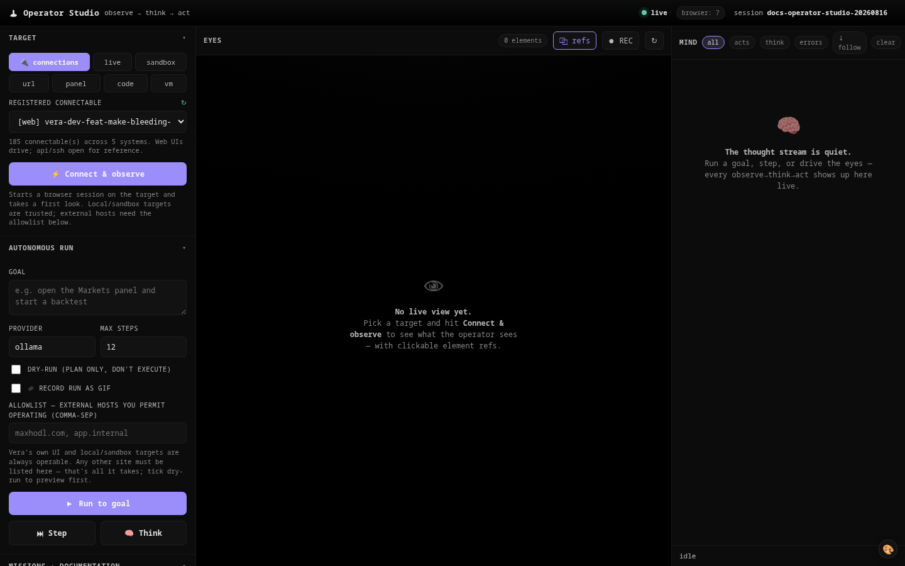
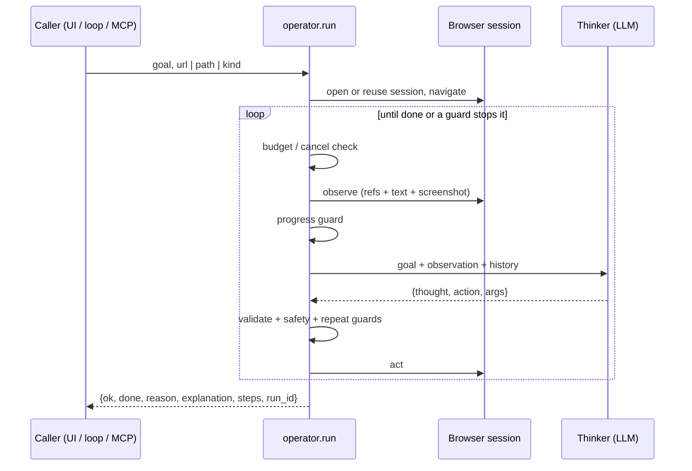

# 34 · Operator



The **operator** gives Vera hands and eyes on a web browser. It drives any web
page, and any machine whose desktop is served through a web page (noVNC,
Guacamole, code-server), the way a person would: it **observes** (screenshot
plus accessibility tree), **thinks** (an LLM picks the next action), and
**acts** (click, type, scroll, navigate), looping until the goal is met or a
guard stops it.

Like everything in Vera, the operator is a set of **capabilities**. Each
primitive can be called on its own, and together they form one framework: a
dedicated `operator.run` loop, an `operator` loop profile for the general
agent engine, deterministic **tours** and time-lapse capture, and higher-level
**missions**. The first mission, `documentation`, screenshots the UI and
refreshes the managed blocks in these docs. The code lives in
[`vera/operator/`](../vera/operator) with the CLI in
[`tools/vera-docgen/`](../tools/vera-docgen). The loop is in daily use by the
agentic loop for browser verification; much of its guard logic exists because
real runs stalled, so stop reasons and explanations are first-class output.

> [!TIP]
> `operator.run(goal="…", url=…)` drives a browser to a goal.
> `docs.build` screenshots every panel and rebuilds the docs. Both are
> capabilities, reachable over MCP, REST, the Operator Studio panel, or the
> `docgen` CLI.

## Contents

- [1. Why](#1-why)
- [2. Architecture](#2-architecture)
  - [Discovery evidence](#discovery-evidence)
- [3. Perception — hybrid observe](#3-perception--hybrid-observe)
- [4. Actions](#4-actions)
- [5. Safety](#5-safety)
- [6. The loop, layered two ways](#6-the-loop-layered-two-ways)
  - [Think providers](#think-providers)
- [7. Run lifecycle, budgets and stop reasons](#7-run-lifecycle-budgets-and-stop-reasons)
  - [Stop reasons](#stop-reasons)
  - [Guards](#guards)
  - [Choosing the page when the caller does not say](#choosing-the-page-when-the-caller-does-not-say)
  - [Run history, trace and cancel](#run-history-trace-and-cancel)
- [8. Targets](#8-targets)
- [9. Connections — drive anything registered in Vera](#9-connections--drive-anything-registered-in-vera)
- [10. Sessions and browser lifecycle](#10-sessions-and-browser-lifecycle)
- [11. The documentation mission](#11-the-documentation-mission)
- [12. GIFs, time-lapse and scripted tours](#12-gifs-time-lapse-and-scripted-tours)
- [13. Representative screenshots and readiness](#13-representative-screenshots-and-readiness)
- [14. Operator Studio panel](#14-operator-studio-panel)
- [15. Capability reference](#15-capability-reference)
- [16. Configuration](#16-configuration)
- [17. Testing](#17-testing)
- [18. Troubleshooting](#18-troubleshooting)
- [19. File map](#19-file-map)
- [Related pages](#related-pages)
- [Screenshots](#screenshots)
- [Capabilities](#capabilities)

---

## 1. Why

Vera already had a browser (Playwright, used by the research crawler) but no
way to *operate* an interface. Two needs converged:

1. **Self-documentation**: capture every panel in a populated state, and keep
   the docs' screenshots and capability tables current automatically.
2. **A general actuator**: a capability that can do what a person could do at a
   machine that presents a web UI, such as filling a form, running a remote IDE,
   clicking through a dashboard, or operating a VM's browser console. The
   agentic loop also uses it to verify that a page it just built really works.

Documentation is therefore a mission on top of a general operator, not a
bespoke screenshot script.

---

## 2. Architecture

```
                    ┌──────────────── PRIMITIVES (toolkit) ─────────────────┐
 operator.session.* │  browser_engine.py   Playwright: 1 browser, 1         │
 operator.observe   │                      context+page per session          │
 operator.act       │  perception.py       hybrid observe →                 │
 operator.read      │                        {screenshot, refs[e1,e2…], text} │
                    │  actions.py          click/type/press/scroll/goto/…    │
                    │  safety.py           allowlist + dry-run + destructive  │
                    └───────────────▲───────────────────▲────────────────────┘
                                    │                    │  (both consume)
       dedicated driver   operator.run (operator_loop.py)   existing loops.run
       observe→think→act    thinker.py  (ollama / providers)  via "operator" profile
                            + budget / progress / repeat guards
                                    │
                    ┌──────────────── MISSIONS (applications) ───────────────┐
                    │  operator.mission.run("documentation", …)               │
                    │    ensure target → seed → screenshot every panel →      │
                    │    cap-tables + gallery  (docs.build is the alias)       │
                    └─────────────────────────────────────────────────────────┘
```

Everything runs **host-side**: the browser lives wherever the operator runs and
points at a target base URL over HTTP. That target can be a Loop Lab sandbox,
the live Vera, or any external site.


```mermaid
sequenceDiagram
  participant C as Caller (UI / loop / MCP)
  participant R as operator.run
  participant B as Browser session
  participant T as Thinker (LLM)
  C->>R: goal, url | path | kind
  R->>B: open or reuse session, navigate
  loop until done or a guard stops it
    R->>R: budget / cancel check
    R->>B: observe (refs + text + screenshot)
    R->>R: progress guard
    R->>T: goal + observation + history
    T-->>R: {thought, action, args}
    R->>R: validate + safety + repeat guards
    R->>B: act
  end
  R-->>C: {ok, done, reason, explanation, steps, run_id}
```

### Discovery evidence

Operator Studio also has a read-only **Discovery evidence** section. It shows
the newest discovery routes and recorded context-benchmark comparisons using a
bounded in-memory projection. Route cards show candidate, output and failure
counts and the assigned resource and worker identities. Benchmark cards show
the baseline and candidate, nDCG, time-to-first-useful-context p95,
observation count, pass state and blockers.

`operator.discovery.evidence` reads this projection, and
`operator.discovery.benchmark.record` accepts a comparison already computed by
the offline benchmark. Neither capability contacts a source, runs a model,
starts discovery, or activates a benchmark winner. Query text, retrieved
content and per-record payloads are deliberately absent.

---

## 3. Perception — hybrid observe

Reliable acting needs more than pixels. Every `operator.observe` returns
**both**:

- an **accessibility/DOM scan**: each interactive element gets a stable **ref**
  (`e1`, `e2`, …), its `role`, accessible `name`, `bbox` and `enabled` state.
  The scan tags each element with `data-vera-ref` in the page, so a ref
  resolves back to a deterministic locator (`[data-vera-ref="e12"]`) even if the
  DOM reshuffles;
- a **screenshot**, for vision reasoning and for opaque surfaces (a VM canvas
  has no DOM to speak of).

```jsonc
// operator.observe →
{
  "url": "http://localhost:8998/ui/panel/window?id=markets-studio",
  "title": "Quant Studio",
  "elements": [
    {"ref":"e1","role":"button","name":"Run backtest","bbox":[24,80,120,32],"enabled":true},
    {"ref":"e2","role":"combobox","name":"Timeframe","bbox":[160,80,90,32],"enabled":true}
  ],
  "text": "Quant Studio … Strategies … Accounts …",
  "screenshot_url": "/operator/artifact?path=<session>/obs-….png"
}
```

The thinker reasons over the **ref list** by default (cheap, robust and
model-agnostic) and keeps the screenshot for the record and for
vision-capable providers. Screenshots and other artifacts are served by
`GET /operator/artifact?path=…`.

---

## 4. Actions

One unified surface, `operator.act(session_id, action, …)`, with ref-based
targeting and an `x,y` fallback for canvases and VMs. The action set is
defined in `actions.ACTIONS`:

| Action | Args | Notes |
|---|---|---|
| `goto` | `url` | Absolute or site-relative |
| `click` | `ref` \| `x,y` | Ref preferred |
| `type` | `text`, `ref?`, `clear?`, `submit?` | `submit` presses Enter after |
| `press` | `key` | `Enter`, `Tab`, `Control+A` … |
| `scroll` | `dy?`, `dx?`, `ref?` | Wheel, or scroll a ref into view |
| `hover` | `ref` \| `x,y` | Reveal menus and tooltips |
| `select` | `ref`, `value?` / `label?` | `<select>` options |
| `wait` | `ms?`, `selector?` | Fixed delay or wait for a selector |
| `nav` | `direction` | `back` / `forward` / `reload` |
| `screenshot` | — | Fresh screenshot (observe captures one anyway) |
| `done` | `summary?` | Ends the loop |

`MUTATING_ACTIONS` = `click`, `type`, `press`, `select`, `goto`, `nav`.
`validate_action` checks structure before anything touches the page, so a
malformed decision is reported, not executed.

---

## 5. Safety

Every act passes a policy check in [`safety.py`](../vera/operator/safety.py):

- **Local and sandbox targets** are trusted and acts run for real: hosts
  `localhost`, `127.0.0.1`, `0.0.0.0`, `::1`, `host.docker.internal`,
  `vera-dev`, anything ending in `.local`, and the private ranges `192.168.*`,
  `10.*`, `172.16.*`, `172.17.*`. A relative or same-origin URL also counts as
  local.
- **Non-network pages** (`about:`, `data:`, `blob:`, `javascript:`,
  `chrome-error:`, `chrome:`, `edge:`) have no host to allowlist and are
  treated like a blank page, so a fresh session on `about:blank` is never
  blocked.
- **External hosts** must be in the mission or run **allowlist** (exact host,
  `*`, or `*.domain` patterns), or the act is **blocked**.
- **Mutating** acts on an external host need `allow_destructive` (or an
  interactive confirm); otherwise they are reported as needing confirmation.
- **`dry_run`** turns every mutating act into a plan-only note.
- Read-only acts (observe, scroll, wait, screenshot, hover) are always allowed.

A safety block is terminal for the run (`reason: "blocked"`). Every step is
emitted (`operator.step`, `operator.act`) so the Operator Studio timeline and
the audit trail show exactly what happened.

The Operator capability family also declares Capability Contract metadata
(see [Capability Contracts](./43-capability-contracts.md)). The contract
separates observation and inventory reads from browser execution, external
side effects, model use, repository or artifact writes, and subprocess
execution, and states the session, target, destructive-action, write and
repository-execution policy boundary. For example `operator.run` declares
`approval = session_policy_and_destructive_confirmation`,
`network = session_allowlist`, `idempotency = non_idempotent` and
`cancellation = cooperative_between_steps`. These declarations describe risk;
they do not replace the native allowlist, `dry_run`, destructive confirmation,
action timeouts, or cooperative cancellation that actually control the run.

---

## 6. The loop, layered two ways

The same primitives drive two engines.

**Dedicated loop.** `operator.run(goal, target)` runs a bounded
observe→think→act loop in [`operator_loop.py`](../vera/operator/operator_loop.py).
The three phases are dependency-injected, which is why the loop is fully
unit-tested with mocks.

```bash
curl -s localhost:8999/operator/run -H 'content-type: application/json' -d '{
  "goal": "open the Capabilities panel and read its title",
  "kind": "live", "provider": "ollama", "max_steps": 8
}'
```

Key inputs: `goal` (required), `url` or `kind` + `base_url`, `path` (a file in
a session sandbox), `sandbox_session`, `provider`, `model`, `max_steps`
(default 15), `max_seconds`, `progress_tolerance`, `session_id` (reuse),
`allowlist`, `dry_run`, `allow_destructive`, `keep_open`, `branch`,
`panel_id`, `record_gif`, `think`.

Output: `{ok, done, reason, summary, explanation?, error?, steps, step_count, screenshots, run_id}`.
`ok` is true **only** when the run reached `done`. A run that hit a ceiling is
reported as not-ok, and `explanation` (copied into `error`) carries the loop's
own account of why it stopped, such as which page did not change and what was
tried.

**General agent engine.** The `operator` loop profile in
[`loop_profiles.py`](../vera/dag/loop_profiles.py) ("Web Operator") scopes
`allowed_caps` to `operator.session.start`, `.status`, `.close`,
`operator.observe`, `operator.read`, `operator.screenshot`, `operator.act` and
`operator.think`, with `max_steps` 16, so `loops.run(profile="operator")` can
operate a UI with its own planner and verifier. The separate `operator-infra`
profile administers containers, guests and SSH hosts using the host-level
`operator.sysinfo` / `.services` / `.pkg` capabilities from
`vera/remote/operator_capabilities.py`; those are documented with
[Infrastructure and Provisioning](./35-infrastructure-provisioning.md).

### Think providers

`thinker.py` is provider-pluggable, like Evolve's critic and editor:

- `ollama` / `ollama:<model>` uses the local cluster via `llm.generate`;
- `anthropic:<model>`, `openai:<model>` or any stored provider id uses
  `providers.chat` (sealed keys, usage and cost tracked).

The model must answer with exactly one JSON object
`{thought, action, args, done}`. The think step is routed as job type
`VERA_OPERATOR_THINK_JOB` (default `loop_executor`) so it shares the agent
loop executor's model and context window rather than forcing a model reload,
and is capped at `VERA_OPERATOR_THINK_TOKENS` (default 2048) tokens. Up to
`VERA_OPERATOR_THINK_ERROR_LIMIT` (default 3) consecutive unparseable replies
are tolerated before the run stops with `think_error`. When the previous
thought claimed success but the action was not `done`, `completion.py` adds a
nudge to the next prompt so a finished run actually stops. Background operator
runs are demoted off the GPU while a person is actively using Vera.

---

## 7. Run lifecycle, budgets and stop reasons

### Stop reasons

| `reason` | Meaning |
|---|---|
| `done` | The model reported the goal complete (the only `ok: true` outcome) |
| `max_steps` | Step ceiling reached |
| `time_budget` | Wall-clock budget spent (checked before each step) |
| `no_progress` | The page did not change across the tolerated number of acts |
| `repeating_action` | The same action kept being repeated with no structural change |
| `too_many_errors` | Too many consecutive invalid decisions or failed acts |
| `think_error` | Consecutive unusable model replies |
| `observe_error` | The page could not be observed |
| `blocked` | A safety block |
| `cancelled` | Cooperative cancel via `operator.cancel` |

### Guards

| Guard | Module | Default | Behaviour |
|---|---|---|---|
| Time budget | `operator_budget.py` | 480 s per `operator.run` | A caller may extend it with `max_seconds` but not shrink it below 480 s |
| Step budget | `operator_step_budget.py` | 600 s per agent-loop step (`VERA_OPERATOR_STEP_BUDGET_S`) | All browser calls in one loop step (`operator.run`, `operator.act`, `operator.step`, `browser.navigate`) share one allowance; when it is spent the next call is refused with what was already learned |
| Progress | `operator_progress.py` | 5 unchanged acts | Judges the page (URL, title, element refs and text), not the action. A navigation, re-render, dialog or new control resets the counter |
| Consecutive repeat | `operator_loop.py` | 5 (`VERA_OPERATOR_REPEAT_LIMIT`) | Identical action + args + URL repeated in a row |
| Structural repeat | `repeat_guard.py` | 5 (`VERA_OPERATOR_REPEAT_TOTAL`) | The same action repeated, even non-adjacently, on a page whose structure (URL, title, refs, text excluded) never changes. Catches thrashing on a live page whose text keeps moving |
| Navigation pin | `nav_pin.py` | — | When the run was aimed at one file served from a sandbox, navigating away returns an error to the model instead of leaving the page |
| Done short-circuit | `browser_done_core.py` | — | In the agentic loop, a browser result that says `done` is the step's answer; re-issuing the browser gets that result back once with a note, and a second re-issue ends the step |

### Choosing the page when the caller does not say

Runs that start on the wrong page waste their whole budget, so target
resolution goes, in order:

1. an explicit `url`;
2. an explicit `path`, resolved to the sandbox preview URL
   `/remote/sandbox/preview/{session}/{path}` (`sandbox_file_target.py`);
3. a filename named in the goal sentence (`goal_file.py`);
4. the single page the current session actually wrote, from the exec artifact
   listing (`nav_fallback.py`);
5. otherwise the orchestrator root.

When a reused session is already open on another page, `session_target.py`
navigates it to the requested URL rather than silently inheriting the previous
run's page. When no sandbox is named and the primary sandbox is occupied,
`target_fallback.py` prefers a running **pinned** sandbox; an explicitly named
branch is matched exactly or not at all, because a browser session clicks
things and must never be substituted onto a container the caller did not ask
for.

### Run history, trace and cancel

Every run event is persisted as well as emitted:

| Redis key | Content | Retention |
|---|---|---|
| `vera:operator:events:<run_id>` | Event list for one run | Last 2000 events, 14-day TTL |
| `vera:operator:runs` | Sorted set of run ids by start time | Newest 500 |
| `vera:operator:cancel:<run_id>` | Cooperative cancel flag | 6-hour TTL |

- `operator.runs` lists recent runs with goal, target, steps, errors, repeated
  actions, whether the step ceiling was hit, and duration.
- `operator.trace(run_id)` folds one run's events into a diagnostic digest
  (`operator_trace_core.py`). It offers no verdict of its own: the run's
  `reason` is recorded as what the run claimed, next to the evidence.
- `operator.cancel(run_id)` sets the flag; the loop checks it between steps, so
  a run started by another process, or orphaned by a restart, can still be
  stopped.

Operator runs also appear in Vera's shared, read-only Run catalog through
`operator_run_projection.py` (schema `vera.operator-run-projection/v1`). The
native loop and Redis records stay authoritative; the projection contributes
parent and step status and screenshot artifact references for Activity, graph
and telemetry views, and omits the goal, page text, model thoughts and action
arguments. `done` maps to success, `cancelled` to cancelled and `time_budget`
to a timeout.

---

## 8. Targets

`target` says what to drive ([`targets.py`](../vera/operator/targets.py)):

| Kind | Meaning |
|---|---|
| `url` | Any web page (`{"kind":"url","url":"https://…"}`) |
| `live` | This Vera's own UI |
| `sandbox` | A Loop Lab sandbox Vera, booted or attached via `evolve.sandbox.ensure` |
| `panel` | A specific Vera panel window (`{"panel_id":"markets-studio"}`) |
| `codeserver` | A browser-served IDE (`/vscode/{id}/`) |
| `vm` / `novnc` / `desktop` | A desktop served in-browser; acts fall back to `x,y` on the canvas |
| `integration` / `ollama` / `node` / `docker` / `proxmox` | A registered connectable ([§9](#9-connections--drive-anything-registered-in-vera)) |

The sandbox is the default target for documentation: it is isolated (its own
Redis DB), reproducible, and never touches production state.

---

## 9. Connections — drive anything registered in Vera

The operator can reach anything already registered across Vera's
infrastructure without keeping its own registry. The **connectors** layer
([`connectors.py`](../vera/operator/connectors.py)) calls each subsystem's own
list capability and normalises the result:

| Source | From | Type | Driveable |
|---|---|---|---|
| `integration` | Integrations Hub (`integration.list`) | web | If `access.interact` and not sensitive |
| `ollama` | `ollama.instances` | api | Reference only (drive via `ollama.*`) |
| `node` | `nodes.list` (the unified machine registry) | web / ssh | Web if it has an HTTP UI |
| `docker` | `docker.hosts.list` + `docker.ps` (containers with published ports) | web | Yes |
| `proxmox` | `proxmox.cluster.list` + guests, via the in-Vera noVNC console | vnc | If the guest is running |

`operator.connect.list` enumerates them; `operator.connect(source, ref, goal?)`
opens a session on one and optionally drives it. Web UIs (integration apps,
Docker web ports, Proxmox consoles, code-server) are fully driven; API and SSH
endpoints are opened for reference and controlled through their own
capabilities. Resolution is lazy, so a Proxmox console ticket is only minted
when you actually connect.

**Trust model:** registered connectables on the local or private network are
operable by default (the same rule as the safety gate); external hosts still
need the allowlist; integration apps still respect the Hub's
`access.interact` gate. The Integrations Hub's own `integration.operate` routes
through the same operator loop.

In Operator Studio the target picker defaults to **🔌 connections**, a grouped,
searchable dropdown tagged `[web]` / `[api]` / `[ssh]` / `[vnc]`. The inventory
is treated as an independent read model: the selector stays disabled while it
is loading or unavailable, a failure is shown as a retryable error, and an
authoritative empty list is shown separately as "no registered connections".

---

## 10. Sessions and browser lifecycle

`browser_engine.py` runs one Chromium with one context and page per session.
Install the browser extra with `pip install -r requirements-operator.txt` and
`playwright install chromium`; without Playwright the session capabilities
return a clear install message.

A scheduled sweep (`operator_session_sweep`, every 300 s) closes sessions idle
for longer than `VERA_OPERATOR_SESSION_IDLE_S` (default 1800 s) and shuts the
browser once it has had no sessions for `VERA_OPERATOR_BROWSER_LINGER_S`
(default 300 s). Set the idle value to `0` to disable the sweep. Each sweep that
closes something emits `operator.session.swept`. This matters because
`keep_open` sessions and `operator.session.start` hand the session to a caller
who may never close it.

---

## 11. The documentation mission

`operator.mission.run("documentation", …)` (alias **`docs.build`**). The
mission registry currently holds only `documentation`.

1. **Ensure the target**: boot or attach a sandbox, or use `base_url`.
2. **Discover** live panels (`/ui/panels`) and capabilities (`/mcp/tools`).
3. For each registered documentation domain in
   [`docs/domain_map.py`](../vera/operator/docs/domain_map.py) (slug, doc file,
   capability prefixes, panel ids, seed):
   - **seed** representative data (best-effort fixtures in
     [`missions/seeds.py`](../vera/operator/missions/seeds.py)) so panels render
     populated;
   - **screenshot** every matching panel, rendered standalone at
     `/ui/panel/window?id=…`, to `documentation/assets/<domain>/<panel>.png`;
   - collect the domain's **capabilities** into a reference table.
4. Refresh each doc's **managed auto-blocks** (only the regions between
   `<!-- VERA:AUTO:… -->` markers; authored prose is preserved), then rebuild
   the gallery (`documentation/GALLERY.md`) and an asset manifest.

Progress is emitted as `operator.docs.progress`.

> [!NOTE]
> Seeds are intentionally light. Adding a richer scenario is a new entry in
> `missions/seeds.py` plus a `mode` on the domain.

### Generate the docs

```bash
# one-time: the browser extra
pip install -r requirements-operator.txt && playwright install chromium

# against a Loop Lab sandbox (needs the orchestrator, which owns the sandbox):
python tools/vera-docgen/docgen.py run --sandbox --orchestrator http://localhost:8999

# or drive a live Vera directly (in-process; no orchestrator round-trip):
python tools/vera-docgen/docgen.py run --base-url http://localhost:8999

# a subset, or docs only without screenshots:
python tools/vera-docgen/docgen.py run --base-url http://localhost:8999 --only markets,dream,operator
python tools/vera-docgen/docgen.py run --base-url http://localhost:8999 --no-capture

# utilities
python tools/vera-docgen/docgen.py gallery     # rebuild the gallery from the manifest
python tools/vera-docgen/docgen.py test -k operator
```

`shots` is an alias for `run`. Equivalent capability call:
`POST /docs/build {"target":"sandbox"}`.

---

## 12. GIFs, time-lapse and scripted tours

Static screenshots do not show a workflow happening. Three deterministic,
LLM-free capture paths turn motion into docs.

**GIF of an operator run.** `operator.run` already saves one PNG per step, so
`operator.run(goal=…, record_gif=true)` assembles them into an animated GIF
(`gif_duration_ms` per frame, default 900) returned as `gif`.

**Time-lapse of a long task.** Sample a panel while something runs:

```bash
operator.session.start kind=live panel_id=dream       # watch the Dream panel
operator.capture.start session_id=<sid> interval_ms=1000
… trigger the dream cycle (UI or a cap) …
operator.capture.stop  capture_id=<cid> domain=dream name=cycle
#   → documentation/assets/dream/cycle.gif  (or a served artifact if no domain)
```

The Operator Studio **⏺ REC** button does exactly this on the current session.

**Scripted tours.** A named, deterministic walkthrough that navigates, waits,
clicks labelled controls and captures stills and GIF clips the same way every
time ([`tours.py`](../vera/operator/tours.py)). Built-in tours: `markets`,
`dream`, `dag-engine`, `operator`.

```bash
operator.tour.list
operator.tour.run slug=markets target=sandbox
#   → assets/markets/overview.png + assets/markets/scan.gif
```

Steps are dicts or a compact mini-DSL: `goto`, `wait`, `scroll`, `shot`,
`gif_start` / `gif_stop`, `click_text` (match a control by its label),
`type_text`, `seed`.

**Capture directives in the docs.** Drop a marker where an image belongs and
`docs.capture` fills it in, idempotently, preserving your prose
([`docs/directives.py`](../vera/operator/docs/directives.py)):

```html
<!-- VERA:CAPTURE panel="markets-studio" name="backtest" gif="true"
     steps="click_text Run backtest; gif_start; wait 3000; gif_stop backtest" -->
```

`docs.capture` navigates to the panel, runs the steps, captures a still or GIF,
and inserts or refreshes it in a managed `<!-- VERA:CAPTURED … -->` block right
after the directive. Omit `steps` to capture the panel as loaded (or a default
scroll GIF with `gif="true"`).

---

## 13. Representative screenshots and readiness

A useful screenshot is evidence of a working feature, not merely proof that its
route returned HTML. Many panels are workbenches whose landing view is a menu,
an empty shell or a loading state, so the documentation mission supports
declarative per-panel **capture states** in `docs/domain_map.py`:

| Field | Purpose |
|---|---|
| `name` | Stable filename suffix, allowing several views of one panel |
| `label` / `caption` | Heading and explanation in the guide |
| `click` | Trusted CSS selector for the subview to open |
| `capture_path` | Same-origin route for an injected panel whose wrapper has no UI |
| `ready_selector` | Element that must be visible before capture |
| `ready_text` | Element whose non-placeholder text proves data arrived |
| `settle_ms` | Extra time for charts, graph layout and streamed state |
| `full_page` | Override the mission-wide viewport policy |

Data Fabric is captured in Graph, Sources and Statistics states; Memory Graph,
Galaxy, WorldView and Vector Browser also declare representative views. The
Graph recipe opens `#fnav-graph`, waits for the rendered canvas and its
node/edge summary, then lets the force layout settle. A `capture_path` must be
an absolute same-origin path; external URLs are rejected. Recipes are
structured rather than arbitrary JavaScript, so they stay reviewable and
deterministic.

### Readiness contract

Before writing a PNG the operator waits for DOM content, best-effort network
idle, meaningful body content, the recipe's visible selector, non-placeholder
result text when configured, fonts and images, and a final settling interval.
WebSocket-backed pages may never become network-idle, so explicit per-panel
evidence is authoritative. A configured selector or text check is mandatory:
if it times out, no replacement PNG is written and the exact condition is
reported (for example `selector:#fgGraphHost canvas`). Without a recipe,
meaningful rendered body content is mandatory. Network idle and asset settling
are diagnostics, not blockers.

### Capture output and preservation

- Screenshots live under `documentation/assets/<domain>/`.
- `manifest.json` records panel state, source panel, route, capture mode, and
  the readiness evidence behind each successful capture.
- The mission result includes `capture_failures` (domain, panel, shot, failed
  condition), so automation can tell an incomplete capture from a rendered one.
- Operator Studio shows complete, partial and failed builds separately. A
  partial build keeps its diagnostics visible and offers the existing gallery
  explicitly instead of replacing the failure report.
- Authored prose is preserved; only managed image and capability blocks
  refresh. `documentation/README.md` is never generated over; the replaceable
  card index is `documentation/GALLERY.md` (`docs.gallery` rebuilds it).
- Selective runs merge manifest entries rather than dropping unrelated ones.

---

## 14. Operator Studio panel

A dedicated tab (**Operator**, panel id `operator-studio`) drives all of the
above: pick a target, set a goal, and watch the observe→think→act **timeline**
(thoughts, chosen actions and per-step screenshots) render live. The **Eyes**
viewport shows the live page with clickable element-ref overlays; **⏺ REC**
captures a time-lapse GIF; a **Tour** picker runs a scripted walkthrough; and
buttons run the documentation mission, fulfil `VERA:CAPTURE` directives,
rebuild the gallery, and run the unit suite. It is a standalone page served at
`/operator/panel` and mounted as an iframe, so its CSS never leaks into the
harness.

---

## 15. Capability reference

All routes are under the orchestrator (default port 8999).

**Sessions and primitives**

| Capability | Route | Purpose |
|---|---|---|
| `operator.session.start` | `POST /operator/session/start` | Open a browser session on a target (`url`, `kind`, `source`+`ref`, viewport default 1440×900) |
| `operator.session.status` | `GET /operator/session/status` | One session or all |
| `operator.session.close` | `POST /operator/session/close` | Close a session and free its page |
| `operator.observe` | `POST /operator/observe` | Screenshot + element refs + visible text |
| `operator.read` | `POST /operator/read` | Page text (whole body or a CSS selector) |
| `operator.screenshot` | `POST /operator/screenshot` | Capture a screenshot |
| `operator.act` | `POST /operator/act` | Perform one action, through the safety gate |
| `operator.think` | `POST /operator/think` | Observe once and let the LLM pick an action without performing it |
| `operator.step` | `POST /operator/step` | One observe→think→act tick |

**Runs**

| Capability | Route | Purpose |
|---|---|---|
| `operator.run` | `POST /operator/run` | Drive a browser to a goal ([§6](#6-the-loop-layered-two-ways)) |
| `operator.runs` | `GET /operator/runs` | Recent runs, newest first (`limit` default 30) |
| `operator.trace` | `GET /operator/trace` | Diagnostic digest of one run |
| `operator.cancel` | `POST /operator/cancel` | Set the cooperative cancel flag |
| `operator.connect.list` | `GET /operator/connect/list` | Every registered connectable |
| `operator.connect` | `POST /operator/connect` | Open (and optionally drive) a connectable |

**Missions, docs and capture**

| Capability | Route | Purpose |
|---|---|---|
| `operator.mission.list` | `GET /operator/mission/list` | Available missions |
| `operator.mission.run` | `POST /operator/mission/run` | Run a named mission |
| `docs.build` | `POST /docs/build` | Alias for the documentation mission |
| `docs.assets` | `GET /docs/assets` | Captured documentation images |
| `docs.capture` | `POST /docs/capture` | Fulfil `VERA:CAPTURE` directives |
| `docs.gallery` | `POST /docs/gallery` | Rebuild `GALLERY.md` from the last manifest |
| `operator.capture.start` / `.status` / `.stop` | `POST /operator/capture/start`, `GET …/status`, `POST …/stop` | Time-lapse capture to GIF |
| `operator.tour.list` / `operator.tour.run` | `GET /operator/tour/list`, `POST /operator/tour/run` | Scripted tours |
| `operator.test.run` | `POST /operator/test/run` | Run the pytest suite (`path` default `tests`, optional `k`, 600 s timeout) |

**Discovery evidence**

| Capability | Route | Purpose |
|---|---|---|
| `operator.discovery.evidence` | `GET /operator/discovery/evidence` | Bounded, payload-free discovery and benchmark evidence |
| `operator.discovery.benchmark.record` | `POST /operator/discovery/benchmark/record` | Record a precomputed benchmark comparison |

HTTP-only routes: `GET /operator/panel`, `GET /operator/artifact`,
`GET /docs/asset`.

**Events:** `operator.session`, `operator.step`, `operator.act`,
`operator.run`, `operator.capture`, `operator.tour`, `operator.docs.progress`,
`operator.session.swept`.

---

## 16. Configuration

| Variable | Default | Effect |
|---|---|---|
| `VERA_OPERATOR_REPEAT_LIMIT` | `5` (min 2) | Consecutive identical-action limit |
| `VERA_OPERATOR_REPEAT_TOTAL` | `5` (min 2) | Structural repeat limit |
| `VERA_OPERATOR_THINK_ERROR_LIMIT` | `3` | Consecutive unusable think replies before `think_error` |
| `VERA_OPERATOR_THINK_TOKENS` | `2048` | Max tokens per think |
| `VERA_OPERATOR_THINK_JOB` | `loop_executor` | Router job type for the think step |
| `VERA_OPERATOR_STEP_BUDGET_S` | `600` | Browser seconds per agent-loop step |
| `VERA_OPERATOR_SESSION_IDLE_S` | `1800` | Idle session sweep threshold (`0` disables) |
| `VERA_OPERATOR_BROWSER_LINGER_S` | `300` | Browser shutdown after the last session closes |
| `VERA_ORCH_PORT` | — | Orchestrator port used when building sandbox preview links for `path` targets |

The per-run time budget (480 s) and progress tolerance (5) are code defaults,
adjustable per call with `max_seconds` and `progress_tolerance`.

---

## 17. Testing

The operator's primitives and guards are covered by in-process unit tests
under [`tests/`](../tests), run with httpx's ASGI transport, so **no live
server or browser is required**:

- primitives: `test_operator_perception`, `_actions`, `_safety`, `_thinker`,
  `_loop`;
- guards and outcomes: `test_operator_budget`, `_step_budget`, `_progress`,
  `_repeat_guard`, `_repeat_structural`, `_nav_pin`, `_nav_fallback`,
  `_target_fallback`, `_target_resolution`, `_says_done`, `_run_outcome`,
  `_think_budget`, `_think_recovery`, `_cancel`, `_session_sweep`;
- history and projection: `test_operator_trace_core`, `_trace_seen`,
  `_run_projection`;
- docs: `test_docgen`, `test_operator_documentation_readiness`;
- contracts: `test_operator_capability_contracts`.

```bash
make test-unit          # python -m pytest tests -q
# or via the capability:  POST /operator/test/run
```

A `@pytest.mark.browser` slot is reserved for real-Playwright tests where a
browser is present.

---

## 18. Troubleshooting

| Symptom | Check |
|---|---|
| Run ends `time_budget` or `max_steps` on Vera's dashboard | It started on the wrong page. Pass `url` or `path`, or name the file in the goal |
| Run ends `blocked` | The host is external and not in `allowlist`, or a mutating act needs `allow_destructive` |
| Run ends `no_progress` / `repeating_action` | The page never responds to the chosen action; read `explanation` and `operator.trace` before retrying |
| Run ends `think_error` | The model is not returning JSON; try another `provider` / `model` |
| "Playwright is not installed" | Install `requirements-operator.txt` and `playwright install chromium` |
| Memory grows with many sessions | Ensure the session sweep is enabled; close `keep_open` sessions |
| Blank shell screenshot | Add a capture state that opens the actual subview |
| Spinner or placeholder in a screenshot | Add `ready_selector`, `ready_text`, or a larger `settle_ms` |
| Panel looks degraded | Ensure `panel_capture_url` found the real iframe route |
| No screenshots at all | Install the operator requirements, Chromium and its OS dependencies |
| Graph has no nodes | Add an isolated seed; never seed production for documentation |
| Partial run changes navigation | The gallery belongs in `GALLERY.md`, not `README.md` |

---

## 19. File map

| File | Role |
|---|---|
| [`browser_engine.py`](../vera/operator/browser_engine.py) | Playwright session/page lifecycle and idle sweep |
| [`perception.py`](../vera/operator/perception.py) | Hybrid observe → refs + screenshot |
| [`actions.py`](../vera/operator/actions.py) | Action set and primitives (ref + xy) |
| [`safety.py`](../vera/operator/safety.py) | Allowlist / dry-run / destructive gate |
| [`thinker.py`](../vera/operator/thinker.py) | Provider-pluggable decide step |
| [`completion.py`](../vera/operator/completion.py) | Nudge when the model already claimed success |
| [`operator_loop.py`](../vera/operator/operator_loop.py) | The observe→think→act driver and stop reasons |
| [`operator_budget.py`](../vera/operator/operator_budget.py), [`operator_step_budget.py`](../vera/operator/operator_step_budget.py) | Per-run and per-step time budgets |
| [`operator_progress.py`](../vera/operator/operator_progress.py), [`repeat_guard.py`](../vera/operator/repeat_guard.py) | No-progress and structural-repeat guards |
| [`stop_explanation.py`](../vera/operator/stop_explanation.py) | Human-readable explanation beside the stop code |
| [`targets.py`](../vera/operator/targets.py) | Target resolution |
| [`goal_file.py`](../vera/operator/goal_file.py), [`nav_fallback.py`](../vera/operator/nav_fallback.py), [`sandbox_file_target.py`](../vera/operator/sandbox_file_target.py), [`session_target.py`](../vera/operator/session_target.py), [`nav_pin.py`](../vera/operator/nav_pin.py), [`target_fallback.py`](../vera/operator/target_fallback.py) | Choosing and holding the right page and sandbox |
| [`browser_done_core.py`](../vera/operator/browser_done_core.py) | Done-result short-circuit for the agentic loop |
| [`connectors.py`](../vera/operator/connectors.py) | Connect to anything registered |
| [`capture.py`](../vera/operator/capture.py) | GIF assembly (Pillow) + time-lapse sampler |
| [`tours.py`](../vera/operator/tours.py) | Deterministic scripted tours |
| [`operator_trace_core.py`](../vera/operator/operator_trace_core.py) | Run digest for `operator.trace` |
| [`operator_run_projection.py`](../vera/operator/operator_run_projection.py) | Shared Run catalog projection |
| [`docs/`](../vera/operator/docs) | Domain map, directives, doc scaffolder, gallery |
| [`missions/`](../vera/operator/missions) | Mission registry, `documentation`, seeds |
| [`operator_web_capabilities.py`](../vera/operator/operator_web_capabilities.py) | The `operator.*` / `docs.*` capabilities, routes and panel |
| [`operator_studio_panel.html`](../vera/operator/operator_studio_panel.html) | Operator Studio UI |
| [`tools/vera-docgen/`](../tools/vera-docgen) | The `docgen` CLI |

---

## Related pages

- [Capability Framework](./01-capability-framework.md) — how the `operator.*` capabilities register
- [DAG Engine](./03-dag-engine.md) — the agentic loop and the `operator` loop profile
- [Integrations](./23-integrations.md) — Integrations Hub and `integration.operate`
- [Web Browser](./24-web-browser.md) — lighter `web.research` / `web.crawl` reading paths
- [Evolve](./33-evolve.md) — Loop Lab sandboxes used as targets
- [Infrastructure and Provisioning](./35-infrastructure-provisioning.md) — Proxmox consoles, Docker hosts and the host-level operator
- [Capability Contracts](./43-capability-contracts.md) — the contract metadata declared here

## Screenshots

<!-- VERA:AUTO:screenshots START -->
_No screenshots captured yet — run `docs.build` (or `operator.mission.run documentation`)._
<!-- VERA:AUTO:screenshots END -->

## Capabilities

<!-- VERA:AUTO:capabilities START -->
_No capabilities resolved for this domain._
<!-- VERA:AUTO:capabilities END -->
