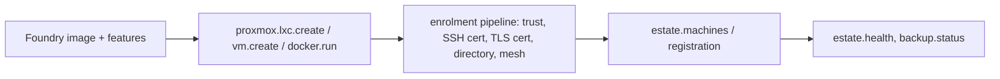

# 35 · Infrastructure and Provisioning

This subsystem turns machines and networks into usable Vera capacity. It
covers the **estate** view (every machine, its health, backups and
registrations in one place), **Proxmox** control and its storage fabric, OS
provisioning through **Foundry** (images, features, blueprints, PXE, SD cards,
VM import/export, salvage and hardening), the **build** service, enrolment and
**identity** (SSH logins, certificates, directory, auto-enrolment), software and
component deployment to nodes, network **policy** and **presence monitoring**,
remote connections and workspaces, and a handful of physical devices (Home
Assistant, thermal printers). Docker host operations are covered in
[Docker](13-docker.md) and the encrypted overlay mesh in
[Cluster E2E Encryption](32-cluster-encryption.md); this guide covers the layer
beneath and around them.

The code is spread over `vera/estate/`, `vera/proxmox/`, `vera/foundry/`,
`vera/build/`, `vera/provisioning/`, `vera/networking/`, `vera/netmon/`,
`vera/remote/`, `vera/homeassistant/` and `vera/printer/`, with deployable
artefacts in `edge/`, `deploy/` and `ansible/`. Most of it is in daily use
against a real single-cluster Proxmox estate. The rules behind each area live in
pure, unit-tested `*_core.py` modules, and every destructive operation defaults
to a plan or dry run. Physical PXE and SD-card provisioning are newer and less
exercised than the Proxmox and Docker paths. The longer-term design is in
[`OS-PROVISIONING-ROADMAP.md`](../OS-PROVISIONING-ROADMAP.md).

## Contents

- [1. Components](#1-components)
- [2. Source map](#2-source-map)
- [3. Provisioning lifecycle](#3-provisioning-lifecycle)
- [4. The Estate tab](#4-the-estate-tab)
  - [Machines, health and live operations](#machines-health-and-live-operations)
  - [Backups](#backups)
  - [Registrations and the entity record](#registrations-and-the-entity-record)
  - [Estate Map](#estate-map)
- [5. Proxmox control plane](#5-proxmox-control-plane)
  - [Consoles](#consoles)
- [6. Storage fabric (`pxstore.*`)](#6-storage-fabric-pxstore)
  - [ZFS operations](#zfs-operations)
  - [File fabric (`vfs.*`)](#file-fabric-vfs)
- [7. Foundry — OS provisioning](#7-foundry--os-provisioning)
  - [Images, features and provisioning](#images-features-and-provisioning)
  - [Blueprints](#blueprints)
  - [PXE netboot](#pxe-netboot)
  - [SD cards and display nodes](#sd-cards-and-display-nodes)
  - [VM import/export and salvage](#vm-importexport-and-salvage)
  - [Security baselines](#security-baselines)
  - [Clusters and distributed compute](#clusters-and-distributed-compute)
- [8. Build service](#8-build-service)
- [9. Enrolment, identity and trust](#9-enrolment-identity-and-trust)
  - [SSH logins and agentless enrolment](#ssh-logins-and-agentless-enrolment)
  - [Auto-enrolment](#auto-enrolment)
  - [Directory: FreeIPA and lldap](#directory-freeipa-and-lldap)
  - [Backing services and stores](#backing-services-and-stores)
- [10. Software, components and node workers](#10-software-components-and-node-workers)
  - [Unified node estate and uniform provisioning](#unified-node-estate-and-uniform-provisioning)
- [11. Network policy and presence monitoring](#11-network-policy-and-presence-monitoring)
- [12. Remote connections, workspaces and the host operator](#12-remote-connections-workspaces-and-the-host-operator)
- [13. Devices: Home Assistant and thermal printers](#13-devices-home-assistant-and-thermal-printers)
- [14. Deployment artefacts](#14-deployment-artefacts)
- [15. External-effect boundary](#15-external-effect-boundary)
- [16. State ownership](#16-state-ownership)
- [17. Configuration and storage](#17-configuration-and-storage)
- [18. Troubleshooting](#18-troubleshooting)
- [Related pages](#related-pages)
- [Screenshots](#screenshots)
- [Capabilities](#capabilities)

---

## 1. Components

| Area | Responsibility |
|---|---|
| Estate | One list of machines, estate health, backups, registrations, live operations map, the Estate Map |
| Nodes | Unified node estate: detection, a provisionable component catalogue, uniform provisioning onto any target, estate storage, backups and share sync |
| Proxmox | Cluster connections, live status, guest lifecycle, creation, exec, consoles, firewall |
| Storage fabric | ZFS, disks, CPU pinning, the shared model store, backup targets |
| File fabric | The estate file server: shares, the name-keyed estate tree, device access |
| Foundry | Image catalogue, feature bundles, provisioning of CTs/VMs/Docker, blueprints, PXE, SD cards, VM import/export, salvage, hardening, swarm clusters |
| Build | The `vera-builder` compile service (Arduino, PlatformIO, general builds, isolated Python) |
| Enrolment and identity | SSH credential store, agentless enrolment, auto-enrolment, FreeIPA and lldap, OpenBao, step-ca |
| Software and components | Install runtimes (Ollama, vLLM, Docker, NVIDIA) and Vera's own edge components on hosts; node workers |
| Networking | Editable Proxmox + Docker topology and network policy; mesh membership (see [doc 32](32-cluster-encryption.md)) |
| Netmon | Presence and uptime monitoring with alerts |
| Remote | Saved connections, terminals, remote filesystem, workspaces, app mounts, metrics, Portainer, session sandboxes |
| Devices | Home Assistant control and thermal printers |

---

## 2. Source map

| Path | Contents |
|---|---|
| `vera/estate/` | `estate_machines_*`, `estate_health_*`, `backup_*`, `registration_*`, `estate_entity_*`, `ops_*`, `compute_load_core.py`, `estate_nav_*`, Estate panels and `vera-estate.js` / `vera-entity-drawer.js` |
| `vera/workers/nodes_capabilities.py` | `nodes.*` unified node estate and `provision.overview` / `provision.node.new` / `provision.apply` |
| `vera/vfs/` | `vfs_capabilities.py` (file-fabric control surface), `vfs_rw_core.py` (writable-guest plans) |
| `vera/interaction/` | The Estate Map panel (`interaction_capabilities.py`, `interaction_panel.html`) |
| `vera/proxmox/` | `proxmox_capabilities.py` (API, consoles), `pxstore_capabilities.py` (storage fabric), `zfs_ops_*` (ZFS plans), `pool_core.py`, `node_hosts_core.py`, `pxstore_*_core.py` |
| `vera/foundry/` | `foundry_capabilities.py` plus pure cores: `foundry_core.py` (PXE render, hardening), `features_core.py`, `sdcard_core.py`, `vmport_core.py`, `salvage_core.py`, `security_core.py` |
| `vera/build/` | `build_capabilities.py` (Vera side), `builder_service.py` (the service inside the container), `Dockerfile` |
| `vera/provisioning/` | Enrolment (`enroll_*`, `enrol_pipeline_core.py`, `autoenroll_capabilities.py`, `ssh_store_merge_core.py`), identity (`identity_*`, `lldap_capabilities.py`, `openbao_identity.py`), security suite (`provisioning_capabilities.py`, `security_provision_capabilities.py`), stores (`stores_capabilities.py`), runtimes (`software_capabilities.py`), components and node workers (`components_*`, `node_sync_core.py`, `ollama_node_core.py`, `ollama_tap_core.py`) |
| `vera/networking/` | `netgraph_capabilities.py` (topology and policy), `netsec_*` (mesh, see doc 32) |
| `vera/netmon/` | `netmon_capabilities.py` (presence engine and alerts) |
| `vera/remote/` | `remote_capabilities.py` (`conn.*`, terminals), `workspace_capabilities.py` (`fs.*`, `workspace.*`, `app.*`, `mcp.detect`), `operator_capabilities.py`, `metrics_capabilities.py`, `portainer_capabilities.py`, `session_sandbox_capabilities.py` |
| `vera/homeassistant/` | `ha_capabilities.py`, `ha_core.py`, `ha_estate.py` |
| `vera/printer/escpos_core.py` | Pure ESC/POS builder used by `vera/business/thermal_printer_capabilities.py` |
| `edge/` | Services deployed to compute nodes ([§14](#14-deployment-artefacts)) |
| `deploy/host-stack/` | Description of the Vera host's core Docker stack and daemon hardening |
| `ansible/` | Playbook for deploying Vera itself (Docker or native) |

---

## 3. Provisioning lifecycle

1. Register or discover the physical or virtual host.
2. Inspect current identity, addresses, storage and boot state.
3. Produce a reviewed provisioning or build plan.
4. Stage artefacts without changing the running target.
5. Execute the explicitly authorised install or build step.
6. Verify boot, network identity, required services and Vera registration.
7. Record the resulting versions and artefact identities.

Discovery and planning are read-only. Power, reboot, PXE, disk layout,
firmware and guest lifecycle operations can interrupt or destroy workloads and
need an exact target plus confirmation. In practice most mutating capabilities
here take `confirm` (default `false`) or `dry_run` and return the exact plan
when it is not set.



---

## 4. The Estate tab

The **Estate** tab gathers machine, network, identity and platform views that
used to be separate top-level tabs. While the "retire overlapping tabs"
setting is on (the default, Redis key `vera:ui:retire_overlap_tabs`), the
Proxmox, Remote, Net Policy, Security, Identity, Provision, Integrations and
Platforms tabs leave the tab bar and open as panes of Estate instead. Their
routes and capabilities keep working. `ui.tabs.retired` / `ui.tabs.retired.set`
read and change the switch, and `ui.places` lists every place a drill-through
can open.

### Machines, health and live operations

| Capability | Route | Purpose |
|---|---|---|
| `estate.machines` | `GET /estate/machines` | Every machine in one list: `nodes.list` rows joined with every guest Proxmox reports, SSH hosts folded into their guest, each row with the actions that apply (power, console, terminal) |
| `estate.health` | `GET /estate/health` | Read-only findings from the state store, Vera-host containers, Proxmox guests (not set to start on boot), backups (failed, none in 36 h), disks, core services and certificates. Cached 120 s; `refresh` skips the cache |
| `ops.snapshot` | `GET /ops/snapshot` | Live operations: the estate as planes (clients, work in flight, Vera core, services, runtimes, hosts, devices and mesh) with requests in flight; each reader runs under its own timeout and a failed one is named |
| `ops.node.events` | `GET /ops/node/events` | Recent events naming one node |
| `estate.compute.load` | `GET /estate/compute/load` | Each model-serving node with the machine, cores and GPUs it runs on |

### Backups

`backup.status` (`GET /backup/status`) reads the Proxmox backup jobs on each
node, the guest backups in each backup storage, the guests themselves, Vera's
own `nodes.backup` schedule and the Vera host's file-level backup, and answers
with every guest's latest backup, every schedule with its owner, and warnings.
`backup.guest` lists one guest's backups; `backup.run` backs one guest up now
and is a dry run unless `confirm=true`. `pxstore.backup.status` and
`pxstore.backup.target` sit underneath.

### Registrations and the entity record

- `estate.registration` puts every machine against every registration plane
  (SSH login, directory, mesh, certificate, backup), with counts and the
  entries no machine answers to. `estate.registration.prune` removes those
  stale entries (dry run first); `estate.registration.forget` removes one
  destroyed guest's entries. `proxmox.guest.destroy` does this automatically.
- `estate.entity.resolve` (`GET /estate/entity/resolve`) answers `<kind>:<id>`
  with one record: what it is, its facts, its standing in every plane, related
  entities and where to go next. It only reads existing sources
  (`estate.machines`, `backup.status`, `certs.list`, `netsec.mesh.members`,
  `identity.host.list`, `exec.ssh.hosts.list`, `integration.list`,
  `docker.hosts.list`, `pxstore.inventory`), and a source that does not answer
  is named in the record rather than left blank. The entity drawer
  (`vera-entity-drawer.js`) renders it.

### Estate Map

The **Map** pane (panel `interaction-map`, served at `/interaction/panel`) is
a live SVG of the infrastructure outside Vera: hosts on the left with their
security posture as badges (certificate SSH, on the mesh, in FreeIPA), the
managers and security services on the right, and edges for the systems each
host is enrolled into. It composes existing capabilities in the browser
(`proxmox.cluster.list`, `workers.docker.hosts`, `netsec.mesh.members`,
`identity.host.list`, and others) with an optional deep scan of every guest and
container, and animates real infrastructure events from `/events`. It keeps no
backend state of its own.

---

## 5. Proxmox control plane

`proxmox_capabilities.py` stores cluster API credentials **sealed in Redis**
(`vera:proxmox:clusters`, Fernet via `security/secrets.py`; never returned to
the UI), exposes live monitoring and guest lifecycle through the Proxmox API,
and proxies Proxmox consoles. Discovery into the topology graph is separate
(`netscan.proxmox.scan`, see [Execution](12-execution.md)).

| Capability | Purpose |
|---|---|
| `proxmox.cluster.save` / `.list` / `.delete` | Credential store; `list` is redacted (`has_token`, `has_console_password`) |
| `proxmox.status` | Live snapshot from `/cluster/resources` and `/cluster/status` |
| `proxmox.guest.action` | `start`, `stop`, `shutdown`, `reboot`, `suspend`, `resume` |
| `proxmox.guest.ip` | Best-effort IPv4 of a guest (LXC config or QEMU guest agent) |
| `proxmox.guest.exec` | Run a script inside a guest through Proxmox, no guest SSH needed |
| `proxmox.node.exec` | Run a command on the Proxmox node itself (`qm`, `pvesm`, …) |
| `proxmox.node_hosts.merge` | Copy the storage fabric's node → SSH login map onto the cluster record |
| `proxmox.nextid` | Next free VMID |
| `proxmox.storage.content` | Storage content of a type (default `vztmpl`, LXC templates) |
| `proxmox.guest.clone` | Clone a guest or template |
| `proxmox.vm.create` | Cloud-init VM cloned from a prepared template |
| `proxmox.lxc.create` | LXC container from an OS template (optional auto-enrol) |
| `proxmox.guest.destroy` | Permanently delete a guest (`purge` default true); also forgets its registrations |
| `proxmox.guest.enroll` | Register a guest as a managed SSH host |
| `proxmox.console.ticket` | Open a console session |
| `proxmox.fw.rules.list` / `.rule.add` / `.rule.delete` | Firewall rules at a scope |

All routes are `POST /proxmox/…` except `GET /proxmox/cluster/list`; the panel
is at `/proxmox/panel`. Lifecycle capabilities accept optional idempotency,
approval and retry inputs that are observe-only and never sent to Proxmox.

**Which SSH login reaches a node.** `node_hosts_core.py` resolves it the same
way everywhere: the cluster record's `node_hosts` map, then the storage
fabric's older map, then an exec login named after the node, then the exec
login at the API host's address. A mapped login that no longer exists is
skipped.

### Consoles

`proxmox.console.ticket` mints a single-use session; the browser then connects
to `WS /proxmox/console/ws/{sid}`, which proxies Proxmox's `vncwebsocket`
(xterm for a terminal, RFB for noVNC). Proxmox authenticates that socket with a
ticket from a username and password, not an API token, so the in-Vera console
needs the optional sealed `console_user` / `console_password`. With only an API
token, monitoring and lifecycle still work and the UI falls back to a
deep-link into Proxmox's own console. The [Operator](34-operator.md) uses these
consoles to drive guest desktops.

---

## 6. Storage fabric (`pxstore.*`)

Everything the Proxmox API cannot do on its own (ZFS, disks, cpusets,
bind-mounts) runs over root SSH to the node using the shared exec SSH store.
Settings per cluster live in Redis `vera:pxstore:cfg`. The Storage view is a
pane of the Estate tab (set `VERA_PXSTORE_TAB=1` to restore its standalone tab
at `/pxstore/panel`).

| Group | Capabilities | Purpose |
|---|---|---|
| Settings | `pxstore.settings.get` / `.save` | Node → SSH mapping, share root, reserved CPU ranges, store dataset |
| Inventory | `pxstore.inventory`, `pxstore.disks` | Guests by name with backing datasets, pools, mounts, unallocated space; every physical disk and what uses it |
| Datasets | `pxstore.zfs.create`, `pxstore.zfs.set`, `pxstore.disk.resize` | Create datasets, set quota properties, grow a guest disk |
| CPU | `pxstore.cpu.topology`, `.map`, `.pin`, `.suggest` | NUMA topology, per-guest pinning with conflict analysis, a safe cpuset suggestion on one NUMA node |
| Model store | `pxstore.store.provision`, `.attach`, `.attach_remote`, `.export`, `.consolidate`, `.status`, `.writer.provision`, `pxstore.models.pull`, `.pull.status` | A shared, compressed ZFS dataset of model blobs, mounted **read-only** into model-serving containers, with a single writer so no consumer can prune another node's blobs |
| LLM backends | `pxstore.backend.status`, `.provision_vllm`, `.switch` | Which backend (Ollama or vLLM) a container runs, and switching between them |
| Vera data | `pxstore.veradata.plan`, `.provision` | Plan and create a dataset for Vera's databases exported over NFS |
| Backups | `pxstore.backup.status`, `pxstore.backup.target` | Backup jobs on a node; point estate backups at the file fabric's backup dataset |
| Network monitor | `pxstore.nwm.flows`, `.accounting`, `.capture` | Live connections, per-flow byte accounting and timed header captures on the network-monitor container |
| Editors | `pxstore.vscode.targets` | Remote-SSH config entries for opening guests in VS Code |
| Legacy share | `pxstore.fs.provision`, `.sync`, `.status`, `.retire` | The old hypervisor Samba share; the file fabric (`vfs.*`, below) replaces it |

> [!NOTE]
> Attaching the store to a container uses `pct set` on the node, because
> Proxmox refuses bind-mount entries from an API token. The default mount
> path is `/.ollama/models`, which works in both privileged and unprivileged
> containers.

### ZFS operations

`zfs_ops_capabilities.py` adds `pxstore.zfs.resize`, `.scrub`, `.trim`,
`.snapshot`, `.snapshots`, `.rollback`, `.tune`, `.attach` and `.add`. Each
returns the exact commands and warnings by default and runs them only with
`confirm=true`; `attach` and `add` also need the pool name typed back
(`confirm_pool`). The rules (`zfs_ops_core.py`):

- a dataset shrinks by lowering `refquota`, never below what it holds; a zvol
  (a VM disk) never shrinks;
- a rollback past the newest snapshot needs `-r` and lists the snapshots it
  discards;
- attaching a disk to a single-disk vdev makes a mirror and resilvers; adding a
  vdev stripes it in and can never be removed once raidz is involved;
- only a fixed set of dataset properties may be tuned.

`pool_core.py` turns `zpool status` / `iostat` / `list` and `zfs get` into pool
layout, scrub state, throughput, fragmentation and compression, and flags pools
with no redundancy, overdue scrubs, degraded state or low free space.

### File fabric (`vfs.*`)

The estate's file server is a dedicated container that binds the ZFS pool roots
once and projects every guest filesystem into a **name-keyed, read-only**
estate tree, so new guests appear without reconfiguration and a running guest's
filesystem is never written through the share. Anonymous access is refused.
`vfs_capabilities.py` drives the scripts on that box over the exec SSH store;
its location (host, SSH label, share root) is stored in Redis `vera:vfs:cfg`.

| Capability | Purpose |
|---|---|
| `vfs.health` / `vfs.status` | Liveness of smbd, nfsd, syncthing and nginx; full status with shares, free space, exports, peers and disks |
| `vfs.shares` | The share catalogue with ready-to-paste client mount strings |
| `vfs.estate.sync` / `vfs.estate.list` | Rebuild the estate tree now (it also runs on a timer) and list what it exposes and what was skipped |
| `vfs.estate.rw` / `.rw.set` / `.rw.door_only` | Which guests are additionally exposed **writable** through an admin-only share, setting that list, and restricting that share to devices on the file-access WireGuard door |
| `vfs.peer.add` / `.list` / `.remove` | Give a device file access over the WireGuard door (returns its client config), list peers with last handshake, revoke |
| `vfs.settings.save` | Update where the file fabric lives |

Progress is emitted as `vfs.progress`. The older `pxstore.fs.*` hypervisor
share is legacy and can be retired with `pxstore.fs.retire`.

---

## 7. Foundry — OS provisioning

Foundry stands up operating systems. A job is **target × base image ×
features**, and the orchestrator composes existing plumbing
(`proxmox.lxc.create`, `proxmox.vm.create`, `docker.run`, the enrolment
pipeline, `proxmox.guest.exec`) rather than reimplementing it. The Foundry
pane is served at `/foundry/panel`.

### Images, features and provisioning

| Capability | Purpose |
|---|---|
| `foundry.catalog.seed` | Seed the catalogue with the default OS set (Debian 12/13, Ubuntu 24.04, AlmaLinux 9, Rocky 9, CentOS Stream 9, openSUSE 15.6, Alpine, Arch, Fedora 43, Kali, Windows stub); idempotent |
| `foundry.image.list` / `.add` / `.delete` | The catalogue (`vera:foundry:images`); image types `cloudimg`, `lxc-template`, `docker`, `iso`, `ipxe` |
| `foundry.image.import` / `.import.status` | Import a cloud image onto Proxmox and build a cloud-init template |
| `foundry.features` | Feature bundles and the targets each supports |
| `foundry.provision` | Provision `target` (`ct` / `vm` / `docker`) from `image_id` with `features`, sizing, FQDN and static IP |
| `foundry.jobs` | Recent provision jobs |

**Features** (`features_core.FEATURES`): `mesh`, `distributed-compute`,
`hardening`, `file-client`, `file-server`, `security-monitoring`,
`vfs-client`, `docker-resilience`. Each is an idempotent post-install script
run through `guest.exec` (CTs) or cloud-init (VMs). An OS adapter detects
`apt`/`apk`/`pacman`/`dnf` and systemd/OpenRC, so one feature definition runs
on Debian, Ubuntu, Kali, Alpine, Arch and AlmaLinux.

```bash
curl -s localhost:8999/foundry/provision -H 'content-type: application/json' -d '{
  "target": "ct", "image_id": "<catalogue id>", "name": "worker-01",
  "features": ["hardening", "mesh"], "cores": 2, "memory": 2048, "disk": 16
}'
```

### Blueprints

A blueprint is a versioned, reusable estate definition (like a Compose file for
machines): a list of nodes `{name, target, image_id, count, features, …}`.
`foundry.blueprint.save` snapshots the previous version on every update;
`.list`, `.get` (optionally a past version), `.delete`, `.apply` (fans out to
`foundry.provision` for every node × count), `.export` (YAML when available,
else JSON) and `.import` round-trip it as Infrastructure-as-Code.

### PXE netboot

| Capability | Purpose |
|---|---|
| `foundry.pxe.config` / `.config.save` | Bridge/VLAN, DHCP range, gateway, deploy host |
| `foundry.pxe.profile.save` / `.list` / `.delete` | Boot profiles: the physical analogue of a provision node |
| `foundry.pxe.mac.add`, `foundry.pxe.macs` | The waiting room: machines seen by MAC and their assigned profile |
| `foundry.pxe.render` | Render a profile's artefacts: iPXE + cloud-init autoinstall for x86; `config.txt` / `cmdline.txt` for Raspberry Pi (including the XPT2046 3.2" touchscreen overlay) plus the feature first-boot script |
| `foundry.pxe.server.deploy` / `.status` / `.teardown` | Stand up the netboot stack on a Proxmox node |
| `foundry.pxe.status` | Configuration, counts and deployment state |

The netboot server binds dnsmasq (DHCP, DNS, TFTP) to a **dedicated bridge**
(default `vmbr2`) on an isolated subnet, never the main LAN; a fencing gate
aborts the deploy if the bind is wrong. The HTTP boot menu is generated from
the catalogue (local disk default, RAM-booted ops nodes that join the swarm,
netboot.xyz, catalogue installers), with scoped NAT so provisioned hosts can
reach package mirrors.

### SD cards and display nodes

`foundry.sdcard.detect` lists removable cards on a node that look like a
Raspberry Pi card; `.inspect` mounts one read-only and reports its OS, free
space, services and existing configuration; `.plan` is a dry run;
`.provision` (with `confirm=true`) merges the TFT overlay into `config.txt`,
enables SSH, installs the first-boot join and display/button agents, and masks
inherited services that would disrupt the LAN. It **adapts** the card in place,
preserving existing data.

Provisioned display nodes (photo frames, macro pads, status displays) call
back: `foundry.node.checkin` on first boot, `foundry.node.frame` to ask what to
show, and `foundry.node.action` when a button is pressed. `foundry.node.list`
and `foundry.node.frame.set` manage them.

### VM import/export and salvage

- `foundry.vm.import` imports a `vdi` / `vmdk` / `vhd` / `vhdx` / `qcow2` /
  `raw` disk as a VM: create the shell, `importdisk`, **attach** it and set the
  boot order, choosing BIOS and bus from `os_hint`. `foundry.vm.export` exports
  a stopped VM's disk. Both plan first and need `confirm=true`.
- **Salvage** gets data off a disk before it is wiped. `foundry.salvage.inspect`
  mounts read-only; `.plan` shows what would be harvested; `.run` takes a
  file-level **harvest** (documents, code, dotfiles, keys, browser profiles) and
  optionally a full **image**, then verifies both by reading them back;
  `.list` shows salvaged devices; `.wipe_check` answers only from what has
  actually been backed up and verified.

### Security baselines

Hardening controls are data in `security_core.py` (id, rationale, apply,
check, failure meaning), so the apply script, the verify script and the
human-readable standard are generated from the same rows.

| Capability | Purpose |
|---|---|
| `foundry.security.standards` | The full standard: every control, why it matters, its CIS mapping |
| `foundry.security.apply` | Apply a profile (`baseline`, `exposed`, `minimal`) to `node`, `ct:<vmid>` or `vm:<vmid>` and record it; guard controls abort rather than disable password login on a host with no working SSH key |
| `foundry.security.verify` | Re-check a host without changing anything and report drift |
| `foundry.security.registry` | Every hardened host, its profile, and when it was applied and last verified |
| `foundry.security.fim.baseline` / `.fim.check` | File-integrity baseline (SHA-256) and comparison |

### Clusters and distributed compute

`foundry.cluster.register` / `.list` / `.delete` record clusters a provisioned
host can join (join tokens sealed, redacted in listings);
`foundry.cluster.init` bootstraps a new cluster and registers it.
`foundry.cluster.run` dispatches a Docker Swarm service across worker nodes,
`foundry.cluster.ps` shows nodes, services and placement, and
`foundry.cluster.rm` removes a service.

---

## 8. Build service

The heavy toolchains (arduino-cli with the ESP32 core, PlatformIO, gcc/cmake,
esptool, mpy-cross) live in the separate `vera-builder` container
(`vera/build/Dockerfile`), so Vera's own image needs no compiler.

| Capability | Purpose |
|---|---|
| `build.status` | Is the builder reachable, and which toolchains it has |
| `build.builder.up` | Build the image and start the container on the local Docker host |
| `build.progress` | Poll a background build job (from `build.builder.up` or `mesh.firmware.build`) |
| `build.arduino` | Compile a sketch to a flashable merged (`0x0`) `.bin` in the mesh firmware catalogue |
| `build.platformio` | Build a PlatformIO project |
| `build.run` | Run an arbitrary build command in the builder sandbox and collect artefacts |
| `build.python` | Run Python in a fresh, isolated virtualenv created per call |

Discovery: an explicit `VERA_BUILDER_URL` always wins; otherwise Vera probes
the published port (`BUILDER_PORT`, default 8785) on localhost and the compose
DNS name, and remembers whichever answers. Inside the container the service
listens on its own `BUILDER_PORT` (default 8080). Build artefacts must be
content-addressed or versioned; a successful command without the expected
artefact is a failed build. The [Device Mesh](14-mesh.md) uses this service
for firmware.

---

## 9. Enrolment, identity and trust

### SSH logins and agentless enrolment

`enroll_capabilities.py` keeps per-host SSH credentials sealed in Redis and
enrols guests without an agent. Auth modes in preference order: **cert**
(step-ca SSH user certificate), **key** (sealed private key), **password**
(sealed).

| Capability | Purpose |
|---|---|
| `ssh.host.save` / `.list` / `.delete` / `.test` | Per-host credentials (routes under `/enroll/ssh/host/…`) |
| `ssh.stores.merge` | Fold the enrolment store into the exec store that every remote command, terminal and mesh join resolves; nothing is deleted, guest links become tags |
| `ssh.cert.mint` / `ssh.cert.status` | Mint and inspect Vera's SSH user certificate from step-ca |
| `enroll.script` | Preview the enrolment script for an FQDN |
| `enroll.discover` | A cluster's guests annotated with enrolment state |
| `enroll.guest` | SSH in with bootstrap credentials, trust the step-ca roots, install the SSH user CA, request a TLS certificate, register the host in the directory and DNS, join the mesh |

`enrol_pipeline_core.py` is the single set of rules every entry point now uses
(`enroll.guest`, `proxmox.guest.enroll`, `proxmox.lxc.create` with
`auto_enroll`, Foundry post-provision, `nodes.provision`, auto-enrolment), so
an asset is enrolled the same way however it arrived. A non-root SSH user runs
the script through `sudo -n`.

### Auto-enrolment

`autoenroll_capabilities.py` onboards the estate: existing Docker and Proxmox
stacks are enrolled, new containers and VMs are picked up, and each asset is
wired into the mesh, given SSH and TLS certificates, registered in the
directory, and has its exposed ports mounted as apps. Missing credentials
become a pending-request queue that a person (or chat) fills.

| Capability | Purpose |
|---|---|
| `autoenroll.config.get` / `.config.save` | Watch, dry-run, interval, subsystems (`mesh`, `certs`, `ldap`, `apps`) and sources |
| `autoenroll.scan` | Read-only discovery of every asset |
| `autoenroll.run` / `autoenroll.enrol` | Enrol all, or one asset now |
| `autoenroll.pending` / `autoenroll.cred.provide` | Credentials still needed, and supplying them |
| `autoenroll.watch.start` / `.stop` / `.status` | The background watcher |

Redis keys: `vera:autoenroll:config`, `vera:autoenroll:pending`.

### Directory: FreeIPA and lldap

- **FreeIPA** (`identity_capabilities.py`) is the identity core: LDAP,
  Kerberos, DNS and the Dogtag CA. Capabilities register hosts, users (with
  TOTP via `identity.user.mfa`), groups and service principals, manage DNS
  records, issue certificates, and `identity.app.register` does DNS + HTTP
  principal + TLS certificate in one call. `identity.trust.add` sets up an
  IPA↔AD cross-forest trust for Windows clients.
- **lldap** (`lldap_capabilities.py`, `identity.lldap.*`) is the lightweight
  directory that container apps bind to; it is auto-discovered from the
  security deploy record.
- **Resolver** (`identity.resolve.*`) routes users, hosts and apps to FreeIPA
  when reachable and falls back to lldap where practical.
- **Migration** (`identity.migrate.status` / `.preview` / `.run`) copies
  missing users and groups between lldap and FreeIPA in either direction,
  idempotently, from the Directory Sync panel.
- **OpenBao ↔ FreeIPA** (`identity.openbao.*`) wires the vault's LDAP auth to
  FreeIPA, maps a group to a policy, and supports KMS-wrapped auto-unseal.

Secrets (`secstore.*`) and PKI (`pki.*`, `provisioning.asset.online`) are
described in [Security](29-security.md).

### Backing services and stores

| Capability | Services |
|---|---|
| `secprov.services` / `.deploy` / `.status` / `.remove` | `openbao`, `step-ca`, `lldap`, `opa` onto a registered Docker host (named volumes are kept on remove) |
| `provision.stores` / `provision.store.deploy` / `.status` / `.remove` | `redis`, `postgres`, `chromadb`, `neo4j`, `garage`, `ollama` onto a registered Docker host |
| `provision.store.garage.bootstrap` | Assign and apply a single-node Garage layout through its admin API |
| `prov.config.get` / `.save`, `prov.status` | Security-suite configuration (redacted) and aggregate health |

---

## 10. Software, components and node workers

| Capability | Purpose |
|---|---|
| `provision.targets` | Installable runtimes: `ollama`, `vllm`, `docker`, `nvidia` |
| `provision.detect` | SSH-probe a host for OS, package manager, GPU and installed runtimes |
| `provision.install` | Install a runtime over SSH |
| `provision.serve` | Launch a vLLM OpenAI-compatible server on a host |
| `provision.connect` | Register a provisioned endpoint into Vera's cluster |
| `provision.run` | Install and register in one step |
| `provision.components` | Vera's bundled edge components: `gpu_inference`, `onnx_runtime`, `nlp_server`, `mesh_gateway`, `model_builder` |
| `provision.deploy` / `.component.status` / `.component.version` / `.component.stop` / `.component.sync` | Push a component to `~/.vera/edge` on a host, check it, and keep every node on the version this host would deploy |
| `provision.worker` | Provision a Vera worker that joins the cluster task stream |
| `nodes.workers.list` / `.provision` / `.roles.set` / `.dispatch` / `.sync` | Node workers: task classes (`general`, `nlp`, `cpu_compute`, `media`), one-click install, rollout stage, and syncing every worker onto the commit the host is running |

The node-worker sync job runs on a schedule and refreshes one node at a time,
comparing against the commit the host is **running** (not `git HEAD`); set
`VERA_NODE_SYNC=off` to disable it. `ollama_node_core.py` makes the Ollama
recipe bind a reachable address and port, and `ollama_tap_core.py` places the
activity tap (`edge/ollama_tap.py`) on a node's public Ollama port with Ollama
moved to loopback. Workers and jobs are covered in
[Workers, Jobs & Syslog](22-workers-jobs-syslog.md).

### Unified node estate and uniform provisioning

`vera/workers/nodes_capabilities.py` treats every reachable machine as a Vera
**node** of varying capability, and everything Vera can run (inference
workers, data stores, the worker agent) as a **component** provisioned through
whichever management plane the node offers: Docker first, Proxmox second, plain
SSH as the fallback. Every step delegates to existing capabilities
(`docker.run`, `provision.install`, `provision.deploy`, `provision.worker`,
`pxstore.backend.provision_vllm`, `ollama.add_instance`, …).

| Capability | Route | Purpose |
|---|---|---|
| `nodes.list` | `GET /nodes` | One row per machine linking its SSH, Docker and Proxmox identities, detected facts, and the Ollama/vLLM instances it runs |
| `nodes.detect` / `nodes.detect_all` | `POST /nodes/detect`, `/nodes/detect_all` | One SSH probe per node: GPU/VRAM/RAM/cores/disk and Docker/Ollama/vLLM/ZFS/PVE presence |
| `nodes.components` | `GET /nodes/components` | The unified provisionable catalogue |
| `nodes.provision.plan` / `nodes.provision` | `POST /nodes/provision/plan`, `/nodes/provision` | Resolve components to a backend and steps (dry run), then execute and register endpoints |
| `provision.overview` | `GET /provision/overview` | Every target and payload for uniform provisioning in one call |
| `provision.apply` | `POST /provision/apply` | Deploy payloads (component keys, `stack:<service>`, …) onto `node:<id>`, `docker:<host_id>` or `new-ct:<cluster_id>:<pve_node>` |
| `provision.node.new` | `POST /provision/node/new` | Create a Proxmox CT and enrol it as a node in one step |
| `nodes.storage` | `POST /nodes/storage` | Estate-wide storage: pools, datasets, non-ZFS mounts, guest disks, Docker volumes and images |
| `nodes.backup.get` / `.set` / `.run` | `/nodes/backup…` | Vera's own backup scheduler: vzdump guests to a Proxmox backup storage and tar Docker volumes (`interval_hours` default 24) |
| `nodes.sync.get` / `.set` / `.run` | `/nodes/sync…` | Keep the share tree in sync (default daily) |
| `obs.node_temps` | `GET /nodes/temps` | Per-node temperatures (sensors, BMC via ipmitool, SMART), fan/voltage/power health, and per-CPU load for every SSH-registered node |

Redis keys: `vera:nodes:facts`, `vera:nodes:sync`, `vera:nodes:backup`,
`vera:nodes:backup:log`. Ollama tuning on nodes (`nodes.ollama.tune`,
`nodes.ollama.settings`, `nodes.ollama.settings.set`) is documented in
[Ollama Cluster](04-ollama-cluster.md); `nodes.ollama.tap` installs the
activity tap described above.

---

## 11. Network policy and presence monitoring

### Net Policy (`netgraph.*`)

| Capability | Purpose |
|---|---|
| `netgraph.topology` | Cytoscape topology of Proxmox nodes/guests and Docker networks/containers |
| `netgraph.edge.allow` / `.edge.deny` | Draw or cut a line: connect/disconnect a container ↔ network for Docker, or add/remove a guest firewall ACCEPT rule for Proxmox (through `proxmox.fw.*`) |
| `netgraph.docker.connect` / `.disconnect` | Explicit Docker network membership |
| `netmon.snapshot` | Compact per-node, guest and container metrics for the Ollama monitor |

The encrypted overlay mesh (`netsec.mesh.*`) is documented in
[Cluster E2E Encryption](32-cluster-encryption.md).

### Presence and uptime (`netmon.*`)

`netmon_capabilities.py` turns the Network Map into a live monitor. One global
switch (off by default) runs a tick that pings known LAN hosts, sweeps for new
devices every Nth tick, and checks external targets (ICMP, TCP, HTTP).

Default configuration: `enabled` false, `interval_sec` 60 (minimum 15),
`lan_cidrs` auto-derived from discovered subnets, `discovery_every_n` 5,
`new_device_alert` false, alert channels `browser`.

| Capability | Purpose |
|---|---|
| `netmon.config.get` / `.config.set` | The global configuration |
| `netmon.target.list` / `.save` / `.delete` | Monitored devices and external hosts |
| `netmon.target.watch` | Which changes alert, over which channels |
| `netmon.device.name` | Give a MAC or IP a friendly name |
| `netmon.alerts.list` / `.alerts.clear` | Alert history (SQLite table `netmon_alerts`) |
| `netmon.test` | Send a test alert |
| `netmon.scan_now` | Run a presence tick immediately |
| `netscan.wifi.ingest` | Ingest a Wi-Fi scan into the network graph (BLE: `netscan.ble.ingest`, see [Device Mesh](14-mesh.md)) |

---

## 12. Remote connections, workspaces and the host operator

`vera/remote/` gives Vera one persistent remote-access layer over Docker
containers, SSH hosts and VMs, and Proxmox guests, with interactive terminals
streamed to the shared `<vera-terminal>` element.

| Family | Capabilities | Purpose |
|---|---|---|
| Connections | `conn.list`, `.save`, `.delete`, `.targets`, `.open`, `.exec` | Saved connections, everything openable right now, terminal descriptors, one-shot commands |
| Remote files | `fs.list`, `.stat`, `.read`, `.write`, `.mkdir`, `.delete` | Filesystem on a connection's target (base64-safe) |
| Workspaces | `workspace.list`, `.get`, `.save`, `.delete` | Saved layouts of terminals, file explorer, panels and apps bound to one target |
| Apps and MCP | `app.detect`, `app.mount`, `app.list`, `app.unmount`, `app.pair_mcp`, `mcp.detect` | Find apps by well-known ports, embed them through Vera, pair with MCP servers |
| Host operator | `operator.sysinfo`, `.processes`, `.ports`, `.services`, `.service`, `.pkg` | OS-portable admin verbs over `conn.exec`; used by the `operator-infra` loop profile |
| Metrics | `metrics.prom.*`, `metrics.stack.status`, `metrics.stack.provision` | Prometheus endpoints and queries; provision cAdvisor, node-exporter and Prometheus on a Docker host |
| Portainer | `portainer.save`, `.list`, `.delete`, `.ping`, `.endpoints`, `.containers`, `.stacks`, `.container.action`, `.provision` | Drive (or install) Portainer |
| Session sandboxes | `sandbox.session.*`, `sandbox.config.*`, `sandbox.packages.*`, `sandbox.host.provision` | Per-session Docker sandboxes, see [Execution](12-execution.md) |

The Remote and Workspaces panels are served at `/remote/panel` and
`/remote/workspace/panel`.

---

## 13. Devices: Home Assistant and thermal printers

### Home Assistant (`ha.*`)

A direct connection to Home Assistant (config in Redis `vera:ha:config`, token
redacted on read), served as the **Home** pane at `/ha/panel`.

| Capability | Purpose |
|---|---|
| `ha.config.get` / `ha.config.set`, `ha.health` | Connection and health |
| `ha.states`, `ha.state`, `ha.summary`, `ha.services` | Entities, one entity, per-domain counts and unreachable entities, available services |
| `ha.find` | Rank entities against a phrase ("the bedside lamp") |
| `ha.set`, `ha.scene`, `ha.call` | Turn on/off/toggle by name, activate a scene, call any service |
| `ha.notify` | Push a notification through a notify target such as a paired phone |
| `ha.estate.plan` / `.sync` / `.clear` | Project one entity per registered Vera service into Home Assistant, so the estate can drive automations ("tell me if a service goes down") |

`ha_core.py` normalises saved URLs (a missing scheme is a common fault) and
holds the matching rules, all unit-tested.

### Thermal printers (`print.*`)

`vera/business/thermal_printer_capabilities.py` drives ESC/POS receipt and
label printers, using the pure builder in `vera/printer/escpos_core.py`
(built-in fonts or 1-bpp raster images; 32 columns on 58 mm paper, 48 on 80 mm).

| Capability | Purpose |
|---|---|
| `print.status`, `print.printers`, `print.printer.upsert` / `.delete` | Serial availability, detected ports, printer records |
| `print.text`, `print.nice`, `print.image`, `print.raw` | Plain text, TrueType text, dithered images, raw ESC/POS |
| `print.receipt`, `print.label`, `print.item_label` | Receipts and packing slips, shipping labels, inventory barcode labels |
| `print.schedule`, `print.dream_digest`, `print.news`, `print.fabric` | Print or preview the day's schedule, dream digest, headlines, or recent rows of a fabric dataset |
| `print.config.get` / `.config.set` | Daily auto-print |
| `print.subs.get` / `.subs.set`, `print.push`, `print.notify` | Subscriptions per source (system, dreams, narrator, chat), routed output, and formatted notifications |

`VERA_PRINTER_CHUNK` (default 512 bytes) and `VERA_PRINTER_PACE` (default
0.012 s) tune serial pacing.

---

## 14. Deployment artefacts

**`edge/`** holds services deployed to compute nodes, normally through
`provision.deploy`:

| File | Role |
|---|---|
| `GPU_inference.py`, `gpu_inference_start.sh`, `gpu-inference.service`, `gpu_residency_core.py` | GPU media server (Whisper STT, Stable Diffusion, TTS) with a residency manager |
| `onnx_runtime.py` | Edge ONNX model server for `ml.export.onnx` artefacts |
| `nlp_server.py`, `nlp_export_models.py` | Text NLP on a compute node, and building its ONNX model set |
| `model_builder.py`, `vmodels_init.py`, `media_store_core.py` | Filling and reading the shared specialist-model store |
| `ollama_tap.py`, `ollama-vera.service`, `ollama.service`, `ollama-store-writer.service` | Ollama units and the activity tap |
| `vera_node_agent.py`, `node_runner_core.py`, `vera-node-agent.service` | Per-node control and monitoring agent |
| `activity_record.py` | ASGI recorder that reports node service calls to the Estate activity pane |
| `*.env.example`, `requirements.txt` | Environment templates and dependencies |

`ollama_wrapper.sh` is retired and kept for reference only.

**`deploy/host-stack/`** describes the Vera host's core Docker stack as it
runs (`docker-compose.yml`, project `vera-host`: Redis, Postgres, Chroma,
Neo4j, Garage, OpenBao, step-ca, lldap, OPA, a registry, SearXNG and
`vera-builder`). Every volume is declared external so the file can never start
a store on an empty volume, and values come from a git-ignored `.env`. Moving a
running service onto this file is a deliberate per-service step. The folder
also holds Docker daemon settings (`live-restore`, a dedicated data root, OOM
protection for `dockerd` and `containerd`) and `vm.swappiness = 10`.

**`ansible/playbook.yml`** deploys Vera itself: it syncs the checkout to
`/opt/vera`, generates a Fernet secret if none is given, renders `.env`, then
either installs Docker and brings up the stack (`--tags docker`) or builds a
virtualenv and a `vera.service` systemd unit (`--tags native`). Copy
`inventory.ini.example` to `inventory.ini` first.

---

## 15. External-effect boundary

Infrastructure is not a single effect. Local Docker/Proxmox connection records
are Vera metadata; status, inventory, metrics, storage listings, detection and
reachability checks are remote reads. Container execution and lifecycle, image
pulls, builder startup, arbitrary builds, guest actions and creation or
destruction, firewall edits, host commands, package installation and service
deployment are real mutations on the selected engine, cluster or managed host.

`integration.effect.inventory` publishes this distinction without contacting a
target. Docker, builder, store-deployment, Proxmox and managed-host
provisioning mutation paths create provider-neutral, payload-free observations
immediately before their first external mutation. Proxmox guest actions, guest
and node commands, cloning, VM and LXC creation, destruction and firewall edits
each produce one logical observation containing only digests of the cluster,
resource and operation. Component deployment, runtime installation and combined
runtime runs, and security-service deployment and removal apply the same rule
to SSH and Docker targets. A combined runtime run suppresses its nested install
observation so one public operation is represented once. Commands, guest
configuration, credentials, addresses, comments, and raw approval or
idempotency references are not retained. The observation is not an
authorisation decision: it does not block, retry, open credentials or record
provider completion, and it is isolated from existing execution failures.

The static inventory reports complete observation coverage for its declared
Proxmox and managed-host provisioning mutations. That is coverage, not
enforcement: credentialed provider validation, operation-specific approval,
provider idempotency analysis and durable completion evidence remain separate
work. Infrastructure evidence must not borrow Generic API, Email, Telegram or
Commerce authority.

> [!WARNING]
> No automatic retry is added. Repeating a partially completed provision, guest
> creation, firewall edit, image build or destructive action without provider
> state and an operation-specific idempotency design can amplify damage.

---

## 16. State ownership

Proxmox owns guest lifecycle; the guest owns its operating system; Docker owns
containers; Vera owns connection metadata and orchestration records. Do not
copy an external system's mutable state into Vera and then treat both copies as
authoritative. Persist stable IDs and refresh volatile status, which is why the
estate views join live readers on every request instead of keeping their own
copy.

Releasable build artefacts should carry source revision, toolchain version,
target, configuration, checksum and logs.

---

## 17. Configuration and storage

| Variable | Default | Effect |
|---|---|---|
| `VERA_BUILDER_URL` | — | Explicit builder URL (overrides discovery) |
| `BUILDER_PORT` | `8785` (published) / `8080` (inside the container) | Builder port |
| `VERA_ADVERTISE_HOST` | primary LAN address | Address provisioned hosts and workers use to reach Vera |
| `VERA_REPO_URL` | — | Repository URL for `source=git` worker provisioning |
| `VERA_NODE_SYNC` | on | `off` disables node-worker sync |
| `VERA_OPS_SECRETS_DIR` | `~/.vera-ops-secrets` | Off-repo folder holding the sealed secrets baked into netbooted ops-node images |
| `VERA_PXSTORE_TAB` | — | Restore the standalone Storage tab |
| `VERA_PRINTER_CHUNK`, `VERA_PRINTER_PACE` | `512`, `0.012` | Thermal printer serial pacing |
| `BAO_ADDR` / `VAULT_ADDR`, `BAO_TOKEN` / `VAULT_TOKEN` | — | OpenBao address and token |
| `GARAGE_ADMIN_URL`, `GARAGE_ADMIN_TOKEN` | — | Garage admin API |

Selected Redis keys:

| Key | Contents |
|---|---|
| `vera:proxmox:clusters` | Proxmox cluster records (secrets sealed) |
| `vera:pxstore:cfg` | Storage-fabric settings per cluster |
| `vera:foundry:images`, `:jobs`, `:clusters`, `:blueprints`, `:pxe`, `:nodes`, `:frames`, `:salvage`, `:security` | Foundry catalogue, jobs, clusters, blueprints, PXE, display nodes, salvage and hardening registries |
| `vera:provisioning:ssh_hosts`, `vera:provisioning:state`, `vera:provisioning:identity`, `vera:provisioning:security` | Enrolment store, suite state, FreeIPA config, security deploy record |
| `vera:autoenroll:config`, `vera:autoenroll:pending` | Auto-enrolment |
| `vera:ha:config` | Home Assistant connection |
| `vera:vfs:cfg` | File-fabric location |
| `vera:nodes:facts`, `vera:nodes:backup`, `vera:nodes:backup:log`, `vera:nodes:sync` | Node facts, backup and share-sync configuration |
| `vera:ui:retire_overlap_tabs` | Estate tab folding switch |

---

## 18. Troubleshooting

Work in this order:

1. Resolve the target ID to the intended host or guest (`estate.entity.resolve`).
2. Test network reachability and required ports.
3. Verify credentials and privilege (`ssh.host.test`, `proxmox.cluster.list`).
4. Check storage and artefact availability (`pxstore.inventory`, `build.status`).
5. Inspect the build or provisioning job state and logs (`foundry.jobs`, `build.progress`).
6. Verify the target after execution rather than trusting dispatch success.

| Symptom | Check |
|---|---|
| Estate shows no hosts | `estate.health` state-store finding: Vera may be connected to a Redis without its estate settings |
| Guests do not come back after a host reboot | `estate.health` lists running guests not set to start on boot |
| In-Vera console fails but status works | Only an API token is configured; add the sealed console user and password |
| Bind-mount attach returns 403 | Expected through the API; the store attach falls back to `pct set` on the node |
| Wrong node runs a node command | Check the cluster record's `node_hosts` map |
| Container on the model store cannot start Ollama | Mount path under `/root` in an unprivileged container; use `/.ollama/models` |
| Firmware build fails immediately | Builder not running; `build.builder.up`, then `build.status` |
| PXE deploy aborts | The fencing gate refused a bind outside the dedicated bridge |
| Enrolment asks for a password repeatedly | `autoenroll.pending` shows what is missing; `autoenroll.cred.provide` supplies it |
| Duplicate logins for one machine | `ssh.stores.merge`, then `estate.registration.prune` (dry run first) |

Common failure modes also include DHCP/DNS drift, stale Proxmox tickets,
mismatched host keys, full build disks, unavailable toolchains, wrong board
profiles, and rebooting a different machine after an address changed.

---

## Related pages

- [Execution & Network Mapping](12-execution.md) — exec SSH store, Network Map, session sandboxes
- [Docker](13-docker.md) — Docker hosts and container operations
- [Device Mesh](14-mesh.md) — ESP32 nodes and firmware built by the build service
- [Ollama Cluster](04-ollama-cluster.md) — Ollama node tuning (`nodes.ollama.*`)
- [Workers, Jobs & Syslog](22-workers-jobs-syslog.md) — node workers and job dispatch
- [Integrations](23-integrations.md) — the Integrations Hub and the effect inventory
- [Security](29-security.md) — secrets, OpenBao and PKI
- [Cluster E2E Encryption](32-cluster-encryption.md) — the encrypted mesh (`netsec.mesh.*`)
- [Operator](34-operator.md) — driving Proxmox consoles and the `operator-infra` profile

## Screenshots

<!-- VERA:AUTO:screenshots START -->
<!-- VERA:AUTO:screenshots END -->

## Capabilities

<!-- VERA:AUTO:capabilities START -->
<!-- VERA:AUTO:capabilities END -->
