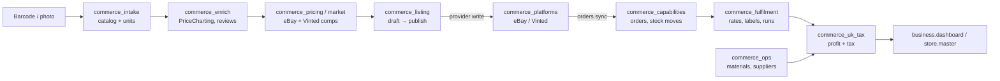

# 37 · Business and Commerce

The business subsystem is the **Business** tab (`/biz/panel`). It is an
operations control surface that a team of Vera agents can run end-to-end, with
one human overseeing. Everything is modelled around **income streams**: an eBay
shop, a Fiverr gig board, a YouTube channel, a bug-bounty practice, a
trading-card inventory, and so on. Each stream owns its own inventory, money
accounts, tasks and marketing.

On top of the streams sits a full **e-commerce and reselling operation**:

- products and individually tracked physical units
- barcode and vision intake
- enrichment and price research
- marketplace listings on eBay and Vinted
- orders, customers and service jobs
- UK shipping and thermal labels
- consumables costing, suppliers and drop-shipping
- a profit engine with UK tax estimates
- several stores with a master view

A **simulation mode** lets agents be evaluated against a synthetic business, and
a self-contained **thermal printing** subsystem prints labels, receipts and
notifications.

The code lives in `vera/business/` (streams core, simulation, thermal printer)
and `vera/commerce/` (stores, catalog, units, listings, platforms, pricing,
market watch, fulfilment, operations costing, tax). All capabilities are plain
`@capability` functions named `business.*` or `print.*`. They store data in the
shared Data-Fabric SQLite database. Money is GBP by default.

**Maturity.**

| Area | State |
|---|---|
| Local books, inventory, orders, units, tax and simulation | Working and local-only |
| eBay | Real connector for listings, offers, orders and price comparables |
| Vinted | Works through its website's unofficial JSON endpoints, using pasted session cookies |
| Shopify, WooCommerce, Etsy, Amazon | Declared stubs that return "not yet implemented" |
| Policy evidence on marketplace writes | Observe-only ([§7](#7-external-effects-and-policy-evidence)) |

## Contents

- [1. Core records](#1-core-records)
- [2. Architecture and source map](#2-architecture-and-source-map)
- [3. Streams, money and operations](#3-streams-money-and-operations)
- [4. Stores, catalog and units](#4-stores-catalog-and-units)
- [5. Sell-through lifecycle and listings](#5-sell-through-lifecycle-and-listings)
- [6. Pricing, enrichment and market watch](#6-pricing-enrichment-and-market-watch)
- [7. External effects and policy evidence](#7-external-effects-and-policy-evidence)
- [8. Platforms and credentials](#8-platforms-and-credentials)
- [9. Fulfilment](#9-fulfilment)
- [10. Profit, costing, sourcing and UK tax](#10-profit-costing-sourcing-and-uk-tax)
- [11. Simulation and agent evaluation](#11-simulation-and-agent-evaluation)
- [12. Thermal printing](#12-thermal-printing)
- [13. UI, routes and agents](#13-ui-routes-and-agents)
- [14. Storage and events](#14-storage-and-events)
- [15. Troubleshooting and reconciliation](#15-troubleshooting-and-reconciliation)
- [Related pages](#related-pages)

---

## 1. Core records

| Record | Meaning |
|---|---|
| Stream | One way money comes in. A **store** is a stream of kind `ecommerce`. |
| Money account / transaction | A bank, PayPal, Stripe, Wise, crypto, cash or platform balance, with a signed ledger (income, expense, fee, payout, refund, transfer, adjustment, tax) that drives each balance and the P&L |
| Product | Reusable catalog identity and descriptive facts (one row per title) |
| Unit | One physical copy, with its own condition, 0–10 grade, photos, cost, price, location and status |
| Stock movement | An auditable change in quantity |
| Listing | A channel-specific offer derived from product or unit data |
| Order | A commercial transaction and its fulfilment state |
| Shipment | Postage service, weight, cost, tracking and dispatch status for an order |
| Task / campaign / watch | Planned operational, marketing or market-monitoring work |

> [!IMPORTANT]
> Do not collapse products and units. Two copies of a product may differ in
> condition, acquisition cost, location and listing status. Change inventory
> through movement or adjustment operations, so the reason stays auditable.

---

## 2. Architecture and source map

| File | Responsibility |
|---|---|
| `business/business_capabilities.py` | Streams, money accounts and ledger, stream-scoped inventory, gigs, content, bounties, social accounts, campaigns, tasks, graph, dashboard, brief; the Business tab registration |
| `business/business_sim.py` | Simulation scenarios, synthetic activity, agent-loop evaluation and scoring |
| `business/thermal_printer_capabilities.py`, `print_transport_core.py`, `thermal_printer_element.js`, `print_composer.html` | ESC/POS thermal printing over server serial, Web Serial or mesh |
| `commerce/commerce_capabilities.py` | Products, stock moves, orders, customers, service jobs, store dashboard |
| `commerce/commerce_stores.py` | Several stores and the master view |
| `commerce/commerce_intake.py` | Catalog resolve, per-unit intake, vision ID and grading, unit drafts; the Scan Station panel |
| `commerce/commerce_listing.py` | Barcode lookup, scan intake, vision description, eBay defaults, listing draft/publish/archive |
| `commerce/commerce_enrich.py` | PriceCharting dossier, price history, review sentiment, sold comparables, box art |
| `commerce/commerce_pricing_capabilities.py` | Price comparables and snapshots, price suggestion |
| `commerce/commerce_market.py` | Cross-market search, watches, buy and reprice alerts |
| `commerce/commerce_platforms.py` | Connector registry, eBay OAuth, listing push, listing and order sync |
| `commerce/commerce_vinted.py` | Vinted connector and anonymous catalogue search |
| `commerce/commerce_effects.py` | Payload-free external-effect projection for marketplace writes |
| `commerce/commerce_fulfilment.py` | UK carrier rate card, shipments, labels, post-office runs, pickups |
| `commerce/commerce_ops.py` | Consumables, suppliers, sourcing, restock, drop-ship margin |
| `commerce/commerce_uk_tax.py` | Profit engine, P&L, UK tax estimate |

---

## 3. Streams, money and operations

Every list capability takes `is_sim`: `0` is the live business (the default),
`1` is the simulation sandbox, and `-1` returns both.

| Group | Capabilities | Notes |
|---|---|---|
| Streams | `business.stream.list/upsert/delete` | `kind`, `platform`, `status`, `goal_monthly`, colour and icon |
| Money | `business.account.list/upsert/delete`, `business.txn.add/list`, `business.account.recalc` | A positive amount is money in. `recalc` repairs balance drift from the full ledger. |
| Stream inventory | `business.inventory.list/upsert/adjust/delete` | Generic, card-friendly inventory (set, grade, condition) per stream, with an audit trail |
| Gigs | `business.gig.list/upsert/delete` | Freelance work (Fiverr, Upwork…) from lead to paid |
| Content | `business.content.list/upsert/delete` | YouTube, short-form and blog pipeline from idea to published, with metrics |
| Bounties | `business.bounty.list/upsert/delete` | Bug-bounty submissions (HackerOne, Bugcrowd…), with severity and reward |
| Marketing | `business.social.list/upsert/delete`, `business.social.accounts`, `business.campaign.list/upsert/delete` | Social accounts can link a real credential from the shared Accounts registry by `acct_id` |
| Tasks | `business.task.list/upsert/delete`, `business.task.schedule` | `schedule` creates a Calendar event (timed) or to-do (untimed) through `cal.*` and links it back |
| Overview | `business.dashboard`, `business.graph`, `business.brief`, `business.specialist_context` | 30-day revenue, expense and net per stream against goal; cash; pipelines. The graph links streams, accounts, gigs, content and more. The brief is grounding text for the operator agent. |

---

## 4. Stores, catalog and units

**Stores** (`business.store.list/upsert/delete/get/master`) are e-commerce streams.

- Products, orders and listings carry a `store_id`, so one instance can run
  several shops with separate inventory and books.
- `business.store.master` rolls every store up, with an *Unassigned* bucket and
  combined totals.
- Deleting a store keeps its items; they simply become unassigned.

**Catalog and stock** (`commerce_capabilities.py`):

| Capability | Purpose |
|---|---|
| `business.product.list/get/upsert/delete` | Catalog products: SKU, UPC, cost, price, reorder point and quantity, location, supplier, store |
| `business.stock.adjust` / `business.stock.moves` | Signed adjustment with a reason and reference; the audit trail |
| `business.product.low_stock` | Products at or below their reorder point |
| `business.order.list/get/upsert/set_status` | Orders. Creating with `deduct_stock=true` draws down stock (one `sale` move per line). |
| `business.customer.list/get/upsert/delete` | A light CRM |
| `business.service.list/get/upsert/set_status` | Service jobs and work orders |
| `business.store.dashboard` | Inventory value, low-stock count, open orders, 30-day revenue, connected platforms |

**Units** (`commerce_intake.py`) let a used-goods shop carry four copies of the
same title in four conditions. The catalog product's `qty_on_hand` is kept in
sync with the number of in-stock units.

| Capability | Purpose |
|---|---|
| `business.catalog.resolve` | Find or create the catalog product for a barcode or title (UPC first, then exact name in the store) |
| `business.unit.intake` | One step: barcode lookup → resolve catalog → create the unit → store photos → optionally grade and describe with the vision model → optionally suggest a price |
| `business.unit.list/get/upsert/delete` | Units. Status is `in_stock`, `listed`, `sold`, `reserved` or `scrapped`. |
| `business.unit.move` | Move units to another store, for example from a personal collection into a shop |
| `business.vision.identify_item` | Identify a barcode-less item from a photo: title, platform and region candidates with confidence. It also reads a barcode if one is visible. |
| `business.vision.assess_unit` | Grade condition (0–10), list flaws and write the per-unit description, with the catalog details in context |
| `business.unit.draft_listing` | Draft a listing from a unit and mark the unit `listed` |

The vision capabilities need a vision-language model to be loaded
([28](./28-render.md)).

---

## 5. Sell-through lifecycle and listings

1. Intake or identify a unit (`business.scan.intake`, `business.unit.intake`).
2. Resolve or create its product identity.
3. Capture condition, images, cost and storage location.
4. Enrich it and research comparable prices (§6).
5. Draft and review a marketplace listing (`business.listing.draft`).
6. Publish through an authorized platform account (`business.listing.publish`).
7. Sync orders, book shipping, and update unit and order status (§8, §9).
8. Record fees, revenue, cost, profit and tax classification (§10).

> [!NOTE]
> AI enrichment, vision grading and price suggestions are **proposals**. Human
> review remains necessary for identity, condition, legal claims, price, tax and
> publication.

| Capability | Purpose |
|---|---|
| `business.barcode.lookup` | UPC/EAN/ISBN → title, brand, category, images. Uses keyless sources: UPCitemdb trial, OpenLibrary for books, then a web-search fallback. |
| `business.scan.intake` | Create a product from a scan, or bump its quantity if the UPC already exists |
| `business.vision.describe_item` | Photo → draft title, brand, platform, category, condition, description, keywords |
| `business.ebay.defaults` | Store the eBay fulfilment, payment and return policy ids, the location and the category that publishing needs |
| `business.listing.draft` | Title (≤ 80 characters), description, item specifics and a suggested price that is never below cost plus margin |
| `business.listing.list` | Drafts and listings, by status (`draft`, `published`, `archived`, `error`), platform, product or store |
| `business.listing.publish` | **Provider write.** eBay: sync the inventory item, then create and publish the offer. Vinted: create the item. |
| `business.listing.archive` | **Provider write if live.** Withdraw the eBay offer or delete the Vinted item, then archive locally. |

---

## 6. Pricing, enrichment and market watch

| Capability | Purpose |
|---|---|
| `business.price.lookup` | Price comparables for a product, stored as a snapshot. Uses the eBay Browse API when an eBay account is connected, otherwise a keyless web-search fallback. |
| `business.price.snapshots` | Snapshot history |
| `business.price.suggest` | A competitive price that is never below `cost × (1 + margin)` (default margin 0.30) |
| `business.enrich.item` | A full dossier from free sources (cached): PriceCharting loose, CIB, new and graded prices; full price history and metadata; live eBay and Vinted market stats; an LLM review summary with sentiment and a 0–100 score |
| `business.pricehistory.get` | Merged per-condition series for charting |
| `business.enrich.refresh_all` | Re-value every product; intended to run nightly |
| `business.market.sold` | Sold-price points, using PriceCharting's prices (which are derived from eBay sales) |
| `business.catalog.products` | The product database that builds up as you scan, with valuation age |
| `business.images.fetch` | Box art and screenshots from libretro-thumbnails and PriceCharting |
| `business.market.search` | One query across eBay and Vinted, with per-platform and combined low, median, high and average |
| `business.watch.upsert/list/delete` | Saved searches with a target price or discount |
| `business.watch.scan` | Run watches. Flags buy opportunities, flags owned listings that are mispriced (for repricing), and emits a `commerce.alert` event per new deal. |
| `business.market.alerts` / `business.market.alert.seen` | The alert feed |
| `business.market.reprice` | Compare one product's price to the market. Suggest a new price (default margin 0.30, undercut 0.03), or apply it. |
| `business.vinted.search` | Anonymous Vinted catalogue search (no account needed) |

USD prices are converted to GBP using a live, keyless exchange rate.

---

## 7. External effects and policy evidence

Marketplace publishing, order synchronization, label booking, customer contact
and financial records are external or durable mutations. Use idempotency keys
where supported, and keep provider IDs. On retry, query the current remote state
before creating a second listing, shipment or transaction.

The implemented boundary is narrower than that model:

- **Local writes.** Core business, inventory, customer, order, transaction and
  draft-listing operations write Vera's local database.
- **Simulation.** `business.sim.*` is explicitly simulated.
- **Provider reads.** Pricing and enrichment, eBay and Vinted listing sync, and
  order sync read provider state and may then update local records.
- **Credentials.** OAuth exchange and refresh change the credential lifecycle,
  not listing state.

**Real marketplace writes** are concentrated in three capabilities:

| Capability | Provider effect |
|---|---|
| `business.platform.listing.push` | eBay: upsert the inventory item and create or update the offer. Vinted: create the item. |
| `business.listing.publish` | eBay: sync the item, then create and publish the offer. Vinted: create the item. |
| `business.listing.archive` | eBay: withdraw the offer. Vinted: delete the item. |

Shopify, WooCommerce, Etsy and Amazon connectors are declared but not
implemented. The deterministic `integration.effect.inventory` capability reports
these facts without calling a provider ([23](./23-integrations.md)).

**Policy evidence.** These three write paths project payload-free policy evidence
(`vera.marketplace-listing-effect-shadow/v1`) **before** opening marketplace
credentials:

- Account, listing and provider identities are kept only as SHA-256 digests.
- The optional `idempotency_key`, `approval_receipt_ref` and `retry` inputs feed
  the plan.
- The receipt ledger is consulted for an earlier success.
- The result is returned as `effect_shadow` and recorded in the Commerce view of
  the Integrations effect-evidence drawer.

The projection is **observe-only**. It does not:

- block or retry a provider call
- forward approval or idempotency references to the provider
- record completion
- establish provider idempotency

A draft-only archive creates no external-effect evidence, because it performs no
provider write. These capabilities also redact their identifying arguments and
their results from telemetry (`redact_args`, `redact_result`).

---

## 8. Platforms and credentials

| Capability | Purpose |
|---|---|
| `business.platform.connectors` | Available connectors, whether each is real or a stub, whether it needs OAuth, capability flags, and connected-account counts |
| `business.platform.accounts` | Connected accounts, with secrets redacted |
| `business.platform.connect` | Save app credentials (`client_secret` is sealed). For eBay, also return an `auth_url` for the human to open. Inputs: `connector`, `label`, `env` (`production` or `sandbox`), `client_id`, `client_secret`, `ru_name`. |
| `business.platform.disconnect` | Remove an account and its tokens |
| `business.platform.listings.sync` | Pull listings into local products, matching on SKU |
| `business.platform.orders.sync` | Pull orders, deduplicated by external id. Newly imported orders draw down matching SKU stock. |
| `business.platform.listing.push` | Create or update a listing from a local product (§7) |
| `business.vinted.connect` | Connect Vinted by pasting browser session cookies (`access_token_web`, and optionally `_vinted_fr_session` and the user id) |

**eBay.**

- A client-credentials **app token** is used for read-only Browse API pricing.
- An authorization-code **user token** is used for the Sell APIs.
- The OAuth callback is `GET /commerce/oauth/callback`. The `state` value is
  valid for 15 minutes.
- Access tokens are cached until expiry and refreshed from the stored refresh
  token.

**Vinted** has no official API. Vera never automates the login, because that
would be fragile and against the site's terms. Instead the operator pastes the
cookies once; they are sealed at rest, and the access token is refreshed from the
refresh cookie where possible.

All platform secrets are sealed with `security/secrets.py`
([29](./29-security.md)) and never returned to the UI.

---

## 9. Fulfilment

The UK rate card covers Royal Mail (Large Letter to Special Delivery), Evri,
Yodel and InPost, with weight-tiered prices. These are editable defaults, not a
live carrier API.

| Capability | Purpose |
|---|---|
| `business.ship.carriers` | The rate card |
| `business.ship.rates` | Cheapest-first quotes for a parcel (`weight_g`, format, tracked/signed filters), compared with what the buyer paid |
| `business.ship.book` | Create a shipment for an order. The postage cost flows into profit; can mark the order `shipped`. |
| `business.ship.list` / `business.ship.mark` | Shipments by status (`to_ship`, `labelled`, `posted`…); update status and tracking, optionally mirroring it onto the order |
| `business.ship.label` | Print an address label through `print.label`, using the buyer address from the order |
| `business.ship.postrun` | Batch everything waiting into one post-office trip, add a Calendar event, and return a manifest |
| `business.ship.pickup` | Record a courier or Royal Mail collection and add a Calendar event. Booking with the carrier itself is a separate step. |

---

## 10. Profit, costing, sourcing and UK tax

**Per order.** `business.profit.order` splits revenue into:

- COGS (from the product cost)
- the platform fee (from the per-platform fee schedule)
- postage (from the booked shipment)
- packaging (from `business.material.per_item`, or a flat default)
- other costs

It then derives net profit and margin. `business.profit.record` overrides any
component for one order.

**Reporting.**

- `business.profit.report` produces a P&L over all time, a UK tax year, a month or
  a date range, by platform and store.
- `business.tax.summary` estimates a UK tax year (6 April to 5 April): gross
  trading income, allowable expenses or the £1,000 trading allowance (whichever is
  better), taxable profit, Income Tax with the personal-allowance taper, Class 4
  NIC, VAT if registered, and an amount to set aside.
- `business.tax.settings` and `business.tax.settings.set` hold the VAT scheme,
  trading-allowance policy, other income, fee schedule, packaging default and
  set-aside buffer.

Nothing is filed with HMRC. This is a book-keeping and estimation surface.

**Consumables, suppliers and drop-shipping** (`commerce_ops.py`):

| Capability | Purpose |
|---|---|
| `business.material.upsert/list/delete/per_item` | Bulk purchases of packaging and postage consumables, from which a per-item cost is derived (optionally per category) |
| `business.supplier.upsert/list/delete` | Suppliers (AliExpress, wholesalers…) |
| `business.sourcing.upsert/list` | Link a product to a supplier offer: unit cost converted to GBP, shipping, MOQ, and fulfilment mode `stock` or `dropship` |
| `business.restock` | For `stock` mode, create units at landed cost. For `dropship`, record intent only. |
| `business.dropship.profit` | Revenue minus supplier cost, supplier shipping, marketplace fee, your postage and packaging. Also flags the UK import-VAT position (eBay collects VAT on consignments under £135). |

---

## 11. Simulation and agent evaluation

Simulated streams and accounts carry `is_sim=1` in the shared tables. They use
exactly the same capabilities as real work, but never touch the live books.

| Capability | Purpose |
|---|---|
| `business.sim.scenarios` | Available scenarios: `reseller`, `creator`, `freelancer`, `empty` |
| `business.sim.start` | Seed a scenario (`seed` for reproducibility). Closes any previous active run. |
| `business.sim.step` | Generate `n` synthetic transactions (sales, fees, payouts…) |
| `business.sim.status` | Active run, step count, totals and evaluations |
| `business.sim.evaluate` | Record a goal and rubric, capture the baseline, and return the agent-loop request to fire at `/workshop/agent_loop/stream` |
| `business.sim.score` | Score a finished evaluation (0–100) **mechanically** from the change in the sim ledger: net-income change, goal attainment, task completion |
| `business.sim.reset` | Purge every simulated stream, account and ledger entry (`confirm` required) |

`business.dashboard is_sim=1` shows the simulated world. The DAG Workshop's
loop-evaluation view uses this surface ([03](./03-dag-engine.md)).

---

## 12. Thermal printing

The `print.*` capabilities turn any ESC/POS USB thermal printer into a Vera
capability. The panel is `/print/panel`, registered as the **Thermal Printer**
element and the `<vera-thermal-printer>` custom element. Every capability builds
ESC/POS bytes and routes them by the printer's transport:

| Transport | Route |
|---|---|
| `server_serial` | Written to a serial or USB port on the server with `pyserial`. This is optional and imported lazily. Without it, the bytes are still returned. |
| `webserial` | The bytes are returned as base64, and the browser element writes them over Web Serial. This needs a secure context ([29](./29-security.md#6-certificates-and-https)). |
| `mesh` | Forwarded to an ESP32 mesh node with `mesh.send(node_id, "serial_write", …)` ([14](./14-mesh.md)) |

| Group | Capabilities |
|---|---|
| Setup | `print.status`, `print.printers`, `print.printer.upsert` (name, transport, port, baud (default 9600), `node_id`, `width_mm` 58/80, default flag), `print.printer.delete` |
| Printing | `print.text`, `print.receipt` (items, totals, CODE128 barcode, QR), `print.label` (address), `print.item_label` (inventory sticker or slip), `print.raw`, `print.image` (dithered to 1-bpp), `print.nice` (TrueType-rendered text), `print.notify` (notification; also the `printer` delivery channel) |
| Feeds | `print.schedule` (today's calendar), `print.dream_digest`, `print.news`, `print.fabric` (latest items of a dataset). Each supports `preview`. |
| Automation | `print.config.get/set` (daily auto-print of schedule, dreams and news at a chosen time), `print.subs.get/set` and `print.push` (per-source subscriptions for system, dreams, narrator and chat output) |

The `daily_print` schedule checks every 60 seconds. It is a singleton and is
skipped in development sandboxes.

---

## 13. UI, routes and agents

| Route | Surface |
|---|---|
| `/biz/panel` | The **Business** tab: streams, money, operations, stores, reselling, simulation, embedded printer element |
| `/business/intake/panel` (alias `/commerce/intake/panel`) | Scan Station: barcode and photo intake of units |
| `/business/store/panel` (alias `/commerce/uk/panel`) | Store and reselling operation panel |
| `/commerce/panel` | Legacy commerce panel. Its tabs are folded into the Business tab. |
| `/print/panel` | Thermal printer |
| `/commerce/oauth/callback` | eBay OAuth return |

The Business tab registers the specialist agent **`business-operator`** with the
`business-shop` loop profile and `business.specialist_context` as its live
context. `business.brief` is the grounding text for the conversational operator
([19](./19-agents-chat.md)).

---

## 14. Storage and events

**SQLite tables** (shared Data-Fabric database):

| Area | Tables |
|---|---|
| Business core | `biz_streams`, `biz_accounts`, `biz_ledger`, `biz_inventory`, `biz_gigs`, `biz_content`, `biz_bounties`, `biz_social`, `biz_campaigns`, `biz_tasks` |
| Simulation | `biz_sim_runs`, `biz_sim_evals` |
| Commerce | `commerce_products`, `commerce_units`, `commerce_stock_moves`, `commerce_orders`, `commerce_order_costs`, `commerce_customers`, `commerce_service_jobs`, `commerce_listings` |
| Pricing and market | `commerce_price_snapshots`, `commerce_price_history`, `commerce_enrichment`, `commerce_watches`, `commerce_market_alerts` |
| Platforms | `commerce_platform_accounts` (sealed secrets) |
| Fulfilment | `commerce_shipments`, `commerce_pickups` |
| Costing and tax | `commerce_materials`, `commerce_suppliers`, `commerce_sourcing`, `commerce_tax_settings` |
| Printing | `print_printers`, `print_kv` |

**Events:**

| Event | Meaning |
|---|---|
| `biz.progress` | Progress of business-core operations |
| `commerce.progress` | Progress of intake, vision, listing and sync stages |
| `commerce.alert` | A new buy opportunity from `business.watch.scan` |
| `business.sim` | Simulation runs and steps |
| `print.job` | Print jobs |

---

## 15. Troubleshooting and reconciliation

Reconcile from stable IDs: the store or account, the platform listing or order,
the internal product, unit or order, and the shipment. Common problems are:

- duplicate products
- stale stock after an external sale
- incorrect fee or tax assumptions
- image rights
- a unit still listed on several channels after it has become unavailable

| Symptom | Cause / fix |
|---|---|
| Publishing to eBay fails asking for policies | Run `business.ebay.defaults` once for the account. |
| *"state expired or invalid"* on the eBay callback | More than 15 minutes passed, or the server restarted. Run `business.platform.connect` again. |
| A Shopify, WooCommerce, Etsy or Amazon call says "not yet implemented" | These connectors are stubs. |
| Vinted actions fail but search works | The session cookies expired. Re-run `business.vinted.connect`. Anonymous search needs no login. |
| Vision capabilities report *"vision model not loaded"* | Pull a vision-language model (for example `qwen2.5vl`). |
| An account balance disagrees with its ledger | `business.account.recalc`. |
| Catalog quantity disagrees with units | Units drive the count. Editing or deleting a unit resyncs it. |
| `server_serial` printing returns bytes but nothing prints | `pyserial` is missing or the port is wrong. Check `print.status`. |

---

## Related pages

- [Integrations](./23-integrations.md) — external accounts, `integration.effect.inventory` and the effect-evidence drawer
- [Security & Secrets](./29-security.md) — how platform credentials are sealed
- [Render and media](./28-render.md) — generated media and the vision model
- [Agents and chat](./19-agents-chat.md) — agent behaviour and specialist profiles
- [Markets](./15-markets.md) — trading, portfolio and UK CGT for investments
- [Device Mesh](./14-mesh.md) — ESP32 nodes used as printer transports

<!-- VERA:AUTO:screenshots START -->
<!-- VERA:AUTO:screenshots END -->

<!-- VERA:AUTO:capabilities START -->
<!-- VERA:AUTO:capabilities END -->
