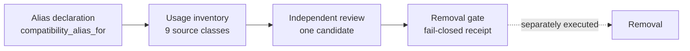

# Canonical system inventory

`system.inventory` captures Vera's loaded architecture as canonical JSON. It
does this without changing runtime state or calling a model. Use it to compare
two builds, to detect architectural drift, and to gather evidence before
retiring an old surface.

Around it, `vera/inventory/` holds a family of offline, source-bound
**reviews** and the **deprecation pipeline**. That pipeline runs from usage
evidence, to an independent review, to a fail-closed removal gate.

Everything here lives in `vera/inventory/`. The live capability is
`system_inventory.py`; the other modules are pure libraries exercised by their
tests and by the compatibility-usage recorder in the capability wrapper.

**Maturity.** `system.inventory` is tagged `experimental`. The deprecation
modules are evidence-only by design: nothing in this directory removes,
disables or migrates anything.

## Contents

- [1. What the snapshot contains](#1-what-the-snapshot-contains)
- [2. Calling it](#2-calling-it)
- [3. Fingerprint and drift](#3-fingerprint-and-drift)
- [4. Privacy and redaction](#4-privacy-and-redaction)
- [5. First retained baseline](#5-first-retained-baseline)
- [6. Limitations](#6-limitations)
- [7. Deprecation evidence](#7-deprecation-evidence)
  - [7.1 Usage inventory](#71-usage-inventory)
  - [7.2 Independent reviews](#72-independent-reviews)
  - [7.3 The removal gate](#73-the-removal-gate)
- [8. Source-bound authority reviews](#8-source-bound-authority-reviews)
- [9. Source map](#9-source-map)
- [Related pages](#related-pages)

---

## 1. What the snapshot contains

The snapshot schema is `vera.system-inventory/v1`. It contains:

| Section | Contents |
|---|---|
| `capabilities` | Name, inferred role and its basis, mode, source, `compatibility_alias_for`, implementing module and callable, schema, streams, tags, `mcp_expose`, HTTP binding |
| `modules` | Each loaded module's name, repo-relative path, number of capabilities added, and `ok`/`error` status with the error text |
| `panels` | UI panel id, label, icon, group and order |
| `http_routes` | Path, methods and route name for every FastAPI route |
| `schedules` | Schedule definitions, without volatile run counters or timestamps |
| `workers`, `mcp_servers` | Worker runtime records; MCP server registrations (endpoints with credentials stripped) |
| `configuration_keys` | Each centrally declared configuration key and whether it was **explicitly** supplied by the environment, never its value |
| `stored_workflows` | Stored DAG identities from both the DAG store and the Fabric DAG store: name, category, tags, node count and referenced capability names, without definitions, prompts or state |
| `database_schema` | Table names declared by loaded local modules (`CREATE TABLE` statements found in their source), without opening a database |
| `artifacts` | Artifact *provider* surfaces only, explicitly not project artifact content |
| `connections` | Saved connection identity and type, and whether a credential reference exists, without endpoints, credential IDs, metadata or secrets |
| `caller_graph` | Evidence-based caller edges from Python registration, HTTP routes, MCP exposure, schedules and stored workflow nodes |
| `observed_caller_graph` | Bounded caller edges observed in recent capability telemetry (up to the last 500 `obs.events`), reduced to actor class (UI, agent or system), capability, terminal outcome and count |
| `duplication_signals` | Capabilities whose names contain `loop`, `pipeline`, `workflow`, `run`, `job`, `task`, `scheduler`, `generate`, `query` or `store`, for duplication investigations |
| `coverage`, `observation_coverage` | Which sections are included; runtime caller coverage is reported as `partial` |

Every response also carries `schema_version`, `captured_at`, `counts`
(including `module_errors`) and `fingerprint_sha256`.

**Inferred roles** are conservative hints, never policy:

| Role | Rule |
|---|---|
| `internal` | Not exposed through MCP |
| `alias` | Source or tags mark an alias |
| `deprecated` | `deprecated`/`legacy` tags or description |
| `experimental` | `experimental` tag or description |
| `provider_admin` | MCP proxy source, or `provider`/`admin`/`config` tags |
| `public_task` | Everything else |

---

## 2. Calling it

| Capability | Inputs | Output |
|---|---|---|
| `system.inventory` | `detail` (bool, default `false`) | Compact summary by default; all canonical records with `detail=true` |

The capability is silent and has `memory="off"`. It has no HTTP route of its own,
so call it through `/mcp/call`. The compact summary contains:

- `schema_version`, `captured_at`, `fingerprint_sha256`
- `counts`
- `role_counts_inferred`
- `module_errors`
- `duplication_signal_counts`
- `coverage`, `observation_coverage`
- `detail: false` and a hint to pass `detail=true`

The compact form exists so that routine agent and dashboard calls do not ingest
a multi-megabyte manifest.

```bash
curl -s -X POST localhost:8999/mcp/call -H 'content-type: application/json' \
  -d '{"name":"system.inventory","arguments":{}}' | jq '.content | {fingerprint_sha256, counts, module_errors}'
```

---

## 3. Fingerprint and drift

The structural SHA-256 fingerprint is computed over canonical JSON with sorted
keys. It **excludes**:

- capture time
- worker records (heartbeats, counters, PIDs and random process ids)
- schedule run counters and timestamps, which are canonicalised away
- registry load order (records are sorted)
- the observed caller graph and its coverage

Two scans of an unchanged process should therefore match, even while its
heartbeat and schedules advance. Ordinary UI and agent activity cannot
manufacture architecture drift. The full worker records still appear in the
detailed snapshot as operational evidence; they simply do not affect the
fingerprint.

> [!TIP]
> Retain snapshots only at meaningful branch or release boundaries. Comparisons
> should report added, removed and changed identities, rather than committing a
> multi-megabyte dump on every start-up.

---

## 4. Privacy and redaction

The inventory protects private data in several ways:

- **Secret-looking keys are redacted.** Any mapping key containing `password`,
  `passwd`, `token`, `secret`, `credential`, `api_key` or `auth`, anywhere in a
  capability schema or worker metadata, is replaced with `[redacted]`.
- **Endpoints are cleaned.** MCP server endpoints have credentials stripped.
  Connections report only whether a credential reference exists.
- **No content is copied.** Workflow definitions, prompts, artifact contents and
  database rows are never read into the snapshot.
- **Observed edges are aggregate.** They never retain session or trace IDs,
  timestamps, previews, arguments, results or error text.
- **Configuration values stay private.** Only explicit-presence flags are
  reported. Defaults are not reported.

---

## 5. First retained baseline

An isolated sandbox produced two consecutive matching scans on 2026-08-23:

| Field | Value |
| --- | ---: |
| Structural fingerprint | `1bec8bbb4eb82077db8c2d03c3a552c0fa1358f97f9b0b0764c47f4f3d54a326` |
| Capabilities | 2,125 |
| Loaded-module records | 143 |
| Module errors | 2 |
| UI panels | 66 |
| HTTP routes | 2,882 |
| Unique method/path signatures | 2,846 |
| Schedules | 60 |
| Workers | 1 |
| MCP servers | 0 |

The module errors were kept in the snapshot rather than silently skipped:

- `spritegen_capabilities`: `No module named 'PIL'`;
- `worldview_jepa`: `'NoneType' object has no attribute 'Module'`.

The keyword-family counts were:

| Family | Count |
|---|---:|
| `loop` | 4 |
| `pipeline` | 18 |
| `workflow` | 0 |
| `run` | 54 |
| `job` | 6 |
| `task` | 7 |
| `scheduler` | 4 |
| `generate` | 12 |
| `query` | 11 |
| `store` | 18 |

These are discovery signals, not proof that two capabilities are semantically
duplicated.

> [!NOTE]
> This baseline predates the configuration, workflow, schema, artifact,
> connection and caller-graph sections. Since then the system has grown, and a
> later live sandbox registered more than 2,200 capabilities. Re-baseline before
> comparing.

---

## 6. Limitations

**Role inference is weak.** The baseline classified 2,121 capabilities as the
default `public_task`, two as `internal` and two as `experimental`. That
imbalance shows that registration metadata alone cannot support the role
taxonomy reliably, so inferred roles must not be used as policy. Explicit
ownership and lifecycle metadata belongs in capability contracts
([43](./43-capability-contracts.md)).

**Coverage is broad but bounded.** Every named surface is covered, but coverage
does not mean unbounded data extraction:

- Workflow definitions and artifact contents are deliberately excluded.
- Database evidence is the declared schema, not a live inspection of rows.
- Connections are aggressively redacted.

**The caller graph is partial.** It records interfaces and stored-workflow nodes
supported by concrete metadata. It is not a complete dynamic Python trace. UI,
agent and background-system caller identity is enriched from a bounded window of
the shared capability telemetry, and that coverage is explicitly `partial`. An
absent edge means the call was not observed in the retained window, not that no
caller exists.

---

## 7. Deprecation evidence

Compatibility paths are inventoried as *candidates*, not assumed to be dead.
Explicit alias declarations provide the candidate, the replacement and the
owner. A capability declares itself an alias with
`@capability(..., compatibility_alias_for="<replacement>")`. Vera does not infer
lifecycle state from naming conventions. The canonical capability inventory
carries the declared replacement alongside each alias.



### 7.1 Usage inventory

`deprecation_inventory.py` uses schema `vera.deprecation-inventory/v1`.

Usage evidence has nine named source classes:

- `code_reference`
- `http_caller`
- `mcp_caller`
- `stored_workflow`
- `schedule`
- `ui_link`
- `configuration`
- `artifact`
- `external_consumer`

Every report must account for every class as `complete`, `partial` or
`unavailable`. An incomplete status needs a reason code. An unavailable source
remains a blocker; it never silently becomes evidence of zero use.

**Live counters.** When an alias capability is called over HTTP or MCP, the
capability wrapper calls `record_alias_usage`, which increments a durable,
payload-free counter:

- Redis hash `vera:deprecation:alias-usage:v1:counts`
- metadata in `vera:deprecation:alias-usage:v1:metadata`

The counters keep the alias, its replacement, the transport class, the count
and the latest observation time. They never keep arguments or results. If the
evidence write fails, the call itself still succeeds.

**Scanning and classification.** Supplied code and configuration snapshots can
be scanned deterministically. Only a digest of the source reference and an
exact-token count are kept. Observations are classified as `consumer`,
`health_check` or `migration_probe`; health checks and migration probes are
reported separately from real consumers.

Candidate kinds include:

- `compatibility_alias`, `ontology_projection`, `scheduler`
- `transition_engine`, `agent_loop`, `generation_capability`
- `onnx_capability`, `bridge_surface`, `context_probe`
- `memory_authority`, `superseded_path`

The inventory is evidence only. Even complete coverage with no known consumer
produces an *independent-review candidate*, never removal authority.

### 7.2 Independent reviews

`deprecation_review.py` (schema `vera.deprecation-candidate-review/v1`) produces
content-addressed review records, each for exactly one candidate. A review binds:

- the candidate
- the exact inventory digest
- evidence digests (kinds: `inventory`, `snapshot`, `runtime_state`,
  `semantic_contract`, `evaluation`, `rollback`, `consumer`)
- the consumer count and coverage state
- the rationale and required follow-up

Supported recommendations are `retain`, `adapt`, `migrate`,
`insufficient_evidence` and `removal_candidate`. The last of these requires
complete zero-consumer coverage plus semantic-contract and rollback evidence.
Even then it carries no removal authority, and the separate removal gate
remains mandatory.

`compatibility_path_review.py` applies the same approach to explicit
compatibility paths. It reads source and checks the runtime registration, but
never imports the reviewed modules.

### 7.3 The removal gate

`removal_gate.py` (schema `vera.compatibility-removal-gate/v1`) evaluates one
removal submission and returns a deterministic **eligibility receipt**:
`gate_passed`, `eligible_for_separately_executed_removal` and sorted `blockers`.
The receipt always says `removes_anything: false`, `executes: false`,
`mutates: false` and `missing_telemetry_means_zero_use: false`.

The gate blocks unless **all** of the following hold:

- **Evidence.** Digests are present for all 17 evidence kinds: semantic diff;
  caller, state and configuration inventories; success, error, timeout, cancel,
  restart and recovery fixtures; shadow assessment; conformance;
  quality/reliability; state export; rollback rehearsal; documentation
  migration; explicit approval.
- **Review.** The independent review recommends `removal_candidate`.
- **Coverage.** Inventory coverage and telemetry are complete, and no stored
  definitions remain unmigrated.
- **Zero use.** There are at least **two** normal, non-overlapping zero-use
  observation cycles, each with complete telemetry and no non-probe calls.
- **Quality.** Full conformance passed, with no meaningful quality or
  reliability regression.
- **Latency.** The candidate's p95 latency is within **10%** of baseline, unless a
  performance exception is justified with a gain digest.
- **Rollback and docs.** The state-export checksum is verified, rollback has been
  rehearsed and retained for the release, and the documentation is migrated.
- **Approval.** Explicit approval is given, scoped to this exact candidate (id or
  name).

---

## 8. Source-bound authority reviews

These modules make an overlapping area reviewable *before* a shared contract
changes it. Each reads repository source only. None of them imports the
inventoried subsystem, resolves a live capability, contacts a model or alters
behaviour. Each returns a canonical, digest-identified record.

| Module | Schema | Reviews |
|---|---|---|
| `execution_authority_review.py` | `vera.execution-authority-review/v1` | Scheduler, job and transition surfaces, by role (executor, driver, state gateway/authority, observer, projection, native adapter) |
| `agent_loop_authority_review.py` | `vera.agent-loop-authority-review/v1` | Generic and domain-specific agent loops (executor, controller, adapter, router, program orchestrator, domain executor) |
| `provider_generation_discovery_review.py` | `vera.provider-generation-discovery-review/v1` | Generation entry points (task provider, generation broker, backend-direct, external-direct) and whether loop discovery offers them by default |
| `memory_record_authority_review.py` | `vera.memory-record-authority-review/v1` | Overlapping Memory record write/read authorities |
| `onnx_capability_authority_review.py` | `vera.onnx-capability-authority-review/v1` | ONNX artifact and capability identity authority |
| `bridge_runtime_boilerplate_review.py` | `vera.bridge-runtime-boilerplate-review/v1` | Repeated agent-bridge lifecycle plumbing (no Docker, no image build, no framework import) |
| `context_capability_probe_review.py` | `vera.context-capability-probe-review/v1` | Context's direct named-capability dependencies |
| `discovery_context_baseline.py` | `vera.discovery-context-baseline/v1` | The discovery and context retrieval route surface (portable discovery, routing, orchestration, operator read model, benchmark, context orchestration) |

Benchmarks over the discovery and context routes are described in
[42](./42-performance-baseline.md#6-discoverycontext-benchmark-contract).

---

## 9. Source map

| File | Responsibility |
|---|---|
| `vera/inventory/system_inventory.py` | `system.inventory`; `build_system_inventory` / `summarize_system_inventory` (pure, testable) |
| `vera/inventory/deprecation_inventory.py` | Candidates, observations, source coverage, alias-usage counters |
| `vera/inventory/deprecation_review.py` | Independent candidate reviews |
| `vera/inventory/compatibility_path_review.py` | Source-bound reviews of explicit compatibility paths |
| `vera/inventory/removal_gate.py` | Fail-closed, non-executing removal gate |
| `vera/inventory/*_review.py`, `discovery_context_baseline.py` | Source-bound authority reviews (§8) |
| `tests/test_system_inventory.py`, `tests/test_deprecation_*.py`, `tests/test_removal_gate.py`, `tests/test_*_review.py` | The executable specification for each module |

---

## Related pages

- [Capability framework](./01-capability-framework.md) — the registry, modules, panels and routes being inventoried
- [Capability contracts](./43-capability-contracts.md) — explicit ownership, lifecycle and effects metadata
- [Capability policy](./45-capability-policy.md) — why inferred roles must not be used as policy
- [Performance baseline](./42-performance-baseline.md) — measurement instruments and benchmark contracts
- [Security & Secrets](./29-security.md) — redaction rules shared with telemetry
