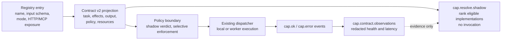

# Capability contracts

Vera's capability registry is intentionally broad: local functions, distributed
workers, DAG-backed tools, and MCP providers all appear through one invocation
surface. That interoperability is useful, but a name, input schema, and prose
description are not enough for a resolver or tool-using model to choose safely
between similar implementations, or for a policy layer to know what a call can
change.

**Capability Contract v2** adds an inspection layer around the live registry.
Every registry entry can be projected into a stable `vera.capability-contract/v2`
manifest that states the canonical task, effects, output schema, policy posture,
execution semantics, operational quality, resources, and provenance. Contracts
do not replace registration, dispatch, or authorization: existing capabilities
run exactly as before while their metadata is made explicit incrementally. The
projection, lint, coverage, gate, and observation logic lives in
[`vera/capability_contract_core.py`](../vera/capability_contract_core.py); the
`cap.contract.*` capabilities that expose it are registered in
[`vera/capability_orchestration.py`](../vera/capability_orchestration.py).

**Status:** shipped and stable as an inspection surface. Declarations are being
added family by family, so most of the registry is still *legacy-projected*
(in a local check in October 2026, about 80 of roughly 2,700 registered
capabilities carried an explicit contract). Contracts feed the
[shadow resolver](#resolver-shadow-mode) and the
[policy boundary](45-capability-policy.md); neither of those rewrites a contract
or grants authority on its own.

## Contents

- [Where contracts sit in the control path](#where-contracts-sit-in-the-control-path)
- [Source map](#source-map)
- [Manifest model](#manifest-model)
  - [Top-level fields](#top-level-fields)
  - [Effects vocabulary](#effects-vocabulary)
  - [Status values and unknowns](#status-values-and-unknowns)
  - [Fingerprints](#fingerprints)
- [Declaring a contract](#declaring-a-contract)
  - [Secret inputs](#secret-inputs)
  - [Helper builders used in the codebase](#helper-builders-used-in-the-codebase)
- [Capability reference](#capability-reference)
  - [cap.contract.manifest](#capcontractmanifest)
  - [cap.contract.lint](#capcontractlint)
  - [cap.contract.coverage](#capcontractcoverage)
  - [cap.contract.gate](#capcontractgate)
  - [cap.contract.observations](#capcontractobservations)
  - [cap.resolve.shadow](#capresolveshadow)
- [Lint rules](#lint-rules)
- [Lifecycle and deprecation](#lifecycle-and-deprecation)
- [Resolver shadow mode](#resolver-shadow-mode)
  - [Eligibility rules](#eligibility-rules)
  - [Ranking order](#ranking-order)
- [Declared capability families](#declared-capability-families)
  - [Generation and authoring](#generation-and-authoring)
  - [Operator](#operator)
  - [Inspection and evaluation surfaces](#inspection-and-evaluation-surfaces)
- [Worked examples](#worked-examples)
- [Failure modes and troubleshooting](#failure-modes-and-troubleshooting)
- [Migration path](#migration-path)
- [Related pages](#related-pages)

## Where contracts sit in the control path

The control path around a capability call is deliberately layered:



1. The registry exposes the implementation and input schema.
2. Contract v2 describes canonical task, effects, output, policy, and resources.
3. `cap.resolve.shadow` ranks eligible implementations without invoking them.
4. The [policy boundary](45-capability-policy.md) decides whether scoped
   authority is sufficient.
5. The existing dispatcher executes only after that boundary.
6. Activity and privacy-safe observations report what actually happened.

Keeping these stages separate prevents a good resolver score from becoming an
authorization grant, and prevents recent runtime telemetry from silently
rewriting a stable declaration.

## Source map

| File | Responsibility |
|---|---|
| [`vera/capability_contract_core.py`](../vera/capability_contract_core.py) | Pure projection (`project_contract`, `project_registry`), fingerprinting, lint, coverage, strict gate, and redacted observation summaries. No I/O. |
| [`vera/capability_resolver_core.py`](../vera/capability_resolver_core.py) | Pure shadow resolver (`resolve_shadow`): eligibility, exclusion reasons, deterministic ranking. Never invokes or authorizes. |
| [`vera/capability_orchestration.py`](../vera/capability_orchestration.py) | The `@capability(..., contract=...)` decorator argument, and the `cap.contract.*` / `cap.resolve.shadow` capabilities and HTTP routes. |
| [`vera/capability_policy_core.py`](../vera/capability_policy_core.py) | Consumes contracts to produce shadow policy verdicts (see [Capability policy](45-capability-policy.md)). |
| [`vera/evaluation_corpus_core.py`](../vera/evaluation_corpus_core.py) | Projects synthetic registries through Contract v2 for the frozen resolver corpus (see [Evaluation corpus](44-evaluation-corpus.md)). |
| [`tests/test_capability_contract_v2.py`](../tests/test_capability_contract_v2.py), [`tests/test_operator_capability_contracts.py`](../tests/test_operator_capability_contracts.py) | Deterministic fixtures for projection, lint, coverage, gate, observation, resolver, and the Operator family. |

## Manifest model

### Top-level fields

`project_contract(name, entry)` turns one registry entry plus its optional
`contract` dict into this shape:

| Field | Source | Notes |
|---|---|---|
| `schema` | constant | Always `vera.capability-contract/v2`. |
| `name` | registry key | The concrete implementation name. |
| `canonical_task` | `contract.canonical_task` | Defaults to the capability name when undeclared. Several implementations may share one task. |
| `implementation` | registry | `{name, mode, source, server}`; `mode` defaults to `local`, `source` to `local` (`mcp_proxy` for proxied MCP tools). |
| `aliases` | `contract.aliases` | Sorted, de-duplicated alternative names. |
| `lifecycle` | `contract.lifecycle` | Defaults to `active`. See [Lifecycle and deprecation](#lifecycle-and-deprecation). |
| `deprecation` | `contract.replacement`, `sunset`, `deprecation_reason` | Empty strings when not deprecated. |
| `declaration` | derived | `status` is `declared` when a contract dict exists, otherwise `legacy_projected`; `fields` lists the declared keys. |
| `schemas` | registry schema + `contract.output_schema` | `input` is the auto-generated JSON schema; `output_status` is `declared` or `unknown`. |
| `effects` | `contract.effects` | `{status: declared|unknown, declared: [...]}`. |
| `policy` | `approval`, `trust`, `secrets`, `filesystem`, `network`, `tenant` | Each is a status object, `{"status": "unknown"}` when absent. |
| `execution` | registry + contract | `streams`, `timeout_ms`, `retries` (from the registry), plus `idempotency`, `cancellation`, `pagination` status objects. |
| `quality` | `health`, `cost`, `latency`, `quality` | Declared operational expectations; all `unknown` unless supplied. |
| `resources` | `contract.resources` | e.g. `{"status": "declared", "classes": ["cpu", "gpu"]}`. |
| `provenance` | registry + `contract.owner` | `owner`, `description`, `tags`, `http {method, path}`, `mcp_exposed`. |

### Effects vocabulary

`effects` must come from this fixed set (anything else is a lint error):

| Effect | Meaning |
|---|---|
| `none` | Pure computation, no observable side effect. |
| `read` | Reads Vera or backend state. |
| `write` / `delete` | Mutates or removes state. |
| `execute` | Runs code or processes. |
| `network` | Contacts a network endpoint. |
| `filesystem` | Reads or writes local files. |
| `secrets` | Uses secret material (should be via opaque references). |
| `approval` | Involves an approval step. |
| `model` | Calls a model. |
| `accelerator` | Uses a GPU or other accelerator. |
| `external_side_effect` | Causes effects outside Vera (browser actions, third-party APIs). |

The policy layer treats `none` and `read` as the baseline grant; everything else
is *sensitive* (see [Capability policy](45-capability-policy.md#verdicts-and-reason-codes)).

### Status values and unknowns

Policy, execution, quality, and resource dimensions are free-form status objects
such as `{"status": "not_required"}`, `{"status": "session_scoped"}`, or
`{"status": "conditional", "when": "files or save_as is supplied"}`. The only
status with special meaning is `unknown`.

> [!IMPORTANT]
> Missing declarations are represented as `status: unknown`. Vera does not infer
> that a capability is safe, idempotent, cheap, or side-effect free merely
> because the legacy registry did not record those properties. Unknown metadata
> is migration work, not permission.

A handful of status values *are* interpreted downstream by the policy evaluator
(for example `approval: required|human_required|user_required|per_call`,
`tenant: session_scoped|tenant_scoped`, `secrets: opaque_reference`); they are
listed in [Capability policy](45-capability-policy.md#contract-fields-the-evaluator-reads).

### Fingerprints

`manifest_fingerprint(manifests)` sorts manifests by name, serialises them as
canonical JSON (sorted keys, compact separators), and returns a SHA-256 hex
digest. Because ordering is normalised, the fingerprint is stable across
registry load order: two processes with the same declarations produce the same
fingerprint, and any declaration change produces a different one.
`cap.contract.manifest` computes the fingerprint over *all matched* manifests,
not only the bounded page it returns.

## Declaring a contract

Pass `contract={...}` to `@capability`. It is stored alongside the registry
entry; registration and dispatch are unchanged. The central wrapper reads it to
produce the [shadow policy verdict](45-capability-policy.md) on every non-silent
call.

```python
from Vera.vera.capability_orchestration import capability


@capability(
    "records.update.impl",
    http_method="POST", http_path="/records/update",
    contract={
        "canonical_task": "records.update",
        "aliases": ["records.write"],
        "lifecycle": "active",
        "effects": ["write"],
        "output_schema": {"type": "object", "required": ["id"],
                          "properties": {"id": {"type": "string"}}},
        "approval": {"status": "required"},
        "trust": {"status": "untrusted_structured_input"},
        "secrets": {"status": "not_required"},
        "filesystem": {"status": "not_required"},
        "network": {"status": "not_required"},
        "tenant": {"status": "session_scoped"},
        "idempotency": {"status": "idempotent"},
        "cancellation": {"status": "not_required"},
        "pagination": {"status": "not_applicable"},
        "resources": {"status": "declared", "classes": ["cpu"]},
        "owner": "records-team",
    },
)
async def update_record(id: str, value: str, trace_id=None):
    ...
```

To pass the [strict gate](#capcontractgate), a contract must declare at least
`output_schema`, `effects`, `owner`, `approval`, `secrets`, `filesystem`,
`network`, `tenant`, `idempotency`, and `resources`.

### Secret inputs

Secret-bearing inputs should use an opaque reference rather than a plaintext
string. Mark the property with `format: secret-ref` or `x-vera-secret-ref: true`
in the capability's `schema` override:

```python
@capability(
    "vault.connect",
    schema={"properties": {"api_key": {"type": "string", "format": "secret-ref"}}},
    contract={"effects": ["secrets", "network"],
              "secrets": {"status": "opaque_reference"}, ...},
)
```

Lint flags any string input whose name matches `password`, `passwd`, `secret`,
`token`, `api_key`, or `private_key` (as a whole `_`-separated segment) unless it
carries one of those markers.

### Helper builders used in the codebase

Several modules build complete contracts through small helpers rather than
repeating every field:

| Helper | Location | Used for |
|---|---|---|
| `_inspection_contract(task, ...)` | `vera/capability_orchestration.py` | Deterministic, non-executing inspection capabilities (`run.shadow.*`, `interop.a2a.conformance`, `workflow.*` inspection). |
| `_operator_contract(task, effects=..., ...)` | `vera/operator/operator_web_capabilities.py` | The Operator browser, capture, tour, trace and test family. |
| `_ARTIFACT_CONTRACT_BASE` | `vera/fabric/data_fabric.py` | Data Fabric artifact capabilities (`fabric.artifact.*`). |

## Capability reference

All capabilities below are read-only inspections (`effects: ["read"]`), are
`silent` (they do not emit `cap.call` events), and use `memory="off"`. They are
callable through `/mcp/call`, the WebSocket harness, or their HTTP route.

| Capability | HTTP | Purpose | Key inputs |
|---|---|---|---|
| `cap.contract.manifest` | `GET /cap/contracts` | Project the live registry into v2 manifests. | `name` (exact), `prefix`, `limit` 1–500 (default 100), `include_internal` |
| `cap.contract.lint` | `GET /cap/contracts/lint` | Lint projected manifests. | `name`, `prefix`, `include_internal`, `limit` 1–500 (default 200) |
| `cap.contract.coverage` | `GET /cap/contracts/coverage` | Measure declaration rates and hotspots. | `prefix`, `include_internal`, `limit` 1–500 (default 50) |
| `cap.contract.gate` | `POST /cap/contracts/gate` | Strictly validate an explicit migration set. | `names` (required, CSV/list), `fail_on_warnings` |
| `cap.contract.observations` | `GET /cap/contracts/observations` | Redacted health/latency evidence from recent events. | `prefix`, `event_limit` 1–500 (default 500), `cap_limit` 1–500 (default 200), `include_internal` |
| `cap.resolve.shadow` | `POST /cap/resolve/shadow` | Rank implementations of a canonical task without invoking them. | `canonical_task` (required), `allowed_effects`, `required_resources`, `preferred`, `output_schema`, `policy_requirements`, `candidate_limit`, `event_limit` |

By default the registry projection skips capabilities registered with
`mcp_expose=False`; pass `include_internal=true` to include them.

### cap.contract.manifest

Returns `{schema: "vera.capability-contract-set/v2", count, returned, truncated,
fingerprint, manifests}`. Results are sorted by capability name. `name` takes
precedence over `prefix`.

### cap.contract.lint

Runs the [lint rules](#lint-rules) over the selected manifests without invoking
anything. Returns `{schema: "vera.capability-contract-lint/v2", manifests,
issue_count, returned, truncated, issues, counts: {error, warning}, ok}`. `ok` is
true when there are no errors; the returned issue list is bounded independently
of the total `issue_count`.

### cap.contract.coverage

Measures migration progress rather than merely listing gaps. Returns:

- `coverage` — for each of 18 dimensions (`contract`, `output_schema`, `effects`,
  `owner`, `approval`, `trust`, `secrets`, `filesystem`, `network`, `tenant`,
  `idempotency`, `cancellation`, `pagination`, `health`, `cost`, `latency`,
  `quality`, `resources`), `{declared, total, rate}`;
- `groups` — per name prefix (the part before the first `.`), totals, declared
  count, missing field count, and `declaration_rate`, sorted by most missing
  fields first;
- `hotspots` — per capability, the missing dimensions, sorted by
  `missing_count` then name, bounded by `limit` (with `hotspot_count`,
  `returned`, `truncated`).

Projected legacy defaults never count as declarations, so the figures cannot
improve unless metadata was actually supplied.

### cap.contract.gate

The incremental strict gate. Callers must supply an exact set of capability
names (a CSV string, a JSON-style list string, or a list). Only that selected
set is required to declare the gate dimensions (`contract`, `output_schema`,
`effects`, `owner`, `approval`, `secrets`, `filesystem`, `network`, `tenant`,
`idempotency`, `resources`); the untouched legacy registry does not create a
flag day.

- Unknown capability names fail closed with `gate.capability_unknown`.
- Missing dimensions produce `gate.declaration_missing` errors.
- All [lint](#lint-rules) errors for the selected set also fail the gate.
- `fail_on_warnings=true` additionally makes lint warnings fatal.
- An empty `names` returns `{ok: false, error: "names_required"}`.

Returns `{schema: "vera.capability-contract-gate/v2", manifests,
required_dimensions, issues, counts, fail_on_warnings, ok, selected}`.

### cap.contract.observations

Supplies the measured half of the contract. It reads a bounded window of recent
events through `obs.events` and aggregates `cap.ok` / `cap.error` envelopes into,
per capability: `calls`, `ok`, `errors`, `success_rate`, `last_seen`,
`health {status: "observed", samples, healthy}` (healthy means zero errors in the
window), and `latency_ms {status, samples, p50, p95, max}` (from `elapsed_ms`).
Rows are sorted by error count, then call count, then name.

Stable declared manifests and their fingerprints are never changed: runtime
evidence is a separate, expiring view.

> [!NOTE]
> The observation output is deliberately sparse. It never includes arguments,
> argument previews, prompts, result previews, returned values, exception text,
> session IDs, or trace IDs. A capability with no recent samples is unknown,
> not healthy. Cost and task quality remain unknown until Vera has trustworthy
> usage and evaluation sources for them. Silent capabilities emit no `cap.ok`
> events and therefore never appear.

### cap.resolve.shadow

See [Resolver shadow mode](#resolver-shadow-mode).

## Lint rules

`lint_contracts` returns stable issues sorted by severity, code, name, and path.
Errors identify contradictory or unsafe contracts; warnings identify migration
gaps that need an explicit declaration. Lint never disables a capability.

| Code | Severity | Trigger |
|---|---|---|
| `lifecycle.invalid` | error | `lifecycle` is not one of `active`, `experimental`, `internal`, `deprecated`, `removed`. |
| `lifecycle.replacement_missing` | error | Deprecated without a replacement, or the replacement is itself. |
| `lifecycle.sunset_invalid` | error | Deprecated without an ISO `YYYY-MM-DD` sunset. |
| `lifecycle.reason_missing` | error | Deprecated without `deprecation_reason`. |
| `lifecycle.deprecation_inactive` | warning | Deprecation fields set on a non-deprecated lifecycle. |
| `lifecycle.removed_exposed` | error | `removed` capability is still MCP-exposed. |
| `schema.required_unknown` | error | A `required` input is missing from the input schema's `properties`. |
| `schema.secret_plaintext` | error | Secret-like string input without `format: secret-ref` / `x-vera-secret-ref`. |
| `effects.invalid` | error | An effect outside the [effects vocabulary](#effects-vocabulary). |
| `effects.undeclared` | warning | HTTP `POST`/`PUT`/`PATCH`/`DELETE` capability without an effect declaration. |
| `provider.unmapped_task` | warning | An `mcp_proxy` implementation whose canonical task is just its own name. |
| `alias.ambiguous` | error | An alias declared by more than one capability, or colliding with a registered name. |

## Lifecycle and deprecation

Lifecycle is one of `active`, `experimental`, `internal`, `deprecated`, or
`removed`. A deprecated contract must declare:

- a different `replacement` capability;
- an ISO `YYYY-MM-DD` `sunset`;
- a concise `deprecation_reason`.

A removed capability cannot remain MCP-exposed. Deprecation fields on any other
lifecycle produce a warning, preventing half-applied migrations from looking
complete. These checks are inspectable and gateable, but they do not remove or
reroute capabilities automatically. The resolver only considers `active` and
`experimental` implementations.

Separately, `@capability(..., compatibility_alias_for="<replacement>")` marks a
callable compatibility surface (for example the older research entry points that
project onto `research.run`). The wrapper records when such an alias is invoked
by an HTTP or MCP caller as conservative usage evidence; it does not redirect,
disable, or remove the capability. That evidence feeds the deprecation inventory
described in [System inventory](41-system-inventory.md).

## Resolver shadow mode

`cap.resolve.shadow` is the first consumer of v2 manifests. It accepts a
canonical task plus optional constraints and returns eligible candidates in
deterministic rank order, with structured reasons for every exclusion within
that task family. Unrelated task families are not copied into the response.

The response always reports `"authorized": false` and `"executed": false`. It
never invokes a candidate and never grants permission; a top-ranked candidate
can still be denied by [policy](45-capability-policy.md).

### Eligibility rules

Within the matched family (bounded by `candidate_limit`, 1–500, default 100),
each candidate is excluded with one or more reason codes:

| Reason code | When |
|---|---|
| `lifecycle_ineligible` | Lifecycle is not `active` or `experimental`. |
| `effects_unknown` | Effects are not declared. |
| `effects_not_allowed` | Declared effects are not a subset of `allowed_effects` (when supplied). |
| `resources_unknown` / `resources_missing` | `required_resources` supplied but undeclared, or a required class is missing. |
| `output_schema_unknown` | `output_schema` requested but the candidate declares none. |
| `output_type_mismatch` / `output_required_missing` / `output_property_type_mismatch` | Declared output is incompatible with the requested schema (top-level type, required keys, property types; up to 100 properties). |
| `policy_unknown` / `policy_mismatch` | A `policy_requirements` dimension (`approval`, `trust`, `secrets`, `filesystem`, `network`, `tenant`) is unknown or not one of the accepted statuses. |
| `observed_unhealthy` | Recent observations show errors in the window. |

Malformed requests (unknown policy dimension, empty status list, non-object or
oversized output schema) return `request_issues` and no selection.

### Ranking order

Eligible candidates sort by, in order:

1. caller `preferred` list position;
2. observed reliability (`success_rate`), higher first;
3. quality score (observed, else declared `quality.score`), higher first;
4. p95 latency (observed, else declared `latency.p95_ms`), lower first;
5. normalised cost per call, lower first;
6. load utilisation, lower first;
7. local implementations before remote ones;
8. capability name as a stable tie-breaker.

Each candidate's `rank.evidence_sources` states whether every metric came from an
observation, a contract declaration, or nowhere. Absent evidence stays unknown
and sorts after known values; it is never invented.

## Declared capability families

### Generation and authoring

The first explicit family covers the overlapping generation and authoring tools:

| Implementation | Canonical task | Distinguishing contract |
|---|---|---|
| `llm.generate` | `text.generate` | General routed generation; effects `filesystem` + `model` (files are touched only when `files` or `save_as` is supplied); session-scoped; streams tokens |
| `ollama.generate_raw` | `text.generate` | Direct low-level model-cluster implementation; effects `model` + `network`; no cancellation |
| `code.author` | `source_file.author` | Versioned source write, syntax/smoke execution, model use |
| `prose.author` | `document.author` | Grounded, versioned document write and model use |

This grouping does not alias the specialist file authors into generic text
generation. It makes the shared implementation family visible while preserving
the materially different task and effect contracts a resolver needs. For
example, a resolver request for `text.generate` with `allowed_effects:
["model","network"]` selects `ollama.generate_raw` and excludes `llm.generate`
with `effects_not_allowed: ["filesystem"]`.

### Operator

Operator's browser, documentation-capture, tour, trace, cancellation, and test
capabilities carry complete v2 declarations built by `_operator_contract`. Their
canonical tasks separate page observation, proposed actions, performed actions,
browser runs, capture artifacts, documentation writes, and test-process
execution. Contracts declare potential network, filesystem, model, and
external-side-effect risk rather than assuming that an HTTP `POST` is harmless.

The declarations are an interoperable description and a policy input, not a new
browser authority. Operator's session allowlist, dry-run mode,
destructive-action confirmation, target resolution, per-action safety
evaluation, and Redis-backed cooperative cancellation remain authoritative. Its
shared Run projection remains metadata-only: contracts must not cause goals,
page content, model thoughts, action arguments, credentials, or result bodies to
enter general activity and resolver views. See [Operator](34-operator.md).

### Inspection and evaluation surfaces

Other declared families include:

| Family | Canonical tasks (examples) | Where |
|---|---|---|
| Contract and policy inspection | `capability.contract.inspect`, `capability.contract.lint`, `capability.contract.coverage`, `capability.contract.gate`, `capability.contract.observe`, `capability.resolve.preview`, `capability.policy.inspect`, `capability.policy.enforcement.inspect` | `vera/capability_orchestration.py` |
| Frozen evaluations | `evaluation.corpus.inspect`, `evaluation.resolver.shadow`, `evaluation.policy.boundary`, `evaluation.run.telemetry`, `evaluation.ontology.decision` | `vera/capability_orchestration.py` |
| Run projection | `run.observe.list`, `run.observe.graph`, `run.observe.get`, `run.observe.export`, `run.telemetry.export` | `vera/capability_orchestration.py` |
| Data Fabric artifacts and revisions | `fabric.artifact.put/get/stat/verify/reference/restore_local/replica.reconcile`, `fabric.revision.put/get/reconcile` | `vera/fabric/data_fabric.py` |
| Capability ontology | `capability.ontology.snapshot` | `vera/ontologies/cap_ontology.py` |
| Worldview retrieval | `worldview.retrieval.bind` | `vera/worldview/worldview_jepa.py` |

Use `cap.contract.coverage` for the current, authoritative picture rather than
this table.

## Worked examples

Inspect one contract over HTTP:

```bash
curl -s 'http://localhost:8999/cap/contracts?name=llm.generate' | python3 -m json.tool
```

List the `cap.contract.*` manifests and their fingerprint through MCP:

```bash
curl -s http://localhost:8999/mcp/call \
  -H 'content-type: application/json' \
  -d '{"name":"cap.contract.manifest","arguments":{"prefix":"cap.contract","limit":10}}'
```

Find the families with the most undeclared metadata:

```bash
curl -s 'http://localhost:8999/cap/contracts/coverage?limit=10'
```

Gate a migration set, failing on warnings too:

```bash
curl -s -X POST http://localhost:8999/cap/contracts/gate \
  -H 'content-type: application/json' \
  -d '{"names":["llm.generate","ollama.generate_raw"],"fail_on_warnings":true}'
```

Preview which `text.generate` implementation would be chosen if only model and
network effects are acceptable:

```bash
curl -s -X POST http://localhost:8999/cap/resolve/shadow \
  -H 'content-type: application/json' \
  -d '{"canonical_task":"text.generate","allowed_effects":["model","network"]}'
```

Abbreviated response:

```json
{
  "schema": "vera.capability-resolution-shadow/v1",
  "mode": "shadow", "authorized": false, "executed": false,
  "selected": "ollama.generate_raw",
  "eligible": [{"name": "ollama.generate_raw", "eligible": true, "exclusions": []}],
  "excluded": [{"name": "llm.generate",
                "exclusions": [{"code": "effects_not_allowed", "actual": ["filesystem"]}]}],
  "counts": {"matched": 2, "considered": 2, "eligible": 1, "excluded": 1}
}
```

The same functions are importable for offline checks (for example in a test):

```python
from Vera.vera.capability_contract_core import project_contract, gate_contracts

manifest = project_contract("example.greet", {
    "schema": {"type": "object", "properties": {"name": {"type": "string"}}},
    "contract": {"canonical_task": "example.greet", "effects": ["none"], ...},
})
assert gate_contracts([manifest])["ok"]
```

## Failure modes and troubleshooting

| Symptom | Cause | What to do |
|---|---|---|
| `cap.contract.observations` returns `{ok: false, error: "obs.events_unavailable"}` | The `obs.events` capability is not registered. | Check module load errors in the orchestrator log. |
| Observations are empty | No Redis event stream, or the capabilities you care about are `silent`. | Confirm Redis in `/health`; silent capabilities never emit `cap.ok`. |
| Gate fails with `gate.capability_unknown` | A selected name is not registered (typo, or module failed to load). | Check `GET /mcp/tools` or `cap.contract.manifest?name=...`. |
| A capability shows `legacy_projected` despite a `contract=` | The module that declares it was not reloaded, or the contract dict is empty. | Restart the orchestrator; empty dicts count as undeclared. |
| Lint reports many `effects.undeclared` warnings | Expected: most mutating HTTP capabilities predate contracts. | Treat as the migration backlog; warnings do not disable anything. |
| Resolver selects nothing | All candidates excluded, or no capability declares that `canonical_task`. | Read `excluded[].exclusions`; check `counts.matched`. |
| Lint output `truncated: true` | More issues than `limit`. | Narrow with `prefix`/`name` or raise `limit` (max 500). |

## Migration path

Projection, stable fingerprints, bounded inspection, coverage measurement,
lifecycle validation, an incremental strict gate, privacy-safe operational
observations, deterministic lint fixtures, and the families above are
implemented. Remaining work, in rough order:

1. inventory and classify the remaining high-use capability families;
2. declare effects and output schemas for those families;
3. add trustworthy cost/usage and task-quality feeds (recent health,
   reliability, and latency evidence already exists);
4. apply lifecycle/deprecation declarations to real retiring aliases as they are
   identified;
5. feed complete, gated manifests to resolver shadow mode for more families.

General execution selection is unchanged. The deterministic resolver corpus
demonstrates the pure selection boundary, and one narrow policy family has
reversible enforcement. Promotion beyond that requires complete gated contracts,
frozen safety cases, shadow parity, and an explicit rollback plan.

## Related pages

- [Capability framework](01-capability-framework.md) — the `@capability` decorator, modes, events.
- [Capability policy](45-capability-policy.md) — how contracts become shadow verdicts and selective enforcement.
- [Evaluation corpus](44-evaluation-corpus.md) — frozen resolver, policy, and ontology lanes that exercise contracts.
- [Interoperability foundations](46-interoperability-foundations.md) — where contracts sit in the wider interop architecture.
- [Skills and ontologies](18-skills-ontologies.md) — the capability ontology that can add preference hints.
- [System inventory](41-system-inventory.md) — compatibility alias and deprecation evidence.
- [Operator](34-operator.md) — the fully declared Operator family.
