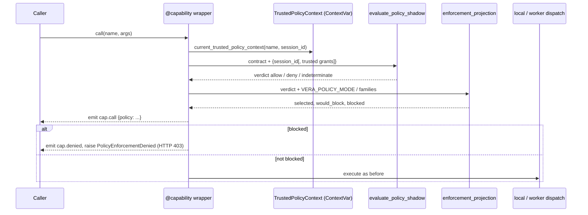

# Capability policy boundary

Vera's central capability wrapper is policy-aware. On every non-silent call it
evaluates a **shadow policy verdict** from the capability's
[Capability Contract v2](43-capability-contracts.md) declaration plus a small set
of scoped facts (which effects are granted, whether a session or tenant identity
is present, whether a trusted approval exists). The verdict is attached to the
`cap.call` event. For one narrow, explicitly selected capability family the
verdict can also be **enforced**, blocking the call before dispatch.

The evaluator is pure, bounded, and content-free: it never reads prompts,
arguments, results, credentials, or secret values. It lives in
[`vera/capability_policy_core.py`](../vera/capability_policy_core.py). Selective
enforcement and its kill switch are in
[`vera/capability_enforcement.py`](../vera/capability_enforcement.py); trusted,
scope-bound approval receipts are in
[`vera/approval_receipts.py`](../vera/approval_receipts.py); the wiring into the
`@capability` wrapper is in
[`vera/capability_orchestration.py`](../vera/capability_orchestration.py).

**Status:** shadow evaluation is on for every non-silent capability. Enforcement
is off by default and, when enabled, applies only to the four `run.shadow.*`
inspection capabilities. This is not global authorization: most capabilities are
still contractless and therefore report `indeterminate`.

## Contents

- [How a call is evaluated](#how-a-call-is-evaluated)
- [Source map](#source-map)
- [Verdicts and reason codes](#verdicts-and-reason-codes)
  - [Contract fields the evaluator reads](#contract-fields-the-evaluator-reads)
  - [Default scope inside the wrapper](#default-scope-inside-the-wrapper)
  - [Verdict output shape](#verdict-output-shape)
- [Capability reference](#capability-reference)
- [Events](#events)
- [Selective enforcement](#selective-enforcement)
  - [Configuration](#configuration)
  - [What happens when a call is blocked](#what-happens-when-a-call-is-blocked)
  - [Rollback](#rollback)
- [Approval receipts](#approval-receipts)
  - [Receipt format](#receipt-format)
  - [Verification and replay protection](#verification-and-replay-protection)
  - [Trusted policy context](#trusted-policy-context)
- [Frozen adversarial gate](#frozen-adversarial-gate)
- [Relationship to other boundaries](#relationship-to-other-boundaries)
- [Worked examples](#worked-examples)
- [Failure modes and troubleshooting](#failure-modes-and-troubleshooting)
- [Promotion criteria for more families](#promotion-criteria-for-more-families)
- [Related pages](#related-pages)

## How a call is evaluated



Silent capabilities (`silent=True`, used for high-frequency polling and
inspection) skip this block entirely: they emit no `cap.call` event and are never
evaluated or enforced.

## Source map

| File | Responsibility |
|---|---|
| [`vera/capability_policy_core.py`](../vera/capability_policy_core.py) | `evaluate_policy_shadow(name, contract, context)` — the pure verdict. Schema `vera.capability-policy-shadow/v1`. |
| [`vera/capability_enforcement.py`](../vera/capability_enforcement.py) | `SUPPORTED_FAMILIES`, `enforcement_projection`, `enforcement_status`, `PolicyEnforcementDenied`. Schema `vera.capability-enforcement/v1`. |
| [`vera/approval_receipts.py`](../vera/approval_receipts.py) | HMAC-SHA256 receipts, nonce ledgers (in-process and Redis), `TrustedPolicyContext`, context propagation helpers. |
| [`vera/capability_policy_eval_core.py`](../vera/capability_policy_eval_core.py) | The frozen adversarial evaluator behind `eval.policy.boundary`. |
| [`vera/capability_orchestration.py`](../vera/capability_orchestration.py) | Wrapper integration, `cap.policy.shadow`, `cap.policy.enforcement.status`, HTTP 403 mapping. |
| `tests/test_capability_policy.py`, `tests/test_approval_receipts.py`, `tests/test_capability_policy_eval.py` | Deterministic regression tests. |

## Verdicts and reason codes

| Verdict | Meaning |
|---|---|
| `allow` | Declarations and granted facts are sufficient. |
| `deny` | A required effect grant, approval, scope, or opaque-secret condition is missing. |
| `indeterminate` | Required contract posture is not declared yet (and nothing forces a deny). |

`deny` wins over `indeterminate`. All verdicts report `authorized: false` and
`executed: false`: a verdict is a prediction, not a grant.

| Reason code | Produces | Trigger |
|---|---|---|
| `contract_unknown` | indeterminate | The capability has no contract. |
| `effects_unknown` | indeterminate | `effects` missing or empty. |
| `effect_grant_missing` | deny | A declared effect is not in the allowed set (lists the missing effects). |
| `approval_missing` | deny | Contract requires approval and none is present. |
| `approval_posture_unknown` | indeterminate | Approval undeclared on a capability with sensitive effects. |
| `session_scope_missing` | deny | Tenant status is `session_scoped`/`session_required` and no session ID. |
| `tenant_scope_missing` | deny | Tenant status is `tenant_scoped`/`tenant_required` and no tenant ID. |
| `tenant_posture_unknown` | indeterminate | Tenant posture undeclared on a capability with sensitive effects. |
| `opaque_secret_contract_required` | deny | Declares the `secrets` effect without an opaque-reference secrets status. |
| `opaque_secret_refs_unconfirmed` | deny | Opaque secrets declared, but the caller has not confirmed opaque references. |

### Contract fields the evaluator reads

| Contract field | Values with meaning |
|---|---|
| `effects` | Baseline (always granted by default): `none`, `read`. Sensitive: `write`, `delete`, `execute`, `network`, `filesystem`, `secrets`, `approval`, `model`, `accelerator`, `external_side_effect`. |
| `approval.status` | Approval required: `required`, `human_required`, `user_required`, `per_call`. |
| `tenant.status` | Needs session: `session_scoped`, `session_required`. Needs tenant: `tenant_scoped`, `tenant_required`. |
| `secrets.status` | Opaque: `opaque_reference`, `opaque_references`, `secret_ref`, `secret_refs_only`. |

Any other status string is accepted as declared but carries no special meaning to
the evaluator.

### Default scope inside the wrapper

When the wrapper evaluates a call, the scope contains only the resolved
`session_id` (from the call's `session_id` argument, the trigger chain, or the
current session). The allowed effects therefore default to `none` and `read`, so
sensitive calls expose the authority they currently lack while legacy
contractless capabilities remain visibly `indeterminate`.

If, and only if, a [trusted policy context](#trusted-policy-context) exactly
matches the capability name and session and has not expired, the wrapper adds
its effects as `allowed_effects`, sets `approval_present`, and supplies its
`tenant_id`.

### Verdict output shape

```json
{
  "schema": "vera.capability-policy-shadow/v1",
  "mode": "shadow",
  "name": "llm.generate",
  "verdict": "deny",
  "authorized": false,
  "executed": false,
  "declared_effects": ["filesystem", "model"],
  "allowed_effects": ["none", "read"],
  "missing_effect_grants": ["filesystem", "model"],
  "approval": {"status": "not_required", "required": false, "present": false},
  "scope": {"tenant": "session_scoped", "session_present": true, "tenant_present": false},
  "secrets": {"status": "not_required", "opaque_refs_confirmed": false},
  "reasons": [{"code": "effect_grant_missing", "effects": ["filesystem", "model"]}]
}
```

On the `cap.call` event the wrapper also adds `trusted_context` (either
`{"present": false}` or the bounded projection of the trusted context) and
`enforcement` (the [enforcement projection](#selective-enforcement)).

## Capability reference

| Capability | HTTP | Purpose | Inputs |
|---|---|---|---|
| `cap.policy.shadow` | MCP / WebSocket only | Preview the verdict for one registered capability without invoking it. | `name` (required), `allowed_effects` (list), `session_id`, `tenant_id`, `approval_present`, `opaque_secret_refs` |
| `cap.policy.enforcement.status` | `GET /cap/policy/enforcement` | Inspect rollout mode, supported/configured/unsupported families, selected capabilities, and the rollback instruction. | none |
| `eval.policy.boundary` | `GET /eval/policy/boundary` | Run the [frozen adversarial gate](#frozen-adversarial-gate). | `detail`, `limit` |

`cap.policy.shadow`'s grants and approval flags are explicit **simulation
inputs**; they are never treated as trusted approval. Unknown capability names
fail closed with `{"error": "capability_unknown", "authorized": false,
"executed": false}`. If `allowed_effects` is omitted the baseline (`none`,
`read`) applies.

`cap.policy.enforcement.status` never returns raw environment values, receipts,
nonces, arguments, or secrets.

## Events

| Event | When | Policy payload |
|---|---|---|
| `cap.call` | Every non-silent call attempt, before dispatch | `policy`: the verdict plus `trusted_context` and `enforcement` |
| `cap.denied` | A selected call is blocked by enforcement | `name`, `trace_id`, `session_id`, `group`, `policy` |

Consumers of these events (the harness event stream, activity views) receive
only this bounded projection — verdict, reason codes, whether enforcement
selected the family, and whether the call would be or was blocked. They never
receive receipt material, raw nonces, signing keys, arguments, or result content.

## Selective enforcement

The only blocking boundary today covers exactly four inspection capabilities:

| Family | Capabilities |
|---|---|
| `run.shadow` | `run.shadow.list`, `run.shadow.graph`, `run.shadow.get`, `run.shadow.export` |

### Configuration

| Variable | Default | Meaning |
|---|---|---|
| `VERA_POLICY_MODE` | `shadow` | `shadow` observes only; `enforce` blocks selected calls whose verdict is not `allow`. Any other value is reported as invalid and treated as `shadow`. |
| `VERA_POLICY_ENFORCE_FAMILIES` | *(empty)* | Comma-separated families to enforce. Only `run.shadow` is supported; unknown families are reported as `unsupported_families` and never become eligible. |

Enforcement requires **both** `VERA_POLICY_MODE=enforce` **and**
`VERA_POLICY_ENFORCE_FAMILIES=run.shadow`. The values are read from the process
environment on each call, so they take effect for new calls without changing
code.

For every non-silent call the wrapper records an enforcement projection:

```json
{
  "schema": "vera.capability-enforcement/v1",
  "mode": "shadow",
  "config_valid": true,
  "selected": false,
  "supported_family": "",
  "configured_families": [],
  "unsupported_families": [],
  "policy_verdict": "indeterminate",
  "would_block": false,
  "blocked": false,
  "executed": false,
  "rollback": "set VERA_POLICY_MODE=shadow or clear VERA_POLICY_ENFORCE_FAMILIES"
}
```

`would_block` is true for a selected call whose verdict is not `allow`, even in
shadow mode — this is the parity signal to watch before switching to `enforce`.

> [!WARNING]
> The `run.shadow.*` contracts declare `effects: ["read", "filesystem"]`. With
> the default grants (`none`, `read`) their verdict is `deny`
> (`effect_grant_missing: filesystem`), so turning on enforcement for this
> family blocks those calls — including the `GET /run/shadow/graph` route used by
> UI overlays — unless a matching trusted policy context is present. Check
> `would_block` in shadow mode first.

### What happens when a call is blocked

1. A `cap.call` event is emitted with the full policy projection.
2. A `cap.denied` event is emitted.
3. `PolicyEnforcementDenied` (a `PermissionError`) is raised **before** local or
   distributed dispatch, streaming, caching, or result activity recording, and is
   not retried.
4. `/mcp/call` and the generated GET/POST routes map it to **HTTP 403** with the
   message `policy denied capability <name> (<verdict>)`.

### Rollback

Set `VERA_POLICY_MODE=shadow` or clear `VERA_POLICY_ENFORCE_FAMILIES`. Either is
a runtime kill switch: the next call is evaluated in shadow mode. The rollback
instruction is included in every enforcement projection and status response.

## Approval receipts

`vera.approval_receipts` provides the trusted receipt primitive an enforcement
boundary needs.

### Receipt format

```json
{
  "payload": {
    "schema": "vera.approval-receipt/v1",
    "capability": "records.write",
    "effects": ["write"],
    "session_id": "session-a",
    "tenant_id": "tenant-a",
    "issued_at": 1000,
    "expires_at": 1060,
    "nonce": "…"
  },
  "signature": "<64 hex chars, HMAC-SHA256 over canonical JSON of payload>"
}
```

- Signing keys must be at least 32 bytes; they never enter receipt bodies or
  telemetry.
- TTL is 1–3600 seconds (default 300).
- Effects are sorted and de-duplicated (1–32 entries); text fields are bounded to
  256 characters.

Issuance (`issue_approval_receipt`) is deliberately a Python core operation, not
a public capability: models and MCP callers cannot ask Vera to mint their own
authority. No HTTP or MCP endpoint currently issues or accepts receipts.

### Verification and replay protection

`verify_approval_receipt` checks the exact scope without consuming the receipt.
Any of these reasons make it invalid:

| Reason | Cause |
|---|---|
| `malformed` | Not a `{payload, signature}` object, unexpected or missing payload fields, or bad signature length |
| `verification_context_invalid` | The verifier's own expected scope is invalid |
| `signature_invalid` | HMAC mismatch (tampering) |
| `schema_mismatch` | Wrong receipt schema |
| `capability_mismatch` | Receipt for a different capability (alias substitution) |
| `effects_mismatch` | Expanded or changed effects |
| `session_mismatch` / `tenant_mismatch` | Different scope |
| `time_invalid` / `not_yet_valid` / `expired` | Bad timestamps, issued in the future, or past expiry |
| `nonce_invalid` / `replayed` | Bad nonce, or already consumed |

Consumption makes a receipt single-use:

| Function | Ledger | Behaviour |
|---|---|---|
| `consume_approval_receipt` | `NonceReplayLedger` | Thread-safe in-process set; single-use within one runtime. |
| `consume_approval_receipt_durable` | `RedisNonceReplayLedger` | One atomic `SET NX EX` per nonce across workers. Keys are `vera:approval:nonce:<sha256(nonce)>` and expire with the receipt. A Redis error fails closed with `replay_store_unavailable`. On success returns a sealed `TrustedPolicyContext`. |

### Trusted policy context

`TrustedPolicyContext` is a frozen, sealed dataclass (capability, effects,
session ID, tenant ID, nonce hash, expiry). It cannot be constructed outside the
receipts module, and it is propagated through a `ContextVar` by trusted
dispatcher code using `activate_trusted_policy_context(...)`, never through
capability arguments. Lookalike MCP arguments therefore cannot forge it.

The wrapper calls `current_trusted_policy_context(name, session_id)` and uses the
context only when the capability and session match exactly and it has not
expired. Its `projection()` exposes the nonce *hash* and expiry, never the nonce
or signature.

## Frozen adversarial gate

`eval.policy.boundary` runs
[`evaluations/policy-boundary-v1.json`](../evaluations/policy-boundary-v1.json)
as one deterministic report. Its six cases cover prompt injection, alias bypass,
callback injection, replayed approval, secret leakage, and confused deputy.
Invalid or incomplete corpora fail closed before any case is evaluated. The
evaluator uses only synthetic receipts, invokes no capability, performs no
network access, and returns reason codes rather than fixture values. Case-level
detail is in [Evaluation corpus](44-evaluation-corpus.md#policy-boundary-lane).

## Relationship to other boundaries

- **Resolver vs policy.** Resolver preference is separate from authorization: a
  top-ranked candidate from `cap.resolve.shadow` can still be denied, and a valid
  receipt cannot make an incompatible candidate eligible. See
  [Capability contracts](43-capability-contracts.md#resolver-shadow-mode).
- **Integration API effects.** `integration.api.call` has its own
  external-effect shadow/enforcement path with an operator decision ledger,
  revision-guarded activation (`integration.effect.enforcement.activation` /
  `.activate`), and the `VERA_INTEGRATION_API_EFFECT_ENFORCEMENT` runtime gate.
  It is independent of `VERA_POLICY_MODE`; see [Integrations](23-integrations.md).
- **Subsystem guards.** Operator's allowlist and confirmation rules, sandbox
  estate guards, and other subsystem-specific checks remain authoritative and run
  regardless of the shadow verdict.

## Worked examples

Preview a verdict with the default grants:

```bash
curl -s http://localhost:8999/mcp/call -H 'content-type: application/json' \
  -d '{"name":"cap.policy.shadow","arguments":{"name":"llm.generate","session_id":"s1"}}'
```

Result: `verdict: "deny"` with `effect_grant_missing: ["filesystem","model"]`.

Simulate the grants a trusted approval would add:

```bash
curl -s http://localhost:8999/mcp/call -H 'content-type: application/json' \
  -d '{"name":"cap.policy.shadow","arguments":{"name":"llm.generate","session_id":"s1",
       "allowed_effects":["read","model","filesystem"]}}'
```

Result: `verdict: "allow"`. A contractless capability such as `echo` stays
`indeterminate` with `contract_unknown` and `effects_unknown`.

Inspect enforcement state:

```bash
curl -s http://localhost:8999/cap/policy/enforcement
```

```json
{"schema": "vera.capability-enforcement/v1", "mode": "shadow", "enabled": false,
 "config_valid": true, "supported_families": ["run.shadow"],
 "configured_families": [], "unsupported_families": [], "selected_capabilities": [],
 "rollback": "set VERA_POLICY_MODE=shadow or clear VERA_POLICY_ENFORCE_FAMILIES"}
```

Enable enforcement for the supported family by setting both variables in the
orchestrator's environment:

```bash
VERA_POLICY_MODE=enforce
VERA_POLICY_ENFORCE_FAMILIES=run.shadow
```

> [!NOTE]
> A native run (`make run`) also reads these from the repository-root `.env`.
> The Docker stack only passes variables that are listed in the `vera` service's
> `environment:` block of `docker-compose.yml` (and `.env` is excluded from the
> image), so for Docker add both variables there before `make up`.

Issue and consume a receipt in trusted Python code:

```python
from Vera.vera.approval_receipts import (
    NonceReplayLedger, issue_approval_receipt, consume_approval_receipt,
)

key = b"\x00" * 32            # use a real secret of at least 32 bytes
receipt = issue_approval_receipt(signing_key=key, capability="records.write",
                                 effects=["write"], session_id="s1", ttl_seconds=60)
ledger = NonceReplayLedger()
first = consume_approval_receipt(receipt, signing_key=key, capability="records.write",
                                 effects=["write"], session_id="s1", replay_ledger=ledger)
second = consume_approval_receipt(receipt, signing_key=key, capability="records.write",
                                  effects=["write"], session_id="s1", replay_ledger=ledger)
assert first["valid"] and second["reasons"] == ["replayed"]
```

## Failure modes and troubleshooting

| Symptom | Cause | What to do |
|---|---|---|
| Almost every `cap.call` shows `indeterminate` | Most capabilities have no contract yet | Expected; see `cap.contract.coverage` |
| A declared capability shows `deny` in shadow mode | Sensitive effects are not in the default grants | Expected in shadow mode; only selected families can be blocked |
| `config_valid: false` in status | `VERA_POLICY_MODE` is not `shadow`/`enforce`, or an unsupported family is configured | Fix the variable; invalid modes are treated as `shadow` |
| HTTP 403 `policy denied capability run.shadow.…` | Enforcement is on for `run.shadow` and no trusted context matched | Roll back, or supply a trusted context through dispatcher code |
| `replay_store_unavailable` | Redis unreachable during durable consumption | Fails closed by design; restore Redis |
| No policy field on events for a capability | It is registered `silent=True` | Silent capabilities are not evaluated |

## Promotion criteria for more families

This is a narrow rollout, not global authorization. Promoting another family to
enforcement requires:

- complete gated contracts for every capability in the family
  (`cap.contract.gate`);
- frozen bypass fixtures in the policy corpus;
- observed shadow parity (no unexpected `would_block`);
- an explicit rollback plan, and a trusted path that can supply the effects the
  family needs.

## Related pages

- [Capability contracts](43-capability-contracts.md) — the declarations the evaluator reads.
- [Evaluation corpus](44-evaluation-corpus.md) — the frozen policy-boundary lane.
- [Capability framework](01-capability-framework.md) — the wrapper, `silent`, events.
- [Security](29-security.md) — wider security model, secrets, and the master key.
- [Integrations](23-integrations.md) — the separate Integration API external-effect boundary.
- [Interoperability foundations](46-interoperability-foundations.md) — contracts, resolution, and policy in the wider architecture.
