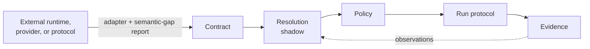

# 46 · Interoperability Foundations

Vera exposes a very broad surface — thousands of capabilities, several agent
loops, a DAG engine, model providers, external MCP servers, and containerised
third-party agent frameworks. The interoperability foundations turn that surface
into layers that can cooperate **without becoming one another**: each external
runtime, protocol, or provider meets Vera at a small number of explicit
boundaries instead of bringing its own planner, executor, event stack, and
authority model.

This guide describes shipped architecture. Most foundations are offline,
deterministic contracts: they describe, validate, and plan, and report
explicitly when live execution is still queued. Nothing here claims that a queued
live integration is production-ready. The relevant code is spread across
[`vera/capability_contract_core.py`](../vera/capability_contract_core.py),
[`vera/capability_resolver_core.py`](../vera/capability_resolver_core.py),
[`vera/capability_policy_core.py`](../vera/capability_policy_core.py),
[`vera/execution/`](../vera/execution/) (Run protocol, Workflow IR, durability,
A2A, telemetry), [`vera/providers/`](../vera/providers/) (structured generation,
document parsing), [`vera/models/`](../vera/models/) (ModelPackage), and
[`vera/agentbridges/`](../vera/agentbridges/) (container bridges, runtime
adapter, runtime matrix, and the Agent Bridges panel).

## Contents

- [The common control path](#the-common-control-path)
- [Source map](#source-map)
- [Capability selection and policy](#capability-selection-and-policy)
- [Context compatibility contracts](#context-compatibility-contracts)
- [Workflows and durable execution](#workflows-and-durable-execution)
- [Agent runtimes and the runtime matrix](#agent-runtimes-and-the-runtime-matrix)
  - [Shipped container bridges](#shipped-container-bridges)
  - [RuntimeAdapter](#runtimeadapter)
  - [Runtime matrix](#runtime-matrix)
  - [Live runtime evidence](#live-runtime-evidence)
- [Models, ONNX, and Worldview](#models-onnx-and-worldview)
- [Remote agents and A2A](#remote-agents-and-a2a)
- [Structured generation and document parsing](#structured-generation-and-document-parsing)
- [Activity, UI, and the Agent Bridges panel](#activity-ui-and-the-agent-bridges-panel)
- [Capability reference](#capability-reference)
- [Worked examples](#worked-examples)
- [Boundaries that remain deliberate](#boundaries-that-remain-deliberate)
- [Troubleshooting](#troubleshooting)
- [Related guides](#related-guides)

## The common control path

Every integration should cross the same five boundaries:

| Boundary | What it fixes | Where it lives |
|---|---|---|
| **Contract** | Canonical task, schemas, effects, lifecycle, resources, provider identity | [Capability contracts](43-capability-contracts.md) |
| **Resolution** | Deterministic eligibility and ranking, observable in shadow mode and never equivalent to authorization | `cap.resolve.shadow` |
| **Policy** | Local authority for effects, approvals, secrets, filesystem, network, tenancy, budgets | [Capability policy](45-capability-policy.md) |
| **Run protocol** | Runtime-neutral identity, events, cancellation, retries, artifacts, deadlines, teardown — while the native runtime keeps its own task | [Execution](12-execution.md), `run.shadow.*` |
| **Evidence** | Bounded activity, traces, timings, evaluation receipts, provenance, artifacts — inspectable without leaking payloads | [Evaluation corpus](44-evaluation-corpus.md), portable telemetry |



This decomposition addresses capability and loop sprawl. A model provider,
workflow engine, or agent protocol normally supplies an adapter and an explicit
semantic-gap report; it should not introduce another incompatible
planner/executor/event stack.

## Source map

| Area | Key files |
|---|---|
| Contracts, resolver, policy | `vera/capability_contract_core.py`, `vera/capability_resolver_core.py`, `vera/capability_policy_core.py`, `vera/capability_enforcement.py`, `vera/approval_receipts.py` |
| Run protocol and telemetry | `vera/execution/run_protocol.py`, `run_projection.py`, `run_journal.py`, `run_shadow.py`, `portable_telemetry.py`, `telemetry_eval_core.py` |
| Workflow IR and durability | `vera/execution/workflow_ir.py`, `workflow_runtime_plan.py`, `durability_fixture.py`, `dbos_mapping.py`, `temporal_mapping.py`, `temporal_workflow_adapter.py`, `langgraph_workflow_adapter.py` |
| A2A | `vera/execution/a2a_mapping.py` (protocol mapping), `vera/execution/a2a_adapter.py` (client/server plan contracts) |
| Providers | `vera/providers/structured_generation.py`, `vera/providers/document_parser.py`, `vera/providers/providers_capabilities.py` |
| Models | `vera/models/model_package.py`, `onnx_import.py`, `admission.py`, `legacy_binding.py`, `inference_*.py` |
| Agent bridges | `vera/agentbridges/agentbridge_registry.py` (bridge catalogue), `agentbridge_runtime.py` (shared container runner), `runtime_adapter.py`, `runtime_registry.py`, `runtime_matrix.py`, `live_runtime_validation.py`, `agentbridge_capabilities.py`, `agentbridge_catalog_panel.html` |
| Source intake | `vera/integrations/source_intake.py`, `vera/integrations/source_build_plan.py` |

## Capability selection and policy

Capability Contract v2 projects migrated and legacy registry entries into one
manifest. Missing declarations stay `unknown`. Coverage and lint make migration
measurable, while the strict gate applies only to explicitly selected families.
Resolver shadow mode compares candidates without invoking them. Policy observes
every non-silent call and selectively enforces declared effects independently of
resolver rank, so better health or latency never grants more authority.

The [frozen evaluation corpus](44-evaluation-corpus.md) makes these decisions
reproducible. Provider-neutral training/evaluation contracts and deterministic
providers produce portable evidence without importing or invoking optional
external libraries during the offline lane.

## Context compatibility contracts

Context assembly ([`vera/fabric/context.py`](../vera/fabric/context.py))
currently discovers several optional collaborators through direct
capability-registry names: skills rendering, related-QA recall, Data Fabric
retrieval, and JEPA Worldview neighbour/rollout augmentation. The related-QA
pair has ordered compatibility semantics: `context.related_qa_block` is preferred
and `memory.recall_2nd_order` is its fallback. Missing optional collaborators
currently yield an empty contribution rather than failing prompt assembly. Those
names, arguments, result projections, fallback order, and absence behaviour are
compatibility contracts.

A future typed Context dependency manifest can name semantic roles and ordered
compatibility identities without giving a resolver permission to execute them or
bypass policy. It must remain distinct from the loop's static discovery and
essential-tool lists, which are bootstrap policy rather than dependency
resolution. The `worldview.query` and `worldview.rollout` probes specifically
target JEPA Worldview. They are not aliases for the non-JEPA Worldview or
Godseye lineages; those datasets can interoperate with JEPA only through the
separate snapshot and evidence boundary.

## Workflows and durable execution

Workflow IR provides typed, bounded control flow and loss-aware adapter analysis
(`workflow.ir.*`). Runtime durability semantics describe leases, heartbeats,
retries, idempotency, recovery, cancellation, versioning, and artifacts before a
third-party engine is selected:

- `workflow.durability.fixture` returns a vendor-neutral crash/recovery fixture
  (clean, retry, cancel, timeout, compatible-version resume,
  incompatible-version refusal, and crash before/after every step).
- `workflow.durability.gaps` statically compares that fixture with a Workflow IR
  adapter profile and fails closed on unsupported guarantees.
- `workflow.durability.dbos_mapping` and `workflow.durability.temporal_paper`
  are static decision manifests (pinned to `dbos==2.30.0` and
  `temporalio==1.32.0`) recording what maps cleanly, what is lossy, and which
  live failure drills are still required. Neither imports its optional runtime or
  claims production readiness.

This lets Vera compare native DAG execution with libraries such as LangGraph,
DBOS, or Temporal around one Run protocol instead of wrapping each library in a
new agent loop. See [DAG engine](03-dag-engine.md) and [Execution](12-execution.md).

## Agent runtimes and the runtime matrix

### Shipped container bridges

Three external agent frameworks run in throwaway Docker containers through one
shared runner (`agentbridge_runtime.stream_bridge_container`). Each bridge's
entrypoint prints `BRIDGE_STEP:<json>` lines as it works and exactly one final
`BRIDGE_RESULT:<json>` line; the runner turns these into events, drains stderr,
detects stalls by genuine progress, and kills on hard timeout.

| Bridge | Paradigm | Pinned packages | Opt-in variable | Run capability |
|---|---|---|---|---|
| smolagents | Code-as-action (writes and runs Python) | `smolagents==1.26.0` | `SMOLAGENTS_ENABLED=1` | `smolagents.run` |
| LangGraph | Explicit node/edge graph with JSON tool calls | `langgraph==1.2.11`, `langgraph-prebuilt==1.1.0`, `langchain-openai==1.5.1`, `langchain-core==1.5.5` | `LANGGRAPH_ENABLED=1` | `langgraph.run` |
| PydanticAI | Typed, schema-first output | `pydantic-ai-slim==2.31.0` | `PYDANTICAI_ENABLED=1` | `pydanticai.run` |

Pins live in `agentbridge_registry.py`. `agentbridge.check_updates` reports drift
against PyPI but never edits a pin or rebuilds an image: a version bump is a
reviewed, tested code change. See
[Agent runtimes and providers](36-agent-runtimes-providers.md) for bridge usage.

### RuntimeAdapter

`vera.runtime-adapter/v1` (`runtime_adapter.py`) is a runtime-neutral lifecycle
contract over the container bridges. It declares support (`supported`,
`partial`, `unsupported`) for acquisition, health, dependency isolation, run,
stream, events, cancellation, resource gates, teardown, and version reporting —
without importing the runtime or starting a container. Execution stays delegated
to the established bridge runner. Today `runtime_registry.RUNTIME_ADAPTERS`
contains one adapter, `langgraph` (image from `LANGGRAPH_IMAGE`, default
`vera-langgraph:latest`), which backs:

- `agentbridge.run.cancel` — cancels one active run by `runtime_id` and `run_id`,
  targeting only the exact process handle that run owns (never a guessed
  container name);
- `agentbridge.runtime.version` — compares the image's self-declared identity
  and package set from read-only OCI labels (`io.vera.runtime.id`,
  `io.vera.runtime.packages`) without starting it, reporting verified, mismatch,
  unattested, unavailable, or unknown-adapter.

### Runtime matrix

`agentbridge.runtime_matrix` (`vera.agent-runtime-matrix/v1`) keeps
upstream-documented features separate from Vera-verified bridge behaviour across
ten candidates and fifteen dimensions (tools, providers, handoffs, structured
output, policy, sessions, recovery, traces, resources, teardown, streaming,
cancellation, artifacts, sandbox, MCP).

| Candidate | Integration state |
|---|---|
| Vera native loops and DAGs | `native` |
| LangGraph, PydanticAI, smolagents | `shipped_bridge` |
| OpenClaw, Google ADK, OpenAI Agents SDK, Strands Agents, Agno / AgentOS | `prospective` |
| Hermes-compatible path | `compatibility_path` |

Where a shipped RuntimeAdapter exists, only its direct lifecycle equivalents
(streaming, cancellation, resources, teardown, sandbox) are projected into the
matrix; semantic dimensions are assessed independently so an execution adapter
cannot inflate them. The matrix always reports `execution_lane: queued_live`,
`ready_for_selection: false`, and `universal_winner: null`: static declarations
can identify gaps and required tests but cannot select a winner.

### Live runtime evidence

Ten live cases are declared for every candidate: `runtime.timeout`,
`runtime.crash`, `runtime.cancel`, `runtime.cleanup`, `runtime.resource_release`,
`runtime.malicious_output`, `runtime.missing_dependency`,
`runtime.version_report`, `runtime.session_resume`, `runtime.trace_redaction`.

`agentbridge.runtime_matrix.evaluate` validates payload-free observations
(`runtime_id`, `case`, `state` of `passed`/`failed`/`unavailable`, a reason code,
and bounded lifecycle facts) for up to 32 selected runtimes and 1,024
observations. A cleanup pass requires verified container absence; a
resource-release pass requires verified capacity. It summarises completeness and
conformance per runtime, never retains prompts or output, and never chooses a
winner.

`vera/agentbridges/live_runtime_validation.py` is an opt-in operator script (not
a capability, never run by the normal test suite) that exercises the container
adapter on a Docker host using short-lived, network-isolated, read-only,
resource-capped containers and reports only bounded lifecycle facts:

```bash
cd /path/to/parent-of-Vera
python -m Vera.vera.agentbridges.live_runtime_validation --image python:3.11-slim
```

## Models, ONNX, and Worldview

`ModelPackage` is the portable boundary between training, evaluation, import,
activation, and serving. Packages carry immutable identity and provenance; safe
ONNX import verifies content before admission; activation emits receipts; and
legacy model capabilities can bind to packages without silently changing their
public names. Admission and evaluation stay separate from hardware execution. See
[Machine learning](16-machine-learning.md) and [ONNX](30-onnx.md).

Worldview follows the same migration pattern. Frozen graph/vector projection
manifests, legacy snapshots, parity reports, and bounded evidence windows expose
revision drift and missing provenance without copying source content or changing
the current JEPA trainer. The projection is evidence — not authority — until live
shadow parity and migration gates are deliberately completed. See
[Worldview](11-worldview.md).

## Remote agents and A2A

The offline A2A foundation (`vera.a2a-protocol-mapping/v1`, targeting A2A
protocol `1.0` and `a2a-sdk==1.1.2`) maps Agent Cards, skills, task states,
messages, parts, artifacts, and protocol operations onto Vera's contracts and Run
model:

- Agent Cards and skills become *unauthorised* Capability v2 candidates. Cards
  are bounded, credential-free HTTPS discovery documents, not registration or
  authorization grants.
- Remote task and context identifiers stay opaque and server-owned; they are
  never replaced by local session IDs.
- Every task state maps to a Run state or an explicit semantic gap.
- Parts and artifacts must be verified before becoming an `ArtifactRef`.
- Plaintext credentials, unsafe endpoints, duplicate skills, unsupported
  versions/bindings, and required extensions Vera does not understand fail
  closed.

The adapter-plan contracts (`a2a_adapter.py`) go one step further without doing
I/O: a client plan for exactly one reviewed `effects=["none"]` task with stable
local Run/message correlation, an out-of-band credential *reference*, and an
`allow_non_mutating` policy decision; and an authenticated server exposure plan.
Both report `queued_live` — no credential is resolved, no SDK imported, no
listener started, no request sent, no capability registered.

`interop.a2a.conformance` exposes the static mapping and its lanes (6
deterministic, 6 queued live). Sending, streaming, authentication, cancellation
acknowledgement, artifact fetching, webhook security, recovery, and teardown
require separately authorised live evidence.

## Structured generation and document parsing

| Contract | Implemented | Still queued |
|---|---|---|
| Structured generation (`providers.structured.*`) | Bounded portable schema subset, static provider-native / Instructor / Outlines profiles, one retry owner, validation of supplied JSON without returning it, bounded correction planning | Provider imports, model calls, constrained decoding, streaming, semantic validators, latency measurement |
| Document parsing (`providers.document.*`) | Portable parse plan/result around source `ArtifactRef`s, supported media types, deterministic element IDs and citations, OCR declarations, resource ceilings, frozen-corpus comparison of content-free hashes, non-destructive teardown plans; Docling profile reported as `not_imported` | Installing and isolating Docling, conversion, OCR, fidelity measurement, persistence, teardown execution |

Neither contract projects document or model content into inspection views. See
[Agent runtimes and providers](36-agent-runtimes-providers.md).

## Activity, UI, and the Agent Bridges panel

Runs and capability activity provide a shared evidence vocabulary for Harness,
chat/context graphs, memory views, activity timelines, and narrator consumers.
UI projections should link to underlying run/action metadata instead of
inventing a parallel state model. Explicit unknowns are preferable to a polished
timeline that guesses what occurred.

The **Agent Bridges** tab (panel id `agentbridge-catalog-panel`, served from
`GET /agentbridge/panel`) is the interoperability-specific projection. It shows:

- every registered bridge with its paradigm, pinned packages, image presence, and
  enabled flag (`agentbridge.catalog`), plus drift checks and image builds;
- the A2A foundation and its inert client/server plan status;
- runtime-matrix candidate/dimension coverage and queued live cases;
- registration state of the shared contracts (Capability v2, resolver and policy
  shadow, Run protocol, Workflow IR, portable telemetry, durability fixture,
  runtime matrix and evidence, runtime cancel/version, A2A, source intake and
  build plan, structured generation, document parsing, and `registry.interop`);
- the distinction between the implemented inert build-plan contract and queued
  build/activation execution;
- for structured generation and document parsing, the implemented portable
  contract versus queued provider, model, parser, and OCR execution.

Readiness labels come from the backing inspection capability
(`agentbridge.interoperability`); the panel does not infer readiness from package
presence or a successful page load, and it never displays document content. This
complements — rather than duplicates — Run evidence in Activity, the harness
overlay, Chat, and Memory Graph.

## Capability reference

| Capability | HTTP | Purpose |
|---|---|---|
| `agentbridge.catalog` | `GET /agentbridge/catalog` | List bridges with live status (enabled, image present, pins, run capability) |
| `agentbridge.check_updates` | `POST /agentbridge/check_updates` | Compare pins with PyPI; report drift only. Input: `bridge` (optional) |
| `agentbridge.image.ensure` | `POST /agentbridge/image/ensure` | Build one bridge image via its `<bridge>.image.ensure`. Inputs: `bridge`, `force` |
| `agentbridge.interoperability` | `GET /agentbridge/interoperability` | Inspection-only summary of A2A, runtime matrix, adapters, providers, and shared-contract registration |
| `agentbridge.runtime_matrix` | `GET /agentbridge/runtime_matrix` | The deterministic runtime comparison |
| `agentbridge.runtime_matrix.evaluate` | `POST /agentbridge/runtime-matrix/evaluate` | Validate payload-free live observations. Inputs: `observations`, `selected_runtime_ids` |
| `agentbridge.run.cancel` | `POST /agentbridge/run/cancel` | Cancel one active isolated run. Inputs: `runtime_id`, `run_id` |
| `agentbridge.runtime.version` | `GET /agentbridge/runtime/version` | Verify an image's declared identity from OCI labels. Input: `runtime_id` |
| `agentbridge.panel.html` | `GET /agentbridge/panel` | Serve the panel HTML |
| `interop.a2a.conformance` | MCP / WebSocket | Static A2A mapping and conformance lanes |
| `workflow.ir.*`, `workflow.durability.*` | MCP / WebSocket | Workflow IR import/export/validate/migrate/adapters/gaps; durability fixture, gaps, and static runtime mappings |
| `run.shadow.*`, `run.telemetry.*` | `run.shadow.graph` at `GET /run/shadow/graph`; others MCP | Run projection, portable telemetry preview/status/export |
| `registry.interop` | `GET /registry/interop` | Registry entries projected onto contract / resolution / policy / evidence boundaries |

The `agentbridge.interoperability`, `agentbridge.runtime_matrix`, and
`agentbridge.runtime_matrix.evaluate` responses always report
`imports_optional_runtimes`/`imports_runtimes: false` and `executes: false`.

## Worked examples

Summarise interoperability readiness:

```bash
curl -s http://localhost:8999/agentbridge/interoperability | python3 -c '
import json, sys
d = json.load(sys.stdin)
print("A2A:", d["a2a"]["foundation"], "/ client", d["a2a"]["client_transport"])
print("Matrix:", d["runtime_matrix"]["candidate_count"], "candidates,",
      d["runtime_matrix"]["dimension_count"], "dimensions")
print("Unregistered shared contracts:",
      [x["id"] for x in d["shared_contracts"] if not x["registered"]])'
```

Submit one payload-free live observation for validation:

```bash
curl -s -X POST http://localhost:8999/agentbridge/runtime-matrix/evaluate \
  -H 'content-type: application/json' \
  -d '{"selected_runtime_ids":["langgraph"],
       "observations":[{"runtime_id":"langgraph","case":"runtime.cancel",
                        "state":"passed","reason_code":"cancel_acknowledged",
                        "terminal_count":1}]}'
```

The response lists the nine still-missing cases and `evidence_complete: false`.

## Boundaries that remain deliberate

- Contracts describe; policy authorizes.
- Source inspection proposes; the build-plan contract specifies immutable
  provenance, evidence, least privilege, approval, rollback, export, upgrade,
  and teardown without performing them. Catalogs, builders, and activation
  remain separate reviewed state transitions.
- Resolver observations inform; they do not mutate declarations.
- Workflow adapters translate; native runtimes keep native authority.
- Model packages identify artifacts; activation remains reviewed.
- Structured schemas validate supplied values; provider decoding and semantic
  validators remain separately authorized runtime work.
- Document-parser plans validate supplied provenance, IDs, citations, hashes,
  bounds, and OCR declarations; Docling conversion and persistence remain
  separately authorized isolated runtime work. Render remains output policy.
- Worldview projections provide parity evidence; they do not feed training by
  default.
- A2A discovery projects candidates; it does not register or execute them.
- Live/model/external conformance tests stay queued until their environment and
  authority are explicitly provided.

## Troubleshooting

| Symptom | Likely cause |
|---|---|
| A `shared_contracts` row shows `registered: false` | The module that registers that capability failed to load; check the orchestrator log for `✗ <module> failed to load` |
| `agentbridge.run.cancel` / `runtime.version` returns `runtime_adapter_unknown` | Only `langgraph` has a RuntimeAdapter today |
| Bridge shows `enabled: false` | Its `*_ENABLED` variable is not `1` in the orchestrator environment |
| `image_present: false` | Build with `agentbridge.image.ensure` (requires Docker access from the orchestrator) |
| `check_updates` reports `latest: null` | PyPI unreachable; treated as unknown, not "no update" |
| `runtime_matrix.evaluate` returns `{ok: false, error: ...}` | Unknown runtime or case, duplicate observation, or a pass without the required verification flag |

## Related guides

- [Capability framework](01-capability-framework.md)
- [DAG engine](03-dag-engine.md)
- [Worldview](11-worldview.md)
- [Execution](12-execution.md)
- [Machine learning](16-machine-learning.md)
- [Integrations](23-integrations.md)
- [ONNX](30-onnx.md)
- [Loop Lab](33-evolve.md)
- [Agent runtimes and providers](36-agent-runtimes-providers.md)
- [Activity and boards](39-activity-boards.md)
- [AI ecosystem roadmap](40-ai-ecosystem-roadmap.md)
- [Capability contracts](43-capability-contracts.md)
- [Evaluation corpus](44-evaluation-corpus.md)
- [Capability policy](45-capability-policy.md)
