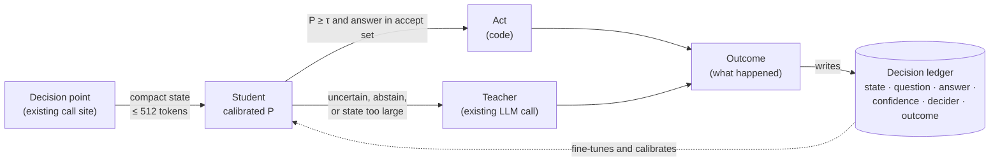
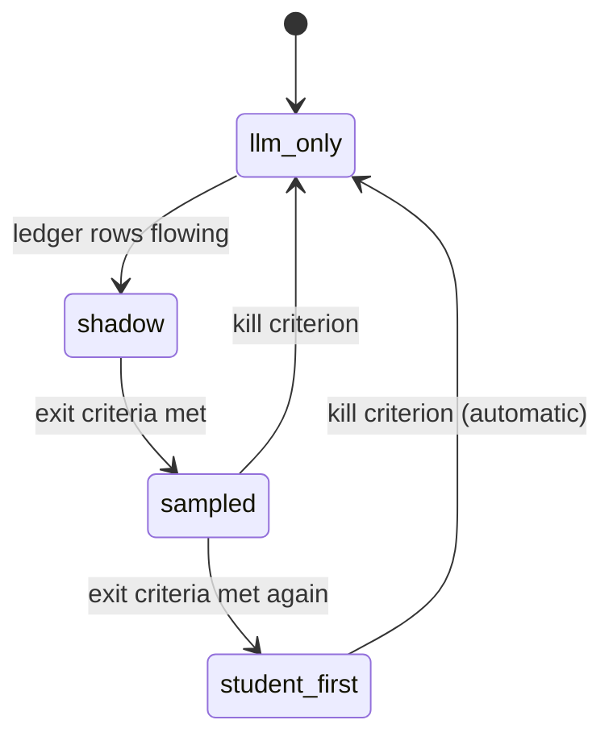

# 48 · System 1 decision models

> [!IMPORTANT]
> **🚧 Status: Not live — design and survey only.** There is no `decide.*`
> capability, no decision ledger and no trained decision model in Vera today.
> Everything tagged **🚧 Not live** on this page is a proposal. The only things
> on this page that run today are the existing non-LLM deciders listed in
> [§3](#3-what-already-runs-without-an-llm) and tagged **✅ Live**.

Vera currently makes judgements in one of two ways: **deterministic code** (a
regex, a threshold, a rule) or **an LLM call**. Almost everything that is not an
`if` statement is a prompt — including small, typed, recurring questions such as
"is this step done?", "should the controller just continue?", "which of four
intents is this goal?" or "has anything happened worth narrating?". Each of
those costs a full generation on a contended GPU, returns a confidence that was
never calibrated, and can answer differently on Tuesday than on Friday.

A **System 1 decision model** is the missing tier between those poles: a small
encoder with a decision head that reads a compact state and answers a typed
question — *choose one of N*, *yes/no*, *score*, *rank* — in a single forward
pass, with a **calibrated probability**. When it is confident, code acts on its
answer; when it is not, the question escalates to the LLM exactly as it does
today. The LLM becomes the **teacher**: every escalation is a labelled example,
and every recorded outcome is a calibration point.

This page documents the design, the infrastructure it would need, a verified
survey of **57 decision points** across the codebase where it could be used, and
the candidates that were considered and rejected. The survey was taken against
the source tree on 2026-10-01; `file:line` references point at that revision.

## Contents

- [1. The four tiers](#1-the-four-tiers)
- [2. How a System 1 decision works](#2-how-a-system-1-decision-works)
  - [2.1 The teacher loop](#21-the-teacher-loop)
  - [2.2 Design principles](#22-design-principles)
  - [2.3 What the model can and cannot do](#23-what-the-model-can-and-cannot-do)
- [3. What already runs without an LLM](#3-what-already-runs-without-an-llm)
- [4. Proposed infrastructure (not live)](#4-proposed-infrastructure-not-live)
  - [4.1 The `decide.*` capability family](#41-the-decide-capability-family)
  - [4.2 The decision ledger](#42-the-decision-ledger)
  - [4.3 Shadow mode and promotion](#43-shadow-mode-and-promotion)
  - [4.4 Calibration and asymmetric acceptance](#44-calibration-and-asymmetric-acceptance)
  - [4.5 Where `decide` plugs into the NLP node](#45-where-decide-plugs-into-the-nlp-node)
  - [4.6 Students available with no training](#46-students-available-with-no-training)
- [5. Survey of decision points (not live)](#5-survey-of-decision-points-not-live)
  - [5.1 How to read the entries](#51-how-to-read-the-entries)
  - [5.2 Agent loop and workshop](#52-agent-loop-and-workshop)
  - [5.3 Chat](#53-chat)
  - [5.4 Model and node routing](#54-model-and-node-routing)
  - [5.5 Dream, narrator and director](#55-dream-narrator-and-director)
  - [5.6 Memory, fabric, discovery and research](#56-memory-fabric-discovery-and-research)
  - [5.7 Operations, comms, markets, board and operator](#57-operations-comms-markets-board-and-operator)
  - [5.8 All candidates by priority](#58-all-candidates-by-priority)
- [6. Rejected candidates](#6-rejected-candidates)
- [7. Order of adoption and kill criteria](#7-order-of-adoption-and-kill-criteria)
- [8. Relationship to the worldview](#8-relationship-to-the-worldview)
- [9. Open questions and honest limits](#9-open-questions-and-honest-limits)
- [10. Related pages](#10-related-pages)

---

## 1. The four tiers

| Tier | What it is | Typical latency | Good at | Fails at | In Vera |
|---|---|---|---|---|---|
| **Code** | Capabilities, SQL, graph queries, regexes, thresholds | µs–ms | Exactness, enforcement, side effects | Anything it was not written for | ✅ Live |
| **System 1** | Small encoder + decision head; typed answers with calibrated probability; no tokens decoded | tens of ms (a ModernBERT-class model is quoted at 33–140 ms) | Judgement at volume: route, rank, triage, gate, score | Novelty, explanation, anything needing language out | 🚧 **Not live** |
| **World model** | The JEPA [worldview](11-worldview.md): learned state of this estate | ~10–100 ms | What normally follows what; anomaly; drift | Cold start; confidently wrong outside its data | ⚠️ Live, lightly used — see [49](49-worldview-integration.md) |
| **LLM** | Ollama / remote models | 1 s – unbounded | Language, novelty, code, open problems | Cost, latency, calibration, concurrency | ✅ Live |

The thesis: **the world model supplies state, System 1 supplies judgement, code
enforces, and the LLM is reached only where language or novelty is genuinely
required.** This is escalation, not replacement — the LLM keeps every job it is
uniquely good at, and is simply called less often for questions whose answer is
one word.

Why it matters in Vera specifically:

- **The GPU gate is a single slot.** `vera/ollama_gate.py:57` `capacity_for()`
  gives a GPU node one slot (`VERA_GPU_GATE_N`, default 1) and a CPU node two,
  and the gate fails open. Background generations — dream, narrator, director,
  syslog monitor, discovery tagging — compete with chat and the agent loop for
  that slot. Every generation a System 1 decision avoids frees it.
- **The agent loop makes many small decisions per step.** Controller, verifier,
  executor "done?", prestep gap check, finaliser — each is a generation today
  (see [§5.2](#52-agent-loop-and-workshop)).
- **Calibration is a property, not a style.** An LLM's "80% confident" comes from
  the same process as the rest of its sentence. A decision head trained under a
  proper scoring rule and temperature-scaled produces numbers you can put a
  threshold on.

---

## 2. How a System 1 decision works

### 2.1 The teacher loop



1. A decision point renders a **compact state** with a pure, per-question
   renderer and asks a **typed question** with a closed label set.
2. The student answers with a probability. If the answer is in that question's
   **accept set** and clears its threshold τ, code acts on it.
3. Otherwise — uncertain, abstained (`null`), or the state exceeded the token
   limit — the question goes to the **existing LLM call**, unchanged.
4. Either way, the decision and, later, its **outcome** are written to the
   ledger. The ledger is simultaneously the calibration ground truth and the
   fine-tuning corpus: the LLM's escalated answers are distillation labels, and
   the outcomes separate learning *the LLM's* decision from learning *the right*
   decision.

### 2.2 Design principles

| Principle | Why |
|---|---|
| **Ledger first, model second** | Without recorded (decision, confidence, outcome) rows there is no calibration, no training set, and no way to know whether anything worked. The ledger needs no new model and can be built before one exists. |
| **The contract is the interface; the model is an implementation** | `decide.ask` is first implemented by the LLM Vera already calls. Call sites change once; later the implementation is swapped per question. |
| **Shadow before authority** | A student answers in parallel and is authoritative for nothing until its agreement and calibration are measured on real traffic. |
| **Every promotion has an exit and a kill criterion** | Stated in advance, measured from the ledger. A shadow with no promotion date never exits. |
| **Asymmetric acceptance** | Only the cheap, safe or reversible answer may be taken from the student (e.g. controller `continue`, verifier `not met`, narrator `skip`). Costly answers always escalate. |
| **Security gates stay deterministic** | Shell allow-lists, risky-action checks and capability policy are never delegated to a learned model. A model may only *add* a deny or "suspicious" flag. |
| **Outcomes, not answers, filter training data** | Distillation inherits the teacher's mistakes unless training is filtered on outcomes. |
| **Name what each promotion retires** | A decision layer that only adds surface is a cost. Each candidate lists the code or calls it replaces. |

### 2.3 What the model can and cannot do

- **State budget ≈ 512 tokens.** Decisions whose state does not fit — a code
  diff, a stack trace, a full plan ledger, a DOM tree — are **out of scope** and
  must be identified up front. An oversized state is a `null` answer, escalated
  and logged as out of scope, never silently truncated.
- **Near-chance zero-shot.** Typed-decision encoders do poorly without domain
  data; the published zero-shot figure for one candidate model is 0.362 on its
  own benchmark. This is expected: the teacher loop exists to produce the domain
  data. `vera/evolve/delegate_trajectory_core.py` already says delegated-job
  trajectories should become training data for exactly this kind of model.
- **Over-confident out of the box.** Temperature scaling (or isotonic regression
  once there is enough data) per question is required before any threshold
  means anything.
- **No language out.** Anything needing an explanation, arguments, a plan or a
  summary stays with the LLM. System 1 can still *gate* those calls.

---

## 3. What already runs without an LLM

These deciders are **✅ Live** today. Some are the seams System 1 would reuse;
others are brittle floors a learned model could back up.

| Decider | Evidence | Status |
|---|---|---|
| **Zero-shot loop intent (shadow).** `nlp.zeroshot` (DeBERTa-v3 MNLI) scores `build` / `research` / `action`; `mixed` is read off as both build and research ≥ 0.5. The run records it beside the heuristic and LLM intents (`agrees_used`, `agrees_llm`, `margin`, `confidence`). Nothing reads it back. | `vera/dag/intent_zeroshot_core.py`; `_v6_zeroshot_intent` (`dag_workshop_capabilities.py:14181`), launched concurrently at `:23874`, measured by `_v6_intent_measure` (`:14200`) | ✅ Live, measure-only. **The template for every shadow System 1 decision.** It calls the raw capability so measurements do not write memories. |
| **Citation rerank.** The `nlp.rerank` ONNX cross-encoder reorders research citations; documents cut to 512 characters; original order kept on error. | `vera/research/researcher_api.py:3861` (`_rerank_citations`) | ✅ Live — a System 1 *ranking* decision already in production |
| **Explode relation, genre, sentiment, claims.** `nlp.zeroshot` relation and genre labels; `nlp.classify` sentiment; `nlp.qa` claims. | `vera/research/explode_capabilities.py:485, 730, 749, 814` | ✅ Live, opt-in layers |
| **Language ID scorer** | `vera/research/assess_capabilities.py:133-181` | ✅ Live, opt-in |
| **Fabric NER ladder.** node GLiNER → node OntoNotes NER → in-process GLiNER → spaCy → heuristic, controlled by `FABRIC_NER_BACKEND` (`auto`, `gliner`, `spacy`, `heuristic`, plus `node`, `node_gliner`). | `vera/fabric/fabric_web_acquisition.py:930, 944-956`; `vera/fabric/ner_node_core.py` | ✅ Live. Extraction, not decision — but proof that node-served ONNX works in the hot path. |
| **Goal entity coverage** — node NER on the goal checked against the final output | `vera/dag/entity_coverage_core.py` | ✅ Live, measure-only |
| **Capability relevance** for the planner catalogue (`CapabilityIndex.relevance_search`) | `vera/dag/cap_relevance_core.py` | ✅ Live; lexical in practice (a 2026-09-27 measurement found no capabilities embedded) |
| **Regex and keyword typed floors** — loop tier (`_v7_tier_heuristic`), loop intent (`_v7_intent_heuristic`), legacy triage override (`_heuristic_classify`, overrides the LLM at ≥ 0.8), chat triviality (`_isTrivialChat`), agent job type (`_agent_classify_job_type`), board plan section (`classify_plan_section`), log level and error signature (`evolve_logs_core.py`), source authority (`discovery.py` `_classify_source`) | as named | ✅ Live. The code tier: they stay as floors; System 1 sits above them. |
| **Deterministic step-enders** — `author_done_core`, `research_done_core`, `operator/browser_done_core`, `operator/completion`, `repeat_failure`, `fix_loop_core`, `gate_finish_core`, `follow_up_core` | `vera/dag/*`, `vera/operator/*` | ✅ Live. Each exists because the LLM wasted executor turns — they mark where a learned "done?" decision would pay. |
| **Similarity silencing** — `_too_similar(thought, prior, thresh=0.45)` stops the dream director repeating itself | `vera/dream/dream_capabilities.py:10784, 11397` | ✅ Live lexical gate |
| **Discovery: heuristic first, LLM only when borderline.** Relevance, novelty, quality and source-class heuristics score every page; an LLM `on_topic` call runs only for relevance 0.15–0.55. | `vera/fabric/discovery.py:2480-2530` (LLM at `:2508`) | ✅ Live. **The System 1 / System 2 escalation pattern, done by hand.** |

---

## 4. Proposed infrastructure (not live)

> [!IMPORTANT]
> **🚧 Not live — design only.** None of the capabilities, tables or endpoints in
> this section exist.

### 4.1 The `decide.*` capability family

| Capability | Purpose |
|---|---|
| `decide.ask` | Ask a typed question over a state; returns an answer, probability and the decider that produced it |
| `decide.policy` | Per-question mode (`llm_only` / `shadow` / `student_first`), threshold τ, and accept set |
| `decide.calibration` | Fit calibration per question and report reliability and drift against outcomes |
| `decide.ledger` | Query and export ledger rows (the training and evaluation corpus) |

**Request:**

```python
decide.ask(
    question_id="loop.controller_action",   # stable; the ledger key
    qtype="choice",                         # "choice" | "binary" | "score" | "ranking"
    state=render_controller_state(step),    # pure per-question renderer, ≤ 512 tokens
    labels=["continue", "replan", "insert", "stop"],
)
```

**Response:**

```json
{
  "answer": "continue", "p": 0.981, "margin": 0.94,
  "decider": "student", "escalated": false,
  "truncated": false, "state_tokens": 212,
  "model": "decide-v1", "node": "gpu-node", "ms": 41,
  "decision_id": "dec_…"
}
```

Rules for the implementation:

- **The first implementation is LLM-backed.** It wraps the existing stage call
  and writes the ledger row. Call sites keep their current paths and only gain a
  `decision_id`.
- **Register with `memory="off"`.** `nlp.zeroshot` is registered with
  `memory="on"` (`vera/research/nlp_capabilities.py:353`); the loop calls its
  raw function precisely so that measurements do not write memories.
- **State renderers are pure functions**, one per question, in the style of
  `vera/dag/*_core.py`, counting tokens with the student's tokenizer.
- **`null` is a first-class answer** and always escalates.

### 4.2 The decision ledger

Row schema:

| Field | Meaning |
|---|---|
| `decision_id`, `ts` | Identity and time |
| `question_id`, `qtype`, `labels_hash` | Which question, of what type, over which label set |
| `state_hash`, `state_ref` | SHA-256 of the rendered state; a pointer (session, step, stream, cycle) — never the payload |
| `answer`, `p`, `margin`, `decider` | What was decided, how confidently, by `code` / `student` / `llm` |
| `shadow` | In shadow mode, both the student's and the LLM's answers |
| `model`, `node`, `ms`, `request_stage`, `role` | Provenance; `request_stage` / `role` join to the Ollama request log |
| `outcome` | Filled later: `{label, source, ts}` |
| `policy_version`, `model_version` | Calibration must be refitted when either changes |

Join keys that already exist:

- The Ollama request log records `session_id`, `profile`, `role`,
  `request_stage`, `prompt_chars` and `est_seconds` for every loop LLM call
  (`vera/capability_orchestration.py:3820-3829`). It is an in-memory ring
  buffer of 2,000 entries (`_OLLAMA_REQUEST_LOG`, `:3167`), so the ledger itself
  must be durable (Redis or Postgres).
- `agent_loop.stage_context` events (`_emit_stage_context`,
  `dag_workshop_capabilities.py:14376`; `vera/dag/loop_stage_audit.py`) record
  the exact system and user prompt for each loop stage — replayable teacher
  input.
- `vera:loop:events:<sid>`, `loop_run_history.py` and `loop_record_core.py` give
  per-run records.
- `vera/evolve/delegate_trajectory_core.py` holds rated trajectories with
  `VERDICTS = ("useful", "partly", "wrong")` — run-level outcome labels.

**Outcome back-fill.** Most outcomes are known later in the same run: the
verifier's result, the controller's next action, the final gate's verdict,
whether argument recovery succeeded, a two-tier `NO-ADDITION`. A run-end hook
beside `_v6_intent_measure` writes them back.

### 4.3 Shadow mode and promotion

**Template.** Copy the existing intent shadow: start the student with
`asyncio.ensure_future(...)` beside the real call (`:23874`), never await it on
the critical path, bound it with a timeout, and compare at run end
(`_v6_intent_measure`, `intent_zeroshot_core.compare()`).

**Per-question modes:**



- **shadow** — the student answers in parallel; the LLM decides.
- **sampled** — `student_first` at one high τ, with an LLM co-sign on a sample
  (for example 10%).
- **student_first** — the student decides inside its accept set; everything
  else escalates.

**Exit criteria** (to move up one mode): at least *n* labelled rows (chosen per
question); precision at τ at or above that question's target (e.g. 97% for
controller `continue`, 99% for verifier `met`); expected calibration error
≤ 0.05; no regression in loop quality over two census runs.

**Kill criteria** (automatic revert to `llm_only`): rolling precision falls more
than 3 points below target; the escalation rate rises above 60% (it is saving
nothing); a quality drop attributable to the decision; input drift (state-hash
novelty, or the worldview's drift signal).

### 4.4 Calibration and asymmetric acceptance

- Fit per question with temperature scaling; switch to isotonic regression once
  there are enough rows. Choose τ per answer to hit the target precision.
- **Accept sets are asymmetric.** Only the cheap or safe answer may come from
  the student:

  | Question | Student may answer alone | Always escalates |
  |---|---|---|
  | `loop.controller_action` | `continue` (and only when the verifier said met) | `replan`, `insert`, `stop` |
  | `loop.step_verify` | `not met` (a cheap retry) | `met` — unless a deterministic evidence rule co-signs |
  | `narrator.wake_gate` | `skip` (a maximum gap still forces a run) | `wake` |
  | `syslog.monitor_wake` | `recurring / known` | `new` |
  | `loop.fast_path_cap` | `defer` | a capability pick (the LLM still writes arguments) |

- Recalibrate whenever `model_version` or `policy_version` changes.

### 4.5 Where `decide` plugs into the NLP node

The NLP tier already runs off-host as ONNX on the Ollama nodes (see
[30 · ONNX](30-onnx.md)). A decision task fits that substrate with registry
work rather than dependency work.

| Piece | File | What changes |
|---|---|---|
| Model store | `edge/nlp_server.py:106` — `MODEL_ROOT = VERA_NLP_MODEL_DIR` (default `/opt/nlp-models`) | Export the decision model into the shared read-only store with `edge/nlp_export_models.py` |
| Shared task registry | `vera/research/nlp_dispatch_core.py` — `DEFAULT_MODELS` (`:50`), `TASK_KIND` (`:99`) | Add a `decide` entry. `"rerank": "fastembed"` and `"gliner": "gliner"` are the precedent for a model kind the stock loader does not handle |
| Loader | `edge/nlp_server.py` `_load` (`:255`), `load_task` (`:324`) | Use `text-classification` if the model exports as a sequence classifier, otherwise a new `decision-head` branch |
| Endpoint | `edge/nlp_server.py` `build_app()` (`:539`); activity paths (`:547-549`) | Add `POST /decide` and list it for activity recording |
| Host capability | `vera/research/nlp_capabilities.py` — `_node_only` pattern (`:339-371`) | Add `decide.ask` with `memory="off"`; the LLM fallback lives here, not on the node |
| Placement | `vera/research/nlp_dispatch.py` — `discover` (`:160`), `placement` (`:208`), `remote_call` (`:232`) | Already handles node discovery and routing |

> [!WARNING]
> `run_classify` in `edge/nlp_server.py` (`:461`) truncates input to the first
> **512 characters**, not tokens. A `run_decide` must truncate by **tokens** and
> report the token count and whether truncation happened, so oversized states
> are logged as out of scope.

`vera/models/onnx_inference_adapter.py` and `vera/machine learning/ml_onnx.py`
are **not** the right home: the first is a small legacy adapter, the second
serves ML Workshop models.

### 4.6 Students available with no training

The ledger can start collecting shadow rows before any decision model exists,
using models already deployed on the NLP node:

- `nlp.zeroshot` with label **descriptions**, not bare category words — the
  lesson recorded in `intent_zeroshot_core.py:17-28` is that bare words score
  worse and a `mixed` catch-all label absorbs the others;
- `nlp.rerank` for ranking and relevance questions;
- `sentiment3` / `classify` for sentiment-shaped questions.

---

## 5. Survey of decision points (not live)

> [!IMPORTANT]
> **🚧 Not live — survey only.** Every entry describes an existing decision and
> how a System 1 model *could* take part in it. None of these integrations
> exists.

### 5.1 How to read the entries

| Field | Meaning |
|---|---|
| **Where** | The existing call site (file:line) |
| **Today** | The current mechanism |
| **Type** | `binary`, `choice-of-N`, `score`, `ranking` |
| **State** | The compact input, and whether it fits in ~512 tokens |
| **Frequency** | How often the decision is made |
| **Outcome signal** | How the ledger would learn whether the decision was right |
| **Policy** | What the student may decide alone; when it escalates |
| **Retires** | What would go away |
| **Priority** | **P1** first (agent loop, fits, frequent, clean outcome), **P2** second, **P3** opportunistic |

The current agent loop engine is v7 (`cap_dag_agent_loop_v7`,
`dag_workshop_capabilities.py:25773`), which wraps v6 (`:23663`); the step
executor's turn is at `:16580` inside `_run_chain` (`:16031`). All line
references in §5.2 are in `vera/dag/dag_workshop_capabilities.py` unless stated.

### 5.2 Agent loop and workshop

The agent loop is the first target: it is where the bulk of Vera's generations
originate, its decisions recur every step, and most outcomes are known before
the run ends.

#### `loop.step_done` — executor "done?" per turn · P1 · 🚧 Not live

- **Where:** executor turn at `:16580` in `_run_chain`; `done` is read from the
  generated tool-call object. Deterministic stand-ins: `author_done_core.py`,
  `research_done_core.py` (census notes record ten re-checks of ~20 s each in
  one case, and 14, 3 and 27 such calls per set in another).
- **Today:** the LLM decides `done` as a side-field of its tool-call generation;
  rules override it.
- **Type:** binary, decided *before* spending the next executor turn.
- **State:** step goal and criterion, last tool, its ok status and a ~400-char
  preview, call count. Fits with truncation.
- **Frequency:** every executor turn — the highest-frequency generation in Vera.
- **Outcome signal:** whether the next turn added new information (repeat guard,
  `step_call_ledger_core`), the verifier's verdict, turns until the step ended.
- **Policy:** fire "step answered" only at high P; otherwise run the turn. Start
  in shadow beside the `*_done_core` rules.
- **Retires:** wasted executor turns; over time, the growing family of
  hand-written `*_done_core` rules.

#### `loop.controller_action` · P1 · 🚧 Not live

- **Where:** `_v6_control` (`:20484`, LLM at `:20650`, `role="controller"`);
  actions `_V6_CONTROL_ACTIONS = {"continue","replan","insert","stop"}`
  (`:20399`); falls back to `continue` on failure.
- **Today:** one LLM call after every step over the full ledger, file register
  and last output.
- **Type:** choice-of-4, used as a binary gate: "continue is right" vs escalate.
- **State:** the full ledger does not fit; a compact view does — goal (≤ 300
  chars), step title, ok, verifier `met` and reason, steps left, pending count,
  last goal alignment, first line of the last error.
- **Frequency:** every executed step.
- **Outcome signal:** next step's verification, whether a later insert/replan
  happened, final gate verdict.
- **Policy:** accept `continue` only at P ≥ τ **and** when the verifier said met.
  `stop`, `insert` and `replan` always go to the LLM.
- **Retires:** controller calls that end in `continue` — measure that share
  first.

#### `loop.step_verify` · P1 · 🚧 Not live

- **Where:** `_v6_verify_step` (`:21199`, LLM at `:21504`,
  `request_stage="critic"`), returns `{met, reason}`; deterministic evidence
  rules in `vera/dag/verify_evidence_core.py`.
- **Type:** binary.
- **State:** criterion, step goal, last ~3 tool results at ~300 chars, file
  register line. Fits with truncation.
- **Frequency:** every step, plus every branch attempt.
- **Outcome signal:** the final gate's `missing`, adjust/retry success,
  verdict-vs-outcome disagreements recorded by `gate_finish_core`.
- **Policy:** asymmetric. `not met` may come from the student (a cheap retry).
  `met` only at very high P **and** with a deterministic evidence rule agreeing
  (e.g. `code.author` returned a passing parser verdict).
- **Retires:** most verifier calls for authoring steps.

#### `loop.intent` · P1 · 🚧 Not live

- **Where:** `_v7_decide_intent` (`:22463`): heuristic `_v7_intent_heuristic`
  (`:22394`) first; LLM `_v7_classify_intent` (`:22418`) **only** when the
  heuristic says `mixed`; labels `_V7_INTENTS` (`:22361`). The zero-shot shadow
  (§3) already runs beside it.
- **Type:** choice-of-4 (`build`, `research`, `action`, `mixed`).
- **State:** goal (≤ 1000 chars) plus the heuristic label. Fits.
- **Frequency:** once per run.
- **Outcome signal:** the existing intent comparison record; whether the plan
  needed research steps; run success.
- **Policy:** replace the zero-shot shadow with the student, keep writing the
  same comparison, promote at ≥ 90% agreement at fixed coverage; abstain
  escalates.
- **Retires:** the intent classification call (a slow planner-model hop) and the
  `MIXED_BOTH` threshold workaround in `intent_zeroshot_core.py`.
- **Note:** the cheapest first promotion — the shadow plumbing exists.

#### `loop.tier` · P1 · 🚧 Not live

- **Where:** `_v7_tier_heuristic` (`:22239`) and `_v7_classify_tier` (`:22257`,
  LLM at `:22300`), combined at `:22313-22342`; the LLM may only escalate, and
  `strategic` is suppressed unless `auto_escalate` is set.
- **Type:** ordinal choice-of-4 (`single`, `simple`, `complex`, `strategic`).
- **State:** goal (≤ 1200 chars) plus heuristic label; drop the catalogue
  sample. Fits.
- **Outcome signal:** planned vs executed step counts; whether `plan_shape_core`
  forced a multi-step plan; whether the fast path fell through.
- **Policy:** student may answer `single` / `simple` at high P; anything else
  escalates, preserving escalate-only semantics.

#### `loop.prestep_needed` · P1/P2 · 🚧 Not live

- **Where:** `_v7_prestep_info` (`:23339`, LLM at `:23386`) returns
  `{"gaps": [...]}`; the caller (`:25300-25315`) already skips build and action
  intents.
- **Type:** binary (gaps / none); gap text stays with the LLM.
- **State:** step title and objective (≤ 600 chars) plus a one-line digest of
  collected steps. Fits.
- **Policy:** student `no gaps` at P ≥ τ skips the call.
- **Retires:** prestep calls that return an empty list.

#### Further loop candidates

| ID | Where | Today | Type | Fits? | Policy sketch | Retires | Priority |
|---|---|---|---|---|---|---|---|
| `loop.finalize_needed` | `_v6_finalize_step` (`:21521`), gated by `_V6_FINALIZE_MIN_RAW = 400` | Length threshold, then LLM distils | binary | truncated | Student `clean` skips | The 400-char magic number; no-op distillations | P2 |
| `loop.clarify_needed` | `_v7_generate_clarifications` (`:22909`), `_v7_assume_answers` (`:23129`) | LLM returns `[]` when the goal is clear | binary | yes | Student `clear` skips both calls | Empty clarification rounds | P2 |
| `loop.fast_path_cap` | `_v7_single_cap_shortcut` (`:22856`), invoked at `:24258` | LLM picks one of ≤ 16 capabilities or defers | choice ≤ 16 + defer | names only | Student `defer` skips; on a pick, the LLM writes only the arguments | Fast-path calls that defer | P2 |
| `loop.recovery_giveup` | `_attempt_arg_recovery` (`:4973`); `recovery_identity_core.py` records 5 of 18 recoveries succeeding | LLM returns `give_up` in its JSON | binary | yes | Student `give up` skips recovery | Doomed recovery cycles (up to 2 calls) | P2 |
| `loop.same_failure` | `vera/dag/repeat_failure.py`, `vera/dag/fix_loop_core.py` | Hand-built signatures | pair binary | yes | Student "same" triggers the existing bound | Brittle signature regexes (shares a model with `evolve.error_same`) | P2 |
| `loop.write_route` | `_v5_route_write_call` (`:14540`); `rewrite_intent_core.py`, `plan_cap_routing.py` | Code rules: author vs edit vs rewrite | choice-of-2–3 | yes | Student overrides only toward the direction code is known to get wrong, at high P | Accumulating routing regexes | P2 |
| `loop.toolkit_rank` | `_workshop_build_toolkit` (`:4429`); `cap_relevance_core.py` | Lexical substring scoring | ranking per (goal, capability) | per pair | Start with `nlp.rerank`, then fine-tune on (goal, cap, used?) pairs | Substring scoring | P2 |
| `loop.final_gate` | `_v6_final_gate` (`:20716`) | LLM: complete / missing / follow-up | binary + generation | compact only | Shadow only; may at most flag "likely incomplete" | — | P3 |
| `loop.capability_choice` | executor turn (`:16580`) | LLM picks the tool and writes arguments | choice ≤ 4 | yes | Prior / reorder hint only | — | P3 |
| `loop.dataset_select` | `_score` (`:3732`), LLM fallback (`:3757`) | Picks ≤ 6 of ≤ 80 datasets (older engines) | multi-label | borderline | Per-(goal, dataset) relevance | — | P3 |
| `loop.triage` | `_workshop_triage_goal` (`:3828`), 23 categories (`:3519`) | LLM + heuristic override; **v6 and v7 bypass it** | choice-of-23 | yes | Only while v3–v5 remain reachable | — | P3 |
| `loop.plan_hygiene` | `plan_hygiene_core.py`, `plan_shape_core.py` | Regex rules | binary per step | yes | Refinement only | — | P3 |
| `loop.background_critic` | planner-styles critic (`:14290-14310`) | LLM verdict | score | truncated | Off the critical path | — | P3 |

> [!NOTE]
> **"Bash command selection"** is not a separate decision in Vera: command
> choice happens inside the executor's own tool-call generation, and
> `vera/execution/exec_capabilities.py` has no selector. The safety side
> (`_v5_is_safe_readonly_shell`, deny regexes) is a security gate and stays
> deterministic — see [§6](#6-rejected-candidates).

### 5.3 Chat

Chat is the second phase, to be taken on only after the loop case is proven
and after a window in which chat's own LLM traffic has actually been measured.

#### `chat.route_to_loop` · P2 · 🚧 Not live

- **Where:** `vera/chat/chat_panel.html` — `buildAutoLoopHint` (`:4916`) injects
  instructions so the chat LLM emits `[[loop: goal]]`, handled at `:9887-9900`
  and `:11810`; regex backstops `_isTrivialChat` (`:4891`), `_preferActualGoal`
  (`:4908`) and `_RESEARCH_REFRAME_RE` (`:4907`); manual modes in `_routeSend`
  (`:11168`).
- **Today:** the chat LLM decides in-band from prompt rules; regexes guard it.
- **Type:** binary (chat or loop); could extend to choice-of-5 engines (agent
  loop, council, stepwise, DAG, chat).
- **State:** the user message and the last turn. Fits.
- **Outcome signal:** loops cancelled or trivially ended (false positives); a
  chat reply followed by a re-ask as a loop (false negatives).
- **Policy:** `loop` at P ≥ τ starts the loop with the user's own words (no
  reframing); `chat` at P ≥ τ omits the hint; otherwise keep today's marker.
- **Retires:** `buildAutoLoopHint`, the reframe backstop and much of
  `_isTrivialChat`.

#### Further chat candidates

| ID | Where | Today | Type | Policy sketch | Priority |
|---|---|---|---|---|---|
| `chat.needs_context` | `vera/agents/two_tier.py:60-82` (`[[NEEDS-CONTEXT]]`, `[[NO-ADDITION]]`, default decider `tier2`) | Model self-report. The module deliberately argues against a classifier because the costs are asymmetric | binary | Student may only **skip** tier 2 when P(no addition) is very high; respect the documented asymmetry. Tier-2 `NO-ADDITION` is a free label | P2 |
| `chat.memory_inject` | `vera/agents/agents.py:2621-2640` | Memory context fetched every turn when enabled | binary (or multi-label over sources) | Skip retrieval only at high P | P2 |
| `chat.job_type` | `_agent_classify_job_type` (`agents.py:2562`); rules via `cap_agent_routing_set` (`:1512`) | First regex/substring match, else `chat` | choice-of-N (user labels) | Regex first, student on no-match, `chat` on low P | P2 |
| `chat.needs_web` | `agents.py` (`web_search` toggle, `_run_web_search`) | User toggle | binary | Suggest, never force | P3 |
| `chat.quick_opener` | `agents.py:1835`; threshold `quick_opener_threshold` (default 1500 chars) | Message length | binary | Predict slow answers | P3 |
| `chat.insights_wanted` | `vera/agents/chat_insights_core.py:53` (`MIN_REPLY_CHARS = 200`) | Reply length | binary | Skip calls that come back empty | P3 |
| `chat.output_format` | `vera/output_formats.py` (≈ 20 profiles); chosen in the chat UI | Manual | choice-of-5 (length profiles) or ≈ 20 | Suggestion only | P3 |
| `delivery.channel` | `vera/delivery.py:180-209` (telegram, memory, notebook, email, chat, podcast, html) | Manual or trigger-configured | multi-label of 7 | Suggestion only — there is no automatic decision to take over today | P3 |

> [!NOTE]
> **"Chat UI delivery selection"** maps to `chat.output_format` and
> `delivery.channel` above. Both are user choices today, so the opportunity is a
> *suggestion*, not a replacement. **"Chat triage"** maps to
> `chat.route_to_loop` and `chat.job_type`.

### 5.4 Model and node routing

#### `route.model_escalate` — "is this prompt hard?" · P2 · 🚧 Not live

- **Where:** capability routing rules' `escalate_chars` in
  `vera/capability_orchestration.py:922-941`, default `escalate_chars=12000`
  (`:989`), applied at `:1032`; `pick_instance` (`:2464`); per-role routing via
  `resolve_role` (`:1116`); run-level overrides in `vera/dag/role_override_core.py`.
- **Today:** prompt **length** stands in for difficulty.
- **Type:** binary or choice-of-K model sizes.
- **State:** role/stage and a 1500-character prompt head. Fits with truncation.
- **Frequency:** every routed LLM call.
- **Outcome signal:** parse failures, empty responses and retries per
  (role, model) in the request log; downstream verifier outcomes.
- **Policy:** score P(small model succeeds); route small only at high P.
- **Retires:** the length proxy. Frees the single GPU slot for work that needs it.

| ID | Where | Notes | Priority |
|---|---|---|---|
| `route.dag_supervise` | `_llm_supervise` (`vera/capability_orchestration.py:7206`) for `supervised_run_graph` | Choice of continue / abort / retry node / insert node, legacy DAG runner | P3 |
| `exec.stepwise_next_cap` | `/dag/plan_stream_scoped` stepwise mode (`vera/execution/exec_capabilities.py:4727`) | Each step the LLM picks the next capability from a list, or `done`, as JSON — choice-of-N; arguments still need generation, so the student would at most answer `done` | P3 |

Job-type inference (`_infer_job_type`, `:895`) and node selection
(`pick_instance`) are rejected: they are a static mapping and load balancing
over live telemetry, which code does correctly.

### 5.5 Dream, narrator and director

Background thought is today **timer-driven**: an LLM call fires on a cadence
and often concludes there is nothing to say. The question System 1 answers here
is *"is this worth waking the LLM for?"*

#### `narrator.wake_gate` · P1 · 🚧 Not live

- **Where:** the scheduler loop in `vera/dream/dream_capabilities.py:12620-12670`
  — the quick take every `narrator_quick_gap_min` (3 min), the deep narrative
  every `narrator_gap_min` (12 min), the director every `think_gap_min`
  (20 min). Novelty is judged only **after** generation (the director's
  `deliver` flag and `_too_similar`).
- **Type:** binary — has anything new and user-relevant happened since the last
  take?
- **State:** `_narrator_activity_view(cfg, user_lines=8, sys_lines=4)`
  (`:11699`), the intent focus and the first 160 characters of the last take.
  Fits.
- **Frequency:** every 3–20 minutes, all day.
- **Outcome signal:** the director's own `deliver=false`, `_too_similar`
  repeats, user engagement with delivered notes.
- **Policy:** `skip` at P ≥ τ skips the tick; a maximum gap still forces a run.
- **Retires:** blind timer-driven generations — the cheapest large saving, in a
  low-risk direction.

| ID | Where | Today | Type | Policy sketch | Priority |
|---|---|---|---|---|---|
| `director.deliver` | `_director_think_once` (`:11179`); deliver gate `:11386-11411` | LLM `deliver` flag, quiet hours, `_too_similar(0.45)`, cooldown | binary | Student replaces lexical similarity with semantic novelty; LLM flag still co-signs | P2 |
| `dream.director_fire` | `dream_director_assess` (`:17076`); `_trigger_due` (`:10369`) | LLM returns fire / skip / defer + priority per trigger | choice-of-3 per trigger | Score each trigger row separately | P2 |
| `dream.iterate_continue` | `dream_stage_iterate` (`:9150`); hard stops `:9195-9205` | LLM `satisfied` / `continue` | binary + score | Student `stop` avoids the call | P2 |
| `dream.quality_score` | `dream_stage_quality_check` (`:7774`) | LLM scores groundedness, specificity, usefulness (1–10) | score × 3 | Advisory; also labels for the wake gate | P2 |
| `narrator.intent` | `_narrator_detect_intent` (`:11845`); `_INTENT_AREAS` heuristic floor | LLM focus/topics/confidence, every 8 min | choice-of-≈25 areas | Focus text stays with the LLM | P2 |
| `dream.pivot` | `dream_stage_pivot` (`:9018`) | LLM picks continue / trigger / none | dynamic choice | Rare; labels change | P3 |
| `narrator.length_tier` | `_narrator_auto_tier` (`:11639`) | Counts user actions | choice-of-3 | — | P3 |
| `dream.sensor_signal` | sensor `signal` computations (e.g. `:3497`); filters `:3390-3420`; `min_signal` `:10328-10342` | Hand formulas | score | Feeds the wake gate | P3 |

> [!NOTE]
> **"Dream / narrator sensors"** map to `narrator.wake_gate`,
> `dream.sensor_signal` and `dream.director_fire`. Anomaly- and drift-based
> sensors belong to the world model rather than System 1 — see
> [49 · Worldview integration](49-worldview-integration.md).

### 5.6 Memory, fabric, discovery and research

| ID | Where | Today | Type | State fits? | Policy sketch | Priority |
|---|---|---|---|---|---|---|
| `discovery.page_on_topic` | `vera/fabric/discovery.py:2480-2530` (LLM at `:2508`); fallback `keep = relevance ≥ 0.4` | Heuristic, then LLM for borderline pages (0.15–0.55) | binary | yes (topic, title, 700-char excerpt) | Student sits between heuristic and LLM; only its uncertain band reaches the LLM. Hundreds of borderline pages per crawl, each a 30 s-timeout call today | P2 |
| `discovery.page_relevance_tag` | `_llm_tag` (`:5381`), `_llm_page_analyze` (`:5594`), queued at `:2240-2258` | LLM relevance 0–1 + tags + entities | score + multi-label | truncated | Student scores relevance; LLM extracts only above the bar | P2 |
| `research.query_intent` | `vera/research/researcher_api.py:2125` (`_detect_intent`) | Fast-model LLM classifies each research query into one of 12 intents (`general`, `structured_data`, `documentation`, `financial`, `osint`, `news_media`, `gaming`, `legal`, `academic`, `code`, `security`, `technical`) as JSON | choice-of-12 | yes (the query) | Student picks the intent at high P; the LLM still names authoritative sources and OSINT targets | P2 |
| `research.citation_score` | `vera/research/researcher_api.py:5614-5630` | Writer LLM rates up to 16 citations 0–5 in one prompt, penalising duplicates | score per citation | per pair | Score (query, citation) pairs with `nlp.rerank` or a student — the citation rerank (§3) is already live for ordering; duplicate detection pairs with `loop.same_failure`-style pair scoring | P2 |
| `ontology.cap_composable` | `vera/ontologies/cap_ontology.py:961` (`_auto_pair`) | LLM over capability pairs, O(N²) | binary + score | yes | Student filters; LLM describes only positive pairs | P2 |
| `llm.classify` | `vera/capabilities/capabilities.py:2190` | LLM-only classifier returning a label with no real confidence | choice-of-N | truncated | Route to `nlp.zeroshot` / `decide.ask` first; escalate on `null`. A drop-in swap with the same contract | P2 |
| `memory.record_cap` | `vera/fabric/memory_hooks.py:248` (`_should_record_cap`) | Mode, allow/deny lists, `MEMORY_MIN_TEXT_LEN` | binary | yes | High volume, low stakes | P3 |
| `memory.chat_context_keep` | `memory_hooks.py:870`; `vera/fabric/context.py:1290` | Decay and floor; merge | ranking | per item | Cross-encoder rerank is the natural student | P3 |
| `fabric.embed_worthy` | `vera/fabric/embed_policy_core.py` | Glob exclusions | binary per row | yes | Globs suffice per dataset; a model helps only per row | P3 |
| `fabric.dataset_tags` | `vera/fabric/data_fabric.py:8230` | LLM over 15 samples × 300 chars | multi-label | per record | Tag per record, then vote | P3 |

### 5.7 Operations, comms, markets, board and operator

| ID | Where | Today | Type | Policy sketch | Priority |
|---|---|---|---|---|---|
| `syslog.monitor_wake` | `vera/workers/syslog.py:637` (`_run_monitor_check`); interval `SYSLOG_MONITOR_INT` 300 s (`:94`) | LLM analysis (`prefer_gpu=True`) whenever **any** error or warning exists — up to 288 a day | binary (novel / recurring) | Student `recurring` skips the LLM and logs; `new` escalates | P2 |
| `telegram.is_pending_answer` | `vera/telegram/telegram_capabilities.py:747-755` | Any non-slash message in a chat with a pending loop question is taken as the answer | binary | When the student says "new request" at high P, ask the user to confirm instead of auto-resolving | P2 |
| `evolve.error_same` | `vera/evolve/evolve_logs_core.py:49` (`error_signature`), ingest `evolve_capabilities.py:6922` | Regex normalisation | pair binary | Shares a model with `loop.same_failure` | P3 |
| `markets.headline_sentiment` | `vera/markets/markets_analysis_capabilities.py:1483` (LLM at `:1517`, 12 headlines) | LLM score, confidence and label | score + 3-way | Score per headline (`sentiment3` already exists in `TASK_KIND`); LLM keeps the summary text | P3 |
| `board.plan_section` | `vera/board/board_core.py:368` | Regex work/context split | binary | Lane assignment itself is explicit or human today | P3 |
| `operator.goal_verified` | `vera/operator/thinker.py:57` (a code comment notes only 3 of 19 recent runs ever said done) | LLM `done` field | binary | Goal, last action and page text; the full DOM does not fit | P3 |
| `evolve.tests_worth_generating` | `vera/evolve/test_gen_core.py` | Rules | binary per changed file | — | P3 |

### 5.8 All candidates by priority

| Priority | ID | Type | Fits 512? | Frequency | Main win | Risk |
|---|---|---|---|---|---|---|
| P1 | `loop.step_done` | binary | truncated | per executor turn | skip wasted turns | medium |
| P1 | `loop.controller_action` | 4-way, gated to `continue` | compact view | per step | skip controller | medium, reversible |
| P1 | `loop.step_verify` | binary, asymmetric | truncated | per step | skip verifier | medium–high |
| P1 | `loop.intent` | 4-way | yes | per run | skip classify; shadow exists | low–medium |
| P1 | `loop.tier` | 4-way ordinal | yes | per run | skip tier call | medium |
| P1 | `narrator.wake_gate` | binary | yes | every 3–20 min | frees GPU and CPU gate | low |
| P1/P2 | `loop.prestep_needed` | binary | yes | per research step | skip empty gap calls | low |
| P2 | `loop.finalize_needed` | binary | truncated | per step | skip no-op distil | low |
| P2 | `loop.clarify_needed` | binary | yes | per complex run | skip 1–2 calls | low |
| P2 | `loop.fast_path_cap` | ≤ 16 + defer | names only | per single-tier run | skip deferring calls | low |
| P2 | `loop.recovery_giveup` | binary | yes | per failed call | skip doomed recovery | low |
| P2 | `loop.same_failure` | pair binary | yes | per failure | stop re-buying failures | low–medium |
| P2 | `loop.write_route` | 2–3 way | yes | per write | correctness | medium |
| P2 | `loop.toolkit_rank` | ranking | per pair | per run × N | better catalogue | low |
| P2 | `chat.route_to_loop` | binary or 5-way | yes | per chat turn | drop the hint and reframing | medium |
| P2 | `chat.needs_context` | binary | yes | per chat turn | skip tier 2 | medium–high |
| P2 | `chat.memory_inject` | binary or multi | yes | per chat turn | time to first token | medium |
| P2 | `chat.job_type` | N-way | yes | per chat turn | routing | low |
| P2 | `route.model_escalate` | binary or K-way | truncated | per LLM call | GPU offload | medium |
| P2 | `director.deliver` | binary | yes | per director pass | fewer repeats | low |
| P2 | `dream.director_fire` | 3-way per trigger | yes | per assessment | skip call | low |
| P2 | `dream.iterate_continue` | binary + score | truncated | per iteration | skip call | low |
| P2 | `dream.quality_score` | score × 3 | truncated | per cycle | skip call; labels for the wake gate | low |
| P2 | `narrator.intent` | ≈ 25-way | yes | every 8 min | skip call | low |
| P2 | `discovery.page_on_topic` | binary | yes | per borderline page | large crawl speed-up | low |
| P2 | `discovery.page_relevance_tag` | score | truncated | per page | skip LLM for low pages | low |
| P2 | `research.query_intent` | 12-way | yes | per research job | skip a fast-model call | low |
| P2 | `research.citation_score` | score | per pair | per research node | parallel scoring, no decode | low |
| P2 | `ontology.cap_composable` | binary + score | yes | O(N²) batch | prune pairs | low |
| P2 | `llm.classify` | N-way | truncated | per call | drop-in swap | low |
| P2 | `syslog.monitor_wake` | binary | yes | ≤ 288 / day | skip GPU analysis | low |
| P2 | `telegram.is_pending_answer` | binary | yes | rare | correctness | medium |
| P3 | `loop.final_gate` | binary | compact only | 1–3 / run | shadow flag only | high |
| P3 | `loop.capability_choice` | ≤ 4-way prior | yes | per turn | prior only | medium |
| P3 | `loop.dataset_select` | multi-label | borderline | older engines | — | low |
| P3 | `loop.triage` | 23-way | yes | older engines | — | low |
| P3 | `loop.plan_hygiene` | binary | yes | per planned step | — | low |
| P3 | `loop.background_critic` | score | truncated | off critical path | — | low |
| P3 | `chat.needs_web` | binary | yes | per turn | suggestion | low |
| P3 | `chat.quick_opener` | binary | yes | long messages | UX | low |
| P3 | `chat.insights_wanted` | binary | yes | per reply | skip empty calls | low |
| P3 | `chat.output_format` | 5- or 20-way | yes | per turn | suggestion | low |
| P3 | `delivery.channel` | 7-way | yes | per report | suggestion | low |
| P3 | `route.dag_supervise` | 4-way | truncated | legacy | — | low |
| P3 | `exec.stepwise_next_cap` | N-way + done | truncated | per stepwise step | skip a call on `done` | low |
| P3 | `dream.pivot` | N-way | truncated | rare | — | low |
| P3 | `narrator.length_tier` | 3-way | yes | per take | — | low |
| P3 | `dream.sensor_signal` | score | yes | per sensor | feeds the wake gate | low |
| P3 | `memory.record_cap` | binary | yes | per capability call | — | low |
| P3 | `memory.chat_context_keep` | ranking | per item | per turn | — | low |
| P3 | `fabric.embed_worthy` | binary | yes | per row | — | low |
| P3 | `fabric.dataset_tags` | multi-label | per record | rare | — | low |
| P3 | `evolve.error_same` | pair binary | yes | per error | shares a model | low |
| P3 | `markets.headline_sentiment` | score | per headline | per refresh | — | low |
| P3 | `board.plan_section` | binary | yes | per import | — | low |
| P3 | `operator.goal_verified` | binary | truncated | per operator step | — | medium |
| P3 | `evolve.tests_worth_generating` | binary | yes | rare | — | low |

---

## 6. Rejected candidates

| Candidate | Where | Why not |
|---|---|---|
| **Planners** (plan, master plan, split, broad plan) | `_v5_orchestrate_plan`, `_v5_master_plan`, `_v5_split_master_plan`, `_v6_plan_broad` in `dag_workshop_capabilities.py` | Output is generated structure, and the state (goal, capability catalogue, rules) is far over 512 tokens. At most, a decision model could *score* finished plans once a plan-outcome ledger exists. |
| **Adjust step and branch strategist** | `_v6_adjust_step`, `_v6_branch_strategist` | Generative alternatives, not typed answers. |
| **Replacing the executor's tool call** | executor turn (`:16580`) | Arguments must be generated and the state is far over 512 tokens. Covered only as the `loop.step_done` gate and a choice prior. |
| **Operator action choice** | `vera/operator/thinker.py:57` | The state (DOM tree, history, goal) is far over 512 tokens and actions carry generated arguments. Only `operator.goal_verified` survives. |
| **Deliverables, journal extraction, output condensing, handover** | `_v6_deliver`, `_v6_journal_extract`, `_v5_condense_output`, `_run_handover_stage` | Text generation. |
| **Security gates** — shell read-only allow-list and deny regexes, Home Assistant `is_risky` (`vera/homeassistant/ha_core.py:288`), operator `safety.py`, capability policy | as named | Must stay deterministic and auditable. A learned model may only **add** a deny or "suspicious" flag, never loosen a gate. |
| **Markets trader steering** | `vera/markets/markets_studio_capabilities.py:4513-4535` | Money at stake; outputs are numeric parameters (regression), not typed choices. |
| **Loop Lab review, critic and promotion** | `_review_run`, `evolve_pipeline_promote`, `perf_gate_core.py` | The state (diff, test output) is over 512 tokens; the promotion gate is a deterministic tests-and-performance verdict and should stay one. |
| **Chat compaction** | `agents.py:2270` (`compact_messages`) | Triggered by a token budget (correct as code); the work is generation. |
| **Job-type inference and node pick** | `_infer_job_type`, `pick_instance` | Static mapping and load balancing over live telemetry. `route.model_escalate` covers the learnable part. |
| **Idle queue and background admission** | `vera/idle_queue.py`, `vera/background_work.py`, `vera/ollama_gate.py` | Deterministic resource policy. The learnable question is "is it worth running at all?" (`narrator.wake_gate`, `syslog.monitor_wake`), not "may it run now?". |
| **Commerce item identification, grading and pricing** | `vera/commerce/commerce_intake.py`, `commerce_pricing_capabilities.py` | Image input (outside a text encoder); pricing is regression with money at stake. |
| **Calendar braindump, scheduler plans, ontology inference, skill composition, memory node labels** | `calendar_capabilities.py`, `longterm_scheduler.py`, `skills.py`, `memory_hooks.py` | Structured generation, not decisions. |
| **Web search engine order** | `vera/web/search_engines.py:185` | A deterministic fallback order is fine; value too low. |
| **Query expansion and crawl steering** | `discovery.py` `_llm_expand_queries`, `_llm_steer_crawl` | Generative. |
| **Legacy v2 loop decisions** | `vera/fabric/context.py` `_triage_goal`, `_check_goal_satisfied`, `_maybe_continue_v2`; `dag_store.py` | Older engines; invest only if the request log shows they are still reached. |

---

## 7. Order of adoption and kill criteria

> [!IMPORTANT]
> **🚧 Not live — proposed sequence.**

1. **Ledger and baseline.** Build `decide.ask` (LLM-backed, `memory="off"`) and
   the durable ledger. Wrap `loop.step_done`, `loop.controller_action`,
   `loop.step_verify`, `loop.intent`, `loop.tier` and `loop.prestep_needed` at
   their existing call sites and back-fill outcomes at run end. Publish a
   seven-day baseline: decisions per day by question and caller, with latency.
   *Exit:* you can state from data how many typed decisions Vera makes a day and
   how often the LLM's answer was right. *Kill:* if the loop makes fewer than
   ~100 recurring typed decisions a day, a decision tier is not worth its
   operational surface.
2. **Stage-0 students in shadow.** Run `nlp.zeroshot` and `nlp.rerank` in
   shadow for `loop.intent`, `loop.tier`, `loop.prestep_needed`,
   `loop.toolkit_rank`, `narrator.wake_gate` and `discovery.page_on_topic`,
   using the existing intent-shadow pattern.
3. **Train and promote one question at a time.** Fine-tune a decision model on
   the ledger, the replayable stage prompts and the rated trajectories;
   temperature-scale; promote `loop.intent`, then `loop.tier`,
   `loop.controller_action` (`continue` only), `loop.step_done` and
   `narrator.wake_gate`. *Exit:* the first question promoted with
   student-decided outcomes at parity or better, at ≥ 10× lower latency.
   *Kill:* no question reaches parity after fine-tuning on 2,000+ examples.
4. **Chat:** `chat.route_to_loop`, `chat.memory_inject`, `chat.needs_context`,
   `chat.job_type` — only after measuring chat's own LLM traffic. *Kill:* chat's
   measured LLM spend does not justify the surface.
5. **Background:** `discovery.page_on_topic`, `discovery.page_relevance_tag`,
   `ontology.cap_composable`, `syslog.monitor_wake`, `dream.director_fire`,
   `dream.iterate_continue`, `dream.quality_score`.
6. **Calibration reporting and retirement.** Weekly calibration per question;
   delete — not merely bypass — the calls, thresholds and regexes each promoted
   question replaces. *Kill:* calibration drifts faster than retraining can
   correct it.

What each step retires: step 1 retires nothing but makes everything measurable;
steps 3–5 retire most controller `continue` calls, the intent and tier
classification calls, empty prestep calls, wasted executor turns, and the
timer-driven background generations that hold the single GPU slot.

---

## 8. Relationship to the worldview

The two proposed tiers are **independent**: a decision model is useful with no
world model at all (its state can come from anywhere), and the world model's
anomaly and drift outputs are useful with no decision model.

They meet in one place: once the worldview is healthy, `decide.ask` can be given
a state that includes a record's **concept, anomaly score and recent
trajectory** rather than only its text. That is an additive change to the
`decide.ask` state, which is why the contract comes first.

| Family | Better tier | System 1's role |
|---|---|---|
| Anomaly and normality (syslog, network, sensors) | World model (`worldview.anomalies`, `worldview.detect_drift`) — and, for numeric streams, a separate small numeric model | Gate whether to wake the LLM (`syslog.monitor_wake`) |
| Context ranking | Both — `vera/worldview/context_ranker.py` (`WorldviewContextRanker`) with its shadow comparison modules | Reuse the same shadow seam for `memory.chat_context_keep` and `discovery.page_relevance_tag` |

See [49 · Worldview integration](49-worldview-integration.md) for where the
world model fits today and its own opportunity survey.

---

## 9. Open questions and honest limits

- **The loop's share of generations is unmeasured in this survey.** A prior
  production sample put the agent loop and workshop at roughly 83% of
  generations in a 4h49m window with no chat traffic. It cannot be re-derived
  from source; it needs a fresh count over the request log grouped by
  `request_stage`, which is what the step-1 baseline produces.
- **The ledger may kill the idea.** If typed decisions are rare, stopping is the
  correct outcome.
- **Distillation inherits the teacher's mistakes.** Only the outcome column
  separates learning the LLM's decision from learning the right one.
- **Placement.** Inference belongs on the NLP node beside `nlp.zeroshot`;
  training is a scheduled, gated job in an idle window with an explicit answer
  to "what does this displace?".
- **Context length.** Any question whose state routinely exceeds ~512 tokens is
  out of scope for this class of model; the rejected list names the known ones.

---

## 10. Related pages

- [49 · Worldview integration](49-worldview-integration.md) — the world-model
  tier: where it fits today and where it could be used
- [11 · Worldview](11-worldview.md) — the JEPA model itself
- [03 · DAG and loop engine](03-dag-engine.md) — the agent loop stages surveyed
  in §5.2
- [19 · Agents and chat](19-agents-chat.md) — chat routing, two-tier answers and
  memory injection
- [17 · Dream](17-dream.md) — narrator, director, triggers and sensors
- [04 · Ollama cluster](04-ollama-cluster.md) — routing rules, the GPU gate and
  the request log
- [30 · ONNX](30-onnx.md) — the NLP node where a `decide` task would run
- [33 · Loop Lab](33-evolve.md) — delegated trajectories and their verdicts
