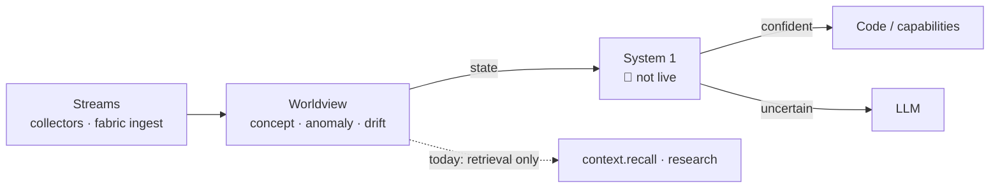
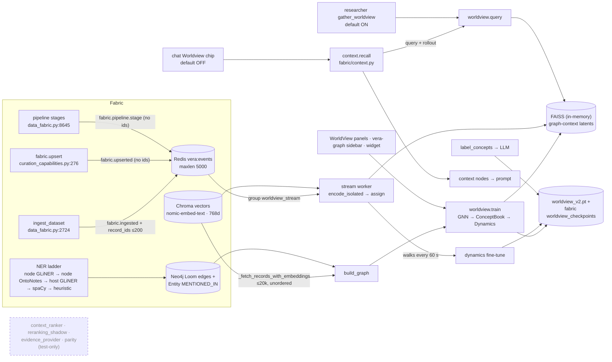

# 49 · Worldview integration — where the JEPA world model fits

> [!IMPORTANT]
> **Status: mixed — read the tags.** Sections 1–3 describe how the JEPA
> worldview is wired into Vera **today** (live, opt-in, UI-only or test-only,
> each row tagged). Sections 4–6 are a **survey of integration opportunities**
> and are **🚧 Not live — design only**: nothing in them is implemented, and no
> consumer described there exists in the code yet.

The [Worldview](11-worldview.md) page documents the world model itself — its
capabilities, training and UI. This page answers a different question: **how
does the world model fit into the rest of Vera?** What feeds it, who consumes
it, which of those paths are actually live, what is known to be wrong with them,
and where in the wider system its outputs could be used once it is healthy.

The world model supplies **state** — a record's concept and label, its latent
neighbourhood, a next-concept distribution, rollouts, counterfactuals, an
anomaly score and a drift ratio. It does **not** make judgements. Typed,
calibrated judgements (choose one of N, yes/no, score) are the job of the
proposed [System 1 decision tier](48-system-one-decision-models.md); places
where the two would compose are marked **⇄ System 1** below.

The survey was taken against the source tree on 2026-10-01. All `file:line`
references point at that revision; line numbers drift, so search for the named
function if a reference no longer lines up.

## Contents

- [1. The four tiers and where the worldview sits](#1-the-four-tiers-and-where-the-worldview-sits)
- [2. How it is wired in today](#2-how-it-is-wired-in-today)
  - [2.1 Data flow](#21-data-flow)
  - [2.2 Inputs](#22-inputs)
  - [2.3 Consumers outside `vera/worldview/`](#23-consumers-outside-veraworldview)
  - [2.4 The shadow seam is test-only](#24-the-shadow-seam-is-test-only)
  - [2.5 Outputs, events and persistence](#25-outputs-events-and-persistence)
  - [2.6 Startup wiring](#26-startup-wiring)
  - [2.7 Configuration](#27-configuration)
- [3. Model internals that matter for integration](#3-model-internals-that-matter-for-integration)
  - [3.1 Which component answers which question](#31-which-component-answers-which-question)
  - [3.2 Size versus data](#32-size-versus-data)
  - [3.3 Known limitations](#33-known-limitations)
- [4. Prerequisites before any new consumer](#4-prerequisites-before-any-new-consumer)
- [5. Integration opportunities (not live)](#5-integration-opportunities-not-live)
  - [5.1 How to read the table](#51-how-to-read-the-table)
  - [5.2 Opportunity table](#52-opportunity-table)
  - [5.3 The first moves](#53-the-first-moves)
- [6. Rejected or premature ideas](#6-rejected-or-premature-ideas)
- [7. Related pages](#7-related-pages)

---

## 1. The four tiers and where the worldview sits

Vera's design thinking separates four kinds of "thinking", ordered by cost:

| Tier | What it is | Typical latency | Good at | In Vera today |
|---|---|---|---|---|
| **Code** | Capabilities, SQL, graph queries, arithmetic | µs–ms | Exactness, enforcement, side effects | ✅ Live everywhere |
| **System 1** | A small calibrated decision model returning typed answers | tens of ms | Judgement at volume: route, rank, triage, gate | 🚧 **Not live** — see [48](48-system-one-decision-models.md) |
| **World model** | The JEPA worldview: learned state of *this* estate in latent space | ~10–100 ms | What normally follows what; anomaly; drift; neighbourhood | ⚠️ Live, but only lightly consumed (§2) |
| **LLM** | Ollama / remote models | 1 s – unbounded | Language, novelty, code, explanation | ✅ Live everywhere |

The intended composition is: **the world model supplies state, System 1
supplies judgement, code enforces, and the LLM is reached only where language
or novelty is genuinely needed.** Today only the first and last tiers carry real
load; the worldview is consumed by two retrieval paths and the operator UI.

---

## 2. How it is wired in today

### 2.1 Data flow

The dashed node has no runtime edges: it is reachable only from tests (§2.4).

### 2.2 Inputs

| Input | Source | Details |
|---|---|---|
| **Training corpus** | Chroma, via `_fetch_records_with_embeddings` (`worldview_jepa.py:1674`) | Scope is one `dataset_id`, an explicit `node_ids` list, or **all datasets**. `limit = min(limit, 50000)`, default `WORLDVIEW_MAX_NODES=20000`. No ordering and no dataset filter: an unscoped train takes whatever Chroma returns first. Record text is truncated to 200 characters in metadata. |
| **Graph edges** | Neo4j | `_fetch_loom_edges` (`:1790`) reads `FabricRecord-[SIMILAR_TO\|SHARES_TOPIC\|DERIVED_FROM\|REFERENCES\|RELATED_TO\|CO_OCCURS]->FabricRecord`. `_fetch_entity_links` (`:1812`) builds an `ENTITY_LINK` clique for every entity mentioned in 2–30 records. `_build_temporal_edges` (`:1843`) adds `TEMPORAL_NEXT` per dataset by `created_at`. `build_graph` (`:2221`) adds a self `RELATED_TO` loop per record. |
| **Entities** | Fabric NER ladder (`fabric_web_acquisition.py:944-956`) | node GLiNER → node OntoNotes → host GLiNER → spaCy → heuristic. NER quality is upstream of the entity graph, and so of the GraphEncoder's neighbourhoods. |
| **Embeddings** | Vectors already in Chroma (training); `_wv_embed` (`:2427`) for queries | Queries try `data_fabric._embed` first (5 s wait budget `VERA_EMBED_WAIT_S`, 30 s slow-cooldown, 300 s failure breaker), then fall back to a direct httpx call (30 s timeout) with `OLLAMA_EMBED_MODEL`, default `nomic-embed-text` (`vera/config.py:211`). Expected dimension `WORLDVIEW_EMBED_DIM=768`; a mismatched query returns an error, a mismatched train rebuilds the GNN input layer. |
| **Stream** | Redis stream `vera:events` (`maxlen=5000`), consumer group `worldview_stream` created at `$`, `count=20` | Filters `fabric.ingested`, `fabric.upserted`, `fabric.pipeline.stage`, `fabric.dataset.created`; `batch_size=64`; `dynamics_interval=60` s (`worldview_jepa.py:5158-5172`). Only `fabric.ingested` carries `record_ids`; `fabric.dataset.created` is never emitted anywhere in `vera/`. |
| **LLM** | `worldview.label_concepts` (`:4695`) | `ollama_generate(..., json_mode=True)` with up to 8 member texts, asking for a 2–5 word label. |

### 2.3 Consumers outside `vera/worldview/`

| Where | What it uses | Status |
|---|---|---|
| `vera/capability_orchestration.py:11370` | Loads `worldview/worldview_jepa.py`, registering all capabilities at import | ✅ Live (wiring) |
| `vera/capability_orchestration.py:7407`, `vera/sandbox_guard.py:73` | Sandboxes skip `worldview_startup_load` and read `worldview.*` through to prod | ✅ Live (sandbox policy) |
| `vera/fabric/context.py:1199-1262` (`_recall_worldview`) | `context.recall` calls `worldview.query` (text, `top_k`, `dataset_id`) and optionally `worldview.rollout`, then loads rollout members from Postgres | ✅ Live, **opt-in** — the `sources` default in `context.recall` includes `worldview` |
| `vera/chat/chat_panel.html:3537` and `:2349, 2368` | Chat's context-source set defaults to `memory, fabric, entities, urls`; the **Worldview** chip and **Rollout** checkbox are off by default. With the chip on, recall nodes join the prompt context | ⚠️ Live only when the user enables the chip |
| `vera/research/researcher_api.py:434, 3725-3761` | Researcher `worldview` data source (`top_k=15`), **enabled by default**; results become citations with `worldview://<dataset>/<id>` URLs | ✅ Live (default on) |
| `vera/research/researcher_api.py:7896-7900` | Source health probe — only checks that `worldview.query` is registered | ✅ Live (status only) |
| `vera/fabric/data_fabric.py:2722-2725` | Emits `fabric.ingested` with up to 200 `record_ids` for the stream worker | ✅ Live (feed) |
| `vera/vera_graph_panel_worldview.js`, `vera/fabric/fabric_panel.html` (WorldView tab), `vera/vera_graph.js` (Concept nodes) | Operator UI: snapshot, query, anomalies, concepts, labelling, training, loss history, sub-views; subscribes to `worldview.progress` | 🖥️ UI only |
| `vera/widgets/layouts/main.json:2511-2513`, `main-inference.json:1272-1274` | Dashboard widget fed by `worldview.stats` | 🖥️ UI only |
| `vera/vector browser/vector_browser_panel.html:983, 1191, 1255` | Calls `/worldview/reembed_missing` and `POST /worldview/diagnose` (`worldview.diagnose`, read-only; the embed-model probe reads `probe_dim`) | 🖥️ UI only |
| `vera/inventory/discovery_context_baseline.py:176-193`, `vera/inventory/context_capability_probe_review.py` | Inventory and probe metadata naming worldview providers | 📋 Metadata |
| `vera/fabric/retrieval_comparison.py:20` | `jepa_worldview_evidence` provider kind for offline comparison | 🧪 Offline |
| `vera/agents`, `vera/markets`, `vera/netmon`, `vera/mesh`, `vera/dream`, `vera/planning`, `vera/execution`, `vera/workers/syslog.py` | — | ❌ No worldview use |

So, in practice, **two paths** put worldview output in front of a model: the
research source (on by default) and chat recall (off by default). Neither checks
model health, and both swallow failures at `log.debug`
(`context.py:1224, 1259`; `researcher_api.py:3738`).

### 2.4 The shadow seam is test-only

The revision-pinned, non-authoritative path into chat context ranking is fully
written but **not reachable from runtime code**:

| Module | Status |
|---|---|
| `vera/worldview/context_ranker.py` — `WorldviewContextRanker` | Imported only by tests. `ContextRegistry.register_ranker` (`vera/context_registry.py:175`) has **no callers** in `vera/`. |
| `vera/worldview/reranking_shadow.py` — `compare_reranking_shadow` | Test-only |
| `vera/worldview/worldview_shadow_parity.py`, `worldview_shadow_snapshot.py`, `worldview_shadow_evidence.py`, `worldview_projection_adapter.py` | Test-only, or imported only by each other |
| `vera/worldview/evidence_provider.py` | Imported by `reranking_shadow.py` and tests. Never loads a checkpoint or framework — a test asserts it does not import `worldview_jepa`. |
| `vera/worldview/retrieval_adapter.py` — `JepaWorldviewRetrievalAdapter` | Test-only |
| `vera/worldview/retrieval_provenance.py` — `JepaRetrievalProvenance` | ✅ **Live**: imported by `worldview_jepa.py` and backs `worldview.retrieval.*` |
| `vera/worldview/legacy_snapshot_provenance.py` | ✅ **Live**: used inside `_fetch_records_with_embeddings` |

Chat is therefore fed only by the **unpinned** `worldview.query` / `rollout`
path through `context.recall`, not by the pinned shadow seam.

### 2.5 Outputs, events and persistence

- **Capabilities.** 38 registrations (including `worldview.diagnose`), each with a route under `/worldview/*`,
  plus `GET /ui/panels/worldview-panel`. The full table is on the
  [Worldview](11-worldview.md) page.
- **Events.** `worldview.progress` with a `stage` field (`stream_encoded`,
  `stream_dynamics`, `labelled`, per-epoch training stages). Only the UI listens.
- **Local checkpoint.** `WORLDVIEW_CHECKPOINT_DIR/worldview_v2.pt`
  (default `~/.vera/worldview/`): model and optimiser state, concept labels,
  record→concept assignments, record metadata, transition counts and up to
  20,000 cached latents.
- **Fabric copy.** Table `worldview_checkpoints(key, blob, meta, updated_at)` in
  fabric SQLite and Postgres, key `WORLDVIEW_BLOB_KEY` (default `worldview_v2`);
  loss history under `worldview_v2_loss`; sub-views under `worldview_sub_<name>`
  plus table `worldview_subviews`.
- **FAISS index.** `IndexFlatIP` over L2-normalised latents, **in memory only**;
  rebuilt from cached latents at startup.
- **Stream saves.** The stream worker saves the local checkpoint after each
  dynamics update but does not persist to the fabric.
- **Pinned retrieval.** `worldview.retrieval.bind/status/query` pin checkpoint
  bytes and index membership to a `DatasetSnapshot`. Any streaming encode
  changes the checkpoint bytes, so **while streaming runs, the pinned path is
  unavailable by design**.

### 2.6 Startup wiring

1. Import builds the `MODEL = WorldView()` and `WV_INDEX` singletons and loads
   the local `.pt` (`worldview_jepa.py:1283-1288`).
2. `schedule(_worldview_startup_load, 900, …)` registers a job that runs on the
   first scheduler tick and is one-shot via `_wv_startup_done` (the scheduler
   interval is in seconds; the code comment saying "900 ms" is inaccurate but
   harmless). Sandboxes skip it.
3. The startup load restores loss history, the FAISS index and retrieval
   provenance from a trained local checkpoint, or otherwise loads the blob from
   Postgres (falling back to SQLite); then it auto-starts the stream worker if
   the GNN has been trained.
4. `worldview.train` also auto-starts the stream and auto-labels up to 50
   concepts after training.

### 2.7 Configuration

Environment variables, with defaults from `worldview_jepa.py:162-181`:

| Variable | Default | | Variable | Default |
|---|---|---|---|---|
| `WORLDVIEW_EMBED_DIM` | `768` | | `WORLDVIEW_DYN_DIM` | `192` |
| `WORLDVIEW_LATENT_DIM` | `256` | | `WORLDVIEW_DYN_HEADS` | `4` |
| `WORLDVIEW_HIDDEN_DIM` | `512` | | `WORLDVIEW_DYN_LAYERS` | `3` |
| `WORLDVIEW_GNN_LAYERS` | `2` | | `WORLDVIEW_DYN_CTX` | `32` |
| `WORLDVIEW_NUM_CONCEPTS` | `512` | | `WORLDVIEW_LR` | `3e-4` |
| `WORLDVIEW_VQ_DECAY` | `0.99` | | `WORLDVIEW_BATCH_SIZE` | `128` |
| `WORLDVIEW_VQ_COMMIT` | `0.25` | | `WORLDVIEW_MAX_NODES` | `20000` |
| `WORLDVIEW_MAX_WALKS` | `20000` | | `WORLDVIEW_WALK_LEN` | `16` |
| `WORLDVIEW_CHECKPOINT_DIR` | `~/.vera/worldview` | | `WORLDVIEW_BLOB_KEY` | `worldview_v2` |
| `WORLDVIEW_STREAM_AUTOSTART` | `1` | | | |

BLAS thread pools (`OPENBLAS/MKL/OMP_NUM_THREADS`) default to 2, with
`torch.set_num_threads(2)` and one interop thread. The device is CUDA if
available, otherwise CPU.

> [!WARNING]
> The architecture keys (`latent_dim`, `hidden_dim`, `num_gnn_layers`,
> `num_concepts`, `vq_*`, `dyn_*`, `target_ema_decay`) cannot change at
> runtime: the model is built once at import from the environment, and the
> target-encoder EMA is fixed at 0.996. `worldview.config_set` does not store
> them; it returns them under `rejected` with a `warning`. Resizing the model
> means changing the environment, restarting and retraining. A checkpoint with a
> different concept count is refused at load.

---

## 3. Model internals that matter for integration

### 3.1 Which component answers which question

| Question a consumer asks | Component | Capability |
|---|---|---|
| Which records are near this text? | GraphEncoder latent + FAISS | `worldview.query`, `worldview.retrieval.query` |
| Which concept is this? | ConceptBook (VQ codebook) | `worldview.encode`, `worldview.explain_record` |
| What usually comes next? | DynamicsTransformer | `worldview.predict`, `worldview.rollout` |
| What if this concept were different? | DynamicsTransformer | `worldview.counterfactual` |
| Is this record unusual? | Codebook distance + transition likelihood | `worldview.anomalies` |
| Has this dataset shifted? | Concept share ratios | `worldview.detect_drift` |

> [!NOTE]
> The JEPA predictor and its EMA target encoder are a **training-time
> regulariser** for the GraphEncoder only (smooth-L1 between the predicted and
> stop-gradient target latents, weight 1.0, alongside a contrastive loss and
> VICReg at weight 0.5). No capability exposes latent prediction:
> `predict`, `rollout` and `counterfactual` all come from the
> DynamicsTransformer.

### 3.2 Size versus data

| Part | Parameters (from layer shapes) |
|---|---|
| GraphEncoder GNN | ≈ 6.30 M |
| EMA target GNN (frozen copy) | ≈ 6.30 M |
| JEPA predictor | ≈ 0.53 M |
| DynamicsTransformer | ≈ 1.44 M |
| Codebook buffer | 512 × 256 |
| **Trainable total** | **≈ 8.3 M** |

A production reading on 2026-09-22 showed 2,299 records assigned, 512 concepts
and 716 distinct transitions. That is about 3.6k trainable parameters per
record and about 4.5 records per concept: the model is far larger than the data
it has seen. Treat any downstream use as unproven until it is right-sized and
measured (§4).

### 3.3 Known limitations

These are current behaviours, verified in the code, that any consumer must
account for:

| Limitation | Where | Effect |
|---|---|---|
| Transition counts come only from synthetic random walks | `generate_walks` (`:2333`, cleared at `:2405`) | "Observed" transitions are walk statistics, not record-to-record events |
| Train/serve skew | index built with `encode_subgraph`; queries, stream and predict use `encode_isolated` | A query vector without edges is compared to vectors computed with their neighbourhoods |
| `predict` and `landscape` condition on `[BOS, c]` only | `:3909` area | Effectively a first-order transition table |
| `anomalies` covers only the last training graph | `:4226` | Streamed records are never scored; after a restart each call rebuilds the graph from Chroma and Neo4j |
| `detect_drift` is a ratio with fixed thresholds (>2.0 or <0.3) | `:4865` | No significance test, no time window |
| The id-less fallback reads in Chroma insertion order | `:5210-5216` | Misses new records |
| Content-changing upserts are not re-encoded | stream worker | Assignments go stale |
| Consumer group created at `$` on a `maxlen=5000` stream | stream worker | Lag silently drops events |
| Vector backfills are not stream-encoded | stream filters | `fabric.backfill` events carry counts only (no record ids or `dataset_id`), so they are not subscribed; run `worldview.rebuild_index` after a backfill |
| Training runs inside the orchestrator process on the host CPU | `:3495-3503` | Contends with request handling; contradicts the "no ML runtime on the host" principle stated in `edge/nlp_server.py` |

> [!NOTE]
> Fixed, and removed from this table: the stream fine-tune no longer adds its
> sampled walks back into `transition_counts`; training no longer adds pairs
> from Chroma's return order; the stream worker encodes every `record_id` of an
> event (in `batch_size` batches) before acknowledging it; a training run that
> trains the codebook clears concept labels (auto-label then relabels up to
> 50); `worldview.counterfactual` takes an optional `seed`, shares the
> baseline's steps before the swap and continues both timelines with the same
> seed, and no longer repeats `swap_to` in its prefix; `worldview.summarise`
> no longer promises anomalies.

---

## 4. Prerequisites before any new consumer

> [!IMPORTANT]
> **🚧 Not live — design only.** None of the items below exists yet.

1. **A health contract.** Today the capabilities return error dicts that
   consumers log at debug level, and `worldview.stats` reports raw counters with
   no verdict. A `worldview.health` capability should return
   `ok | degraded | stale | untrained` with reasons, computed from index size
   versus records assigned, fabric coverage, held-out next-concept loss against
   a unigram baseline, codebook perplexity relative to K, records per concept
   (fail below roughly 20), the share of labels older than the last codebook
   training, stream lag on `worldview_stream`, and checkpoint age. Every
   consumer checks and displays it.
2. **Fix the correctness defects in §3.3** before trusting any output — above
   the train/serve skew (the self-reinforcing stream loop and the Chroma-order
   transitions are fixed).
3. **Right-size the model.** Roughly K = 64–128 concepts, hidden 256, one GNN
   layer, a held-out split and a records-per-concept floor. Because
   `config_set` cannot resize the model, this is an environment change,
   restart and retrain, under a new blob key.
4. **Curate the corpus.** An unscoped train reads whatever Chroma returns,
   including Vera's own telemetry and conversation datasets (`bus.*`, `ts.*`,
   `chat.messages`, `dream.reports`, agent and research job records). Add
   worldview-specific include/exclude lists, applied both to training and to the
   stream worker, excluding self-telemetry by default.
5. **Accept the embedding constraint.** Query-time embedding is on the request
   path, and a recall with rollout embeds the same query twice. The node
   `nlp.embed` model is 384-dimensional (`vera/research/nlp_dispatch_core.py:70`),
   so it cannot replace the 768-dimensional space. Train on a curated,
   already-embedded subset rather than chasing full-fabric coverage.
6. **Move training off the request path.** Run training as an idle-queue job or
   on a node; keep only inference and assignment on the host; stop the stream's
   self-training.

---

## 5. Integration opportunities (not live)

> [!IMPORTANT]
> **🚧 Not live — design only.** Every row below is a proposal. The "hook" column
> names the existing code a change would touch; it does not mean the
> integration exists.

### 5.1 How to read the table

- **Primitive** — the worldview output used: *concept*, *neighbourhood*,
  *predict*, *rollout*, *counterfactual*, *anomaly*, *drift*.
- **Needs** — how good the model must be first:
  - **Q0** works on today's model (mostly honesty and plumbing fixes);
  - **Q1** needs the §4 health contract and a right-sized retrain that beats a
    baseline on held-out next-concept accuracy;
  - **Q2** additionally needs calibrated anomaly or rollout scores.
- **⇄ System 1** — worldview state becomes the input to a
  [System 1](48-system-one-decision-models.md) decision.

### 5.2 Opportunity table

| Opportunity | Hook (existing code) | Primitive | What it changes | Needs | How it would be graded | Risk | Priority |
|---|---|---|---|---|---|---|---|
| **Recall fails loudly** | `vera/fabric/context.py:1199, 1223-1224, 1258-1259` | neighbourhood | Surface worldview errors and "not ready" in recall diagnostics instead of returning nothing silently | Q0 | Share of recall calls with a visible worldview error | Low | **P1** |
| **Health-gated research source** | `vera/research/researcher_api.py:434, 3725-3761` | neighbourhood | The default-on source checks health, or switches to the pinned `worldview.retrieval.query` | Q1 | Citation keep-rate; latency per job | Adds an embed per job | **P1** |
| **Truthful dashboard widget** | `vera/widgets/layouts/main.json:2511-2520` | health | Show the health verdict instead of raw counts | Q0 | Operators notice degradation | None | **P1** |
| **Dreaming as offline consolidation** | `vera/dream/dream_capabilities.py:13482` (`_scheduler_loop`), `:9523` (`_run_cycle`); `vera/idle_queue.py:55-80` | rollout, concept, drift | Replace the stream's self-training with an idle-gated job: retrain on real temporal walks, re-cluster, relabel moved concepts; the LLM narrates what changed | Q1 | Held-out next-concept accuracy before/after; label stability | CPU/GPU contention | **P1** (training fix) / P2 (narration) |
| **With/without-worldview retrieval benchmark** | `vera/fabric/retrieval_comparison.py:20`; `tests/test_discovery_benchmark.py:81` | neighbourhood | Run the existing ablation on fixed fixtures before activating any retrieval use | Q1 | nDCG / recall at equal latency | None (offline) | **P1** |
| Concept-neighbourhood candidates for chat | `vera/fabric/context.py:1199-1262`; `chat_panel.html:3537` | concept, neighbourhood | Replace rollout "members" (the first three records per concept) with the query concept's members ranked by similarity | Q1 | Pin/include rate on worldview context nodes; answer rating | Off-topic context | P2 |
| Shadow reranking, then live | `vera/context_registry.py:175`; `vera/worldview/context_ranker.py`; `reranking_shadow.py` | neighbourhood score | Produce shadow reports first without registering the ranker; promote only on measured uplift | Q1 + pinned retrieval | Changed positions vs pins/clicks | Pinning breaks while streaming | P2 |
| Dream sensors for anomaly and drift | `vera/dream/dream_capabilities.py:203` (`_register_sensor`), `:10301` (`_eval_trigger_sensors`) | anomaly, drift | Add `worldview_anomaly` / `worldview_drift` sensors so triggers react to the world changing, not only to time and idleness | Q2 | Usefulness of sensor-triggered reports vs timer-triggered | False positives | P2 |
| Event-driven director thoughts **⇄ System 1** | `vera/dream/dream_capabilities.py:12632-12634`; `_director_think_once` `:11179` | anomaly, drift → yes/no "worth a thought?" | Think when the world changed, keeping the fixed cadence as a floor | Q2 | Thoughts delivered vs found useful | Spam if uncalibrated | P2 |
| Post-ingest drift check | `vera/fabric/data_fabric.py:2737` (`_post_ingest_pipeline`) | drift | Rate-limited `worldview.detect_drift` after ingest | Q1 | Drift alerts an operator confirms | Noise on small datasets | P2 |
| Collector novelty | `vera/fabric/data_fabric_collectors.py:496, 623, 710` (CVE, arXiv, HN) | concept, drift | Flag records landing in sparse concepts; feed a dream sensor or briefing | Q1 | Novel-topic flags the user opens | Low | P2 |
| Read-only tools for the ontologist agent | `vera/agents/agents.py:4305` (`domain_caps`) | landscape, concepts, drift | Add `worldview.landscape`, `worldview.concepts`, `worldview.detect_drift` | Q1 | Agent task ratings | Trusting noisy concepts | P2 |
| World-state features for System 1 **⇄ System 1** | `vera/evolve/delegate_trajectory_core.py` | concept, anomaly | Add a compact concept / anomaly vector to the decision model's input state | Q1 | Calibration with vs without (ablation) | Concept ids change on retrain | P2 |
| Director/narrator "world state" briefing | `vera/dream/dream_capabilities.py:10924` (`_director_briefing`), `:12344` | concept, drift | A short "what moved in the fabric" block in the briefing | Q1 | Thought quality rating; tokens added | Prompt bloat; stale labels | P3 |
| Syslog novelty gate **⇄ System 1** | `vera/workers/syslog.py:637-690` (`_run_monitor_check`) | anomaly → yes/no "novel?" | Skip the LLM for error batches that look routine | Q2 + a syslog sub-view | LLM calls avoided vs incidents missed | Suppressing a real incident | P3 |
| Concept labels as GLiNER label proposals | `vera/fabric/fabric_web_acquisition.py:912, 4849` | concept labels | Offline, human-reviewed proposals only — never automatic | Q1 + stable labels | Entity precision on a fixed sample | Feedback loop | P3 |
| Loom link proposals | `vera/fabric/data_fabric.py:6722, 9777` | neighbourhood | Same-concept, cross-dataset link candidates for review | Q1 | Accepted-link rate | Circular (Loom edges are inputs) | P3 |
| Calendar rhythm | `vera/calendar/calendar_capabilities.py:1472` | predict, anomaly (sub-view) | "This week is unusual" in the briefing | Q2 | User confirms the flag | Privacy; tiny corpus | P3 |
| Conversation-topic drift | `vera/telegram/telegram_capabilities.py:460`; `chat.messages` | concept, drift | Sub-view for topic shift | Q1 | Topic-shift flags | Self-reference | P3 |
| Markets: news-concept drift as a feature | `vera/markets/markets_lab_capabilities.py:1241`; `markets_studio_capabilities.py:2472` | drift (news only) | An exogenous feature for regime models — never price regimes from this model | Q2 | Backtest uplift in an ablation | Look-ahead leakage | P3 |
| Mail rhythm | — (mail is not ingested into the fabric) | — | Needs a mail → fabric dataset first | — | — | Privacy | P3 (blocked) |

### 5.3 The first moves

The P1 rows share a theme: **make the world model honest before making it
important.** Concretely, in order:

1. Add the health contract and wire it into recall, the research source and the
   dashboard widget, so failures and weak models are visible.
2. Move training to an idle-gated job (the stream's self-training loop and
   the spurious transitions are already fixed) — which is also the natural shape of
   "dreaming as consolidation".
3. Right-size and retrain on a curated corpus with a held-out split.
4. Run the existing with/without-worldview retrieval benchmark. Only if it shows
   uplift at acceptable latency should any retrieval use be promoted, starting
   with shadow reranking.

Each step has a natural **kill criterion**: if a right-sized model on a curated
corpus cannot beat a unigram baseline on held-out next-concept prediction, or
the retrieval benchmark shows no uplift, the worldview should stay an operator
exploration tool and not be promoted into chat or decisions.

---

## 6. Rejected or premature ideas

| Idea | Why not (now) |
|---|---|
| **Planning by rollout or counterfactual** | The dynamics model predicts fabric *topic* concepts from synthetic walks. It has no action conditioning and no plan-step vocabulary, and even with a shared seed a counterfactual only shows how a synthetic-walk model reacts to a swapped topic. Scoring plans with it would be noise presented as foresight. |
| **Network and IoT normality on this model** | Network presence and sensor readings are numeric and categorical; netmon keeps them in its own graph. The worldview's input is a text embedding plus graph edges, and pushing numeric rows through the text embedder pollutes the corpus. These need a separate small numeric model. |
| **"Green but wedged" detection from the fabric model** | The `cap.call` stream is self-telemetry, which must not enter the fabric model's training loop. If pursued, it should be a separate sequence model over capability names and latencies. |
| **A `sense.*` stream-normalisation family as a worldview dependency** | No `sense.*` capability exists. Design that family first; the worldview should consume its normalised output, not raw streams. |
| **Automatic GLiNER label feedback** | Concept labels → NER labels → entities → entity edges → concepts is self-reinforcing, and `fabric.entity_graph.ner_labels` changes process-wide state without persisting it. Only reviewed offline proposals are acceptable. |
| **Activating `WorldviewContextRanker` live now** | Pinned retrieval cannot hold while streaming mutates the checkpoint, and the model fails the §4 bar. Shadow first, with the benchmark. |
| **Market price regimes from the worldview** | Only exogenous news-concept drift, as one feature, is defensible. |
| **Full-fabric coverage as a goal** | At the measured serial embedding rate this is a multi-week job, and the gain is unproven until the benchmark shows uplift on a curated subset. |

---

## 7. Related pages

- [11 · Worldview](11-worldview.md) — the model, its capabilities and UI
- [48 · System 1 decision models](48-system-one-decision-models.md) — the
  proposed judgement tier that would consume worldview state (not live)
- [06 · Data fabric](06-data-fabric.md) — records, embeddings, Loom and the NER
  ladder that feed the worldview
- [05 · Memory graph](05-memory-graph.md) and [19 · Agents and chat](19-agents-chat.md)
  — context recall and the chat context sources
- [07 · Research](07-research.md) — the researcher's worldview data source
- [17 · Dream](17-dream.md) — sensors, the director and the narrator
- [30 · ONNX](30-onnx.md) — the node NLP tier and its embedding model
