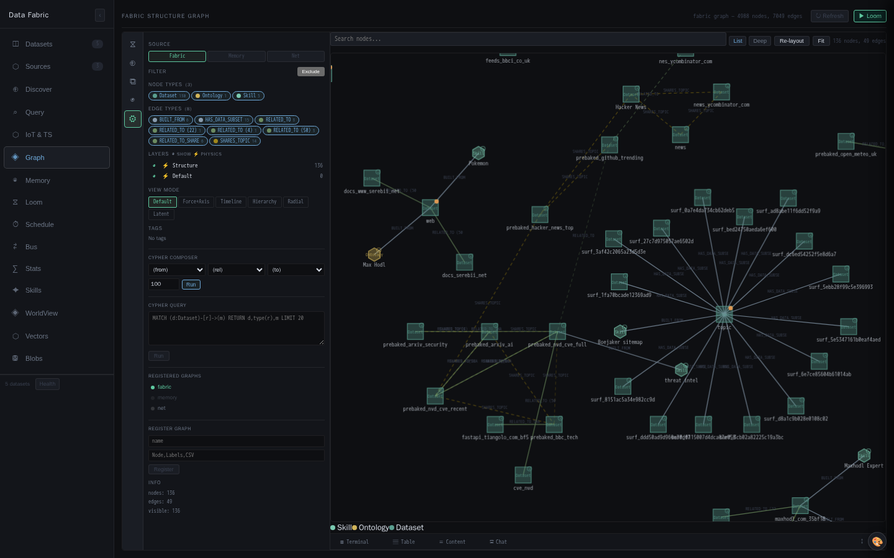

# Vera — Visual gallery

Auto-generated gallery. Each card links to the authored write-up for that domain;
screenshots are captured by the **operator** (`operator.mission.run
documentation`) against a loop-lab sandbox and refreshed in place.

> Regenerate: `python tools/vera-docgen/docgen.py run`  ·  or the capability
> `docs.build`. Only the images and reference tables are regenerated — authored
> prose is preserved.

*Last generated: 2026-08-21 00:29 UTC*
**1 domains · 5 screenshots · 2122 capabilities**

| Domain | Preview | Capabilities |
|---|---|---|
| [**Data Fabric**](06-data-fabric.md) |  | 162 |
