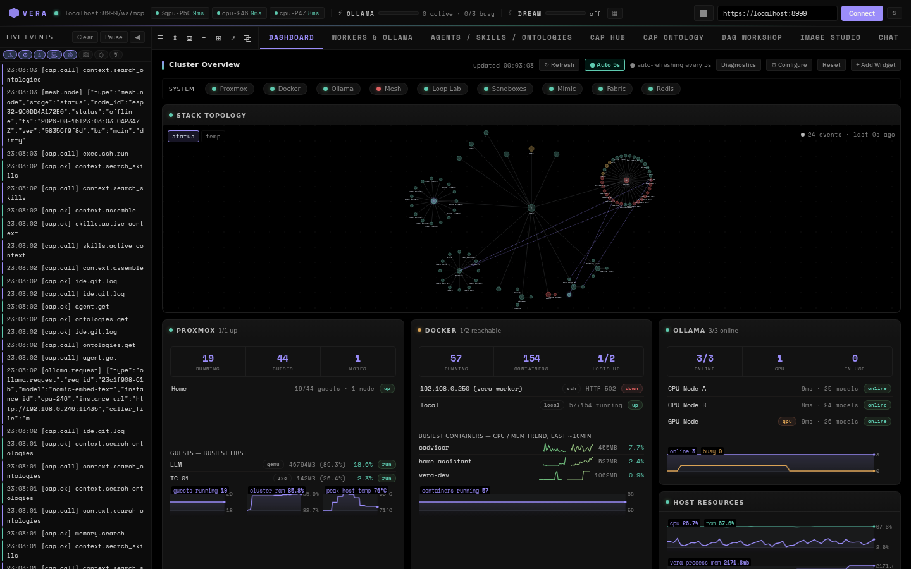
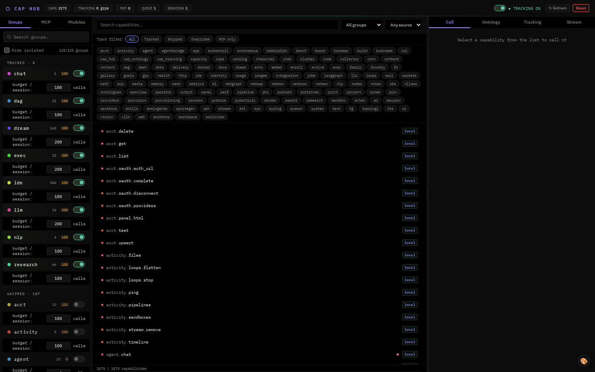
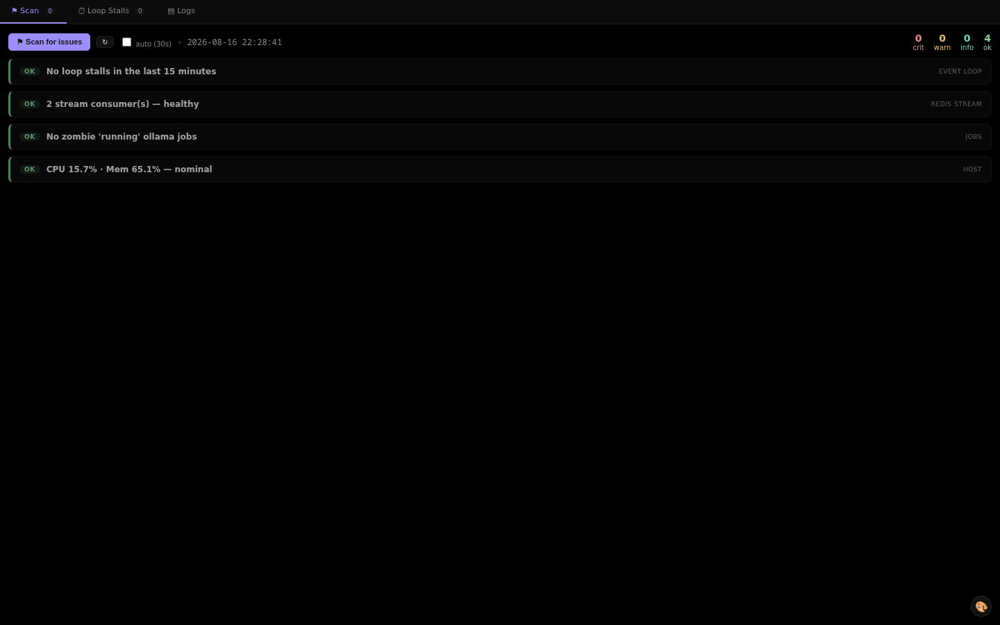
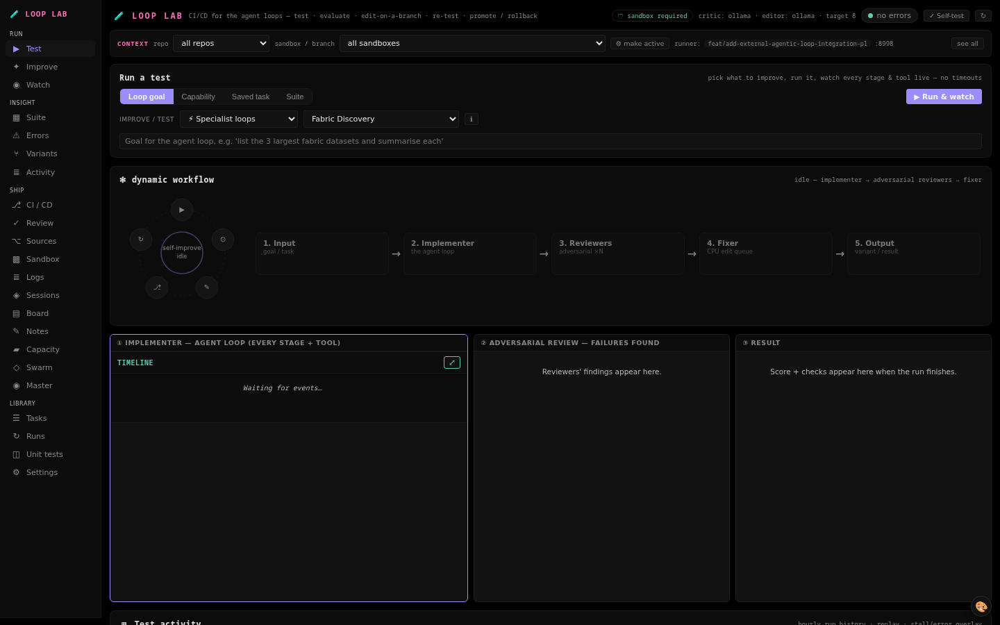
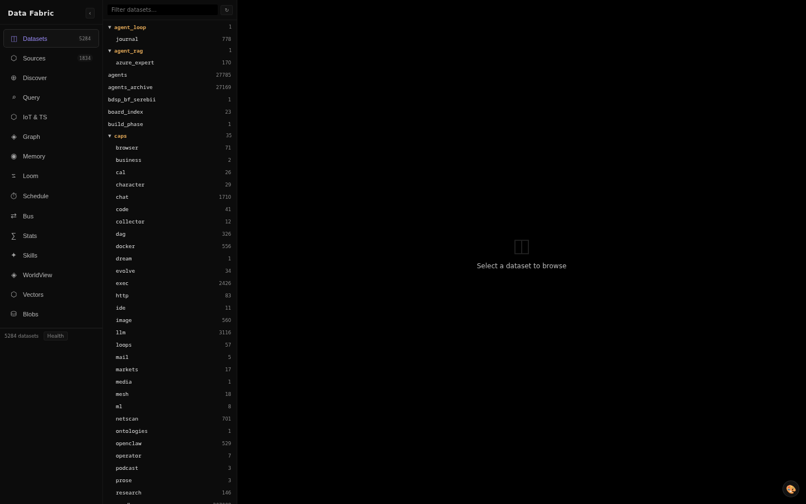

# Vera documentation

Welcome to the map of Vera. Start with a goal below, then move into the numbered
reference guides when you need implementation details.

> [!TIP]
> New to Vera? Read the [project overview](../README.MD), check
> [performance and sizing](00-performance-and-sizing.md), and follow
> [Getting started](../docs/GETTING_STARTED.md).

## See Vera

These screenshots were captured from the running Vera UI with Operator on
2026-08-16. They are stored in the repository, so they render on GitHub and in
offline documentation.

| Main dashboard | Capability Hub |
|---|---|
| [](assets/overview/dashboard.png) | [](assets/overview/cap-hub.png) |

| Performance Monitor | Loop Lab |
|---|---|
| [](assets/overview/perf-monitor.png) | [](assets/overview/evolve.png) |

| Data Fabric | Agent Loop Graph |
|---|---|
| [](assets/overview/fabric-panel.png) | [](assets/overview/loop-graph.png) |

## Choose a path

### Learn the platform

1. [Capability framework](01-capability-framework.md)
2. [Harness UI](02-harness-ui.md)
3. [DAG and loop engine](03-dag-engine.md)
4. [Configuration](10-configuration.md)

### Run models and distributed work

- [Performance and sizing](00-performance-and-sizing.md)
- [Ollama cluster](04-ollama-cluster.md)
- [Execution](12-execution.md)
- [Docker](13-docker.md)
- [vLLM](21-vllm.md)
- [Workers, jobs, and syslog](22-workers-jobs-syslog.md)

### Build knowledge systems

- [Memory graph](05-memory-graph.md)
- [Data fabric](06-data-fabric.md)
- [Research](07-research.md)
- [Galaxy graph](09-galaxy-graph.md)
- [Worldview](11-worldview.md)
- [Skills and ontologies](18-skills-ontologies.md)
- [Vector browser](25-vector-browser.md)

### Build agents and interfaces

- [Agents and chat](19-agents-chat.md)
- [Agent runtimes and providers](36-agent-runtimes-providers.md)
- [Flow Builder](20-flow-builder.md)
- [UI Builder](26-ui-builder.md)
- [Media and characters](38-media-characters.md)
- [Operator](34-operator.md)

### Operate and extend Vera

- [IDE and remote development](08-ide.md)
- [Infrastructure and provisioning](35-infrastructure-provisioning.md)
- [Activity and boards](39-activity-boards.md)
- [Business and commerce](37-business-commerce.md)
- [Integrations](23-integrations.md)
- [Web browser](24-web-browser.md)
- [Security](29-security.md)
- [Cluster encryption](32-cluster-encryption.md)
- [Loop Lab](33-evolve.md)

## Complete guide index

| # | Guide | Scope |
|---:|---|---|
| 00 | [Performance and sizing](00-performance-and-sizing.md) | Hardware planning, runtime thresholds, benchmarks, and SLOs |
| 01 | [Capability framework](01-capability-framework.md) | Registration, schemas, modes, events, and invocation |
| 02 | [Harness UI](02-harness-ui.md) | Panels, custom elements, and UI extension |
| 03 | [DAG and loop engine](03-dag-engine.md) | Workflows, planners, supervision, and loop profiles |
| 04 | [Ollama cluster](04-ollama-cluster.md) | Nodes, models, routing, health, and shared GPU policy |
| 05 | [Memory graph](05-memory-graph.md) | Sessions, recall, graph traversal, and retention |
| 06 | [Data fabric](06-data-fabric.md) | Ingestion, vectors, graphs, SQL, objects, and context |
| 07 | [Research](07-research.md) | Search, deep research, notebooks, and projects |
| 08 | [IDE and remote](08-ide.md) | Workspaces, coding agents, inspection, and code-server |
| 09 | [Galaxy graph](09-galaxy-graph.md) | Interactive graph visualization |
| 10 | [Configuration](10-configuration.md) | Environment, backend endpoints, and runtime settings |
| 11 | [Worldview](11-worldview.md) | Representation learning, concepts, prediction, and drift |
| 12 | [Execution](12-execution.md) | Shell, PowerShell, SSH, and code execution |
| 13 | [Docker](13-docker.md) | Hosts, containers, images, and operations |
| 14 | [Mesh Manager](14-mesh.md) | ESP32 nodes, telemetry, firmware, screens, and radio tools |
| 15 | [Markets and Quant Studio](15-markets.md) | Market data, strategies, simulation, and evolution |
| 16 | [Machine learning](16-machine-learning.md) | Training and model workshop |
| 17 | [Dream](17-dream.md) | Background reflection and autonomous projects |
| 18 | [Skills and ontologies](18-skills-ontologies.md) | Reusable instructions and domain models |
| 19 | [Agents and chat](19-agents-chat.md) | Personas, conversations, tools, and retrieval |
| 20 | [Flow Builder](20-flow-builder.md) | Visual workflows |
| 21 | [vLLM](21-vllm.md) | OpenAI-compatible serving and model management |
| 22 | [Workers, jobs, and syslog](22-workers-jobs-syslog.md) | Distributed work, job recovery, events, and logs |
| 23 | [Integrations](23-integrations.md) | Accounts, mail, calendar, Telegram, and external apps |
| 24 | [Web browser](24-web-browser.md) | Fetching, crawling, Playwright, and browser automation |
| 25 | [Vector browser](25-vector-browser.md) | Chroma/FAISS inspection and audits |
| 26 | [UI Builder](26-ui-builder.md) | Themes, panels, and capability access |
| 27 | [OpenClaw](27-openclaw.md) | External agent gateway |
| 28 | [Render and media](28-render.md) | Documents, Mermaid, HTML, charts, and galleries |
| 29 | [Security](29-security.md) | Secrets and access boundaries |
| 30 | [ONNX](30-onnx.md) | ONNX workflows |
| 31 | [Podcast](31-podcast.md) | Script and audio generation |
| 32 | [Cluster encryption](32-cluster-encryption.md) | Encrypted cluster communication |
| 33 | [Loop Lab](33-evolve.md) | Isolated changes, tests, review, and promotion |
| 34 | [Operator](34-operator.md) | Browser observation, action, missions, and captures |
| 35 | [Infrastructure and provisioning](35-infrastructure-provisioning.md) | Foundry builds, hosts, networking, Proxmox, and fleet provisioning |
| 36 | [Agent runtimes and providers](36-agent-runtimes-providers.md) | Runtime bridges, provider adapters, catalogs, and agent frameworks |
| 37 | [Business and commerce](37-business-commerce.md) | Products, inventory, listings, orders, and external side effects |
| 38 | [Media and characters](38-media-characters.md) | Images, characters, sprites, speech, and media assets |
| 39 | [Activity and boards](39-activity-boards.md) | Activity history, work boards, claims, and coordination |

## Operations and engineering history

- [Planner drift postmortem](postmortems/2026-08-06-agentic-loop-planner-drift.md)

Local planning specifications under `documentation/specs/` are intentionally
excluded from Git. The numbered guides and runtime capability schemas are the
published source for current operator-facing behavior.

## Screenshot maintenance

Screenshots are produced by Vera's Operator, not hand-composited:

```bash
python tools/vera-docgen/docgen.py run --sandbox
```

Equivalent capabilities are `docs.build`, `docs.capture`, and
`operator.screenshot`. Capture against an isolated sandbox whenever possible;
use live only for read-only documentation evidence. Always inspect images,
verify their repository-relative links, and record the capture date.
