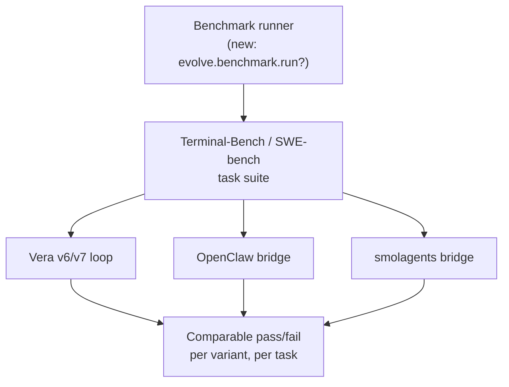

# External Agentic-Loop Integration

*Plan for adding independent, open-source loop implementations as selectable, benchmarkable alternatives to Vera's own v1–v8 loops.*

**Status (2026-08-16):** Phases 1 and 2 landed on `bleeding-edge` (OpenClaw and smolagents wired into the chat UI's `loopVariant` dropdown, each as an independent, opt-in bridge). Phases 3–4 (benchmark runner, LangGraph/OpenHands) not started. The earlier OpenClaw-integration plan referenced in conversation could not be located when this was written — no matching doc in `documentation/`, no deleted-file trace in git history, no mention in `consolidated-route-forward.md` — this was built as a fresh plan rather than a recovery.

---

## 1. Goal and constraint, restated precisely

Add one or more **external, open-source agentic-loop systems** to Vera, such that:

1. They are selectable from the chat UI's Loop pane — the same `loopVariant` dropdown that currently lists `v1`–`v8` (`vera/chat/chat_panel.html`).
2. **Nothing in Vera's own v1–v8 loop code depends on them.** The dependency arrow points one way: the chat UI (or a benchmark runner) can *call out* to an external system, but `dag_workshop_capabilities.py` never imports, calls, or assumes one exists.
3. Because of (2), the same task/goal can be run through Vera's own loop *and* an external one, and the two results compared — the actual point of doing this.

This is the same shape as the existing OpenClaw bridge (`vera/openclaw/openclaw_capabilities.py`) — proof the pattern already works in this codebase.

---

## 2. Architecture: the bridge pattern, generalized

Vera already has exactly one working example of "external agent system, kept outside the loop, opt-in": OpenClaw.

```mermaid
graph LR
    subgraph vera["Vera process"]
        UI["Chat UI\nloopVariant dropdown"]
        V6["dag_workshop_capabilities.py\nv1–v8 (Vera's own loop)"]
        BRIDGE["openclaw_capabilities.py\n(bridge module)"]
    end
    subgraph external["External process"]
        OC["OpenClaw gateway\n(WS, protocol v3)"]
    end
    UI -- "variant = v6" --> V6
    UI -- "variant = openclaw" --> BRIDGE
    BRIDGE -- "prompt / stream" --> OC
    OC -. "tool calls back via\n/openclaw/call HTTP" .-> vera

    style V6 fill:#2a2f3a,stroke:#6b7280
    style BRIDGE fill:#1f3a3a,stroke:#4fb3b3
    style OC fill:#1f3a3a,stroke:#4fb3b3
```

The bridge module is a **capability wrapper, not a loop reimplementation**: it owns a connection to an external process, translates Vera's stream-event shape at the boundary, and is entirely optional (`OPENCLAW_ENABLED=0` by default, a no-op if unset). `dag_workshop_capabilities.py` has zero references to it. This is exactly the shape every new integration should copy — and the shape `vera/smolagents/smolagents_capabilities.py` (Phase 2) copied it into: a Docker-container bridge instead of a WS-gateway bridge, same non-dependency on v1–v8.

**What changes per new system:** a new `vera/<name>/<name>_capabilities.py` bridge module, one new capability (e.g. `smolagents.run`), and one new `<option>` in the `loopVariant` `<select>` mapping to it.

---

## 3. Candidate systems

Researched against two criteria: (a) genuinely **primitive/proven**, not just another orchestration platform, and (b) realistic to bridge without vendoring a large runtime into Vera's own process.

| System | Shape | Why it's a candidate | Integration cost |
|---|---|---|---|
| **OpenClaw** | External gateway process (already bridged) | Per current research, the most widely-adopted open-source agent framework as of 2026 — extensible tool system, permissive backend gateway. Vera already speaks its protocol. | **Low** — bridge existed; only the UI dropdown wiring was missing. **Done (Phase 1).** |
| **smolagents** (Hugging Face) | Python library, ~1,000 LOC core | Deliberately minimal, auditable ReAct loop. Distinctive design choice worth having as a comparison point: agent actions are **Python code it writes and executes**, not JSON tool-calls — a genuinely different paradigm from every one of Vera's v1–v8 (all JSON-schema-based). | **Medium** — runs in a fresh, throwaway Docker container per invocation (`vera/smolagents/Dockerfile.smolagents`), never in Vera's own process. **Done (Phase 2).** |
| **LangGraph** | Python library, graph-based orchestration | The heaviest, most production-proven of the general frameworks (part of the broader LangChain ecosystem) — the "if you want the industry-standard baseline" option. | **Medium–High** — graph-based state machine, more surface to bridge cleanly than smolagents' flat loop. Not started. |
| **OpenHands** (fka OpenDevin) | Full platform, own sandbox/GUI | Coding-agent-specific, SWE-bench-oriented. Useful mainly if the benchmark focus becomes *code* tasks specifically. | **High** — wants its own container/GUI stack. Not started. |
| **AutoGen / CrewAI** | Multi-agent orchestration libraries | Multi-agent-first design (agents talking to agents) — a different axis from single-loop comparison. | Medium, out of scope until multi-agent comparison specifically becomes a goal. |

---

## 4. The other half: an actual benchmark, not just side-by-side chat

Selecting different variants in the same dropdown lets a human eyeball two transcripts — useful, but not what "benchmark Vera's own loop" should mean. The rigorous version needs a **fixed task suite with a scoring rubric**, run identically across every variant. Not started (Phase 3).

Two standard, open, already-proven harnesses fit:

- **Terminal-Bench** — command-line task suite, designed to plug in arbitrary agents for evaluation. Good fit: Vera's own loop already has strong `exec.bash.run`/`exec.python.run` support.
- **SWE-bench** — real GitHub issues + PRs, code-fix tasks with pass/fail test verification. Good fit if code-authoring loop quality specifically is the thing being compared.

Either can be adopted the same way as the loop backends themselves: an **external harness that calls Vera's capabilities as one more thing under test**, not code Vera imports. Concretely: a small runner (could live in Loop Lab, next to `evolve.suite.run`) that, for each benchmark task, invokes the task once per selected variant (`v6`, `v7`, `openclaw`, `smolagents`, …) via the same capability boundary, and records the harness's own pass/fail.

---

## 5. Phased plan

**Phase 1 — OpenClaw in the dropdown** — **done.** `openclaw` entry in `loopVariant`, `_sendOpenClawLoop()` dispatched from `sendAgentLoop()`, mirrors `openclaw_panel.html`'s already-working `openclaw.stream`/`openclaw.response` SSE contract. `dag_workshop_capabilities.py` untouched.

**Phase 2 — smolagents bridge** — **done.** `vera/smolagents/` (Dockerfile + entrypoint + capabilities module), opt-in via `SMOLAGENTS_ENABLED=1`, runs in a dedicated Docker image (`vera-smolagents`, separate from `vera:latest`) — resolved the "subprocess vs Docker vs hosted executor" open question below in favor of Docker. `smolagents` entry in `loopVariant`, `_sendSmolagentsLoop()` (non-streaming, mirrors the existing v8 pattern). Verified end-to-end against Vera's real GPU Ollama instance.

**Phase 3 — benchmark runner** — not started.
- Adopt Terminal-Bench's task format first (best fit for Vera's exec-heavy toolset).
- Build the runner as a Loop Lab extension (`evolve.benchmark.*`, alongside the existing `evolve.suite.*`).
- First comparison run: Vera v6 vs. v7 vs. OpenClaw vs. smolagents, same task set, side-by-side pass rates.

**Phase 4 (later, optional)** — LangGraph and/or OpenHands, once the benchmark runner exists to make a third/fourth entrant low-marginal-cost.

---

## 6. Open questions

- ~~Sandbox story for smolagents~~ — **resolved:** dedicated Docker container per invocation.
- **Benchmark task volume** — Terminal-Bench/SWE-bench suites can be large; worth deciding a starter subset (e.g. 10–20 tasks) rather than the full suite on day one.
- **Where results live** — fold into the existing `evolve.suite` scoreboard, or a genuinely separate view, given these compare *systems*, not just *branches*.
